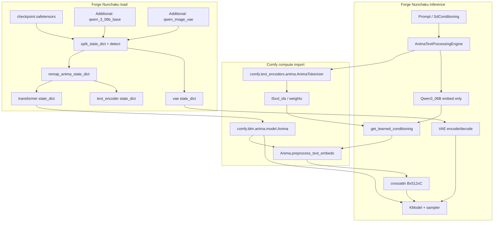

<table align="center">
  <tr>
    <td align="center" bgcolor="#3478ca" width="88" height="36"><font color="#ffffff"><b>EN</b></font></td>
    <td align="center" bgcolor="#e5e7eb" width="88" height="36"><a href="https://github.com/ussoewwin/Stable-Diffusion-WebUI-Forge-Nunchaku/blob/main/zhmd/v1.7.1.md"><font color="#4b5563"><b>中文</b></font></a></td>
  </tr>
</table>

## Table of contents

1. [Summary of changes](#1-summary-of-changes)
2. [Why import from ComfyUI-master](#2-why-import-from-comfyui-master)
3. [Differences from the old (native) implementation](#3-differences-from-the-old-native-implementation)
4. [Architecture and data flow](#4-architecture-and-data-flow)
5. [Comfy module mapping](#5-comfy-module-mapping)
6. [Forge-only layer (what remains besides imports)](#6-forge-only-layer-what-remains-besides-imports)
7. [File-by-file notes](#7-file-by-file-notes)
8. [Timeline from load to txt2img](#8-timeline-from-load-to-txt2img)
9. [Conditioning path](#9-conditioning-path)
10. [Do not do this (anti-patterns)](#10-do-not-do-this-anti-patterns)
11. [Recommended load setup and troubleshooting](#11-recommended-load-setup-and-troubleshooting)
12. [Changed files list](#12-changed-files-list7061e66)
13. [Full source (7061e66, block comments, no omissions)](#13-full-source-7061e66-block-comments-no-omissions)

---

## 1. Summary of changes

### 1.1 In one sentence

**Anima’s “brain” (DiT + `llm_adapter` + detection + token vocabulary) uses ComfyUI’s `comfy.*` as-is; Forge only handles WebUI glue.**

### 1.2 Removed (Forge Nunchaku code that duplicated Comfy)

| Removed / reduced | Reason |
|-------------------|--------|
| `backend/nn/anima.py` (full native DiT) | Duplicates `comfy.ldm.anima.model.Anima`; unmaintainable and behavior drift |
| `llm_adapter` / `preprocess_text_embeds` on `Qwen3_06B` | Duplicates Comfy `Anima.llm_adapter`; weight placement easily diverges from Comfy |
| `anima_engine.anima_preprocess` (TE-side fusion) | Duplicates Comfy `Anima.preprocess_text_embeds` |
| **`llm_adapter` key move UNet → TE** in `split_state_dict` | Comfy keeps **`llm_adapter` on the UNet**; moving to TE reverses the official Comfy path |
| Custom `infer_*` / `_guess_unet_config` in `comfy_anima.py` | Duplicates `comfy.model_detection.detect_unet_config` |

### 1.3 Kept / added (minimum Forge needs)

| Kept | Reason |
|------|--------|
| **Import and load** `comfy.ldm.anima.model.Anima` | Official DiT + `llm_adapter` |
| **Import** `comfy.text_encoders.anima.AnimaTokenizer` | T5 vocab IDs (`t5xxl_ids`) with Comfy rules |
| **Import** `comfy.model_detection.detect_unet_config` (detection) | Block count, `in_channels`, RoPE, etc. match Comfy |
| `comfy_anima.remap_anima_state_dict` only | Checkpoint **key name differences** (`o_proj` ↔ `output_proj`); load helper not in Comfy |
| `backend/nn/llm/llama.Qwen3_06B` | Load Qwen weights via Forge safetensors loader (**no llm_adapter inside**) |
| `diffusion_engine/anima.py` | Forge wiring for VAE, Shift, `get_learned_conditioning` |
| `k_model.py` 4D↔5D | Still images need 5D `(B,C,T,H,W)` for the DiT |

---

## 2. Why import from ComfyUI-master

### 2.1 Technical reasons (correctness)

The reference implementation for Anima lives in **upstream ComfyUI**.

- DiT core: `Anima` in `comfy/ldm/anima/model.py` (`MiniTrainDIT` + `LLMAdapter`)
- Text: `AnimaTokenizer` / `AnimaTEModel` in `comfy/text_encoders/anima.py`
- Inference fusion: `class Anima.extra_conds` in `comfy/model_base.py` → `diffusion_model.preprocess_text_embeds`
- Config inference: Cosmos/Anima branch in `comfy/model_detection.py`

Reimplementing this in Forge Nunchaku as **separate classes** inevitably diverges on:

1. **Where `llm_adapter` weights live** (UNet vs TE)
2. **`o_proj` / `output_proj` key names** (names differ by block type)
3. **T5 token IDs** (HF `T5TokenizerFast` alone may not match Comfy `t5_tokenizer/` vocab)
4. **`in_channels` / RoPE scaling** (variants such as wai 68ch)

Typical outcomes: images that “melt,” or floods of `Missing`/`Unexpected` keys.

**Importing runs the same module graph ComfyUI expects for the checkpoint.**

### 2.2 Operational reasons (maintenance)

`ComfyUI-master/` is **updated upstream frequently**.

| Approach | Outcome |
|----------|---------|
| **Patch** ComfyUI-master directly | Conflicts and missed fixes on every update |
| **Copy-paste** DiT into Forge Nunchaku | Comfy fixes never reach Forge Nunchaku; double maintenance |
| Forge Nunchaku **`import comfy.*` + Forge glue only** | DiT/detection track Comfy updates; Forge Nunchaku fixes loader/UI/VAE |

User policy: **“Do not touch ComfyUI-master” / “Do not depend on Forge Nunchaku-only fixes for core logic”**  
→ Means **read Comfy as a package without editing its source**, not **run Anima without Comfy**.

### 2.3 Why import is enough for Forge

Forge Nunchaku already puts `ComfyUI-master` on `sys.path` and uses **Comfy imports for other models** (e.g. `comfy.ldm.lumina` for Z-Image).

Reverting Anima alone to a native DiT makes it an **architectural exception** and increases regression risk.

### 2.4 Why Forge-only code remains after import (glue)

Comfy is a **node-graph runtime**; Forge provides what Comfy does not:

- WebUI `txt2img` / CFG / samplers / `SdConditioning`
- `UnetPatcher` / GPU memory / Additional networks
- Loading parts from HuggingFace `model_index.json`
- Checkpoint prefix `model.diffusion_model.*`

So you get **Comfy compute graph + Forge load/UI graph**.  
The boundary is the “Forge-only layer” in this guide.

---

## 3. Differences from the old (native) implementation

Comparison of the **native Forge pipeline** (around commit `a8f6373`) and the **Comfy import pipeline**.

| Item | Old (native) | Now (Comfy import) |
|------|--------------|---------------------|
| UNet class | `backend.nn.anima.Anima` | `comfy.ldm.anima.model.Anima` |
| `llm_adapter` location | Moved to TE (`Qwen3_06B`) | **On UNet** (as in Comfy) |
| Text fusion | `anima_engine` → TE `preprocess_text_embeds` | UNet `preprocess_text_embeds` (like `model_base.Anima`) |
| Tokens | HF Qwen2 + T5 + Forge emphasis | **`AnimaTokenizer` (Comfy import)** |
| Detection detail | Custom `comfy_anima._guess_unet_config` | **`comfy.model_detection.detect_unet_config`** |
| `get_learned_conditioning` return | Processed tensor (after TE) | Processed tensor (**after preprocess on UNet**) |
| ComfyUI-master edits | Not needed (but full DiT in Forge Nunchaku) | **Not needed (no DiT in Forge Nunchaku)** |

**Both paths ultimately pass 512-length crossattn to the UNet**, but **whether fusion runs on TE or UNet** changes where checkpoint weights load. This refactor matches **Comfy’s expected layout (`llm_adapter` on UNet)**.

---

## 4. Architecture and data flow

### 4.1 Model stack (what Anima is)

[Anima](https://huggingface.co/circlestone-labs/Anima) is roughly:

- **Flow Matching** (Forge: `PredictionDiscreteFlow` + UI Distilled CFG = Shift)
- **Cosmos-style 3D DiT** (still images use latent `(B,C,T,H,W)` with `T=1`)
- **Qwen3 0.6B** for prompt embeddings
- **T5 vocab token ids** (`t5xxl_ids`) — T5 **model weights not required**
- **`llm_adapter`** (Qwen embeddings + T5 ids → fused cross-attn, length 512)
- **Qwen Image / Wan-style VAE** (`process_in` / `process_out` with `is_wan=True`)

### 4.2 Overall diagram (correct path)



### 4.3 Three stages of text conditioning

| Stage | Where | Input | Output |
|-------|-------|-------|--------|
| **① Tokenize** | `AnimaTokenizer` (Comfy) | Raw text | `qwen3_06b` token sequence, `t5xxl` id + weight |
| **② Qwen embed** | `Qwen3_06B` (Forge load) | Qwen tokens | Raw `crossattn` features (variable length) |
| **③ llm_adapter fusion** | `Anima.preprocess_text_embeds` (Comfy UNet) | Raw `crossattn` + `t5xxl_ids` (+ weights) | **Length-512** conditioning tensor |

Forge `get_learned_conditioning` runs **③ once**, at the same point as Comfy `model_base.Anima.extra_conds` (inference mode), and sampling receives **only the processed tensor** (no double application of `t5xxl_ids`).

---

## 5. Comfy module mapping

| Role | ComfyUI-master (import source) | Forge Nunchaku (glue) |
|------|--------------------------------|------------------|
| DiT + `llm_adapter` | `comfy/ldm/anima/model.py` → `Anima` | `loader.py` builds `Anima(**unet_config)` |
| Tokens (T5 vocab) | `comfy/text_encoders/anima.py` → `AnimaTokenizer` | import in `anima_engine.py` |
| Qwen TE weights | `comfy/text_encoders/llama.py` family (conceptually) | `backend/nn/llm/llama.Qwen3_06B` + safetensors |
| Inference preprocess | `comfy/model_base.py` → `Anima.extra_conds` | `diffusion_engine/anima.py` → `preprocess_text_embeds` |
| UNet config inference | `comfy/model_detection.py` | **delegate** from `detection.py` |
| ops | `comfy/ops.py` → `manual_cast` | `loader.py` sets `unet_config["operations"]` |

**Do not edit:** Python under `ComfyUI-master/**` (no patches).  
**Allowed:** `import comfy....` and Forge-side wrappers.

---

## 6. Forge-only layer (what remains besides imports)

### 6.1 `backend/nn/comfy_anima.py` — key remap only

**Meaning:** Some public checkpoints use

- main DiT `blocks.*` with `cross_attn.o_proj`
- while Comfy expects `output_proj` on the main path

Comfy does not ship this conversion, so Forge Nunchaku fixes names **immediately before load**.

**Do not:** reimplement DiT forward or block structure.

### 6.2 `AnimaTextProcessingEngine` — thin TE glue

**Meaning:**

- Dropping Comfy’s full `AnimaTEModel.encode_token_weights` into Forge CLIP is costly
- Split: **Comfy tokenizer only**, **Forge Qwen forward only**
- Output dict matches Comfy `extra_conds`: **`crossattn` / `t5xxl_ids` / `t5xxl_weights`**

**Do not:** reimplement `llm_adapter` or TE-side `anima_preprocess`.

### 6.3 `diffusion_engine/anima.py` — WebUI engine

**Meaning:**

- Bundles VAE, Shift, CLIP, `UnetPatcher` as `ForgeDiffusionEngine`
- `get_learned_conditioning` calls `preprocess_text_embeds` on Comfy `Anima` on GPU
- `encode_first_stage` / `decode_first_stage` for Wan-style VAE (batch loop)

### 6.4 `modules_forge/.../detection.py` — early Anima detection

**Meaning:** If `x_embedder.proj.1` + `llm_adapter.*` exist, **delegate to Comfy `detect_unet_config`** to avoid Lumina2 misdetection.

### 6.5 `k_model.py` — 4D ↔ 5D

**Meaning:** WebUI latent is 4D; Cosmos DiT is 5D. Only when `isinstance(..., comfy.ldm.anima.model.Anima)`: `unsqueeze(2)` / `squeeze(2)`.

---

## 7. File-by-file notes

### 7.1 `backend/diffusion_engine/anima.py`

| Method | Behavior | Relation to Comfy |
|--------|----------|-------------------|
| `__init__` | CLIP(Qwen), VAE(`is_wan`), `UnetPatcher(Comfy Anima)`, engine | Parts are imported modules |
| `get_learned_conditioning` | ① TE GPU ② engine dict ③ **UNet GPU** ④ `preprocess_text_embeds` ⑤ return tensor | Same shape as `model_base.Anima.extra_conds` inference branch |
| `encode/decode_first_stage` | Qwen Image VAE in/out | Forge VAE path outside Comfy |

**Bug fix example:** `self.forge_objects.unet.patcher` does not exist. `UnetPatcher` is itself a `ModelPatcher`; use `load_model_gpu(self.forge_objects.unet)`.

### 7.2 `backend/text_processing/anima_engine.py`

1. `AnimaTokenizer.tokenize_with_weights(line)` — same T5/Qwen split as Comfy  
2. `_encode_qwen` — Forge `Qwen3_06B` embeddings (**no llm_adapter**)  
3. `__call__` — batch and return `dict(crossattn, t5xxl_ids, t5xxl_weights)`  

### 7.3 `backend/nn/llm/llama.py` — `Qwen3_06B`

- Load **Qwen core only** as Anima TE (`ignore_start="lm_head."`)
- **Do not attach `llm_adapter`** (duplicates Comfy UNet side)

### 7.4 `backend/loader.py`

**Anima branch (essentials):**

```text
CosmosTransformer3DModel and guess is Anima/AnimaBase/AnimaWai68
  → remap_anima_state_dict(state_dict)
  → from comfy.ldm.anima.model import Anima
  → unet_config["operations"] = comfy.ops.manual_cast
  → model_loader = Anima(**unet_config)
```

**Do not:** move `llm_adapter` keys to `text_encoder` (removed).

### 7.5 `modules_forge/.../detection.py`

```python
if x_embedder.proj.1 and llm_adapter present:
    return comfy.model_detection.detect_unet_config(...)
```

Forge-only short `dim`-only inference is **removed** (full Comfy delegate).

### 7.6 `modules_forge/.../model_list.py`

- `AnimaBase` / `Anima` / `AnimaWai68` are **metadata** (`huggingface_repo`, default Shift, `model_channels` matching)
- No DiT class here

### 7.7 `backend/sampling/condition.py`

Anima has no `vector` (SDXL-style pooled).  
When `pooled_output is None`, **do not put `model_conds["y"] = None`** (breaks `process_cond`).

Because `get_learned_conditioning` already returns a **processed tensor**, `t5xxl_ids` **do not pass through during sampling** (avoids double preprocess).

### 7.8 Removed: `backend/nn/anima.py`

Native DiT (~655 lines) deleted.  
Future DiT changes **track ComfyUI-master updates**; do not touch DiT in Forge Nunchaku.

---

## 8. Timeline from load to txt2img

1. User selects checkpoint + Additional (Qwen TE, VAE)  
2. `split_state_dict`  
   - `unet_prefix_from_state_dict`  
   - `detect_unet_config` → full Comfy path (`image_model=anima`)  
   - pick `AnimaWai68` / `AnimaBase` / `Anima` guess  
3. `forge_loader` → load parts from HF `model_index.json`  
4. **transformer:** `remap_anima_state_dict` → `comfy.ldm.anima.model.Anima` + weights (**`llm_adapter` stays on UNet**)  
5. **text_encoder:** `Qwen3_06B` only (`llm_adapter` keys never go to TE)  
6. **tokenizer / tokenizer_2:** from HF (T5 ids in engine use **Comfy AnimaTokenizer**)  
7. Build `ForgeDiffusionEngine` via `Anima(estimated_config, huggingface_components)`  
8. `setup_conds` → `get_learned_conditioning` → engine → **UNet `preprocess_text_embeds`**  
9. `compile_conditions` (tensor → `c_crossattn`)  
10. Sampling: `KModel` 4D→5D → Comfy `Anima.forward` (no `t5xxl_ids`; context already processed)  
11. `decode_first_stage` → image  

---

## 9. Conditioning path

### 9.1 Comfy upstream (reference)

`comfy/model_base.py` `Anima.extra_conds` (inference):

- When `t5xxl_ids` / `t5xxl_weights` exist  
- Fuse via `diffusion_model.preprocess_text_embeds(cross_attn, t5xxl_ids, ...)`  
- Pass result downstream as `c_crossattn`  

### 9.2 Forge (this refactor)

| Step | Location |
|------|----------|
| Raw Qwen features + T5 ids | `anima_engine.__call__` |
| preprocess | `diffusion_engine.anima.get_learned_conditioning` → `diffusion_model.preprocess_text_embeds` |
| Sampler input | `prompt_parser` → tensor → `compile_conditions` → `c_crossattn` |

**Intentionally not done:** pass `t5xxl_ids` into `forward` again during sampling (already preprocessed in `get_learned_conditioning`).

---

## 10. Do not do this (anti-patterns)

1. **Edit `ComfyUI-master/comfy/**` directly** (lost on update; fork hell)  
2. **Revive `backend/nn/anima.py`** (duplicate DiT)  
3. **Attach `LLMAdapter` to `Qwen3_06B`** (duplicate weights vs Comfy)  
4. **Move UNet `llm_adapter` weights to TE** (opposite of Comfy ckpt layout)  
5. **Implement `preprocess_text_embeds` on TE in `anima_engine`** (duplicates Comfy `Anima`)  
6. **Build `t5xxl_ids` with HF T5 tokenizer only** (may diverge from Comfy `AnimaTokenizer`)  
7. **Restore DiT config inference in `comfy_anima.py`** (duplicates `comfy.model_detection`)  

---

## 11. Recommended load setup and troubleshooting

### 11.1 Recommended Additional files

| File | Role |
|------|------|
| `qwen_3_06b_base.safetensors` | Qwen3 TE (required) |
| `qwen_image_vae.safetensors` | VAE (required if not in DiT ckpt) |

T5/UMT5 **model** safetensors are not needed (`t5xxl_ids` use tokenizer vocab only).

### 11.2 What to check in logs

- `StateDict Keys: {'transformer': ..., 'text_encoder': ..., 'vae': ...}` — parts split correctly  
- UNet load `Missing` / `Unexpected` — `remap_anima_state_dict` working  
- `K-Model Created` — bf16/fp16 as expected  

### 11.3 By symptom

| Symptom | Suspect |
|---------|---------|
| All black / noise only | VAE not loaded, `is_wan` path not used |
| Melted / unrelated image | `llm_adapter` not applied, mixed TE/UNet double impl, missing `t5xxl_ids` |
| Crash in `process_cond` | `None` in `model_conds` (e.g. `y`) |
| `UnetPatcher has no patcher` | Wrong `load_model_gpu(unet.patcher)` → use `load_model_gpu(unet)` |
| Lumina2 misdetection | ckpt without `llm_adapter`, insufficient `detection` checks |

---

## 12. Changed files list (commit `7061e66`)

| Path | Meaning of change |
|------|-------------------|
| `backend/nn/anima.py` | **Deleted** — unified on `comfy.ldm.anima.model.Anima` |
| `backend/nn/comfy_anima.py` | **Reduced** — `remap_anima_state_dict` only |
| `backend/nn/llm/llama.py` | Removed `llm_adapter` from TE |
| `backend/text_processing/anima_engine.py` | Comfy `AnimaTokenizer` + Qwen embed |
| `backend/diffusion_engine/anima.py` | `preprocess_text_embeds` on UNet |
| `backend/loader.py` | Load Comfy `Anima`; removed TE move of llm_adapter |
| `backend/modules/k_model.py` | 5D wrap for Comfy `Anima` type |
| `backend/sampling/condition.py` | Do not put `y=None` in `model_conds` |
| `modules_forge/.../detection.py` | Delegate to `comfy.model_detection` |
| `modules_forge/.../model_list.py` | Guess metadata |

---

## 13. Full source (7061e66, block comments, no omissions)

Files **added, changed, or deleted** in commit `7061e66` are included **with no line omitted**. Each block is preceded by **`#` comment notes** (meaning of ComfyUI import). No fragmented end-of-line comments.

---

### `backend/diffusion_engine/anima.py`

Forge WebUI engine. Canonical DiT, `llm_adapter`, and `preprocess_text_embeds` live on Comfy `Anima`; this file only wires loaded parts (§2, §7.1).

```python
# =============================================================================
# Imports — no DiT class here. Forge patcher / VAE / flow only.
# =============================================================================
import torch

from modules_forge.packages.huggingface_guess import model_list


from backend import memory_management

from backend.diffusion_engine.base import ForgeDiffusionEngine, ForgeObjects

from backend.modules.k_prediction import PredictionDiscreteFlow

from backend.patcher.clip import CLIP

from backend.patcher.unet import UnetPatcher

from backend.patcher.vae import VAE

from backend.text_processing.anima_engine import AnimaTextProcessingEngine


# =============================================================================
# Class Anima (Forge) — different class from comfy.ldm.anima.model.Anima.
# matched_guesses routes Anima / AnimaBase / AnimaWai68 to this engine.
# =============================================================================
class Anima(ForgeDiffusionEngine):

    """Forge glue only: ``comfy.ldm.anima`` + ``comfy.text_encoders.anima`` (import, no duplicated modules)."""

    matched_guesses = [model_list.Anima, model_list.AnimaBase, model_list.AnimaWai68]

    # -------------------------------------------------------------------------
    # __init__ — bundle huggingface_components from loader.
    # transformer holds Comfy Anima instance. TE is Qwen3_06B (no llm_adapter).
    # Prompt split is done by AnimaTokenizer (anima_engine).
    # -------------------------------------------------------------------------
    def __init__(self, estimated_config, huggingface_components):

        super().__init__(estimated_config, huggingface_components)


        clip = CLIP(

            model_dict={"qwen3_06b": huggingface_components["text_encoder"]},

            tokenizer_dict={

                "qwen3_06b": huggingface_components["tokenizer"],

                "t5xxl": huggingface_components["tokenizer_2"],

            },

        )


        vae = VAE(model=huggingface_components["vae"], is_wan=True)

        vae.first_stage_model.latent_format = self.model_config.latent_format


        k_predictor = PredictionDiscreteFlow(estimated_config)


        unet = UnetPatcher.from_model(

            model=huggingface_components["transformer"],

            diffusers_scheduler=None,

            k_predictor=k_predictor,

            config=estimated_config,

        )


        self.text_processing_engine_anima = AnimaTextProcessingEngine(

            text_encoder=clip.cond_stage_model.qwen3_06b,

        )


        self.forge_objects = ForgeObjects(unet=unet, clip=clip, vae=vae, clipvision=None)

        self.forge_objects_original = self.forge_objects.shallow_copy()

        self.forge_objects_after_applying_lora = self.forge_objects.shallow_copy()


        self.is_wan = True
        self.use_shift = True

    # -------------------------------------------------------------------------
    # get_learned_conditioning — same shape as Comfy model_base.Anima.extra_conds (inference).
    # ① TE GPU → anima_engine returns crossattn + t5xxl_* (raw)
    # ② UNet GPU (load_model_gpu(unet); .patcher is wrong)
    # ③ Comfy Anima.preprocess_text_embeds fuses T5+llm_adapter once
    # -------------------------------------------------------------------------
    @torch.inference_mode()
    def get_learned_conditioning(self, prompt: list[str]):

        memory_management.load_model_gpu(self.forge_objects.clip.patcher)

        shift = getattr(prompt, "distilled_cfg_scale", None)

        if shift is None:

            shift = self.model_config.sampling_settings.get("shift", 3.0)

        self.forge_objects.unet.model.predictor.set_parameters(shift=float(shift))


        cond = self.text_processing_engine_anima(prompt)


        memory_management.load_model_gpu(self.forge_objects.unet)

        diffusion_model = self.forge_objects.unet.model.diffusion_model

        device = memory_management.get_torch_device()

        dtype = self.forge_objects.unet.model.computation_dtype


        crossattn = cond["crossattn"].to(device=device, dtype=dtype)

        t5xxl_ids = cond["t5xxl_ids"].to(device=device)

        t5xxl_weights = cond.get("t5xxl_weights")

        if t5xxl_weights is not None:

            t5xxl_weights = t5xxl_weights.to(device=device, dtype=dtype).unsqueeze(0).unsqueeze(-1)


        return diffusion_model.preprocess_text_embeds(crossattn, t5xxl_ids, t5xxl_weights=t5xxl_weights)

    # -------------------------------------------------------------------------
    # get_prompt_lengths_on_ui — Qwen length via Comfy AnimaTokenizer (UI)
    # -------------------------------------------------------------------------
    @torch.inference_mode()
    def get_prompt_lengths_on_ui(self, prompt):

        qwen_tokens, _ = self.text_processing_engine_anima.tokenize([prompt])

        return len(qwen_tokens[0]), max(512, len(qwen_tokens[0]))

    # -------------------------------------------------------------------------
    # encode_first_stage / decode_first_stage — Qwen Image VAE (outside Comfy DiT)
    # -------------------------------------------------------------------------
    @torch.inference_mode()
    def encode_first_stage(self, x: torch.Tensor):

        samples: list[torch.Tensor] = []

        for b in range(x.size(0)):

            y = x[b].unsqueeze(0)

            sample = self.forge_objects.vae.encode(y.movedim(1, -1) * 0.5 + 0.5)

            sample = self.forge_objects.vae.first_stage_model.process_in(sample)

            samples.append(sample)

        return torch.cat(samples).to(x)


    @torch.inference_mode()

    def decode_first_stage(self, x: torch.Tensor):

        samples: list[torch.Tensor] = []

        for b in range(x.size(0)):

            y = x[b].unsqueeze(0)

            sample = self.forge_objects.vae.first_stage_model.process_out(y)

            sample = self.forge_objects.vae.decode(sample).movedim(-1, 2) * 2.0 - 1.0

            samples.append(sample)

        return torch.cat(samples).to(x)


```

---

### `backend/text_processing/anima_engine.py`

Splits T5/Qwen via Comfy `AnimaTokenizer`; Qwen embeddings only on Forge. `llm_adapter` fusion is unified on the UNet (§2.2, §7.2).

```python
# =============================================================================
# Module docstring — do not edit ComfyUI-master. Tokenizer: comfy.text_encoders.anima.
# llm_adapter / preprocess_text_embeds live only on comfy.ldm.anima.model.Anima.
# =============================================================================
"""
Forge glue for ComfyUI Anima TE path (do not patch ComfyUI-master).

Upstream: ``comfy.text_encoders.anima.AnimaTokenizer`` + Forge-loaded Qwen3 weights.
``llm_adapter`` / ``preprocess_text_embeds`` live on ``comfy.ldm.anima.model.Anima`` only.
"""

from typing import TYPE_CHECKING

if TYPE_CHECKING:
    from backend.nn.llm.llama import Qwen3_06B

import torch

from backend import memory_management
from comfy.text_encoders.anima import AnimaTokenizer


# =============================================================================
# AnimaTextProcessingEngine — TE glue layer called from get_learned_conditioning
# =============================================================================
class AnimaTextProcessingEngine:
    # -------------------------------------------------------------------------
    # __init__ — drop per-HF tokenizers; Comfy AnimaTokenizer only. No llm_adapter on TE.
    # -------------------------------------------------------------------------
    def __init__(self, text_encoder, qwen_tokenizer=None, t5_tokenizer=None):
        del qwen_tokenizer, t5_tokenizer
        self.text_encoder: "Qwen3_06B" = text_encoder
        self.comfy_tokenizer = AnimaTokenizer()
        self.id_pad = 151643

    # -------------------------------------------------------------------------
    # tokenize — for UI. Wraps Comfy tokenize_with_weights
    # -------------------------------------------------------------------------
    def tokenize(self, texts):
        qwen_batches = []
        t5_batches = []
        for text in texts:
            pairs = self.comfy_tokenizer.tokenize_with_weights(text, return_word_ids=False)
            qwen_batches.append([t[0] for t in pairs["qwen3_06b"][0]])
            t5_batches.append([(t[0], t[1]) for t in pairs["t5xxl"][0]])
        return qwen_batches, t5_batches

    # -------------------------------------------------------------------------
    # __call__ — production conditioning. dict matches Comfy extra_conds / preprocess contract
    # crossattn=raw Qwen; t5xxl_* consumed by llm_adapter on UNet
    # -------------------------------------------------------------------------
    def __call__(self, texts):
        cross_attn_list = []
        t5_ids_list = []
        t5_weights_list = []
        cache: dict[str, tuple[torch.Tensor, torch.Tensor, torch.Tensor]] = {}

        for line in texts:
            if line in cache:
                z, tok, mul = cache[line]
            else:
                pairs = self.comfy_tokenizer.tokenize_with_weights(line, return_word_ids=False)
                qwen_tokens = [t[0] for t in pairs["qwen3_06b"][0]]
                t5_tokens = [t[0] for t in pairs["t5xxl"][0]]
                t5_multipliers = [t[1] for t in pairs["t5xxl"][0]]

                z: torch.Tensor = self._encode_qwen(qwen_tokens)
                tok = torch.tensor(t5_tokens, dtype=torch.long)
                mul = torch.tensor(t5_multipliers, dtype=torch.float32)
                cache[line] = (z, tok, mul)

            cross_attn_list.append(z)
            t5_ids_list.append(tok)
            t5_weights_list.append(mul)

        del cache

        return dict(
            crossattn=torch.cat([t.unsqueeze(0) if t.ndim == 2 else t for t in cross_attn_list], dim=0),
            t5xxl_ids=torch.stack(t5_ids_list),
            t5xxl_weights=torch.stack(t5_weights_list),
        )

    # -------------------------------------------------------------------------
    # _encode_qwen — mask=0 after pad. embeds_info=[] so fusion stays on UNet only
    # -------------------------------------------------------------------------
    def _encode_qwen(self, tokens: list[int]) -> torch.Tensor:
        device = memory_management.text_encoder_device()
        attention_mask = []
        tokens_temp = []
        eos = False
        for token in tokens:
            attention_mask.append(0 if eos else 1)
            tokens_temp.append(int(token))
            if not eos and token == self.id_pad:
                eos = True

        embeds = self.text_encoder.get_input_embeddings()(torch.tensor([tokens_temp], device=device, dtype=torch.long))
        mask = torch.tensor([attention_mask], device=device, dtype=torch.long)
        z, _ = self.text_encoder(input_ids=None, embeds=embeds, attention_mask=mask, num_tokens=[sum(attention_mask)], embeds_info=[])
        return z[0]
```

---

### `backend/nn/comfy_anima.py`

Fixes ckpt vs Comfy attention projection name differences (`o_proj` / `output_proj`) only. No DiT reimplementation (§6.1).

```python
# =============================================================================
# Module docstring — do not edit ComfyUI-master. Key remap only here.
# =============================================================================
"""
Forge-only checkpoint key remap for Comfy ``comfy.ldm.anima.model.Anima``.

Do not edit ComfyUI-master; upstream updates frequently. All Anima glue lives here
and under backend/ / modules_forge/ (import comfy.* only).
"""

from __future__ import annotations


# =============================================================================
# remap_anima_state_dict — called by loader immediately before load.
# Main DiT blocks.*: o_proj → output_proj
# llm_adapter.blocks.*: reverse (Attention submodule names differ)
# =============================================================================
def remap_anima_state_dict(state_dict: dict) -> dict:
    """
    Main DiT blocks (MiniTrainDIT / predict2) use cross_attn.output_proj.
    llm_adapter blocks (ldm.anima Attention) use cross_attn.o_proj.
    """
    out = {}
    for k, v in state_dict.items():
        if k.startswith("blocks.") and ".cross_attn.o_proj." in k:
            nk = k.replace(".cross_attn.o_proj.", ".cross_attn.output_proj.")
        elif "llm_adapter.blocks." in k and ".cross_attn.output_proj." in k:
            nk = k.replace(".cross_attn.output_proj.", ".cross_attn.o_proj.")
        else:
            nk = k
        out[nk] = v
    return out
```

---

### `backend/nn/llm/llama.py`

For Anima, only `Qwen3_06B` (hidden 1024) is loaded as TE. No `llm_adapter`; unified on Comfy `Anima` on the UNet (§7.3). Full file also covers other models (e.g. Qwen3_4B).

```python
# =============================================================================
# Forge LLM TE stack — Comfy-derived architecture, Forge attention/memory.
# Anima uses Qwen3_06B only (below). Other classes serve Qwen Image / Lumina / etc.
# =============================================================================
# https://github.com/comfyanonymous/ComfyUI/blob/v0.3.75/comfy/text_encoders/llama.py

import math
from dataclasses import asdict, dataclass
from typing import Optional

import torch
import torch.nn as nn

from backend.memory_management import (
    is_device_cpu,
    text_encoder_device,
    xformers_enabled,
)

if xformers_enabled() and not is_device_cpu(text_encoder_device()):
    from backend.attention import attention_xformers as attention_function
else:
    from backend.attention import attention_pytorch as attention_function

from . import qwen_vl


# =============================================================================
# Qwen3_06BConfig — recommended Anima TE (qwen_3_06b_base). hidden_size=1024 is the identifier.
# =============================================================================
@dataclass
class Qwen3_06BConfig:
    vocab_size: int = 151936
    hidden_size: int = 1024
    intermediate_size: int = 3072
    num_hidden_layers: int = 28
    num_attention_heads: int = 16
    num_key_value_heads: int = 8
    max_position_embeddings: int = 32768
    rms_norm_eps: float = 1e-6
    rope_theta: float = 1000000.0
    transformer_type: str = "llama"
    head_dim = 128
    rms_norm_add = False
    mlp_activation = "silu"
    qkv_bias = False
    rope_dims = None
    q_norm = "gemma3"
    k_norm = "gemma3"
    rope_scale = None
    final_norm: bool = True


@dataclass
class Qwen3_4BConfig:
    vocab_size: int = 151936
    hidden_size: int = 2560
    intermediate_size: int = 9728
    num_hidden_layers: int = 36
    num_attention_heads: int = 32
    num_key_value_heads: int = 8
    max_position_embeddings: int = 40960
    rms_norm_eps: float = 1e-6
    rope_theta: float = 1000000.0
    transformer_type: str = "llama"
    head_dim = 128
    rms_norm_add = False
    mlp_activation = "silu"
    qkv_bias = False
    rope_dims = None
    q_norm = "gemma3"
    k_norm = "gemma3"
    rope_scale = None
    final_norm: bool = True


@dataclass
class Qwen25_7BVLI_Config:
    vocab_size: int = 152064
    hidden_size: int = 3584
    intermediate_size: int = 18944
    num_hidden_layers: int = 28
    num_attention_heads: int = 28
    num_key_value_heads: int = 4
    max_position_embeddings: int = 128000
    rms_norm_eps: float = 1e-6
    rope_theta: float = 1000000.0
    transformer_type: str = "llama"
    head_dim = 128
    rms_norm_add = False
    mlp_activation = "silu"
    qkv_bias = True
    rope_dims = [16, 24, 24]
    q_norm = None
    k_norm = None
    rope_scale = None
    final_norm: bool = True


@dataclass
class Gemma2_2B_Config:
    vocab_size: int = 256000
    hidden_size: int = 2304
    intermediate_size: int = 9216
    num_hidden_layers: int = 26
    num_attention_heads: int = 8
    num_key_value_heads: int = 4
    max_position_embeddings: int = 8192
    rms_norm_eps: float = 1e-6
    rope_theta: float = 10000.0
    transformer_type: str = "gemma2"
    head_dim = 256
    rms_norm_add = True
    mlp_activation = "gelu_pytorch_tanh"
    qkv_bias = False
    rope_dims = None
    q_norm = None
    k_norm = None
    sliding_attention = None
    rope_scale = None
    final_norm: bool = True


def rotate_half(x):
    """Rotates half the hidden dims of the input."""
    x1 = x[..., : x.shape[-1] // 2]
    x2 = x[..., x.shape[-1] // 2 :]
    return torch.cat((-x2, x1), dim=-1)


def precompute_freqs_cis(head_dim, position_ids, theta, rope_scale=None, rope_dims=None, device=None):
    if not isinstance(theta, list):
        theta = [theta]

    out = []
    for index, t in enumerate(theta):
        theta_numerator = torch.arange(0, head_dim, 2, device=device).float()
        inv_freq = 1.0 / (t ** (theta_numerator / head_dim))

        if rope_scale is not None:
            if isinstance(rope_scale, list):
                inv_freq /= rope_scale[index]
            else:
                inv_freq /= rope_scale

        inv_freq_expanded = inv_freq[None, :, None].float().expand(position_ids.shape[0], -1, 1)
        position_ids_expanded = position_ids[:, None, :].float()
        freqs = (inv_freq_expanded.float() @ position_ids_expanded.float()).transpose(1, 2)
        emb = torch.cat((freqs, freqs), dim=-1)
        cos = emb.cos()
        sin = emb.sin()
        if rope_dims is not None and position_ids.shape[0] > 1:
            mrope_section = rope_dims * 2
            cos = torch.cat([m[i % 3] for i, m in enumerate(cos.split(mrope_section, dim=-1))], dim=-1).unsqueeze(0)
            sin = torch.cat([m[i % 3] for i, m in enumerate(sin.split(mrope_section, dim=-1))], dim=-1).unsqueeze(0)
        else:
            cos = cos.unsqueeze(1)
            sin = sin.unsqueeze(1)
        out.append((cos, sin))

    if len(out) == 1:
        return out[0]

    return out


def apply_rope(xq, xk, freqs_cis):
    org_dtype = xq.dtype
    cos = freqs_cis[0]
    sin = freqs_cis[1]
    q_embed = (xq * cos) + (rotate_half(xq) * sin)
    k_embed = (xk * cos) + (rotate_half(xk) * sin)
    return q_embed.to(org_dtype), k_embed.to(org_dtype)


class Attention(nn.Module):
    def __init__(self, config: Qwen3_4BConfig | Qwen25_7BVLI_Config | Gemma2_2B_Config):
        super().__init__()
        self.num_heads = config.num_attention_heads
        self.num_kv_heads = config.num_key_value_heads
        self.hidden_size = config.hidden_size

        self.head_dim = config.head_dim
        self.inner_size = self.num_heads * self.head_dim

        self.q_proj = nn.Linear(config.hidden_size, self.inner_size, bias=config.qkv_bias)
        self.k_proj = nn.Linear(config.hidden_size, self.num_kv_heads * self.head_dim, bias=config.qkv_bias)
        self.v_proj = nn.Linear(config.hidden_size, self.num_kv_heads * self.head_dim, bias=config.qkv_bias)
        self.o_proj = nn.Linear(self.inner_size, config.hidden_size, bias=False)

        if config.q_norm == "gemma3":
            self.q_norm = nn.RMSNorm(self.head_dim, eps=config.rms_norm_eps, add=config.rms_norm_add)
        else:
            self.q_norm = None

        if config.k_norm == "gemma3":
            self.k_norm = nn.RMSNorm(self.head_dim, eps=config.rms_norm_eps, add=config.rms_norm_add)
        else:
            self.k_norm = None

    def forward(
        self,
        hidden_states: torch.Tensor,
        attention_mask: Optional[torch.Tensor] = None,
        freqs_cis: Optional[torch.Tensor] = None,
        optimized_attention=None,
    ):
        batch_size, seq_length, _ = hidden_states.shape
        xq = self.q_proj(hidden_states)
        xk = self.k_proj(hidden_states)
        xv = self.v_proj(hidden_states)

        xq = xq.view(batch_size, seq_length, self.num_heads, self.head_dim).transpose(1, 2)
        xk = xk.view(batch_size, seq_length, self.num_kv_heads, self.head_dim).transpose(1, 2)
        xv = xv.view(batch_size, seq_length, self.num_kv_heads, self.head_dim).transpose(1, 2)

        if self.q_norm is not None:
            xq = self.q_norm(xq)
        if self.k_norm is not None:
            xk = self.k_norm(xk)

        xq, xk = apply_rope(xq, xk, freqs_cis=freqs_cis)

        xk = xk.repeat_interleave(self.num_heads // self.num_kv_heads, dim=1)
        xv = xv.repeat_interleave(self.num_heads // self.num_kv_heads, dim=1)

        output = optimized_attention(xq, xk, xv, self.num_heads, mask=attention_mask, skip_reshape=True)
        return self.o_proj(output)


class MLP(nn.Module):
    def __init__(self, config: Qwen3_4BConfig | Qwen25_7BVLI_Config | Gemma2_2B_Config):
        super().__init__()
        self.gate_proj = nn.Linear(config.hidden_size, config.intermediate_size, bias=False)
        self.up_proj = nn.Linear(config.hidden_size, config.intermediate_size, bias=False)
        self.down_proj = nn.Linear(config.intermediate_size, config.hidden_size, bias=False)
        if config.mlp_activation == "silu":
            self.activation = nn.functional.silu
        elif config.mlp_activation == "gelu_pytorch_tanh":
            self.activation = lambda a: nn.functional.gelu(a, approximate="tanh")

    def forward(self, x):
        return self.down_proj(self.activation(self.gate_proj(x)) * self.up_proj(x))


class TransformerBlock(nn.Module):
    def __init__(self, config: Qwen3_4BConfig | Qwen25_7BVLI_Config | Gemma2_2B_Config, index):
        super().__init__()
        self.self_attn = Attention(config)
        self.mlp = MLP(config)
        self.input_layernorm = nn.RMSNorm(config.hidden_size, eps=config.rms_norm_eps)
        self.post_attention_layernorm = nn.RMSNorm(config.hidden_size, eps=config.rms_norm_eps)

    def forward(
        self,
        x: torch.Tensor,
        attention_mask: Optional[torch.Tensor] = None,
        freqs_cis: Optional[torch.Tensor] = None,
        optimized_attention=None,
    ):
        # Self Attention
        residual = x
        x = self.input_layernorm(x)
        x = self.self_attn(
            hidden_states=x,
            attention_mask=attention_mask,
            freqs_cis=freqs_cis,
            optimized_attention=optimized_attention,
        )
        x = residual + x

        # MLP
        residual = x
        x = self.post_attention_layernorm(x)
        x = self.mlp(x)
        x = residual + x

        return x


class TransformerBlockGemma2(nn.Module):
    def __init__(self, config: Qwen3_4BConfig | Qwen25_7BVLI_Config | Gemma2_2B_Config, index):
        super().__init__()
        self.self_attn = Attention(config)
        self.mlp = MLP(config)
        self.input_layernorm = nn.RMSNorm(config.hidden_size, eps=config.rms_norm_eps, add=config.rms_norm_add)
        self.post_attention_layernorm = nn.RMSNorm(config.hidden_size, eps=config.rms_norm_eps, add=config.rms_norm_add)
        self.pre_feedforward_layernorm = nn.RMSNorm(config.hidden_size, eps=config.rms_norm_eps, add=config.rms_norm_add)
        self.post_feedforward_layernorm = nn.RMSNorm(config.hidden_size, eps=config.rms_norm_eps, add=config.rms_norm_add)

        if config.sliding_attention is not None:
            self.sliding_attention = config.sliding_attention[index % len(config.sliding_attention)]
        else:
            self.sliding_attention = False

        self.transformer_type = config.transformer_type

    def forward(
        self,
        x: torch.Tensor,
        attention_mask: Optional[torch.Tensor] = None,
        freqs_cis: Optional[torch.Tensor] = None,
        optimized_attention=None,
    ):
        if self.transformer_type == "gemma3":
            if self.sliding_attention:
                assert x.shape[1] <= self.sliding_attention
                freqs_cis = freqs_cis[1]
            else:
                freqs_cis = freqs_cis[0]

        # Self Attention
        residual = x
        x = self.input_layernorm(x)
        x = self.self_attn(
            hidden_states=x,
            attention_mask=attention_mask,
            freqs_cis=freqs_cis,
            optimized_attention=optimized_attention,
        )

        x = self.post_attention_layernorm(x)
        x = residual + x

        # MLP
        residual = x
        x = self.pre_feedforward_layernorm(x)
        x = self.mlp(x)
        x = self.post_feedforward_layernorm(x)
        x = residual + x

        return x


# =============================================================================
# Llama2_ — shared transformer stack. Anima TE calls forward(embeds=...) from anima_engine.
# embeds_info=[] ensures no in-TE fusion; llm_adapter runs on Comfy UNet only.
# =============================================================================
class Llama2_(nn.Module):
    def __init__(self, config: Qwen3_4BConfig | Qwen25_7BVLI_Config | Gemma2_2B_Config):
        super().__init__()
        self.config = config
        self.vocab_size = config.vocab_size

        self.embed_tokens = nn.Embedding(config.vocab_size, config.hidden_size)
        if self.config.transformer_type == "gemma2" or self.config.transformer_type == "gemma3":
            transformer = TransformerBlockGemma2
            self.normalize_in = True
        else:
            transformer = TransformerBlock
            self.normalize_in = False

        self.layers = nn.ModuleList([transformer(config, index=i) for i in range(config.num_hidden_layers)])

        if config.final_norm:
            self.norm = nn.RMSNorm(config.hidden_size, eps=config.rms_norm_eps, add=config.rms_norm_add)
        else:
            self.norm = None

    def forward(self, x, attention_mask=None, embeds=None, num_tokens=None, intermediate_output=None, final_layer_norm_intermediate=True, dtype=None, position_ids=None, embeds_info=[]):
        if embeds is not None:
            x = embeds
        else:
            x = self.embed_tokens(x, out_dtype=dtype)

        if self.normalize_in:
            x *= self.config.hidden_size**0.5

        if position_ids is None:
            position_ids = torch.arange(0, x.shape[1], device=x.device).unsqueeze(0)

        freqs_cis = precompute_freqs_cis(self.config.head_dim, position_ids, self.config.rope_theta, self.config.rope_scale, self.config.rope_dims, device=x.device)

        mask = None
        if attention_mask is not None:
            mask = 1.0 - attention_mask.to(x.dtype).reshape((attention_mask.shape[0], 1, -1, attention_mask.shape[-1])).expand(attention_mask.shape[0], 1, attention_mask.shape[-1], attention_mask.shape[-1])
            mask = mask.masked_fill(mask.to(torch.bool), float("-inf"))

        causal_mask = torch.empty(x.shape[1], x.shape[1], dtype=x.dtype, device=x.device).fill_(float("-inf")).triu_(1)
        if mask is not None:
            mask += causal_mask
        else:
            mask = causal_mask

        intermediate = None
        all_intermediate = None
        only_layers = None
        if intermediate_output is not None:
            if isinstance(intermediate_output, list):
                all_intermediate = []
                only_layers = set(intermediate_output)
            elif intermediate_output == "all":
                all_intermediate = []
                intermediate_output = None
            elif intermediate_output < 0:
                intermediate_output = len(self.layers) + intermediate_output

        for i, layer in enumerate(self.layers):
            if all_intermediate is not None:
                if only_layers is None or (i in only_layers):
                    all_intermediate.append(x.unsqueeze(1).clone())
            x = layer(
                x=x,
                attention_mask=mask,
                freqs_cis=freqs_cis,
                optimized_attention=attention_function,
            )
            if i == intermediate_output:
                intermediate = x.clone()

        if self.norm is not None:
            x = self.norm(x)

        if all_intermediate is not None:
            if only_layers is None or ((i + 1) in only_layers):
                all_intermediate.append(x.unsqueeze(1).clone())

        if all_intermediate is not None:
            intermediate = torch.cat(all_intermediate, dim=1)

        if intermediate is not None and final_layer_norm_intermediate and self.norm is not None:
            intermediate = self.norm(intermediate)

        return x, intermediate


# =============================================================================
# BaseLlama — thin wrapper; Qwen3_06B delegates forward to self.model (Llama2_).
# =============================================================================
class BaseLlama:
    def get_input_embeddings(self):
        return self.model.embed_tokens

    def set_input_embeddings(self, embeddings):
        self.model.embed_tokens = embeddings

    def forward(self, input_ids, *args, **kwargs):
        return self.model(input_ids, *args, **kwargs)


# =============================================================================
# Qwen3_06B — Llama2_ backbone only. No LLMAdapter class.
# loader: when guess is Anima*, pick this and load_state_dict(..., ignore_start="lm_head.")
# =============================================================================
class Qwen3_06B(BaseLlama, nn.Module):
    def __init__(self, config_dict):
        super().__init__()
        config = Qwen3_06BConfig()

        _config_dict = asdict(config)
        for key, value in _config_dict.items():
            if key in config_dict:
                assert value == config_dict[key]

        self.num_layers = config.num_hidden_layers

        self.model = Llama2_(config)


class Qwen3_4B(BaseLlama, nn.Module):
    def __init__(self, config_dict):
        super().__init__()
        config = Qwen3_4BConfig()

        _config_dict = asdict(config)
        for key, value in _config_dict.items():
            if key in config_dict:
                assert value == config_dict[key]

        self.num_layers = config.num_hidden_layers

        self.model = Llama2_(config)


class Qwen25_7BVLI(BaseLlama, nn.Module):
    def __init__(self, config_dict):
        super().__init__()
        config = Qwen25_7BVLI_Config()

        _config_dict = asdict(config)
        for key, value in _config_dict.items():
            if key in config_dict:
                assert value == config_dict[key]

        self.num_layers = config.num_hidden_layers

        self.model = Llama2_(config)
        self.visual = qwen_vl.Qwen2VLVisionTransformer(hidden_size=1280, output_hidden_size=config.hidden_size)

    def preprocess_embed(self, embed, device):
        if embed["type"] == "image":
            image, grid = qwen_vl.process_qwen2vl_images(embed["data"])
            return self.visual(image.to(device, dtype=torch.float32), grid), grid
        return None, None

    def forward(self, x, attention_mask=None, embeds=None, num_tokens=None, intermediate_output=None, final_layer_norm_intermediate=True, dtype=None, embeds_info=[]):
        grid = None
        position_ids = None
        offset = 0
        for e in embeds_info:
            if e.get("type") == "image":
                grid = e.get("extra", None)
                start = e.get("index")
                if position_ids is None:
                    position_ids = torch.zeros((3, embeds.shape[1]), device=embeds.device)
                    position_ids[:, :start] = torch.arange(0, start, device=embeds.device)
                end = e.get("size") + start
                len_max = int(grid.max()) // 2
                start_next = len_max + start
                position_ids[:, end:] = torch.arange(start_next + offset, start_next + (embeds.shape[1] - end) + offset, device=embeds.device)
                position_ids[0, start:end] = start + offset
                max_d = int(grid[0][1]) // 2
                position_ids[1, start:end] = torch.arange(start + offset, start + max_d + offset, device=embeds.device).unsqueeze(1).repeat(1, math.ceil((end - start) / max_d)).flatten(0)[: end - start]
                max_d = int(grid[0][2]) // 2
                position_ids[2, start:end] = torch.arange(start + offset, start + max_d + offset, device=embeds.device).unsqueeze(0).repeat(math.ceil((end - start) / max_d), 1).flatten(0)[: end - start]
                offset += len_max - (end - start)

        if grid is None:
            position_ids = None

        return super().forward(x, attention_mask=attention_mask, embeds=embeds, num_tokens=num_tokens, intermediate_output=intermediate_output, final_layer_norm_intermediate=final_layer_norm_intermediate, dtype=dtype, position_ids=position_ids)


class Gemma2_2B(BaseLlama, nn.Module):
    def __init__(self, config_dict):
        super().__init__()
        config = Gemma2_2B_Config()

        _config_dict = asdict(config)
        for key, value in _config_dict.items():
            if key in config_dict:
                assert value == config_dict[key]

        self.num_layers = config.num_hidden_layers

        self.model = Llama2_(config)
```

---

### `backend/loader.py`

Load hub. In 7061e66, **removed moving llm_adapter to TE**. UNet builds `comfy.ldm.anima.model.Anima` (§7.4). Anima-related blocks in the full source have comment notes.

```python
# =============================================================================
# Forge load hub — possible_models lists Forge Anima engine (not Comfy Anima class).
# Anima path: Comfy UNet import + Qwen3_06B TE. llm_adapter stays on UNet weights.
# =============================================================================
import importlib
import logging
import os

import huggingface_guess
import torch
from diffusers import DiffusionPipeline
from transformers import modeling_utils

import backend.args
from backend import memory_management
from backend.diffusion_engine.chroma import Chroma
from backend.diffusion_engine.flux import Flux
from backend.diffusion_engine.anima import Anima  # Forge engine (not Comfy Anima class)
from backend.diffusion_engine.lumina import Lumina2
from backend.diffusion_engine.qwen import QwenImage
from backend.diffusion_engine.sd15 import StableDiffusion
from backend.diffusion_engine.sdxl import StableDiffusionXL, StableDiffusionXLRefiner
from backend.diffusion_engine.zimage import ZImage
from backend.nn.clip import IntegratedCLIP
from backend.nn.unet import IntegratedUNet2DConditionModel
from backend.nn.vae import IntegratedAutoencoderKL
from backend.nn.wan_vae import WanVAE
from backend.operations import using_forge_operations
from backend.state_dict import load_state_dict, try_filter_state_dict
from backend.utils import (
    beautiful_print_gguf_state_dict_statics,
    load_torch_file,
    read_arbitrary_config,
)
from modules_forge.packages.huggingface_guess import model_list

# Forge diffusion engines — Anima here is backend.diffusion_engine.anima.Anima (glue).
possible_models = [StableDiffusion, StableDiffusionXLRefiner, StableDiffusionXL, Chroma, Flux, QwenImage, Anima, Lumina2, ZImage]


logging.getLogger("diffusers").setLevel(logging.ERROR)
dir_path = os.path.dirname(__file__)


# -------------------------------------------------------------------------
# load_huggingface_component — per HF model_index.json part; passes guess for Anima branches.
# -------------------------------------------------------------------------
def load_huggingface_component(guess, component_name, lib_name, cls_name, repo_path, state_dict):
    config_path = os.path.join(repo_path, component_name)

    if component_name in ["feature_extractor", "safety_checker"]:
        return None

    if lib_name in ["transformers", "diffusers"]:
        if component_name == "scheduler":
            cls = getattr(importlib.import_module(lib_name), cls_name)
            return cls.from_pretrained(os.path.join(repo_path, component_name))
        if component_name.startswith("tokenizer"):
            cls = getattr(importlib.import_module(lib_name), cls_name)
            comp = cls.from_pretrained(os.path.join(repo_path, component_name))
            comp._eventual_warn_about_too_long_sequence = lambda *args, **kwargs: None
            return comp
        if cls_name == "AutoencoderKL":
            assert isinstance(state_dict, dict) and len(state_dict) > 16, "You do not have VAE state dict!"

            config = IntegratedAutoencoderKL.load_config(config_path)

            with using_forge_operations(device=memory_management.cpu, dtype=memory_management.vae_dtype()):
                model = IntegratedAutoencoderKL.from_config(config)

            if "decoder.up_blocks.0.resnets.0.norm1.weight" in state_dict.keys():  # diffusers format
                state_dict = huggingface_guess.diffusers_convert.convert_vae_state_dict(state_dict)
            load_state_dict(model, state_dict, ignore_start="loss.")
            return model
        if cls_name in ["AutoencoderKLWan", "AutoencoderKLQwenImage"]:
            assert isinstance(state_dict, dict) and len(state_dict) > 16, "You do not have VAE state dict!"

            config = WanVAE.load_config(config_path)

            with using_forge_operations(device=memory_management.cpu, dtype=memory_management.vae_dtype()):
                model = WanVAE.from_config(config)

            load_state_dict(model, state_dict)
            return model
        if component_name.startswith("text_encoder") and cls_name in ["CLIPTextModel", "CLIPTextModelWithProjection"]:
            assert isinstance(state_dict, dict) and len(state_dict) > 16, "You do not have CLIP state dict!"

            from transformers import CLIPTextConfig, CLIPTextModel

            config = CLIPTextConfig.from_pretrained(config_path)

            to_args = dict(device=memory_management.cpu, dtype=memory_management.text_encoder_dtype())

            with modeling_utils.no_init_weights():
                with using_forge_operations(**to_args, manual_cast_enabled=True):
                    model = IntegratedCLIP(CLIPTextModel, config, add_text_projection=True).to(**to_args)

            # transformers 5.x flattened CLIPTextModel: text_model.X -> X
            # SD checkpoint keys use "text_model.X", Nunchaku keys use "transformer.text_model.X"
            # Strip all known wrapper prefixes, then re-add "transformer." for IntegratedCLIP
            new_state_dict = {}
            for k, v in state_dict.items():
                clean = k
                clean = clean.removeprefix("transformer.")
                clean = clean.removeprefix("text_model.")
                new_state_dict[f"transformer.{clean}"] = v
            load_state_dict(model, new_state_dict, ignore_errors=[
                "transformer.text_projection.weight",
                "transformer.embeddings.position_ids",       # transformers 5.x
                "transformer.text_model.embeddings.position_ids",  # transformers 4.x compat
                "logit_scale",
            ], log_name=cls_name)

            return model
        if cls_name == "Qwen2_5_VLForConditionalGeneration":
            assert isinstance(state_dict, dict) and len(state_dict) > 16, "You do not have Qwen 2.5 state dict!"

            from backend.nn.llm.llama import Qwen25_7BVLI

            config = read_arbitrary_config(config_path)

            storage_dtype = memory_management.text_encoder_dtype()
            state_dict_dtype = memory_management.state_dict_dtype(state_dict)

            if state_dict_dtype in [torch.float8_e4m3fn, torch.float8_e5m2, "nf4", "fp4", "gguf"]:
                print(f"Using Detected Qwen2.5 Data Type: {state_dict_dtype}")
                storage_dtype = state_dict_dtype
                if state_dict_dtype in ["nf4", "fp4", "gguf"]:
                    print("Using pre-quant state dict!")
                    if state_dict_dtype in ["gguf"]:
                        beautiful_print_gguf_state_dict_statics(state_dict)
            else:
                print(f"Using Default Qwen2.5 Data Type: {storage_dtype}")

            if storage_dtype in ["nf4", "fp4", "gguf"]:
                with modeling_utils.no_init_weights():
                    with using_forge_operations(device=memory_management.cpu, dtype=memory_management.text_encoder_dtype(), manual_cast_enabled=False, bnb_dtype=storage_dtype):
                        model = Qwen25_7BVLI(config)
            else:
                with modeling_utils.no_init_weights():
                    with using_forge_operations(device=memory_management.cpu, dtype=storage_dtype, manual_cast_enabled=True):
                        model = Qwen25_7BVLI(config)

            load_state_dict(model, state_dict, log_name=cls_name, ignore_errors=["lm_head.weight"])

            return model
        if cls_name == "Gemma2Model":
            assert isinstance(state_dict, dict) and len(state_dict) > 16, "You do not have Gemma2 state dict!"

            from backend.nn.llm.llama import Gemma2_2B

            config = read_arbitrary_config(config_path)

            storage_dtype = memory_management.text_encoder_dtype()
            state_dict_dtype = memory_management.state_dict_dtype(state_dict)

            if state_dict_dtype in [torch.float8_e4m3fn, torch.float8_e5m2, "nf4", "fp4", "gguf"]:
                print(f"Using Detected Gemma2 Data Type: {state_dict_dtype}")
                storage_dtype = state_dict_dtype
                if state_dict_dtype in ["nf4", "fp4", "gguf"]:
                    print("Using pre-quant state dict!")
                    if state_dict_dtype in ["gguf"]:
                        beautiful_print_gguf_state_dict_statics(state_dict)
            else:
                print(f"Using Default Gemma2 Data Type: {storage_dtype}")

            if storage_dtype in ["nf4", "fp4", "gguf"]:
                with modeling_utils.no_init_weights():
                    with using_forge_operations(device=memory_management.cpu, dtype=memory_management.text_encoder_dtype(), manual_cast_enabled=False, bnb_dtype=storage_dtype):
                        model = Gemma2_2B(config)
            else:
                with modeling_utils.no_init_weights():
                    with using_forge_operations(device=memory_management.cpu, dtype=storage_dtype, manual_cast_enabled=True):
                        model = Gemma2_2B(config)

            load_state_dict(model, state_dict, log_name=cls_name, ignore_errors=[])

            return model
        # ---------------------------------------------------------------------
        # Qwen3Model + Anima guess — TE is Qwen3_06B only. lm_head via ignore_start.
        # llm_adapter keys never go to TE (Comfy Anima on UNet keeps them).
        # ---------------------------------------------------------------------
        if cls_name == "Qwen3Model":
            if not isinstance(state_dict, dict) or len(state_dict) <= 16:
                print(f"[Loader] Qwen3Model skipped: state_dict has {len(state_dict) if isinstance(state_dict, dict) else 0} keys. Wrong checkpoint? (SDXL may be misdetected as Qwen)")
                return None

            config = read_arbitrary_config(config_path)
            _anima_te = isinstance(guess, (model_list.Anima, model_list.AnimaBase, model_list.AnimaWai68))

            if _anima_te:
                from backend.nn.llm.llama import Qwen3_06B as QTE
            else:
                from backend.nn.llm.llama import Qwen3_4B as QTE

            storage_dtype = memory_management.text_encoder_dtype()
            state_dict_dtype = memory_management.state_dict_dtype(state_dict)

            if state_dict_dtype in [torch.float8_e4m3fn, torch.float8_e5m2, "nf4", "fp4", "gguf"]:
                print(f"Using Detected Qwen3 Data Type: {state_dict_dtype}")
                storage_dtype = state_dict_dtype
                if state_dict_dtype in ["nf4", "fp4", "gguf"]:
                    print("Using pre-quant state dict!")
                    if state_dict_dtype in ["gguf"]:
                        beautiful_print_gguf_state_dict_statics(state_dict)
            else:
                print(f"Using Default Qwen3 Data Type: {storage_dtype}")

            if storage_dtype in ["nf4", "fp4", "gguf"]:
                with modeling_utils.no_init_weights():
                    with using_forge_operations(device=memory_management.cpu, dtype=memory_management.text_encoder_dtype(), manual_cast_enabled=False, bnb_dtype=storage_dtype):
                        model = QTE(config)
            else:
                with modeling_utils.no_init_weights():
                    with using_forge_operations(device=memory_management.cpu, dtype=storage_dtype, manual_cast_enabled=True):
                        model = QTE(config)

            if _anima_te:
                load_state_dict(model, state_dict, log_name=cls_name, ignore_start="lm_head.")
            else:
                load_state_dict(model, state_dict, log_name=cls_name, ignore_errors=[])

            return model
        if cls_name in ["T5EncoderModel", "UMT5EncoderModel"]:
            assert isinstance(state_dict, dict) and len(state_dict) > 16, "You do not have T5 state dict!"

            if filename := state_dict.get("transformer.filename", None):
                if memory_management.is_device_cpu(memory_management.text_encoder_device()):
                    raise SystemError("nunchaku T5 does not support CPU!")

                from backend.nn.svdq import SVDQT5

                print("Using Nunchaku T5")
                model = SVDQT5(filename)
                return model

            from backend.nn.t5 import IntegratedT5

            config = read_arbitrary_config(config_path)

            storage_dtype = memory_management.text_encoder_dtype()
            state_dict_dtype = memory_management.state_dict_dtype(state_dict)

            if state_dict_dtype in [torch.float8_e4m3fn, torch.float8_e5m2, "nf4", "fp4", "gguf"]:
                print(f"Using Detected T5 Data Type: {state_dict_dtype}")
                storage_dtype = state_dict_dtype
                if state_dict_dtype in ["nf4", "fp4", "gguf"]:
                    print("Using pre-quant state dict!")
                    if state_dict_dtype in ["gguf"]:
                        beautiful_print_gguf_state_dict_statics(state_dict)
            else:
                print(f"Using Default T5 Data Type: {storage_dtype}")

            if storage_dtype in ["nf4", "fp4", "gguf"]:
                with modeling_utils.no_init_weights():
                    with using_forge_operations(device=memory_management.cpu, dtype=memory_management.text_encoder_dtype(), manual_cast_enabled=False, bnb_dtype=storage_dtype):
                        model = IntegratedT5(config)
            else:
                with modeling_utils.no_init_weights():
                    with using_forge_operations(device=memory_management.cpu, dtype=storage_dtype, manual_cast_enabled=True):
                        model = IntegratedT5(config)

            load_state_dict(model, state_dict, log_name=cls_name, ignore_errors=["transformer.encoder.embed_tokens.weight", "logit_scale"])

            return model
        # ---------------------------------------------------------------------
        # UNet / DiT loaders — CosmosTransformer3DModel + Anima guess → Comfy Anima.
        # HF class name is Cosmos; guess type picks the Anima branch below.
        # ---------------------------------------------------------------------
        if cls_name in [
            "UNet2DConditionModel",
            "FluxTransformer2DModel",
            "ChromaTransformer2DModel",
            "QwenImageTransformer2DModel",
            "Lumina2Transformer2DModel",
            "ZImageTransformer2DModel",
            "CosmosTransformer3DModel",
        ]:
            assert isinstance(state_dict, dict) and len(state_dict) > 16, "You do not have model state dict!"

            model_loader = None
            _nz = False  # Nunchaku Z-Image
            _nf = False  # Nunchaku Flux (disable Forge operations)

            if cls_name == "UNet2DConditionModel":
                if getattr(guess, "nunchaku", False):
                    from backend.nn.nunchaku_sdxl_unet import SVDQUNet2DConditionModel

                    model_loader = lambda c: SVDQUNet2DConditionModel(c)
                else:
                    model_loader = lambda c: IntegratedUNet2DConditionModel.from_config(c)
            elif cls_name == "FluxTransformer2DModel":
                if guess.nunchaku:
                    from backend.nn.svdq import SVDQFluxTransformer2DModel

                    model_loader = lambda c: SVDQFluxTransformer2DModel(c)
                    _nf = True  # Disable Forge operations for Nunchaku Flux
                else:
                    from backend.nn.flux import IntegratedFluxTransformer2DModel

                    model_loader = lambda c: IntegratedFluxTransformer2DModel(**c)
            elif cls_name == "ChromaTransformer2DModel":
                from backend.nn.chroma import IntegratedChromaTransformer2DModel

                model_loader = lambda c: IntegratedChromaTransformer2DModel(**c)
            elif cls_name == "QwenImageTransformer2DModel":
                if guess.nunchaku:
                    from backend.nn.svdq import NunchakuQwenImageTransformer2DModel

                    model_loader = lambda c: NunchakuQwenImageTransformer2DModel(**c)
                else:
                    from backend.nn.qwen import QwenImageTransformer2DModel

                    model_loader = lambda c: QwenImageTransformer2DModel(**c)
            elif cls_name in ("Lumina2Transformer2DModel", "ZImageTransformer2DModel"):
                if guess.nunchaku:
                    from backend.nn.svdq import patch_nunchaku_zimage

                    guess.unet_config.pop("filename")
                    precision = guess.unet_config.pop("precision")
                    rank = guess.unet_config.pop("rank")
                    _nz = True

                from comfy.ldm.lumina.model import NextDiT
                import comfy.ops

                # NextDiT requires operations parameter (cannot be None)
                # For standard ZIT: use ComfyUI's manual_cast operations (same as ComfyUI's Lumina2)
                # For Nunchaku ZIT: use disable_weight_init (torch.nn wrapper) since using_forge_operations(operations=False) uses torch.nn
                if _nz:
                    # Nunchaku ZIT: use disable_weight_init (torch.nn wrapper) since operations=False uses torch.nn directly
                    # CRITICAL: NextDiT.__init__ requires operations parameter (cannot be None)
                    # using_forge_operations(operations=False) only affects context, not NextDiT.__init__
                    guess.unet_config["operations"] = comfy.ops.disable_weight_init
                    model_loader = lambda c: NextDiT(**c)
                else:
                    # Standard ZIT: use ComfyUI's manual_cast operations (same as ComfyUI BaseModel)
                    # Same as ComfyUI BaseModel.__init__: operations = comfy.ops.pick_operations(...)
                    # For ZIT/Lumina2, ComfyUI uses manual_cast operations
                    # CRITICAL: Set operations in unet_config before creating model_loader, same as ComfyUI
                    # ComfyUI BaseModel sets operations in unet_config before calling unet_model(**unet_config, ...)
                    guess.unet_config["operations"] = comfy.ops.manual_cast
                    model_loader = lambda c: NextDiT(**c)
            # -----------------------------------------------------------------
            # CosmosTransformer3DModel + Anima guess — replace UNet with Comfy Anima.
            # remap_anima_state_dict → clean unet_config → manual_cast → Anima(**c)
            # -----------------------------------------------------------------
            elif cls_name == "CosmosTransformer3DModel" and isinstance(
                guess, (model_list.Anima, model_list.AnimaBase, model_list.AnimaWai68)
            ):
                from comfy.ldm.anima.model import Anima
                from backend.nn.comfy_anima import remap_anima_state_dict
                import comfy.ops

                if isinstance(state_dict, dict):
                    state_dict = remap_anima_state_dict(state_dict)
                for _k in ("dim", "n_layers", "rope_axis_dim"):
                    guess.unet_config.pop(_k, None)
                guess.unet_config["operations"] = comfy.ops.manual_cast
                model_loader = lambda c: Anima(**c)

            # --- Shared UNet load path — state_dict includes llm_adapter.* on Comfy Anima ---
            unet_config = guess.unet_config.copy()
            
            # CRITICAL: Ensure operations is set in unet_config for standard ZIT (same as ComfyUI BaseModel)
            # ComfyUI BaseModel.__init__ sets operations before calling unet_model(**unet_config, ...)
            if cls_name in ("Lumina2Transformer2DModel", "ZImageTransformer2DModel") and not _nz:
                import comfy.ops
                # Ensure operations is set in unet_config for standard ZIT (same as ComfyUI Lumina2)
                unet_config["operations"] = comfy.ops.manual_cast
            
            state_dict_parameters = memory_management.state_dict_parameters(state_dict)
            state_dict_dtype = memory_management.state_dict_dtype(state_dict)

            storage_dtype = memory_management.unet_dtype(model_params=state_dict_parameters, supported_dtypes=guess.supported_inference_dtypes)

            unet_storage_dtype_overwrite = backend.args.dynamic_args.get("forge_unet_storage_dtype")

            if unet_storage_dtype_overwrite is not None:
                storage_dtype = unet_storage_dtype_overwrite
            elif state_dict_dtype in [torch.float8_e4m3fn, torch.float8_e5m2, "nf4", "fp4", "gguf"]:
                print(f"Using Detected UNet Type: {state_dict_dtype}")
                storage_dtype = state_dict_dtype
                if state_dict_dtype in ["nf4", "fp4", "gguf"]:
                    print("Using pre-quant state dict!")
                    if state_dict_dtype in ["gguf"]:
                        beautiful_print_gguf_state_dict_statics(state_dict)

            load_device = memory_management.get_torch_device()
            computation_dtype = memory_management.get_computation_dtype(load_device, parameters=state_dict_parameters, supported_dtypes=guess.supported_inference_dtypes)
            offload_device = memory_management.unet_offload_device()

            # CRITICAL: Ensure operations is set in unet_config for standard ZIT before calling model_loader
            # Same as ComfyUI BaseModel.__init__: operations is set before calling unet_model(**unet_config, ...)
            if cls_name in ("Lumina2Transformer2DModel", "ZImageTransformer2DModel") and not _nz:
                import comfy.ops
                # Ensure operations is set in unet_config for standard ZIT (same as ComfyUI Lumina2)
                unet_config["operations"] = comfy.ops.manual_cast
            
            if storage_dtype in ["nf4", "fp4", "gguf"]:
                initial_device = memory_management.unet_initial_load_device(parameters=state_dict_parameters, dtype=computation_dtype)
                # CRITICAL: Ensure operations is set in unet_config for standard ZIT before calling model_loader
                if cls_name in ("Lumina2Transformer2DModel", "ZImageTransformer2DModel") and not _nz:
                    import comfy.ops
                    unet_config["operations"] = comfy.ops.manual_cast
                with using_forge_operations(device=initial_device, dtype=computation_dtype, manual_cast_enabled=False, bnb_dtype=storage_dtype):
                    model = model_loader(unet_config)
            else:
                initial_device = memory_management.unet_initial_load_device(parameters=state_dict_parameters, dtype=storage_dtype)
                need_manual_cast = storage_dtype != computation_dtype
                to_args = dict(device=initial_device, dtype=storage_dtype)

                # CRITICAL: Ensure operations is set in unet_config for standard ZIT before calling model_loader
                if cls_name in ("Lumina2Transformer2DModel", "ZImageTransformer2DModel") and not _nz:
                    import comfy.ops
                    unet_config["operations"] = comfy.ops.manual_cast

                with using_forge_operations(operations=False if (_nz or _nf) else None, **to_args, manual_cast_enabled=need_manual_cast):
                    model = model_loader(unet_config).to(**to_args)

            if _nz:
                model = patch_nunchaku_zimage(model, precision, rank)
            elif cls_name in ("Lumina2Transformer2DModel", "ZImageTransformer2DModel"):
                # Standard ZIT: Apply LoRA support (same as Nunchaku ZIT but without Nunchaku-specific patching)
                from backend.nn.svdq import patch_standard_zimage
                model = patch_standard_zimage(model)
            load_state_dict(model, state_dict)

            if hasattr(model, "_internal_dict"):
                model._internal_dict = unet_config
            else:
                model.config = unet_config

            model.storage_dtype = storage_dtype
            model.computation_dtype = computation_dtype
            model.load_device = load_device
            model.initial_device = initial_device
            model.offload_device = offload_device

            return model

    print(f"Skipped: {component_name} = {lib_name}.{cls_name}")
    return None


# -------------------------------------------------------------------------
# replace_state_dict — merge Additional safetensors; Anima Qwen TE keyed under text_encoders.*
# -------------------------------------------------------------------------
def replace_state_dict(sd: dict[str, torch.Tensor], asd: dict[str, torch.Tensor], guess, path: os.PathLike):
    vae_key_prefix = guess.vae_key_prefix[0]
    text_encoder_key_prefix = guess.text_encoder_key_prefix[0]

    if "enc.blk.0.attn_k.weight" in asd:
        gguf_t5_format = {  # city96
            "enc.": "encoder.",
            ".blk.": ".block.",
            "token_embd": "shared",
            "output_norm": "final_layer_norm",
            "attn_q": "layer.0.SelfAttention.q",
            "attn_k": "layer.0.SelfAttention.k",
            "attn_v": "layer.0.SelfAttention.v",
            "attn_o": "layer.0.SelfAttention.o",
            "attn_norm": "layer.0.layer_norm",
            "attn_rel_b": "layer.0.SelfAttention.relative_attention_bias",
            "ffn_up": "layer.1.DenseReluDense.wi_1",
            "ffn_down": "layer.1.DenseReluDense.wo",
            "ffn_gate": "layer.1.DenseReluDense.wi_0",
            "ffn_norm": "layer.1.layer_norm",
        }
        asd_new = {}
        for k, v in asd.items():
            for s, d in gguf_t5_format.items():
                k = k.replace(s, d)
            asd_new[k] = v
        for k in ("shared.weight",):
            asd_new[k] = asd_new[k].dequantize_as_pytorch_parameter()
        asd.clear()
        asd = asd_new

    if "blk.0.attn_norm.weight" in asd:
        gguf_llm_format = {  # city96
            "blk.": "model.layers.",
            "attn_norm": "input_layernorm",
            "attn_q_norm.": "self_attn.q_norm.",
            "attn_k_norm.": "self_attn.k_norm.",
            "attn_v_norm.": "self_attn.v_norm.",
            "attn_q": "self_attn.q_proj",
            "attn_k": "self_attn.k_proj",
            "attn_v": "self_attn.v_proj",
            "attn_output": "self_attn.o_proj",
            "ffn_up": "mlp.up_proj",
            "ffn_down": "mlp.down_proj",
            "ffn_gate": "mlp.gate_proj",
            "ffn_norm": "post_attention_layernorm",
            "token_embd": "model.embed_tokens",
            "output_norm": "model.norm",
            "output.weight": "lm_head.weight",
        }
        asd_new = {}
        for k, v in asd.items():
            for s, d in gguf_llm_format.items():
                k = k.replace(s, d)
            asd_new[k] = v
        for k in ("model.embed_tokens.weight",):
            asd_new[k] = asd_new[k].dequantize_as_pytorch_parameter()
        asd.clear()
        asd = asd_new

    #   sd / sdxl
    if "decoder.conv_in.weight" in asd or "decoder.middle.0.residual.0.gamma" in asd:
        keys_to_delete = [k for k in sd if k.startswith(vae_key_prefix)]
        for k in keys_to_delete:
            del sd[k]
        for k, v in asd.items():
            sd[vae_key_prefix + k] = v

    ##  identify model type
    flux_test_key = "model.diffusion_model.double_blocks.0.img_attn.norm.key_norm.scale"
    svdq_test_key = "model.diffusion_model.single_transformer_blocks.0.mlp_fc1.qweight"
    legacy_test_key = "model.diffusion_model.input_blocks.4.1.transformer_blocks.0.attn2.to_k.weight"

    model_type = "-"
    if legacy_test_key in sd:
        match sd[legacy_test_key].shape[1]:
            case 768:
                model_type = "sd1"
            case 1280:
                model_type = "xlrf"  # sdxl refiner model
            case 2048:
                model_type = "sdxl"
    elif flux_test_key in sd or svdq_test_key in sd:
        model_type = "flux"

    ##  prefixes used by various model types for CLIP-L
    prefix_L = {
        "-": None,
        "sd1": "cond_stage_model.transformer.",
        "xlrf": None,
        "sdxl": "conditioner.embedders.0.transformer.",
        "flux": "text_encoders.clip_l.transformer.",
    }
    ##  prefixes used by various model types for CLIP-G
    prefix_G = {
        "-": None,
        "sd1": None,
        "xlrf": "conditioner.embedders.0.model.transformer.",
        "sdxl": "conditioner.embedders.1.model.transformer.",
        "flux": None,
    }

    ##  VAE format 0 (extracted from model, could be sd1/sdxl)
    if "first_stage_model.decoder.conv_in.weight" in asd:
        if model_type in ("sd1", "xlrf", "sdxl"):
            assert asd["first_stage_model.decoder.conv_in.weight"].shape[1] == 4
            for k, v in asd.items():
                sd[k] = v

    ##  CLIP-G
    CLIP_G = {"conditioner.embedders.1.model.transformer.resblocks.0.ln_1.bias": "conditioner.embedders.1.model.transformer.", "text_encoders.clip_g.transformer.text_model.encoder.layers.0.layer_norm1.bias": "text_encoders.clip_g.transformer.", "text_model.encoder.layers.0.layer_norm1.bias": "", "transformer.resblocks.0.ln_1.bias": "transformer."}  #   key to identify source model                                                old_prefix
    for CLIP_key in CLIP_G.keys():
        if CLIP_key in asd and asd[CLIP_key].shape[0] == 1280:
            new_prefix = prefix_G[model_type]
            old_prefix = CLIP_G[CLIP_key]

            if new_prefix is not None:
                if "resblocks" not in CLIP_key:  # need to convert

                    def convert_transformers(statedict, prefix_from, prefix_to, number):
                        keys_to_replace = {
                            "{}text_model.embeddings.position_embedding.weight": "{}positional_embedding",
                            "{}text_model.embeddings.token_embedding.weight": "{}token_embedding.weight",
                            "{}text_model.final_layer_norm.weight": "{}ln_final.weight",
                            "{}text_model.final_layer_norm.bias": "{}ln_final.bias",
                            "text_projection.weight": "{}text_projection",
                        }
                        resblock_to_replace = {
                            "layer_norm1": "ln_1",
                            "layer_norm2": "ln_2",
                            "mlp.fc1": "mlp.c_fc",
                            "mlp.fc2": "mlp.c_proj",
                            "self_attn.out_proj": "attn.out_proj",
                        }

                        for x in keys_to_replace:  #   remove trailing 'transformer.' from new prefix
                            k = x.format(prefix_from)
                            statedict[keys_to_replace[x].format(prefix_to[:-12])] = statedict.pop(k)

                        for resblock in range(number):
                            for y in ["weight", "bias"]:
                                for x in resblock_to_replace:
                                    k = "{}text_model.encoder.layers.{}.{}.{}".format(prefix_from, resblock, x, y)
                                    k_to = "{}resblocks.{}.{}.{}".format(prefix_to, resblock, resblock_to_replace[x], y)
                                    statedict[k_to] = statedict.pop(k)

                                k_from = "{}text_model.encoder.layers.{}.{}.{}".format(prefix_from, resblock, "self_attn.q_proj", y)
                                weightsQ = statedict.pop(k_from)
                                k_from = "{}text_model.encoder.layers.{}.{}.{}".format(prefix_from, resblock, "self_attn.k_proj", y)
                                weightsK = statedict.pop(k_from)
                                k_from = "{}text_model.encoder.layers.{}.{}.{}".format(prefix_from, resblock, "self_attn.v_proj", y)
                                weightsV = statedict.pop(k_from)

                                k_to = "{}resblocks.{}.attn.in_proj_{}".format(prefix_to, resblock, y)

                                statedict[k_to] = torch.cat((weightsQ, weightsK, weightsV))
                        return statedict

                    asd = convert_transformers(asd, old_prefix, new_prefix, 32)
                    for k, v in asd.items():
                        sd[k] = v

                elif old_prefix == "":
                    for k, v in asd.items():
                        new_k = new_prefix + k
                        sd[new_k] = v
                else:
                    for k, v in asd.items():
                        new_k = k.replace(old_prefix, new_prefix)
                        sd[new_k] = v

    ##  CLIP-L
    CLIP_L = {"cond_stage_model.transformer.text_model.encoder.layers.0.layer_norm1.bias": "cond_stage_model.transformer.", "conditioner.embedders.0.transformer.text_model.encoder.layers.0.layer_norm1.bias": "conditioner.embedders.0.transformer.", "text_encoders.clip_l.transformer.text_model.encoder.layers.0.layer_norm1.bias": "text_encoders.clip_l.transformer.", "text_model.encoder.layers.0.layer_norm1.bias": "", "transformer.resblocks.0.ln_1.bias": "transformer."}  #   key to identify source model                                                    old_prefix

    for CLIP_key in CLIP_L.keys():
        if CLIP_key in asd and asd[CLIP_key].shape[0] == 768:
            new_prefix = prefix_L[model_type]
            old_prefix = CLIP_L[CLIP_key]

            if new_prefix is not None:
                if "resblocks" in CLIP_key:  # need to convert

                    def transformers_convert(statedict, prefix_from, prefix_to, number):
                        keys_to_replace = {
                            "positional_embedding": "{}text_model.embeddings.position_embedding.weight",
                            "token_embedding.weight": "{}text_model.embeddings.token_embedding.weight",
                            "ln_final.weight": "{}text_model.final_layer_norm.weight",
                            "ln_final.bias": "{}text_model.final_layer_norm.bias",
                            "text_projection": "text_projection.weight",
                        }
                        resblock_to_replace = {
                            "ln_1": "layer_norm1",
                            "ln_2": "layer_norm2",
                            "mlp.c_fc": "mlp.fc1",
                            "mlp.c_proj": "mlp.fc2",
                            "attn.out_proj": "self_attn.out_proj",
                        }

                        for k in keys_to_replace:
                            statedict[keys_to_replace[k].format(prefix_to)] = statedict.pop(k)

                        for resblock in range(number):
                            for y in ["weight", "bias"]:
                                for x in resblock_to_replace:
                                    k = "{}resblocks.{}.{}.{}".format(prefix_from, resblock, x, y)
                                    k_to = "{}text_model.encoder.layers.{}.{}.{}".format(prefix_to, resblock, resblock_to_replace[x], y)
                                    statedict[k_to] = statedict.pop(k)

                                k_from = "{}resblocks.{}.attn.in_proj_{}".format(prefix_from, resblock, y)
                                weights = statedict.pop(k_from)
                                shape_from = weights.shape[0] // 3
                                for x in range(3):
                                    p = ["self_attn.q_proj", "self_attn.k_proj", "self_attn.v_proj"]
                                    k_to = "{}text_model.encoder.layers.{}.{}.{}".format(prefix_to, resblock, p[x], y)
                                    statedict[k_to] = weights[shape_from * x : shape_from * (x + 1)]
                        return statedict

                    asd = transformers_convert(asd, old_prefix, new_prefix, 12)
                    for k, v in asd.items():
                        sd[k] = v

                elif old_prefix == "":
                    for k, v in asd.items():
                        new_k = new_prefix + k
                        sd[new_k] = v
                else:
                    for k, v in asd.items():
                        new_k = k.replace(old_prefix, new_prefix)
                        sd[new_k] = v

    if "encoder.block.0.layer.0.SelfAttention.k.weight" in asd:
        _key = "umt5xxl" if asd["shared.weight"].size(0) == 256384 else "t5xxl"
        keys_to_delete = [k for k in sd if k.startswith(f"{text_encoder_key_prefix}{_key}.")]
        for k in keys_to_delete:
            del sd[k]
        for k, v in asd.items():
            if k == "spiece_model":
                continue
            sd[f"{text_encoder_key_prefix}{_key}.transformer.{k}"] = v

    elif "encoder.block.0.layer.0.SelfAttention.k.qweight" in asd:
        keys_to_delete = [k for k in sd if k.startswith(f"{text_encoder_key_prefix}t5xxl.")]
        for k in keys_to_delete:
            del sd[k]
        for k, v in asd.items():
            sd[f"{text_encoder_key_prefix}t5xxl.transformer.{k}"] = True
        sd[f"{text_encoder_key_prefix}t5xxl.transformer.filename"] = str(path)

    if "model.layers.0.post_feedforward_layernorm.weight" in asd:
        assert "model.layers.0.self_attn.q_norm.weight" not in asd
        for k, v in asd.items():
            if k == "spiece_model":
                continue
            sd[f"{text_encoder_key_prefix}gemma2_2b.{k}"] = v

    elif "model.layers.0.self_attn.k_proj.bias" in asd:
        weight = asd["model.layers.0.self_attn.k_proj.bias"]
        assert weight.shape[0] == 512
        for k, v in asd.items():
            sd[f"{text_encoder_key_prefix}qwen25_7b.{k}"] = v

    elif "model.layers.0.post_attention_layernorm.weight" in asd:
        assert "model.layers.0.self_attn.q_norm.weight" in asd
        weight = asd["model.layers.0.post_attention_layernorm.weight"]
        # --- Additional qwen_3_06b_base.safetensors → text_encoders.qwen3_06b.* (Anima TE only) ---
        if weight.shape[0] == 1024 and "Anima" in getattr(guess, "huggingface_repo", ""):
            for k, v in asd.items():
                if k == "spiece_model":
                    continue
                sd[f"{text_encoder_key_prefix}qwen3_06b.transformer.{k}"] = v
        else:
            for k, v in asd.items():
                sd[f"{text_encoder_key_prefix}qwen3_4b.transformer.{k}"] = v

    return sd


# -------------------------------------------------------------------------
# preprocess_state_dict — ensure model.diffusion_model.* prefix for Comfy detection.
# -------------------------------------------------------------------------
def preprocess_state_dict(sd):
    if not any(k.startswith("model.diffusion_model") for k in sd.keys()):
        sd = {f"model.diffusion_model.{k}": v for k, v in sd.items()}

    return sd


# -------------------------------------------------------------------------
# split_state_dict — for Anima, call Comfy detect_unet_config first to fix guess.
# No move of llm_adapter to TE (stays on UNet, as in Comfy).
# -------------------------------------------------------------------------
def split_state_dict(sd, additional_state_dicts: list = None):
    sd, metadata = load_torch_file(sd, return_metadata=True)
    sd = preprocess_state_dict(sd)

    from modules_forge.packages.huggingface_guess import model_list
    from modules_forge.packages.huggingface_guess.detection import detect_unet_config, unet_prefix_from_state_dict

    prefix = unet_prefix_from_state_dict(sd)
    anima_cfg = detect_unet_config(sd, prefix)
    if anima_cfg.get("image_model") == "anima" and "in_channels" in anima_cfg:
        # --- Pick Anima variant from Comfy-detected config (wai 68ch vs base vs large) ---
        in_ch = int(anima_cfg["in_channels"])
        model_channels = int(anima_cfg.get("model_channels", anima_cfg.get("dim", 2048)))
        if in_ch == 68 and model_channels == 2048:
            guess = model_list.AnimaWai68(anima_cfg)
        elif model_channels == 2048:
            guess = model_list.AnimaBase(anima_cfg)
        else:
            guess = model_list.Anima(anima_cfg)
    else:
        guess = huggingface_guess.guess(sd)

    if getattr(guess, "nunchaku", False) and ("Z-Image" in guess.huggingface_repo or "Qwen" in guess.huggingface_repo):
        import json

        from nunchaku.utils import get_precision_from_quantization_config

        quantization_config = json.loads(metadata["quantization_config"])
        guess.unet_config.update(
            {
                "precision": get_precision_from_quantization_config(quantization_config),
                "rank": quantization_config.get("rank", 32),
            }
        )

    if isinstance(additional_state_dicts, list):
        for asd in additional_state_dicts:
            _asd = load_torch_file(asd)
            sd = replace_state_dict(sd, _asd, guess, asd)
            del _asd

    guess.clip_target = guess.clip_target(sd)
    guess.model_type = guess.model_type(sd)
    guess.ztsnr = "ztsnr" in sd

    sd = guess.process_vae_state_dict(sd)

    state_dict = {guess.unet_target: try_filter_state_dict(sd, guess.unet_key_prefix), guess.vae_target: try_filter_state_dict(sd, guess.vae_key_prefix)}

    sd = guess.process_clip_state_dict(sd)

    for k, v in guess.clip_target.items():
        state_dict[v] = try_filter_state_dict(sd, [k + "."])

    state_dict["ignore"] = sd

    print_dict = {k: len(v) for k, v in state_dict.items()}
    print(f"StateDict Keys: {print_dict}")

    del state_dict["ignore"]

    return state_dict, guess


# -------------------------------------------------------------------------
# forge_loader — entry from UI; builds huggingface_components then ForgeDiffusionEngine.
# Anima: transformer=Comfy Anima, text_encoder=Qwen3_06B, engine=diffusion_engine.anima.Anima.
# -------------------------------------------------------------------------
@torch.inference_mode()
def forge_loader(sd: os.PathLike, additional_state_dicts: list[os.PathLike] = None):
    try:
        state_dicts, estimated_config = split_state_dict(sd, additional_state_dicts=additional_state_dicts)
    except Exception as e:
        from modules.errors import display

        display(e, "forge_loader")
        raise ValueError("Failed to recognize model type!") from e

    repo_name = estimated_config.huggingface_repo

    backend.args.dynamic_args["kontext"] = "kontext" in str(sd).lower()
    backend.args.dynamic_args["edit"] = "qwen" in str(sd).lower() and "edit" in str(sd).lower()
    backend.args.dynamic_args["nunchaku"] = getattr(estimated_config, "nunchaku", False)

    if getattr(estimated_config, "nunchaku", False):
        estimated_config.unet_config["filename"] = str(sd)

    local_path = os.path.join(dir_path, "huggingface", repo_name)
    config: dict = DiffusionPipeline.load_config(local_path)
    huggingface_components = {}
    for component_name, v in config.items():
        if isinstance(v, list) and len(v) == 2:
            lib_name, cls_name = v
            component_sd = state_dicts.pop(component_name, None)
            
            if backend.args.dynamic_args["nunchaku"] and component_name in ["text_encoder", "text_encoder_2"]:
                 # Nunchaku-SDXL uses a special CLIP format that needs conversion.
                 # SVDQ Flux and Qwen MUST NOT be converted using SDXL logic.
                 should_convert = False
                 try:
                     m_type_str = ""
                     if hasattr(estimated_config, "model_type"):
                         # Handle both Enum and string cases
                         if hasattr(estimated_config.model_type, "name"):
                             m_type_str = estimated_config.model_type.name.upper()
                         else:
                             m_type_str = str(estimated_config.model_type).upper()
                     
                     # Check huggingface_repo as backup or supplementary check
                     repo_str = str(getattr(estimated_config, "huggingface_repo", "")).upper()

                     # Primary Condition: Must be SDXL
                     if "SDXL" in m_type_str or "SDXL" in repo_str:
                         should_convert = True
                     
                     # Safety Net: Explicitly forbid Flux, Qwen, etc. even if they somehow matched SDXL (unlikely but safe)
                     forbidden = ["FLUX", "QWEN", "CASCADE", "LUMINA", "ZIMAGE"]
                     for f in forbidden:
                         if f in m_type_str or f in repo_str:
                             should_convert = False
                             break
                     
                     if should_convert:
                         print(f"[Nunchaku Check] Applying SDXL CLIP conversion for {component_name} (Type: {m_type_str}, Repo: {repo_str})")
                     else:
                         # Optional: silent skip or debug log
                         pass

                 except Exception as e:
                     print(f"[Nunchaku Check] Error declaring model type: {e}")
                     should_convert = False

                 if should_convert:
                     from backend.nn.nunchaku_sdxl_clip import convert_nunchaku_clip_to_forge_format
                     component_sd = convert_nunchaku_clip_to_forge_format(component_sd, component_name)

            component = load_huggingface_component(estimated_config, component_name, lib_name, cls_name, local_path, component_sd)
            if component_sd is not None:
                del component_sd
            if component is not None:
                huggingface_components[component_name] = component

    del state_dicts

    yaml_config = None
    yaml_config_prediction_type = None

    try:
        from pathlib import Path

        import yaml

        config_filename = os.path.splitext(sd)[0] + ".yaml"
        if Path(config_filename).is_file():
            with open(config_filename, "r") as stream:
                yaml_config = yaml.safe_load(stream)
    except ImportError:
        pass

    prediction_types = {
        "EPS": "epsilon",
        "V_PREDICTION": "v_prediction",
        "FLUX": "const",
        "FLOW": "const",
    }

    has_prediction_type = "scheduler" in huggingface_components and hasattr(huggingface_components["scheduler"], "config") and "prediction_type" in huggingface_components["scheduler"].config

    if yaml_config is not None:
        yaml_config_prediction_type: str = yaml_config.get("model", {}).get("params", {}).get("parameterization", "") or yaml_config.get("model", {}).get("params", {}).get("denoiser_config", {}).get("params", {}).get("scaling_config", {}).get("target", "")
        if yaml_config_prediction_type == "v" or yaml_config_prediction_type.endswith(".VScaling"):
            yaml_config_prediction_type = "v_prediction"
        else:
            # Use estimated prediction config if no suitable prediction type found
            yaml_config_prediction_type = ""

    if has_prediction_type:
        if yaml_config_prediction_type:
            huggingface_components["scheduler"].config.prediction_type = yaml_config_prediction_type
        else:
            huggingface_components["scheduler"].config.prediction_type = prediction_types.get(estimated_config.model_type.name, huggingface_components["scheduler"].config.prediction_type)

    # --- Route to ForgeDiffusionEngine — Anima / AnimaBase / AnimaWai68 → diffusion_engine.anima.Anima ---
    for M in possible_models:
        if any(type(estimated_config) is x for x in M.matched_guesses):
            return M(estimated_config=estimated_config, huggingface_components=huggingface_components)

    print("Failed to recognize model type!")
    return None
```

---

### `backend/modules/k_model.py`

UNet call during sampling. For Comfy `Anima` only: expand **4D latent → 5D `(B,C,T,H,W)`** and squeeze back to 4D on output (§7.6).

```python
# =============================================================================
# KModel — Forge sampler wrapper around diffusion_model (Comfy Anima when Anima ckpt).
# Anima-only: 4D WebUI latent ↔ 5D Cosmos DiT in _apply_model (T=1 for still images).
# =============================================================================
import math

import torch

from backend import memory_management
from backend.modules.k_prediction import k_prediction_from_diffusers_scheduler

# Comfy patcher / lumina imports — Anima 5D wrap is separate from ZIT (NextDiT) logic below.
import comfy.patcher_extension
import comfy.ldm.lumina.model  # For NextDiT check in apply_model


# =============================================================================
# _is_anima_diffusion_model — True only for isinstance(comfy.ldm.anima.model.Anima).
# =============================================================================
def _is_anima_diffusion_model(diffusion_model) -> bool:
    """ComfyUI ``comfy.ldm.anima.model.Anima`` (MiniTrainDIT + llm_adapter)."""
    try:
        from comfy.ldm.anima.model import Anima as ComfyAnima

        return isinstance(diffusion_model, ComfyAnima)
    except ImportError:
        return False


def reshape_sigma(sigma, noise_dim):
    if sigma.nelement() == 1:
        return sigma.view(())
    else:
        return sigma.view(sigma.shape[:1] + (1,) * (noise_dim - 1))


class CONST:
    def calculate_input(self, sigma, noise):
        return noise

    def calculate_denoised(self, sigma, model_output, model_input):
        sigma = reshape_sigma(sigma, model_output.ndim)
        return model_input - model_output * sigma

    def noise_scaling(self, sigma, noise, latent_image, max_denoise=False):
        sigma = reshape_sigma(sigma, noise.ndim)
        return sigma * noise + (1.0 - sigma) * latent_image

    def inverse_noise_scaling(self, sigma, latent):
        sigma = reshape_sigma(sigma, latent.ndim)
        return latent / (1.0 - sigma)


def flux_time_shift(mu: float, sigma: float, t):
    return math.exp(mu) / (math.exp(mu) + (1 / t - 1) ** sigma)


class ModelSamplingFlux(torch.nn.Module):
    def __init__(self, model_config=None):
        super().__init__()
        if model_config is not None:
            sampling_settings = model_config.sampling_settings
        else:
            sampling_settings = {}

        self.set_parameters(shift=sampling_settings.get("shift", 1.15))

    def set_parameters(self, shift=1.15, timesteps=10000):
        self.shift = shift
        ts = self.sigma((torch.arange(1, timesteps + 1, 1) / timesteps))
        self.register_buffer('sigmas', ts)

    @property
    def sigma_min(self):
        return self.sigmas[0]

    @property
    def sigma_max(self):
        return self.sigmas[-1]

    def timestep(self, sigma):
        return sigma

    def sigma(self, timestep):
        return flux_time_shift(self.shift, 1.0, timestep)

    def percent_to_sigma(self, percent):
        if percent <= 0.0:
            return 1.0
        if percent >= 1.0:
            return 0.0
        return flux_time_shift(self.shift, 1.0, 1.0 - percent)


class ModelSamplingFluxWithConst(ModelSamplingFlux, CONST):
    pass


class KModel(torch.nn.Module):
    # -------------------------------------------------------------------------
    # __init__ — wraps diffusion_model (Comfy Anima for Anima ckpts). FLOW → ModelSampling.
    # -------------------------------------------------------------------------
    def __init__(self, model: torch.nn.Module, diffusers_scheduler, k_predictor=None, config=None):
        super().__init__()

        self.config = config

        self.storage_dtype = model.storage_dtype
        self.computation_dtype = model.computation_dtype

        print(f"K-Model Created: {dict(storage_dtype=self.storage_dtype, computation_dtype=self.computation_dtype)}")

        self.diffusion_model = model
        self.diffusion_model.eval()
        self.diffusion_model.requires_grad_(False)

        if k_predictor is None:
            self.predictor = k_prediction_from_diffusers_scheduler(diffusers_scheduler)
        else:
            self.predictor = k_predictor

        # Add ComfyUI-style model_sampling (ControlNet.pre_run() expects model.model_sampling)
        if config is not None and hasattr(config, "model_type"):
            model_type = config.model_type
            if hasattr(model_type, "name"):
                import comfy.model_base
                from comfy.model_base import ModelType
                if model_type.name == "FLUX":
                    self.model_sampling = ModelSamplingFluxWithConst(config)
                elif model_type.name == "FLOW":
                    # Qwen Image uses ModelType.FLOW
                    # Use ComfyUI's model_sampling function to create the correct ModelSampling class
                    model_type_enum = ModelType.FLOW
                    self.model_sampling = comfy.model_base.model_sampling(config, model_type_enum)
                elif model_type.name == "EPS":
                    # SDXL and other EPS models use ModelType.EPS
                    # Use ComfyUI's model_sampling function to create the correct ModelSampling class
                    model_type_enum = ModelType.EPS
                    self.model_sampling = comfy.model_base.model_sampling(config, model_type_enum)
                else:
                    # For other model types, try to use ComfyUI's model_sampling function
                    # This handles V_PREDICTION, V_PREDICTION_EDM, STABLE_CASCADE, EDM, etc.
                    try:
                        model_type_enum = getattr(ModelType, model_type.name, None)
                        if model_type_enum is not None:
                            self.model_sampling = comfy.model_base.model_sampling(config, model_type_enum)
                        else:
                            self.model_sampling = None
                    except (AttributeError, TypeError):
                        self.model_sampling = None
            else:
                self.model_sampling = None
        else:
            self.model_sampling = None
        
        # Initialize model_options for transformer_options (used by ControlNet patches, etc.)
        self.model_options = {"transformer_options": {}}

    # -------------------------------------------------------------------------
    # apply_model — WrapperExecutor entry (Comfy-compatible). Anima 5D logic in _apply_model.
    # -------------------------------------------------------------------------
    def apply_model(self, x, t, c_concat=None, c_crossattn=None, control=None, transformer_options=None, **kwargs):
        # Use WrapperExecutor same as ComfyUI BaseModel.apply_model
        # This ensures APPLY_MODEL level wrappers are executed
        if transformer_options is None:
            transformer_options = {}
        
        # ZIT-ONLY FIX: Handle ZIT patches to prevent double application and stale patches
        # 
        # Problem 1: Double application - ZIT patches exist in both provided_patches AND self_patches
        # Solution: Skip self.model_options merge when ZIT patches are already in provided_patches
        #
        # Problem 2: Stale patches - After model switch, ZIT patches remain in self_patches
        #            but no new ZIT patches are in provided_patches, causing RecursionError
        # Solution: Clear self.model_options ZIT patches when detected as stale
        #
        # This fix ONLY affects NextDiT models - other models use the original merge logic.
        skip_model_options_merge = False
        provided_patches = transformer_options.get("patches", {})
        zit_patches_in_provided = "noise_refiner" in provided_patches or "double_block" in provided_patches
        
        # Get current model type and self patches
        model_type_name = type(self.diffusion_model).__name__
        self_patches = self.model_options.get("transformer_options", {}).get("patches", {})
        zit_patches_in_self = "noise_refiner" in self_patches or "double_block" in self_patches
        
        # Case 1: ZIT patches in provided - skip merge to prevent duplication
        if zit_patches_in_provided and model_type_name == "NextDiT":
            skip_model_options_merge = True
        
        # Case 2: Stale ZIT patches detected - self has ZIT patches but provided doesn't
        # This happens after model switch: old patches remain in self.model_options
        elif zit_patches_in_self and not zit_patches_in_provided:
            # Clear the stale transformer_options to prevent applying old patches
            self.model_options["transformer_options"] = {}
            skip_model_options_merge = True  # Nothing to merge now
        
        # Merge transformer_options from model_options before passing to WrapperExecutor
        # Same as ComfyUI: model_options["transformer_options"] is merged with provided transformer_options
        final_transformer_options = {}
        
        # ZIT-ONLY: Skip self.model_options merge if ZIT patches already in transformer_options
        if not skip_model_options_merge and "transformer_options" in self.model_options:
            import copy
            final_transformer_options = copy.deepcopy(self.model_options["transformer_options"])
        
        # Merge with provided transformer_options (from sampling_function_inner)
        if transformer_options:
            # Merge patches (same logic as sampling_function.py lines 250-259)
            if "patches" in transformer_options:
                if "patches" not in final_transformer_options:
                    final_transformer_options["patches"] = {}
                cur_patches = final_transformer_options["patches"].copy()
                for patch_name, patches in transformer_options["patches"].items():
                    if patch_name in cur_patches:
                        cur_patches[patch_name] = cur_patches[patch_name] + patches
                    else:
                        cur_patches[patch_name] = patches
                final_transformer_options["patches"] = cur_patches
            # Merge other transformer_options (override with provided values)
            for key, value in transformer_options.items():
                if key != "patches":
                    final_transformer_options[key] = value
        
        transformer_options = final_transformer_options
        
        return comfy.patcher_extension.WrapperExecutor.new_class_executor(
            self._apply_model,
            self,
            comfy.patcher_extension.get_all_wrappers(comfy.patcher_extension.WrappersMP.APPLY_MODEL, transformer_options)
        ).execute(x, t, c_concat, c_crossattn, control, transformer_options, **kwargs)

    # -------------------------------------------------------------------------
    # _apply_model — context is preprocessed crossattn (512) for Anima; no t5xxl_ids here.
    # -------------------------------------------------------------------------
    def _apply_model(self, x, t, c_concat=None, c_crossattn=None, control=None, transformer_options={}, **kwargs):
        sigma = t
        xc = self.predictor.calculate_input(sigma, x)
        if c_concat is not None:
            xc = torch.cat([xc] + [c_concat], dim=1)

        context = c_crossattn
        dtype = self.computation_dtype

        xc = xc.to(dtype)
        t = self.predictor.timestep(t).float()
        context = context.to(dtype)
        # --- Anima: still images need 5D with T=1. squeeze(2) on 5D output back to 4D ---
        anima_temporal = _is_anima_diffusion_model(self.diffusion_model) and xc.ndim == 4
        if anima_temporal:
            xc = xc.unsqueeze(2)
        extra_conds = {}
        for o in kwargs:
            # Skip transformer_options as it's passed explicitly
            if o == "transformer_options":
                continue
            extra = kwargs[o]
            if hasattr(extra, "dtype"):
                if extra.dtype != torch.int and extra.dtype != torch.long:
                    extra = extra.to(dtype)
            extra_conds[o] = extra

        # Remove transformer_options from extra_conds to avoid duplicate argument
        extra_conds_clean = {k: v for k, v in extra_conds.items() if k != "transformer_options"}
        
        # CRITICAL: Check if this is a ZIT model (NextDiT) BEFORE applying ZIT-specific logic
        # ZIT models use NextDiT as diffusion_model, other models (SD1.5, SDXL, Flux1, Qwen Image) do NOT
        is_zit_model = False
        try:
            NextDiT = comfy.ldm.lumina.model.NextDiT
            if isinstance(self.diffusion_model, NextDiT):
                is_zit_model = True
            else:
                # Fallback: check by type name
                model_type_name = type(self.diffusion_model).__name__
                if model_type_name == "NextDiT":
                    is_zit_model = True
        except (ImportError, AttributeError, TypeError):
            # If we can't import NextDiT or check, assume it's not a ZIT model
            is_zit_model = False
        
        # ZIT models (NextDiT) ONLY: Apply ComfyUI Lumina2.extra_conds logic for attention_mask and num_tokens
        # Same as ComfyUI model_base.py Lumina2.extra_conds (lines 1154-1172)
        # Other models (SD1.5, SDXL, Flux1, Qwen Image): Skip this logic completely
        if is_zit_model:
            attention_mask = extra_conds_clean.pop("attention_mask", None)
            num_tokens = None
            
            if attention_mask is not None:
                # ComfyUI: if torch.numel(attention_mask) != attention_mask.sum():
                #   out['attention_mask'] = comfy.conds.CONDRegular(attention_mask)
                # out['num_tokens'] = comfy.conds.CONDConstant(max(1, torch.sum(attention_mask).item()))
                if torch.numel(attention_mask) != attention_mask.sum():
                    # attention_mask has zeros, keep it
                    extra_conds_clean["attention_mask"] = attention_mask
                num_tokens = max(1, torch.sum(attention_mask).item())
            
            # ComfyUI: cross_attn = kwargs.get("cross_attn", None)
            # if cross_attn is not None:
            #     out['c_crossattn'] = comfy.conds.CONDRegular(cross_attn)
            #     if 'num_tokens' not in out:
            #         out['num_tokens'] = comfy.conds.CONDConstant(cross_attn.shape[1])
            # Note: Forge uses c_crossattn parameter instead of cross_attn in kwargs
            if num_tokens is None and context is not None and hasattr(context, 'shape') and len(context.shape) >= 2:
                # Fallback: calculate num_tokens from context shape
                num_tokens = context.shape[1]
            elif "num_tokens" in extra_conds_clean:
                # Use num_tokens from kwargs if explicitly provided
                num_tokens = extra_conds_clean.pop("num_tokens")
            
            # CRITICAL: transformer_options must be in kwargs for NextDiT.forward() to get wrappers
            # NextDiT.forward() uses kwargs.get("transformer_options", {}) to get wrappers
            # Even though _forward() accepts transformer_options as explicit argument,
            # the WrapperExecutor in forward() needs it in kwargs
            # BUT: We must NOT pass it as explicit argument AND in kwargs to avoid "multiple values" error
            # Pass it ONLY in kwargs, not as explicit argument
            extra_conds_clean["transformer_options"] = transformer_options
            
            # Pass transformer_options ONLY in kwargs (not as explicit argument)
            # This allows NextDiT.forward() to get wrappers via kwargs.get("transformer_options", {})
            # and _forward() will receive it from kwargs as well
            # Same as ComfyUI BaseModel._apply_model: model_output = self.diffusion_model(xc, t, context=context, control=control, transformer_options=transformer_options, **extra_conds)
            if num_tokens is not None:
                model_output = self.diffusion_model(xc, t, context=context, num_tokens=num_tokens, attention_mask=attention_mask, control=control, **extra_conds_clean).float()
            else:
                # Fallback: try without num_tokens (for models that don't require it)
                model_output = self.diffusion_model(xc, t, context=context, control=control, **extra_conds_clean).float()
        else:
            # Nunchaku Qwen Image ONLY: forward uses patches["double_block"] (Fun ControlNet), so pass transformer_options.
            # Other models (SD1.5, SDXL, Flux1, ComfyUI Qwen Image): do NOT pass transformer_options (no side effects).
            # Use __name__ so any NunchakuQwenImageTransformer2DModel (e.g. from svdq or nunchaku_sdxl_unet) is recognized.
            dm_type_name = type(self.diffusion_model).__name__
            is_nunchaku_qwen_image = dm_type_name == "NunchakuQwenImageTransformer2DModel"
            if is_nunchaku_qwen_image:
                model_output = self.diffusion_model(xc, t, context=context, control=control, transformer_options=transformer_options, **extra_conds_clean).float()
            else:
                model_output = self.diffusion_model(xc, t, context=context, control=control, **extra_conds_clean).float()

        if anima_temporal and model_output.ndim == 5:
            model_output = model_output.squeeze(2)

        return self.predictor.calculate_denoised(sigma, model_output, x)

    def memory_required(self, input_shape: list[int]) -> float:
        """https://github.com/comfyanonymous/ComfyUI/blob/v0.3.64/comfy/model_base.py#L354"""
        input_shapes = [input_shape]
        area = sum(map(lambda input_shape: input_shape[0] * math.prod(input_shape[2:]), input_shapes))

        if memory_management.xformers_enabled():
            return (area * memory_management.dtype_size(self.computation_dtype) * 0.01 * self.config.memory_usage_factor) * (1024 * 1024)
        else:
            return (area * 0.15 * self.config.memory_usage_factor) * (1024 * 1024)

    def cleanup(self):
        del self.config
        del self.predictor
        del self.diffusion_model
```

---

### `backend/sampling/condition.py`

Converts Forge conditioning dict to Comfy form. Anima has **no pooled (vector)**, so do not set `model_conds["y"]` (§9).

```python
# =============================================================================
# Conditioning compile — maps Forge prompt tensors to sampler model_conds.
# Anima: no pooled vector; omit model_conds["y"]. crossattn already length 512.
# =============================================================================
import math

import torch


def repeat_to_batch_size(tensor, batch_size):
    if tensor.shape[0] > batch_size:
        return tensor[:batch_size]
    elif tensor.shape[0] < batch_size:
        return tensor.repeat([math.ceil(batch_size / tensor.shape[0])] + [1] * (len(tensor.shape) - 1))[:batch_size]
    return tensor


def lcm(a, b):
    return abs(a * b) // math.gcd(a, b)


class Condition:
    def __init__(self, cond):
        self.cond = cond

    def _copy_with(self, cond):
        return self.__class__(cond)

    def process_cond(self, batch_size, device, **kwargs):
        return self._copy_with(repeat_to_batch_size(self.cond, batch_size).to(device))

    def can_concat(self, other):
        if self.cond.shape != other.cond.shape:
            return False
        return True

    def concat(self, others):
        conds = [self.cond]
        for x in others:
            conds.append(x.cond)
        return torch.cat(conds)


class ConditionNoiseShape(Condition):
    def process_cond(self, batch_size, device, area, **kwargs):
        data = self.cond[:, :, area[2] : area[0] + area[2], area[3] : area[1] + area[3]]
        return self._copy_with(repeat_to_batch_size(data, batch_size).to(device))


class ConditionCrossAttn(Condition):
    def can_concat(self, other):
        s1 = self.cond.shape
        s2 = other.cond.shape
        if s1 != s2:
            if s1[0] != s2[0] or s1[2] != s2[2]:
                return False

            mult_min = lcm(s1[1], s2[1])
            diff = mult_min // min(s1[1], s2[1])
            if diff > 4:
                return False
        return True

    def concat(self, others):
        conds = [self.cond]
        crossattn_max_len = self.cond.shape[1]
        for x in others:
            c = x.cond
            crossattn_max_len = lcm(crossattn_max_len, c.shape[1])
            conds.append(c)

        out = []
        for c in conds:
            if c.shape[1] < crossattn_max_len:
                c = c.repeat(1, crossattn_max_len // c.shape[1], 1)
            out.append(c)
        return torch.cat(out)


class ConditionConstant(Condition):
    def __init__(self, cond):
        self.cond = cond

    def process_cond(self, batch_size, device, **kwargs):
        return self._copy_with(self.cond)

    def can_concat(self, other):
        if self.cond != other.cond:
            return False
        return True

    def concat(self, others):
        return self.cond


# =============================================================================
# compile_conditions — when pooled_output is None, omit y (Anima / Lumina family).
# t5xxl_ids / t5xxl_weights pass through for Comfy Anima.extra_conds when present.
# =============================================================================
def compile_conditions(cond):
    if cond is None:
        return None

    if isinstance(cond, torch.Tensor):
        result = dict(
            cross_attn=cond,
            model_conds=dict(
                c_crossattn=ConditionCrossAttn(cond),
            ),
        )
        return [
            result,
        ]

    cross_attn = cond["crossattn"]
    pooled_output = cond.get("vector")

    model_conds = dict(c_crossattn=ConditionCrossAttn(cross_attn))
    # --- Anima / Lumina: pooled_output is None — do not add model_conds["y"] at all ---
    if pooled_output is not None:
        model_conds["y"] = Condition(pooled_output)

    result = dict(
        cross_attn=cross_attn,
        pooled_output=pooled_output,
        model_conds=model_conds,
    )

    if "guidance" in cond:
        result["model_conds"]["guidance"] = Condition(cond["guidance"])

    for key in ("t5xxl_ids", "t5xxl_weights"):
        # Rare path if raw dict still carries ids; Anima normally preprocesses before sampling.
        if key in cond and cond[key] is not None:
            result["model_conds"][key] = Condition(cond[key])

    return [
        result,
    ]


def compile_weighted_conditions(cond, weights):
    transposed = list(map(list, zip(*weights)))
    results = []

    for cond_pre in transposed:
        current_indices = []
        current_weight = 0
        for i, w in cond_pre:
            current_indices.append(i)
            current_weight = w

        if hasattr(cond, "advanced_indexing"):
            feed = cond.advanced_indexing(current_indices)
        else:
            feed = cond[current_indices]

        h = compile_conditions(feed)
        h[0]["strength"] = current_weight
        results += h

    return results
```

---

### `modules_forge/packages/huggingface_guess/detection.py`

UNet config inference. For Anima (`x_embedder` + `llm_adapter`), **delegate to Comfy `detect_unet_config` at the top** to prevent Lumina2 misdetection (§7.5).

```python
# =============================================================================
# UNet config detection — Anima (x_embedder + llm_adapter) delegates to Comfy first.
# Prevents Lumina2 false positive on cap_embedder-only Anima-family ckpts.
# =============================================================================
# reference: https://github.com/comfyanonymous/ComfyUI/blob/v0.3.52/comfy/model_detection.py

import logging

from . import model_list


def count_blocks(state_dict_keys, prefix_string):
    count = 0
    while True:
        c = False
        for k in state_dict_keys:
            if k.startswith(prefix_string.format(count)):
                c = True
                break
        if c == False:
            break
        count += 1
    return count


def calculate_transformer_depth(prefix, state_dict_keys, state_dict):
    context_dim = None
    use_linear_in_transformer = False

    transformer_prefix = prefix + "1.transformer_blocks."
    transformer_keys = sorted(list(filter(lambda a: a.startswith(transformer_prefix), state_dict_keys)))
    if len(transformer_keys) > 0:
        last_transformer_depth = count_blocks(state_dict_keys, transformer_prefix + "{}")
        
        # SVDQ support
        k_key = "{}0.attn2.to_k.weight".format(transformer_prefix)
        if k_key not in state_dict:
            k_key = "{}0.attn2.to_k.qweight".format(transformer_prefix)
            
        if k_key in state_dict:
            context_dim = state_dict[k_key].shape[1]
        
        use_linear_in_transformer = len(state_dict.get("{}1.proj_in.weight".format(prefix), state_dict.get("{}1.proj_in.qweight".format(prefix), [])).shape) == 2
        time_stack = "{}1.time_stack.0.attn1.to_q.weight".format(prefix) in state_dict or "{}1.time_mix_blocks.0.attn1.to_q.weight".format(prefix) in state_dict
        time_stack_cross = "{}1.time_stack.0.attn2.to_q.weight".format(prefix) in state_dict or "{}1.time_mix_blocks.0.attn2.to_q.weight".format(prefix) in state_dict
        return last_transformer_depth, context_dim, use_linear_in_transformer, time_stack, time_stack_cross
    return None


def detect_unet_config(state_dict: dict, key_prefix: str):
    state_dict_keys = list(state_dict.keys())

    # =============================================================================
    # Anima early return — full delegate to Comfy model_detection (image_model=anima, etc.).
    # =============================================================================
    # Anima (MiniTrainDIT + llm_adapter): full config from ComfyUI model_detection
    _has_anima_llm = any(k.startswith("{}llm_adapter.".format(key_prefix)) for k in state_dict_keys)
    if "{}x_embedder.proj.1.weight".format(key_prefix) in state_dict_keys and _has_anima_llm:
        import comfy.model_detection as comfy_model_detection

        return comfy_model_detection.detect_unet_config(state_dict, key_prefix)

    if (
        "{}cap_embedder.1.weight".format(key_prefix) in state_dict_keys
        and "{}noise_refiner.0.attention.k_norm.weight".format(key_prefix) in state_dict_keys
    ):  # Lumina 2: requires noise_refiner (distinguishes from cap-only Anima ckpts like wai)
        dit_config = {}
        dit_config["image_model"] = "lumina2"
        dit_config["patch_size"] = 2
        dit_config["in_channels"] = 16
        w = state_dict["{}cap_embedder.1.weight".format(key_prefix)]
        dit_config["dim"] = int(w.shape[0])
        dit_config["cap_feat_dim"] = int(w.shape[1])
        dit_config["n_layers"] = count_blocks(state_dict_keys, "{}layers.".format(key_prefix) + "{}.")
        dit_config["qk_norm"] = True

        if dit_config["dim"] == 2304:  # Lumina 2
            dit_config["n_heads"] = 24
            dit_config["n_kv_heads"] = 8
            dit_config["axes_dims"] = [32, 32, 32]
            dit_config["axes_lens"] = [300, 512, 512]
            dit_config["rope_theta"] = 10000.0
            dit_config["ffn_dim_multiplier"] = 4.0
        elif dit_config["dim"] == 3840:  # Z-Image
            dit_config["nunchaku"] = "{}layers.0.attention.to_out.0.qweight".format(key_prefix) in state_dict_keys
            dit_config["n_heads"] = 30
            dit_config["n_kv_heads"] = 30
            dit_config["axes_dims"] = [32, 48, 48]
            dit_config["axes_lens"] = [1536, 512, 512]
            dit_config["rope_theta"] = 256.0
            dit_config["ffn_dim_multiplier"] = 8.0 / 3.0
            dit_config["z_image_modulation"] = True
            dit_config["time_scale"] = 1000.0
            if "{}cap_pad_token".format(key_prefix) in state_dict_keys:
                dit_config["pad_tokens_multiple"] = 32
            # Z-Image distilled: main-layer FFN uses 1920-dim input (attention stays 3840)
            ff_w1_key = "{}layers.0.feed_forward.w1.weight".format(key_prefix)
            ff_w2_key = "{}layers.0.feed_forward.w2.weight".format(key_prefix)
            if ff_w1_key in state_dict_keys and ff_w2_key in state_dict_keys:
                ff_w1 = state_dict[ff_w1_key]
                ff_w2 = state_dict[ff_w2_key]
                if ff_w1.shape[1] == 1920 and ff_w2.shape[0] == 3840:
                    dit_config["ffn_input_dim"] = 1920
                    # Gate output dim matches w2.in_features (5120)
                    dit_config["ffn_dim_multiplier"] = float(ff_w2.shape[1]) / 1920.0
        elif dit_config["dim"] == 1920:  # Z-Image Base (smaller variant)
            dit_config["nunchaku"] = "{}layers.0.attention.to_out.0.qweight".format(key_prefix) in state_dict_keys
            dit_config["n_heads"] = 30
            dit_config["n_kv_heads"] = 30
            dit_config["axes_dims"] = [16, 24, 24]  # sum = 64 = dim // n_heads
            dit_config["axes_lens"] = [1536, 512, 512]
            dit_config["rope_theta"] = 256.0
            dit_config["z_image_modulation"] = True
            dit_config["time_scale"] = 1000.0
            if "{}cap_pad_token".format(key_prefix) in state_dict_keys:
                dit_config["pad_tokens_multiple"] = 32
            # ffn_dim_multiplier is inferred from state_dict below

        # Lumina2/Z-Image: infer ffn_dim_multiplier from feed_forward.w1 (Z-Image Base variants, etc.)
        ff_w1_key = "{}layers.0.feed_forward.w1.weight".format(key_prefix)
        if ff_w1_key in state_dict_keys:
            ff_w1 = state_dict[ff_w1_key]
            # w1: (out_features=hidden_dim, in_features=dim)
            ff_hidden = int(ff_w1.shape[0])
            dim_actual = int(ff_w1.shape[1])
            if dim_actual == dit_config["dim"] and ff_hidden > 0:
                dit_config["ffn_dim_multiplier"] = ff_hidden / float(dim_actual)

        return dit_config


    if "{}single_transformer_blocks.0.mlp_fc1.qweight".format(key_prefix) in state_dict_keys:  # SVDQ
        dit_config = {"nunchaku": True}
        dit_config["axes_dim"] = [16, 56, 56]
        dit_config["context_in_dim"] = 4096
        dit_config["depth"] = 19
        dit_config["depth_single_blocks"] = 38
        dit_config["disable_unet_model_creation"] = True
        dit_config["guidance_embed"] = True
        dit_config["hidden_size"] = 3072
        dit_config["image_model"] = "flux"
        dit_config["in_channels"] = 16
        dit_config["mlp_ratio"] = 4.0
        dit_config["num_heads"] = 24
        dit_config["out_channels"] = 16
        dit_config["patch_size"] = 2
        dit_config["qkv_bias"] = True
        dit_config["theta"] = 10000
        dit_config["vec_in_dim"] = 768
        return dit_config

    if "{}double_blocks.0.img_attn.norm.key_norm.scale".format(key_prefix) in state_dict_keys and "{}img_in.weight".format(key_prefix) in state_dict_keys:  # Flux
        dit_config = {}
        dit_config["image_model"] = "flux"
        dit_config["in_channels"] = 16
        patch_size = 2
        dit_config["patch_size"] = patch_size
        in_key = "{}img_in.weight".format(key_prefix)
        if in_key in state_dict_keys:
            dit_config["in_channels"] = state_dict[in_key].shape[1] // (patch_size * patch_size)
        dit_config["out_channels"] = 16
        vec_in_key = "{}vector_in.in_layer.weight".format(key_prefix)
        if vec_in_key in state_dict_keys:
            dit_config["vec_in_dim"] = state_dict[vec_in_key].shape[1]
        dit_config["context_in_dim"] = 4096
        dit_config["hidden_size"] = 3072
        dit_config["mlp_ratio"] = 4.0
        dit_config["num_heads"] = 24
        dit_config["depth"] = count_blocks(state_dict_keys, "{}double_blocks.".format(key_prefix) + "{}.")
        dit_config["depth_single_blocks"] = count_blocks(state_dict_keys, "{}single_blocks.".format(key_prefix) + "{}.")
        dit_config["axes_dim"] = [16, 56, 56]
        dit_config["theta"] = 10000
        dit_config["qkv_bias"] = True
        if "{}distilled_guidance_layer.0.norms.0.scale".format(key_prefix) in state_dict_keys or "{}distilled_guidance_layer.norms.0.scale".format(key_prefix) in state_dict_keys:  # Chroma
            dit_config["image_model"] = "chroma"
            dit_config["in_channels"] = 64
            dit_config["out_channels"] = 64
            dit_config["in_dim"] = 64
            dit_config["out_dim"] = 3072
            dit_config["hidden_dim"] = 5120
            dit_config["n_layers"] = 5
        else:
            dit_config["guidance_embed"] = "{}guidance_in.in_layer.weight".format(key_prefix) in state_dict_keys
        return dit_config

    if "{}txt_norm.weight".format(key_prefix) in state_dict_keys:  # Qwen Image
        # Nunchaku: (1) explicit .qweight in block0, or (2) any transformer_blocks quantized key, or (3) 72 blocks = 2512 Nunchaku
        _qweight: bool = "{}transformer_blocks.0.attn.to_qkv.qweight".format(key_prefix) in state_dict_keys
        if not _qweight:
            for k in state_dict_keys:
                if "transformer_blocks" in k and (k.endswith(".qweight") or k.endswith(".scales") or k.endswith(".qzeros")):
                    _qweight = True
                    break
        num_layers = count_blocks(state_dict_keys, "{}transformer_blocks.".format(key_prefix) + "{}.")
        if not _qweight and num_layers >= 72:
            # 2512 Nunchaku has 72 blocks; r128 has 60. No quant keys in some fp4 exports.
            _qweight = True
        dit_config = {"nunchaku": _qweight}
        dit_config["image_model"] = "qwen_image"
        dit_config["in_channels"] = state_dict["{}img_in.weight".format(key_prefix)].shape[1]
        dit_config["num_layers"] = num_layers
        return dit_config

    # Nunchaku SDXL (isolated detection)
    # Robust scan: If we find ANY qweight key, we assume it's Nunchaku to avoid falling back to incompatible logic.
    is_nunchaku = False
    for k in state_dict_keys:
        if k.endswith(".qweight") or k.endswith(".qzeros") or k.endswith(".scales"):
             is_nunchaku = True
             break
             
    if is_nunchaku:
        print("[Detection] Detected Nunchaku SDXL (fuzzy qweight match)")
        # Manually construct SDXL config for Nunchaku
        unet_config = {
            "use_checkpoint": False,
            "image_size": 32,
            "out_channels": 4,
            "use_spatial_transformer": True,
            "legacy": False,
            "num_classes": "sequential",
            "adm_in_channels": 2816,
            "in_channels": 4,
            "model_channels": 320,
            "num_res_blocks": [2, 2, 2],
            "transformer_depth": [0, 0, 2, 2, 10, 10],
            "channel_mult": [1, 2, 4],
            "transformer_depth_middle": 10,
            "use_linear_in_transformer": True,
            "context_dim": 2048,
            "num_head_channels": 64,
            "transformer_depth_output": [0, 0, 0, 2, 2, 2, 10, 10, 10],
            "use_temporal_attention": False,
            "use_temporal_resblock": False,
            "nunchaku": True
        }
        return unet_config
         
    if is_nunchaku:
        print("[Detection] Detected Nunchaku SDXL (qweight)")
        # Manually construct SDXL config for Nunchaku to avoid touching shared fallback logic
        unet_config = {
            "use_checkpoint": False,
            "image_size": 32,
            "out_channels": 4,
            "use_spatial_transformer": True,
            "legacy": False,
            "num_classes": "sequential",
            "adm_in_channels": 2816,
            "in_channels": 4,
            "model_channels": 320,
            "num_res_blocks": [2, 2, 2],
            "transformer_depth": [0, 0, 2, 2, 10, 10],  # Standard SDXL depth
            "channel_mult": [1, 2, 4],
            "transformer_depth_middle": 10,
            "use_linear_in_transformer": True,
            "context_dim": 2048,
            "num_head_channels": 64,
            "transformer_depth_output": [0, 0, 0, 2, 2, 2, 10, 10, 10],
            "use_temporal_attention": False,
            "use_temporal_resblock": False,
            "nunchaku": True # Flag to trigger loader
        }
        
        # SVDQ models might use qweight for conv_in? Or they lack it.
        # If we return config here, we skip 'unet_config_from_diffusers_unet', avoiding the crash.
        return unet_config

    if "{}input_blocks.0.0.weight".format(key_prefix) not in state_dict_keys:
        return None

    unet_config = {
        "use_checkpoint": False,
        "image_size": 32,
        "use_spatial_transformer": True,
        "legacy": False,
    }
    
    if "{}input_blocks.0.0.qweight".format(key_prefix) in state_dict_keys:
        unet_config["nunchaku"] = True

    y_input = "{}label_emb.0.0.weight".format(key_prefix)
    if y_input in state_dict_keys:
        unet_config["num_classes"] = "sequential"
        unet_config["adm_in_channels"] = state_dict[y_input].shape[1]
    else:
        unet_config["adm_in_channels"] = None

    model_channels = state_dict.get("{}input_blocks.0.0.weight".format(key_prefix), state_dict.get("{}input_blocks.0.0.qweight".format(key_prefix))).shape[0]
    in_channels = state_dict.get("{}input_blocks.0.0.weight".format(key_prefix), state_dict.get("{}input_blocks.0.0.qweight".format(key_prefix))).shape[1]

    out_key = "{}out.2.weight".format(key_prefix)
    if out_key in state_dict:
        out_channels = state_dict[out_key].shape[0]
    else:
        out_channels = 4

    num_res_blocks = []
    channel_mult = []
    transformer_depth = []
    transformer_depth_output = []
    context_dim = None
    use_linear_in_transformer = False

    video_model = False

    current_res = 1
    count = 0

    last_res_blocks = 0
    last_channel_mult = 0

    input_block_count = count_blocks(state_dict_keys, "{}input_blocks".format(key_prefix) + ".{}.")
    for count in range(input_block_count):
        prefix = "{}input_blocks.{}.".format(key_prefix, count)
        prefix_output = "{}output_blocks.{}.".format(key_prefix, input_block_count - count - 1)

        block_keys = sorted(list(filter(lambda a: a.startswith(prefix), state_dict_keys)))
        if len(block_keys) == 0:
            break

        block_keys_output = sorted(list(filter(lambda a: a.startswith(prefix_output), state_dict_keys)))

        if "{}0.op.weight".format(prefix) in block_keys:  # new layer
            num_res_blocks.append(last_res_blocks)
            channel_mult.append(last_channel_mult)

            current_res *= 2
            last_res_blocks = 0
            last_channel_mult = 0
            out = calculate_transformer_depth(prefix_output, state_dict_keys, state_dict)
            if out is not None:
                transformer_depth_output.append(out[0])
            else:
                transformer_depth_output.append(0)
        else:
            res_block_prefix = "{}0.in_layers.0.weight".format(prefix)
            if res_block_prefix in block_keys:
                last_res_blocks += 1
                last_channel_mult = state_dict["{}0.out_layers.3.weight".format(prefix)].shape[0] // model_channels

                out = calculate_transformer_depth(prefix, state_dict_keys, state_dict)
                if out is not None:
                    transformer_depth.append(out[0])
                    if context_dim is None:
                        context_dim = out[1]
                        use_linear_in_transformer = out[2]
                        video_model = out[3]
                else:
                    transformer_depth.append(0)

            res_block_prefix = "{}0.in_layers.0.weight".format(prefix_output)
            if res_block_prefix in block_keys_output:
                out = calculate_transformer_depth(prefix_output, state_dict_keys, state_dict)
                if out is not None:
                    transformer_depth_output.append(out[0])
                else:
                    transformer_depth_output.append(0)

    num_res_blocks.append(last_res_blocks)
    channel_mult.append(last_channel_mult)
    if "{}middle_block.1.proj_in.weight".format(key_prefix) in state_dict_keys:
        transformer_depth_middle = count_blocks(state_dict_keys, "{}middle_block.1.transformer_blocks.".format(key_prefix) + "{}")
    elif "{}middle_block.0.in_layers.0.weight".format(key_prefix) in state_dict_keys:
        transformer_depth_middle = -1
    else:
        transformer_depth_middle = -2

    unet_config["in_channels"] = in_channels
    unet_config["out_channels"] = out_channels
    unet_config["model_channels"] = model_channels
    unet_config["num_res_blocks"] = num_res_blocks
    unet_config["transformer_depth"] = transformer_depth
    unet_config["transformer_depth_output"] = transformer_depth_output
    unet_config["channel_mult"] = channel_mult
    unet_config["transformer_depth_middle"] = transformer_depth_middle
    unet_config["use_linear_in_transformer"] = use_linear_in_transformer
    unet_config["context_dim"] = context_dim

    assert not video_model
    unet_config["use_temporal_resblock"] = False
    unet_config["use_temporal_attention"] = False

    return unet_config


def model_config_from_unet_config(unet_config, state_dict=None):
    for model_config in model_list.models:
        if model_config.matches(unet_config, state_dict):
            return model_config(unet_config)

    logging.error("no match {}".format(unet_config))
    return None


def model_config_from_unet(state_dict, unet_key_prefix, use_base_if_no_match=False):
    unet_config = detect_unet_config(state_dict, unet_key_prefix)
    if unet_config is None:
        # Try diffusers format - strip prefix since unet_config_from_diffusers_unet expects unprefixed keys
        unet_sd = {k[len(unet_key_prefix):]: v for k, v in state_dict.items() if k.startswith(unet_key_prefix)}
        unet_config = unet_config_from_diffusers_unet(unet_sd)
        if unet_config is None:
            return None
    model_config = model_config_from_unet_config(unet_config, state_dict)
    if model_config is None and use_base_if_no_match:
        return model_list.BASE(unet_config)
    else:
        return model_config


def top_candidate(state_dict, candidates):
    counts = {k: 0 for k in candidates}
    for k in state_dict:
        for c in candidates:
            if k.startswith(c):
                counts[c] += 1
                break
    top = max(counts, key=counts.get)
    return top, counts[top]


def unet_prefix_from_state_dict(state_dict):
    # Longer prefixes first (for transformer.* after preprocess_state_dict adds model.diffusion_model.)
    candidates = [
        "model.diffusion_model.transformer.",  # Forge/Lumina2/Z-Image (after model.diffusion_model. prefix)
        "model.diffusion_model.",  # ldm/sgm models
        "model.model.",  # audio models
        "net.",  # cosmos
        "blocks.",  # raw Comfy Anima ckpt (before preprocess)
    ]
    counts = {k: 0 for k in candidates}
    for k in state_dict:
        for c in candidates:
            if k.startswith(c):
                counts[c] += 1
                break

    top = max(counts, key=counts.get)
    if counts[top] > 5:
        return top
    else:
        return "model."  # etc.


def convert_config(unet_config):
    new_config = unet_config.copy()
    num_res_blocks = new_config.get("num_res_blocks", None)
    channel_mult = new_config.get("channel_mult", None)

    if isinstance(num_res_blocks, int):
        num_res_blocks = len(channel_mult) * [num_res_blocks]

    if "attention_resolutions" in new_config:
        attention_resolutions = new_config.pop("attention_resolutions")
        transformer_depth = new_config.get("transformer_depth", None)
        transformer_depth_middle = new_config.get("transformer_depth_middle", None)

        if isinstance(transformer_depth, int):
            transformer_depth = len(channel_mult) * [transformer_depth]
        if transformer_depth_middle is None:
            transformer_depth_middle = transformer_depth[-1]
        t_in = []
        t_out = []
        s = 1
        for i in range(len(num_res_blocks)):
            res = num_res_blocks[i]
            d = 0
            if s in attention_resolutions:
                d = transformer_depth[i]

            t_in += [d] * res
            t_out += [d] * (res + 1)
            s *= 2
        transformer_depth = t_in
        new_config["transformer_depth"] = t_in
        new_config["transformer_depth_output"] = t_out
        new_config["transformer_depth_middle"] = transformer_depth_middle

    new_config["num_res_blocks"] = num_res_blocks
    return new_config


def unet_config_from_diffusers_unet(state_dict, dtype=None):
    match = {}
    transformer_depth = []

    attn_res = 1
    down_blocks = count_blocks(state_dict, "down_blocks.{}")
    for i in range(down_blocks):
        attn_blocks = count_blocks(state_dict, "down_blocks.{}.attentions.".format(i) + "{}")
        res_blocks = count_blocks(state_dict, "down_blocks.{}.resnets.".format(i) + "{}")
        for ab in range(attn_blocks):
            transformer_count = count_blocks(
                state_dict,
                "down_blocks.{}.attentions.{}.transformer_blocks.".format(i, ab) + "{}",
            )
            transformer_depth.append(transformer_count)
            if transformer_count > 0:
                # Check for Nunchaku SDXL (qweight format)
                nunchaku_key = "down_blocks.{}.attentions.{}.transformer_blocks.0.attn1.to_qkv.qweight".format(i, ab)
                if nunchaku_key in state_dict:
                    match["nunchaku"] = True
                # Get context_dim from attn2.to_k
                attn2_to_k_key = "down_blocks.{}.attentions.{}.transformer_blocks.0.attn2.to_k.weight".format(i, ab)
                if attn2_to_k_key in state_dict:
                    match["context_dim"] = state_dict[attn2_to_k_key].shape[1]

        attn_res *= 2
        if attn_blocks == 0:
            for i in range(res_blocks):
                transformer_depth.append(0)

    match["transformer_depth"] = transformer_depth

    match["model_channels"] = state_dict["conv_in.weight"].shape[0]
    match["in_channels"] = state_dict["conv_in.weight"].shape[1]
    match["adm_in_channels"] = None
    if "class_embedding.linear_1.weight" in state_dict:
        match["adm_in_channels"] = state_dict["class_embedding.linear_1.weight"].shape[1]
    elif "add_embedding.linear_1.weight" in state_dict:
        match["adm_in_channels"] = state_dict["add_embedding.linear_1.weight"].shape[1]

    # Detect SVDQ (Nunchaku) - fallback check if not detected above
    if "nunchaku" not in match:
        if "down_blocks.1.attentions.0.transformer_blocks.0.attn1.to_qkv.qweight" in state_dict:
            match["nunchaku"] = True

    # If Nunchaku SDXL detected but context_dim not set, try to infer
    if match.get("nunchaku") and "context_dim" not in match:
        if match.get("model_channels") == 320:
            match["context_dim"] = 2048

    # For Nunchaku SDXL: if adm_in_channels is None but model_channels is 320 and context_dim is 2048, set to 2816 (SDXL base)
    if match.get("nunchaku") and match.get("adm_in_channels") is None and match.get("model_channels") == 320 and match.get("context_dim") == 2048:
        match["adm_in_channels"] = 2816

    SDXL = {
        "use_checkpoint": False,
        "image_size": 32,
        "out_channels": 4,
        "use_spatial_transformer": True,
        "legacy": False,
        "num_classes": "sequential",
        "adm_in_channels": 2816,
        "dtype": dtype,
        "in_channels": 4,
        "model_channels": 320,
        "num_res_blocks": [2, 2, 2],
        "transformer_depth": [0, 0, 2, 2, 10, 10],
        "channel_mult": [1, 2, 4],
        "transformer_depth_middle": 10,
        "use_linear_in_transformer": True,
        "context_dim": 2048,
        "num_head_channels": 64,
        "transformer_depth_output": [0, 0, 0, 2, 2, 2, 10, 10, 10],
        "use_temporal_attention": False,
        "use_temporal_resblock": False,
    }

    SDXL_refiner = {
        "use_checkpoint": False,
        "image_size": 32,
        "out_channels": 4,
        "use_spatial_transformer": True,
        "legacy": False,
        "num_classes": "sequential",
        "adm_in_channels": 2560,
        "dtype": dtype,
        "in_channels": 4,
        "model_channels": 384,
        "num_res_blocks": [2, 2, 2, 2],
        "transformer_depth": [0, 0, 4, 4, 4, 4, 0, 0],
        "channel_mult": [1, 2, 4, 4],
        "transformer_depth_middle": 4,
        "use_linear_in_transformer": True,
        "context_dim": 1280,
        "num_head_channels": 64,
        "transformer_depth_output": [0, 0, 0, 4, 4, 4, 4, 4, 4, 0, 0, 0],
        "use_temporal_attention": False,
        "use_temporal_resblock": False,
    }

    SD15 = {
        "use_checkpoint": False,
        "image_size": 32,
        "out_channels": 4,
        "use_spatial_transformer": True,
        "legacy": False,
        "adm_in_channels": None,
        "dtype": dtype,
        "in_channels": 4,
        "model_channels": 320,
        "num_res_blocks": [2, 2, 2, 2],
        "transformer_depth": [1, 1, 1, 1, 1, 1, 0, 0],
        "channel_mult": [1, 2, 4, 4],
        "transformer_depth_middle": 1,
        "use_linear_in_transformer": False,
        "context_dim": 768,
        "num_heads": 8,
        "transformer_depth_output": [1, 1, 1, 1, 1, 1, 1, 1, 1, 0, 0, 0],
        "use_temporal_attention": False,
        "use_temporal_resblock": False,
    }

    SDXL_mid_cnet = {
        "use_checkpoint": False,
        "image_size": 32,
        "out_channels": 4,
        "use_spatial_transformer": True,
        "legacy": False,
        "num_classes": "sequential",
        "adm_in_channels": 2816,
        "dtype": dtype,
        "in_channels": 4,
        "model_channels": 320,
        "num_res_blocks": [2, 2, 2],
        "transformer_depth": [0, 0, 0, 0, 1, 1],
        "channel_mult": [1, 2, 4],
        "transformer_depth_middle": 1,
        "use_linear_in_transformer": True,
        "context_dim": 2048,
        "num_head_channels": 64,
        "transformer_depth_output": [0, 0, 0, 0, 0, 0, 1, 1, 1],
        "use_temporal_attention": False,
        "use_temporal_resblock": False,
    }

    SDXL_small_cnet = {
        "use_checkpoint": False,
        "image_size": 32,
        "out_channels": 4,
        "use_spatial_transformer": True,
        "legacy": False,
        "num_classes": "sequential",
        "adm_in_channels": 2816,
        "dtype": dtype,
        "in_channels": 4,
        "model_channels": 320,
        "num_res_blocks": [2, 2, 2],
        "transformer_depth": [0, 0, 0, 0, 0, 0],
        "channel_mult": [1, 2, 4],
        "transformer_depth_middle": 0,
        "use_linear_in_transformer": True,
        "num_head_channels": 64,
        "context_dim": 1,
        "transformer_depth_output": [0, 0, 0, 0, 0, 0, 0, 0, 0],
        "use_temporal_attention": False,
        "use_temporal_resblock": False,
    }

    SDXL_diffusers_inpaint = {
        "use_checkpoint": False,
        "image_size": 32,
        "out_channels": 4,
        "use_spatial_transformer": True,
        "legacy": False,
        "num_classes": "sequential",
        "adm_in_channels": 2816,
        "dtype": dtype,
        "in_channels": 9,
        "model_channels": 320,
        "num_res_blocks": [2, 2, 2],
        "transformer_depth": [0, 0, 2, 2, 10, 10],
        "channel_mult": [1, 2, 4],
        "transformer_depth_middle": 10,
        "use_linear_in_transformer": True,
        "context_dim": 2048,
        "num_head_channels": 64,
        "transformer_depth_output": [0, 0, 0, 2, 2, 2, 10, 10, 10],
        "use_temporal_attention": False,
        "use_temporal_resblock": False,
    }

    supported_models = [
        SD15,
        SDXL,
        SDXL_refiner,
        SDXL_mid_cnet,
        SDXL_small_cnet,
        SDXL_diffusers_inpaint,
    ]

    for unet_config in supported_models:
        matches = True
        for k in match:
            if match[k] != unet_config[k]:
                matches = False
                break
        if matches:
            return convert_config(unet_config)
    return None


def model_config_from_diffusers_unet(state_dict):
    unet_config = unet_config_from_diffusers_unet(state_dict)
    if unet_config is not None:
        return model_config_from_unet_config(unet_config)
    return None
```

---

### `modules_forge/packages/huggingface_guess/model_list.py`

Forge guess class definitions. `AnimaBase` / `AnimaWai68` / `Anima` are branch keys for `split_state_dict` and `loader` (§7.2).

```python
# =============================================================================
# HuggingFace guess metadata — no DiT classes here. Anima* sets repo, shift, clip_target.
# =============================================================================
# reference: https://github.com/comfyanonymous/ComfyUI/blob/v0.3.77/comfy/supported_models.py

from enum import Enum

import torch

from . import diffusers_convert, latent, utils


class ModelType(Enum):
    EPS = 1
    V_PREDICTION = 2
    FLUX = 3
    FLOW = 4


class BASE:
    huggingface_repo = None
    unet_config = {}
    unet_extra_config = {
        "num_heads": -1,
        "num_head_channels": 64,
    }

    required_keys = {}

    clip_prefix = []
    clip_vision_prefix = None
    noise_aug_config = None
    sampling_settings = {}
    latent_format = latent.LatentFormat
    vae_key_prefix = ["first_stage_model."]
    text_encoder_key_prefix = ["cond_stage_model."]
    supported_inference_dtypes = [torch.float16, torch.bfloat16, torch.float32]

    memory_usage_factor = 2.0

    manual_cast_dtype = None
    unet_target = "unet"
    vae_target = "vae"

    @classmethod
    def matches(cls, unet_config, state_dict=None):
        for k, v in cls.unet_config.items():
            if k not in unet_config:
                return False
            if unet_config[k] != v and k != "in_channels":
                return False
            if k == "in_channels":
                if int(unet_config[k]) != int(v):
                    return False
        if state_dict is not None:
            for k in cls.required_keys:
                if k not in state_dict:
                    return False
        if state_dict is not None:
            for k in cls.required_keys:
                if k not in state_dict:
                    return False
        return True

    def model_type(self, state_dict):
        return ModelType.EPS

    def clip_target(self, state_dict: dict):
        return {}

    def inpaint_model(self):
        return self.unet_config.get("in_channels", -1) > 4

    def __init__(self, unet_config):
        self.unet_config = unet_config.copy()
        self.nunchaku: bool = self.unet_config.pop("nunchaku", False)
        self.sampling_settings = self.sampling_settings.copy()
        self.latent_format = self.latent_format()
        for x in self.unet_extra_config:
            self.unet_config[x] = self.unet_extra_config[x]

    def process_clip_state_dict(self, state_dict):
        replace_prefix = {k: "" for k in self.text_encoder_key_prefix}
        return utils.state_dict_prefix_replace(state_dict, replace_prefix, filter_keys=True)

    def process_unet_state_dict(self, state_dict):
        return state_dict

    def process_vae_state_dict(self, state_dict):
        return state_dict

    def process_clip_state_dict_for_saving(self, state_dict):
        replace_prefix = {"": self.text_encoder_key_prefix[0]}
        return utils.state_dict_prefix_replace(state_dict, replace_prefix)

    def process_clip_vision_state_dict_for_saving(self, state_dict):
        replace_prefix = {}
        if self.clip_vision_prefix is not None:
            replace_prefix[""] = self.clip_vision_prefix
        return utils.state_dict_prefix_replace(state_dict, replace_prefix)

    def process_unet_state_dict_for_saving(self, state_dict):
        replace_prefix = {"": "model.diffusion_model."}
        return utils.state_dict_prefix_replace(state_dict, replace_prefix)

    def process_vae_state_dict_for_saving(self, state_dict):
        replace_prefix = {"": self.vae_key_prefix[0]}
        return utils.state_dict_prefix_replace(state_dict, replace_prefix)


class SD15(BASE):
    huggingface_repo = "runwayml/stable-diffusion-v1-5"

    unet_config = {
        "context_dim": 768,
        "model_channels": 320,
        "use_linear_in_transformer": False,
        "adm_in_channels": None,
        "use_temporal_attention": False,
    }

    unet_extra_config = {
        "num_heads": 8,
        "num_head_channels": -1,
    }

    latent_format = latent.SD15
    memory_usage_factor = 1.0

    def process_clip_state_dict(self, state_dict):
        k = list(state_dict.keys())
        for x in k:
            if x.startswith("cond_stage_model.transformer.") and not x.startswith("cond_stage_model.transformer.text_model."):
                y = x.replace("cond_stage_model.transformer.", "cond_stage_model.transformer.text_model.")
                state_dict[y] = state_dict.pop(x)

        if "cond_stage_model.transformer.text_model.embeddings.position_ids" in state_dict:
            ids = state_dict["cond_stage_model.transformer.text_model.embeddings.position_ids"]
            if ids.dtype == torch.float32:
                state_dict["cond_stage_model.transformer.text_model.embeddings.position_ids"] = ids.round()

        replace_prefix = {"cond_stage_model.": "clip_l."}
        return utils.state_dict_prefix_replace(state_dict, replace_prefix, filter_keys=True)

    def process_clip_state_dict_for_saving(self, state_dict):
        pop_keys = ["clip_l.transformer.text_projection.weight", "clip_l.logit_scale"]
        for p in pop_keys:
            if p in state_dict:
                state_dict.pop(p)

        replace_prefix = {"clip_l.": "cond_stage_model."}
        return utils.state_dict_prefix_replace(state_dict, replace_prefix)

    def clip_target(self, state_dict: dict):
        return {"clip_l": "text_encoder"}


class SDXLRefiner(BASE):
    huggingface_repo = "stabilityai/stable-diffusion-xl-refiner-1.0"

    unet_config = {
        "model_channels": 384,
        "use_linear_in_transformer": True,
        "context_dim": 1280,
        "adm_in_channels": 2560,
        "transformer_depth": [0, 0, 4, 4, 4, 4, 0, 0],
        "use_temporal_attention": False,
    }

    latent_format = latent.SDXL
    memory_usage_factor = 1.0

    def process_clip_state_dict(self, state_dict):
        replace_prefix = {"conditioner.embedders.0.model.": "clip_g."}
        state_dict = utils.state_dict_prefix_replace(state_dict, replace_prefix, filter_keys=True)
        return utils.clip_text_transformers_convert(state_dict, "clip_g.", "clip_g.transformer.")

    def process_clip_state_dict_for_saving(self, state_dict):
        state_dict_g = diffusers_convert.convert_text_enc_state_dict_v20(state_dict, "clip_g")
        if "clip_g.transformer.text_model.embeddings.position_ids" in state_dict_g:
            state_dict_g.pop("clip_g.transformer.text_model.embeddings.position_ids")
        replace_prefix = {"clip_g": "conditioner.embedders.0.model"}
        return utils.state_dict_prefix_replace(state_dict_g, replace_prefix)

    def clip_target(self, state_dict: dict):
        return {"clip_g": "text_encoder"}


class SDXL(BASE):
    huggingface_repo = "stabilityai/stable-diffusion-xl-base-1.0"

    unet_config = {
        "model_channels": 320,
        "use_linear_in_transformer": True,
        "transformer_depth": [0, 0, 2, 2, 10, 10],
        "context_dim": 2048,
        "adm_in_channels": 2816,
        "use_temporal_attention": False,
    }

    latent_format = latent.SDXL
    memory_usage_factor = 0.8

    def model_type(self, state_dict: dict):
        if "v_pred" in state_dict:
            return ModelType.V_PREDICTION
        else:
            return ModelType.EPS

    def process_clip_state_dict(self, state_dict):
        replace_prefix = {
            "conditioner.embedders.0.transformer.text_model": "clip_l.transformer.text_model",
            "conditioner.embedders.1.model.": "clip_g.",
        }
        state_dict = utils.state_dict_prefix_replace(state_dict, replace_prefix, filter_keys=True)
        return utils.clip_text_transformers_convert(state_dict, "clip_g.", "clip_g.transformer.")

    def process_clip_state_dict_for_saving(self, state_dict):
        state_dict_g = diffusers_convert.convert_text_enc_state_dict_v20(state_dict, "clip_g")
        for k in state_dict:
            if k.startswith("clip_l"):
                state_dict_g[k] = state_dict[k]

        state_dict_g["clip_l.transformer.text_model.embeddings.position_ids"] = torch.arange(77).expand((1, -1))
        pop_keys = ["clip_l.transformer.text_projection.weight", "clip_l.logit_scale"]
        for p in pop_keys:
            if p in state_dict_g:
                state_dict_g.pop(p)

        replace_prefix = {
            "clip_g": "conditioner.embedders.1.model",
            "clip_l": "conditioner.embedders.0",
        }
        return utils.state_dict_prefix_replace(state_dict_g, replace_prefix)

    def clip_target(self, state_dict: dict):
        return {"clip_l": "text_encoder", "clip_g": "text_encoder_2"}


class Flux(BASE):
    huggingface_repo = "black-forest-labs/FLUX.1-dev"

    unet_config = {
        "image_model": "flux",
        "guidance_embed": True,
    }

    sampling_settings = {}

    unet_extra_config = {}
    latent_format = latent.Flux

    memory_usage_factor = 2.8

    supported_inference_dtypes = [torch.bfloat16, torch.float16, torch.float32]

    vae_key_prefix = ["vae."]
    text_encoder_key_prefix = ["text_encoders."]

    unet_target = "transformer"

    def model_type(self, state_dict):
        return ModelType.FLUX

    def clip_target(self, state_dict: dict):
        result = {}
        pref = self.text_encoder_key_prefix[0]

        if "{}clip_l.transformer.text_model.final_layer_norm.weight".format(pref) in state_dict:
            result["clip_l"] = "text_encoder"

        if "{}t5xxl.transformer.encoder.final_layer_norm.weight".format(pref) in state_dict:
            result["t5xxl"] = "text_encoder_2"

        elif "{}t5xxl.transformer.encoder.final_layer_norm.qweight".format(pref) in state_dict:
            result["t5xxl"] = "text_encoder_2"

        return result


class FluxSchnell(Flux):
    huggingface_repo = "black-forest-labs/FLUX.1-schnell"

    unet_config = {
        "image_model": "flux",
        "guidance_embed": False,
    }

    sampling_settings = {
        "multiplier": 1.0,
        "shift": 1.0,
    }

    supported_inference_dtypes = [torch.bfloat16, torch.float32]


class Chroma(FluxSchnell):
    huggingface_repo = "Chroma"

    unet_config = {
        "image_model": "chroma",
    }

    sampling_settings = {
        "multiplier": 1.0,
    }

    memory_usage_factor = 3.2

    supported_inference_dtypes = [torch.bfloat16, torch.float16, torch.float32]

    text_encoder_key_prefix = ["text_encoders.", "cond_stage_model."]

    def clip_target(self, state_dict: dict):
        for pref in self.text_encoder_key_prefix:
            if "{}t5xxl.transformer.encoder.final_layer_norm.weight".format(pref) in state_dict:
                return {"t5xxl": "text_encoder"}
            elif "{}t5xxl.transformer.encoder.final_layer_norm.qweight".format(pref) in state_dict:
                return {"t5xxl": "text_encoder"}

    def process_vae_state_dict(self, state_dict):
        replace_prefix = {"first_stage_model.": "vae."}
        return utils.state_dict_prefix_replace(state_dict, replace_prefix)


class Lumina2(BASE):
    huggingface_repo = "neta-art/Neta-Lumina"

    unet_config = {
        "image_model": "lumina2",
        "dim": 2304,
    }

    sampling_settings = {
        "multiplier": 1.0,
        "shift": 6.0,
    }

    memory_usage_factor = 1.4

    unet_extra_config = {}
    latent_format = latent.Flux

    supported_inference_dtypes = [torch.bfloat16, torch.float32]

    vae_key_prefix = ["vae."]
    text_encoder_key_prefix = ["text_encoders."]

    unet_target = "transformer"

    def model_type(self, state_dict):
        return ModelType.FLOW

    def clip_target(self, state_dict: dict):
        pref = self.text_encoder_key_prefix[0]
        if "{}gemma2_2b.transformer.model.embed_tokens.weight".format(pref) in state_dict:
            state_dict.pop("{}gemma2_2b.logit_scale".format(pref), None)
            state_dict.pop("{}spiece_model".format(pref), None)
            return {"gemma2_2b.transformer": "text_encoder"}
        else:
            return {"gemma2_2b": "text_encoder"}


# =============================================================================
# AnimaBase / AnimaWai68 / Anima — unet_config, clip_target (qwen3_06b only).
# =============================================================================
class AnimaBase(BASE):
    """Anima Base (dim=2048, 28 blocks) — same layout as ComfyUI comfy.ldm.anima.model."""

    huggingface_repo = "circlestone-labs/Anima"

    unet_config = {
        "image_model": "anima",
        "model_channels": 2048,
    }

    sampling_settings = {
        "multiplier": 1.0,
        "shift": 3.0,
    }

    unet_extra_config = {}
    required_keys = {}

    unet_key_prefix = ["model.diffusion_model."]
    vae_key_prefix = ["vae."]
    text_encoder_key_prefix = ["text_encoders."]

    unet_target = "transformer"

    memory_usage_factor = 2.0
    supported_inference_dtypes = [torch.bfloat16, torch.float16, torch.float32]

    latent_format = latent.Wan21

    @classmethod
    def matches(cls, unet_config, state_dict=None):
        if unet_config.get("image_model") != "anima":
            return False
        if state_dict is not None:
            keys = list(state_dict.keys())
            if not any(
                k.startswith("model.diffusion_model.x_embedder.proj.1.weight") or k.startswith("x_embedder.proj.1.weight")
                for k in keys
            ):
                return False
        return True

    def model_type(self, state_dict):
        return ModelType.FLOW

    def clip_target(self, state_dict: dict):
        pref = self.text_encoder_key_prefix[0]
        targets = {}
        # --- TE keys only — llm_adapter never listed here (lives on transformer / Comfy Anima) ---
        if "{}qwen3_06b.transformer.model.embed_tokens.weight".format(pref) in state_dict:
            targets["qwen3_06b.transformer"] = "text_encoder"
        elif any(k.startswith("{}qwen3_06b.".format(pref)) for k in state_dict):
            targets["qwen3_06b"] = "text_encoder"
        return targets


# --- waiANIMA_pw3 etc.: 68 input channels, same TE clip_target as AnimaBase ---
class AnimaWai68(AnimaBase):
    """Anima with 68 input channels (e.g. waiANIMA_pw3)."""

    unet_config = {
        "image_model": "anima",
        "model_channels": 2048,
        "in_channels": 68,
    }

    sampling_settings = {
        "multiplier": 1.0,
        "shift": 3.0,
    }


# --- Large Anima (model_channels=5120). Same TE wiring; loader uses Comfy Anima(**unet_config) ---
class Anima(BASE):
    """Anima large variant (dim=5120, 36 blocks)."""

    huggingface_repo = "circlestone-labs/Anima"

    unet_config = {
        "image_model": "anima",
        "model_channels": 5120,
    }

    unet_extra_config = {}
    required_keys = {}

    unet_key_prefix = ["model.diffusion_model."]
    vae_key_prefix = ["vae."]
    text_encoder_key_prefix = ["text_encoders."]

    unet_target = "transformer"

    memory_usage_factor = 2.0

    sampling_settings = {
        "multiplier": 1.0,
        "shift": 3.0,
    }

    latent_format = latent.Wan21

    supported_inference_dtypes = [torch.bfloat16, torch.float16, torch.float32]

    @classmethod
    def matches(cls, unet_config, state_dict=None):
        if unet_config.get("image_model") != "anima":
            return False
        if state_dict is not None:
            keys = list(state_dict.keys())
            if not any(
                k.startswith("model.diffusion_model.x_embedder.proj.1.weight") or k.startswith("x_embedder.proj.1.weight")
                for k in keys
            ):
                return False
        return True

    def model_type(self, state_dict):
        return ModelType.FLOW

    def clip_target(self, state_dict: dict):
        pref = self.text_encoder_key_prefix[0]
        targets = {}
        if "{}qwen3_06b.transformer.model.embed_tokens.weight".format(pref) in state_dict:
            targets["qwen3_06b.transformer"] = "text_encoder"
        elif any(k.startswith("{}qwen3_06b.".format(pref)) for k in state_dict):
            targets["qwen3_06b"] = "text_encoder"
        return targets


class ZImageBase(Lumina2):
    """Z-Image Base (dim=1920, smaller). Compatible with ComfyUI-master NextDiT."""

    huggingface_repo = "Tongyi-MAI/Z-Image-Turbo"  # Load NextDiT via same pipeline config

    unet_config = {
        "image_model": "lumina2",
        "dim": 1920,
    }

    sampling_settings = {
        "multiplier": 1.0,
        "shift": 3.0,
    }

    memory_usage_factor = 1.6

    supported_inference_dtypes = [torch.bfloat16, torch.float16, torch.float32]

    def clip_target(self, state_dict={}):
        return {"qwen3_4b.transformer": "text_encoder"}


class ZImage(Lumina2):
    huggingface_repo = "Tongyi-MAI/Z-Image-Turbo"

    unet_config = {
        "image_model": "lumina2",
        "dim": 3840,
    }

    sampling_settings = {
        "multiplier": 1.0,
        "shift": 3.0,
    }

    memory_usage_factor = 2.0

    supported_inference_dtypes = [torch.bfloat16, torch.float16, torch.float32]

    def clip_target(self, state_dict={}):
        return {"qwen3_4b.transformer": "text_encoder"}


class QwenImage(BASE):
    huggingface_repo = "Qwen/Qwen-Image"

    unet_config = {
        "image_model": "qwen_image",
    }

    sampling_settings = {
        "multiplier": 1.0,
        "shift": 1.15,
    }

    memory_usage_factor = 1.8

    unet_extra_config = {}
    latent_format = latent.Wan21

    supported_inference_dtypes = [torch.bfloat16, torch.float32]

    vae_key_prefix = ["vae."]
    text_encoder_key_prefix = ["text_encoders."]

    unet_target = "transformer"

    def model_type(self, state_dict):
        return ModelType.FLOW

    def clip_target(self, state_dict: dict):
        pref = self.text_encoder_key_prefix[0]
        if "{}.qwen25_7b.transformer.model.embed_tokens.weight".format(pref) in state_dict:
            state_dict.pop("{}qwen25_7b.logit_scale".format(pref), None)
            return {"qwen25_7b.transformer": "text_encoder"}
        else:
            return {"qwen25_7b": "text_encoder"}


# --- Registry — Anima* entries route forge_loader to diffusion_engine.anima.Anima ---
models = [
    SD15,
    SDXL,
    SDXLRefiner,
    Flux,
    FluxSchnell,
    Chroma,
    Lumina2,
    ZImageBase,
    ZImage,
    QwenImage,
    AnimaWai68,
    AnimaBase,
    Anima,
]
```

---

### `backend/nn/anima.py` (deleted in `7061e66` — full source from prior commit)

Native DiT implementation (655 lines). Deleted in `7061e66` and replaced by `comfy.ldm.anima.model.Anima`.

```python
# =============================================================================
# [DELETED — reference only] Native backend/nn/anima.py (removed in 7061e66).
# Current code uses comfy.ldm.anima.model.Anima + comfy_anima.remap_anima_state_dict only.
# =============================================================================
# https://github.com/Comfy-Org/ComfyUI/blob/master/comfy/text_encoders/anima.py
# https://github.com/Comfy-Org/ComfyUI/blob/master/comfy/ldm/cosmos/predict2.py
# https://github.com/Comfy-Org/ComfyUI/blob/master/comfy/ldm/cosmos/position_embedding.py

# Copyright (c) 2025 NVIDIA CORPORATION & AFFILIATES. All rights reserved.
# References: https://github.com/nvidia-cosmos/cosmos-predict2

import math
from typing import Callable, Optional

import comfy_kitchen as ck
import torch
from einops import rearrange, repeat
from einops.layers.torch import Rearrange
from torch import nn
from torch.nn import functional as F
from torchvision.transforms import InterpolationMode, functional

from backend.attention import attention_function
from backend.memory_management import is_device_mps
from backend.utils import pad_to_patch_size

# =============================================================================
# region DiT — native MiniTrainDIT stack (REMOVED in 7061e66). Now: comfy.ldm.anima.model.Anima
# =============================================================================


class VideoRopePosition3DEmb(nn.Module):
    def __init__(self, head_dim: int, h_extrapolation_ratio: float, w_extrapolation_ratio: float, t_extrapolation_ratio: float):
        super().__init__()

        dim = head_dim
        dim_h = dim // 6 * 2
        dim_w = dim_h
        dim_t = dim - 2 * dim_h
        assert dim == dim_h + dim_w + dim_t

        self.register_buffer(
            "dim_spatial_range",
            torch.arange(0, dim_h, 2)[: (dim_h // 2)].float() / dim_h,
            persistent=False,
        )
        self.register_buffer(
            "dim_temporal_range",
            torch.arange(0, dim_t, 2)[: (dim_t // 2)].float() / dim_t,
            persistent=False,
        )

        self.h_ntk_factor = h_extrapolation_ratio ** (dim_h / (dim_h - 2))
        self.w_ntk_factor = w_extrapolation_ratio ** (dim_w / (dim_w - 2))
        self.t_ntk_factor = t_extrapolation_ratio ** (dim_t / (dim_t - 2))

    def forward(self, x_B_T_H_W_C: torch.Tensor, device: torch.device) -> torch.Tensor:
        B, T, H, W, _ = x_B_T_H_W_C.shape

        h_theta = 10000.0 * self.h_ntk_factor
        w_theta = 10000.0 * self.w_ntk_factor
        t_theta = 10000.0 * self.t_ntk_factor

        h_spatial_freqs = 1.0 / (h_theta ** self.dim_spatial_range.to(dtype=torch.float16, device=device))
        w_spatial_freqs = 1.0 / (w_theta ** self.dim_spatial_range.to(dtype=torch.float16, device=device))
        temporal_freqs = 1.0 / (t_theta ** self.dim_temporal_range.to(dtype=torch.float16, device=device))

        seq = torch.arange(max(H, W, T), dtype=torch.float, device=device)
        half_emb_h = torch.outer(seq[:H].to(device=device), h_spatial_freqs)
        half_emb_w = torch.outer(seq[:W].to(device=device), w_spatial_freqs)

        half_emb_t = torch.outer(seq[:T].to(device=device), temporal_freqs)

        half_emb_h = torch.stack([torch.cos(half_emb_h), -torch.sin(half_emb_h), torch.sin(half_emb_h), torch.cos(half_emb_h)], dim=-1)
        half_emb_w = torch.stack([torch.cos(half_emb_w), -torch.sin(half_emb_w), torch.sin(half_emb_w), torch.cos(half_emb_w)], dim=-1)
        half_emb_t = torch.stack([torch.cos(half_emb_t), -torch.sin(half_emb_t), torch.sin(half_emb_t), torch.cos(half_emb_t)], dim=-1)

        em_T_H_W_D = torch.cat(
            [
                repeat(half_emb_t, "t d x -> t h w d x", h=H, w=W),
                repeat(half_emb_h, "h d x -> t h w d x", t=T, w=W),
                repeat(half_emb_w, "w d x -> t h w d x", t=T, h=H),
            ],
            dim=-2,
        )

        return rearrange(em_T_H_W_D, "t h w d (i j) -> (t h w) d i j", i=2, j=2).float()


class GPT2FeedForward(nn.Module):
    def __init__(self, d_model: int, d_ff: int):
        super().__init__()
        self.activation = nn.GELU()
        self.layer1 = nn.Linear(d_model, d_ff, bias=False)
        self.layer2 = nn.Linear(d_ff, d_model, bias=False)

    def forward(self, x: torch.Tensor) -> torch.Tensor:
        x = self.layer1(x)
        x = self.activation(x)
        x = self.layer2(x)
        return x


class SelfCrossAttention(nn.Module):
    def __init__(self, query_dim: int, context_dim: Optional[int] = None, n_heads: int = 8, head_dim: int = 64, dropout: float = 0.0):
        super().__init__()
        self.is_SelfAttn = context_dim is None

        inner_dim = head_dim * n_heads

        self.n_heads = n_heads
        self.head_dim = head_dim
        self.context_dim = context_dim or query_dim

        self.q_proj = nn.Linear(query_dim, inner_dim, bias=False)
        self.q_norm = nn.RMSNorm(self.head_dim, eps=1e-6)

        self.k_proj = nn.Linear(self.context_dim, inner_dim, bias=False)
        self.k_norm = nn.RMSNorm(self.head_dim, eps=1e-6)

        self.v_proj = nn.Linear(self.context_dim, inner_dim, bias=False)
        self.v_norm = nn.Identity()

        self.output_proj = nn.Linear(inner_dim, query_dim, bias=False)
        self.output_dropout = nn.Dropout(dropout) if dropout > 1e-4 else nn.Identity()

    def compute_qkv(self, x: torch.Tensor, context: Optional[torch.Tensor] = None, rope_emb: Optional[torch.Tensor] = None) -> tuple[torch.Tensor, torch.Tensor, torch.Tensor]:
        q = self.q_proj(x)
        k = self.k_proj(x if context is None else context)
        v = self.v_proj(x if context is None else context)
        q, k, v = map(
            lambda t: rearrange(t, "b ... (h d) -> b ... h d", h=self.n_heads, d=self.head_dim),
            (q, k, v),
        )

        q = self.q_norm(q)
        k = self.k_norm(k)
        v = self.v_norm(v)
        if self.is_SelfAttn and rope_emb is not None:
            q, k = ck.apply_rope_split_half(q, k, rope_emb)

        return q, k, v

    @staticmethod
    def torch_attention_op(q_B_S_H_D: torch.Tensor, k_B_S_H_D: torch.Tensor, v_B_S_H_D: torch.Tensor, transformer_options: Optional[dict] = {}) -> torch.Tensor:
        in_q_shape = q_B_S_H_D.shape
        in_k_shape = k_B_S_H_D.shape
        q_B_H_S_D = rearrange(q_B_S_H_D, "b ... h k -> b h ... k").view(in_q_shape[0], in_q_shape[-2], -1, in_q_shape[-1])
        k_B_H_S_D = rearrange(k_B_S_H_D, "b ... h v -> b h ... v").view(in_k_shape[0], in_k_shape[-2], -1, in_k_shape[-1])
        v_B_H_S_D = rearrange(v_B_S_H_D, "b ... h v -> b h ... v").view(in_k_shape[0], in_k_shape[-2], -1, in_k_shape[-1])
        return attention_function(q_B_H_S_D, k_B_H_S_D, v_B_H_S_D, in_q_shape[-2], skip_reshape=True, transformer_options=transformer_options)

    def compute_attention(self, q: torch.Tensor, k: torch.Tensor, v: torch.Tensor, transformer_options: Optional[dict] = {}) -> torch.Tensor:
        result = self.torch_attention_op(q, k, v, transformer_options=transformer_options)
        return self.output_dropout(self.output_proj(result))

    def forward(self, x: torch.Tensor, context: Optional[torch.Tensor] = None, rope_emb: Optional[torch.Tensor] = None, transformer_options: Optional[dict] = {}) -> torch.Tensor:
        q, k, v = self.compute_qkv(x, context, rope_emb=rope_emb)
        return self.compute_attention(q, k, v, transformer_options=transformer_options)


class Timesteps(nn.Module):
    def __init__(self, num_channels: int):
        super().__init__()
        self.num_channels = num_channels

    def forward(self, timesteps_B_T: torch.Tensor) -> torch.Tensor:
        assert timesteps_B_T.ndim == 2
        timesteps = timesteps_B_T.flatten().float()
        half_dim = self.num_channels // 2
        exponent = -math.log(10000) * torch.arange(half_dim, dtype=torch.float32, device=timesteps.device)
        exponent = exponent / (half_dim - 0.0)

        emb = torch.exp(exponent)
        emb = timesteps[:, None].float() * emb[None, :]

        sin_emb = torch.sin(emb)
        cos_emb = torch.cos(emb)
        emb = torch.cat([cos_emb, sin_emb], dim=-1)

        return rearrange(emb, "(b t) d -> b t d", b=timesteps_B_T.shape[0], t=timesteps_B_T.shape[1])


class TimestepEmbedding(nn.Module):
    def __init__(self, in_features: int, out_features: int):
        super().__init__()
        self.in_dim = in_features
        self.out_dim = out_features
        self.linear_1 = nn.Linear(in_features, out_features, bias=False)
        self.activation = nn.SiLU()
        self.linear_2 = nn.Linear(out_features, 3 * out_features, bias=False)

    def forward(self, sample: torch.Tensor) -> tuple[torch.Tensor, Optional[torch.Tensor]]:
        emb = self.linear_1(sample)
        emb = self.activation(emb)
        emb = self.linear_2(emb)

        return sample, emb


class PatchEmbed(nn.Module):
    def __init__(self, spatial_patch_size: int, temporal_patch_size: int, in_channels: int = 3, out_channels: int = 768):
        super().__init__()
        self.spatial_patch_size = spatial_patch_size
        self.temporal_patch_size = temporal_patch_size

        self.proj = nn.Sequential(
            Rearrange(
                "b c (t r) (h m) (w n) -> b t h w (c r m n)",
                r=temporal_patch_size,
                m=spatial_patch_size,
                n=spatial_patch_size,
            ),
            nn.Linear(in_channels * spatial_patch_size * spatial_patch_size * temporal_patch_size, out_channels, bias=False),
        )
        self.dim = in_channels * spatial_patch_size * spatial_patch_size * temporal_patch_size

    def forward(self, x: torch.Tensor) -> torch.Tensor:
        assert x.dim() == 5
        _, _, T, H, W = x.shape
        assert H % self.spatial_patch_size == 0 and W % self.spatial_patch_size == 0 and T % self.temporal_patch_size == 0
        x = self.proj(x)
        return x


class FinalLayer(nn.Module):
    def __init__(self, hidden_size: int, spatial_patch_size: int, temporal_patch_size: int, out_channels: int, adaln_lora_dim: int = 256):
        super().__init__()
        self.layer_norm = nn.LayerNorm(hidden_size, elementwise_affine=False, eps=1e-6)
        self.linear = nn.Linear(hidden_size, spatial_patch_size * spatial_patch_size * temporal_patch_size * out_channels, bias=False)
        self.hidden_size = hidden_size
        self.n_adaln_chunks = 2
        self.adaln_lora_dim = adaln_lora_dim
        self.adaln_modulation = nn.Sequential(
            nn.SiLU(),
            nn.Linear(hidden_size, adaln_lora_dim, bias=False),
            nn.Linear(adaln_lora_dim, self.n_adaln_chunks * hidden_size, bias=False),
        )

    @staticmethod
    def _fn(x: torch.Tensor, _norm: nn.Module, y: torch.Tensor, z: torch.Tensor) -> torch.Tensor:
        return _norm(x) * (1 + y) + z

    def forward(self, x_B_T_H_W_D: torch.Tensor, emb_B_T_D: torch.Tensor, adaln_lora_B_T_3D: Optional[torch.Tensor] = None):
        shift_B_T_D, scale_B_T_D = (self.adaln_modulation(emb_B_T_D) + adaln_lora_B_T_3D[:, :, : 2 * self.hidden_size]).chunk(2, dim=-1)
        shift_B_T_1_1_D, scale_B_T_1_1_D = rearrange(shift_B_T_D, "b t d -> b t 1 1 d"), rearrange(scale_B_T_D, "b t d -> b t 1 1 d")

        x_B_T_H_W_D = self._fn(x_B_T_H_W_D, self.layer_norm, scale_B_T_1_1_D, shift_B_T_1_1_D)
        x_B_T_H_W_O = self.linear(x_B_T_H_W_D)
        return x_B_T_H_W_O


class Block(nn.Module):
    def __init__(self, x_dim: int, context_dim: int, num_heads: int, mlp_ratio: float = 4.0, adaln_lora_dim: int = 256):
        super().__init__()
        self.x_dim = x_dim
        self.layer_norm_self_attn = nn.LayerNorm(x_dim, elementwise_affine=False, eps=1e-6)
        self.self_attn = SelfCrossAttention(x_dim, None, num_heads, x_dim // num_heads)

        self.layer_norm_cross_attn = nn.LayerNorm(x_dim, elementwise_affine=False, eps=1e-6)
        self.cross_attn = SelfCrossAttention(x_dim, context_dim, num_heads, x_dim // num_heads)

        self.layer_norm_mlp = nn.LayerNorm(x_dim, elementwise_affine=False, eps=1e-6)
        self.mlp = GPT2FeedForward(x_dim, int(x_dim * mlp_ratio))

        self.adaln_modulation_self_attn = nn.Sequential(
            nn.SiLU(),
            nn.Linear(x_dim, adaln_lora_dim, bias=False),
            nn.Linear(adaln_lora_dim, 3 * x_dim, bias=False),
        )
        self.adaln_modulation_cross_attn = nn.Sequential(
            nn.SiLU(),
            nn.Linear(x_dim, adaln_lora_dim, bias=False),
            nn.Linear(adaln_lora_dim, 3 * x_dim, bias=False),
        )
        self.adaln_modulation_mlp = nn.Sequential(
            nn.SiLU(),
            nn.Linear(x_dim, adaln_lora_dim, bias=False),
            nn.Linear(adaln_lora_dim, 3 * x_dim, bias=False),
        )

    @staticmethod
    def _fn(x, _norm, y, z):
        return _norm(x) * (1 + y) + z

    def forward(
        self,
        x_B_T_H_W_D: torch.Tensor,
        emb_B_T_D: torch.Tensor,
        crossattn_emb: torch.Tensor,
        rope_emb_L_1_1_D: Optional[torch.Tensor] = None,
        adaln_lora_B_T_3D: Optional[torch.Tensor] = None,
        extra_per_block_pos_emb: Optional[torch.Tensor] = None,
        transformer_options: Optional[dict] = {},
    ) -> torch.Tensor:
        residual_dtype = x_B_T_H_W_D.dtype
        compute_dtype = emb_B_T_D.dtype
        if extra_per_block_pos_emb is not None:
            x_B_T_H_W_D = x_B_T_H_W_D + extra_per_block_pos_emb

        shift_self_attn_B_T_D, scale_self_attn_B_T_D, gate_self_attn_B_T_D = (self.adaln_modulation_self_attn(emb_B_T_D) + adaln_lora_B_T_3D).chunk(3, dim=-1)
        shift_cross_attn_B_T_D, scale_cross_attn_B_T_D, gate_cross_attn_B_T_D = (self.adaln_modulation_cross_attn(emb_B_T_D) + adaln_lora_B_T_3D).chunk(3, dim=-1)
        shift_mlp_B_T_D, scale_mlp_B_T_D, gate_mlp_B_T_D = (self.adaln_modulation_mlp(emb_B_T_D) + adaln_lora_B_T_3D).chunk(3, dim=-1)

        shift_self_attn_B_T_1_1_D = rearrange(shift_self_attn_B_T_D, "b t d -> b t 1 1 d")
        scale_self_attn_B_T_1_1_D = rearrange(scale_self_attn_B_T_D, "b t d -> b t 1 1 d")
        gate_self_attn_B_T_1_1_D = rearrange(gate_self_attn_B_T_D, "b t d -> b t 1 1 d")

        shift_cross_attn_B_T_1_1_D = rearrange(shift_cross_attn_B_T_D, "b t d -> b t 1 1 d")
        scale_cross_attn_B_T_1_1_D = rearrange(scale_cross_attn_B_T_D, "b t d -> b t 1 1 d")
        gate_cross_attn_B_T_1_1_D = rearrange(gate_cross_attn_B_T_D, "b t d -> b t 1 1 d")

        shift_mlp_B_T_1_1_D = rearrange(shift_mlp_B_T_D, "b t d -> b t 1 1 d")
        scale_mlp_B_T_1_1_D = rearrange(scale_mlp_B_T_D, "b t d -> b t 1 1 d")
        gate_mlp_B_T_1_1_D = rearrange(gate_mlp_B_T_D, "b t d -> b t 1 1 d")

        B, T, H, W, D = x_B_T_H_W_D.shape

        normalized_x_B_T_H_W_D = self._fn(
            x_B_T_H_W_D,
            self.layer_norm_self_attn,
            scale_self_attn_B_T_1_1_D,
            shift_self_attn_B_T_1_1_D,
        )
        result_B_T_H_W_D = rearrange(
            self.self_attn(
                rearrange(normalized_x_B_T_H_W_D.to(compute_dtype), "b t h w d -> b (t h w) d"),
                None,
                rope_emb=rope_emb_L_1_1_D,
                transformer_options=transformer_options,
            ),
            "b (t h w) d -> b t h w d",
            t=T,
            h=H,
            w=W,
        )
        x_B_T_H_W_D = x_B_T_H_W_D + gate_self_attn_B_T_1_1_D.to(residual_dtype) * result_B_T_H_W_D.to(residual_dtype)

        def _x_fn(_x_B_T_H_W_D: torch.Tensor, layer_norm_cross_attn: Callable, _scale_cross_attn_B_T_1_1_D: torch.Tensor, _shift_cross_attn_B_T_1_1_D: torch.Tensor, transformer_options: Optional[dict] = {}) -> torch.Tensor:
            _normalized_x_B_T_H_W_D = self._fn(_x_B_T_H_W_D, layer_norm_cross_attn, _scale_cross_attn_B_T_1_1_D, _shift_cross_attn_B_T_1_1_D)
            _result_B_T_H_W_D = rearrange(
                self.cross_attn(
                    rearrange(_normalized_x_B_T_H_W_D.to(compute_dtype), "b t h w d -> b (t h w) d"),
                    crossattn_emb,
                    rope_emb=rope_emb_L_1_1_D,
                    transformer_options=transformer_options,
                ),
                "b (t h w) d -> b t h w d",
                t=T,
                h=H,
                w=W,
            )
            return _result_B_T_H_W_D

        result_B_T_H_W_D = _x_fn(
            x_B_T_H_W_D,
            self.layer_norm_cross_attn,
            scale_cross_attn_B_T_1_1_D,
            shift_cross_attn_B_T_1_1_D,
            transformer_options=transformer_options,
        )
        x_B_T_H_W_D = result_B_T_H_W_D.to(residual_dtype) * gate_cross_attn_B_T_1_1_D.to(residual_dtype) + x_B_T_H_W_D

        normalized_x_B_T_H_W_D = self._fn(
            x_B_T_H_W_D,
            self.layer_norm_mlp,
            scale_mlp_B_T_1_1_D,
            shift_mlp_B_T_1_1_D,
        )
        result_B_T_H_W_D = self.mlp(normalized_x_B_T_H_W_D.to(compute_dtype))
        x_B_T_H_W_D = x_B_T_H_W_D + gate_mlp_B_T_1_1_D.to(residual_dtype) * result_B_T_H_W_D.to(residual_dtype)
        return x_B_T_H_W_D


# --- Native DiT forward — no llm_adapter on this class; old design differed from Comfy ---
class Anima(nn.Module):

    def __init__(
        self,
        in_channels: int,
        out_channels: int,
        patch_spatial: int,
        patch_temporal: int,
        model_channels: int = 768,
        concat_padding_mask: bool = True,
        crossattn_emb_channels: int = 1024,
        adaln_lora_dim: int = 256,
        num_blocks: int = 10,
        num_heads: int = 16,
        rope_h_extrapolation_ratio: float = 1.0,
        rope_w_extrapolation_ratio: float = 1.0,
        rope_t_extrapolation_ratio: float = 1.0,
        mlp_ratio: float = 4.0,
    ):
        super().__init__()

        self.in_channels = in_channels
        self.out_channels = out_channels
        self.patch_spatial = patch_spatial
        self.patch_temporal = patch_temporal

        self.pos_embedder = VideoRopePosition3DEmb(
            head_dim=model_channels // num_heads,
            h_extrapolation_ratio=rope_h_extrapolation_ratio,
            w_extrapolation_ratio=rope_w_extrapolation_ratio,
            t_extrapolation_ratio=rope_t_extrapolation_ratio,
        )

        self.t_embedder = nn.Sequential(
            Timesteps(model_channels),
            TimestepEmbedding(model_channels, model_channels),
        )

        in_channels = in_channels + 1 if concat_padding_mask else in_channels
        self.x_embedder = PatchEmbed(
            spatial_patch_size=patch_spatial,
            temporal_patch_size=patch_temporal,
            in_channels=in_channels,
            out_channels=model_channels,
        )

        self.blocks = nn.ModuleList(
            [
                Block(
                    x_dim=model_channels,
                    context_dim=crossattn_emb_channels,
                    num_heads=num_heads,
                    mlp_ratio=mlp_ratio,
                    adaln_lora_dim=adaln_lora_dim,
                )
                for _ in range(num_blocks)
            ]
        )

        self.final_layer = FinalLayer(
            hidden_size=model_channels,
            spatial_patch_size=self.patch_spatial,
            temporal_patch_size=self.patch_temporal,
            out_channels=self.out_channels,
            adaln_lora_dim=adaln_lora_dim,
        )

        self.t_embedding_norm = nn.RMSNorm(model_channels, eps=1e-6)

    def prepare_embedded_sequence(self, x_B_C_T_H_W: torch.Tensor, padding_mask: Optional[torch.Tensor] = None) -> tuple[torch.Tensor, Optional[torch.Tensor], Optional[torch.Tensor]]:
        if padding_mask is None:
            padding_mask = torch.zeros(x_B_C_T_H_W.shape[0], 1, x_B_C_T_H_W.shape[3], x_B_C_T_H_W.shape[4], dtype=x_B_C_T_H_W.dtype, device=x_B_C_T_H_W.device)
        else:
            padding_mask = functional.resize(padding_mask, list(x_B_C_T_H_W.shape[-2:]), interpolation=InterpolationMode.NEAREST)
        x_B_C_T_H_W = torch.cat([x_B_C_T_H_W, padding_mask.unsqueeze(1).repeat(1, 1, x_B_C_T_H_W.shape[2], 1, 1)], dim=1)
        x_B_T_H_W_D = self.x_embedder(x_B_C_T_H_W)

        return x_B_T_H_W_D, self.pos_embedder(x_B_T_H_W_D, device=x_B_C_T_H_W.device), None

    def unpatchify(self, x_B_T_H_W_M: torch.Tensor) -> torch.Tensor:
        x_B_C_Tt_Hp_Wp = rearrange(
            x_B_T_H_W_M,
            "B T H W (p1 p2 t C) -> B C (T t) (H p1) (W p2)",
            p1=self.patch_spatial,
            p2=self.patch_spatial,
            t=self.patch_temporal,
        )
        return x_B_C_Tt_Hp_Wp

    def forward(self, x: torch.Tensor, timesteps: torch.Tensor, context: torch.Tensor, padding_mask: Optional[torch.Tensor] = None, **kwargs):
        orig_shape = list(x.shape)
        x = pad_to_patch_size(x, (self.patch_temporal, self.patch_spatial, self.patch_spatial))
        x_B_C_T_H_W = x
        timesteps_B_T = timesteps
        crossattn_emb = context

        x_B_T_H_W_D, rope_emb_L_1_1_D, extra_pos_emb_None = self.prepare_embedded_sequence(x_B_C_T_H_W, padding_mask=padding_mask)

        if timesteps_B_T.ndim == 1:
            timesteps_B_T = timesteps_B_T.unsqueeze(1)
        t_embedding_B_T_D, adaln_lora_B_T_3D = self.t_embedder[1](self.t_embedder[0](timesteps_B_T).to(x_B_T_H_W_D.dtype))
        t_embedding_B_T_D = self.t_embedding_norm(t_embedding_B_T_D)

        block_kwargs = {
            "rope_emb_L_1_1_D": rope_emb_L_1_1_D.unsqueeze(1).unsqueeze(0),
            "adaln_lora_B_T_3D": adaln_lora_B_T_3D,
            "extra_per_block_pos_emb": extra_pos_emb_None,
            "transformer_options": kwargs.get("transformer_options", {}),
        }

        # To make fp16 compute_dtype work, we keep the residual stream in fp32 but run attention and MLP modules in fp16.
        if x_B_T_H_W_D.dtype is torch.float16:
            x_B_T_H_W_D = x_B_T_H_W_D.float()

        for block in self.blocks:
            x_B_T_H_W_D = block(
                x_B_T_H_W_D,
                t_embedding_B_T_D,
                crossattn_emb,
                **block_kwargs,
            )

        x_B_T_H_W_O = self.final_layer(x_B_T_H_W_D.to(crossattn_emb.dtype), t_embedding_B_T_D, adaln_lora_B_T_3D=adaln_lora_B_T_3D)
        x_B_C_Tt_Hp_Wp = self.unpatchify(x_B_T_H_W_O)[:, :, : orig_shape[-3], : orig_shape[-2], : orig_shape[-1]]
        return x_B_C_Tt_Hp_Wp


# =============================================================================
# region LLM — native LLMAdapter (REMOVED from TE in 7061e66). Comfy keeps it on UNet Anima.
# =============================================================================


def rotate_half(x):
    x1 = x[..., : x.shape[-1] // 2]
    x2 = x[..., x.shape[-1] // 2 :]
    return torch.cat((-x2, x1), dim=-1)


def apply_rotary_pos_emb(x, cos, sin, unsqueeze_dim=1):
    cos = cos.unsqueeze(unsqueeze_dim)
    sin = sin.unsqueeze(unsqueeze_dim)
    x_embed = (x * cos) + (rotate_half(x) * sin)
    return x_embed


class RotaryEmbedding(nn.Module):
    def __init__(self, head_dim):
        super().__init__()
        self.rope_theta = 10000
        inv_freq = 1.0 / (self.rope_theta ** (torch.arange(0, head_dim, 2, dtype=torch.int64).to(dtype=torch.float) / head_dim))
        self.register_buffer("inv_freq", inv_freq, persistent=False)

    @torch.no_grad()
    def forward(self, x, position_ids):
        inv_freq_expanded = self.inv_freq[None, :, None].float().expand(position_ids.shape[0], -1, 1).to(x.device)
        position_ids_expanded = position_ids[:, None, :].float()

        device_type: str = "cpu" if is_device_mps(x.device) else x.device.type
        with torch.autocast(device_type=device_type, enabled=False):
            freqs = (inv_freq_expanded.float() @ position_ids_expanded.float()).transpose(1, 2)
            emb = torch.cat((freqs, freqs), dim=-1)
            cos = emb.cos()
            sin = emb.sin()

        return cos.to(dtype=x.dtype), sin.to(dtype=x.dtype)


class Attention(nn.Module):
    def __init__(self, query_dim, context_dim, n_heads, head_dim):
        super().__init__()

        inner_dim = head_dim * n_heads
        self.n_heads = n_heads
        self.head_dim = head_dim
        self.query_dim = query_dim
        self.context_dim = context_dim

        self.q_proj = nn.Linear(query_dim, inner_dim, bias=False)
        self.q_norm = nn.RMSNorm(self.head_dim, eps=1e-6)

        self.k_proj = nn.Linear(context_dim, inner_dim, bias=False)
        self.k_norm = nn.RMSNorm(self.head_dim, eps=1e-6)

        self.v_proj = nn.Linear(context_dim, inner_dim, bias=False)

        self.o_proj = nn.Linear(inner_dim, query_dim, bias=False)

    def forward(self, x, mask=None, context=None, position_embeddings=None, position_embeddings_context=None):
        context = x if context is None else context
        input_shape = x.shape[:-1]
        q_shape = (*input_shape, self.n_heads, self.head_dim)
        context_shape = context.shape[:-1]
        kv_shape = (*context_shape, self.n_heads, self.head_dim)

        query_states = self.q_norm(self.q_proj(x).view(q_shape)).transpose(1, 2)
        key_states = self.k_norm(self.k_proj(context).view(kv_shape)).transpose(1, 2)
        value_states = self.v_proj(context).view(kv_shape).transpose(1, 2)

        if position_embeddings is not None:
            assert position_embeddings_context is not None
            cos, sin = position_embeddings
            query_states = apply_rotary_pos_emb(query_states, cos, sin)
            cos, sin = position_embeddings_context
            key_states = apply_rotary_pos_emb(key_states, cos, sin)

        attn_output = F.scaled_dot_product_attention(query_states, key_states, value_states, attn_mask=mask)

        attn_output = attn_output.transpose(1, 2).reshape(*input_shape, -1).contiguous()
        attn_output = self.o_proj(attn_output)
        return attn_output

    def init_weights(self):
        torch.nn.init.zeros_(self.o_proj.weight)


class TransformerBlock(nn.Module):
    def __init__(self, source_dim, model_dim, num_heads=16, mlp_ratio=4.0, use_self_attn=False, layer_norm=False):
        super().__init__()
        self.use_self_attn = use_self_attn

        if self.use_self_attn:
            self.norm_self_attn = nn.LayerNorm(model_dim) if layer_norm else nn.RMSNorm(model_dim, eps=1e-6)
            self.self_attn = Attention(
                query_dim=model_dim,
                context_dim=model_dim,
                n_heads=num_heads,
                head_dim=model_dim // num_heads,
            )

        self.norm_cross_attn = nn.LayerNorm(model_dim) if layer_norm else nn.RMSNorm(model_dim, eps=1e-6)
        self.cross_attn = Attention(
            query_dim=model_dim,
            context_dim=source_dim,
            n_heads=num_heads,
            head_dim=model_dim // num_heads,
        )

        self.norm_mlp = nn.LayerNorm(model_dim) if layer_norm else nn.RMSNorm(model_dim, eps=1e-6)
        self.mlp = nn.Sequential(nn.Linear(model_dim, int(model_dim * mlp_ratio)), nn.GELU(), nn.Linear(int(model_dim * mlp_ratio), model_dim))

    def forward(self, x, context, target_attention_mask=None, source_attention_mask=None, position_embeddings=None, position_embeddings_context=None):
        if self.use_self_attn:
            normed = self.norm_self_attn(x)
            attn_out = self.self_attn(normed, mask=target_attention_mask, position_embeddings=position_embeddings, position_embeddings_context=position_embeddings)
            x = x + attn_out

        normed = self.norm_cross_attn(x)
        attn_out = self.cross_attn(normed, mask=source_attention_mask, context=context, position_embeddings=position_embeddings, position_embeddings_context=position_embeddings_context)
        x = x + attn_out

        x = x + self.mlp(self.norm_mlp(x))
        return x

    def init_weights(self):
        torch.nn.init.zeros_(self.mlp[2].weight)
        self.cross_attn.init_weights()


# --- Old TE-side adapter — 7061e66 deleted this path; use Comfy Anima.llm_adapter on UNet ---
class LLMAdapter(nn.Module):
    def __init__(self, source_dim=1024, target_dim=1024, model_dim=1024, num_layers=6, num_heads=16, use_self_attn=True, layer_norm=False):
        super().__init__()

        self.embed = nn.Embedding(32128, target_dim)
        self.in_proj = nn.Identity()
        self.rotary_emb = RotaryEmbedding(model_dim // num_heads)
        self.blocks = nn.ModuleList([TransformerBlock(source_dim, model_dim, num_heads=num_heads, use_self_attn=use_self_attn, layer_norm=layer_norm) for _ in range(num_layers)])
        self.out_proj = nn.Linear(model_dim, target_dim)
        self.norm = nn.RMSNorm(target_dim, eps=1e-6)

    def forward(self, source_hidden_states, target_input_ids, target_attention_mask=None, source_attention_mask=None):
        if target_attention_mask is not None:
            target_attention_mask = target_attention_mask.to(torch.bool)
            if target_attention_mask.ndim == 2:
                target_attention_mask = target_attention_mask.unsqueeze(1).unsqueeze(1)

        if source_attention_mask is not None:
            source_attention_mask = source_attention_mask.to(torch.bool)
            if source_attention_mask.ndim == 2:
                source_attention_mask = source_attention_mask.unsqueeze(1).unsqueeze(1)

        x = self.in_proj(self.embed(target_input_ids))
        context = source_hidden_states
        position_ids = torch.arange(x.shape[1], device=x.device).unsqueeze(0)
        position_ids_context = torch.arange(context.shape[1], device=x.device).unsqueeze(0)
        position_embeddings = self.rotary_emb(x, position_ids)
        position_embeddings_context = self.rotary_emb(x, position_ids_context)
        for block in self.blocks:
            x = block(x, context, target_attention_mask=target_attention_mask, source_attention_mask=source_attention_mask, position_embeddings=position_embeddings, position_embeddings_context=position_embeddings_context)
        return self.norm(self.out_proj(x))
```

---

## Appendix — ComfyUI-master (do not edit)

| Path | Why import |
|------|------------|
| `comfy/ldm/anima/model.py` | Canonical DiT + `llm_adapter` on UNet |
| `comfy/text_encoders/anima.py` | `AnimaTokenizer` (`t5xxl_ids` vocab) |
| `comfy/model_base.py` | Reference for `preprocess_text_embeds` timing |
| `comfy/model_detection.py` | UNet config inference from ckpt |
