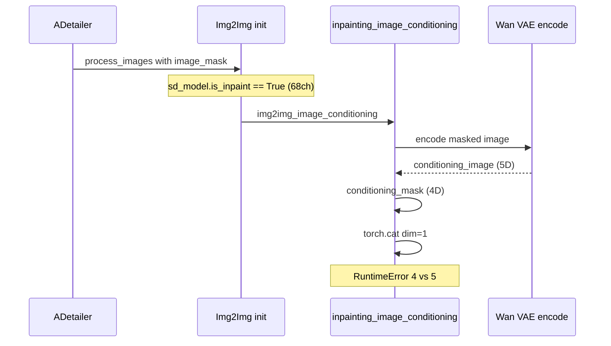
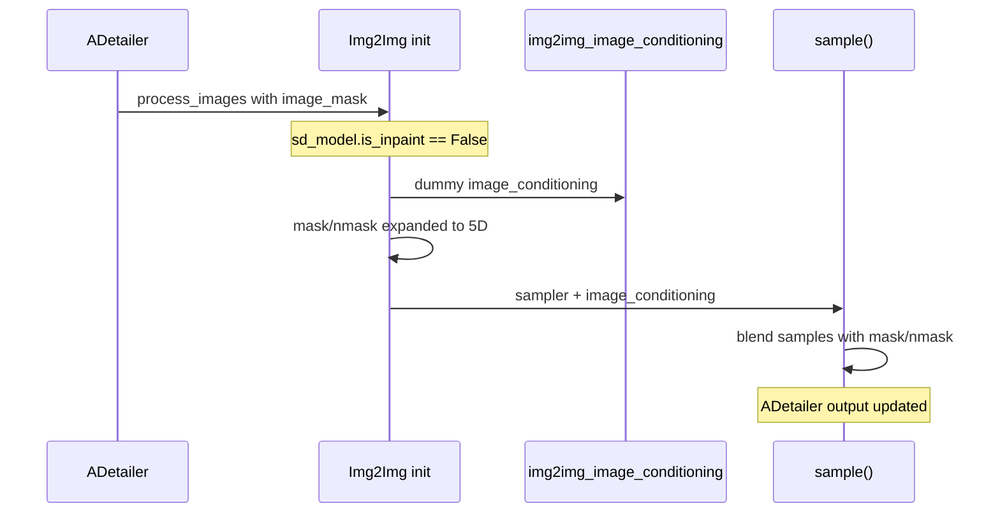

# Anima + ADetailer: `is_inpaint` Fix (commit `9c85472`)

This document explains the failure when running **ADetailer** after main generation with **Anima** models such as `waiANIMA_pw3.safetensors` (`AnimaWai68`), the essential root cause, the one-line engine fix, and why that fix is correct and scoped to Anima only.

---

## 1. Symptom and error message

Main txt2img completes successfully. During **ADetailer** post-processing (face/body refinement via img2img), generation aborts with:

```text
RuntimeError: Tensors must have same number of dimensions: got 4 and 5
```

Typical stack trace (abbreviated):

```text
File "modules/processing.py", line 363, in inpainting_image_conditioning
    image_conditioning = torch.cat([conditioning_mask, conditioning_image], dim=1)
```

Observed with:

- Model: `waiANIMA_pw3.safetensors` (guessed as `AnimaWai68`, `in_channels: 68`)
- Extension: ADetailer (`extensions-builtin/adetailer`)
- Main pass: OK; failure on the **second** img2img pass per detected region

---

## 2. What the error means (surface level)

`torch.cat(..., dim=1)` requires every tensor to have the **same rank** (number of dimensions).

In the failing call:

| Tensor | Typical shape (Anima / Wan VAE) | Rank |
|--------|----------------------------------|------|
| `conditioning_mask` (after `interpolate` + `expand`) | `(B, C_mask, H, W)` | **4** |
| `conditioning_image` (encoded masked latent) | `(B, C, T, H, W)` | **5** |

Wan-style VAE latents include a **time/frame** axis `T` (even when `T=1`), so encoded tensors are 5D. The legacy WebUI inpainting path builds a **4D** mask and concatenates along channel dim `1` without aligning ranks → PyTorch raises `got 4 and 5`.

This is not a random tensor bug; it is a **contract mismatch** between:

1. **SD 1.x / SDXL inpainting** (4D latents, extra channels concatenated into UNet input), and  
2. **Anima + Wan VAE** (5D latents, inpainting handled differently in Forge).

---

## 3. Essential root cause (end-to-end chain)

### 3.1. `AnimaWai68` is classified as an “inpaint model” by channel count

In `modules_forge/packages/huggingface_guess/model_list.py`, `BASE.inpaint_model()` is:

```python
def inpaint_model(self):
    return self.unet_config.get("in_channels", -1) > 4
```

`AnimaWai68` sets:

```python
class AnimaWai68(AnimaBase):
    """Anima with 68 input channels (e.g. waiANIMA_pw3)."""

    unet_config = {
        "image_model": "anima",
        "model_channels": 2048,
        "in_channels": 68,
    }
```

So for `waiANIMA_pw3`, `68 > 4` → **`inpaint_model()` returns `True`**.

That flag is copied onto the loaded diffusion engine in `ForgeDiffusionEngine.__init__`:

```python
# backend/diffusion_engine/base.py
self.is_inpaint = estimated_config.inpaint_model()
```

Before the fix, **`Anima` did not override** `self.is_inpaint`, so Anima inherited `True` for 68-channel checkpoints.

**Important nuance:** The 68 input channels are **Anima’s native UNet input width** (architecture), not “this checkpoint is an AUTOMATIC1111 SD inpainting model that expects mask+image concat on the latent.” The same `in_channels > 4` heuristic is correct for classic SD inpaint checkpoints but is **misleading for AnimaWai68**.

### 3.2. ADetailer always drives img2img with a mask

ADetailer’s inner loop (`extensions-builtin/adetailer/scripts/!adetailer.py`):

1. Builds `StableDiffusionProcessingImg2Img` via `get_i2i_p()`.
2. For each detection, sets `p2.image_mask = masks[j]` and calls `process_images(p2)`.

So each refinement step is **img2img with a mask**, even when the user did not enable manual inpainting on the main job.

### 3.3. `is_inpaint=True` forces the legacy concat path

In `modules/processing.py`, `StableDiffusionProcessingImg2Img.init()` ends with:

```python
self.image_conditioning = self.img2img_image_conditioning(
    image * 2 - 1, self.init_latent, image_mask, self.mask_round
)
```

`img2img_image_conditioning()` branches:

```python
if self.sd_model.is_inpaint:
    return self.inpainting_image_conditioning(...)
# else: dummy zero conditioning (4D-friendly placeholder)
return latent_image.new_zeros(latent_image.shape[0], 5, 1, 1)
```

When `is_inpaint` is `True`, **`inpainting_image_conditioning()`** runs. That function assumes **SD-style inpainting**:

- Build mask tensor aligned to **4D** `source_image` / latent layout.
- Encode masked image → `conditioning_image` with same rank as `latent_image` **in the SD inpaint design** (4D).
- `torch.cat([conditioning_mask, conditioning_image], dim=1)` → extra channels for `c_concat`.

For Anima, `encode_first_stage` / Wan VAE produces **5D** `conditioning_image`, while mask preparation still yields **4D** `conditioning_mask` → **crash at line 363**.

### 3.4. Mask handling in `init()` already supports 5D — the concat path does not

The same `StableDiffusionProcessingImg2Img.init()` **does** expand `self.mask` / `self.nmask` when `init_latent` is 5D:

```python
if len(self.mask.shape) != len(self.init_latent.shape):
    x_dims = self.init_latent.dim()
    if x_dims == 4:
        self.nmask = self.nmask[None, :, :, :]
        self.mask = self.mask[None, :, :, :]
    elif x_dims == 5:
        self.nmask = self.nmask[None, :, None, :, :]
        self.mask = self.mask[None, :, None, :, :]
```

Later, `sample()` blends with those masks (works for Wan):

```python
if self.mask is not None:
    blended_samples = samples * self.nmask + self.init_latent * self.mask
```

So **Forge already knew** Anima/Wan uses 5D latents for **masked img2img blending**; only the **WebUI legacy inpaint concat** path was incompatible. The bug is “wrong flag → wrong branch,” not “Anima cannot inpaint at all.”

### 3.5. Root cause in one sentence

**`AnimaWai68` was marked `is_inpaint=True` by channel-count heuristic, so ADetailer’s img2img invoked SD-style `inpainting_image_conditioning` on 5D Wan latents, causing a 4D vs 5D `torch.cat` failure.**

---

## 4. Why other Forge engines were not affected

Several non-SD engines **already** set `self.is_inpaint = False` immediately after `super().__init__()`, for the same class of reason (not WebUI SD inpaint concat):

| Engine file | Line (approx.) |
|-------------|----------------|
| `backend/diffusion_engine/qwen.py` | `self.is_inpaint = False` |
| `backend/diffusion_engine/lumina.py` | `self.is_inpaint = False` |
| `backend/diffusion_engine/flux.py` | `self.is_inpaint = False` |
| `backend/diffusion_engine/chroma.py` | `self.is_inpaint = False` |
| `backend/diffusion_engine/zimage.py` | `self.is_inpaint = False` |

**Anima was missing this override**, so only Anima (especially `AnimaWai68` / 68ch) hit the legacy path.

Models that truly use SD/SDXL inpaint concat still keep `is_inpaint=True` from `base.py` and are unchanged.

---

## 5. Fix: full added code

**File:** `backend/diffusion_engine/anima.py`  
**Commit:** `9c85472` — `fix-Anima-ADetailer-disable-WebUI-inpaint-concat`  
**Scope:** Only class `Anima` (`matched_guesses`: `Anima`, `AnimaBase`, `AnimaWai68`). No edits to shared `processing.py`, `base.py`, or ADetailer.

### 5.1. Exact change

One line added in `Anima.__init__`, immediately after `super().__init__(...)`:

```python
class Anima(ForgeDiffusionEngine):
    """Forge glue only: Comfy ``Anima`` UNet + Comfy ``sd.CLIP`` (Anima TE)."""

    matched_guesses = [model_list.Anima, model_list.AnimaBase, model_list.AnimaWai68]

    def __init__(self, estimated_config, huggingface_components):
        super().__init__(estimated_config, huggingface_components)
        self.is_inpaint = False

        clip = huggingface_components["text_encoder"]
        # ... remainder of __init__ unchanged ...
```

### 5.2. Full `__init__` after fix (for audit)

```python
def __init__(self, estimated_config, huggingface_components):
    super().__init__(estimated_config, huggingface_components)
    self.is_inpaint = False

    clip = huggingface_components["text_encoder"]

    vae = VAE(model=huggingface_components["vae"], is_wan=True)
    vae.first_stage_model.latent_format = self.model_config.latent_format

    k_predictor = PredictionDiscreteFlow(estimated_config)

    unet = UnetPatcher.from_model(
        model=huggingface_components["transformer"],
        diffusers_scheduler=None,
        k_predictor=k_predictor,
        config=estimated_config,
    )

    self.text_processing_engine_anima = AnimaTextProcessingEngine(clip)

    self.forge_objects = ForgeObjects(unet=unet, clip=clip, vae=vae, clipvision=None)
    self.forge_objects_original = self.forge_objects.shallow_copy()
    self.forge_objects_after_applying_lora = self.forge_objects.shallow_copy()

    self.is_wan = True
    self.use_shift = True
```

---

## 6. What `self.is_inpaint = False` does (behavioral meaning)

### 6.1. Disables WebUI SD inpaint **concat** conditioning

With `is_inpaint=False`, `img2img_image_conditioning()` **does not** call `inpainting_image_conditioning()`. It returns a small dummy tensor:

```python
return latent_image.new_zeros(latent_image.shape[0], 5, 1, 1)
```

`sampling_function` in `backend/sampling/sampling_function.py` only feeds `c_concat` from `image_cond` when **`is_inpaint` is True** and shapes match the 4D-style check:

```python
if isinstance(image_cond_in, torch.Tensor) and self.inner_model.inner_model.is_inpaint:
    if image_cond_in.shape[0] == x.shape[0] and image_cond_in.shape[2] == x.shape[2] and image_cond_in.shape[3] == x.shape[3]:
        # attach c_concat to cond / uncond
```

For Anima, `is_inpaint=False` → **no mask+image channel concat into the UNet** via WebUI’s legacy path. That matches how Qwen/Lumina/Flux already run on Forge.

### 6.2. ADetailer img2img still applies masks correctly

ADetailer continues to:

1. Set `image_mask` on `StableDiffusionProcessingImg2Img`.
2. Run `init()` → build `init_latent` (5D for Wan), expand `mask`/`nmask` to 5D when needed.
3. Run `sample()` → **latent blending** `samples * nmask + init_latent * mask`.

So regional refinement is **“denoise inside mask, keep outside”** via blending, not via SD inpaint UNet extra channels. That is the intended Forge path for flow/Wan engines.

### 6.3. What is **not** changed

| Area | Effect |
|------|--------|
| Other models (SD1, SDXL, true inpaint checkpoints) | Unchanged; still use `base.py` default `is_inpaint`. |
| `processing.py` | Unchanged; no global 5D patch in shared code. |
| `huggingface_guess` / `AnimaWai68` config | Unchanged; `in_channels: 68` remains correct for architecture detection. |
| Anima UNet, VAE, text encoder | Unchanged. |
| Main txt2img for Anima | Unchanged (txt2img already used non-inpaint or dummy conditioning paths as appropriate). |

This satisfies the requirement **not to affect other models**: only `Anima` engine instance flips the flag after load.

---

## 7. Flow diagrams

### 7.1. Before fix (failure)



### 7.2. After fix (success)



---

## 8. Related code references (for readers)

| Topic | Location |
|-------|----------|
| `is_inpaint` default | `backend/diffusion_engine/base.py` — `ForgeDiffusionEngine.__init__` |
| Inpaint flag heuristic | `modules_forge/packages/huggingface_guess/model_list.py` — `BASE.inpaint_model()` |
| `AnimaWai68` 68 channels | `model_list.py` — class `AnimaWai68` |
| Legacy concat | `modules/processing.py` — `inpainting_image_conditioning`, `img2img_image_conditioning` |
| 5D mask expand | `modules/processing.py` — `StableDiffusionProcessingImg2Img.init` (~1880–1887) |
| Latent mask blend | `modules/processing.py` — `StableDiffusionProcessingImg2Img.sample` (~1922–1930) |
| ADetailer img2i setup | `extensions-builtin/adetailer/scripts/!adetailer.py` — `get_i2i_p`, `_postprocess_image_inner` |
| `c_concat` gating | `backend/sampling/sampling_function.py` — `sampling_function` |

---

## 9. Verification

After deploying commit `9c85472`:

1. Load `waiANIMA_pw3.safetensors` (or other `AnimaWai68` weights).
2. Generate with ADetailer enabled (detections present).
3. **Expected:** Main image completes; each ADetailer img2img step completes without `got 4 and 5`.
4. **Expected:** Other architectures (SDXL, Flux, Qwen, etc.) behave as before.

User-confirmed: **operation succeeded** with this fix.

---

## 10. Design takeaway

- **`in_channels > 4`** in `huggingface_guess` means “UNet expects more than 4 input channels,” which for **classic SD** implies **inpaint concat**.
- For **AnimaWai68**, 68 channels describe the **model architecture**, not WebUI inpaint semantics.
- Forge’s correct pattern for modern flow/Wan engines is: **`is_inpaint = False` on the engine** + **mask blending in img2img `sample()`** when a mask is present.
- Anima now follows the same pattern as Qwen, Lumina, Flux, Chroma, and ZImage.

---

## 11. Changelog entry (suggested)

When documenting in project changelog:

- **Fix:** Anima + ADetailer img2img — set `Anima.is_inpaint = False` to avoid SD-style latent concat on 5D Wan latents (`AnimaWai68` / `waiANIMA_pw3`).
- **Commit:** `9c85472`
