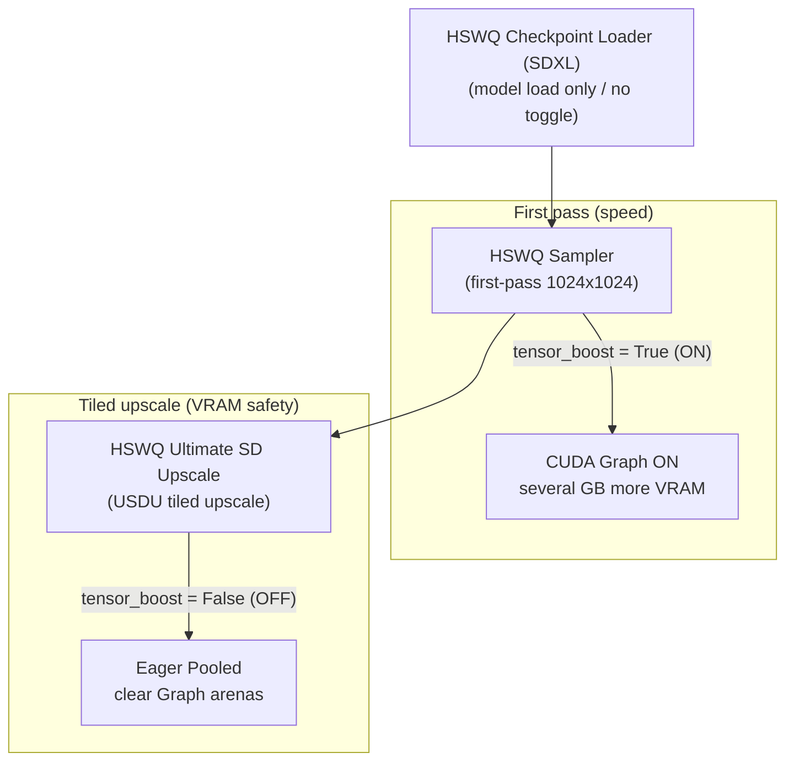

<table align="center">
  <tr>
    <td align="center" bgcolor="#e5e7eb" width="88" height="36"><font color="#4b5563"><b>EN</b></font></td>
    <td align="center" bgcolor="#3478ca" width="88" height="36"><a href="https://github.com/ussoewwin/ComfyUI-HSWQ-Loader-and-Tools/blob/main/zhmd/v3.4.0.md"><font color="#ffffff"><b>中文</b></font></a></td>
  </tr>
</table>

## 1. Overview

To maximize HSWQ SDXL ConvRot NVFP4 inference performance on NVIDIA Blackwell (SM >= 100: B200 / GB200, RTX 5090 / SM120), this stack introduces a **Per-Weight CUDA Graph auto-dispatch mechanism (Tensor Boost)**.

The feature is a **closed, protected design inside `nodes/nvfp4/` only** (SDXL Product Tensor Core path). It does not affect Z Image ConvRot NVFP4 (`nodes/zimage_nvfp4/` comfy-parity path), SDXL ConvRot INT8, FP8, or stock FP16/BF16 paths — a fully separated architecture.

To balance sampling speed with VRAM cost (**Tensor Boost ON adds several GB**) and system-RAM spill during upscale (USDU: Ultimate SD Upscale), independent **BOOLEAN toggle switches** are provided on the sampler (`HSWQSampler`) and the upscale node (`HSWQUltimateSDUpscale`). **RTX 5090 with 32 GB+** is recommended when using Tensor Boost / high-res tiled upscale.

---

## 2. Architectural Background and Design

### 2.1 Limitations of the previous CUDA Graph (shape-shared)
The previous SDXL NVFP4 CUDA Graph path was shape-shared (`_GRAPH_CACHE`) and copied the full weight tensor with `static_w.copy_(w_qdata)` on every call.
That weight-copy overhead made CUDA Graph (~13.05 s) slower than the eager pooled path (~11.8 s).

### 2.2 Introducing Per-Weight CUDA Graph (`nvfp4_quant_mm_cudagraph_perweight`)
On Blackwell (SM100 / SM120), FP4 (E2M1) Tensor Core throughput is much higher, so host / PyTorch overhead and weight transfer copies dominate.
During sampling, model weight addresses (`data_ptr`) stay stable in VRAM, so `nvfp4_quant_mm_cudagraph_perweight` was added to **capture weights directly into the graph** without copying them.

- **Zero weight copy on replay**: Only activation `x` and scales (`scale_a`, `alpha`, `bias`) are copied each replay; weight transfer overhead is eliminated.
- **Larger M coverage**: Adaptive cap `_PER_WEIGHT_GRAPH_MAX_M = 16384` covers all SDXL UNet Linear shapes at 1024×1024 and USDU tiles ($M = 8192, 4096, 2048, 512$, etc.).

---

## 3. Memory Characteristics and VRAM Saturation Mitigation

### 3.1 Eager Pooled vs CUDA Graph (Tensor Boost)

| Item | Eager Pooled (`tensor_boost = False`) | Tensor Boost (`tensor_boost = True`) |
|:---|:---|:---|
| **Allocation style** | Single buffer (`_ACT_Q_POOL`) reused across ~140 layers | PyTorch non-freed static allocator (CUDA Graph arena) |
| **VRAM** | No CUDA Graph arena stack (Eager pooled reuse) | **Several GB more** (CUDA Graph arenas; stacks further if shapes change) |
| **CPU launch latency** | Present (15–30 μs / layer) | **Zero** (GPU batch replay) |
| **Speed** | Baseline | **Fastest (~15%–25% faster)** |
| **Recommended use** | **· USDU tiled upscale (keep OFF)<br>· Changing input shapes (tiling)** | **· RTX 5090 32 GB+ recommended<br>· First-pass 1024×1024 single resolution<br>· Continuous sampling at max speed** |

### 3.2 USDU (tiled upscale) VRAM blow-up and mitigation
**Tensor Boost ON already adds several GB of VRAM.** In multi-tile USDU, edge handling and similar cases also feed **different input shapes ($M$)** per tile.
PyTorch CUDA Graphs capture a separate graph per shape, so arenas stack — dedicated VRAM saturates and spill into shared GPU memory (system RAM) is common on cards without 5090-class headroom.

Setting `tensor_boost = False` (default) on the USDU node clears the CUDA Graph cache as soon as upscale starts and runs **Eager Pooled**, so per-tile shape changes do not keep stacking Graph arenas.

---

## 4. UI Node Toggles and Control Layout

The intended workflow is: **speed up the base pass with Tensor Boost, then turn it OFF only for upscale to avoid VRAM blow-up**. Node roles:

### 4.1 Node roles



1. **`HSWQ Checkpoint Loader (SDXL)`**:
   - **No toggle**. Loads the model and installs NVFP4 operators only.
   - Keeping the toggle off the loader avoids locking the whole graph OFF from load time when USDU needs OFF for upscale.

2. **`HSWQ Sampler` (first sampling node)**:
   - **`tensor_boost` (BOOLEAN toggle)**.
   - **ON (`True`)**: first 1024×1024 sampling at full Tensor Boost (CUDA Graph) speed; **VRAM rises by several GB**. Sampler path: **16 GB+** recommended.

3. **`HSWQ Ultimate SD Upscale` (USDU node)**:
   - **`tensor_boost` (BOOLEAN toggle)** (`default: False`).
   - **OFF (`False`)**: on upscale start, sets `HSWQ_NVFP4_TENSORBOOST=0` and runs `clear_nvfp4_cudagraphs()`, so tiles do not stack Graph arenas / spill. **ON** on this path needs **RTX 5090 32 GB+** because Tensor Boost alone already costs **several GB**.

### 4.2 Environment variable interface

UI toggles map to env vars that gate the lower dispatch path:

- `HSWQ_NVFP4_TENSORBOOST=1` / `HSWQ_NVFP4_CUDAGRAPH=1`: Tensor Boost on
- `HSWQ_NVFP4_TENSORBOOST=0` / `HSWQ_NVFP4_CUDAGRAPH=0`: Tensor Boost off (Eager Pooled)

---

## 5. Logging and Diagnostics

Tensor Boost status is visible in the console / ComfyUI log in real time.

### 5.1 Toggle state logs (at NVFP4 load — see §11)
- **Toggle ON**:
  ```text
  [HSWQ NVFP4 Tensor Boost] Tensor Boost Toggle ON: CUDA Graph Tensor Boost ACTIVE
  ```
- **Toggle OFF**:
  ```text
  [HSWQ NVFP4 Tensor Boost] Tensor Boost Toggle OFF: Eager Pooled Path ACTIVE (Graph arenas cleared)
  ```

### 5.2 Capture and hit statistics
- **Capture log**:
  ```text
  [HSWQ NVFP4 Tensor Boost] Captured Blackwell per-weight CUDA Graph #1 (shape M=8192 K=2048 N=2048, w_ptr=0x..., device=cuda:0)
  ```
- **Hit milestones (100, 500, 1000, …)**:
  ```text
  [HSWQ NVFP4 Tensor Boost] Running CUDA Graph accelerated GEMM (100 hits active)
  ```
- **`nvfp4_forward_stats()` dict**:
  - `"blackwell_graph_hits"`: cumulative Blackwell CUDA Graph replay count
  - `"blackwell_tensor_boost_active"`: GPU class flag (`True` / `False`)

---

## 6. Path Isolation and Safety Guarantees

| Path | Flag / condition | Tensor Boost | Memory protection |
|:---|:---|:---|:---|
| **SDXL ConvRot NVFP4** | `module._hswq_nvfp4 = True` | ✅ Sampler / USDU toggle | `_PER_WEIGHT_GRAPH_CACHE.clear()` + `empty_cache()` |
| **Z Image ConvRot NVFP4** | Parity path (`_hswq_nvfp4 = False`) | ❌ Fully excluded (Comfy Parity) | Cannot enter `_tc_forward_pooled` |
| **SDXL ConvRot INT8** | ComfyUI MixedPrecision / INT8 Ops | ❌ Fully excluded | Separate bindings |
| **FP8 / Native FP16** | Stock ComfyUI Ops | ❌ Fully excluded | Stock ComfyUI ops |

Load / inference code for Z Image NVFP4, INT8, and FP8 is not touched. Tensor Boost runs only inside the SDXL ConvRot NVFP4 product path, so other formats and model structures are not polluted.

---

## 7. Addendum Policy (this section onward)

§1–§6 remain the authoritative design summary, tables, log strings, and recommended workflow.
From this section on, the guide adds **file names, full relevant code, and meaning** matched to the implementation so diagnostics can be cross-checked against source.

Control flow (summary):

```text
UI (Sampler / USDU).tensor_boost
  → os.environ["HSWQ_NVFP4_TENSORBOOST"] = "1"|"0"
  → (when OFF) clear_nvfp4_cudagraphs()
  → Linear.forward (make_nvfp4_linear_forward)  [requires: module._hswq_nvfp4]
  → _tc_forward_pooled
  → is_nvfp4_cudagraph_enabled() × is_blackwell_gpu()
  → nvfp4_quant_mm_cudagraph_perweight  OR  eager pooled
```

The Loader has no toggle. At **NVFP4 checkpoint load**, the current env is also read and the same §5.1 Toggle lines are printed (details in §11).

---

## 8. Created / Modified Files (Tensor Boost)

| Kind | Path | Role for Tensor Boost |
|:---|:---|:---|
| **Core / modified** | `nodes/nvfp4/nvfp4_runtime.py` | `_PER_WEIGHT_*` cache, `clear_nvfp4_cudagraphs`, `nvfp4_quant_mm_cudagraph_perweight` |
| **Core / modified** | `nodes/nvfp4/nvfp4_forward.py` | `_tc_forward_pooled` dispatch, hit stats, `nvfp4_forward_stats` |
| **Core / modified** | `nodes/nvfp4/nvfp4_conf.py` | `is_blackwell_gpu`, `is_nvfp4_cudagraph_enabled` (env read) |
| **Core / existing (gate)** | `nodes/nvfp4/nvfp4_load.py` | `arm_nvfp4_module` sets `_hswq_nvfp4 = True` (TC entry condition) |
| **UI / modified** | `nodes/hswq_sampler.py` | Optional `tensor_boost`; env + clear-on-OFF at start of `sample` |
| **UI / modified** | `nodes/nunchaku_usdu.py` | Required `tensor_boost` (default False); env + clear at start of `upscale` |
| **Load diagnostics / modified** | `nodes/nvfp4/comfy_quant_nvfp4.py` | §5.1 Toggle ON/OFF log at NVFP4 load |
| **Loader (no toggle)** | `__init__.py` | `HSWQCheckpointLoaderSDXL` — `ckpt_name` / `weight_dtype` / `device` only |
| **Isolated (not applied)** | `nodes/zimage_nvfp4/` | Comfy-parity; does not use Product TC (`_tc_forward_pooled`) |

The “new” core is **`nvfp4_quant_mm_cudagraph_perweight` plus the per-weight cache set**. UI, env, and dispatch are wiring onto the existing SDXL NVFP4 stack.

---

## 9. Per File: Full Code and Meaning

### 9.1 `nodes/nvfp4/nvfp4_conf.py` — GPU detection and env gate

#### Meaning

- **`is_blackwell_gpu()`**: compute capability major ≥ 10 (SM100 / SM120, etc.). **GPU condition to enter per-weight graphs**.
- **`is_nvfp4_cudagraph_enabled()`**: reads `HSWQ_NVFP4_CUDAGRAPH` then `HSWQ_NVFP4_TENSORBOOST`. `'1'/'true'/'on'/'enable(d)'` → True; `'0'/'false'/'off'/'disable(d)'` → False. **If neither is set → False** (default Eager).
- UI mainly writes **`HSWQ_NVFP4_TENSORBOOST` only**. The reader accepts both keys, so a manual `CUDAGRAPH` setting hits the same gate.

#### Full code (Tensor Boost–related block)

```python
# ---------------------------------------------------------------------------
# Blackwell GPU capability detection (SDXL NVFP4 product path only)
# ---------------------------------------------------------------------------
_GPU_CC: tuple | None = None


def _get_gpu_cc() -> tuple:
    """Return (major, minor) compute capability, cached."""
    global _GPU_CC
    if _GPU_CC is None:
        import torch

        if torch.cuda.is_available() and torch.cuda.device_count() > 0:
            _GPU_CC = torch.cuda.get_device_capability()
        else:
            _GPU_CC = (0, 0)
    return _GPU_CC


def is_blackwell_gpu() -> bool:
    """True if GPU is Blackwell class (SM >= 100): B200, RTX 5090, etc.

    Called only from nodes/nvfp4 product-TC path guards.  Z Image and INT8
    never reach this code.
    """
    major, _ = _get_gpu_cc()
    return major >= 10


def is_blackwell_datacenter() -> bool:
    """True if GPU is SM100 datacenter Blackwell (TMA/TMEM available)."""
    major, minor = _get_gpu_cc()
    return major == 10 and minor == 0


def is_blackwell_consumer() -> bool:
    """True if GPU is SM120/SM121 consumer Blackwell (RTX 50x0 series)."""
    major, _ = _get_gpu_cc()
    return major == 12


def is_nvfp4_cudagraph_enabled() -> bool:
    """Return whether CUDA Graph / Tensor Boost execution is active.

    Evaluates HSWQ_NVFP4_TENSORBOOST and HSWQ_NVFP4_CUDAGRAPH environment variables.
    Returns True if set to '1' / 'true' / 'on' / 'enable'.
    Returns False otherwise.
    """
    import os

    for env_key in ("HSWQ_NVFP4_CUDAGRAPH", "HSWQ_NVFP4_TENSORBOOST"):
        val = os.environ.get(env_key, "").strip().lower()
        if val in ("1", "true", "on", "enable", "enabled"):
            return True
        if val in ("0", "false", "off", "disable", "disabled"):
            return False

    return False
```

---

### 9.2 `nodes/nvfp4/nvfp4_runtime.py` — Pools, clear, Per-Weight Graph

#### Meaning

| Symbol | Meaning |
|:---|:---|
| `_ACT_Q_POOL` / `_ROT_OUT_POOL` | Eager activation quant / Hadamard rotate buffer reuse (no CUDA Graph arena) |
| `_GRAPH_CACHE` / `_GRAPH_MAX_M=512` | **Non-Blackwell** shape-shared graphs (weight copy on replay). Not the Blackwell Tensor Boost main path |
| `_PER_WEIGHT_GRAPH_CACHE` | Blackwell main path. Key includes `w_qdata.data_ptr()` and shapes |
| `_PER_WEIGHT_GRAPH_CACHE_MAX = 500` | LRU cap (~140 Linears × multiple tile shapes) |
| `_PER_WEIGHT_GRAPH_MAX_M = 16384` | Covers SDXL 1024² / USDU large M |
| `clear_nvfp4_cudagraphs()` | Clears both graph caches + `torch.cuda.empty_cache()`. Called on USDU OFF, Sampler OFF, OOM |
| `nvfp4_quant_mm_cudagraph_perweight` | Capture uses `w_qdata` by reference (no weight copy). Replay copies only `x` / scales / bias → `graph.replay()` |

#### Full code (constants, clear, per-weight function)

```python
# (padded_rows, padded_cols, device_str) -> (qx uint8, sx_uint8)
# Safe to reuse: only live during one Linear forward (quantize → mm reads sync).
_ACT_Q_POOL: dict = {}
# (m, group_count, group_size, dtype, device_str) -> rotated
# Safe: consumed inside the same Linear before return.
_ROT_OUT_POOL: dict = {}
# CUDA Graph: shape-shared (weight copied each replay). LRU-capped to avoid OOM.
_GRAPH_CACHE: OrderedDict = OrderedDict()
_GRAPH_CACHE_MAX = 32
# Only graph small-M calls (microbench: NVFP4 mm loses to FP16 when M is small).
_GRAPH_MAX_M = 512
# Per-weight CUDA Graph cache (Blackwell auto-detect): weight data_ptr -> graph.
# Eliminates weight .copy_() overhead of shape-shared graphs. Weight tensor
# is used directly in the captured graph — address is stable while the model
# stays on GPU during sampling.
_PER_WEIGHT_GRAPH_CACHE: OrderedDict = OrderedDict()
_PER_WEIGHT_GRAPH_CACHE_MAX = 500  # ~140 unique Linears in SDXL UNet x multiple tiles
_PER_WEIGHT_GRAPH_MAX_M = 16384  # Covers all SDXL UNet layer M dimensions (1024x1024 / USDU)
# NOTE: MM *output* must NOT be pooled — UNet residuals keep layer outputs alive
# across later layers; a reused buffer would corrupt activations.


def clear_nvfp4_cudagraphs() -> None:
    _GRAPH_CACHE.clear()
    _PER_WEIGHT_GRAPH_CACHE.clear()
    import torch
    if torch.cuda.is_available():
        torch.cuda.empty_cache()


def clear_nvfp4_runtime_pools() -> None:
    _ACT_Q_POOL.clear()
    _ROT_OUT_POOL.clear()
    clear_nvfp4_cudagraphs()
```

```python
def _copy_f32_1(dst, src):
    """Copy a scalar scale tensor into a static float32 buffer."""
    import torch

    if isinstance(src, torch.nn.Parameter):
        src = src.data
    if src.dtype != torch.float32 or src.device != dst.device:
        src = src.to(device=dst.device, dtype=torch.float32)
    dst.copy_(src.reshape(1))


def nvfp4_quant_mm_cudagraph_perweight(
    x,
    *,
    w_qdata,
    weight_scale,
    block_scale_w,
    scale_a,
    bias,
    out_dtype,
    alpha,
    pad_16x: bool,
    orig_n: int,
):
    """Per-weight CUDA Graph for Blackwell: quantize + GEMM without weight copy.

    Unlike shape-shared ``nvfp4_quant_mm_cudagraph`` which copies the full weight
    tensor on every replay (~13 s vs ~11.8 s eager), this variant uses the weight
    tensor *directly* as a graph input.  The weight address is stable while the
    model stays on GPU during sampling (~20-50 steps × ~140 Linears).

    On replay only ``x`` (activation), ``scale_a``, ``alpha``, and ``bias`` are
    copied into static buffers — all much smaller than the weight.

    Guarded by ``is_blackwell_gpu()`` in ``nvfp4_forward._tc_forward_pooled``;
    non-Blackwell GPUs never reach this function.  Z Image NVFP4 (comfy-parity
    path) never reaches ``_tc_forward_pooled`` at all.
    """
    import torch
    from comfy_kitchen.backends.cuda import roundup

    if x.dim() != 2:
        raise ValueError("nvfp4_quant_mm_cudagraph_perweight expects 2D x")
    m, k = int(x.shape[0]), int(x.shape[1])
    if m > _PER_WEIGHT_GRAPH_MAX_M:
        raise ValueError(
            f"M={m} exceeds _PER_WEIGHT_GRAPH_MAX_M={_PER_WEIGHT_GRAPH_MAX_M}"
        )
    n = int(w_qdata.shape[0])
    has_bias = bias is not None and not (
        isinstance(bias, torch.Tensor) and bias.numel() == 0
    )
    w_ptr = w_qdata.data_ptr()

    key = (
        w_ptr,
        m,
        k,
        n,
        str(out_dtype),
        bool(pad_16x),
        has_bias,
        int(orig_n),
    )

    entry = _PER_WEIGHT_GRAPH_CACHE.get(key)
    if entry is not None:
        _PER_WEIGHT_GRAPH_CACHE.move_to_end(key)
        # Verify weight has not moved (e.g. model reloaded to GPU).
        if entry["w_ptr"] != w_ptr:
            del _PER_WEIGHT_GRAPH_CACHE[key]
            entry = None

    if entry is None:
        # -- Evict oldest if cache is full --------------------------------
        while len(_PER_WEIGHT_GRAPH_CACHE) >= _PER_WEIGHT_GRAPH_CACHE_MAX:
            _PER_WEIGHT_GRAPH_CACHE.popitem(last=False)

        # -- Allocate static buffers (activation side only) ---------------
        out_m = roundup(m, 16) if pad_16x else m
        static_x = torch.empty(m, k, dtype=x.dtype, device=x.device)
        static_out = torch.empty(out_m, n, dtype=out_dtype, device=x.device)
        static_scale_a = torch.empty(1, dtype=torch.float32, device=x.device)
        static_alpha = torch.empty(1, dtype=torch.float32, device=x.device)
        static_bias = torch.empty_like(bias) if has_bias else None

        # -- Initial copies -----------------------------------------------
        static_x.copy_(x)
        _copy_f32_1(static_scale_a, scale_a)
        _copy_f32_1(static_alpha, alpha)
        bias_arg = static_bias if has_bias else bias
        if has_bias:
            static_bias.copy_(bias)

        # -- Warmup on a side stream (2 iterations, same as shape-shared) -
        s = torch.cuda.Stream(device=x.device)
        s.wait_stream(torch.cuda.current_stream(x.device))
        with torch.cuda.stream(s):
            for _ in range(2):
                _run_quant_mm(
                    static_x,
                    scale_a=static_scale_a,
                    w_qdata=w_qdata,
                    weight_scale=weight_scale,
                    block_scale_w=block_scale_w,
                    bias=bias_arg,
                    out_dtype=out_dtype,
                    alpha=static_alpha,
                    pad_16x=pad_16x,
                    orig_m=m,
                    orig_n=orig_n,
                    out=static_out,
                )
        torch.cuda.current_stream(x.device).wait_stream(s)

        # -- Capture graph ------------------------------------------------
        g = torch.cuda.CUDAGraph()
        with torch.cuda.graph(g):
            _run_quant_mm(
                static_x,
                scale_a=static_scale_a,
                w_qdata=w_qdata,          # DIRECT weight ref — no copy!
                weight_scale=weight_scale,
                block_scale_w=block_scale_w,
                bias=bias_arg,
                out_dtype=out_dtype,
                alpha=static_alpha,
                pad_16x=pad_16x,
                orig_m=m,
                orig_n=orig_n,
                out=static_out,
            )

        entry = {
            "graph": g,
            "static_x": static_x,
            "static_out": static_out,
            "static_scale_a": static_scale_a,
            "static_alpha": static_alpha,
            "static_bias": static_bias,
            "has_bias": has_bias,
            "w_ptr": w_ptr,
        }
        _PER_WEIGHT_GRAPH_CACHE[key] = entry
        _console(
            "[HSWQ NVFP4 Tensor Boost] Captured Blackwell per-weight CUDA Graph #"
            f"{len(_PER_WEIGHT_GRAPH_CACHE)} (shape M={m} K={k} N={n}, w_ptr=0x{w_ptr:x}, device={x.device})"
        )

    # -- Replay: copy only activation + scales (NOT weight) ---------------
    static_x = entry["static_x"]
    static_out = entry["static_out"]
    static_x.copy_(x)
    _copy_f32_1(entry["static_scale_a"], scale_a)
    _copy_f32_1(entry["static_alpha"], alpha)
    if entry["has_bias"]:
        entry["static_bias"].copy_(bias)
    entry["graph"].replay()
    return static_out[:m, :orig_n].clone()
```

(In the same file, `_run_quant_mm` / shape-shared `nvfp4_quant_mm_cudagraph` / `quantize_nvfp4_act_pooled` serve Eager and non-Blackwell fallback. The Tensor Boost main line is the per-weight path above.)

---

### 9.3 `nodes/nvfp4/nvfp4_forward.py` — Dispatch and stats

#### Meaning

1. **`make_nvfp4_linear_forward`**: Layers without `_hswq_nvfp4` or with `_full_precision_mm` stay on stock. Armed layers reshape → ConvRot → cast → `_tc_forward_pooled`.
2. **`_tc_forward_pooled`**:
   - `_cg_enabled = is_nvfp4_cudagraph_enabled()`
   - `_bw = is_blackwell_gpu()`
   - **Blackwell + CG ON + M ≤ 16384** → `nvfp4_quant_mm_cudagraph_perweight` (on failure: clear / per-module disable)
   - **Non-Blackwell + CG ON + M ≤ 512** → shape-shared `nvfp4_quant_mm_cudagraph`
   - Else / after failure → Eager pooled (`quantize_nvfp4_act_pooled` + `scaled_mm_nvfp4_pooled`)
3. **`nvfp4_forward_stats()`**:
   - `blackwell_graph_hits` = cumulative successful per-weight replays (same counter as §5.2 milestones)
   - **`blackwell_tensor_boost_active` = `is_blackwell_gpu()`** (not “toggle currently ON”; whether the GPU is Blackwell)

#### Full code (stats, `_tc_forward_pooled`, forward entry)

```python
def reset_nvfp4_forward_stats() -> None:
    global _TC_HITS, _DEQUANT_FALLBACKS, _BLACKWELL_GRAPH_HITS
    _TC_HITS = 0
    _DEQUANT_FALLBACKS = 0
    _BLACKWELL_GRAPH_HITS = 0


def nvfp4_forward_stats() -> dict:
    return {
        "scaled_mm_hits": _TC_HITS,
        "dequant_fallbacks": _DEQUANT_FALLBACKS,
        "blackwell_graph_hits": _BLACKWELL_GRAPH_HITS,
        "blackwell_tensor_boost_active": is_blackwell_gpu(),
    }
```

```python
def _tc_forward_pooled(module, input_2d, weight_qt, bias, act_scale, out_dtype):
    """Act float → pooled NVFP4 quant → pooled cuBLAS mm (no QT alloc).

    Prefers CUDA Graph (quantize+mm) after first capture per shape/weight; falls
    back to eager pooled kernels if capture/replay fails.
    """
    global _TC_HITS, _DEQUANT_FALLBACKS, _BLACKWELL_GRAPH_HITS
    import torch
    from comfy_kitchen.tensor.base import QuantizedTensor
    from comfy_kitchen.tensor.nvfp4 import TensorCoreNVFP4Layout

    if not (
        isinstance(weight_qt, QuantizedTensor)
        and weight_qt._layout_cls == "TensorCoreNVFP4Layout"
    ):
        _DEQUANT_FALLBACKS += 1
        return None
    if getattr(weight_qt._params, "transposed", False):
        _DEQUANT_FALLBACKS += 1
        return None

    if isinstance(bias, QuantizedTensor):
        bias = bias.dequantize()

    orig_m, orig_k = int(input_2d.shape[0]), int(input_2d.shape[1])
    needs_padding = TensorCoreNVFP4Layout.get_padded_shape((orig_m, orig_k)) != (
        orig_m,
        orig_k,
    )

    scale_a = ensure_act_scale(input_2d, act_scale)
    try:
        w_qdata, scale_b, block_scale_b, orig_n = _plain_weight_cached(module, weight_qt)

        cached_alpha = getattr(module, "_hswq_nvfp4_alpha", None)
        if cached_alpha is None:
            alpha = scale_a * scale_b
            if alpha.dtype != torch.float32:
                alpha = alpha.to(dtype=torch.float32)
            if alpha.dim() == 0:
                alpha = alpha.reshape(1)
            module._hswq_nvfp4_alpha = alpha
        else:
            alpha = cached_alpha

        # CUDA Graph / Tensor Boost dispatch:
        # Check user toggle / env vars via is_nvfp4_cudagraph_enabled().
        # Setting HSWQ_NVFP4_CUDAGRAPH=0 or HSWQ_NVFP4_TENSORBOOST=0 completely
        # disables CUDA Graph and falls back 100% to eager pooled execution.
        _cg_enabled = is_nvfp4_cudagraph_enabled()
        _bw = is_blackwell_gpu()

        if _cg_enabled and not getattr(module, "_hswq_nvfp4_no_cudagraph", False):
            if _bw and orig_m <= _PER_WEIGHT_GRAPH_MAX_M:
                try:
                    result = nvfp4_quant_mm_cudagraph_perweight(
                        input_2d,
                        w_qdata=w_qdata,
                        weight_scale=scale_b,
                        block_scale_w=block_scale_b,
                        scale_a=scale_a,
                        bias=bias,
                        out_dtype=out_dtype,
                        alpha=alpha,
                        pad_16x=needs_padding,
                        orig_n=orig_n,
                    )
                    _TC_HITS += 1
                    _BLACKWELL_GRAPH_HITS += 1
                    if _BLACKWELL_GRAPH_HITS in (100, 500, 1000, 2000, 5000) or (
                        _BLACKWELL_GRAPH_HITS > 0 and _BLACKWELL_GRAPH_HITS % 5000 == 0
                    ):
                        _console(
                            "[HSWQ NVFP4 Tensor Boost] Running CUDA Graph accelerated GEMM "
                            f"({_BLACKWELL_GRAPH_HITS} hits active)"
                        )
                    return result
                except torch.cuda.OutOfMemoryError:
                    clear_nvfp4_cudagraphs()
                    torch.cuda.empty_cache()
                    logger.warning(
                        "[HSWQ NVFP4 Blackwell] per-weight Graph OOM — "
                        "cache cleared; eager pooled"
                    )
                except (RuntimeError, TypeError, ValueError) as e:
                    if "out of memory" in str(e).lower():
                        clear_nvfp4_cudagraphs()
                        torch.cuda.empty_cache()
                        logger.warning(
                            "[HSWQ NVFP4 Blackwell] per-weight Graph OOM "
                            "(%s); eager pooled", e
                        )
                    else:
                        module._hswq_nvfp4_no_cudagraph = True
                        logger.warning(
                            "[HSWQ NVFP4 Blackwell] per-weight Graph disabled "
                            "for module (%s); eager pooled", e,
                        )
            elif not _bw and orig_m <= _GRAPH_MAX_M:
                try:
                    result = nvfp4_quant_mm_cudagraph(
                        input_2d,
                        w_qdata=w_qdata,
                        weight_scale=scale_b,
                        block_scale_w=block_scale_b,
                        scale_a=scale_a,
                        bias=bias,
                        out_dtype=out_dtype,
                        alpha=alpha,
                        pad_16x=needs_padding,
                        orig_n=orig_n,
                    )
                    _TC_HITS += 1
                    return result
                except torch.cuda.OutOfMemoryError:
                    clear_nvfp4_cudagraphs()
                    torch.cuda.empty_cache()
                    logger.warning(
                        "[HSWQ NVFP4] CUDA Graph OOM — cache cleared; eager pooled"
                    )
                except (RuntimeError, TypeError, ValueError) as e:
                    if "out of memory" in str(e).lower():
                        clear_nvfp4_cudagraphs()
                        torch.cuda.empty_cache()
                        logger.warning(
                            "[HSWQ NVFP4] CUDA Graph OOM (%s); eager pooled", e
                        )
                    else:
                        module._hswq_nvfp4_no_cudagraph = True
                        logger.warning(
                            "[HSWQ NVFP4] CUDA Graph disabled for module (%s); eager pooled",
                            e,
                        )

        a_qdata, block_scale_a, _pr, _pc = quantize_nvfp4_act_pooled(
            input_2d, scale_a, pad_16x=needs_padding
        )
        result = scaled_mm_nvfp4_pooled(
            a_qdata,
            w_qdata,
            tensor_scale_a=scale_a,
            tensor_scale_b=scale_b,
            block_scale_a=block_scale_a,
            block_scale_b=block_scale_b,
            bias=bias,
            out_dtype=out_dtype,
            alpha=alpha,
            orig_m=orig_m,
            orig_n=orig_n,
        )
        _TC_HITS += 1
        return result
    except (RuntimeError, TypeError, ValueError) as e:
        logger.warning("[HSWQ NVFP4] pooled TC path failed: %s", e)
        _DEQUANT_FALLBACKS += 1
        return None
```

```python
def make_nvfp4_linear_forward(stock_forward):
    """
    Return a Linear.forward replacement.

    For modules flagged ``_hswq_nvfp4`` (set at load), run the HSWQ TC path.
    All other layers keep stock_forward unchanged.
    """
    import torch
    import comfy.model_management
    from comfy.ops import cast_bias_weight, run_every_op, uncast_bias_weight

    def forward_nvfp4(self, input, *args, **kwargs):
        if not getattr(self, "_hswq_nvfp4", False) or getattr(self, "_full_precision_mm", False):
            return stock_forward(self, input, *args, **kwargs)

        if input.requires_grad or getattr(self, "comfy_force_cast_weights", False):
            return stock_forward(self, input, *args, **kwargs)

        run_every_op()
        input_shape = input.shape
        compute_dtype = input.dtype

        reshaped_nd = input.ndim >= 3
        input_2d = input.reshape(-1, input_shape[-1]) if reshaped_nd else input
        if input_2d.ndim != 2:
            return stock_forward(self, input, *args, **kwargs)

        if getattr(self, "_hswq_nvfp4_convrot", False):
            gs = int(getattr(self, "_hswq_nvfp4_convrot_groupsize", 256) or 256)
            h = getattr(self, "_hswq_nvfp4_H", None)
            if h is None or h.device != input_2d.device or h.dtype != input_2d.dtype:
                h = build_hadamard(gs, device=input_2d.device, dtype=input_2d.dtype)
                self._hswq_nvfp4_H = h
            input_2d = rotate_last_dim_pooled(input_2d, h, gs)

        offload_stream = None
        weight = self.weight
        if isinstance(weight, torch.nn.Parameter):
            weight = weight.data
        bias = self.bias.data if self.bias is not None else None
        has_wf = len(getattr(self, "weight_function", []) or []) or len(
            getattr(self, "bias_function", []) or []
        )
        need_cast = weight.device != input_2d.device or (
            bias is not None and bias.device != input_2d.device
        )
        if has_wf or need_cast or hasattr(self, "_v"):
            weight, bias, offload_stream = cast_bias_weight(
                self,
                input_2d,
                offloadable=True,
                compute_dtype=compute_dtype,
                want_requant=True,
            )

        scale = getattr(self, "input_scale", None)
        if scale is not None:
            if isinstance(scale, torch.nn.Parameter):
                scale = scale.data
            if scale.device != input.device:
                scale = comfy.model_management.cast_to_device(scale, input.device, None)

        layout = getattr(self, "layout_type", None)
        if layout is None:
            if offload_stream is not None:
                uncast_bias_weight(self, weight, bias, offload_stream)
            return stock_forward(self, input, *args, **kwargs)

        out_2d = _tc_forward_pooled(
            self, input_2d, weight, bias, scale, compute_dtype
        )
        if out_2d is None:
            from comfy.quant_ops import QuantizedTensor

            q_input = QuantizedTensor.from_float(input_2d, layout, scale=scale)
            out_2d = scaled_mm_nvfp4_linear(q_input, weight, bias)

        if reshaped_nd:
            out = out_2d.reshape((*input_shape[:-1], int(self.out_features)))
        else:
            out = out_2d

        if offload_stream is not None:
            uncast_bias_weight(self, weight, bias, offload_stream)
        return out

    forward_nvfp4._hswq_nvfp4_full_forward = True  # type: ignore[attr-defined]
    return forward_nvfp4
```

---

### 9.4 `nodes/nvfp4/nvfp4_load.py` — TC arm (gate)

#### Meaning

`arm_nvfp4_module` sets **`module._hswq_nvfp4 = True`**. Without that flag, `forward_nvfp4` falls through to stock at the top and **never enters `_tc_forward_pooled`**. §6 “SDXL-only Tensor Boost” depends on this gate.

#### Full code (arm function)

```python
def arm_nvfp4_module(module, conf: Optional[dict]) -> None:
    """Attach HSWQ NVFP4 runtime flags after weight QT is in place."""
    if not is_nvfp4_conf(conf):
        return
    import torch

    module._hswq_nvfp4 = True
    enabled, gs = convrot_flags_from_conf(conf)
    module._hswq_nvfp4_convrot = bool(enabled)
    module._hswq_nvfp4_convrot_groupsize = int(gs)
    # Checkpoints often omit input_scale (0 keys in test.safetensors).
    # Placeholder ones(1) + flag → one amax per module then freeze (not every Linear).
    if getattr(module, "input_scale", None) is None:
        device = module.factory_kwargs.get("device", "cpu")
        module.register_parameter(
            "input_scale",
            torch.nn.Parameter(
                torch.ones(1, device=device, dtype=torch.float32),
                requires_grad=False,
            ),
        )
        module._hswq_nvfp4_scale_placeholder = True
    else:
        module._hswq_nvfp4_scale_from_ckpt = True
        module._hswq_nvfp4_scale_placeholder = False
    if enabled:
        logger.debug(
            "[HSWQ NVFP4] ConvRot armed groupsize=%s on %s",
            gs,
            getattr(module, "in_features", "?"),
        )
```

Z Image comfy-parity uses `_hswq_nvfp4_comfy_only` / `_hswq_nvfp4_convrot_parity` (etc.) with a separate forward and does not attach the Product TC arm (implements the intent of the §6 table at code level).

---

### 9.5 `nodes/hswq_sampler.py` — Sampler toggle

#### Meaning

- **Optional** `tensor_boost` in `INPUT_TYPES` (default **False**).
- At the **start** of `sample()`, writes env. ON→`1`, OFF→`0` + `clear_nvfp4_cudagraphs()`.
- **Does not print** the §5.1 Toggle ON/OFF lines here (env + clear only). Those log lines are at load (§9.7 / §11).

#### Full code (toggle definition and start of `sample`)

```python
                "tensor_boost": ("BOOLEAN", {
                    "default": False,
                    "tooltip": "Enable Blackwell Per-Weight CUDA Graph Tensor Boost during sampling. ON raises VRAM by several GB (CUDA Graph arenas).",
                }),
```

```python
    def sample(self, model, seed, steps, cfg, sampler_name, scheduler,
               positive, negative, latent_image, denoise=1.0, **kwargs):
        # Configure Tensor Boost toggle for sampling
        tensor_boost = kwargs.get("tensor_boost", False)
        import os
        if isinstance(tensor_boost, bool):
            tb_enabled = tensor_boost
        else:
            tb_str = str(tensor_boost).strip().lower() if tensor_boost is not None else ""
            tb_enabled = tb_str in ("1", "true", "on", "enable", "enabled")

        if tb_enabled:
            os.environ["HSWQ_NVFP4_TENSORBOOST"] = "1"
        else:
            os.environ["HSWQ_NVFP4_TENSORBOOST"] = "0"
            try:
                from .nvfp4.nvfp4_runtime import clear_nvfp4_cudagraphs
                clear_nvfp4_cudagraphs()
            except Exception:
                pass
```

---

### 9.6 `nodes/nunchaku_usdu.py` — USDU toggle

#### Meaning

- **Required** `tensor_boost` (default **False**) — matches §3.2 / §4.1 “OFF by default for upscale”.
- Start of `upscale()` is the same pattern as Sampler (env + clear on OFF).
- Drops graphs before per-tile M changes to avoid stacked VRAM captures.

#### Full code (input definition and start of `upscale`)

```python
        ("tensor_boost", ("BOOLEAN", {"default": False, "tooltip": "Enable Blackwell Per-Weight CUDA Graph Tensor Boost during USDU tile upscaling. ON raises VRAM by several GB; RTX 5090 32GB+ recommended. Keep OFF for tiled upscale."})),
```

```python
        tensor_boost=False,
        **kwargs,
    ):
        _ensure_imports()

        # Configure Tensor Boost toggle for USDU tile upscaling
        import os
        if isinstance(tensor_boost, bool):
            tb_enabled = tensor_boost
        else:
            tb_str = str(tensor_boost).strip().lower() if tensor_boost is not None else ""
            tb_enabled = tb_str in ("1", "true", "on", "enable", "enabled")

        if tb_enabled:
            os.environ["HSWQ_NVFP4_TENSORBOOST"] = "1"
        else:
            os.environ["HSWQ_NVFP4_TENSORBOOST"] = "0"
            try:
                from .nvfp4.nvfp4_runtime import clear_nvfp4_cudagraphs
                clear_nvfp4_cudagraphs()
            except Exception:
                pass
```

(If `INPUT_TYPES` is built via two paths, the same `tensor_boost` definition is present in both.)

---

### 9.7 `nodes/nvfp4/comfy_quant_nvfp4.py` — Toggle log at load

#### Meaning

Inside the NVFP4 checkpoint load path:

1. Reads `is_blackwell_gpu()` / `is_nvfp4_cudagraph_enabled()`
2. If CG is off, calls `clear_nvfp4_cudagraphs()` first
3. Prints ON/OFF with **the same strings as §5.1** via `_console`

So §5.1 logs are diagnostics at **NVFP4 load time for the env then in effect**, not at the instant of Sampler `sample()`. After changing Sampler/USDU toggles, re-see the same lines only via **reload**, or use capture / hit logs (§5.2).

#### Full code (load diagnostics block)

```python
        from .nvfp4_conf import is_blackwell_gpu, is_nvfp4_cudagraph_enabled
        from .nvfp4_runtime import clear_nvfp4_cudagraphs
        _bw = is_blackwell_gpu()
        _cg = is_nvfp4_cudagraph_enabled()
        if not _cg:
            clear_nvfp4_cudagraphs()

        if _cg:
            _console(
                "[HSWQ NVFP4 Tensor Boost] Tensor Boost Toggle ON: "
                "CUDA Graph Tensor Boost ACTIVE"
            )
        else:
            _console(
                "[HSWQ NVFP4 Tensor Boost] Tensor Boost Toggle OFF: "
                "Eager Pooled Path ACTIVE (Graph arenas cleared)"
            )
```

(`_bw` is fetched in the same block, but this print branches on `_cg` only. Blackwell detection takes effect in runtime dispatch.)

---

### 9.8 `__init__.py` — `HSWQCheckpointLoaderSDXL` (no toggle)

#### Meaning

Loader exposes only `ckpt_name` / `weight_dtype` (including `ConvRot NVFP4`) / `device`. **No `tensor_boost` input**. Implements §4.1 “separate load from run-time toggle”.

#### Full code (`INPUT_TYPES` and load entry)

```python
        class HSWQCheckpointLoaderSDXL(_UNETLoaderBase):
            """HSWQ Checkpoint Loader (SDXL) with device selection. Ref: CheckpointLoaderSimple."""

            @classmethod
            def INPUT_TYPES(cls):
                base = _UNETLoaderBase.INPUT_TYPES()
                base_req = dict(base.get("required", {}))
                base_opt = dict(base.get("optional", {}))
                devices = get_device_list()
                default_dev = devices[1] if len(devices) > 1 else devices[0]
                req = {
                    "ckpt_name": (folder_paths.get_filename_list("checkpoints"), {"tooltip": "SDXL checkpoint to load MODEL and CLIP from (same as standard Load Checkpoint)."}),
                    "weight_dtype": ([
                        "default",
                        "fp8_e4m3fn",
                        "fp8_e4m3fn_fast",
                        "fp8_e5m2",
                        "int8_tensorwise",
                        # SDXL only — never reuse Z Image / Krea "Z Image ConvRot NVFP4".
                        "ConvRot NVFP4",
                    ],),
                }
                opt = {"device": (devices, {"default": default_dev})}
                return {"required": req, "optional": opt}

            RETURN_TYPES = ("MODEL", "CLIP")
            OUTPUT_TOOLTIPS = ("The UNet diffusion model from checkpoint.", "The CLIP model from the SDXL checkpoint.")
            FUNCTION = "load_checkpoint"
            CATEGORY = "loaders"
            TITLE = "HSWQ Checkpoint Loader (SDXL)"

            def load_checkpoint(self, ckpt_name, weight_dtype, device=None):
                ...
```

(When `weight_dtype == "ConvRot NVFP4"`, actual load is redirected via `install_nvfp4_option_dispatch` into `comfy_quant_nvfp4`.)

---

## 10. Dispatch Branch Table (implementation map)

| Condition | Path |
|:---|:---|
| `not module._hswq_nvfp4` | Stock Linear (not Tensor Boost) |
| CG OFF (env unset / `0`) | Eager pooled (no CUDA Graph arena stack) |
| CG ON + Blackwell + `M ≤ 16384` | **Per-weight CUDA Graph (Tensor Boost main line)** |
| CG ON + non-Blackwell + `M ≤ 512` | Shape-shared CUDA Graph (weight copy) |
| CG ON but outside above / OOM / non-OOM failure | Eager pooled (clear cache on OOM) |
| `module._hswq_nvfp4_no_cudagraph` | That module stays Eager thereafter |

---

## 11. §5 Diagnostics vs Implementation (keep §5 wording; document where it comes from)

| §5 text | Implementation source |
|:---|:---|
| §5.1 Toggle ON/OFF lines | **NVFP4 checkpoint load** in `comfy_quant_nvfp4.py` (not start of Sampler/USDU run) |
| Sampler/USDU toggle action | Env write + `clear_nvfp4_cudagraphs()` on OFF only; no re-print of the same lines |
| §5.2 Captured … Graph #N | First capture in `nvfp4_quant_mm_cudagraph_perweight` |
| §5.2 Running … N hits | `_BLACKWELL_GRAPH_HITS` milestones inside `_tc_forward_pooled` |
| `blackwell_graph_hits` | Snapshot of that counter |
| `blackwell_tensor_boost_active` | **`is_blackwell_gpu()`** (not toggle ON state) |

How to read in practice:

- **“Is this sample running on Graph?”** → Captured / hits logs, or whether `blackwell_graph_hits` is increasing.
- **“Is the GPU Blackwell?”** → `blackwell_tensor_boost_active`.
- **“Is the toggle ON?”** → Sampler/USDU UI, or `HSWQ_NVFP4_TENSORBOOST`. Load-time Toggle lines reflect **env at load**.

---

## 12. Recommended Workflow (operational steps for §4)

1. Load with `HSWQ Checkpoint Loader (SDXL)`, `weight_dtype = ConvRot NVFP4` (no toggle).
2. `HSWQ Sampler` with `tensor_boost = True` → speed fixed-resolution base generation (**several GB more VRAM**; sampler recommend **16 GB+**).
3. `HSWQ Ultimate SD Upscale` with `tensor_boost = False` (default) → drop graphs before tiles; run Eager safely. Upscale / Tensor Boost headroom: **RTX 5090 32 GB+**.
4. On highly variable shapes or tight VRAM, leave Sampler False as well.
5. Prefer Sampler True when you have headroom for the Graph arenas (several GB) at a single fixed resolution.

---

## 13. Path Isolation Notes (complement to §6)

- Primary Product TC entry flag is **`_hswq_nvfp4`** (`arm_nvfp4_module`).
- Z Image is isolated via `nodes/zimage_nvfp4/` comfy-parity forward / `_hswq_nvfp4_comfy_only` (etc.). It does not ride Product `_tc_forward_pooled`.
- INT8 / FP8 / stock dtypes use other ops and loader branches. Without `_hswq_nvfp4`, Tensor Boost code does not run.
- Treat the §6 “parity” label as a path-isolation description. The runtime gate is **presence of `_hswq_nvfp4`** plus the parity forward attachment.

---

## 14. Self-Check Checklist

```
□ Sampler / USDU tensor_boost matches intent
□ On OFF, HSWQ_NVFP4_TENSORBOOST=0 and clear run (USDU default False)
□ Loader was not given an unauthorized tensor_boost widget
□ Not expecting per-weight on non-Blackwell (non-BW → shape-shared or Eager)
□ Not running many USDU tiles with True (stacked VRAM captures)
□ Not reading stats.blackwell_tensor_boost_active as “toggle state”
□ Not treating Toggle ON/OFF lines as proof of sample() instant (they are load-time logs)
□ Not expecting Product TC on Z Image / INT8 checkpoints
```

---

(§1–§6 = design and operations summary. §7 onward = files, full code, meaning, and diagnostic mapping. Together they form the complete guide.)

