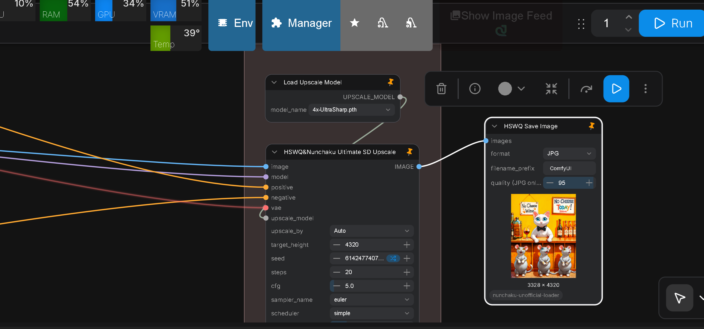
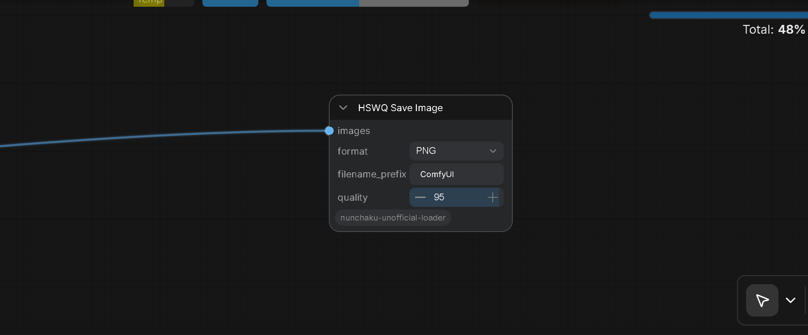
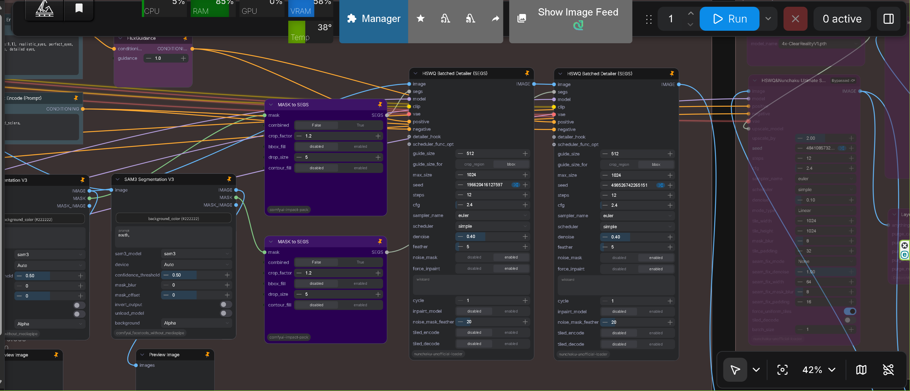

# ComfyUI-HSWQ-ConvRot-INT8/ConvRot-NVFP4-Loader-and-Tools

<table align="center">
  <tr>
    <td align="center" bgcolor="#e5e7eb" width="88" height="36"><a href="../README.md"><font color="#4b5563"><b>EN</b></font></a></td>
    <td align="center" bgcolor="#d4465e" width="88" height="36"><font color="#ffffff"><b>中文</b></font></td>
  </tr>
</table>

<p align="center">

</p>

## 概述

本自定义节点包用于加载和运行 **[Hybrid-Sensitivity-Weighted-Quantization (HSWQ)](https://github.com/ussoewwin/Hybrid-Sensitivity-Weighted-Quantization)** 量化包以及相关的 ComfyUI 兼容 SDXL / Z Image 量化权重。

**HSWQ**（量化方法、脚本与上游文档）是 **ussoewwin 的原创作品**，另以 **GNU Affero General Public License v3（AGPL-3.0）** 发布于 [ussoewwin/Hybrid-Sensitivity-Weighted-Quantization](https://github.com/ussoewwin/Hybrid-Sensitivity-Weighted-Quantization)。本 ComfyUI 加载器包为相关但**独立**的仓库（许可见下文）。

HSWQ 是面向扩散 UNet 的高保真量化方案。当前公开的 HSWQ 工作聚焦于 **SDXL** 的 **ConvRot INT8** 与 **ConvRot NVFP4**，以及 **Z Image / ZIT** UNet 的 **ConvRot NVFP4**（敏感度 / 重要性分析、DualMonitor + 加权直方图 FP16 保护，对其余部分执行全量 ConvRot）。它**不是**按 keep ratio 百分比保留的方案：keep ratio 固定为 **0 (r0)**；在固定的 MiB 预算下，由自动分析选择 FP16 层。

| 路径 | 在本仓库中的定位 |
| :--- | :--- |
| **HSWQ ConvRot INT8 (SDXL V3.1)** | ComfyUI `int8_tensorwise` 包；通过 **HSWQ Checkpoint Loader (SDXL)** 加载（`weight_dtype`：`int8_tensorwise` / INT8 自动检测）。**仅支持由 [Hybrid-Sensitivity-Weighted-Quantization](https://github.com/ussoewwin/Hybrid-Sensitivity-Weighted-Quantization) 量化的模型。** |
| **HSWQ ConvRot NVFP4 (SDXL)** | ComfyUI `nvfp4` 包（Linear→NVFP4，Conv2d→INT8 + ConvRot）；通过**同一个** **HSWQ Checkpoint Loader (SDXL)** 加载（`weight_dtype`：`ConvRot NVFP4`，或 `default` 触发 NVFP4 自动检测）。**仅支持由 [Hybrid-Sensitivity-Weighted-Quantization](https://github.com/ussoewwin/Hybrid-Sensitivity-Weighted-Quantization) 量化的模型。** |
| **HSWQ ConvRot NVFP4 (Z Image / ZIT)** | ComfyUI `nvfp4` UNet 包（常见为 Linear NVFP4 + INT8 protect）；通过 **HSWQ ConvRot INT8/ConvRot NVFP4 UNet Loader** 加载（`weight_dtype`：`ConvRot NVFP4`，或 `default` 触发 NVFP4 自动检测）。走与 `hswq/benchmark` 一致的 **Comfy parity** 路径（stock GEMM + online act rotate），**不是** SDXL 的 Tensor Core 产品路径。**仅支持由 [Hybrid-Sensitivity-Weighted-Quantization](https://github.com/ussoewwin/Hybrid-Sensitivity-Weighted-Quantization) 量化的模型。** |
| **FP8 (E4M3)** | HSWQ **FP8 开发已结束**（技术文档仍保留在上游）。只要 ComfyUI 支持，这里的加载器仍可接受现有的 FP8 权重 |
| **Z Image 8-bit** | HSWQ 专属的 Z Image INT8 开发 / 发布**已结束**。Z Image 推荐使用**原生 ConvRot INT8**（通常 SSIM > 0.99）。HSWQ INT8 仅继续用于 **SDXL**。**Z Image ConvRot NVFP4** 由上方的 UNet 加载器支持 |

上游 HSWQ 参考指标：ConvRot INT8 SSIM 约 **0.94–0.98**，ConvRot NVFP4 约 **0.95**，相比 FP16 文件体积减小约 **30–40%**，同时保持与标准 ComfyUI 加载器兼容。

**量化脚本、使用说明与基准测试：** [ussoewwin/Hybrid-Sensitivity-Weighted-Quantization](https://github.com/ussoewwin/Hybrid-Sensitivity-Weighted-Quantization)

**已发布的 HSWQ SDXL 模型（ConvRot INT8）：** [Hugging Face — Hybrid-Sensitivity-Weighted-Quantization-SDXL-ConvRot-INT8](https://huggingface.co/ussoewwin/Hybrid-Sensitivity-Weighted-Quantization-SDXL-ConvRot-INT8)

**已发布的 HSWQ SDXL 模型（ConvRot NVFP4）：** [Hugging Face — Hybrid-Sensitivity-Weighted-Quantization-SDXL-ConvRot-NVFP4](https://huggingface.co/ussoewwin/Hybrid-Sensitivity-Weighted-Quantization-SDXL-ConvRot-NVFP4)

<p align="center">

</p>

## 安装

### 快速安装

将本仓库克隆到 ComfyUI 的 `custom_nodes` 目录：

```bash
# Windows
git clone https://github.com/ussoewwin/ComfyUI-HSWQ-Loader-and-Tools "%USERPROFILE%\ComfyUI\custom_nodes\ComfyUI-HSWQ-Loader-and-Tools"

# Linux/Mac
git clone https://github.com/ussoewwin/ComfyUI-HSWQ-Loader-and-Tools ~/ComfyUI/custom_nodes/ComfyUI-HSWQ-Loader-and-Tools
```

重启 ComfyUI 以加载节点。

## 节点

### HSWQ Checkpoint Loader (SDXL)


ComfyUI 节点，从标准 SDXL 检查点加载 **MODEL** 和 **CLIP**，可选设备选择，并支持 **FP8 / INT8 / ConvRot NVFP4** 精度。使用方式与标准 Load Checkpoint 节点相同；仅输出 MODEL 和 CLIP（不包含 VAE）。

**SDXL ConvRot INT8** 与 **SDXL ConvRot NVFP4** **仅支持由 [Hybrid-Sensitivity-Weighted-Quantization](https://github.com/ussoewwin/Hybrid-Sensitivity-Weighted-Quantization) 量化的模型**。其他第三方 ConvRot INT8 / ConvRot NVFP4 包不在支持范围内。

**ConvRot NVFP4：**将 `weight_dtype` 设为 **`ConvRot NVFP4`**，或当检查点带有 comfy_quant `nvfp4` 标记时保留 **`default`** —— 加载器会路由到本扩展的 NVFP4 栈（Linear → NVFP4 Tensor Core / `scaled_mm_nvfp4` + 可选的 act ConvRot；Conv2d → INT8 + ConvRot，由 INT8 补丁处理）。NVFP4 分发在 INT8 分发**之后**安装，因此混合包（NVFP4 Linear + INT8 Conv）不会被仅 INT8 的自动检测抢走。

本加载器**不**内置 Triton accelerate 开关。INT8 Linear 的速度由 **ComfyUI + `comfy_kitchen`**（`int8_linear`：cuda → triton → eager）负责。本扩展仅保留 INT8 **加载兼容** 补丁（Conv2d / LoRA / ControlLora / handoff）以及位于 `nodes/nvfp4/` 的 **NVFP4** 加载与forward 补丁。

#### 特性

- **检查点加载**：从单个 SDXL 检查点文件同时加载 UNet (MODEL) 与 CLIP（与标准 Load Checkpoint 一致）
- **设备选择**：可选设备参数，用于选择 GPU（例如 `cuda:0`、`cuda:1`）或 CPU 来加载模型
- **FP8 weight dtype**：`fp8_e4m3fn`、`fp8_e4m3fn_fast`、`fp8_e5m2`（另有 `default` 表示不强制指定 dtype）
- **INT8 weight dtype**：`int8_tensorwise` —— 基于 ComfyUI `MixedPrecisionOps` 的 **HSWQ SDXL ConvRot INT8**（本扩展还补丁了 **Conv2d** 量化加载，使 SD UNet INT8 可用，而不仅限于 Linear）。**仅支持由 [Hybrid-Sensitivity-Weighted-Quantization](https://github.com/ussoewwin/Hybrid-Sensitivity-Weighted-Quantization) 量化的模型。**
- **ConvRot NVFP4 weight dtype**：`ConvRot NVFP4` —— **HSWQ SDXL ConvRot NVFP4**（`comfy_quant` `nvfp4`：Linear NVFP4 + Conv2d INT8 / ConvRot）；应用 `nodes/nvfp4` 补丁（packed-K 检测、完整 NVFP4 Linear 加载、Tensor Core 前向）。**仅支持由 [Hybrid-Sensitivity-Weighted-Quantization](https://github.com/ussoewwin/Hybrid-Sensitivity-Weighted-Quantization) 量化的模型。**
- **INT8 自动检测**：若 safetensors 看起来是 comfy_quant INT8（且不是 NVFP4），即使 `weight_dtype` 未设为 `int8_tensorwise`，加载器也会走 MixedPrecisionOps / INT8 路径
- **NVFP4 自动检测**：若 `weight_dtype` 为 `default` 且检查点看起来是 comfy_quant NVFP4，加载器会自动走 ConvRot NVFP4 路径
- **标准 ComfyUI 集成**：使用 `load_checkpoint_guess_config`；与标准 ComfyUI 工作流兼容
- **无 Triton accelerate 控件**：UI 仅包含检查点 / weight dtype / device；融合 INT8 Linear 加速不受本节点控制

#### 使用说明

- **输入**：`ckpt_name`（检查点文件）、`weight_dtype`（`default` / FP8 选项 / `int8_tensorwise` / `ConvRot NVFP4`），以及可选的 `device`
- **输出**：仅 MODEL 和 CLIP；如需要请使用单独的 VAE 加载器
- **分类**：Loaders（`loaders`）
- **SDXL ConvRot INT8 / ConvRot NVFP4 兼容性**：**仅限**由 [Hybrid-Sensitivity-Weighted-Quantization](https://github.com/ussoewwin/Hybrid-Sensitivity-Weighted-Quantization) 量化的检查点
- **ConvRot NVFP4 模型**：已发布的包 —— [Hybrid-Sensitivity-Weighted-Quantization-SDXL-ConvRot-NVFP4](https://huggingface.co/ussoewwin/Hybrid-Sensitivity-Weighted-Quantization-SDXL-ConvRot-NVFP4)
- **INT8 速度**：Linear 加速依赖 ComfyUI / `comfy_kitchen`；本节点不安装也不开关 Triton
- **INT8 + LoRA**：关于 INT8 LoRA bake / Status 日志的详情，请见 `md/HSWQ_INT8_AND_LORA_TECHNICAL_GUIDE.md`
- **VRAM 清理（HSWQ ConvRot INT8 / ConvRot NVFP4 必需）**：当使用 **HSWQ ConvRot INT8** 或 **HSWQ ConvRot NVFP4** 加载时，请务必在工作流末尾放置来自 [ComfyUI-DistorchMemoryManager](https://github.com/ussoewwin/ComfyUI-DistorchMemoryManager) 的 **General Purge VRAM V2**，并开启其 **`HSWQ`** 开关。HSWQ 残留的 GPU/host 内存（以及 NVFP4 运行时池 / CUDA graphs）不会被 ComfyUI 的通用卸载完全释放，否则第一次生成之后的第二次生成可能会失败（例如 `quantize_nvfp4` / `PyCapsule` / `pooled TC path failed`）。

### HSWQ ConvRot INT8/ConvRot NVFP4 UNet Loader


标准 ComfyUI UNet 加载器的封装，用于 `diffusion_models` 下的扩散 UNet（**Z Image / ZIT** 及其他 UNet 包）。以 FP8、INT8 与 **ConvRot NVFP4** 权重类型加载 **MODEL**。

**Z Image / ZIT ConvRot NVFP4** **仅支持由 [Hybrid-Sensitivity-Weighted-Quantization](https://github.com/ussoewwin/Hybrid-Sensitivity-Weighted-Quantization) 量化的模型**。其他第三方 ConvRot NVFP4 UNet 包不在支持范围内。

- **通用 FP8 / INT8**：与库存 UNet 加载器思路相同（HSWQ FP8 E4M3、Scaled FP8，以及在被选择或自动检测到时使用原生 comfy_quant / `int8_tensorwise`）。这些模式不限于 HSWQ 专属权重。
- **ConvRot NVFP4（Z Image / ZIT）**：将 `weight_dtype` 设为 **`ConvRot NVFP4`**，或在 UNet safetensors 带有 comfy_quant / HSWQ `nvfp4` 标记时保持 **`default`**。走本扩展 `nodes/nvfp4/` 下的 UNet NVFP4 栈，并使用与 `hswq/benchmark` 一致的 **Comfy parity** 路径（stock MixedPrecision GEMM + online act rotate；保留 ConvRot Linear LoRA bake）。**不要**在此期望 SDXL Checkpoint Loader 的 Tensor Core 产品路径——SDXL NVFP4 仍用 Checkpoint Loader；Z Image NVFP4 用本 UNet 加载器。**仅支持由 [Hybrid-Sensitivity-Weighted-Quantization](https://github.com/ussoewwin/Hybrid-Sensitivity-Weighted-Quantization) 量化的模型。**
- **INT8 / NVFP4 自动检测**：看起来像 INT8 的包走 INT8 路径；看起来像 NVFP4 的包在 `weight_dtype` 为 `default` 时走 ConvRot NVFP4（NVFP4 分发安装在 INT8 之后，避免混合包被 INT8-only 检测抢走）。

**输入**：`unet_name`、`weight_dtype`（`default` / FP8 选项 / `int8_tensorwise` / `ConvRot NVFP4`）。

本加载器**不**内置 Triton accelerate 开关。INT8 Linear 的速度由 **ComfyUI + `comfy_kitchen`**（`int8_linear`：cuda → triton → eager）负责。本扩展保留 INT8 **加载兼容** 补丁（Conv2d / LoRA / ControlLora / handoff）以及 `nodes/nvfp4/` 下的 **NVFP4** UNet 补丁。

- **Z Image / ZIT ConvRot NVFP4 兼容性**：**仅限**由 [Hybrid-Sensitivity-Weighted-Quantization](https://github.com/ussoewwin/Hybrid-Sensitivity-Weighted-Quantization) 量化的 UNet 包

**VRAM 清理**：加载 **ConvRot NVFP4**（以及 HSWQ INT8）UNet 时，请在工作流末尾放置 [ComfyUI-DistorchMemoryManager](https://github.com/ussoewwin/ComfyUI-DistorchMemoryManager) 的 **General Purge VRAM V2**，并打开 **`HSWQ`**——原因与 SDXL Checkpoint Loader 一节相同。

### HSWQ Ultimate SD Upscale



**来源说明：** 本节点以 **[ComfyUI_UltimateSDUpscale](https://github.com/ssitu/ComfyUI_UltimateSDUpscale)**（ssitu，**GPL-3.0**）为基底开发（该项目本身又源自 Coyote-A 的 Automatic1111 用 Ultimate SD Upscale），并加入了面向 HSWQ / FP8 / torch.compile / Auto 倍率的**独有改良与功能**（`usdu_bundle`、`nodes/nunchaku_usdu.py`、`usdu_compat_patches.py`）。独立打包 **不** 免除对 ssitu 原作的版权与 GPL 义务。

#### 特性

- **分块放大**：以 tile 方式处理图像，高效完成高分辨率放大
- **色彩归一化**：在放大前始终将 Nunchaku SDXL VAE 输出归一化到完整动态范围（0.0-1.0），修复发灰 / 淡白
- **多种模式**：支持 Linear、Chess、None 三种 tile 模式
- **接缝修复**：包含多种接缝修复模式（None、Band Pass、Half Tile、Half Tile + Intersections）
- **模块隔离**：防止与其他自定义节点的模块引用冲突

#### 放大倍率（`upscale_by` / `target_height`）

- **`upscale_by`**：下拉框，可选 **Auto** 或 **0.05** 至 **4.00** 的固定倍率（步长 0.05）。
- **`target_height`**：目标输出高度（像素，默认 **4320**）。**仅当 `upscale_by` 为 Auto 时生效**。
- **Auto 模式**：从所连接的 `image` 读取输入图像高度，然后令  
  `scale = target_height / input_height`（限制在 0.05–4.0）。
- **固定倍率**：当选择数值（例如 **2.00**）时，直接使用该倍率，**`target_height` 被忽略**。

示例：输入高度 1080，`upscale_by = Auto`，`target_height = 4320` → 倍率 4.0 → 输出高度 4320。

#### 使用说明

- **独立运行**：运行时**不必**另行安装 `ComfyUI_UltimateSDUpscale` 包。本节点在仓库内提供 `usdu_bundle`。这是打包方式的选择；来源归属与 GPL-3.0 义务仍然适用（见上方来源说明）。
- **色彩范围**：自动将 Nunchaku SDXL VAE 压缩的色彩范围（例如 0.15-0.85）归一化到完整范围（0.0-1.0），恢复正确的对比度与色彩饱和度
- **模块安全**：使用隔离的模块加载，避免与其他自定义节点冲突
- **ssitu / UltimateSDUpscale**：分块放大设计的基底（[ComfyUI_UltimateSDUpscale](https://github.com/ssitu/ComfyUI_UltimateSDUpscale)，GPL-3.0）

#### Tensor Boost（`tensor_boost`）

可选 **`tensor_boost`** 布尔开关（默认 **关闭**），面向 NVIDIA Blackwell（SM >= 100：B200 / GB200、RTX 5090 / SM120）上的 **SDXL ConvRot NVFP4**。**开启**时在 `nodes/nvfp4/` 内启用 Per-Weight CUDA Graph 加速，**显存会增加数 GB**（CUDA Graph arena）。因此本放大路径推荐 **RTX 5090 且显存 32 GB 及以上**。**关闭**时（分块放大推荐）通过 `clear_nvfp4_cudagraphs()` 清空 CUDA Graph 缓存并以 Eager Pooled 运行，避免分块时不同 shape 堆叠 Graph / 显存暴涨 / 溢出到系统内存。

与 **HSWQ Sampler** 的推荐搭配：底图采样可开 Tensor Boost，本放大节点保持 **关闭**。Loader 无此开关。详情：`md/HSWQ_SDXL_NVFP4_BLACKWELL_ACCELERATION_GUIDE.md`。

**推荐：** **RTX 5090 且显存 32 GB 及以上**（Tensor Boost 开启会增加数 GB 显存；高分块放大需要该余量）。

#### FP8 (fp8e4m3) 与 torch.compile
- **目的：** 将本节点与 FP8 量化模型（例如 HSWQ SDXL）和 torch.compile 一起使用。
- **补丁：** 加载时，本扩展会应用兼容性补丁（`usdu_compat_patches.py`），修复 copy_ 形状不匹配、FP8 linear/addmm 的 bias–out_features 不匹配、control embedder 权重布局，以及 Lumina 的 modulate/apply_gate 维度问题，使节点可在 FP8 + torch.compile 下工作。

### HSWQ Save Image



ComfyUI 输出节点，将图像以 **PNG** 或 **JPG** 保存到 ComfyUI 的 **output** 目录。

#### 特性

- **格式选择**：**PNG**（默认）或 **JPG**
- **文件名前缀**：与内置 Save Image 节点行为相同（默认 `ComfyUI`）
- **JPEG 质量**：**quality (JPG only)**（1–100，默认 95）；当格式为 PNG 时忽略
- **PNG 元数据**：在可用时将工作流 `prompt` 与 `extra_pnginfo` 写入 PNG 文本块

#### 使用说明

- **输入**：`images` (IMAGE)、`format`、`filename_prefix`、`quality (JPG only)`
- **分类**：`image`（输出节点；无返回 socket）
- **输出路径**：通过 `folder_paths.get_output_directory()` 使用 ComfyUI 的标准输出目录

### HSWQ Batched Detailer (SEGS)



**来源说明：** 本节点以 **[ComfyUI-Impact-Pack](https://github.com/ltdrdata/ComfyUI-Impact-Pack)** 的 Detailer (SEGS) / DetailerForEach（ltdrdata，**GPL-3.0**）为基底开发，并加入了**独有改良与功能**——**尤其为维持与 HSWQ 量化 UNet 的兼容性**（INT8 / NVFP4 ConvRot、Dynamic VRAM、QuantizedTensor 路径等），同时保持 Impact Pack 的 SEGS 接口。在 `nodes/batched_detailer_lib/` 内嵌所需辅助代码，这**不**免除对 Impact Pack 原作的版权与 GPL 义务。

**Detailer (SEGS)** 风格节点，**分三阶段**处理人脸（或其他）分割，而不是按分割逐个进行 encode → sample → decode。这大幅减少了在使用 Dynamic VRAM Loading 时 VAE 与 UNet 反复加载/卸载的次数。

#### 按分割逐个处理的问题

典型的 DetailerForEach 对每个分割执行：

1. VAE 编码  
2. KSampler (UNet)  
3. VAE 解码  

因此流水线会：VAE 加载 → UNet 加载 → VAE 加载 → UNet 加载 → …… 当分割数量较多时，会触发反复的模型切换与 Dynamic VRAM 重载，导致长时间卡顿（尤其在开启 CUDAGraphs 时）。

#### HSWQ Batched Detailer 做了什么

- **HSWQ 兼容性**：在保持 Impact Pack Detailer (SEGS) 行为的同时，使节点可与 HSWQ 量化模型一同使用（ConvRot INT8 / NVFP4、Dynamic VRAM、QuantizedTensor 相关路径）
- **阶段 1 (VAE)**：编码所有分割 → VAE 仅加载一次。  
- **阶段 2 (UNet)**：对所有已编码的 latent 运行 KSampler → UNet 仅加载一次。  
- **阶段 3 (VAE)**：解码所有精修后的 latent 并贴回 → VAE 仅加载一次。
- **独立运行**：运行本节点**不需要**安装独立的 [ComfyUI-Impact-Pack](https://github.com/ltdrdata/ComfyUI-Impact-Pack) 包。辅助代码在 `nodes/batched_detailer_lib/`。工作流中仍可选用 Impact Pack（或其他）的检测 / SEGS 生成节点做人脸等检测；那是可选接线，不是本节点的 import 依赖。版权与 GPL-3.0 义务仍适用（见上方来源说明）。

模型切换次数从 **O(3n)** 降到 **O(2)**（每次运行只加载一次 VAE、一次 UNet）。输入/输出（INPUT_TYPES、RETURN_TYPES 等）与原版 Detailer (SEGS) 接口兼容；对单个分割的行为不变。

GPL-3.0 基底与面向 HSWQ 兼容性的改良见上方来源说明（`nodes/hswq_batched_detailer.py`、`nodes/batched_detailer_lib/`）。

### HSWQ Sampler


与标准 ComfyUI KSampler 行为完全一致的等效节点，但当安装了 [RES4LYF](https://github.com/ClownsharkBatwing/RES4LYF) 时，会**自动加入 RES4LYF 的全部 samplers 与 schedulers**。它复刻了 Forge 中的动态 sampler 生成逻辑，使完整的 Runge-Kutta (`rk_beta`) sampler 家族在原生 ComfyUI 中保持可选且可运行。

**推荐：** **显存 16 GB 及以上**。

#### 为什么需要这个节点

在 Forge 中，RES4LYF 的 `beta/__init__.py` 会为 `RK_SAMPLER_NAMES_BETA_NO_FOLDERS` 中的每一项（100+ 个 RK samplers）动态生成调用 `sample_rk_beta` 的包装函数，并注册进 `extra_samplers`。ComfyUI 版本的 RES4LYF 不包含该逻辑，因此其中许多 samplers 在标准 KSampler 中变得不可选。本节点补足了这一差异。

#### 特性

- **标准 KSampler 行为**：相同的输入（`model`、`seed`、`steps`、`cfg`、`sampler_name`、`scheduler`、`positive`、`negative`、`latent_image`、`denoise`）与输出（`LATENT`）；由 `nodes.common_ksampler` 支撑
- **自动发现 RES4LYF sampler**：在 `INPUT_TYPES` 时扫描 `sys.modules`，同时处理 `RES4LYF` 与 `custom_nodes.RES4LYF` 模块名（带有部分匹配回退），因此加载顺序无关
- **与 Forge 一致的 RK 包装生成**：为所有 RK sampler 名称构建 `sample_fn` / `sample_ode_fn` 闭包，自动生成 ODE 变体，同时排除隐式 samplers（gauss-legendre、radau、lobatto 等）
- **可靠的重新注入**：通过 `setattr` 将每个 sampler 同时注册到 `KSampler.SAMPLERS`（UI 可选）与 `comfy.k_diffusion.sampling`（实际推理），防止 RES4LYF 的 `importlib.reload()` 抹去函数引用
- **Scheduler 合并**：在标准 scheduler 列表之外，还包含 ComfyUI 的 `SCHEDULER_HANDLERS`
- **`clip_perfect_offload (Krea2 only)`**：可选开关，在采样前释放 Krea2 文本编码器（见下）
- **`tensor_boost`**：可选布尔开关（默认 **关闭**），用于 Blackwell 上 SDXL ConvRot NVFP4 的 Tensor Boost（见下）

#### Tensor Boost（`tensor_boost`）

可选 **`tensor_boost`** 布尔开关（默认 **关闭**），面向 NVIDIA Blackwell（SM >= 100：B200 / GB200、RTX 5090 / SM120）上的 **SDXL ConvRot NVFP4**。**开启**时在 `nodes/nvfp4/` 内启用 Per-Weight CUDA Graph 自动分发，加速固定分辨率采样（例如 1024×1024），且 **显存会增加数 GB**。**关闭**时清空 Graph 并走 Eager Pooled（避免 Graph arena 堆叠）。由 `HSWQ_NVFP4_TENSORBOOST` / `HSWQ_NVFP4_CUDAGRAPH` 控制。**不影响** Z Image / INT8 / FP8 / 标准路径。Checkpoint Loader 无此开关 — 仅本采样器与 **HSWQ Ultimate SD Upscale**。详情：`md/HSWQ_SDXL_NVFP4_BLACKWELL_ACCELERATION_GUIDE.md`。

#### Krea2 文本编码器卸载（`clip_perfect_offload`）

可选的 **`clip_perfect_offload (Krea2 only)`** 开关复刻了 Krea2 基准测试中的 `clip.cond_stage_model.cpu()` 行为：prompt 编码完成后，采样循环不再需要 Krea2 文本编码器（TE），因此在采样前卸载它可以释放 DiT 所需的显存。在紧张显存的显卡上，常驻的 TE 与 DiT 会在采样期间同时占用显存，从而导致 OOM 或 loader 反复换入换出。

该功能刻意保持狭窄且安全：

- **默认关闭**，作为显式选择加入的控件暴露。
- **双向限定 Krea2**：仅当 **MODEL 是 Krea2 扩散模型** *并且* 只会卸载 **Krea2 文本编码器** 时才运行。两者都通过 loader 在加载时打的标记（`_hswq_is_krea2`）与精确的模块身份（`comfy.text_encoders.krea2`）识别 —— 绝不靠类名猜测 —— 因此 Z Image / Lumina2、Flux、SDXL、Qwen 和 WAN 永远不会被触碰。
- **严格读取开关**：只有真正的布尔值 `True` 才会启用它。旧存档工作流中错位的值会被拒绝并记录为关闭，因此当 UI 显示开关为关时，它不会触发。
- **全局隔离**：通过从 `current_loaded_models` 丢弃其 patcher（Python 引用计数）来释放 TE；其他所有模型（DiT / VAE / ControlNet）都保持常驻，并且**绝不**调用任何全局分配器操作（`soft_empty_cache` / `empty_cache` / `unload_all_models`），因此共享同一 CUDA 分配器的并发非 Krea2 工作流不会被干扰。
- **绝不中断运行**：若模型不是 Krea2，则忽略开关并记录；任何卸载失败都会被捕获，采样正常继续。

#### 使用说明

- **可选依赖**：未安装 RES4LYF 时，作为普通 KSampler 工作
- **分类**：`sampling`
- **可扩展性**：作为轻量 UI 包装设计，以便将来可以在 `sample()` 中拦截 HSWQ / Z-Image 量化推理参数，而无需改动 ComfyUI 核心
- **Krea2 TE 卸载**：对所有非 Krea2 模型请保持 `clip_perfect_offload (Krea2 only)` 关闭；对 Krea2 则打开以达到与基准一致的显存占用。旧工作流中原名 `clip_perfect_offload` 仍映射到同一开关。
- **Tensor Boost**：Blackwell 上 SDXL ConvRot NVFP4 底图采样可优先 **开启**（**显存多占数 GB**）；**HSWQ Ultimate SD Upscale** 分块时请保持 **关闭**。本采样器推荐 **显存 16 GB 及以上**。放大 / Tensor Boost 余量：**RTX 5090 32 GB+**。
- **详情**：见 `md/hswq_sampler_technical_reference.md`、`md/HSWQ_KREA2_TE_OFFLOAD_GUIDE.md` 与 `md/HSWQ_SDXL_NVFP4_BLACKWELL_ACCELERATION_GUIDE.md`

### HSWQ Torch Compile


ComfyUI 节点，用 PyTorch `torch.compile` 包装已加载的 **MODEL**，面向 HSWQ 扩散路径（SDXL ConvRot INT8 / ConvRot NVFP4、Z Image / ZIT ConvRot NVFP4，以及相关的 USDU / Distorch 工作流）。

**来源说明：** 本节点以 **[ComfyUI-KJNodes](https://github.com/kijai/ComfyUI-KJNodes)** 的 `TorchCompileModelAdvanced`（kijai）为基底开发，并加入了面向 HSWQ / USDU / Distorch / Windows inductor 加固的**独有改良与功能**。运行时调用 ComfyUI 核心 `comfy_api.torch_helpers.set_torch_compile_wrapper`，**不 import KJNodes 包**；这**不**免除对 KJNodes 原作的版权与 GPL 义务。

默认值针对 HSWQ + Ultimate SD Upscale 选定：**inductor** + **`max-autotune-no-cudagraphs`**、关闭 `fullgraph`，并将 Distorch 权重 cast 辅助函数标为 eager，避免多 tile USDU 导致重编译爆炸，或触发 CUDA graph / `cudaMallocAsync` 池错误。

在 Windows 上，其他扩展（例如 SeedVR2）可能提高 inductor 的 `compile_threads` 并强制 ProcessPool **spawn**。spawn 子进程会在 `nodes.py` 已将 `comfy/` 插入 `sys.path` 之后重新导入 ComfyUI 的 `main.py`，从而遮蔽 `utils` 包并以 `ModuleNotFoundError: No module named 'utils.install_util'` 崩溃。本节点强制 **串行** inductor 编译（`compile_threads=1`、`worker_start_method=subprocess`），并在应用 wrapper 之前关闭其他节点留下的已预热 spawn 编译池。

#### 特性

- **MODEL → MODEL**：克隆输入模型，并通过 ComfyUI 的 compile wrapper 应用 `torch.compile`
- **安全的 HSWQ 默认值**：`backend=inductor`、`mode=max-autotune-no-cudagraphs`、`fullgraph=False`、`dynamic=false`
- **仅编译 block**：启用时，将已知的 transformer / block 容器（`layers`、`double_blocks`、`single_blocks`、`transformer_blocks`、`blocks` 等）编译为 `diffusion_model.<name>.<i>`；若未找到则回退为整个 `diffusion_model`
- **Distorch / dynamic VRAM**：可选补丁将 `comfy.ops` 的 cast 辅助函数（以及存在时的 `comfy_aimdo` raw-ptr 辅助）标为 eager graph break
- **静态参数形状**：可选 `force_parameter_static_shapes`，减少在 cast 路径的嵌套 inductor 追踪下出现符号化 `torch.Size` 错误
- **面向 ComfyUI 的 inductor 加固**：强制 `compile_threads=1` 与 `worker_start_method=subprocess`；清理其他节点留下的 spawn ProcessPool
- **可选 `disable_dynamic_vram`**：当 ComfyUI 构建支持时，以 `disable_dynamic=True` 克隆模型

#### 使用说明

- **输入**：`model`（MODEL）、`backend`、`fullgraph`、`mode`、`dynamic`、`compile_transformer_blocks_only`、`dynamo_cache_size_limit`、`force_parameter_static_shapes`、`patch_distorch_weight_cast`、`debug_compile_keys`；可选 `disable_dynamic_vram`
- **输出**：MODEL（已编译的克隆）
- **分类**：`HSWQ/torchcompile`
- **放置位置**：放在 **HSWQ Checkpoint Loader (SDXL)** 或 **HSWQ ConvRot INT8/ConvRot NVFP4 UNet Loader**（以及任意 LoRA）之后、sampler / **HSWQ Ultimate SD Upscale** 之前
- **多 tile USDU 时避免 `cudagraphs`**：优先 inductor；CUDA graphs 在 tiled / 池分配路径上经常失败
- **KJNodes**：torch.compile UI / wrapper 设计的基底（GPL-3.0）。运行本节点**不必**安装 KJNodes；归属与 GPL 义务仍然适用
- **详情**：见 `md/HSWQ_TORCH_COMPILE_AND_ZI_INT8_PEEL_GUIDE.md`

## 更新日志

见 [zhmd/CHANGELOG.md](CHANGELOG.md)。

## 安全与许可声明

### 模型分发与使用

* **本仓库不分发任何模型检查点、权重或训练数据。**
* 所有模型文件（包括 SDXL 检查点、量化 UNet 文件、CLIP、VAE、LoRA 与 ControlNet 模型）**必须由用户自行获取**。
* 用户需自行确保**所有下载或生成的模型文件符合其各自的许可**（例如 CreativeML Open RAIL、自定义研究许可等）。
* 作者**不授予**任何超出原始许可所允许范围的重分发、修改或使用第三方模型的权利。

### 量化与衍生模型

* 量化模型（例如 SVDQ / FP4 / INT4）被视为原始检查点的**衍生作品**。
* 在共享或重分发量化模型之前，请确认**原始模型许可明确允许重分发与衍生作品**。

## 许可（GNU GPL v3）

本项目基于 **GNU General Public License, Version 3** 授权。

### 要点

* Copyright © 2024–2026 ussoewwin
* **上游 HSWQ**（[Hybrid-Sensitivity-Weighted-Quantization](https://github.com/ussoewwin/Hybrid-Sensitivity-Weighted-Quantization)）由 **ussoewwin 完整开发**，许可为 **AGPL-3.0**。该仓库的 AGPL 条款适用于其中的量化代码与文档；**不等于**本加载器仓库的 `LICENSE`
* **本仓库**（ComfyUI 加载器 / 工具）如上所述，许可为 **GPL-3.0**
* **HSWQ Ultimate SD Upscale**（`usdu_bundle/`、`nodes/nunchaku_usdu.py`、相关 USDU 补丁）以 [ComfyUI_UltimateSDUpscale](https://github.com/ssitu/ComfyUI_UltimateSDUpscale)（ssitu，GPL-3.0）为基底开发，并加入了**独有改良与功能**。ssitu 原作版权保留；本仓库内的独有部分 © ussoewwin
* **HSWQ Torch Compile**（`nodes/hswq_torch_compile.py`）以 ComfyUI-KJNodes torch.compile 节点（[ComfyUI-KJNodes](https://github.com/kijai/ComfyUI-KJNodes)，GPL-3.0）为基底开发，并加入了**独有改良与功能**。KJNodes 原作版权保留；本仓库内的独有部分 © ussoewwin。该 KJ 来源**不**适用于 HSWQ 量化方法本身
* **HSWQ Batched Detailer (SEGS)**（`nodes/hswq_batched_detailer.py`、`nodes/batched_detailer_lib/`）以 [ComfyUI-Impact-Pack](https://github.com/ltdrdata/ComfyUI-Impact-Pack) Detailer (SEGS)（ltdrdata，GPL-3.0）为基底开发，并加入了**独有改良与功能**——**尤其为维持 HSWQ 兼容性**。Impact Pack 原作版权保留；本仓库内的独有部分 © ussoewwin。运行本节点**不需要**安装 Impact Pack
* 您可在 GPL-3.0 条款下自由**使用、修改和分发**本软件。
* 当您分发本软件或其修改版时，您**必须**：
  * 保留版权与许可声明（含第三方 / 衍生作品声明，例如 ssitu UltimateSDUpscale、KJNodes 与 Impact Pack）
  * 提供对应的源代码
  * 以 **GPL-3.0** 许可分发作品（互惠 / share-alike 条款）
* 本软件按 **“AS IS”** 提供，不附带任何形式的保证或条件。

完整许可文本见 [`LICENSE`](../LICENSE)。上游 HSWQ 的 AGPL 全文见该项目自身的 `LICENSE`。
