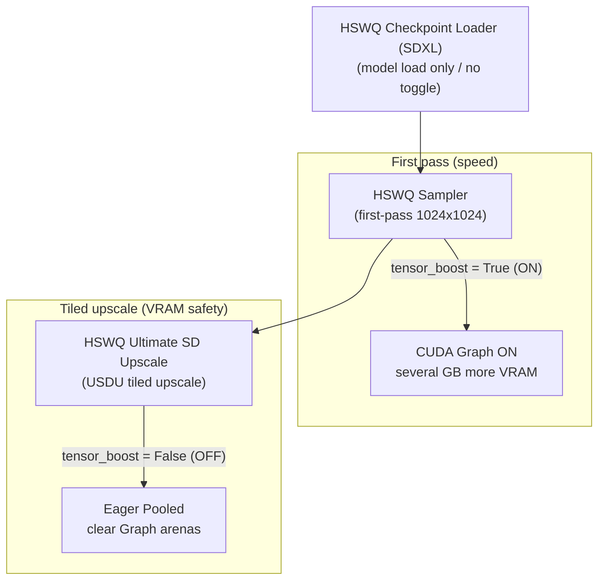

<table align="center">
  <tr>
    <td align="center" bgcolor="#e5e7eb" width="88" height="36"><a href="https://github.com/ussoewwin/ComfyUI-HSWQ-Loader-and-Tools/releases/tag/v3.4.0"><font color="#4b5563"><b>EN</b></font></a></td>
    <td align="center" bgcolor="#3478ca" width="88" height="36"><font color="#ffffff"><b>中文</b></font></td>
  </tr>
</table>

## 1. 概述

为在 NVIDIA Blackwell（SM >= 100：B200 / GB200、RTX 5090 / SM120）上最大化 HSWQ SDXL ConvRot NVFP4 推理性能，本栈引入了 **按权重（Per-Weight）CUDA Graph 自动分发机制（Tensor Boost）**。

该功能是 **仅封闭在 `nodes/nvfp4/` 内的受保护设计**（SDXL 产品 Tensor Core 路径）。它不影响 Z Image ConvRot NVFP4（`nodes/zimage_nvfp4/` 的 comfy-parity 路径）、SDXL ConvRot INT8、FP8，或原版 FP16/BF16 路径——完全分离的架构。

为在采样速度与 **Tensor Boost 开启时多占数 GB 显存**、以及放大（USDU：Ultimate SD Upscale）时的显存饱和 / 系统内存溢出之间取得平衡，采样器（`HSWQSampler`）与放大节点（`HSWQUltimateSDUpscale`）上分别提供独立的 **BOOLEAN 开关**。使用 Tensor Boost / 高分块放大时推荐 **RTX 5090 且 32 GB+**。

---

## 2. 架构背景与设计

### 2.1 先前 CUDA Graph（按形状共享）的局限
先前的 SDXL NVFP4 CUDA Graph 路径是按形状共享的（`_GRAPH_CACHE`），并在每次调用时用 `static_w.copy_(w_qdata)` 复制完整权重张量。
该权重复制开销使 CUDA Graph（约 13.05 s）比 eager pooled 路径（约 11.8 s）更慢。

### 2.2 引入按权重 CUDA Graph（`nvfp4_quant_mm_cudagraph_perweight`）
在 Blackwell（SM100 / SM120）上，FP4（E2M1）Tensor Core 吞吐显著更高，因此主机 / PyTorch 开销与权重传输复制成为主导。
采样期间，模型权重地址（`data_ptr`）在显存中保持稳定，因此增加了 `nvfp4_quant_mm_cudagraph_perweight`，以 **将权重直接捕获进图**，无需复制。

- **重放时零权重复制**：每次重放仅复制激活 `x` 与 scale（`scale_a`、`alpha`、`bias`）；消除权重传输开销。
- **更大的 M 覆盖**：自适应上限 `_PER_WEIGHT_GRAPH_MAX_M = 16384` 覆盖 1024×1024 与 USDU 图块下全部 SDXL UNet Linear 形状（$M = 8192, 4096, 2048, 512$ 等）。

---

## 3. 内存特性与显存饱和缓解

### 3.1 Eager Pooled 与 CUDA Graph（Tensor Boost）

| 项目 | Eager Pooled（`tensor_boost = False`） | Tensor Boost（`tensor_boost = True`） |
|:---|:---|:---|
| **分配方式** | 单一缓冲区（`_ACT_Q_POOL`）在约 140 层间复用 | PyTorch 不释放的静态分配器（CUDA Graph arena） |
| **显存** | 无 CUDA Graph arena 堆叠（Eager pooled 复用） | **多占数 GB**（CUDA Graph arena；shape 变化时还会继续堆叠） |
| **CPU launch 延迟** | 存在（每层 15–30 μs） | **为零**（GPU 批量重放） |
| **速度** | 基线 | **最快（约快 15%–25%）** |
| **推荐用途** | **· USDU 分块放大（保持关闭）<br>· 输入形状变化（tiling）** | **· 推荐 RTX 5090 32 GB+<br>· 首遍 1024×1024 单一分辨率<br>· 以最高速度连续采样** |

### 3.2 USDU（分块放大）显存膨胀与缓解
**Tensor Boost 开启本身就会增加数 GB 显存。** 在多图块 USDU 中，边缘处理等情况还会按图块喂入 **不同的输入形状（$M$）**。
PyTorch CUDA Graphs 按形状各捕获一张图，因此 arena 会堆叠——没有 5090 级余量时，专用显存易饱和并溢出到共享 GPU 内存（系统 RAM）。

在 USDU 节点上将 `tensor_boost = False`（默认）会在放大一开始就清空 CUDA Graph 缓存，并以 **Eager Pooled** 运行，避免分块时不同 shape 继续堆叠 Graph arena。

---

## 4. UI 节点开关与控制布局

预期工作流为：**用 Tensor Boost 加速底图，仅在放大时关闭以避免显存膨胀**。各节点职责：

### 4.1 节点职责



1. **`HSWQ Checkpoint Loader (SDXL)`**：
   - **无开关**。仅加载模型并安装 NVFP4 算子。
   - 不在 Loader 上放开关，可避免从加载起就把整张图锁为 OFF（而 USDU 放大需要 OFF）。

2. **`HSWQ Sampler`（首遍采样节点）**：
   - **`tensor_boost`（BOOLEAN 开关）**。
   - **ON（`True`）**：首遍 1024×1024 采样以完整 Tensor Boost（CUDA Graph）速度运行；**显存增加数 GB**。采样器路径推荐 **16 GB+**。

3. **`HSWQ Ultimate SD Upscale`（USDU 节点）**：
   - **`tensor_boost`（BOOLEAN 开关）**（`default: False`）。
   - **OFF（`False`）**：放大开始时设置 `HSWQ_NVFP4_TENSORBOOST=0` 并运行 `clear_nvfp4_cudagraphs()`，避免分块堆叠 Graph arena / 溢出。本路径若 **ON**，因 Tensor Boost 本身已多占 **数 GB**，推荐 **RTX 5090 32 GB+**。

### 4.2 环境变量接口

UI 开关映射到门控下层分发路径的环境变量：

- `HSWQ_NVFP4_TENSORBOOST=1` / `HSWQ_NVFP4_CUDAGRAPH=1`：开启 Tensor Boost
- `HSWQ_NVFP4_TENSORBOOST=0` / `HSWQ_NVFP4_CUDAGRAPH=0`：关闭 Tensor Boost（Eager Pooled）

---

## 5. 日志与诊断

Tensor Boost 状态可在控制台 / ComfyUI 日志中实时查看。

### 5.1 开关状态日志（在 NVFP4 加载时——见 §11）
- **开关 ON**：
  ```text
  [HSWQ NVFP4 Tensor Boost] Tensor Boost Toggle ON: CUDA Graph Tensor Boost ACTIVE
  ```
- **开关 OFF**：
  ```text
  [HSWQ NVFP4 Tensor Boost] Tensor Boost Toggle OFF: Eager Pooled Path ACTIVE (Graph arenas cleared)
  ```

### 5.2 捕获与命中统计
- **捕获日志**：
  ```text
  [HSWQ NVFP4 Tensor Boost] Captured Blackwell per-weight CUDA Graph #1 (shape M=8192 K=2048 N=2048, w_ptr=0x..., device=cuda:0)
  ```
- **命中里程碑（100、500、1000、…）**：
  ```text
  [HSWQ NVFP4 Tensor Boost] Running CUDA Graph accelerated GEMM (100 hits active)
  ```
- **`nvfp4_forward_stats()` 字典**：
  - `"blackwell_graph_hits"`：累计 Blackwell CUDA Graph 重放次数
  - `"blackwell_tensor_boost_active"`：GPU 类别标志（`True` / `False`）

---

## 6. 路径隔离与安全保证

| 路径 | 标志 / 条件 | Tensor Boost | 内存保护 |
|:---|:---|:---|:---|
| **SDXL ConvRot NVFP4** | `module._hswq_nvfp4 = True` | ✅ Sampler / USDU 开关 | `_PER_WEIGHT_GRAPH_CACHE.clear()` + `empty_cache()` |
| **Z Image ConvRot NVFP4** | Parity 路径（`_hswq_nvfp4 = False`） | ❌ 完全排除（Comfy Parity） | 无法进入 `_tc_forward_pooled` |
| **SDXL ConvRot INT8** | ComfyUI MixedPrecision / INT8 Ops | ❌ 完全排除 | 独立绑定 |
| **FP8 / Native FP16** | 原版 ComfyUI Ops | ❌ 完全排除 | 原版 ComfyUI ops |

Z Image NVFP4、INT8 与 FP8 的加载 / 推理代码未被改动。Tensor Boost 仅在 SDXL ConvRot NVFP4 产品路径内运行，因此不会污染其他格式与模型结构。

---

## 7. 附录方针（本节起）

§1–§6 仍是权威的设计摘要、表格、日志字符串与推荐工作流。
从本节起，指南按实现补充 **文件名、相关完整代码与含义**，便于对照源码做诊断。

控制流（摘要）：

```text
UI (Sampler / USDU).tensor_boost
  → os.environ["HSWQ_NVFP4_TENSORBOOST"] = "1"|"0"
  → (when OFF) clear_nvfp4_cudagraphs()
  → Linear.forward (make_nvfp4_linear_forward)  [requires: module._hswq_nvfp4]
  → _tc_forward_pooled
  → is_nvfp4_cudagraph_enabled() × is_blackwell_gpu()
  → nvfp4_quant_mm_cudagraph_perweight  OR  eager pooled
```

Loader 无开关。在 **NVFP4 checkpoint 加载** 时也会读取当前环境变量，并打印与 §5.1 相同的 Toggle 行（细节见 §11）。

---

## 8. 创建 / 修改的文件（Tensor Boost）

| 类型 | 路径 | 对 Tensor Boost 的作用 |
|:---|:---|:---|
| **核心 / 修改** | `nodes/nvfp4/nvfp4_runtime.py` | `_PER_WEIGHT_*` 缓存、`clear_nvfp4_cudagraphs`、`nvfp4_quant_mm_cudagraph_perweight` |
| **核心 / 修改** | `nodes/nvfp4/nvfp4_forward.py` | `_tc_forward_pooled` 分发、命中统计、`nvfp4_forward_stats` |
| **核心 / 修改** | `nodes/nvfp4/nvfp4_conf.py` | `is_blackwell_gpu`、`is_nvfp4_cudagraph_enabled`（读环境变量） |
| **核心 / 既有（门控）** | `nodes/nvfp4/nvfp4_load.py` | `arm_nvfp4_module` 设置 `_hswq_nvfp4 = True`（进入 TC 的条件） |
| **UI / 修改** | `nodes/hswq_sampler.py` | 可选 `tensor_boost`；在 `sample` 开始时写环境变量 + OFF 时清空 |
| **UI / 修改** | `nodes/nunchaku_usdu.py` | 必需 `tensor_boost`（默认 False）；在 `upscale` 开始时写环境变量 + 清空 |
| **加载诊断 / 修改** | `nodes/nvfp4/comfy_quant_nvfp4.py` | NVFP4 加载时打印 §5.1 Toggle ON/OFF 日志 |
| **Loader（无开关）** | `__init__.py` | `HSWQCheckpointLoaderSDXL` — 仅 `ckpt_name` / `weight_dtype` / `device` |
| **隔离（未应用）** | `nodes/zimage_nvfp4/` | Comfy-parity；不使用产品 TC（`_tc_forward_pooled`） |

“新”核心是 **`nvfp4_quant_mm_cudagraph_perweight` 加上按权重缓存集合**。UI、环境变量与分发是接到既有 SDXL NVFP4 栈上的接线。

---

## 9. 按文件：完整代码与含义

### 9.1 `nodes/nvfp4/nvfp4_conf.py` — GPU 检测与环境变量门控

#### 含义

- **`is_blackwell_gpu()`**：计算能力 major ≥ 10（SM100 / SM120 等）。**进入按权重图的 GPU 条件**。
- **`is_nvfp4_cudagraph_enabled()`**：先读 `HSWQ_NVFP4_CUDAGRAPH`，再读 `HSWQ_NVFP4_TENSORBOOST`。`'1'/'true'/'on'/'enable(d)'` → True；`'0'/'false'/'off'/'disable(d)'` → False。**若两者皆未设置 → False**（默认 Eager）。
- UI 主要只写 **`HSWQ_NVFP4_TENSORBOOST`**。读取端接受两个键，因此手动设置 `CUDAGRAPH` 也会命中同一门控。

#### 完整代码（与 Tensor Boost 相关的块）

```python
# ---------------------------------------------------------------------------
# Blackwell GPU capability detection (SDXL NVFP4 product path only)
# ---------------------------------------------------------------------------
_GPU_CC: tuple | None = None


def _get_gpu_cc() -> tuple:
    """Return (major, minor) compute capability, cached."""
    global _GPU_CC
    if _GPU_CC is None:
        import torch

        if torch.cuda.is_available() and torch.cuda.device_count() > 0:
            _GPU_CC = torch.cuda.get_device_capability()
        else:
            _GPU_CC = (0, 0)
    return _GPU_CC


def is_blackwell_gpu() -> bool:
    """True if GPU is Blackwell class (SM >= 100): B200, RTX 5090, etc.

    Called only from nodes/nvfp4 product-TC path guards.  Z Image and INT8
    never reach this code.
    """
    major, _ = _get_gpu_cc()
    return major >= 10


def is_blackwell_datacenter() -> bool:
    """True if GPU is SM100 datacenter Blackwell (TMA/TMEM available)."""
    major, minor = _get_gpu_cc()
    return major == 10 and minor == 0


def is_blackwell_consumer() -> bool:
    """True if GPU is SM120/SM121 consumer Blackwell (RTX 50x0 series)."""
    major, _ = _get_gpu_cc()
    return major == 12


def is_nvfp4_cudagraph_enabled() -> bool:
    """Return whether CUDA Graph / Tensor Boost execution is active.

    Evaluates HSWQ_NVFP4_TENSORBOOST and HSWQ_NVFP4_CUDAGRAPH environment variables.
    Returns True if set to '1' / 'true' / 'on' / 'enable'.
    Returns False otherwise.
    """
    import os

    for env_key in ("HSWQ_NVFP4_CUDAGRAPH", "HSWQ_NVFP4_TENSORBOOST"):
        val = os.environ.get(env_key, "").strip().lower()
        if val in ("1", "true", "on", "enable", "enabled"):
            return True
        if val in ("0", "false", "off", "disable", "disabled"):
            return False

    return False
```

---

### 9.2 `nodes/nvfp4/nvfp4_runtime.py` — 池、清空、按权重 Graph

#### 含义

| 符号 | 含义 |
|:---|:---|
| `_ACT_Q_POOL` / `_ROT_OUT_POOL` | Eager 激活量化 / Hadamard 旋转缓冲区复用（无 CUDA Graph arena） |
| `_GRAPH_CACHE` / `_GRAPH_MAX_M=512` | **非 Blackwell** 按形状共享的图（重放时复制权重）。不是 Blackwell Tensor Boost 主路径 |
| `_PER_WEIGHT_GRAPH_CACHE` | Blackwell 主路径。键包含 `w_qdata.data_ptr()` 与形状 |
| `_PER_WEIGHT_GRAPH_CACHE_MAX = 500` | LRU 上限（约 140 个 Linear × 多种图块形状） |
| `_PER_WEIGHT_GRAPH_MAX_M = 16384` | 覆盖 SDXL 1024² / USDU 大 M |
| `clear_nvfp4_cudagraphs()` | 清空两个图缓存 + `torch.cuda.empty_cache()`。在 USDU OFF、Sampler OFF、OOM 时调用 |
| `nvfp4_quant_mm_cudagraph_perweight` | 捕获时按引用使用 `w_qdata`（不复制权重）。重放仅复制 `x` / scales / bias → `graph.replay()` |

#### 完整代码（常量、清空、按权重函数）

```python
# (padded_rows, padded_cols, device_str) -> (qx uint8, sx_uint8)
# Safe to reuse: only live during one Linear forward (quantize → mm reads sync).
_ACT_Q_POOL: dict = {}
# (m, group_count, group_size, dtype, device_str) -> rotated
# Safe: consumed inside the same Linear before return.
_ROT_OUT_POOL: dict = {}
# CUDA Graph: shape-shared (weight copied each replay). LRU-capped to avoid OOM.
_GRAPH_CACHE: OrderedDict = OrderedDict()
_GRAPH_CACHE_MAX = 32
# Only graph small-M calls (microbench: NVFP4 mm loses to FP16 when M is small).
_GRAPH_MAX_M = 512
# Per-weight CUDA Graph cache (Blackwell auto-detect): weight data_ptr -> graph.
# Eliminates weight .copy_() overhead of shape-shared graphs. Weight tensor
# is used directly in the captured graph — address is stable while the model
# stays on GPU during sampling.
_PER_WEIGHT_GRAPH_CACHE: OrderedDict = OrderedDict()
_PER_WEIGHT_GRAPH_CACHE_MAX = 500  # ~140 unique Linears in SDXL UNet x multiple tiles
_PER_WEIGHT_GRAPH_MAX_M = 16384  # Covers all SDXL UNet layer M dimensions (1024x1024 / USDU)
# NOTE: MM *output* must NOT be pooled — UNet residuals keep layer outputs alive
# across later layers; a reused buffer would corrupt activations.


def clear_nvfp4_cudagraphs() -> None:
    _GRAPH_CACHE.clear()
    _PER_WEIGHT_GRAPH_CACHE.clear()
    import torch
    if torch.cuda.is_available():
        torch.cuda.empty_cache()


def clear_nvfp4_runtime_pools() -> None:
    _ACT_Q_POOL.clear()
    _ROT_OUT_POOL.clear()
    clear_nvfp4_cudagraphs()
```

```python
def _copy_f32_1(dst, src):
    """Copy a scalar scale tensor into a static float32 buffer."""
    import torch

    if isinstance(src, torch.nn.Parameter):
        src = src.data
    if src.dtype != torch.float32 or src.device != dst.device:
        src = src.to(device=dst.device, dtype=torch.float32)
    dst.copy_(src.reshape(1))


def nvfp4_quant_mm_cudagraph_perweight(
    x,
    *,
    w_qdata,
    weight_scale,
    block_scale_w,
    scale_a,
    bias,
    out_dtype,
    alpha,
    pad_16x: bool,
    orig_n: int,
):
    """Per-weight CUDA Graph for Blackwell: quantize + GEMM without weight copy.

    Unlike shape-shared ``nvfp4_quant_mm_cudagraph`` which copies the full weight
    tensor on every replay (~13 s vs ~11.8 s eager), this variant uses the weight
    tensor *directly* as a graph input.  The weight address is stable while the
    model stays on GPU during sampling (~20-50 steps × ~140 Linears).

    On replay only ``x`` (activation), ``scale_a``, ``alpha``, and ``bias`` are
    copied into static buffers — all much smaller than the weight.

    Guarded by ``is_blackwell_gpu()`` in ``nvfp4_forward._tc_forward_pooled``;
    non-Blackwell GPUs never reach this function.  Z Image NVFP4 (comfy-parity
    path) never reaches ``_tc_forward_pooled`` at all.
    """
    import torch
    from comfy_kitchen.backends.cuda import roundup

    if x.dim() != 2:
        raise ValueError("nvfp4_quant_mm_cudagraph_perweight expects 2D x")
    m, k = int(x.shape[0]), int(x.shape[1])
    if m > _PER_WEIGHT_GRAPH_MAX_M:
        raise ValueError(
            f"M={m} exceeds _PER_WEIGHT_GRAPH_MAX_M={_PER_WEIGHT_GRAPH_MAX_M}"
        )
    n = int(w_qdata.shape[0])
    has_bias = bias is not None and not (
        isinstance(bias, torch.Tensor) and bias.numel() == 0
    )
    w_ptr = w_qdata.data_ptr()

    key = (
        w_ptr,
        m,
        k,
        n,
        str(out_dtype),
        bool(pad_16x),
        has_bias,
        int(orig_n),
    )

    entry = _PER_WEIGHT_GRAPH_CACHE.get(key)
    if entry is not None:
        _PER_WEIGHT_GRAPH_CACHE.move_to_end(key)
        # Verify weight has not moved (e.g. model reloaded to GPU).
        if entry["w_ptr"] != w_ptr:
            del _PER_WEIGHT_GRAPH_CACHE[key]
            entry = None

    if entry is None:
        # -- Evict oldest if cache is full --------------------------------
        while len(_PER_WEIGHT_GRAPH_CACHE) >= _PER_WEIGHT_GRAPH_CACHE_MAX:
            _PER_WEIGHT_GRAPH_CACHE.popitem(last=False)

        # -- Allocate static buffers (activation side only) ---------------
        out_m = roundup(m, 16) if pad_16x else m
        static_x = torch.empty(m, k, dtype=x.dtype, device=x.device)
        static_out = torch.empty(out_m, n, dtype=out_dtype, device=x.device)
        static_scale_a = torch.empty(1, dtype=torch.float32, device=x.device)
        static_alpha = torch.empty(1, dtype=torch.float32, device=x.device)
        static_bias = torch.empty_like(bias) if has_bias else None

        # -- Initial copies -----------------------------------------------
        static_x.copy_(x)
        _copy_f32_1(static_scale_a, scale_a)
        _copy_f32_1(static_alpha, alpha)
        bias_arg = static_bias if has_bias else bias
        if has_bias:
            static_bias.copy_(bias)

        # -- Warmup on a side stream (2 iterations, same as shape-shared) -
        s = torch.cuda.Stream(device=x.device)
        s.wait_stream(torch.cuda.current_stream(x.device))
        with torch.cuda.stream(s):
            for _ in range(2):
                _run_quant_mm(
                    static_x,
                    scale_a=static_scale_a,
                    w_qdata=w_qdata,
                    weight_scale=weight_scale,
                    block_scale_w=block_scale_w,
                    bias=bias_arg,
                    out_dtype=out_dtype,
                    alpha=static_alpha,
                    pad_16x=pad_16x,
                    orig_m=m,
                    orig_n=orig_n,
                    out=static_out,
                )
        torch.cuda.current_stream(x.device).wait_stream(s)

        # -- Capture graph ------------------------------------------------
        g = torch.cuda.CUDAGraph()
        with torch.cuda.graph(g):
            _run_quant_mm(
                static_x,
                scale_a=static_scale_a,
                w_qdata=w_qdata,          # DIRECT weight ref — no copy!
                weight_scale=weight_scale,
                block_scale_w=block_scale_w,
                bias=bias_arg,
                out_dtype=out_dtype,
                alpha=static_alpha,
                pad_16x=pad_16x,
                orig_m=m,
                orig_n=orig_n,
                out=static_out,
            )

        entry = {
            "graph": g,
            "static_x": static_x,
            "static_out": static_out,
            "static_scale_a": static_scale_a,
            "static_alpha": static_alpha,
            "static_bias": static_bias,
            "has_bias": has_bias,
            "w_ptr": w_ptr,
        }
        _PER_WEIGHT_GRAPH_CACHE[key] = entry
        _console(
            "[HSWQ NVFP4 Tensor Boost] Captured Blackwell per-weight CUDA Graph #"
            f"{len(_PER_WEIGHT_GRAPH_CACHE)} (shape M={m} K={k} N={n}, w_ptr=0x{w_ptr:x}, device={x.device})"
        )

    # -- Replay: copy only activation + scales (NOT weight) ---------------
    static_x = entry["static_x"]
    static_out = entry["static_out"]
    static_x.copy_(x)
    _copy_f32_1(entry["static_scale_a"], scale_a)
    _copy_f32_1(entry["static_alpha"], alpha)
    if entry["has_bias"]:
        entry["static_bias"].copy_(bias)
    entry["graph"].replay()
    return static_out[:m, :orig_n].clone()
```

（同文件中，`_run_quant_mm` / 按形状共享的 `nvfp4_quant_mm_cudagraph` / `quantize_nvfp4_act_pooled` 服务于 Eager 与非 Blackwell 回退。Tensor Boost 主线是上面的按权重路径。）

---

### 9.3 `nodes/nvfp4/nvfp4_forward.py` — 分发与统计

#### 含义

1. **`make_nvfp4_linear_forward`**：没有 `_hswq_nvfp4` 或带有 `_full_precision_mm` 的层保持原版。已武装的层做 reshape → ConvRot → cast → `_tc_forward_pooled`。
2. **`_tc_forward_pooled`**：
   - `_cg_enabled = is_nvfp4_cudagraph_enabled()`
   - `_bw = is_blackwell_gpu()`
   - **Blackwell + CG ON + M ≤ 16384** → `nvfp4_quant_mm_cudagraph_perweight`（失败时：清空 / 按模块禁用）
   - **非 Blackwell + CG ON + M ≤ 512** → 按形状共享的 `nvfp4_quant_mm_cudagraph`
   - 否则 / 失败后 → Eager pooled（`quantize_nvfp4_act_pooled` + `scaled_mm_nvfp4_pooled`）
3. **`nvfp4_forward_stats()`**：
   - `blackwell_graph_hits` = 累计成功的按权重重放次数（与 §5.2 里程碑同一计数器）
   - **`blackwell_tensor_boost_active` = `is_blackwell_gpu()`**（不是“开关当前为 ON”；而是 GPU 是否为 Blackwell）

#### 完整代码（统计、`_tc_forward_pooled`、forward 入口）

```python
def reset_nvfp4_forward_stats() -> None:
    global _TC_HITS, _DEQUANT_FALLBACKS, _BLACKWELL_GRAPH_HITS
    _TC_HITS = 0
    _DEQUANT_FALLBACKS = 0
    _BLACKWELL_GRAPH_HITS = 0


def nvfp4_forward_stats() -> dict:
    return {
        "scaled_mm_hits": _TC_HITS,
        "dequant_fallbacks": _DEQUANT_FALLBACKS,
        "blackwell_graph_hits": _BLACKWELL_GRAPH_HITS,
        "blackwell_tensor_boost_active": is_blackwell_gpu(),
    }
```

```python
def _tc_forward_pooled(module, input_2d, weight_qt, bias, act_scale, out_dtype):
    """Act float → pooled NVFP4 quant → pooled cuBLAS mm (no QT alloc).

    Prefers CUDA Graph (quantize+mm) after first capture per shape/weight; falls
    back to eager pooled kernels if capture/replay fails.
    """
    global _TC_HITS, _DEQUANT_FALLBACKS, _BLACKWELL_GRAPH_HITS
    import torch
    from comfy_kitchen.tensor.base import QuantizedTensor
    from comfy_kitchen.tensor.nvfp4 import TensorCoreNVFP4Layout

    if not (
        isinstance(weight_qt, QuantizedTensor)
        and weight_qt._layout_cls == "TensorCoreNVFP4Layout"
    ):
        _DEQUANT_FALLBACKS += 1
        return None
    if getattr(weight_qt._params, "transposed", False):
        _DEQUANT_FALLBACKS += 1
        return None

    if isinstance(bias, QuantizedTensor):
        bias = bias.dequantize()

    orig_m, orig_k = int(input_2d.shape[0]), int(input_2d.shape[1])
    needs_padding = TensorCoreNVFP4Layout.get_padded_shape((orig_m, orig_k)) != (
        orig_m,
        orig_k,
    )

    scale_a = ensure_act_scale(input_2d, act_scale)
    try:
        w_qdata, scale_b, block_scale_b, orig_n = _plain_weight_cached(module, weight_qt)

        cached_alpha = getattr(module, "_hswq_nvfp4_alpha", None)
        if cached_alpha is None:
            alpha = scale_a * scale_b
            if alpha.dtype != torch.float32:
                alpha = alpha.to(dtype=torch.float32)
            if alpha.dim() == 0:
                alpha = alpha.reshape(1)
            module._hswq_nvfp4_alpha = alpha
        else:
            alpha = cached_alpha

        # CUDA Graph / Tensor Boost dispatch:
        # Check user toggle / env vars via is_nvfp4_cudagraph_enabled().
        # Setting HSWQ_NVFP4_CUDAGRAPH=0 or HSWQ_NVFP4_TENSORBOOST=0 completely
        # disables CUDA Graph and falls back 100% to eager pooled execution.
        _cg_enabled = is_nvfp4_cudagraph_enabled()
        _bw = is_blackwell_gpu()

        if _cg_enabled and not getattr(module, "_hswq_nvfp4_no_cudagraph", False):
            if _bw and orig_m <= _PER_WEIGHT_GRAPH_MAX_M:
                try:
                    result = nvfp4_quant_mm_cudagraph_perweight(
                        input_2d,
                        w_qdata=w_qdata,
                        weight_scale=scale_b,
                        block_scale_w=block_scale_b,
                        scale_a=scale_a,
                        bias=bias,
                        out_dtype=out_dtype,
                        alpha=alpha,
                        pad_16x=needs_padding,
                        orig_n=orig_n,
                    )
                    _TC_HITS += 1
                    _BLACKWELL_GRAPH_HITS += 1
                    if _BLACKWELL_GRAPH_HITS in (100, 500, 1000, 2000, 5000) or (
                        _BLACKWELL_GRAPH_HITS > 0 and _BLACKWELL_GRAPH_HITS % 5000 == 0
                    ):
                        _console(
                            "[HSWQ NVFP4 Tensor Boost] Running CUDA Graph accelerated GEMM "
                            f"({_BLACKWELL_GRAPH_HITS} hits active)"
                        )
                    return result
                except torch.cuda.OutOfMemoryError:
                    clear_nvfp4_cudagraphs()
                    torch.cuda.empty_cache()
                    logger.warning(
                        "[HSWQ NVFP4 Blackwell] per-weight Graph OOM — "
                        "cache cleared; eager pooled"
                    )
                except (RuntimeError, TypeError, ValueError) as e:
                    if "out of memory" in str(e).lower():
                        clear_nvfp4_cudagraphs()
                        torch.cuda.empty_cache()
                        logger.warning(
                            "[HSWQ NVFP4 Blackwell] per-weight Graph OOM "
                            "(%s); eager pooled", e
                        )
                    else:
                        module._hswq_nvfp4_no_cudagraph = True
                        logger.warning(
                            "[HSWQ NVFP4 Blackwell] per-weight Graph disabled "
                            "for module (%s); eager pooled", e,
                        )
            elif not _bw and orig_m <= _GRAPH_MAX_M:
                try:
                    result = nvfp4_quant_mm_cudagraph(
                        input_2d,
                        w_qdata=w_qdata,
                        weight_scale=scale_b,
                        block_scale_w=block_scale_b,
                        scale_a=scale_a,
                        bias=bias,
                        out_dtype=out_dtype,
                        alpha=alpha,
                        pad_16x=needs_padding,
                        orig_n=orig_n,
                    )
                    _TC_HITS += 1
                    return result
                except torch.cuda.OutOfMemoryError:
                    clear_nvfp4_cudagraphs()
                    torch.cuda.empty_cache()
                    logger.warning(
                        "[HSWQ NVFP4] CUDA Graph OOM — cache cleared; eager pooled"
                    )
                except (RuntimeError, TypeError, ValueError) as e:
                    if "out of memory" in str(e).lower():
                        clear_nvfp4_cudagraphs()
                        torch.cuda.empty_cache()
                        logger.warning(
                            "[HSWQ NVFP4] CUDA Graph OOM (%s); eager pooled", e
                        )
                    else:
                        module._hswq_nvfp4_no_cudagraph = True
                        logger.warning(
                            "[HSWQ NVFP4] CUDA Graph disabled for module (%s); eager pooled",
                            e,
                        )

        a_qdata, block_scale_a, _pr, _pc = quantize_nvfp4_act_pooled(
            input_2d, scale_a, pad_16x=needs_padding
        )
        result = scaled_mm_nvfp4_pooled(
            a_qdata,
            w_qdata,
            tensor_scale_a=scale_a,
            tensor_scale_b=scale_b,
            block_scale_a=block_scale_a,
            block_scale_b=block_scale_b,
            bias=bias,
            out_dtype=out_dtype,
            alpha=alpha,
            orig_m=orig_m,
            orig_n=orig_n,
        )
        _TC_HITS += 1
        return result
    except (RuntimeError, TypeError, ValueError) as e:
        logger.warning("[HSWQ NVFP4] pooled TC path failed: %s", e)
        _DEQUANT_FALLBACKS += 1
        return None
```

```python
def make_nvfp4_linear_forward(stock_forward):
    """
    Return a Linear.forward replacement.

    For modules flagged ``_hswq_nvfp4`` (set at load), run the HSWQ TC path.
    All other layers keep stock_forward unchanged.
    """
    import torch
    import comfy.model_management
    from comfy.ops import cast_bias_weight, run_every_op, uncast_bias_weight

    def forward_nvfp4(self, input, *args, **kwargs):
        if not getattr(self, "_hswq_nvfp4", False) or getattr(self, "_full_precision_mm", False):
            return stock_forward(self, input, *args, **kwargs)

        if input.requires_grad or getattr(self, "comfy_force_cast_weights", False):
            return stock_forward(self, input, *args, **kwargs)

        run_every_op()
        input_shape = input.shape
        compute_dtype = input.dtype

        reshaped_nd = input.ndim >= 3
        input_2d = input.reshape(-1, input_shape[-1]) if reshaped_nd else input
        if input_2d.ndim != 2:
            return stock_forward(self, input, *args, **kwargs)

        if getattr(self, "_hswq_nvfp4_convrot", False):
            gs = int(getattr(self, "_hswq_nvfp4_convrot_groupsize", 256) or 256)
            h = getattr(self, "_hswq_nvfp4_H", None)
            if h is None or h.device != input_2d.device or h.dtype != input_2d.dtype:
                h = build_hadamard(gs, device=input_2d.device, dtype=input_2d.dtype)
                self._hswq_nvfp4_H = h
            input_2d = rotate_last_dim_pooled(input_2d, h, gs)

        offload_stream = None
        weight = self.weight
        if isinstance(weight, torch.nn.Parameter):
            weight = weight.data
        bias = self.bias.data if self.bias is not None else None
        has_wf = len(getattr(self, "weight_function", []) or []) or len(
            getattr(self, "bias_function", []) or []
        )
        need_cast = weight.device != input_2d.device or (
            bias is not None and bias.device != input_2d.device
        )
        if has_wf or need_cast or hasattr(self, "_v"):
            weight, bias, offload_stream = cast_bias_weight(
                self,
                input_2d,
                offloadable=True,
                compute_dtype=compute_dtype,
                want_requant=True,
            )

        scale = getattr(self, "input_scale", None)
        if scale is not None:
            if isinstance(scale, torch.nn.Parameter):
                scale = scale.data
            if scale.device != input.device:
                scale = comfy.model_management.cast_to_device(scale, input.device, None)

        layout = getattr(self, "layout_type", None)
        if layout is None:
            if offload_stream is not None:
                uncast_bias_weight(self, weight, bias, offload_stream)
            return stock_forward(self, input, *args, **kwargs)

        out_2d = _tc_forward_pooled(
            self, input_2d, weight, bias, scale, compute_dtype
        )
        if out_2d is None:
            from comfy.quant_ops import QuantizedTensor

            q_input = QuantizedTensor.from_float(input_2d, layout, scale=scale)
            out_2d = scaled_mm_nvfp4_linear(q_input, weight, bias)

        if reshaped_nd:
            out = out_2d.reshape((*input_shape[:-1], int(self.out_features)))
        else:
            out = out_2d

        if offload_stream is not None:
            uncast_bias_weight(self, weight, bias, offload_stream)
        return out

    forward_nvfp4._hswq_nvfp4_full_forward = True  # type: ignore[attr-defined]
    return forward_nvfp4
```

---

### 9.4 `nodes/nvfp4/nvfp4_load.py` — TC 武装（门控）

#### 含义

`arm_nvfp4_module` 设置 **`module._hswq_nvfp4 = True`**。没有该标志时，`forward_nvfp4` 在顶部回退到原版，**永远不会进入 `_tc_forward_pooled`**。§6「仅 SDXL 的 Tensor Boost」依赖此门控。

#### 完整代码（arm 函数）

```python
def arm_nvfp4_module(module, conf: Optional[dict]) -> None:
    """Attach HSWQ NVFP4 runtime flags after weight QT is in place."""
    if not is_nvfp4_conf(conf):
        return
    import torch

    module._hswq_nvfp4 = True
    enabled, gs = convrot_flags_from_conf(conf)
    module._hswq_nvfp4_convrot = bool(enabled)
    module._hswq_nvfp4_convrot_groupsize = int(gs)
    # Checkpoints often omit input_scale (0 keys in test.safetensors).
    # Placeholder ones(1) + flag → one amax per module then freeze (not every Linear).
    if getattr(module, "input_scale", None) is None:
        device = module.factory_kwargs.get("device", "cpu")
        module.register_parameter(
            "input_scale",
            torch.nn.Parameter(
                torch.ones(1, device=device, dtype=torch.float32),
                requires_grad=False,
            ),
        )
        module._hswq_nvfp4_scale_placeholder = True
    else:
        module._hswq_nvfp4_scale_from_ckpt = True
        module._hswq_nvfp4_scale_placeholder = False
    if enabled:
        logger.debug(
            "[HSWQ NVFP4] ConvRot armed groupsize=%s on %s",
            gs,
            getattr(module, "in_features", "?"),
        )
```

Z Image comfy-parity 使用 `_hswq_nvfp4_comfy_only` / `_hswq_nvfp4_convrot_parity`（等）与独立 forward，不挂接产品 TC arm（在代码层面实现 §6 表的意图）。

---

### 9.5 `nodes/hswq_sampler.py` — Sampler 开关

#### 含义

- `INPUT_TYPES` 中 **可选** `tensor_boost`（默认 **False**）。
- 在 `sample()` **开始**时写环境变量。ON→`1`，OFF→`0` + `clear_nvfp4_cudagraphs()`。
- **此处不打印** §5.1 Toggle ON/OFF 行（仅环境变量 + 清空）。那些日志行在加载时打印（§9.7 / §11）。

#### 完整代码（开关定义与 `sample` 开头）

```python
                "tensor_boost": ("BOOLEAN", {
                    "default": False,
                    "tooltip": "Enable Blackwell Per-Weight CUDA Graph Tensor Boost during sampling. ON raises VRAM by several GB (CUDA Graph arenas).",
                }),
```

```python
    def sample(self, model, seed, steps, cfg, sampler_name, scheduler,
               positive, negative, latent_image, denoise=1.0, **kwargs):
        # Configure Tensor Boost toggle for sampling
        tensor_boost = kwargs.get("tensor_boost", False)
        import os
        if isinstance(tensor_boost, bool):
            tb_enabled = tensor_boost
        else:
            tb_str = str(tensor_boost).strip().lower() if tensor_boost is not None else ""
            tb_enabled = tb_str in ("1", "true", "on", "enable", "enabled")

        if tb_enabled:
            os.environ["HSWQ_NVFP4_TENSORBOOST"] = "1"
        else:
            os.environ["HSWQ_NVFP4_TENSORBOOST"] = "0"
            try:
                from .nvfp4.nvfp4_runtime import clear_nvfp4_cudagraphs
                clear_nvfp4_cudagraphs()
            except Exception:
                pass
```

---

### 9.6 `nodes/nunchaku_usdu.py` — USDU 开关

#### 含义

- **必需** `tensor_boost`（默认 **False**）——与 §3.2 / §4.1「放大默认 OFF」一致。
- `upscale()` 开头与 Sampler 相同模式（环境变量 + OFF 时清空）。
- 在按图块 M 变化之前丢弃图，避免堆叠的显存捕获。

#### 完整代码（输入定义与 `upscale` 开头）

```python
        ("tensor_boost", ("BOOLEAN", {"default": False, "tooltip": "Enable Blackwell Per-Weight CUDA Graph Tensor Boost during USDU tile upscaling. ON raises VRAM by several GB; RTX 5090 32GB+ recommended. Keep OFF for tiled upscale."})),
```

```python
        tensor_boost=False,
        **kwargs,
    ):
        _ensure_imports()

        # Configure Tensor Boost toggle for USDU tile upscaling
        import os
        if isinstance(tensor_boost, bool):
            tb_enabled = tensor_boost
        else:
            tb_str = str(tensor_boost).strip().lower() if tensor_boost is not None else ""
            tb_enabled = tb_str in ("1", "true", "on", "enable", "enabled")

        if tb_enabled:
            os.environ["HSWQ_NVFP4_TENSORBOOST"] = "1"
        else:
            os.environ["HSWQ_NVFP4_TENSORBOOST"] = "0"
            try:
                from .nvfp4.nvfp4_runtime import clear_nvfp4_cudagraphs
                clear_nvfp4_cudagraphs()
            except Exception:
                pass
```

（若 `INPUT_TYPES` 经两条路径构建，两条路径中都存在相同的 `tensor_boost` 定义。）

---

### 9.7 `nodes/nvfp4/comfy_quant_nvfp4.py` — 加载时的 Toggle 日志

#### 含义

在 NVFP4 checkpoint 加载路径内：

1. 读取 `is_blackwell_gpu()` / `is_nvfp4_cudagraph_enabled()`
2. 若 CG 关闭，先调用 `clear_nvfp4_cudagraphs()`
3. 通过 `_console` 用 **与 §5.1 相同的字符串** 打印 ON/OFF

因此 §5.1 日志是 **当时生效的环境变量下、NVFP4 加载时刻的诊断**，不是 Sampler `sample()` 瞬间。更改 Sampler/USDU 开关后，要再看到相同行只能 **重新加载**，或使用捕获 / 命中日志（§5.2）。

#### 完整代码（加载诊断块）

```python
        from .nvfp4_conf import is_blackwell_gpu, is_nvfp4_cudagraph_enabled
        from .nvfp4_runtime import clear_nvfp4_cudagraphs
        _bw = is_blackwell_gpu()
        _cg = is_nvfp4_cudagraph_enabled()
        if not _cg:
            clear_nvfp4_cudagraphs()

        if _cg:
            _console(
                "[HSWQ NVFP4 Tensor Boost] Tensor Boost Toggle ON: "
                "CUDA Graph Tensor Boost ACTIVE"
            )
        else:
            _console(
                "[HSWQ NVFP4 Tensor Boost] Tensor Boost Toggle OFF: "
                "Eager Pooled Path ACTIVE (Graph arenas cleared)"
            )
```

（同一块中会取 `_bw`，但本打印仅按 `_cg` 分支。Blackwell 检测在运行时分发中生效。）

---

### 9.8 `__init__.py` — `HSWQCheckpointLoaderSDXL`（无开关）

#### 含义

Loader 仅暴露 `ckpt_name` / `weight_dtype`（含 `ConvRot NVFP4`）/ `device`。**没有 `tensor_boost` 输入**。实现 §4.1「将加载与运行时开关分离」。

#### 完整代码（`INPUT_TYPES` 与 load 入口）

```python
        class HSWQCheckpointLoaderSDXL(_UNETLoaderBase):
            """HSWQ Checkpoint Loader (SDXL) with device selection. Ref: CheckpointLoaderSimple."""

            @classmethod
            def INPUT_TYPES(cls):
                base = _UNETLoaderBase.INPUT_TYPES()
                base_req = dict(base.get("required", {}))
                base_opt = dict(base.get("optional", {}))
                devices = get_device_list()
                default_dev = devices[1] if len(devices) > 1 else devices[0]
                req = {
                    "ckpt_name": (folder_paths.get_filename_list("checkpoints"), {"tooltip": "SDXL checkpoint to load MODEL and CLIP from (same as standard Load Checkpoint)."}),
                    "weight_dtype": ([
                        "default",
                        "fp8_e4m3fn",
                        "fp8_e4m3fn_fast",
                        "fp8_e5m2",
                        "int8_tensorwise",
                        # SDXL only — never reuse Z Image / Krea "Z Image ConvRot NVFP4".
                        "ConvRot NVFP4",
                    ],),
                }
                opt = {"device": (devices, {"default": default_dev})}
                return {"required": req, "optional": opt}

            RETURN_TYPES = ("MODEL", "CLIP")
            OUTPUT_TOOLTIPS = ("The UNet diffusion model from checkpoint.", "The CLIP model from the SDXL checkpoint.")
            FUNCTION = "load_checkpoint"
            CATEGORY = "loaders"
            TITLE = "HSWQ Checkpoint Loader (SDXL)"

            def load_checkpoint(self, ckpt_name, weight_dtype, device=None):
                ...
```

（当 `weight_dtype == "ConvRot NVFP4"` 时，实际加载经 `install_nvfp4_option_dispatch` 重定向到 `comfy_quant_nvfp4`。）

---

## 10. 分发分支表（实现映射）

| 条件 | 路径 |
|:---|:---|
| `not module._hswq_nvfp4` | 原版 Linear（非 Tensor Boost） |
| CG OFF（环境变量未设 / `0`） | Eager pooled（无 CUDA Graph arena 堆叠） |
| CG ON + Blackwell + `M ≤ 16384` | **按权重 CUDA Graph（Tensor Boost 主线）** |
| CG ON + 非 Blackwell + `M ≤ 512` | 按形状共享 CUDA Graph（复制权重） |
| CG ON 但不满足以上 / OOM / 非 OOM 失败 | Eager pooled（OOM 时清空缓存） |
| `module._hswq_nvfp4_no_cudagraph` | 该模块此后保持 Eager |

---

## 11. §5 诊断与实现对照（保留 §5 措辞；说明出处）

| §5 文本 | 实现来源 |
|:---|:---|
| §5.1 Toggle ON/OFF 行 | `comfy_quant_nvfp4.py` 中的 **NVFP4 checkpoint 加载**（不是 Sampler/USDU 运行开头） |
| Sampler/USDU 开关动作 | 写环境变量 + 仅在 OFF 时 `clear_nvfp4_cudagraphs()`；不重打相同行 |
| §5.2 Captured … Graph #N | `nvfp4_quant_mm_cudagraph_perweight` 中首次捕获 |
| §5.2 Running … N hits | `_tc_forward_pooled` 内 `_BLACKWELL_GRAPH_HITS` 里程碑 |
| `blackwell_graph_hits` | 该计数器的快照 |
| `blackwell_tensor_boost_active` | **`is_blackwell_gpu()`**（不是开关 ON 状态） |

实际读法：

- **「本次采样是否在跑 Graph？」** → Captured / hits 日志，或 `blackwell_graph_hits` 是否在增加。
- **「GPU 是否为 Blackwell？」** → `blackwell_tensor_boost_active`。
- **「开关是否为 ON？」** → Sampler/USDU UI，或 `HSWQ_NVFP4_TENSORBOOST`。加载时的 Toggle 行反映的是 **加载时的环境变量**。

---

## 12. 推荐工作流（§4 的操作步骤）

1. 用 `HSWQ Checkpoint Loader (SDXL)` 加载，`weight_dtype = ConvRot NVFP4`（无开关）。
2. `HSWQ Sampler` 设 `tensor_boost = True` → 加速固定分辨率底图生成（**显存多占数 GB**；采样器推荐 **16 GB+**）。
3. `HSWQ Ultimate SD Upscale` 设 `tensor_boost = False`（默认）→ 在图块前丢弃图；安全跑 Eager。放大 / Tensor Boost 余量：**RTX 5090 32 GB+**。
4. 形状高度变化或显存紧张时，Sampler 也保持 False。
5. 单一固定分辨率且有 Graph arena（数 GB）余量时，优先 Sampler True。

---

## 13. 路径隔离说明（§6 的补充）

- 产品 TC 的主入口标志是 **`_hswq_nvfp4`**（`arm_nvfp4_module`）。
- Z Image 通过 `nodes/zimage_nvfp4/` 的 comfy-parity forward / `_hswq_nvfp4_comfy_only`（等）隔离。它不搭乘产品 `_tc_forward_pooled`。
- INT8 / FP8 / 原版 dtype 使用其他 ops 与 loader 分支。没有 `_hswq_nvfp4` 时，Tensor Boost 代码不会运行。
- 将 §6 的 “parity” 标签视为路径隔离描述。运行时门控是 **`_hswq_nvfp4` 是否存在**，再加上 parity forward 的挂接。

---

## 14. 自检清单

```
□ Sampler / USDU tensor_boost matches intent
□ On OFF, HSWQ_NVFP4_TENSORBOOST=0 and clear run (USDU default False)
□ Loader was not given an unauthorized tensor_boost widget
□ Not expecting per-weight on non-Blackwell (non-BW → shape-shared or Eager)
□ Not running many USDU tiles with True (stacked VRAM captures)
□ Not reading stats.blackwell_tensor_boost_active as “toggle state”
□ Not treating Toggle ON/OFF lines as proof of sample() instant (they are load-time logs)
□ Not expecting Product TC on Z Image / INT8 checkpoints
```

---

（§1–§6 = 设计与操作摘要。§7 起 = 文件、完整代码、含义与诊断映射。合在一起构成完整指南。）
