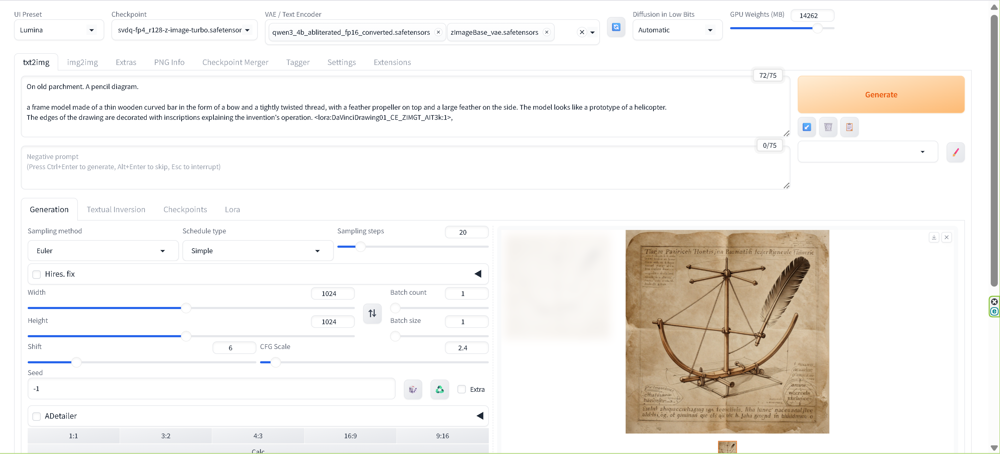
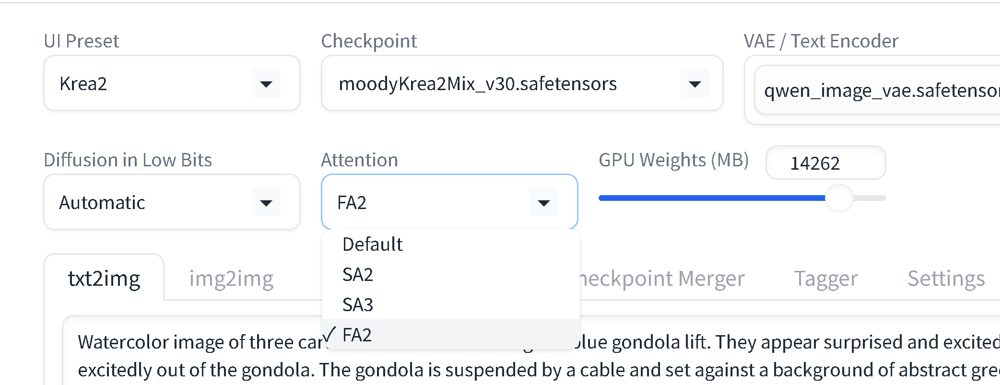
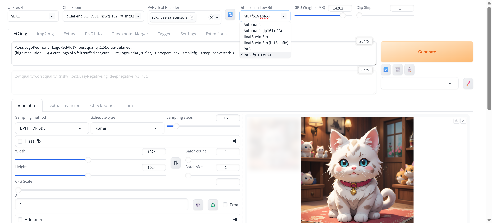
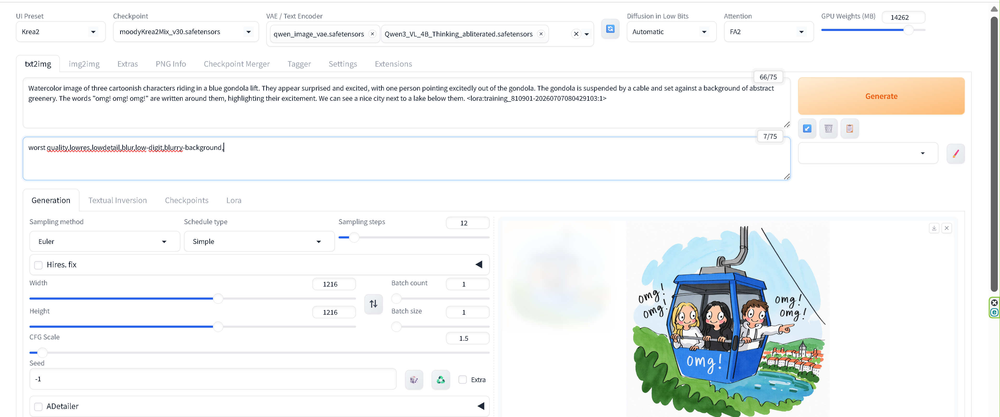
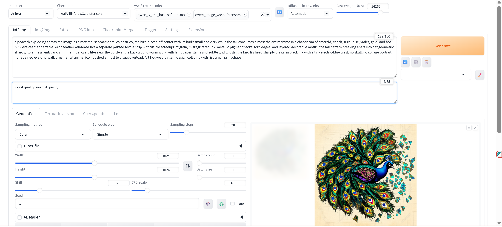
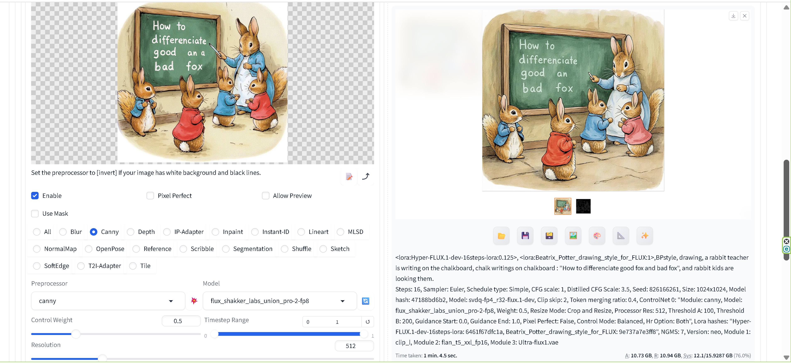

<h1 align="center">Stable Diffusion WebUI Forge - Nunchaku</h1>

<table align="center">
  <tr>
    <td align="center" bgcolor="#e5e7eb" width="88" height="36"><a href="../README.md"><b>EN</b></a></td>
    <td align="center" bgcolor="#d4465e" width="88" height="36"><b>中文</b></td>
  </tr>
</table>

⚠️ **本项目仅支持 Python 3.14。**

  

## 关于

**Stable Diffusion WebUI Forge — Nunchaku** 将 Nunchaku 集成到 Forge 中，包括 Nunchaku 模型的 LoRA 和 ControlNet 支持。

## 功能

### 🎯 主要功能

- **共通 Attention 后端切换（Quicksettings）**
  - ✅ **共通的运行时 Attention 后端**，位于 Forge quicksettings 栏中 `Diffusion in Low Bits` 旁
  - 下拉选项：`Default` / `SA2` / `SA3` / `FA2`
    - `Default` — pytorch SDPA
    - `SA2` — SageAttention 2
    - `SA3` — SageAttention3（Blackwell FP4），已安装时例如 `3.0.0.b1`
    - `FA2` — 直接调用 Flash-Attention 2
  - 共通 Attention 路径（运行时切换；无需重新加载 UNet）
  - 使用 **Nunchaku** 时，请将 Attention 保持为 **`Default`**
  - 日志输出已解析后端的完整版本字符串（不仅是缩写）

  

    
  

  *Quicksettings 中的 `Attention` 下拉菜单（位于 Diffusion in Low Bits 旁）— 共通 UI*

- **Nunchaku Qwen Image 和 Z-Image 的 LoRA 支持**
  - ✅ **对 Nunchaku Qwen Image (QI) 模型的完整 LoRA 支持**
  - ✅ **对 Nunchaku Z-Image (ZIT) 模型的完整 LoRA 支持**
  - Qwen Image 与 Z-Image 的实现完全分离
  - 支持标准 LoRA 格式（lora_A/lora_B、lora_up/lora_down）
  - 对所有 LoRA 提供格式检测的全面日志
  - 健壮的变更检测，正确处理模型重载
  - AWQ 量化层处理及安全开关

- **INT8（Low Bits）UNet 量化**
  - ✅ **对 SDXL 和 Z-Image 的 INT8 UNet 支持**
  - 在 Forge 设置面板的 **`Diffusion in Low Bits` 下拉菜单** 中显式选择，绝不自动检测。完整菜单如下：
    - `Automatic` — 不强制存储 dtype（默认；**非** INT8）
    - `Automatic (fp16 LoRA)` — 与 `Automatic` 相同，LoRA 保留为 FP16
    - `float8-e4m3fn` / `float8-e4m3fn (fp16 LoRA)` — FP8 存储路径
    - **`int8`** — INT8 UNet，LoRA 烘焙进 INT8 权重
    - **`int8 (fp16 LoRA)`** — INT8 UNet，LoRA 保留为 FP16，用于在线（免烘焙）应用
    - `bnb-nf4` / `bnb-fp4`（及其 `(fp16 LoRA)` 变体）— 仅在可用 bitsandbytes 时显示
  - 仅 **`int8`** / **`int8 (fp16 LoRA)`** 两个选项启用 INT8；其他所有选项使用不同的加载路径
  - Tensor-wise INT8 存储（`int8_tensorwise`），降低显存占用
  - `int8 (fp16 LoRA)` 将 LoRA 保留为 FP16，用于在线（免烘焙）应用
  - 与 float8 / bnb / Automatic 加载路径完全分离

  

    
  

  *`Diffusion in Low Bits` 下拉菜单：`int8` / `int8 (fp16 LoRA)` 选择*

- **Krea2 模型支持**
  - ✅ **Krea2 的 Native Forge 支持**（SingleStreamDiT；例如 `moodyKreaMix_V33.safetensors`）
  - Forge checkpoint 面板中的专用 **UI Preset: Krea2**
  - 加载 **Additional modules**：`qwen_image_vae.safetensors`（Qwen-Image VAE）、Qwen3-VL-4B 文本编码器（例如 `qwen3vl_4b_bf16.safetensors`）
  - 通过 `krea2_to_diffusers` 进行 LoRA 键映射

  

    
  

  *Krea2 preset 工作流示例*

- **Anima 模型支持**
  - ✅ **Anima 的 Native Forge 支持**（例如 `waiANIMA_pw3.safetensors`）
  - Forge checkpoint 面板中的专用 **UI Preset: Anima**
  - 加载 **Additional modules**：`qwen_3_06b_base.safetensors`（Qwen3 文本编码器）、`qwen_image_vae.safetensors`（Qwen-Image VAE）
  - 用于 `llm_adapter` cross-attention 的 T5 tokenizer 词汇表（无需单独的 T5/UMT5 权重文件）
  - Anima 请**不要**使用 Attention **`SA2` / `SA3`**——会导致画面损坏。请改用 **`Default`** 或 **`FA2`**。

  

    
  

  *Anima preset 工作流示例*

- **Flux1、Nunchaku Flux1 和 Nunchaku Qwen Image 的 Union ControlNet**
  - ✅ **Flux1 和 Nunchaku Flux1 模型的 Union ControlNet 支持**
  - ✅ **Nunchaku Qwen Image (QI) 模型的 Union ControlNet 支持**
  - 可同时使用多个 ControlNet 模型（Union ControlNet）
  - 支持的 Flux Union ControlNet 模型：
    - `flux_shakker_labs_union_pro-2-fp8.safetensors`
  - 支持的 Qwen Image Union ControlNet 模型：
    - `Qwen-Image-InstantX-ControlNet-Union.safetensors`（InstantX）
    - `Qwen-Image-2512-Fun-Controlnet-Union-2602.safetensors`（Fun）
  - 自动模型检测与加载：
    - Flux 模型：通过 `controlnet_x_embedder.weight` 键检测
    - Qwen Image 模型：
      - InstantX：通过 `transformer_blocks.0.img_mlp.net.0.proj.weight` 键检测
      - Fun：通过 `control_img_in.weight` 键检测
  - VAE 包装器，实现 Forge VAE 与 ComfyUI ControlNet 接口的无缝集成
  - 严格的模型类型检查，确保与正确模型类型兼容
  - 每种模型类型完整且独立的实现

  

  *Flux1 Union ControlNet 工作流示例*

- **Z-Image Turbo (ZIT) 的 Diffsynth Union ControlNet — 标准版与 Nunchaku 版**
  - ✅ **标准 Z-Image Turbo (ZIT) 和 Nunchaku Z-Image Turbo (ZIT) 模型的 Diffsynth Union ControlNet 支持**
  - 可同时使用多个 ControlNet 模型（Union ControlNet）
  - 支持 ZIT ControlNet 模型（例如 `z-image-turbo-controlnet.safetensors`）
  - **注意：** ZIT Diffsynth ControlNet 使用与标准 ControlNet 不同的机制
  - ZIT ControlNet 作为「模型补丁」而非传统 ControlNet 工作
  - 通过 NextDiT 模型类型自动检测 ZIT 模型
  - 严格的模型类型检查，确保仅与 ZIT 模型兼容
  - VAE 包装器，实现 Forge VAE 与 ComfyUI ControlNet 接口的无缝集成
  - 基于 ComfyUI 的 nodes_model_patch.py 的完整实现
  - 修复导致 RecursionError 的双重补丁和过期补丁问题

- **内置 ADetailer**
  - 兼容 Python 3.14 的人脸检测与增强
  - YOLOv8、YOLOv11 和 InsightFace 混合检测系统
  - 互补检测提升人脸检测精度
  - 自动模型下载与管理
  - 针对 SDXL/Pony 优化的检测阈值

- **仅支持 Python 3.14**
  - 最新 Python 特性与性能改进
  - 针对现代硬件与工作流优化
  - 面向未来的架构

- **RES4LYF Sampler 支持**
  - ✅ **完整支持 RES4LYF (RES4) samplers**
  - 支持所有模型类型，包括 Nunchaku Qwen Image、Nunchaku Flux1、Nunchaku SDXL、标准 SDXL 和标准 Flux1
  - 全面的 sampler 集合，含 multistep 和 exponential 变体
  - 非 implicit samplers 的 ODE 版本支持
  - 针对 Forge 和 ComfyUI 模型结构的健壮模型检测与处理
  - 自动 CONST 和 EPS 模型类型检测，确保正确的采样行为

## 已知限制

### Nunchaku 模型的 LoRA 格式支持

**⚠️ 重要：** 以下限制**仅适用于 Nunchaku 量化模型**（Nunchaku Qwen Image、Nunchaku Z-Image、Nunchaku SDXL）。标准（非量化）模型可能支持额外的 LoRA 格式。

### LoKR (Lycoris) LoRA 支持

**状态：** ❌ Nunchaku 模型不支持

**问题：** Lycoris 创建的 LoKR 格式 LoRA 不支持 Nunchaku 量化模型。

**注意：** LoKR 格式 LoRA 可能适用于标准（非量化）Qwen Image、Z-Image 或 SDXL 模型，但本实现专为 Nunchaku 量化模型设计。

⚠️ **开发历史：** 我们花费了大量时间分析 LoKR 格式的内部结构并进行广泛的映射测试。尽管付出了这些努力，我们仍未找到将 LoKR 权重成功应用于 Nunchaku 量化模型的方法。实验性转换代码已测试，但由于不兼容问题最终被禁用。

- 检测到 LoKR 权重时会自动跳过（Nunchaku 模型，实验性转换代码已禁用）。
- 使用 SVD 近似（通过外部工具或脚本）转换为标准 LoRA 也已测试，发现应用于 Nunchaku 量化模型时**会产生噪声/伪影**。

**结论：** 目前，我们尚未找到将 LoKR 权重成功应用于 Nunchaku 模型的方法。请对 Nunchaku 模型使用标准 LoRA 格式。

### Nunchaku 模型支持的 LoRA 格式

**✅ 标准 LoRA（秩分解）：**

支持的权重键：

- `lora_up.weight` / `lora_down.weight`
- `lora.up.weight` / `lora.down.weight`
- `lora_A.weight` / `lora_B.weight`
- `lora.A.weight` / `lora.B.weight`

这些是 Kohya-ss、Diffusers 和大多数训练脚本生成的标准格式。

**❌ LoKR (Lycoris)：** Nunchaku 模型不支持（键如 `lokr_w1`、`lokr_w2`）

**❌ LoHa：** Nunchaku 模型不支持（键如 `hada_w1`、`hada_w2`）

**❌ IA3：** Nunchaku 模型不支持

### 非量化 Qwen Image (QI) 模型

**状态：** ❌ 未实现 LoRA 和 ControlNet

**问题：** 非量化 Qwen Image (QI) 模型未实现 LoRA 或 ControlNet 支持。在我们的开发测试环境中，性能负担过重。

**注意：** 本实现专为 Nunchaku 量化模型设计。对于非量化 Qwen Image 模型，请使用替代实现，或考虑使用 Nunchaku 量化模型。

## 更新日志

完整更新日志，请参阅 [CHANGELOG.md](CHANGELOG.md)。

## 基础仓库

本项目基于以下仓库构建：

- **[stable-diffusion-webui-forge](https://github.com/lllyasviel/stable-diffusion-webui-forge)**  
  原始 Forge 实现，作者 [@lllyasviel](https://github.com/lllyasviel)

- **[sd-webui-forge-classic (neo branch)](https://github.com/Haoming02/sd-webui-forge-classic/tree/neo)**  
  Classic Forge 实现，作者 [@Haoming02](https://github.com/Haoming02)

- **[ComfyUI](https://github.com/Comfy-Org/ComfyUI)**  
  最强大且模块化的扩散模型 GUI、API 和后端，采用 graph/nodes 接口，作者 [@Comfy-Org](https://github.com/Comfy-Org)

- **[ComfyUI-nunchaku-unofficial-loader](https://github.com/ussoewwin/ComfyUI-nunchaku-unofficial-loader)**  
  Nunchaku 集成参考实现，作者 [@ussoewwin](https://github.com/ussoewwin)

- **[ComfyUI-QwenImageLoraLoader](https://github.com/ussoewwin/ComfyUI-QwenImageLoraLoader)**  
  Nunchaku Qwen Image 和 Nunchaku Z-Image Turbo 的 LoRA Loader 与 Diffsynth ControlNet Loader，作者 [@ussoewwin](https://github.com/ussoewwin)

- **[ADetailer](https://github.com/Bing-su/adetailer)**  
  使用检测模型自动检测、遮罩和修复的扩展，作者 [@Bing-su](https://github.com/Bing-su)

- **[Config-Presets](https://github.com/Zyin055/Config-Presets)**  
  Automatic1111 扩展 — 可配置下拉菜单以更改 txt2img 和 img2img 标签页中的设置，作者 [@Zyin055](https://github.com/Zyin055)

- **[stable-diffusion-webui-wd14-tagger](https://github.com/picobyte/stable-diffusion-webui-wd14-tagger)**  
  Web UI 标注扩展（DeepDanbooru 等），作者 [@picobyte](https://github.com/picobyte)

- **[ControlAltAI-Nodes](https://github.com/gseth/ControlAltAI-Nodes)**  
  内置宽高比计算器逻辑改编的源码参考，作者 [@gseth](https://github.com/gseth)

## 许可证

本项目根据 **AGPL-3.0**（GNU Affero General Public License v3.0）获得许可。

### 基础仓库许可证

本项目基于以下仓库构建，各仓库拥有各自的许可证：

- **[stable-diffusion-webui-forge](https://github.com/lllyasviel/stable-diffusion-webui-forge)** - AGPL-3.0
- **[sd-webui-forge-classic (neo branch)](https://github.com/Haoming02/sd-webui-forge-classic/tree/neo)** - AGPL-3.0
- **[ComfyUI](https://github.com/Comfy-Org/ComfyUI)** - GPL-3.0
- **[ComfyUI-nunchaku-unofficial-loader](https://github.com/ussoewwin/ComfyUI-nunchaku-unofficial-loader)** - Apache 2.0
- **[ComfyUI-QwenImageLoraLoader](https://github.com/ussoewwin/ComfyUI-QwenImageLoraLoader)** - Apache 2.0
- **[ADetailer](https://github.com/Bing-su/adetailer)** - AGPL-3.0
- **[Config-Presets](https://github.com/Zyin055/Config-Presets)** - MIT
- **[stable-diffusion-webui-wd14-tagger](https://github.com/picobyte/stable-diffusion-webui-wd14-tagger)** - Public domain, except borrowed parts (e.g. dbimutils.py)
- **[ControlAltAI-Nodes](https://github.com/gseth/ControlAltAI-Nodes)** - MIT

详情请参阅 [LICENSE](../LICENSE) 文件。
