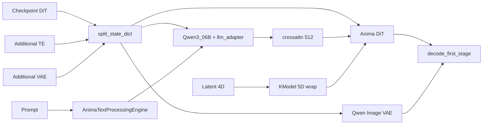

## 目录

1. [概览与数据流](#1-overview-and-data-flow)
2. [变更文件](#2-changed-files)
3. [架构](#3-architecture)
4. [文件索引](#4-file-index)
5. [新增文件的完整源码](#5-full-source-of-new-files)
6. [修改文件的完整源码](#6-full-source-of-modified-files)（commit `a8f6373` 时点的完整文件）
7. [删除文件的完整源码](#7-full-source-of-removed-files)（commit `95832e0` 时点）
8. [推荐加载配置与故障排查](#8-recommended-load-setup-and-troubleshooting)
9. [发布文档](#9-release-documentation-reference)

---

## 1. 概览与数据流

### 1.1 模型栈

[Anima](https://huggingface.co/circlestone-labs/Anima)（circlestone-labs）采用 **Flow Matching + Cosmos DiT（3D）+ Qwen3 0.6B + T5 tokens + Wan/Qwen Image VAE**。即使是静止图像，DiT 输入也是 **5D** `(B,C,T,H,W)`，其中 `T=1`。

### 1.2 本仓库中的流水线（摘要）

加载 checkpoint（例如 `waiANIMA_pw3.safetensors`）以及 Additional 文件（`qwen_3_06b_base.safetensors`、`qwen_image_vae.safetensors`）后，txt2img 按以下路径运行：

```
checkpoint.safetensors (DiT; may include llm_adapter)
    │ split_state_dict (early Anima detect → AnimaWai68 / AnimaBase / Anima)
    │   └─ merge Additional via replace_state_dict before split
    ├─ transformer → backend.nn.anima.Anima (native DiT)
    ├─ text_encoder → Qwen3_06B + llm_adapter (move llm_adapter keys from UNet dict to TE)
    │       ↑ often from Additional: qwen_3_06b_base.safetensors
    ├─ tokenizer / tokenizer_2 → Qwen2 + T5 (HF repo metadata)
    └─ vae → AutoencoderKLQwenImage (WanVAE wrapper, is_wan=True)
            ↑ usually from Additional: qwen_image_vae.safetensors (not in DiT ckpt)

ForgeDiffusionEngine: backend.diffusion_engine.anima.Anima
    ├─ get_learned_conditioning → AnimaTextProcessingEngine
    │       Qwen embed → Qwen3_06B → LLMAdapter(T5 ids)
    ├─ encode/decode_first_stage → process_in/out (Wan-style latent path)
    └─ UnetPatcher + PredictionDiscreteFlow (Shift = UI distilled CFG)

KModel.apply_model: 4D latent → unsqueeze(2) to 5D (T=1) → DiT → squeeze(2)
```



### 1.3 加载时发生什么（细节）

1. **检测**：`detection.py` 检查 `x_embedder.proj.1` 和 `llm_adapter`，设置 `image_model=anima`。Lumina2 通过是否存在 `noise_refiner` 区分。
2. **精细配置**：`comfy_anima.py` 推断 block 数、`in_channels`（68 → wai 系）、RoPE 缩放等。
3. **分割**：`loader.split_state_dict` 通过 `replace_state_dict` 合并 **Additional** TE/VAE，然后分割为 transformer / text_encoder / vae。**`llm_adapter` 权重从 UNet 字典移至 TE 字典**（错误放置会破坏画质）。典型 wai ckpt 仅含 DiT；TE 和 VAE 来自 Additional 文件。
4. **构建**：即使标记为 `CosmosTransformer3DModel`，也仅在 Anima guess 时实例化 `backend.nn.anima.Anima`。
5. **生成**：Prompt 经 `AnimaTextProcessingEngine` → cross-attn 长度 512。去噪使用 `KModel` 作为 4D↔5D 桥梁。

### 1.4 Forge Nunchaku 中的设计约束

Anima 以 **native Forge 流水线**运行（无 Comfy `BaseModel`）。所有 loader/engine 变更均在 Anima 专用分支之后，现有路径——Nunchaku Qwen Image、Z-Image、SDXL、Flux 等——保持隔离。

---

## 2. 变更文件

### 2.1 新增（A）

| 路径 | 职责 |
|------|------|
| `backend/diffusion_engine/anima.py` | Forge 引擎（TE/VAE/UNet/条件/Shift/decode） |
| `backend/nn/comfy_anima.py` | 从 checkpoint 推断 DiT 配置与键 remap |
| `backend/text_processing/anima_engine.py` | Prompt → cross-attn（Qwen+T5+emphasis） |
| `backend/nn/anima.py` | Native DiT + LLMAdapter |
| `backend/huggingface/circlestone-labs/Anima/model_index.json` | 本地 HF pipeline 清单 |
| `backend/huggingface/circlestone-labs/Anima/scheduler/scheduler_config.json` | FlowMatch scheduler（shift 3.0） |
| `backend/huggingface/circlestone-labs/Anima/text_encoder/config.json` | TE stub（hidden 1024） |
| `backend/huggingface/circlestone-labs/Anima/transformer/config.json` | Diffusers 类名 stub |
| `backend/huggingface/circlestone-labs/Anima/vae/config.json` | Qwen Image VAE 元数据 |
| `backend/huggingface/circlestone-labs/Anima/tokenizer/tokenizer_config.json` | Qwen2Tokenizer 配置 |
| `backend/huggingface/circlestone-labs/Anima/tokenizer_2/tokenizer_config.json` | T5Tokenizer 配置 |
| `backend/huggingface/circlestone-labs/Anima/tokenizer_2/special_tokens_map.json` | T5 special tokens |
| `backend/huggingface/circlestone-labs/Anima/tokenizer/merges.txt` |（**大型** 151,388 行 — 见 [§5.3](#53-large-tokenizer-assets)；HF 包，本文未内联） |
| `backend/huggingface/circlestone-labs/Anima/tokenizer/vocab.json` |（**大型** 单行 — 见 [§5.3](#53-large-tokenizer-assets)；HF 包，本文未内联） |
| `backend/huggingface/circlestone-labs/Anima/tokenizer_2/tokenizer.json` |（**大型** 129,428 行 — 见 [§5.3](#53-large-tokenizer-assets)；HF 包，本文未内联） |

### 2.2 修改（M）

| 路径 | 职责 |
|------|------|
| `backend/loader.py` | 加载/分割/Anima 分支中心 |
| `backend/modules/k_model.py` | 采样时 4D↔5D |
| `backend/nn/llm/llama.py` | 新增 Qwen3_06B |
| `backend/sampling/condition.py` | 可选 vector 条件 |
| `modules/processing.py` | batch/forge_objects 稳定性 |
| `modules/processing_scripts/sampler.py` | Sampler 参数强制 |
| `modules/sd_samplers.py` | Sampler 名称 int→str |
| `modules/txt2img.py` | 默认 sampler/scheduler |
| `modules_forge/main_entry.py` | UI preset Anima |
| `modules_forge/packages/huggingface_guess/detection.py` | 早期 Anima 检测 |
| `modules_forge/packages/huggingface_guess/model_list.py` | Anima* 类 |
| `modules_forge/presets.py` | Anima 默认值 |

### 2.3 删除（D）

- `backend/nn/comfy_model_base.py`（未使用的 Comfy 路径；`a8f6373` 删除）
- `backend/nn/comfy_model_detection.py`（未使用的 Comfy 路径；`a8f6373` 删除）

---

## 3. 架构

### 3.1 隔离（避免破坏其他模型）

| 门控 | 条件 | 效果 |
|------|------|------|
| `split_state_dict` | `detect_unet_config` 返回 `image_model==anima` | 在通用 `guess()` 之前 Anima 专用 guess |
| `load_huggingface_component` Qwen3 | `isinstance(guess, Anima*)` | 仅 **Qwen3_06B**；否则 legacy **Qwen3_4B** |
| `CosmosTransformer3DModel` loader | 仅 Anima guess | 构建 `backend.nn.anima.Anima` |
| `replace_state_dict` | hidden 1024 且 repo 含 `Anima` | 额外 TE 前缀为 `qwen3_06b` |
| `KModel._is_anima_diffusion_model` | `isinstance(..., ForgeAnima)` | 仅 native Anima 做 5D wrap |

### 3.2 Checkpoint 检测

1. **`detection.detect_unet_config`**：`x_embedder.proj.1` + `llm_adapter` 前缀区分 Anima 与 Lumina2/Cosmos。Lumina2 需要 `noise_refiner`。
2. **`comfy_anima._guess_unet_config`**：类似 Comfy `model_detection` 的详细推断（`in_channels` 68 → `AnimaWai68` 等）。
3. **`_remap_anima_state_dict`**：协调主 DiT 的 `o_proj` ↔ `output_proj` 与 llm_adapter 命名。

### 3.3 文本编码

- **Qwen tokens**：`AnimaTextProcessingEngine` embed → `Qwen3_06B` body。
- **T5 tokens**：作为 `t5xxl_ids` 传入 `LLMAdapter` 构建 1024 维 cross-attn 序列。
- **`uses_emphasis`**：`emphasis.py` 不变；引擎用 `_uses_emphasis()` 兼容。
- **Padding**：cross-attn 填充至长度 512（DiT 要求）。

### 3.4 Shift（distilled CFG）

**Anima** preset 的 **Shift** 滑块在 `get_learned_conditioning` 中读取为 `prompt.distilled_cfg_scale`，经 `predictor.set_parameters(shift=...)` 应用。**运行时 UI 值**覆盖 `model_list` 中固定的 3.0。

### 3.5 5D 张量包装

Cosmos/Anima DiT 期望 `(B, C, T, H, W)`。Forge latent 为 `(B, C, H, W)`，故 `KModel` **插入/移除 T=1**。仅当 `isinstance(backend.nn.anima.Anima)`；SDXL 与 Qwen Image 2D transformer 不受影响。

### 3.6 为何放弃 Comfy 路径

早期尝试 Comfy `BaseModel`，但 (1) `o_proj` / `output_proj` 命名、(2) 跨 TE/UNet 的 `llm_adapter`、(3) decode 周围的 Wan normalize 在 **native Forge** 上更易实现且画质更好。`comfy_model_base.py` 等已删除；本指南 §5–§6 路径为唯一路径。

### 3.7 建议阅读顺序

`detection.py` → `comfy_anima.py` → `model_list.py` → `loader.py` → `diffusion_engine/anima.py` → `anima_engine.py` → `anima.py` → `llama.py` → `k_model.py`。UI 文件最后。

---

## 4. 文件索引

§5 与 §6 在**每个文件前放置说明**，随后是 **`a8f6373` 时点的完整源码**。快速索引：

| 文件 | 摘要 | 节 |
|------|------|-----|
| `diffusion_engine/anima.py` | 推理中心 | §5 起 |
| `nn/comfy_anima.py` | ckpt → DiT kwargs | §5 |
| `text_processing/anima_engine.py` | Prompt 处理 | §5 |
| `nn/anima.py` | DiT + LLMAdapter | §5 |
| `loader.py` | 加载中心 | §6 起 |
| `detection.py` | 早期类型检测 | §6 |
| `model_list.py` | Anima* 类 | §6 |
| `k_model.py` | 4D↔5D | §6 |
| `llama.py` | Qwen3_06B | §6 |
| `condition.py` | 可选 vector | §6 |
| `processing.py` 等 | Gradio 稳定性 | §6 后段 |

---

<!-- BUILD_INSERT_S567 -->

## 8. 推荐加载配置与故障排查

### 8.1 推荐布局

| 类型 | 示例 | 说明 |
|------|------|------|
| Checkpoint | `waiANIMA_pw3.safetensors` | DiT 权重；可能含 `llm_adapter` |
| Additional TE | `qwen_3_06b_base.safetensors` | ckpt 无 TE 时必需 |
| Additional VAE | `qwen_image_vae.safetensors` | 用于 decode |
| UI Preset | **Anima** | 启用 Shift 滑块 |

### 8.2 加载成功的标志

- `StateDict Keys:` 列出 `transformer`、`text_encoder`（及 `vae`）
- Guess 为 `AnimaWai68` / `AnimaBase` / `Anima` 之一
- txt2img 无异常完成

### 8.3 常见错误

| 症状 | 原因 | 修复 |
|------|------|------|
| `uses_emphasis` AttributeError | Legacy TE API | `anima_engine._uses_emphasis` |
| Decode 失败 | VAE 未连接 | `is_wan=True` + `process_in/out` |
| 画质差 | Comfy 路径 / TE 不匹配 | Native UNet + Qwen3_06B + 移动 `llm_adapter` |
| 误分类为 Lumina | 仅有 `cap_embedder` | 需要 `noise_refiner` 区分 Lumina2 |

---

## 9. 发布文档

实现 commit `a8f6373` 之后，**Version 1.7.0** 发布材料（`95832e0`..`bbbc6b9`，tag `v1.7.0`）：

- `Changelog/CHANGELOG.md` — v1.7.0 Anima 条目
- `README.md` — Anima 功能 + `png/anima.png`

---

*说明：§1–§4 及 §5–§6 各文件前的说明为手书。完整代码：commit `a8f6373`（删除文件：`95832e0`）。**Version 1.7.0** native 流水线。v1.7.1 Comfy import 见 `ANIMA_COMFY_IMPORT_GUIDE_7061e66.md`。*
