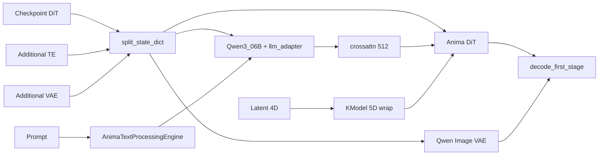

<table align="center">
  <tr>
    <td align="center" bgcolor="#e5e7eb" width="88" height="36"><a href="https://github.com/ussoewwin/Stable-Diffusion-WebUI-Forge-Nunchaku/releases/tag/v1.7.0"><font color="#4b5563"><b>EN</b></font></a></td>
    <td align="center" bgcolor="#d4465e" width="88" height="36"><font color="#ffffff"><b>中文</b></font></td>
  </tr>
</table>

## 目录

1. [概览与数据流](#1-overview-and-data-flow)
2. [变更文件](#2-changed-files)
3. [架构](#3-architecture)
4. [文件索引](#4-file-index)
5. [新增文件的完整源码](#5-full-source-of-new-files)
6. [修改文件的完整源码](#6-full-source-of-modified-files)（commit `a8f6373` 时点的完整文件）
7. [删除文件的完整源码](#7-full-source-of-removed-files)（commit `95832e0` 时点）
8. [推荐加载配置与故障排查](#8-recommended-load-setup-and-troubleshooting)
9. [发布文档](#9-release-documentation-reference)

---

## 1. 概览与数据流

### 1.1 模型栈

[Anima](https://huggingface.co/circlestone-labs/Anima)（circlestone-labs）采用 **Flow Matching + Cosmos DiT（3D）+ Qwen3 0.6B + T5 tokens + Wan/Qwen Image VAE**。即使是静止图像，DiT 输入也是 **5D** `(B,C,T,H,W)`，其中 `T=1`。

### 1.2 本仓库中的流水线（摘要）

加载 checkpoint（例如 `waiANIMA_pw3.safetensors`）以及 Additional 文件（`qwen_3_06b_base.safetensors`、`qwen_image_vae.safetensors`）后，txt2img 按以下路径运行：

```
checkpoint.safetensors (DiT; may include llm_adapter)
    │ split_state_dict (early Anima detect → AnimaWai68 / AnimaBase / Anima)
    │   └─ merge Additional via replace_state_dict before split
    ├─ transformer → backend.nn.anima.Anima (native DiT)
    ├─ text_encoder → Qwen3_06B + llm_adapter (move llm_adapter keys from UNet dict to TE)
    │       ↑ often from Additional: qwen_3_06b_base.safetensors
    ├─ tokenizer / tokenizer_2 → Qwen2 + T5 (HF repo metadata)
    └─ vae → AutoencoderKLQwenImage (WanVAE wrapper, is_wan=True)
            ↑ usually from Additional: qwen_image_vae.safetensors (not in DiT ckpt)

ForgeDiffusionEngine: backend.diffusion_engine.anima.Anima
    ├─ get_learned_conditioning → AnimaTextProcessingEngine
    │       Qwen embed → Qwen3_06B → LLMAdapter(T5 ids)
    ├─ encode/decode_first_stage → process_in/out (Wan-style latent path)
    └─ UnetPatcher + PredictionDiscreteFlow (Shift = UI distilled CFG)

KModel.apply_model: 4D latent → unsqueeze(2) to 5D (T=1) → DiT → squeeze(2)
```



### 1.3 加载时发生什么（细节）

1. **检测**：`detection.py` 检查 `x_embedder.proj.1` 和 `llm_adapter`，设置 `image_model=anima`。Lumina2 通过是否存在 `noise_refiner` 区分。
2. **精细配置**：`comfy_anima.py` 推断 block 数、`in_channels`（68 → wai 系）、RoPE 缩放等。
3. **分割**：`loader.split_state_dict` 通过 `replace_state_dict` 合并 **Additional** TE/VAE，然后分割为 transformer / text_encoder / vae。**`llm_adapter` 权重从 UNet 字典移至 TE 字典**（错误放置会破坏画质）。典型 wai ckpt 仅含 DiT；TE 和 VAE 来自 Additional 文件。
4. **构建**：即使标记为 `CosmosTransformer3DModel`，也仅在 Anima guess 时实例化 `backend.nn.anima.Anima`。
5. **生成**：Prompt 经 `AnimaTextProcessingEngine` → cross-attn 长度 512。去噪使用 `KModel` 作为 4D↔5D 桥梁。

### 1.4 Forge Nunchaku 中的设计约束

Anima 以 **native Forge 流水线**运行（无 Comfy `BaseModel`）。所有 loader/engine 变更均在 Anima 专用分支之后，现有路径——Nunchaku Qwen Image、Z-Image、SDXL、Flux 等——保持隔离。

---

## 2. 变更文件

### 2.1 新增（A）

| 路径 | 职责 |
|------|------|
| `backend/diffusion_engine/anima.py` | Forge 引擎（TE/VAE/UNet/条件/Shift/decode） |
| `backend/nn/comfy_anima.py` | 从 checkpoint 推断 DiT 配置与键 remap |
| `backend/text_processing/anima_engine.py` | Prompt → cross-attn（Qwen+T5+emphasis） |
| `backend/nn/anima.py` | Native DiT + LLMAdapter |
| `backend/huggingface/circlestone-labs/Anima/model_index.json` | 本地 HF pipeline 清单 |
| `backend/huggingface/circlestone-labs/Anima/scheduler/scheduler_config.json` | FlowMatch scheduler（shift 3.0） |
| `backend/huggingface/circlestone-labs/Anima/text_encoder/config.json` | TE stub（hidden 1024） |
| `backend/huggingface/circlestone-labs/Anima/transformer/config.json` | Diffusers 类名 stub |
| `backend/huggingface/circlestone-labs/Anima/vae/config.json` | Qwen Image VAE 元数据 |
| `backend/huggingface/circlestone-labs/Anima/tokenizer/tokenizer_config.json` | Qwen2Tokenizer 配置 |
| `backend/huggingface/circlestone-labs/Anima/tokenizer_2/tokenizer_config.json` | T5Tokenizer 配置 |
| `backend/huggingface/circlestone-labs/Anima/tokenizer_2/special_tokens_map.json` | T5 special tokens |
| `backend/huggingface/circlestone-labs/Anima/tokenizer/merges.txt` |（**大型** 151,388 行 — 见 [§5.3](#53-large-tokenizer-assets)；HF 包，本文未内联） |
| `backend/huggingface/circlestone-labs/Anima/tokenizer/vocab.json` |（**大型** 单行 — 见 [§5.3](#53-large-tokenizer-assets)；HF 包，本文未内联） |
| `backend/huggingface/circlestone-labs/Anima/tokenizer_2/tokenizer.json` |（**大型** 129,428 行 — 见 [§5.3](#53-large-tokenizer-assets)；HF 包，本文未内联） |

### 2.2 修改（M）

| 路径 | 职责 |
|------|------|
| `backend/loader.py` | 加载/分割/Anima 分支中心 |
| `backend/modules/k_model.py` | 采样时 4D↔5D |
| `backend/nn/llm/llama.py` | 新增 Qwen3_06B |
| `backend/sampling/condition.py` | 可选 vector 条件 |
| `modules/processing.py` | batch/forge_objects 稳定性 |
| `modules/processing_scripts/sampler.py` | Sampler 参数强制 |
| `modules/sd_samplers.py` | Sampler 名称 int→str |
| `modules/txt2img.py` | 默认 sampler/scheduler |
| `modules_forge/main_entry.py` | UI preset Anima |
| `modules_forge/packages/huggingface_guess/detection.py` | 早期 Anima 检测 |
| `modules_forge/packages/huggingface_guess/model_list.py` | Anima* 类 |
| `modules_forge/presets.py` | Anima 默认值 |

### 2.3 删除（D）

- `backend/nn/comfy_model_base.py`（未使用的 Comfy 路径；`a8f6373` 删除）
- `backend/nn/comfy_model_detection.py`（未使用的 Comfy 路径；`a8f6373` 删除）

---

## 3. 架构

### 3.1 隔离（避免破坏其他模型）

| 门控 | 条件 | 效果 |
|------|------|------|
| `split_state_dict` | `detect_unet_config` 返回 `image_model==anima` | 在通用 `guess()` 之前 Anima 专用 guess |
| `load_huggingface_component` Qwen3 | `isinstance(guess, Anima*)` | 仅 **Qwen3_06B**；否则 legacy **Qwen3_4B** |
| `CosmosTransformer3DModel` loader | 仅 Anima guess | 构建 `backend.nn.anima.Anima` |
| `replace_state_dict` | hidden 1024 且 repo 含 `Anima` | 额外 TE 前缀为 `qwen3_06b` |
| `KModel._is_anima_diffusion_model` | `isinstance(..., ForgeAnima)` | 仅 native Anima 做 5D wrap |

### 3.2 Checkpoint 检测

1. **`detection.detect_unet_config`**：`x_embedder.proj.1` + `llm_adapter` 前缀区分 Anima 与 Lumina2/Cosmos。Lumina2 需要 `noise_refiner`。
2. **`comfy_anima._guess_unet_config`**：类似 Comfy `model_detection` 的详细推断（`in_channels` 68 → `AnimaWai68` 等）。
3. **`_remap_anima_state_dict`**：协调主 DiT 的 `o_proj` ↔ `output_proj` 与 llm_adapter 命名。

### 3.3 文本编码

- **Qwen tokens**：`AnimaTextProcessingEngine` embed → `Qwen3_06B` body。
- **T5 tokens**：作为 `t5xxl_ids` 传入 `LLMAdapter` 构建 1024 维 cross-attn 序列。
- **`uses_emphasis`**：`emphasis.py` 不变；引擎用 `_uses_emphasis()` 兼容。
- **Padding**：cross-attn 填充至长度 512（DiT 要求）。

### 3.4 Shift（distilled CFG）

**Anima** preset 的 **Shift** 滑块在 `get_learned_conditioning` 中读取为 `prompt.distilled_cfg_scale`，经 `predictor.set_parameters(shift=...)` 应用。**运行时 UI 值**覆盖 `model_list` 中固定的 3.0。

### 3.5 5D 张量包装

Cosmos/Anima DiT 期望 `(B, C, T, H, W)`。Forge latent 为 `(B, C, H, W)`，故 `KModel` **插入/移除 T=1**。仅当 `isinstance(backend.nn.anima.Anima)`；SDXL 与 Qwen Image 2D transformer 不受影响。

### 3.6 为何放弃 Comfy 路径

早期尝试 Comfy `BaseModel`，但 (1) `o_proj` / `output_proj` 命名、(2) 跨 TE/UNet 的 `llm_adapter`、(3) decode 周围的 Wan normalize 在 **native Forge** 上更易实现且画质更好。`comfy_model_base.py` 等已删除；本指南 §5–§6 路径为唯一路径。

### 3.7 建议阅读顺序

`detection.py` → `comfy_anima.py` → `model_list.py` → `loader.py` → `diffusion_engine/anima.py` → `anima_engine.py` → `anima.py` → `llama.py` → `k_model.py`。UI 文件最后。

---

## 4. 文件索引

§5 与 §6 在**每个文件前放置说明**，随后是 **`a8f6373` 时点的完整源码**。快速索引：

| 文件 | 摘要 | 节 |
|------|------|-----|
| `diffusion_engine/anima.py` | 推理中心 | §5 起 |
| `nn/comfy_anima.py` | ckpt → DiT kwargs | §5 |
| `text_processing/anima_engine.py` | Prompt 处理 | §5 |
| `nn/anima.py` | DiT + LLMAdapter | §5 |
| `loader.py` | 加载中心 | §6 起 |
| `detection.py` | 早期类型检测 | §6 |
| `model_list.py` | Anima* 类 | §6 |
| `k_model.py` | 4D↔5D | §6 |
| `llama.py` | Qwen3_06B | §6 |
| `condition.py` | 可选 vector | §6 |
| `processing.py` 等 | Gradio 稳定性 | §6 后段 |

---

## 5. 新增文件的完整源码

Below is the **full source (A)** from commit `a8f6373` (no omissions).  
**说明紧接在每个标题之前**；下一个代码块为该文件的完整源码。

### 5.1 Python（核心）

### `backend/diffusion_engine/anima.py`

#### 说明

**`ForgeDiffusionEngine` for Anima** — what the WebUI holds after load. Same role as SD1.5 “model class + TE + UNet + VAE” in one place.

- **`matched_guesses`**: This class is chosen only for `Anima` / `AnimaBase` / `AnimaWai68`.
- **`CLIP`**: Single TE `qwen3_06b`. Tokenizers: Qwen2 (`tokenizer`) and T5 (`tokenizer_2`).
- **`VAE(..., is_wan=True)`**: Qwen Image VAE with Wan-style `process_in/out` — fixes the main **decode** failure when wired this way.
- **`AnimaTextProcessingEngine`**: Builds DiT `crossattn` from prompt strings (see dedicated file below).
- **`get_learned_conditioning`**: (1) moves TE to GPU, (2) passes **UI Shift** (`prompt.distilled_cfg_scale`) to the Flow predictor, (3) returns cond tensors. **Runtime UI Shift** beats the fixed 3.0 in `model_list`.
- **`encode_first_stage` / `decode_first_stage`**: Per-batch-item loop with RGB↔latent scale and `process_in/out`.

```python
import torch
from modules_forge.packages.huggingface_guess import model_list

from backend import memory_management
from backend.diffusion_engine.base import ForgeDiffusionEngine, ForgeObjects
from backend.modules.k_prediction import PredictionDiscreteFlow
from backend.patcher.clip import CLIP
from backend.patcher.unet import UnetPatcher
from backend.patcher.vae import VAE
from backend.text_processing.anima_engine import AnimaTextProcessingEngine


class Anima(ForgeDiffusionEngine):
    """sd-webui-forge-classic 完成形と同じ: native UNet + AnimaTextProcessingEngine + Wan VAE."""

    matched_guesses = [model_list.Anima, model_list.AnimaBase, model_list.AnimaWai68]

    def __init__(self, estimated_config, huggingface_components):
        super().__init__(estimated_config, huggingface_components)

        clip = CLIP(
            model_dict={"qwen3_06b": huggingface_components["text_encoder"]},
            tokenizer_dict={
                "qwen3_06b": huggingface_components["tokenizer"],
                "t5xxl": huggingface_components["tokenizer_2"],
            },
        )

        vae = VAE(model=huggingface_components["vae"], is_wan=True)
        vae.first_stage_model.latent_format = self.model_config.latent_format

        k_predictor = PredictionDiscreteFlow(estimated_config)

        unet = UnetPatcher.from_model(
            model=huggingface_components["transformer"],
            diffusers_scheduler=None,
            k_predictor=k_predictor,
            config=estimated_config,
        )

        self.text_processing_engine_anima = AnimaTextProcessingEngine(
            text_encoder=clip.cond_stage_model.qwen3_06b,
            qwen_tokenizer=clip.tokenizer.qwen3_06b,
            t5_tokenizer=clip.tokenizer.t5xxl,
        )

        self.forge_objects = ForgeObjects(unet=unet, clip=clip, vae=vae, clipvision=None)
        self.forge_objects_original = self.forge_objects.shallow_copy()
        self.forge_objects_after_applying_lora = self.forge_objects.shallow_copy()

        self.is_wan = True
        self.use_shift = True

    @torch.inference_mode()
    def get_learned_conditioning(self, prompt: list[str]):
        memory_management.load_model_gpu(self.forge_objects.clip.patcher)
        shift = getattr(prompt, "distilled_cfg_scale", None)
        if shift is None:
            shift = self.model_config.sampling_settings.get("shift", 3.0)
        self.forge_objects.unet.model.predictor.set_parameters(shift=float(shift))
        return self.text_processing_engine_anima(prompt)

    @torch.inference_mode()
    def get_prompt_lengths_on_ui(self, prompt):
        token_count = len(self.text_processing_engine_anima.tokenize([prompt])[0][0])
        return token_count, max(512, token_count)

    @torch.inference_mode()
    def encode_first_stage(self, x: torch.Tensor):
        samples: list[torch.Tensor] = []
        for b in range(x.size(0)):
            y = x[b].unsqueeze(0)
            sample = self.forge_objects.vae.encode(y.movedim(1, -1) * 0.5 + 0.5)
            sample = self.forge_objects.vae.first_stage_model.process_in(sample)
            samples.append(sample)
        return torch.cat(samples).to(x)

    @torch.inference_mode()
    def decode_first_stage(self, x: torch.Tensor):
        samples: list[torch.Tensor] = []
        for b in range(x.size(0)):
            y = x[b].unsqueeze(0)
            sample = self.forge_objects.vae.first_stage_model.process_out(y)
            sample = self.forge_objects.vae.decode(sample).movedim(-1, 2) * 2.0 - 1.0
            samples.append(sample)
        return torch.cat(samples).to(x)
```

### `backend/nn/comfy_anima.py`

#### 说明

**Rebuilds the kwargs dict for `Anima(**kwargs)` from one safetensors file.** Port of ComfyUI `model_detection` (Anima / Cosmos predict2) for Forge.

- **`_guess_unet_config`**: Shapes from `x_embedder.proj.1.weight` set `model_channels`, `in_channels`, `num_blocks`, etc. `in_channels==68` with dim 2048 suggests wai family (`AnimaWai68`).
- **`_remap_anima_state_dict`**: Main DiT `cross_attn` may use `o_proj` in ckpt vs `output_proj` in code — **swap names per block type**. `llm_adapter` may need the reverse.
- **`native_anima_unet_config`**: Keeps only keys the DiT constructor needs (drops Comfy-only fields).

`detection.py` does coarse `anima` classification; this file **fixes hyperparameters**.

```python
"""Infer native Anima UNet config and remap checkpoint keys (Forge ``backend.nn.anima``)."""

from __future__ import annotations


def _strip_diffusion_prefix(state_dict: dict) -> dict:
    """Forge safetensors often use model.diffusion_model.*; Comfy load uses diffusion_model.*."""
    for prefix in ("model.diffusion_model.", "diffusion_model."):
        if any(k.startswith(prefix) for k in state_dict):
            return {k[len(prefix) :]: v for k, v in state_dict.items()}
    return state_dict


def _count_blocks(state_dict_keys: list[str], prefix: str) -> int:
    count = 0
    while True:
        if not any(k.startswith(f"{prefix}{count}.") for k in state_dict_keys):
            break
        count += 1
    return count


def _guess_unet_config(state_dict: dict) -> dict:
    """
    Infer Anima kwargs from ComfyUI comfy/model_detection.py (lines 704-753).

    waiANIMA_pw3 uses llm_adapter.blocks.*.cross_attn (not Blueprint llm_adapter.proj.0).
    Must run before generic detect_unet_config (Cosmos predict2 matches blocks.0.mlp first).
    """
    state_dict = _strip_diffusion_prefix(state_dict)
    state_dict_keys = list(state_dict.keys())
    key_prefix = ""

    has_anima_cross = (
        f"{key_prefix}llm_adapter.blocks.0.cross_attn.q_proj.weight" in state_dict_keys
        or any("cross_attn" in k for k in state_dict_keys)
    )
    if not has_anima_cross:
        raise RuntimeError(
            "Not a ComfyUI Anima checkpoint (no cross_attn / llm_adapter.cross_attn). "
            f"Sample keys: {state_dict_keys[:12]}"
        )

    # Production ComfyUI model_detection.py: x_embedder.proj.1 (2-layer) or proj.0 (1-layer)
    x_key = None
    for candidate in (
        f"{key_prefix}x_embedder.proj.1.weight",
        f"{key_prefix}x_embedder.proj.0.weight",
        f"{key_prefix}x_embedder.weight",
    ):
        if candidate in state_dict:
            x_key = candidate
            break
    if x_key is None:
        raise RuntimeError(
            f"Missing x_embedder weight in Anima state_dict. "
            f"Have x_embedder keys: {[k for k in state_dict if 'x_embedder' in k][:8]}"
        )

    w = state_dict[x_key]
    model_channels = int(w.shape[0])
    if "{}blocks.0.norm1.weight".format(key_prefix) in state_dict:
        model_channels = int(state_dict[f"{key_prefix}blocks.0.norm1.weight"].shape[0])

    # Match comfy/model_detection.py 684-737 (Cosmos mlp branch → anima via cross_attn)
    concat_padding_mask = "{}blocks.0.mlp.layer1.weight".format(key_prefix) in state_dict_keys
    in_channels = int(w.shape[1])
    if concat_padding_mask:
        in_channels = in_channels // 4 - int(concat_padding_mask)
    else:
        in_channels = in_channels // 4 if in_channels > 20 else in_channels

    dit_config: dict = {
        "image_model": "anima",
        "max_img_h": 240,
        "max_img_w": 240,
        "max_frames": 128,
        "in_channels": in_channels,
        "out_channels": 16,
        "patch_spatial": 2,
        "patch_temporal": 1,
        "model_channels": model_channels,
        "concat_padding_mask": concat_padding_mask,
        "crossattn_emb_channels": 1024,
        "pos_emb_cls": "rope3d",
        "pos_emb_learnable": True,
        "pos_emb_interpolation": "crop",
        "min_fps": 1,
        "max_fps": 30,
        "use_adaln_lora": True,
        "adaln_lora_dim": 256,
        "extra_h_extrapolation_ratio": 1.0,
        "extra_w_extrapolation_ratio": 1.0,
        "extra_t_extrapolation_ratio": 1.0,
        "rope_enable_fps_modulation": False,
    }

    if model_channels == 2048:
        dit_config["num_blocks"] = 28
        dit_config["num_heads"] = 16
    elif model_channels == 5120:
        dit_config["num_blocks"] = 36
        dit_config["num_heads"] = 40
    else:
        dit_config["num_blocks"] = _count_blocks(state_dict_keys, "blocks.")
        dit_config["num_heads"] = max(1, dit_config["model_channels"] // 128)

    if in_channels == 16:
        dit_config["extra_per_block_abs_pos_emb"] = False
        dit_config["rope_h_extrapolation_ratio"] = 4.0
        dit_config["rope_w_extrapolation_ratio"] = 4.0
        dit_config["rope_t_extrapolation_ratio"] = 1.0
    elif in_channels == 17:
        if model_channels == 2048:
            dit_config["extra_per_block_abs_pos_emb"] = False
            dit_config["rope_h_extrapolation_ratio"] = 3.0
            dit_config["rope_w_extrapolation_ratio"] = 3.0
            dit_config["rope_t_extrapolation_ratio"] = 1.0
        elif model_channels == 5120:
            dit_config["rope_h_extrapolation_ratio"] = 2.0
            dit_config["rope_w_extrapolation_ratio"] = 2.0
            dit_config["rope_t_extrapolation_ratio"] = 0.8333333333333334

    return dit_config


def infer_anima_unet_config_from_state_dict(state_dict: dict, key_prefix: str = "") -> dict:
    """Public entry for ``detect_unet_config`` / loader (Comfy MiniTrainDIT keys)."""
    del key_prefix  # prefix already stripped by ``_strip_diffusion_prefix``
    return _guess_unet_config(_strip_diffusion_prefix(state_dict))


NATIVE_ANIMA_UNET_KEYS = (
    "in_channels",
    "out_channels",
    "patch_spatial",
    "patch_temporal",
    "model_channels",
    "concat_padding_mask",
    "crossattn_emb_channels",
    "adaln_lora_dim",
    "num_blocks",
    "num_heads",
    "rope_h_extrapolation_ratio",
    "rope_w_extrapolation_ratio",
    "rope_t_extrapolation_ratio",
    "mlp_ratio",
)


def native_anima_unet_config(dit_config: dict) -> dict:
    """Forge ``backend.nn.anima.Anima`` kwargs from full dit config (Diffusers CosmosTransformer3DModel stub)."""
    return {k: dit_config[k] for k in NATIVE_ANIMA_UNET_KEYS if k in dit_config}


def _remap_anima_state_dict(state_dict: dict) -> dict:
    """
    Main DiT blocks (MiniTrainDIT / predict2) use cross_attn.output_proj.
    llm_adapter blocks (ldm.anima Attention) use cross_attn.o_proj.
    waiANIMA checkpoints store o_proj on main blocks and may use either name on llm_adapter.
    """
    out = {}
    for k, v in state_dict.items():
        if k.startswith("blocks.") and ".cross_attn.o_proj." in k:
            nk = k.replace(".cross_attn.o_proj.", ".cross_attn.output_proj.")
        elif "llm_adapter.blocks." in k and ".cross_attn.output_proj." in k:
            nk = k.replace(".cross_attn.output_proj.", ".cross_attn.o_proj.")
        else:
            nk = k
        out[nk] = v
    return out
```

### `backend/text_processing/anima_engine.py`

#### 说明

**Prompt string → DiT conditioning tensors.** Unlike a single SD CLIP, this is a **two-stage Qwen + T5** pipeline.

1. `parse_prompt_attention` for emphasis (`(word:1.2)`, etc.).
2. Qwen2 tokenizer → IDs → `get_input_embeddings` → `Qwen3_06B` hidden states.
3. T5 tokenizer → IDs and **weight vector** (emphasis).
4. `preprocess_text_embeds` (= `Qwen3_06B.llm_adapter`) merges Qwen hidden with T5 IDs.
5. If sequence length < 512, **pad at the end** (DiT expected length).

**`uses_emphasis`**: Global `emphasis.py` has no `uses_emphasis` API; `_uses_emphasis()` mirrors the check and logs via `dynamic_args` (`emphasis.py` itself unchanged).

```python
from typing import TYPE_CHECKING

if TYPE_CHECKING:
    from backend.nn.llm.llama import Qwen3_06B

import torch

from backend import memory_management
from backend.args import dynamic_args
from backend.text_processing import emphasis, parsing
from modules.shared import opts


class PromptChunk:
    def __init__(self):
        self.qwen_tokens = []
        self.qwen_multipliers = []
        self.t5_tokens = []
        self.t5_multipliers = []


class AnimaTextProcessingEngine:
    def __init__(self, text_encoder, qwen_tokenizer, t5_tokenizer):
        self.emphasis = emphasis.get_current_option(opts.emphasis)()

        self.text_encoder: "Qwen3_06B" = text_encoder
        self.qwen_tokenizer = qwen_tokenizer
        self.t5_tokenizer = t5_tokenizer

        self.id_pad = 151643
        self.id_end = 1

    def tokenize(self, texts):
        return (
            self.qwen_tokenizer(texts, truncation=False, add_special_tokens=False)["input_ids"],
            self.t5_tokenizer(texts, truncation=False, add_special_tokens=False)["input_ids"],
        )

    def tokenize_line(self, line):
        parsed = parsing.parse_prompt_attention(line, self.emphasis.name)
        qwen_tokenized, t5_tokenized = self.tokenize([text for text, _ in parsed])

        chunks = []
        chunk = PromptChunk()

        def next_chunk():
            nonlocal chunk

            if not chunk.qwen_tokens:
                chunk.qwen_tokens.append(self.id_pad)
                chunk.qwen_multipliers.append(1.0)

            chunk.t5_tokens.append(self.id_end)
            chunk.t5_multipliers.append(1.0)

            chunks.append(chunk)
            chunk = PromptChunk()

        for tokens in qwen_tokenized:
            position = 0
            while position < len(tokens):
                token = tokens[position]
                chunk.qwen_tokens.append(token)
                chunk.qwen_multipliers.append(1.0)
                position += 1

        for tokens, (text, weight) in zip(t5_tokenized, parsed):
            position = 0
            while position < len(tokens):
                token = tokens[position]
                chunk.t5_tokens.append(token)
                chunk.t5_multipliers.append(weight)
                position += 1

        if not chunks:
            next_chunk()

        return chunks

    def _uses_emphasis(self, prompt: str) -> bool:
        parsed = parsing.parse_prompt_attention(prompt, self.emphasis.name)
        return len(parsed) != len([p for p in parsed if p[1] == 1.0 or p[0] == "BREAK"])

    def __call__(self, texts):
        self.emphasis = emphasis.get_current_option(opts.emphasis)()
        if any(self._uses_emphasis(x) for x in texts):
            dynamic_args.last_extra_generation_params["Emphasis"] = self.emphasis.name

        zs = []
        cache: dict[str, tuple[torch.Tensor, torch.Tensor, torch.Tensor]] = {}

        for line in texts:
            if line in cache:
                z, tok, mul = cache[line]
            else:
                chunks: list[PromptChunk] = self.tokenize_line(line)
                assert len(chunks) == 1

                for chunk in chunks:
                    tokens = chunk.qwen_tokens
                    multipliers = chunk.qwen_multipliers

                    z: torch.Tensor = self.process_tokens([tokens], [multipliers])[0]
                    tok = torch.tensor(chunk.t5_tokens, dtype=torch.int)
                    mul = torch.tensor(chunk.t5_multipliers)

                cache[line] = (z, tok, mul)

            zs.append(self.anima_preprocess(z, tok, mul))

        del cache
        return zs

    def anima_preprocess(self, cross_attn: torch.Tensor, t5xxl_ids: torch.Tensor, t5xxl_weights: torch.Tensor) -> torch.Tensor:
        device = memory_management.text_encoder_device()

        cross_attn = cross_attn.unsqueeze(0).to(device=device)
        t5xxl_ids = t5xxl_ids.unsqueeze(0).to(device=device)

        cross_attn = self.text_encoder.preprocess_text_embeds(cross_attn, t5xxl_ids)
        if t5xxl_weights is not None:
            cross_attn *= t5xxl_weights.unsqueeze(0).unsqueeze(-1).to(cross_attn)

        if cross_attn.shape[1] < 512:
            cross_attn = torch.nn.functional.pad(cross_attn, (0, 0, 0, 512 - cross_attn.shape[1]))

        return cross_attn

    def process_embeds(self, batch_tokens):
        device = memory_management.text_encoder_device()

        embeds_out = []
        attention_masks = []
        num_tokens = []

        for tokens in batch_tokens:
            attention_mask = []
            tokens_temp = []
            other_embeds = []
            eos = False
            index = 0

            for t in tokens:
                try:
                    token = int(t)
                    attention_mask.append(0 if eos else 1)
                    tokens_temp += [token]
                    if not eos and token == self.id_pad:
                        eos = True
                except TypeError:
                    other_embeds.append((index, t))
                index += 1

            tokens_embed = torch.tensor([tokens_temp], device=device, dtype=torch.long)
            tokens_embed = self.text_encoder.get_input_embeddings()(tokens_embed)

            index = 0
            embeds_info = []

            embeds_out.append(tokens_embed)
            attention_masks.append(attention_mask)
            num_tokens.append(sum(attention_mask))

        return torch.cat(embeds_out), torch.tensor(attention_masks, device=device, dtype=torch.long), num_tokens, embeds_info

    def process_tokens(self, batch_tokens, batch_multipliers):
        embeds, mask, count, info = self.process_embeds(batch_tokens)
        z, _ = self.text_encoder(input_ids=None, embeds=embeds, attention_mask=mask, num_tokens=count, embeds_info=info)
        return z
```

### `backend/nn/anima.py`

#### 说明

**Diffusion core (DiT) and LLMAdapter** — ComfyUI cosmos/predict2 + anima wired to Forge attention.

**DiT (`Anima` class)**  
- 5D input. `VideoRopePosition3DEmb` for spatiotemporal RoPE. Each `Block`: self-attn → cross-attn (`context`) → MLP. AdaLN injects timestep.  
- `prepare_embedded_sequence` patches input; with `concat_padding_mask`, mask is concatenated on channels.  
- In fp16, residuals stay fp32 while attention/MLP run fp16 (quality/stability).

**LLM (`LLMAdapter`)**  
- `source_hidden_states`: Qwen3 output sequence.  
- `target_input_ids`: T5 token IDs (`embed` dim 32128).  
- Output: **1024-d** sequence for cross-attn (padded to 512 later).

**Loader**: ckpt `llm_adapter.*` keys are **moved to TE** before loading into `Qwen3_06B`. UNet build only puts DiT `blocks.*` into `Anima`.

```python
# https://github.com/Comfy-Org/ComfyUI/blob/master/comfy/text_encoders/anima.py
# https://github.com/Comfy-Org/ComfyUI/blob/master/comfy/ldm/cosmos/predict2.py
# https://github.com/Comfy-Org/ComfyUI/blob/master/comfy/ldm/cosmos/position_embedding.py

# Copyright (c) 2025 NVIDIA CORPORATION & AFFILIATES. All rights reserved.
# References: https://github.com/nvidia-cosmos/cosmos-predict2

import math
from typing import Callable, Optional

import comfy_kitchen as ck
import torch
from einops import rearrange, repeat
from einops.layers.torch import Rearrange
from torch import nn
from torch.nn import functional as F
from torchvision.transforms import InterpolationMode, functional

from backend.attention import attention_function
from backend.memory_management import is_device_mps
from backend.utils import pad_to_patch_size

# region DiT


class VideoRopePosition3DEmb(nn.Module):
    def __init__(self, head_dim: int, h_extrapolation_ratio: float, w_extrapolation_ratio: float, t_extrapolation_ratio: float):
        super().__init__()

        dim = head_dim
        dim_h = dim // 6 * 2
        dim_w = dim_h
        dim_t = dim - 2 * dim_h
        assert dim == dim_h + dim_w + dim_t

        self.register_buffer(
            "dim_spatial_range",
            torch.arange(0, dim_h, 2)[: (dim_h // 2)].float() / dim_h,
            persistent=False,
        )
        self.register_buffer(
            "dim_temporal_range",
            torch.arange(0, dim_t, 2)[: (dim_t // 2)].float() / dim_t,
            persistent=False,
        )

        self.h_ntk_factor = h_extrapolation_ratio ** (dim_h / (dim_h - 2))
        self.w_ntk_factor = w_extrapolation_ratio ** (dim_w / (dim_w - 2))
        self.t_ntk_factor = t_extrapolation_ratio ** (dim_t / (dim_t - 2))

    def forward(self, x_B_T_H_W_C: torch.Tensor, device: torch.device) -> torch.Tensor:
        B, T, H, W, _ = x_B_T_H_W_C.shape

        h_theta = 10000.0 * self.h_ntk_factor
        w_theta = 10000.0 * self.w_ntk_factor
        t_theta = 10000.0 * self.t_ntk_factor

        h_spatial_freqs = 1.0 / (h_theta ** self.dim_spatial_range.to(dtype=torch.float16, device=device))
        w_spatial_freqs = 1.0 / (w_theta ** self.dim_spatial_range.to(dtype=torch.float16, device=device))
        temporal_freqs = 1.0 / (t_theta ** self.dim_temporal_range.to(dtype=torch.float16, device=device))

        seq = torch.arange(max(H, W, T), dtype=torch.float, device=device)
        half_emb_h = torch.outer(seq[:H].to(device=device), h_spatial_freqs)
        half_emb_w = torch.outer(seq[:W].to(device=device), w_spatial_freqs)

        half_emb_t = torch.outer(seq[:T].to(device=device), temporal_freqs)

        half_emb_h = torch.stack([torch.cos(half_emb_h), -torch.sin(half_emb_h), torch.sin(half_emb_h), torch.cos(half_emb_h)], dim=-1)
        half_emb_w = torch.stack([torch.cos(half_emb_w), -torch.sin(half_emb_w), torch.sin(half_emb_w), torch.cos(half_emb_w)], dim=-1)
        half_emb_t = torch.stack([torch.cos(half_emb_t), -torch.sin(half_emb_t), torch.sin(half_emb_t), torch.cos(half_emb_t)], dim=-1)

        em_T_H_W_D = torch.cat(
            [
                repeat(half_emb_t, "t d x -> t h w d x", h=H, w=W),
                repeat(half_emb_h, "h d x -> t h w d x", t=T, w=W),
                repeat(half_emb_w, "w d x -> t h w d x", t=T, h=H),
            ],
            dim=-2,
        )

        return rearrange(em_T_H_W_D, "t h w d (i j) -> (t h w) d i j", i=2, j=2).float()


class GPT2FeedForward(nn.Module):
    def __init__(self, d_model: int, d_ff: int):
        super().__init__()
        self.activation = nn.GELU()
        self.layer1 = nn.Linear(d_model, d_ff, bias=False)
        self.layer2 = nn.Linear(d_ff, d_model, bias=False)

    def forward(self, x: torch.Tensor) -> torch.Tensor:
        x = self.layer1(x)
        x = self.activation(x)
        x = self.layer2(x)
        return x


class SelfCrossAttention(nn.Module):
    def __init__(self, query_dim: int, context_dim: Optional[int] = None, n_heads: int = 8, head_dim: int = 64, dropout: float = 0.0):
        super().__init__()
        self.is_SelfAttn = context_dim is None

        inner_dim = head_dim * n_heads

        self.n_heads = n_heads
        self.head_dim = head_dim
        self.context_dim = context_dim or query_dim

        self.q_proj = nn.Linear(query_dim, inner_dim, bias=False)
        self.q_norm = nn.RMSNorm(self.head_dim, eps=1e-6)

        self.k_proj = nn.Linear(self.context_dim, inner_dim, bias=False)
        self.k_norm = nn.RMSNorm(self.head_dim, eps=1e-6)

        self.v_proj = nn.Linear(self.context_dim, inner_dim, bias=False)
        self.v_norm = nn.Identity()

        self.output_proj = nn.Linear(inner_dim, query_dim, bias=False)
        self.output_dropout = nn.Dropout(dropout) if dropout > 1e-4 else nn.Identity()

    def compute_qkv(self, x: torch.Tensor, context: Optional[torch.Tensor] = None, rope_emb: Optional[torch.Tensor] = None) -> tuple[torch.Tensor, torch.Tensor, torch.Tensor]:
        q = self.q_proj(x)
        k = self.k_proj(x if context is None else context)
        v = self.v_proj(x if context is None else context)
        q, k, v = map(
            lambda t: rearrange(t, "b ... (h d) -> b ... h d", h=self.n_heads, d=self.head_dim),
            (q, k, v),
        )

        q = self.q_norm(q)
        k = self.k_norm(k)
        v = self.v_norm(v)
        if self.is_SelfAttn and rope_emb is not None:
            q, k = ck.apply_rope_split_half(q, k, rope_emb)

        return q, k, v

    @staticmethod
    def torch_attention_op(q_B_S_H_D: torch.Tensor, k_B_S_H_D: torch.Tensor, v_B_S_H_D: torch.Tensor, transformer_options: Optional[dict] = {}) -> torch.Tensor:
        in_q_shape = q_B_S_H_D.shape
        in_k_shape = k_B_S_H_D.shape
        q_B_H_S_D = rearrange(q_B_S_H_D, "b ... h k -> b h ... k").view(in_q_shape[0], in_q_shape[-2], -1, in_q_shape[-1])
        k_B_H_S_D = rearrange(k_B_S_H_D, "b ... h v -> b h ... v").view(in_k_shape[0], in_k_shape[-2], -1, in_k_shape[-1])
        v_B_H_S_D = rearrange(v_B_S_H_D, "b ... h v -> b h ... v").view(in_k_shape[0], in_k_shape[-2], -1, in_k_shape[-1])
        return attention_function(q_B_H_S_D, k_B_H_S_D, v_B_H_S_D, in_q_shape[-2], skip_reshape=True, transformer_options=transformer_options)

    def compute_attention(self, q: torch.Tensor, k: torch.Tensor, v: torch.Tensor, transformer_options: Optional[dict] = {}) -> torch.Tensor:
        result = self.torch_attention_op(q, k, v, transformer_options=transformer_options)
        return self.output_dropout(self.output_proj(result))

    def forward(self, x: torch.Tensor, context: Optional[torch.Tensor] = None, rope_emb: Optional[torch.Tensor] = None, transformer_options: Optional[dict] = {}) -> torch.Tensor:
        q, k, v = self.compute_qkv(x, context, rope_emb=rope_emb)
        return self.compute_attention(q, k, v, transformer_options=transformer_options)


class Timesteps(nn.Module):
    def __init__(self, num_channels: int):
        super().__init__()
        self.num_channels = num_channels

    def forward(self, timesteps_B_T: torch.Tensor) -> torch.Tensor:
        assert timesteps_B_T.ndim == 2
        timesteps = timesteps_B_T.flatten().float()
        half_dim = self.num_channels // 2
        exponent = -math.log(10000) * torch.arange(half_dim, dtype=torch.float32, device=timesteps.device)
        exponent = exponent / (half_dim - 0.0)

        emb = torch.exp(exponent)
        emb = timesteps[:, None].float() * emb[None, :]

        sin_emb = torch.sin(emb)
        cos_emb = torch.cos(emb)
        emb = torch.cat([cos_emb, sin_emb], dim=-1)

        return rearrange(emb, "(b t) d -> b t d", b=timesteps_B_T.shape[0], t=timesteps_B_T.shape[1])


class TimestepEmbedding(nn.Module):
    def __init__(self, in_features: int, out_features: int):
        super().__init__()
        self.in_dim = in_features
        self.out_dim = out_features
        self.linear_1 = nn.Linear(in_features, out_features, bias=False)
        self.activation = nn.SiLU()
        self.linear_2 = nn.Linear(out_features, 3 * out_features, bias=False)

    def forward(self, sample: torch.Tensor) -> tuple[torch.Tensor, Optional[torch.Tensor]]:
        emb = self.linear_1(sample)
        emb = self.activation(emb)
        emb = self.linear_2(emb)

        return sample, emb


class PatchEmbed(nn.Module):
    def __init__(self, spatial_patch_size: int, temporal_patch_size: int, in_channels: int = 3, out_channels: int = 768):
        super().__init__()
        self.spatial_patch_size = spatial_patch_size
        self.temporal_patch_size = temporal_patch_size

        self.proj = nn.Sequential(
            Rearrange(
                "b c (t r) (h m) (w n) -> b t h w (c r m n)",
                r=temporal_patch_size,
                m=spatial_patch_size,
                n=spatial_patch_size,
            ),
            nn.Linear(in_channels * spatial_patch_size * spatial_patch_size * temporal_patch_size, out_channels, bias=False),
        )
        self.dim = in_channels * spatial_patch_size * spatial_patch_size * temporal_patch_size

    def forward(self, x: torch.Tensor) -> torch.Tensor:
        assert x.dim() == 5
        _, _, T, H, W = x.shape
        assert H % self.spatial_patch_size == 0 and W % self.spatial_patch_size == 0 and T % self.temporal_patch_size == 0
        x = self.proj(x)
        return x


class FinalLayer(nn.Module):
    def __init__(self, hidden_size: int, spatial_patch_size: int, temporal_patch_size: int, out_channels: int, adaln_lora_dim: int = 256):
        super().__init__()
        self.layer_norm = nn.LayerNorm(hidden_size, elementwise_affine=False, eps=1e-6)
        self.linear = nn.Linear(hidden_size, spatial_patch_size * spatial_patch_size * temporal_patch_size * out_channels, bias=False)
        self.hidden_size = hidden_size
        self.n_adaln_chunks = 2
        self.adaln_lora_dim = adaln_lora_dim
        self.adaln_modulation = nn.Sequential(
            nn.SiLU(),
            nn.Linear(hidden_size, adaln_lora_dim, bias=False),
            nn.Linear(adaln_lora_dim, self.n_adaln_chunks * hidden_size, bias=False),
        )

    @staticmethod
    def _fn(x: torch.Tensor, _norm: nn.Module, y: torch.Tensor, z: torch.Tensor) -> torch.Tensor:
        return _norm(x) * (1 + y) + z

    def forward(self, x_B_T_H_W_D: torch.Tensor, emb_B_T_D: torch.Tensor, adaln_lora_B_T_3D: Optional[torch.Tensor] = None):
        shift_B_T_D, scale_B_T_D = (self.adaln_modulation(emb_B_T_D) + adaln_lora_B_T_3D[:, :, : 2 * self.hidden_size]).chunk(2, dim=-1)
        shift_B_T_1_1_D, scale_B_T_1_1_D = rearrange(shift_B_T_D, "b t d -> b t 1 1 d"), rearrange(scale_B_T_D, "b t d -> b t 1 1 d")

        x_B_T_H_W_D = self._fn(x_B_T_H_W_D, self.layer_norm, scale_B_T_1_1_D, shift_B_T_1_1_D)
        x_B_T_H_W_O = self.linear(x_B_T_H_W_D)
        return x_B_T_H_W_O


class Block(nn.Module):
    def __init__(self, x_dim: int, context_dim: int, num_heads: int, mlp_ratio: float = 4.0, adaln_lora_dim: int = 256):
        super().__init__()
        self.x_dim = x_dim
        self.layer_norm_self_attn = nn.LayerNorm(x_dim, elementwise_affine=False, eps=1e-6)
        self.self_attn = SelfCrossAttention(x_dim, None, num_heads, x_dim // num_heads)

        self.layer_norm_cross_attn = nn.LayerNorm(x_dim, elementwise_affine=False, eps=1e-6)
        self.cross_attn = SelfCrossAttention(x_dim, context_dim, num_heads, x_dim // num_heads)

        self.layer_norm_mlp = nn.LayerNorm(x_dim, elementwise_affine=False, eps=1e-6)
        self.mlp = GPT2FeedForward(x_dim, int(x_dim * mlp_ratio))

        self.adaln_modulation_self_attn = nn.Sequential(
            nn.SiLU(),
            nn.Linear(x_dim, adaln_lora_dim, bias=False),
            nn.Linear(adaln_lora_dim, 3 * x_dim, bias=False),
        )
        self.adaln_modulation_cross_attn = nn.Sequential(
            nn.SiLU(),
            nn.Linear(x_dim, adaln_lora_dim, bias=False),
            nn.Linear(adaln_lora_dim, 3 * x_dim, bias=False),
        )
        self.adaln_modulation_mlp = nn.Sequential(
            nn.SiLU(),
            nn.Linear(x_dim, adaln_lora_dim, bias=False),
            nn.Linear(adaln_lora_dim, 3 * x_dim, bias=False),
        )

    @staticmethod
    def _fn(x, _norm, y, z):
        return _norm(x) * (1 + y) + z

    def forward(
        self,
        x_B_T_H_W_D: torch.Tensor,
        emb_B_T_D: torch.Tensor,
        crossattn_emb: torch.Tensor,
        rope_emb_L_1_1_D: Optional[torch.Tensor] = None,
        adaln_lora_B_T_3D: Optional[torch.Tensor] = None,
        extra_per_block_pos_emb: Optional[torch.Tensor] = None,
        transformer_options: Optional[dict] = {},
    ) -> torch.Tensor:
        residual_dtype = x_B_T_H_W_D.dtype
        compute_dtype = emb_B_T_D.dtype
        if extra_per_block_pos_emb is not None:
            x_B_T_H_W_D = x_B_T_H_W_D + extra_per_block_pos_emb

        shift_self_attn_B_T_D, scale_self_attn_B_T_D, gate_self_attn_B_T_D = (self.adaln_modulation_self_attn(emb_B_T_D) + adaln_lora_B_T_3D).chunk(3, dim=-1)
        shift_cross_attn_B_T_D, scale_cross_attn_B_T_D, gate_cross_attn_B_T_D = (self.adaln_modulation_cross_attn(emb_B_T_D) + adaln_lora_B_T_3D).chunk(3, dim=-1)
        shift_mlp_B_T_D, scale_mlp_B_T_D, gate_mlp_B_T_D = (self.adaln_modulation_mlp(emb_B_T_D) + adaln_lora_B_T_3D).chunk(3, dim=-1)

        shift_self_attn_B_T_1_1_D = rearrange(shift_self_attn_B_T_D, "b t d -> b t 1 1 d")
        scale_self_attn_B_T_1_1_D = rearrange(scale_self_attn_B_T_D, "b t d -> b t 1 1 d")
        gate_self_attn_B_T_1_1_D = rearrange(gate_self_attn_B_T_D, "b t d -> b t 1 1 d")

        shift_cross_attn_B_T_1_1_D = rearrange(shift_cross_attn_B_T_D, "b t d -> b t 1 1 d")
        scale_cross_attn_B_T_1_1_D = rearrange(scale_cross_attn_B_T_D, "b t d -> b t 1 1 d")
        gate_cross_attn_B_T_1_1_D = rearrange(gate_cross_attn_B_T_D, "b t d -> b t 1 1 d")

        shift_mlp_B_T_1_1_D = rearrange(shift_mlp_B_T_D, "b t d -> b t 1 1 d")
        scale_mlp_B_T_1_1_D = rearrange(scale_mlp_B_T_D, "b t d -> b t 1 1 d")
        gate_mlp_B_T_1_1_D = rearrange(gate_mlp_B_T_D, "b t d -> b t 1 1 d")

        B, T, H, W, D = x_B_T_H_W_D.shape

        normalized_x_B_T_H_W_D = self._fn(
            x_B_T_H_W_D,
            self.layer_norm_self_attn,
            scale_self_attn_B_T_1_1_D,
            shift_self_attn_B_T_1_1_D,
        )
        result_B_T_H_W_D = rearrange(
            self.self_attn(
                rearrange(normalized_x_B_T_H_W_D.to(compute_dtype), "b t h w d -> b (t h w) d"),
                None,
                rope_emb=rope_emb_L_1_1_D,
                transformer_options=transformer_options,
            ),
            "b (t h w) d -> b t h w d",
            t=T,
            h=H,
            w=W,
        )
        x_B_T_H_W_D = x_B_T_H_W_D + gate_self_attn_B_T_1_1_D.to(residual_dtype) * result_B_T_H_W_D.to(residual_dtype)

        def _x_fn(_x_B_T_H_W_D: torch.Tensor, layer_norm_cross_attn: Callable, _scale_cross_attn_B_T_1_1_D: torch.Tensor, _shift_cross_attn_B_T_1_1_D: torch.Tensor, transformer_options: Optional[dict] = {}) -> torch.Tensor:
            _normalized_x_B_T_H_W_D = self._fn(_x_B_T_H_W_D, layer_norm_cross_attn, _scale_cross_attn_B_T_1_1_D, _shift_cross_attn_B_T_1_1_D)
            _result_B_T_H_W_D = rearrange(
                self.cross_attn(
                    rearrange(_normalized_x_B_T_H_W_D.to(compute_dtype), "b t h w d -> b (t h w) d"),
                    crossattn_emb,
                    rope_emb=rope_emb_L_1_1_D,
                    transformer_options=transformer_options,
                ),
                "b (t h w) d -> b t h w d",
                t=T,
                h=H,
                w=W,
            )
            return _result_B_T_H_W_D

        result_B_T_H_W_D = _x_fn(
            x_B_T_H_W_D,
            self.layer_norm_cross_attn,
            scale_cross_attn_B_T_1_1_D,
            shift_cross_attn_B_T_1_1_D,
            transformer_options=transformer_options,
        )
        x_B_T_H_W_D = result_B_T_H_W_D.to(residual_dtype) * gate_cross_attn_B_T_1_1_D.to(residual_dtype) + x_B_T_H_W_D

        normalized_x_B_T_H_W_D = self._fn(
            x_B_T_H_W_D,
            self.layer_norm_mlp,
            scale_mlp_B_T_1_1_D,
            shift_mlp_B_T_1_1_D,
        )
        result_B_T_H_W_D = self.mlp(normalized_x_B_T_H_W_D.to(compute_dtype))
        x_B_T_H_W_D = x_B_T_H_W_D + gate_mlp_B_T_1_1_D.to(residual_dtype) * result_B_T_H_W_D.to(residual_dtype)
        return x_B_T_H_W_D


class Anima(nn.Module):

    def __init__(
        self,
        in_channels: int,
        out_channels: int,
        patch_spatial: int,
        patch_temporal: int,
        model_channels: int = 768,
        concat_padding_mask: bool = True,
        crossattn_emb_channels: int = 1024,
        adaln_lora_dim: int = 256,
        num_blocks: int = 10,
        num_heads: int = 16,
        rope_h_extrapolation_ratio: float = 1.0,
        rope_w_extrapolation_ratio: float = 1.0,
        rope_t_extrapolation_ratio: float = 1.0,
        mlp_ratio: float = 4.0,
    ):
        super().__init__()

        self.in_channels = in_channels
        self.out_channels = out_channels
        self.patch_spatial = patch_spatial
        self.patch_temporal = patch_temporal

        self.pos_embedder = VideoRopePosition3DEmb(
            head_dim=model_channels // num_heads,
            h_extrapolation_ratio=rope_h_extrapolation_ratio,
            w_extrapolation_ratio=rope_w_extrapolation_ratio,
            t_extrapolation_ratio=rope_t_extrapolation_ratio,
        )

        self.t_embedder = nn.Sequential(
            Timesteps(model_channels),
            TimestepEmbedding(model_channels, model_channels),
        )

        in_channels = in_channels + 1 if concat_padding_mask else in_channels
        self.x_embedder = PatchEmbed(
            spatial_patch_size=patch_spatial,
            temporal_patch_size=patch_temporal,
            in_channels=in_channels,
            out_channels=model_channels,
        )

        self.blocks = nn.ModuleList(
            [
                Block(
                    x_dim=model_channels,
                    context_dim=crossattn_emb_channels,
                    num_heads=num_heads,
                    mlp_ratio=mlp_ratio,
                    adaln_lora_dim=adaln_lora_dim,
                )
                for _ in range(num_blocks)
            ]
        )

        self.final_layer = FinalLayer(
            hidden_size=model_channels,
            spatial_patch_size=self.patch_spatial,
            temporal_patch_size=self.patch_temporal,
            out_channels=self.out_channels,
            adaln_lora_dim=adaln_lora_dim,
        )

        self.t_embedding_norm = nn.RMSNorm(model_channels, eps=1e-6)

    def prepare_embedded_sequence(self, x_B_C_T_H_W: torch.Tensor, padding_mask: Optional[torch.Tensor] = None) -> tuple[torch.Tensor, Optional[torch.Tensor], Optional[torch.Tensor]]:
        if padding_mask is None:
            padding_mask = torch.zeros(x_B_C_T_H_W.shape[0], 1, x_B_C_T_H_W.shape[3], x_B_C_T_H_W.shape[4], dtype=x_B_C_T_H_W.dtype, device=x_B_C_T_H_W.device)
        else:
            padding_mask = functional.resize(padding_mask, list(x_B_C_T_H_W.shape[-2:]), interpolation=InterpolationMode.NEAREST)
        x_B_C_T_H_W = torch.cat([x_B_C_T_H_W, padding_mask.unsqueeze(1).repeat(1, 1, x_B_C_T_H_W.shape[2], 1, 1)], dim=1)
        x_B_T_H_W_D = self.x_embedder(x_B_C_T_H_W)

        return x_B_T_H_W_D, self.pos_embedder(x_B_T_H_W_D, device=x_B_C_T_H_W.device), None

    def unpatchify(self, x_B_T_H_W_M: torch.Tensor) -> torch.Tensor:
        x_B_C_Tt_Hp_Wp = rearrange(
            x_B_T_H_W_M,
            "B T H W (p1 p2 t C) -> B C (T t) (H p1) (W p2)",
            p1=self.patch_spatial,
            p2=self.patch_spatial,
            t=self.patch_temporal,
        )
        return x_B_C_Tt_Hp_Wp

    def forward(self, x: torch.Tensor, timesteps: torch.Tensor, context: torch.Tensor, padding_mask: Optional[torch.Tensor] = None, **kwargs):
        orig_shape = list(x.shape)
        x = pad_to_patch_size(x, (self.patch_temporal, self.patch_spatial, self.patch_spatial))
        x_B_C_T_H_W = x
        timesteps_B_T = timesteps
        crossattn_emb = context

        x_B_T_H_W_D, rope_emb_L_1_1_D, extra_pos_emb_None = self.prepare_embedded_sequence(x_B_C_T_H_W, padding_mask=padding_mask)

        if timesteps_B_T.ndim == 1:
            timesteps_B_T = timesteps_B_T.unsqueeze(1)
        t_embedding_B_T_D, adaln_lora_B_T_3D = self.t_embedder[1](self.t_embedder[0](timesteps_B_T).to(x_B_T_H_W_D.dtype))
        t_embedding_B_T_D = self.t_embedding_norm(t_embedding_B_T_D)

        block_kwargs = {
            "rope_emb_L_1_1_D": rope_emb_L_1_1_D.unsqueeze(1).unsqueeze(0),
            "adaln_lora_B_T_3D": adaln_lora_B_T_3D,
            "extra_per_block_pos_emb": extra_pos_emb_None,
            "transformer_options": kwargs.get("transformer_options", {}),
        }

        # To make fp16 compute_dtype work, we keep the residual stream in fp32 but run attention and MLP modules in fp16.
        if x_B_T_H_W_D.dtype is torch.float16:
            x_B_T_H_W_D = x_B_T_H_W_D.float()

        for block in self.blocks:
            x_B_T_H_W_D = block(
                x_B_T_H_W_D,
                t_embedding_B_T_D,
                crossattn_emb,
                **block_kwargs,
            )

        x_B_T_H_W_O = self.final_layer(x_B_T_H_W_D.to(crossattn_emb.dtype), t_embedding_B_T_D, adaln_lora_B_T_3D=adaln_lora_B_T_3D)
        x_B_C_Tt_Hp_Wp = self.unpatchify(x_B_T_H_W_O)[:, :, : orig_shape[-3], : orig_shape[-2], : orig_shape[-1]]
        return x_B_C_Tt_Hp_Wp


# region LLM


def rotate_half(x):
    x1 = x[..., : x.shape[-1] // 2]
    x2 = x[..., x.shape[-1] // 2 :]
    return torch.cat((-x2, x1), dim=-1)


def apply_rotary_pos_emb(x, cos, sin, unsqueeze_dim=1):
    cos = cos.unsqueeze(unsqueeze_dim)
    sin = sin.unsqueeze(unsqueeze_dim)
    x_embed = (x * cos) + (rotate_half(x) * sin)
    return x_embed


class RotaryEmbedding(nn.Module):
    def __init__(self, head_dim):
        super().__init__()
        self.rope_theta = 10000
        inv_freq = 1.0 / (self.rope_theta ** (torch.arange(0, head_dim, 2, dtype=torch.int64).to(dtype=torch.float) / head_dim))
        self.register_buffer("inv_freq", inv_freq, persistent=False)

    @torch.no_grad()
    def forward(self, x, position_ids):
        inv_freq_expanded = self.inv_freq[None, :, None].float().expand(position_ids.shape[0], -1, 1).to(x.device)
        position_ids_expanded = position_ids[:, None, :].float()

        device_type: str = "cpu" if is_device_mps(x.device) else x.device.type
        with torch.autocast(device_type=device_type, enabled=False):
            freqs = (inv_freq_expanded.float() @ position_ids_expanded.float()).transpose(1, 2)
            emb = torch.cat((freqs, freqs), dim=-1)
            cos = emb.cos()
            sin = emb.sin()

        return cos.to(dtype=x.dtype), sin.to(dtype=x.dtype)


class Attention(nn.Module):
    def __init__(self, query_dim, context_dim, n_heads, head_dim):
        super().__init__()

        inner_dim = head_dim * n_heads
        self.n_heads = n_heads
        self.head_dim = head_dim
        self.query_dim = query_dim
        self.context_dim = context_dim

        self.q_proj = nn.Linear(query_dim, inner_dim, bias=False)
        self.q_norm = nn.RMSNorm(self.head_dim, eps=1e-6)

        self.k_proj = nn.Linear(context_dim, inner_dim, bias=False)
        self.k_norm = nn.RMSNorm(self.head_dim, eps=1e-6)

        self.v_proj = nn.Linear(context_dim, inner_dim, bias=False)

        self.o_proj = nn.Linear(inner_dim, query_dim, bias=False)

    def forward(self, x, mask=None, context=None, position_embeddings=None, position_embeddings_context=None):
        context = x if context is None else context
        input_shape = x.shape[:-1]
        q_shape = (*input_shape, self.n_heads, self.head_dim)
        context_shape = context.shape[:-1]
        kv_shape = (*context_shape, self.n_heads, self.head_dim)

        query_states = self.q_norm(self.q_proj(x).view(q_shape)).transpose(1, 2)
        key_states = self.k_norm(self.k_proj(context).view(kv_shape)).transpose(1, 2)
        value_states = self.v_proj(context).view(kv_shape).transpose(1, 2)

        if position_embeddings is not None:
            assert position_embeddings_context is not None
            cos, sin = position_embeddings
            query_states = apply_rotary_pos_emb(query_states, cos, sin)
            cos, sin = position_embeddings_context
            key_states = apply_rotary_pos_emb(key_states, cos, sin)

        attn_output = F.scaled_dot_product_attention(query_states, key_states, value_states, attn_mask=mask)

        attn_output = attn_output.transpose(1, 2).reshape(*input_shape, -1).contiguous()
        attn_output = self.o_proj(attn_output)
        return attn_output

    def init_weights(self):
        torch.nn.init.zeros_(self.o_proj.weight)


class TransformerBlock(nn.Module):
    def __init__(self, source_dim, model_dim, num_heads=16, mlp_ratio=4.0, use_self_attn=False, layer_norm=False):
        super().__init__()
        self.use_self_attn = use_self_attn

        if self.use_self_attn:
            self.norm_self_attn = nn.LayerNorm(model_dim) if layer_norm else nn.RMSNorm(model_dim, eps=1e-6)
            self.self_attn = Attention(
                query_dim=model_dim,
                context_dim=model_dim,
                n_heads=num_heads,
                head_dim=model_dim // num_heads,
            )

        self.norm_cross_attn = nn.LayerNorm(model_dim) if layer_norm else nn.RMSNorm(model_dim, eps=1e-6)
        self.cross_attn = Attention(
            query_dim=model_dim,
            context_dim=source_dim,
            n_heads=num_heads,
            head_dim=model_dim // num_heads,
        )

        self.norm_mlp = nn.LayerNorm(model_dim) if layer_norm else nn.RMSNorm(model_dim, eps=1e-6)
        self.mlp = nn.Sequential(nn.Linear(model_dim, int(model_dim * mlp_ratio)), nn.GELU(), nn.Linear(int(model_dim * mlp_ratio), model_dim))

    def forward(self, x, context, target_attention_mask=None, source_attention_mask=None, position_embeddings=None, position_embeddings_context=None):
        if self.use_self_attn:
            normed = self.norm_self_attn(x)
            attn_out = self.self_attn(normed, mask=target_attention_mask, position_embeddings=position_embeddings, position_embeddings_context=position_embeddings)
            x = x + attn_out

        normed = self.norm_cross_attn(x)
        attn_out = self.cross_attn(normed, mask=source_attention_mask, context=context, position_embeddings=position_embeddings, position_embeddings_context=position_embeddings_context)
        x = x + attn_out

        x = x + self.mlp(self.norm_mlp(x))
        return x

    def init_weights(self):
        torch.nn.init.zeros_(self.mlp[2].weight)
        self.cross_attn.init_weights()


class LLMAdapter(nn.Module):
    def __init__(self, source_dim=1024, target_dim=1024, model_dim=1024, num_layers=6, num_heads=16, use_self_attn=True, layer_norm=False):
        super().__init__()

        self.embed = nn.Embedding(32128, target_dim)
        self.in_proj = nn.Identity()
        self.rotary_emb = RotaryEmbedding(model_dim // num_heads)
        self.blocks = nn.ModuleList([TransformerBlock(source_dim, model_dim, num_heads=num_heads, use_self_attn=use_self_attn, layer_norm=layer_norm) for _ in range(num_layers)])
        self.out_proj = nn.Linear(model_dim, target_dim)
        self.norm = nn.RMSNorm(target_dim, eps=1e-6)

    def forward(self, source_hidden_states, target_input_ids, target_attention_mask=None, source_attention_mask=None):
        if target_attention_mask is not None:
            target_attention_mask = target_attention_mask.to(torch.bool)
            if target_attention_mask.ndim == 2:
                target_attention_mask = target_attention_mask.unsqueeze(1).unsqueeze(1)

        if source_attention_mask is not None:
            source_attention_mask = source_attention_mask.to(torch.bool)
            if source_attention_mask.ndim == 2:
                source_attention_mask = source_attention_mask.unsqueeze(1).unsqueeze(1)

        x = self.in_proj(self.embed(target_input_ids))
        context = source_hidden_states
        position_ids = torch.arange(x.shape[1], device=x.device).unsqueeze(0)
        position_ids_context = torch.arange(context.shape[1], device=x.device).unsqueeze(0)
        position_embeddings = self.rotary_emb(x, position_ids)
        position_embeddings_context = self.rotary_emb(x, position_ids_context)
        for block in self.blocks:
            x = block(x, context, target_attention_mask=target_attention_mask, source_attention_mask=source_attention_mask, position_embeddings=position_embeddings, position_embeddings_context=position_embeddings_context)
        return self.norm(self.out_proj(x))
```

### 5.2 Config JSON (Hugging Face metadata)

### `backend/huggingface/circlestone-labs/Anima/model_index.json`

#### 说明

**Component manifest** when Forge opens `circlestone-labs/Anima` as a local HF repo. Declares class names for `tokenizer`, `tokenizer_2`, `CosmosTransformer3DModel`, etc.

```json
{
    "_class_name": "AnimaPipeline",
    "_diffusers_version": "0.36.0.dev0",
    "scheduler": [
        "diffusers",
        "FlowMatchEulerDiscreteScheduler"
    ],
    "text_encoder": [
        "transformers",
        "Qwen3Model"
    ],
    "tokenizer": [
        "transformers",
        "Qwen2Tokenizer"
    ],
    "tokenizer_2": [
        "transformers",
        "T5TokenizerFast"
    ],
    "transformer": [
        "diffusers",
        "CosmosTransformer3DModel"
    ],
    "vae": [
        "diffusers",
        "AutoencoderKLQwenImage"
    ]
}
```

### `backend/huggingface/circlestone-labs/Anima/scheduler/scheduler_config.json`

```json
{
  "_class_name": "FlowMatchEulerDiscreteScheduler",
  "_diffusers_version": "0.36.0.dev0",
  "num_train_timesteps": 1000,
  "use_dynamic_shifting": false,
  "shift": 3.0
}
```

### `backend/huggingface/circlestone-labs/Anima/text_encoder/config.json`

```json
{
  "hidden_size": 1024
}
```

### `backend/huggingface/circlestone-labs/Anima/transformer/config.json`

```json
{
  "_class_name": "CosmosTransformer3DModel"
}
```

### `backend/huggingface/circlestone-labs/Anima/vae/config.json`

```json
{
  "_class_name": "AutoencoderKLQwenImage",
  "_diffusers_version": "0.34.0.dev0",
  "attn_scales": [],
  "base_dim": 96,
  "dim_mult": [
    1,
    2,
    4,
    4
  ],
  "dropout": 0.0,
  "latents_mean": [
    -0.7571,
    -0.7089,
    -0.9113,
    0.1075,
    -0.1745,
    0.9653,
    -0.1517,
    1.5508,
    0.4134,
    -0.0715,
    0.5517,
    -0.3632,
    -0.1922,
    -0.9497,
    0.2503,
    -0.2921
  ],
  "latents_std": [
    2.8184,
    1.4541,
    2.3275,
    2.6558,
    1.2196,
    1.7708,
    2.6052,
    2.0743,
    3.2687,
    2.1526,
    2.8652,
    1.5579,
    1.6382,
    1.1253,
    2.8251,
    1.916
  ],
  "num_res_blocks": 2,
  "temporal_downsample": [
    false,
    true,
    true
  ],
  "z_dim": 16
}
```

### `backend/huggingface/circlestone-labs/Anima/tokenizer/tokenizer_config.json`

```json
{
  "add_bos_token": false,
  "add_prefix_space": false,
  "added_tokens_decoder": {
    "151643": {
      "content": "<|endoftext|>",
      "lstrip": false,
      "normalized": false,
      "rstrip": false,
      "single_word": false,
      "special": true
    },
    "151644": {
      "content": "<|im_start|>",
      "lstrip": false,
      "normalized": false,
      "rstrip": false,
      "single_word": false,
      "special": true
    },
    "151645": {
      "content": "<|im_end|>",
      "lstrip": false,
      "normalized": false,
      "rstrip": false,
      "single_word": false,
      "special": true
    },
    "151646": {
      "content": "<|object_ref_start|>",
      "lstrip": false,
      "normalized": false,
      "rstrip": false,
      "single_word": false,
      "special": true
    },
    "151647": {
      "content": "<|object_ref_end|>",
      "lstrip": false,
      "normalized": false,
      "rstrip": false,
      "single_word": false,
      "special": true
    },
    "151648": {
      "content": "<|box_start|>",
      "lstrip": false,
      "normalized": false,
      "rstrip": false,
      "single_word": false,
      "special": true
    },
    "151649": {
      "content": "<|box_end|>",
      "lstrip": false,
      "normalized": false,
      "rstrip": false,
      "single_word": false,
      "special": true
    },
    "151650": {
      "content": "<|quad_start|>",
      "lstrip": false,
      "normalized": false,
      "rstrip": false,
      "single_word": false,
      "special": true
    },
    "151651": {
      "content": "<|quad_end|>",
      "lstrip": false,
      "normalized": false,
      "rstrip": false,
      "single_word": false,
      "special": true
    },
    "151652": {
      "content": "<|vision_start|>",
      "lstrip": false,
      "normalized": false,
      "rstrip": false,
      "single_word": false,
      "special": true
    },
    "151653": {
      "content": "<|vision_end|>",
      "lstrip": false,
      "normalized": false,
      "rstrip": false,
      "single_word": false,
      "special": true
    },
    "151654": {
      "content": "<|vision_pad|>",
      "lstrip": false,
      "normalized": false,
      "rstrip": false,
      "single_word": false,
      "special": true
    },
    "151655": {
      "content": "<|image_pad|>",
      "lstrip": false,
      "normalized": false,
      "rstrip": false,
      "single_word": false,
      "special": true
    },
    "151656": {
      "content": "<|video_pad|>",
      "lstrip": false,
      "normalized": false,
      "rstrip": false,
      "single_word": false,
      "special": true
    },
    "151657": {
      "content": "<tool_call>",
      "lstrip": false,
      "normalized": false,
      "rstrip": false,
      "single_word": false,
      "special": false
    },
    "151658": {
      "content": "</tool_call>",
      "lstrip": false,
      "normalized": false,
      "rstrip": false,
      "single_word": false,
      "special": false
    },
    "151659": {
      "content": "<|fim_prefix|>",
      "lstrip": false,
      "normalized": false,
      "rstrip": false,
      "single_word": false,
      "special": false
    },
    "151660": {
      "content": "<|fim_middle|>",
      "lstrip": false,
      "normalized": false,
      "rstrip": false,
      "single_word": false,
      "special": false
    },
    "151661": {
      "content": "<|fim_suffix|>",
      "lstrip": false,
      "normalized": false,
      "rstrip": false,
      "single_word": false,
      "special": false
    },
    "151662": {
      "content": "<|fim_pad|>",
      "lstrip": false,
      "normalized": false,
      "rstrip": false,
      "single_word": false,
      "special": false
    },
    "151663": {
      "content": "<|repo_name|>",
      "lstrip": false,
      "normalized": false,
      "rstrip": false,
      "single_word": false,
      "special": false
    },
    "151664": {
      "content": "<|file_sep|>",
      "lstrip": false,
      "normalized": false,
      "rstrip": false,
      "single_word": false,
      "special": false
    },
    "151665": {
      "content": "<tool_response>",
      "lstrip": false,
      "normalized": false,
      "rstrip": false,
      "single_word": false,
      "special": false
    },
    "151666": {
      "content": "</tool_response>",
      "lstrip": false,
      "normalized": false,
      "rstrip": false,
      "single_word": false,
      "special": false
    },
    "151667": {
      "content": "<think>",
      "lstrip": false,
      "normalized": false,
      "rstrip": false,
      "single_word": false,
      "special": false
    },
    "151668": {
      "content": "</think>",
      "lstrip": false,
      "normalized": false,
      "rstrip": false,
      "single_word": false,
      "special": false
    }
  },
  "additional_special_tokens": [
    "<|im_start|>",
    "<|im_end|>",
    "<|object_ref_start|>",
    "<|object_ref_end|>",
    "<|box_start|>",
    "<|box_end|>",
    "<|quad_start|>",
    "<|quad_end|>",
    "<|vision_start|>",
    "<|vision_end|>",
    "<|vision_pad|>",
    "<|image_pad|>",
    "<|video_pad|>"
  ],
  "bos_token": null,
  "chat_template": "\n    {{- '<|im_start|>system\\n' }}\n    \n        {{- messages[0].content + '\\n\\n' }}\n    \n    {{- \"# Tools\\n\\nYou may call one or more functions to assist with the user query.\\n\\nYou are provided with function signatures within <tools></tools> XML tags:\\n<tools>\" }}\n    \n        {{- \"\\n\" }}\n        {{- tool | tojson }}\n    \n    {{- \"\\n</tools>\\n\\nFor each function call, return a json object with function name and arguments within <tool_call></tool_call> XML tags:\\n<tool_call>\\n{\\\"name\\\": <function-name>, \\\"arguments\\\": <args-json-object>}\\n</tool_call><|im_end|>\\n\" }}\n\n    \n        {{- '<|im_start|>system\\n' + messages[0].content + '<|im_end|>\\n' }}\n    \n\n\n\n    \n    \n        \n        \n    \n\n\n    \n        \n    \n        \n    \n    \n        {{- '<|im_start|>' + message.role + '\\n' + content + '<|im_end|>' + '\\n' }}\n    \n        \n        \n            \n        \n            \n                \n                \n            \n        \n        \n            \n                {{- '<|im_start|>' + message.role + '\\n<think>\\n' + reasoning_content.strip('\\n') + '\\n</think>\\n\\n' + content.lstrip('\\n') }}\n            \n                {{- '<|im_start|>' + message.role + '\\n' + content }}\n            \n        \n            {{- '<|im_start|>' + message.role + '\\n' + content }}\n        \n        \n            \n                \n                    {{- '\\n' }}\n                \n                \n                    \n                \n                {{- '<tool_call>\\n{\"name\": \"' }}\n                {{- tool_call.name }}\n                {{- '\", \"arguments\": ' }}\n                \n                    {{- tool_call.arguments }}\n                \n                    {{- tool_call.arguments | tojson }}\n                \n                {{- '}\\n</tool_call>' }}\n            \n        \n        {{- '<|im_end|>\\n' }}\n    \n        \n            {{- '<|im_start|>user' }}\n        \n        {{- '\\n<tool_response>\\n' }}\n        {{- content }}\n        {{- '\\n</tool_response>' }}\n        \n            {{- '<|im_end|>\\n' }}\n        \n    \n\n\n    {{- '<|im_start|>assistant\\n' }}\n    \n        {{- '<think>\\n\\n</think>\\n\\n' }}\n    \n",
  "clean_up_tokenization_spaces": false,
  "eos_token": "<|im_end|>",
  "errors": "replace",
  "model_max_length": 131072,
  "pad_token": "<|endoftext|>",
  "split_special_tokens": false,
  "tokenizer_class": "Qwen2Tokenizer",
  "unk_token": null
}
```

### `backend/huggingface/circlestone-labs/Anima/tokenizer_2/tokenizer_config.json`

```json
{
  "added_tokens_decoder": {
    "0": {
      "content": "<pad>",
      "lstrip": false,
      "normalized": false,
      "rstrip": false,
      "single_word": false,
      "special": true
    },
    "1": {
      "content": "</s>",
      "lstrip": false,
      "normalized": false,
      "rstrip": false,
      "single_word": false,
      "special": true
    },
    "2": {
      "content": "<unk>",
      "lstrip": false,
      "normalized": false,
      "rstrip": false,
      "single_word": false,
      "special": true
    },
    "32000": {
      "content": "<extra_id_99>",
      "lstrip": false,
      "normalized": false,
      "rstrip": false,
      "single_word": false,
      "special": true
    },
    "32001": {
      "content": "<extra_id_98>",
      "lstrip": false,
      "normalized": false,
      "rstrip": false,
      "single_word": false,
      "special": true
    },
    "32002": {
      "content": "<extra_id_97>",
      "lstrip": false,
      "normalized": false,
      "rstrip": false,
      "single_word": false,
      "special": true
    },
    "32003": {
      "content": "<extra_id_96>",
      "lstrip": false,
      "normalized": false,
      "rstrip": false,
      "single_word": false,
      "special": true
    },
    "32004": {
      "content": "<extra_id_95>",
      "lstrip": false,
      "normalized": false,
      "rstrip": false,
      "single_word": false,
      "special": true
    },
    "32005": {
      "content": "<extra_id_94>",
      "lstrip": false,
      "normalized": false,
      "rstrip": false,
      "single_word": false,
      "special": true
    },
    "32006": {
      "content": "<extra_id_93>",
      "lstrip": false,
      "normalized": false,
      "rstrip": false,
      "single_word": false,
      "special": true
    },
    "32007": {
      "content": "<extra_id_92>",
      "lstrip": false,
      "normalized": false,
      "rstrip": false,
      "single_word": false,
      "special": true
    },
    "32008": {
      "content": "<extra_id_91>",
      "lstrip": false,
      "normalized": false,
      "rstrip": false,
      "single_word": false,
      "special": true
    },
    "32009": {
      "content": "<extra_id_90>",
      "lstrip": false,
      "normalized": false,
      "rstrip": false,
      "single_word": false,
      "special": true
    },
    "32010": {
      "content": "<extra_id_89>",
      "lstrip": false,
      "normalized": false,
      "rstrip": false,
      "single_word": false,
      "special": true
    },
    "32011": {
      "content": "<extra_id_88>",
      "lstrip": false,
      "normalized": false,
      "rstrip": false,
      "single_word": false,
      "special": true
    },
    "32012": {
      "content": "<extra_id_87>",
      "lstrip": false,
      "normalized": false,
      "rstrip": false,
      "single_word": false,
      "special": true
    },
    "32013": {
      "content": "<extra_id_86>",
      "lstrip": false,
      "normalized": false,
      "rstrip": false,
      "single_word": false,
      "special": true
    },
    "32014": {
      "content": "<extra_id_85>",
      "lstrip": false,
      "normalized": false,
      "rstrip": false,
      "single_word": false,
      "special": true
    },
    "32015": {
      "content": "<extra_id_84>",
      "lstrip": false,
      "normalized": false,
      "rstrip": false,
      "single_word": false,
      "special": true
    },
    "32016": {
      "content": "<extra_id_83>",
      "lstrip": false,
      "normalized": false,
      "rstrip": false,
      "single_word": false,
      "special": true
    },
    "32017": {
      "content": "<extra_id_82>",
      "lstrip": false,
      "normalized": false,
      "rstrip": false,
      "single_word": false,
      "special": true
    },
    "32018": {
      "content": "<extra_id_81>",
      "lstrip": false,
      "normalized": false,
      "rstrip": false,
      "single_word": false,
      "special": true
    },
    "32019": {
      "content": "<extra_id_80>",
      "lstrip": false,
      "normalized": false,
      "rstrip": false,
      "single_word": false,
      "special": true
    },
    "32020": {
      "content": "<extra_id_79>",
      "lstrip": false,
      "normalized": false,
      "rstrip": false,
      "single_word": false,
      "special": true
    },
    "32021": {
      "content": "<extra_id_78>",
      "lstrip": false,
      "normalized": false,
      "rstrip": false,
      "single_word": false,
      "special": true
    },
    "32022": {
      "content": "<extra_id_77>",
      "lstrip": false,
      "normalized": false,
      "rstrip": false,
      "single_word": false,
      "special": true
    },
    "32023": {
      "content": "<extra_id_76>",
      "lstrip": false,
      "normalized": false,
      "rstrip": false,
      "single_word": false,
      "special": true
    },
    "32024": {
      "content": "<extra_id_75>",
      "lstrip": false,
      "normalized": false,
      "rstrip": false,
      "single_word": false,
      "special": true
    },
    "32025": {
      "content": "<extra_id_74>",
      "lstrip": false,
      "normalized": false,
      "rstrip": false,
      "single_word": false,
      "special": true
    },
    "32026": {
      "content": "<extra_id_73>",
      "lstrip": false,
      "normalized": false,
      "rstrip": false,
      "single_word": false,
      "special": true
    },
    "32027": {
      "content": "<extra_id_72>",
      "lstrip": false,
      "normalized": false,
      "rstrip": false,
      "single_word": false,
      "special": true
    },
    "32028": {
      "content": "<extra_id_71>",
      "lstrip": false,
      "normalized": false,
      "rstrip": false,
      "single_word": false,
      "special": true
    },
    "32029": {
      "content": "<extra_id_70>",
      "lstrip": false,
      "normalized": false,
      "rstrip": false,
      "single_word": false,
      "special": true
    },
    "32030": {
      "content": "<extra_id_69>",
      "lstrip": false,
      "normalized": false,
      "rstrip": false,
      "single_word": false,
      "special": true
    },
    "32031": {
      "content": "<extra_id_68>",
      "lstrip": false,
      "normalized": false,
      "rstrip": false,
      "single_word": false,
      "special": true
    },
    "32032": {
      "content": "<extra_id_67>",
      "lstrip": false,
      "normalized": false,
      "rstrip": false,
      "single_word": false,
      "special": true
    },
    "32033": {
      "content": "<extra_id_66>",
      "lstrip": false,
      "normalized": false,
      "rstrip": false,
      "single_word": false,
      "special": true
    },
    "32034": {
      "content": "<extra_id_65>",
      "lstrip": false,
      "normalized": false,
      "rstrip": false,
      "single_word": false,
      "special": true
    },
    "32035": {
      "content": "<extra_id_64>",
      "lstrip": false,
      "normalized": false,
      "rstrip": false,
      "single_word": false,
      "special": true
    },
    "32036": {
      "content": "<extra_id_63>",
      "lstrip": false,
      "normalized": false,
      "rstrip": false,
      "single_word": false,
      "special": true
    },
    "32037": {
      "content": "<extra_id_62>",
      "lstrip": false,
      "normalized": false,
      "rstrip": false,
      "single_word": false,
      "special": true
    },
    "32038": {
      "content": "<extra_id_61>",
      "lstrip": false,
      "normalized": false,
      "rstrip": false,
      "single_word": false,
      "special": true
    },
    "32039": {
      "content": "<extra_id_60>",
      "lstrip": false,
      "normalized": false,
      "rstrip": false,
      "single_word": false,
      "special": true
    },
    "32040": {
      "content": "<extra_id_59>",
      "lstrip": false,
      "normalized": false,
      "rstrip": false,
      "single_word": false,
      "special": true
    },
    "32041": {
      "content": "<extra_id_58>",
      "lstrip": false,
      "normalized": false,
      "rstrip": false,
      "single_word": false,
      "special": true
    },
    "32042": {
      "content": "<extra_id_57>",
      "lstrip": false,
      "normalized": false,
      "rstrip": false,
      "single_word": false,
      "special": true
    },
    "32043": {
      "content": "<extra_id_56>",
      "lstrip": false,
      "normalized": false,
      "rstrip": false,
      "single_word": false,
      "special": true
    },
    "32044": {
      "content": "<extra_id_55>",
      "lstrip": false,
      "normalized": false,
      "rstrip": false,
      "single_word": false,
      "special": true
    },
    "32045": {
      "content": "<extra_id_54>",
      "lstrip": false,
      "normalized": false,
      "rstrip": false,
      "single_word": false,
      "special": true
    },
    "32046": {
      "content": "<extra_id_53>",
      "lstrip": false,
      "normalized": false,
      "rstrip": false,
      "single_word": false,
      "special": true
    },
    "32047": {
      "content": "<extra_id_52>",
      "lstrip": false,
      "normalized": false,
      "rstrip": false,
      "single_word": false,
      "special": true
    },
    "32048": {
      "content": "<extra_id_51>",
      "lstrip": false,
      "normalized": false,
      "rstrip": false,
      "single_word": false,
      "special": true
    },
    "32049": {
      "content": "<extra_id_50>",
      "lstrip": false,
      "normalized": false,
      "rstrip": false,
      "single_word": false,
      "special": true
    },
    "32050": {
      "content": "<extra_id_49>",
      "lstrip": false,
      "normalized": false,
      "rstrip": false,
      "single_word": false,
      "special": true
    },
    "32051": {
      "content": "<extra_id_48>",
      "lstrip": false,
      "normalized": false,
      "rstrip": false,
      "single_word": false,
      "special": true
    },
    "32052": {
      "content": "<extra_id_47>",
      "lstrip": false,
      "normalized": false,
      "rstrip": false,
      "single_word": false,
      "special": true
    },
    "32053": {
      "content": "<extra_id_46>",
      "lstrip": false,
      "normalized": false,
      "rstrip": false,
      "single_word": false,
      "special": true
    },
    "32054": {
      "content": "<extra_id_45>",
      "lstrip": false,
      "normalized": false,
      "rstrip": false,
      "single_word": false,
      "special": true
    },
    "32055": {
      "content": "<extra_id_44>",
      "lstrip": false,
      "normalized": false,
      "rstrip": false,
      "single_word": false,
      "special": true
    },
    "32056": {
      "content": "<extra_id_43>",
      "lstrip": false,
      "normalized": false,
      "rstrip": false,
      "single_word": false,
      "special": true
    },
    "32057": {
      "content": "<extra_id_42>",
      "lstrip": false,
      "normalized": false,
      "rstrip": false,
      "single_word": false,
      "special": true
    },
    "32058": {
      "content": "<extra_id_41>",
      "lstrip": false,
      "normalized": false,
      "rstrip": false,
      "single_word": false,
      "special": true
    },
    "32059": {
      "content": "<extra_id_40>",
      "lstrip": false,
      "normalized": false,
      "rstrip": false,
      "single_word": false,
      "special": true
    },
    "32060": {
      "content": "<extra_id_39>",
      "lstrip": false,
      "normalized": false,
      "rstrip": false,
      "single_word": false,
      "special": true
    },
    "32061": {
      "content": "<extra_id_38>",
      "lstrip": false,
      "normalized": false,
      "rstrip": false,
      "single_word": false,
      "special": true
    },
    "32062": {
      "content": "<extra_id_37>",
      "lstrip": false,
      "normalized": false,
      "rstrip": false,
      "single_word": false,
      "special": true
    },
    "32063": {
      "content": "<extra_id_36>",
      "lstrip": false,
      "normalized": false,
      "rstrip": false,
      "single_word": false,
      "special": true
    },
    "32064": {
      "content": "<extra_id_35>",
      "lstrip": false,
      "normalized": false,
      "rstrip": false,
      "single_word": false,
      "special": true
    },
    "32065": {
      "content": "<extra_id_34>",
      "lstrip": false,
      "normalized": false,
      "rstrip": false,
      "single_word": false,
      "special": true
    },
    "32066": {
      "content": "<extra_id_33>",
      "lstrip": false,
      "normalized": false,
      "rstrip": false,
      "single_word": false,
      "special": true
    },
    "32067": {
      "content": "<extra_id_32>",
      "lstrip": false,
      "normalized": false,
      "rstrip": false,
      "single_word": false,
      "special": true
    },
    "32068": {
      "content": "<extra_id_31>",
      "lstrip": false,
      "normalized": false,
      "rstrip": false,
      "single_word": false,
      "special": true
    },
    "32069": {
      "content": "<extra_id_30>",
      "lstrip": false,
      "normalized": false,
      "rstrip": false,
      "single_word": false,
      "special": true
    },
    "32070": {
      "content": "<extra_id_29>",
      "lstrip": false,
      "normalized": false,
      "rstrip": false,
      "single_word": false,
      "special": true
    },
    "32071": {
      "content": "<extra_id_28>",
      "lstrip": false,
      "normalized": false,
      "rstrip": false,
      "single_word": false,
      "special": true
    },
    "32072": {
      "content": "<extra_id_27>",
      "lstrip": false,
      "normalized": false,
      "rstrip": false,
      "single_word": false,
      "special": true
    },
    "32073": {
      "content": "<extra_id_26>",
      "lstrip": false,
      "normalized": false,
      "rstrip": false,
      "single_word": false,
      "special": true
    },
    "32074": {
      "content": "<extra_id_25>",
      "lstrip": false,
      "normalized": false,
      "rstrip": false,
      "single_word": false,
      "special": true
    },
    "32075": {
      "content": "<extra_id_24>",
      "lstrip": false,
      "normalized": false,
      "rstrip": false,
      "single_word": false,
      "special": true
    },
    "32076": {
      "content": "<extra_id_23>",
      "lstrip": false,
      "normalized": false,
      "rstrip": false,
      "single_word": false,
      "special": true
    },
    "32077": {
      "content": "<extra_id_22>",
      "lstrip": false,
      "normalized": false,
      "rstrip": false,
      "single_word": false,
      "special": true
    },
    "32078": {
      "content": "<extra_id_21>",
      "lstrip": false,
      "normalized": false,
      "rstrip": false,
      "single_word": false,
      "special": true
    },
    "32079": {
      "content": "<extra_id_20>",
      "lstrip": false,
      "normalized": false,
      "rstrip": false,
      "single_word": false,
      "special": true
    },
    "32080": {
      "content": "<extra_id_19>",
      "lstrip": false,
      "normalized": false,
      "rstrip": false,
      "single_word": false,
      "special": true
    },
    "32081": {
      "content": "<extra_id_18>",
      "lstrip": false,
      "normalized": false,
      "rstrip": false,
      "single_word": false,
      "special": true
    },
    "32082": {
      "content": "<extra_id_17>",
      "lstrip": false,
      "normalized": false,
      "rstrip": false,
      "single_word": false,
      "special": true
    },
    "32083": {
      "content": "<extra_id_16>",
      "lstrip": false,
      "normalized": false,
      "rstrip": false,
      "single_word": false,
      "special": true
    },
    "32084": {
      "content": "<extra_id_15>",
      "lstrip": false,
      "normalized": false,
      "rstrip": false,
      "single_word": false,
      "special": true
    },
    "32085": {
      "content": "<extra_id_14>",
      "lstrip": false,
      "normalized": false,
      "rstrip": false,
      "single_word": false,
      "special": true
    },
    "32086": {
      "content": "<extra_id_13>",
      "lstrip": false,
      "normalized": false,
      "rstrip": false,
      "single_word": false,
      "special": true
    },
    "32087": {
      "content": "<extra_id_12>",
      "lstrip": false,
      "normalized": false,
      "rstrip": false,
      "single_word": false,
      "special": true
    },
    "32088": {
      "content": "<extra_id_11>",
      "lstrip": false,
      "normalized": false,
      "rstrip": false,
      "single_word": false,
      "special": true
    },
    "32089": {
      "content": "<extra_id_10>",
      "lstrip": false,
      "normalized": false,
      "rstrip": false,
      "single_word": false,
      "special": true
    },
    "32090": {
      "content": "<extra_id_9>",
      "lstrip": false,
      "normalized": false,
      "rstrip": false,
      "single_word": false,
      "special": true
    },
    "32091": {
      "content": "<extra_id_8>",
      "lstrip": false,
      "normalized": false,
      "rstrip": false,
      "single_word": false,
      "special": true
    },
    "32092": {
      "content": "<extra_id_7>",
      "lstrip": false,
      "normalized": false,
      "rstrip": false,
      "single_word": false,
      "special": true
    },
    "32093": {
      "content": "<extra_id_6>",
      "lstrip": false,
      "normalized": false,
      "rstrip": false,
      "single_word": false,
      "special": true
    },
    "32094": {
      "content": "<extra_id_5>",
      "lstrip": false,
      "normalized": false,
      "rstrip": false,
      "single_word": false,
      "special": true
    },
    "32095": {
      "content": "<extra_id_4>",
      "lstrip": false,
      "normalized": false,
      "rstrip": false,
      "single_word": false,
      "special": true
    },
    "32096": {
      "content": "<extra_id_3>",
      "lstrip": false,
      "normalized": false,
      "rstrip": false,
      "single_word": false,
      "special": true
    },
    "32097": {
      "content": "<extra_id_2>",
      "lstrip": false,
      "normalized": false,
      "rstrip": false,
      "single_word": false,
      "special": true
    },
    "32098": {
      "content": "<extra_id_1>",
      "lstrip": false,
      "normalized": false,
      "rstrip": false,
      "single_word": false,
      "special": true
    },
    "32099": {
      "content": "<extra_id_0>",
      "lstrip": false,
      "normalized": false,
      "rstrip": false,
      "single_word": false,
      "special": true
    }
  },
  "additional_special_tokens": [
    "<extra_id_0>",
    "<extra_id_1>",
    "<extra_id_2>",
    "<extra_id_3>",
    "<extra_id_4>",
    "<extra_id_5>",
    "<extra_id_6>",
    "<extra_id_7>",
    "<extra_id_8>",
    "<extra_id_9>",
    "<extra_id_10>",
    "<extra_id_11>",
    "<extra_id_12>",
    "<extra_id_13>",
    "<extra_id_14>",
    "<extra_id_15>",
    "<extra_id_16>",
    "<extra_id_17>",
    "<extra_id_18>",
    "<extra_id_19>",
    "<extra_id_20>",
    "<extra_id_21>",
    "<extra_id_22>",
    "<extra_id_23>",
    "<extra_id_24>",
    "<extra_id_25>",
    "<extra_id_26>",
    "<extra_id_27>",
    "<extra_id_28>",
    "<extra_id_29>",
    "<extra_id_30>",
    "<extra_id_31>",
    "<extra_id_32>",
    "<extra_id_33>",
    "<extra_id_34>",
    "<extra_id_35>",
    "<extra_id_36>",
    "<extra_id_37>",
    "<extra_id_38>",
    "<extra_id_39>",
    "<extra_id_40>",
    "<extra_id_41>",
    "<extra_id_42>",
    "<extra_id_43>",
    "<extra_id_44>",
    "<extra_id_45>",
    "<extra_id_46>",
    "<extra_id_47>",
    "<extra_id_48>",
    "<extra_id_49>",
    "<extra_id_50>",
    "<extra_id_51>",
    "<extra_id_52>",
    "<extra_id_53>",
    "<extra_id_54>",
    "<extra_id_55>",
    "<extra_id_56>",
    "<extra_id_57>",
    "<extra_id_58>",
    "<extra_id_59>",
    "<extra_id_60>",
    "<extra_id_61>",
    "<extra_id_62>",
    "<extra_id_63>",
    "<extra_id_64>",
    "<extra_id_65>",
    "<extra_id_66>",
    "<extra_id_67>",
    "<extra_id_68>",
    "<extra_id_69>",
    "<extra_id_70>",
    "<extra_id_71>",
    "<extra_id_72>",
    "<extra_id_73>",
    "<extra_id_74>",
    "<extra_id_75>",
    "<extra_id_76>",
    "<extra_id_77>",
    "<extra_id_78>",
    "<extra_id_79>",
    "<extra_id_80>",
    "<extra_id_81>",
    "<extra_id_82>",
    "<extra_id_83>",
    "<extra_id_84>",
    "<extra_id_85>",
    "<extra_id_86>",
    "<extra_id_87>",
    "<extra_id_88>",
    "<extra_id_89>",
    "<extra_id_90>",
    "<extra_id_91>",
    "<extra_id_92>",
    "<extra_id_93>",
    "<extra_id_94>",
    "<extra_id_95>",
    "<extra_id_96>",
    "<extra_id_97>",
    "<extra_id_98>",
    "<extra_id_99>"
  ],
  "clean_up_tokenization_spaces": true,
  "eos_token": "</s>",
  "extra_ids": 100,
  "legacy": false,
  "model_max_length": 512,
  "pad_token": "<pad>",
  "sp_model_kwargs": {},
  "tokenizer_class": "T5Tokenizer",
  "unk_token": "<unk>"
}
```

### `backend/huggingface/circlestone-labs/Anima/tokenizer_2/special_tokens_map.json`

```json
{
  "additional_special_tokens": [
    "<extra_id_0>",
    "<extra_id_1>",
    "<extra_id_2>",
    "<extra_id_3>",
    "<extra_id_4>",
    "<extra_id_5>",
    "<extra_id_6>",
    "<extra_id_7>",
    "<extra_id_8>",
    "<extra_id_9>",
    "<extra_id_10>",
    "<extra_id_11>",
    "<extra_id_12>",
    "<extra_id_13>",
    "<extra_id_14>",
    "<extra_id_15>",
    "<extra_id_16>",
    "<extra_id_17>",
    "<extra_id_18>",
    "<extra_id_19>",
    "<extra_id_20>",
    "<extra_id_21>",
    "<extra_id_22>",
    "<extra_id_23>",
    "<extra_id_24>",
    "<extra_id_25>",
    "<extra_id_26>",
    "<extra_id_27>",
    "<extra_id_28>",
    "<extra_id_29>",
    "<extra_id_30>",
    "<extra_id_31>",
    "<extra_id_32>",
    "<extra_id_33>",
    "<extra_id_34>",
    "<extra_id_35>",
    "<extra_id_36>",
    "<extra_id_37>",
    "<extra_id_38>",
    "<extra_id_39>",
    "<extra_id_40>",
    "<extra_id_41>",
    "<extra_id_42>",
    "<extra_id_43>",
    "<extra_id_44>",
    "<extra_id_45>",
    "<extra_id_46>",
    "<extra_id_47>",
    "<extra_id_48>",
    "<extra_id_49>",
    "<extra_id_50>",
    "<extra_id_51>",
    "<extra_id_52>",
    "<extra_id_53>",
    "<extra_id_54>",
    "<extra_id_55>",
    "<extra_id_56>",
    "<extra_id_57>",
    "<extra_id_58>",
    "<extra_id_59>",
    "<extra_id_60>",
    "<extra_id_61>",
    "<extra_id_62>",
    "<extra_id_63>",
    "<extra_id_64>",
    "<extra_id_65>",
    "<extra_id_66>",
    "<extra_id_67>",
    "<extra_id_68>",
    "<extra_id_69>",
    "<extra_id_70>",
    "<extra_id_71>",
    "<extra_id_72>",
    "<extra_id_73>",
    "<extra_id_74>",
    "<extra_id_75>",
    "<extra_id_76>",
    "<extra_id_77>",
    "<extra_id_78>",
    "<extra_id_79>",
    "<extra_id_80>",
    "<extra_id_81>",
    "<extra_id_82>",
    "<extra_id_83>",
    "<extra_id_84>",
    "<extra_id_85>",
    "<extra_id_86>",
    "<extra_id_87>",
    "<extra_id_88>",
    "<extra_id_89>",
    "<extra_id_90>",
    "<extra_id_91>",
    "<extra_id_92>",
    "<extra_id_93>",
    "<extra_id_94>",
    "<extra_id_95>",
    "<extra_id_96>",
    "<extra_id_97>",
    "<extra_id_98>",
    "<extra_id_99>"
  ],
  "eos_token": {
    "content": "</s>",
    "lstrip": false,
    "normalized": false,
    "rstrip": false,
    "single_word": false
  },
  "pad_token": {
    "content": "<pad>",
    "lstrip": false,
    "normalized": false,
    "rstrip": false,
    "single_word": false
  },
  "unk_token": {
    "content": "<unk>",
    "lstrip": false,
    "normalized": false,
    "rstrip": false,
    "single_word": false
  }
}
```

### 5.3 大型 tokenizer 资源

Bundled from Hugging Face [circlestone-labs/Anima](https://huggingface.co/circlestone-labs/Anima) (**data**, not custom code).  
Listed as **added (A)** but **full source is omitted** here (not implementation logic).

| File | Role |
|------|------|
| `tokenizer/merges.txt` | Qwen2 BPE merge table |
| `tokenizer/vocab.json` | Qwen2 vocab (token string → ID) |
| `tokenizer_2/tokenizer.json` | Serialized T5 fast tokenizer |

Small JSON such as `tokenizer_config.json` is fully listed in §5.2.

| File | Approx. lines | Purpose |
|------|---------------|---------|
| `backend/huggingface/circlestone-labs/Anima/tokenizer/merges.txt` | 151,388 | HF tokenizer asset |
| `backend/huggingface/circlestone-labs/Anima/tokenizer/vocab.json` | 1 | HF tokenizer asset |
| `backend/huggingface/circlestone-labs/Anima/tokenizer_2/tokenizer.json` | 129,428 | HF tokenizer asset |

---

## 6. 修改文件的完整源码

**Modified (M)** files at commit `a8f6373` — **entire file**, not a diff.  
**Notes appear immediately before each file.** Search inside each file for Anima branches.

### `backend/loader.py`

#### 说明

**Heart of Anima support.** All changes sit behind “only when classified as Anima” branches.

| Location | Behavior |
|----------|----------|
| `possible_models` + `Anima` | Registers engine `diffusion_engine.anima.Anima` |
| `split_state_dict` | `detect_unet_config` → `comfy_anima` detail → pick `AnimaWai68` etc. before generic `guess()` |
| `load_huggingface_component` Qwen3 | With `_anima_te`: **Qwen3_06B**, ignore `lm_head.` |
| `CosmosTransformer3DModel` | On Anima guess only: `backend.nn.anima.Anima` + `_remap_anima_state_dict` |
| End of `split_state_dict` | Move `llm_adapter` keys **from transformer to text_encoder** |
| `replace_state_dict` | Extra TE with hidden 1024 and Anima repo → `qwen3_06b` prefix |

If the console shows `StateDict Keys: transformer, text_encoder`, split succeeded. Empty TE → load Additional `qwen_3_06b_base.safetensors`.

```python
import importlib
import logging
import os

import huggingface_guess
import torch
from diffusers import DiffusionPipeline
from transformers import modeling_utils

import backend.args
from backend import memory_management
from backend.diffusion_engine.chroma import Chroma
from backend.diffusion_engine.flux import Flux
from backend.diffusion_engine.anima import Anima
from backend.diffusion_engine.lumina import Lumina2
from backend.diffusion_engine.qwen import QwenImage
from backend.diffusion_engine.sd15 import StableDiffusion
from backend.diffusion_engine.sdxl import StableDiffusionXL, StableDiffusionXLRefiner
from backend.diffusion_engine.zimage import ZImage
from backend.nn.clip import IntegratedCLIP
from backend.nn.unet import IntegratedUNet2DConditionModel
from backend.nn.vae import IntegratedAutoencoderKL
from backend.nn.wan_vae import WanVAE
from backend.operations import using_forge_operations
from backend.state_dict import load_state_dict, try_filter_state_dict
from backend.utils import (
    beautiful_print_gguf_state_dict_statics,
    load_torch_file,
    read_arbitrary_config,
)
from modules_forge.packages.huggingface_guess import model_list

possible_models = [StableDiffusion, StableDiffusionXLRefiner, StableDiffusionXL, Chroma, Flux, QwenImage, Anima, Lumina2, ZImage]


logging.getLogger("diffusers").setLevel(logging.ERROR)
dir_path = os.path.dirname(__file__)


def load_huggingface_component(guess, component_name, lib_name, cls_name, repo_path, state_dict):
    config_path = os.path.join(repo_path, component_name)

    if component_name in ["feature_extractor", "safety_checker"]:
        return None

    if lib_name in ["transformers", "diffusers"]:
        if component_name == "scheduler":
            cls = getattr(importlib.import_module(lib_name), cls_name)
            return cls.from_pretrained(os.path.join(repo_path, component_name))
        if component_name.startswith("tokenizer"):
            cls = getattr(importlib.import_module(lib_name), cls_name)
            comp = cls.from_pretrained(os.path.join(repo_path, component_name))
            comp._eventual_warn_about_too_long_sequence = lambda *args, **kwargs: None
            return comp
        if cls_name == "AutoencoderKL":
            assert isinstance(state_dict, dict) and len(state_dict) > 16, "You do not have VAE state dict!"

            config = IntegratedAutoencoderKL.load_config(config_path)

            with using_forge_operations(device=memory_management.cpu, dtype=memory_management.vae_dtype()):
                model = IntegratedAutoencoderKL.from_config(config)

            if "decoder.up_blocks.0.resnets.0.norm1.weight" in state_dict.keys():  # diffusers format
                state_dict = huggingface_guess.diffusers_convert.convert_vae_state_dict(state_dict)
            load_state_dict(model, state_dict, ignore_start="loss.")
            return model
        if cls_name in ["AutoencoderKLWan", "AutoencoderKLQwenImage"]:
            assert isinstance(state_dict, dict) and len(state_dict) > 16, "You do not have VAE state dict!"

            config = WanVAE.load_config(config_path)

            with using_forge_operations(device=memory_management.cpu, dtype=memory_management.vae_dtype()):
                model = WanVAE.from_config(config)

            load_state_dict(model, state_dict)
            return model
        if component_name.startswith("text_encoder") and cls_name in ["CLIPTextModel", "CLIPTextModelWithProjection"]:
            assert isinstance(state_dict, dict) and len(state_dict) > 16, "You do not have CLIP state dict!"

            from transformers import CLIPTextConfig, CLIPTextModel

            config = CLIPTextConfig.from_pretrained(config_path)

            to_args = dict(device=memory_management.cpu, dtype=memory_management.text_encoder_dtype())

            with modeling_utils.no_init_weights():
                with using_forge_operations(**to_args, manual_cast_enabled=True):
                    model = IntegratedCLIP(CLIPTextModel, config, add_text_projection=True).to(**to_args)

            # transformers 5.x flattened CLIPTextModel: text_model.X -> X
            # SD checkpoint keys use "text_model.X", Nunchaku keys use "transformer.text_model.X"
            # Strip all known wrapper prefixes, then re-add "transformer." for IntegratedCLIP
            new_state_dict = {}
            for k, v in state_dict.items():
                clean = k
                clean = clean.removeprefix("transformer.")
                clean = clean.removeprefix("text_model.")
                new_state_dict[f"transformer.{clean}"] = v
            load_state_dict(model, new_state_dict, ignore_errors=[
                "transformer.text_projection.weight",
                "transformer.embeddings.position_ids",       # transformers 5.x
                "transformer.text_model.embeddings.position_ids",  # transformers 4.x compat
                "logit_scale",
            ], log_name=cls_name)

            return model
        if cls_name == "Qwen2_5_VLForConditionalGeneration":
            assert isinstance(state_dict, dict) and len(state_dict) > 16, "You do not have Qwen 2.5 state dict!"

            from backend.nn.llm.llama import Qwen25_7BVLI

            config = read_arbitrary_config(config_path)

            storage_dtype = memory_management.text_encoder_dtype()
            state_dict_dtype = memory_management.state_dict_dtype(state_dict)

            if state_dict_dtype in [torch.float8_e4m3fn, torch.float8_e5m2, "nf4", "fp4", "gguf"]:
                print(f"Using Detected Qwen2.5 Data Type: {state_dict_dtype}")
                storage_dtype = state_dict_dtype
                if state_dict_dtype in ["nf4", "fp4", "gguf"]:
                    print("Using pre-quant state dict!")
                    if state_dict_dtype in ["gguf"]:
                        beautiful_print_gguf_state_dict_statics(state_dict)
            else:
                print(f"Using Default Qwen2.5 Data Type: {storage_dtype}")

            if storage_dtype in ["nf4", "fp4", "gguf"]:
                with modeling_utils.no_init_weights():
                    with using_forge_operations(device=memory_management.cpu, dtype=memory_management.text_encoder_dtype(), manual_cast_enabled=False, bnb_dtype=storage_dtype):
                        model = Qwen25_7BVLI(config)
            else:
                with modeling_utils.no_init_weights():
                    with using_forge_operations(device=memory_management.cpu, dtype=storage_dtype, manual_cast_enabled=True):
                        model = Qwen25_7BVLI(config)

            load_state_dict(model, state_dict, log_name=cls_name, ignore_errors=["lm_head.weight"])

            return model
        if cls_name == "Gemma2Model":
            assert isinstance(state_dict, dict) and len(state_dict) > 16, "You do not have Gemma2 state dict!"

            from backend.nn.llm.llama import Gemma2_2B

            config = read_arbitrary_config(config_path)

            storage_dtype = memory_management.text_encoder_dtype()
            state_dict_dtype = memory_management.state_dict_dtype(state_dict)

            if state_dict_dtype in [torch.float8_e4m3fn, torch.float8_e5m2, "nf4", "fp4", "gguf"]:
                print(f"Using Detected Gemma2 Data Type: {state_dict_dtype}")
                storage_dtype = state_dict_dtype
                if state_dict_dtype in ["nf4", "fp4", "gguf"]:
                    print("Using pre-quant state dict!")
                    if state_dict_dtype in ["gguf"]:
                        beautiful_print_gguf_state_dict_statics(state_dict)
            else:
                print(f"Using Default Gemma2 Data Type: {storage_dtype}")

            if storage_dtype in ["nf4", "fp4", "gguf"]:
                with modeling_utils.no_init_weights():
                    with using_forge_operations(device=memory_management.cpu, dtype=memory_management.text_encoder_dtype(), manual_cast_enabled=False, bnb_dtype=storage_dtype):
                        model = Gemma2_2B(config)
            else:
                with modeling_utils.no_init_weights():
                    with using_forge_operations(device=memory_management.cpu, dtype=storage_dtype, manual_cast_enabled=True):
                        model = Gemma2_2B(config)

            load_state_dict(model, state_dict, log_name=cls_name, ignore_errors=[])

            return model
        if cls_name == "Qwen3Model":
            if not isinstance(state_dict, dict) or len(state_dict) <= 16:
                print(f"[Loader] Qwen3Model skipped: state_dict has {len(state_dict) if isinstance(state_dict, dict) else 0} keys. Wrong checkpoint? (SDXL may be misdetected as Qwen)")
                return None

            config = read_arbitrary_config(config_path)
            _anima_te = isinstance(guess, (model_list.Anima, model_list.AnimaBase, model_list.AnimaWai68))

            if _anima_te:
                from backend.nn.llm.llama import Qwen3_06B as QTE
            else:
                from backend.nn.llm.llama import Qwen3_4B as QTE

            storage_dtype = memory_management.text_encoder_dtype()
            state_dict_dtype = memory_management.state_dict_dtype(state_dict)

            if state_dict_dtype in [torch.float8_e4m3fn, torch.float8_e5m2, "nf4", "fp4", "gguf"]:
                print(f"Using Detected Qwen3 Data Type: {state_dict_dtype}")
                storage_dtype = state_dict_dtype
                if state_dict_dtype in ["nf4", "fp4", "gguf"]:
                    print("Using pre-quant state dict!")
                    if state_dict_dtype in ["gguf"]:
                        beautiful_print_gguf_state_dict_statics(state_dict)
            else:
                print(f"Using Default Qwen3 Data Type: {storage_dtype}")

            if storage_dtype in ["nf4", "fp4", "gguf"]:
                with modeling_utils.no_init_weights():
                    with using_forge_operations(device=memory_management.cpu, dtype=memory_management.text_encoder_dtype(), manual_cast_enabled=False, bnb_dtype=storage_dtype):
                        model = QTE(config)
            else:
                with modeling_utils.no_init_weights():
                    with using_forge_operations(device=memory_management.cpu, dtype=storage_dtype, manual_cast_enabled=True):
                        model = QTE(config)

            if _anima_te:
                load_state_dict(model, state_dict, log_name=cls_name, ignore_start="lm_head.")
            else:
                load_state_dict(model, state_dict, log_name=cls_name, ignore_errors=[])

            return model
        if cls_name in ["T5EncoderModel", "UMT5EncoderModel"]:
            assert isinstance(state_dict, dict) and len(state_dict) > 16, "You do not have T5 state dict!"

            if filename := state_dict.get("transformer.filename", None):
                if memory_management.is_device_cpu(memory_management.text_encoder_device()):
                    raise SystemError("nunchaku T5 does not support CPU!")

                from backend.nn.svdq import SVDQT5

                print("Using Nunchaku T5")
                model = SVDQT5(filename)
                return model

            from backend.nn.t5 import IntegratedT5

            config = read_arbitrary_config(config_path)

            storage_dtype = memory_management.text_encoder_dtype()
            state_dict_dtype = memory_management.state_dict_dtype(state_dict)

            if state_dict_dtype in [torch.float8_e4m3fn, torch.float8_e5m2, "nf4", "fp4", "gguf"]:
                print(f"Using Detected T5 Data Type: {state_dict_dtype}")
                storage_dtype = state_dict_dtype
                if state_dict_dtype in ["nf4", "fp4", "gguf"]:
                    print("Using pre-quant state dict!")
                    if state_dict_dtype in ["gguf"]:
                        beautiful_print_gguf_state_dict_statics(state_dict)
            else:
                print(f"Using Default T5 Data Type: {storage_dtype}")

            if storage_dtype in ["nf4", "fp4", "gguf"]:
                with modeling_utils.no_init_weights():
                    with using_forge_operations(device=memory_management.cpu, dtype=memory_management.text_encoder_dtype(), manual_cast_enabled=False, bnb_dtype=storage_dtype):
                        model = IntegratedT5(config)
            else:
                with modeling_utils.no_init_weights():
                    with using_forge_operations(device=memory_management.cpu, dtype=storage_dtype, manual_cast_enabled=True):
                        model = IntegratedT5(config)

            load_state_dict(model, state_dict, log_name=cls_name, ignore_errors=["transformer.encoder.embed_tokens.weight", "logit_scale"])

            return model
        if cls_name in [
            "UNet2DConditionModel",
            "FluxTransformer2DModel",
            "ChromaTransformer2DModel",
            "QwenImageTransformer2DModel",
            "Lumina2Transformer2DModel",
            "ZImageTransformer2DModel",
            "CosmosTransformer3DModel",
        ]:
            assert isinstance(state_dict, dict) and len(state_dict) > 16, "You do not have model state dict!"

            model_loader = None
            _nz = False  # Nunchaku Z-Image
            _nf = False  # Nunchaku Flux (disable Forge operations)

            if cls_name == "UNet2DConditionModel":
                if getattr(guess, "nunchaku", False):
                    from backend.nn.nunchaku_sdxl_unet import SVDQUNet2DConditionModel

                    model_loader = lambda c: SVDQUNet2DConditionModel(c)
                else:
                    model_loader = lambda c: IntegratedUNet2DConditionModel.from_config(c)
            elif cls_name == "FluxTransformer2DModel":
                if guess.nunchaku:
                    from backend.nn.svdq import SVDQFluxTransformer2DModel

                    model_loader = lambda c: SVDQFluxTransformer2DModel(c)
                    _nf = True  # Disable Forge operations for Nunchaku Flux
                else:
                    from backend.nn.flux import IntegratedFluxTransformer2DModel

                    model_loader = lambda c: IntegratedFluxTransformer2DModel(**c)
            elif cls_name == "ChromaTransformer2DModel":
                from backend.nn.chroma import IntegratedChromaTransformer2DModel

                model_loader = lambda c: IntegratedChromaTransformer2DModel(**c)
            elif cls_name == "QwenImageTransformer2DModel":
                if guess.nunchaku:
                    from backend.nn.svdq import NunchakuQwenImageTransformer2DModel

                    model_loader = lambda c: NunchakuQwenImageTransformer2DModel(**c)
                else:
                    from backend.nn.qwen import QwenImageTransformer2DModel

                    model_loader = lambda c: QwenImageTransformer2DModel(**c)
            elif cls_name in ("Lumina2Transformer2DModel", "ZImageTransformer2DModel"):
                if guess.nunchaku:
                    from backend.nn.svdq import patch_nunchaku_zimage

                    guess.unet_config.pop("filename")
                    precision = guess.unet_config.pop("precision")
                    rank = guess.unet_config.pop("rank")
                    _nz = True

                from comfy.ldm.lumina.model import NextDiT
                import comfy.ops

                # NextDiT requires operations parameter (cannot be None)
                # For standard ZIT: use ComfyUI's manual_cast operations (same as ComfyUI's Lumina2)
                # For Nunchaku ZIT: use disable_weight_init (torch.nn wrapper) since using_forge_operations(operations=False) uses torch.nn
                if _nz:
                    # Nunchaku ZIT: use disable_weight_init (torch.nn wrapper) since operations=False uses torch.nn directly
                    # CRITICAL: NextDiT.__init__ requires operations parameter (cannot be None)
                    # using_forge_operations(operations=False) only affects context, not NextDiT.__init__
                    guess.unet_config["operations"] = comfy.ops.disable_weight_init
                    model_loader = lambda c: NextDiT(**c)
                else:
                    # Standard ZIT: use ComfyUI's manual_cast operations (same as ComfyUI BaseModel)
                    # Same as ComfyUI BaseModel.__init__: operations = comfy.ops.pick_operations(...)
                    # For ZIT/Lumina2, ComfyUI uses manual_cast operations
                    # CRITICAL: Set operations in unet_config before creating model_loader, same as ComfyUI
                    # ComfyUI BaseModel sets operations in unet_config before calling unet_model(**unet_config, ...)
                    guess.unet_config["operations"] = comfy.ops.manual_cast
                    model_loader = lambda c: NextDiT(**c)
            elif cls_name == "CosmosTransformer3DModel" and isinstance(
                guess, (model_list.Anima, model_list.AnimaBase, model_list.AnimaWai68)
            ):
                from backend.nn.anima import Anima
                from backend.nn.comfy_anima import native_anima_unet_config

                if isinstance(state_dict, dict):
                    from backend.nn.comfy_anima import _remap_anima_state_dict

                    state_dict = _remap_anima_state_dict(state_dict)
                guess.unet_config = native_anima_unet_config(guess.unet_config)
                model_loader = lambda c: Anima(**native_anima_unet_config(c))

            unet_config = guess.unet_config.copy()
            
            # CRITICAL: Ensure operations is set in unet_config for standard ZIT (same as ComfyUI BaseModel)
            # ComfyUI BaseModel.__init__ sets operations before calling unet_model(**unet_config, ...)
            if cls_name in ("Lumina2Transformer2DModel", "ZImageTransformer2DModel") and not _nz:
                import comfy.ops
                # Ensure operations is set in unet_config for standard ZIT (same as ComfyUI Lumina2)
                unet_config["operations"] = comfy.ops.manual_cast
            
            state_dict_parameters = memory_management.state_dict_parameters(state_dict)
            state_dict_dtype = memory_management.state_dict_dtype(state_dict)

            storage_dtype = memory_management.unet_dtype(model_params=state_dict_parameters, supported_dtypes=guess.supported_inference_dtypes)

            unet_storage_dtype_overwrite = backend.args.dynamic_args.get("forge_unet_storage_dtype")

            if unet_storage_dtype_overwrite is not None:
                storage_dtype = unet_storage_dtype_overwrite
            elif state_dict_dtype in [torch.float8_e4m3fn, torch.float8_e5m2, "nf4", "fp4", "gguf"]:
                print(f"Using Detected UNet Type: {state_dict_dtype}")
                storage_dtype = state_dict_dtype
                if state_dict_dtype in ["nf4", "fp4", "gguf"]:
                    print("Using pre-quant state dict!")
                    if state_dict_dtype in ["gguf"]:
                        beautiful_print_gguf_state_dict_statics(state_dict)

            load_device = memory_management.get_torch_device()
            computation_dtype = memory_management.get_computation_dtype(load_device, parameters=state_dict_parameters, supported_dtypes=guess.supported_inference_dtypes)
            offload_device = memory_management.unet_offload_device()

            # CRITICAL: Ensure operations is set in unet_config for standard ZIT before calling model_loader
            # Same as ComfyUI BaseModel.__init__: operations is set before calling unet_model(**unet_config, ...)
            if cls_name in ("Lumina2Transformer2DModel", "ZImageTransformer2DModel") and not _nz:
                import comfy.ops
                # Ensure operations is set in unet_config for standard ZIT (same as ComfyUI Lumina2)
                unet_config["operations"] = comfy.ops.manual_cast
            
            if storage_dtype in ["nf4", "fp4", "gguf"]:
                initial_device = memory_management.unet_initial_load_device(parameters=state_dict_parameters, dtype=computation_dtype)
                # CRITICAL: Ensure operations is set in unet_config for standard ZIT before calling model_loader
                if cls_name in ("Lumina2Transformer2DModel", "ZImageTransformer2DModel") and not _nz:
                    import comfy.ops
                    unet_config["operations"] = comfy.ops.manual_cast
                with using_forge_operations(device=initial_device, dtype=computation_dtype, manual_cast_enabled=False, bnb_dtype=storage_dtype):
                    model = model_loader(unet_config)
            else:
                initial_device = memory_management.unet_initial_load_device(parameters=state_dict_parameters, dtype=storage_dtype)
                need_manual_cast = storage_dtype != computation_dtype
                to_args = dict(device=initial_device, dtype=storage_dtype)

                # CRITICAL: Ensure operations is set in unet_config for standard ZIT before calling model_loader
                if cls_name in ("Lumina2Transformer2DModel", "ZImageTransformer2DModel") and not _nz:
                    import comfy.ops
                    unet_config["operations"] = comfy.ops.manual_cast

                with using_forge_operations(operations=False if (_nz or _nf) else None, **to_args, manual_cast_enabled=need_manual_cast):
                    model = model_loader(unet_config).to(**to_args)

            if _nz:
                model = patch_nunchaku_zimage(model, precision, rank)
            elif cls_name in ("Lumina2Transformer2DModel", "ZImageTransformer2DModel"):
                # Standard ZIT: Apply LoRA support (same as Nunchaku ZIT but without Nunchaku-specific patching)
                from backend.nn.svdq import patch_standard_zimage
                model = patch_standard_zimage(model)
            load_state_dict(model, state_dict)

            if hasattr(model, "_internal_dict"):
                model._internal_dict = unet_config
            else:
                model.config = unet_config

            model.storage_dtype = storage_dtype
            model.computation_dtype = computation_dtype
            model.load_device = load_device
            model.initial_device = initial_device
            model.offload_device = offload_device

            return model

    print(f"Skipped: {component_name} = {lib_name}.{cls_name}")
    return None


def replace_state_dict(sd: dict[str, torch.Tensor], asd: dict[str, torch.Tensor], guess, path: os.PathLike):
    vae_key_prefix = guess.vae_key_prefix[0]
    text_encoder_key_prefix = guess.text_encoder_key_prefix[0]

    if "enc.blk.0.attn_k.weight" in asd:
        gguf_t5_format = {  # city96
            "enc.": "encoder.",
            ".blk.": ".block.",
            "token_embd": "shared",
            "output_norm": "final_layer_norm",
            "attn_q": "layer.0.SelfAttention.q",
            "attn_k": "layer.0.SelfAttention.k",
            "attn_v": "layer.0.SelfAttention.v",
            "attn_o": "layer.0.SelfAttention.o",
            "attn_norm": "layer.0.layer_norm",
            "attn_rel_b": "layer.0.SelfAttention.relative_attention_bias",
            "ffn_up": "layer.1.DenseReluDense.wi_1",
            "ffn_down": "layer.1.DenseReluDense.wo",
            "ffn_gate": "layer.1.DenseReluDense.wi_0",
            "ffn_norm": "layer.1.layer_norm",
        }
        asd_new = {}
        for k, v in asd.items():
            for s, d in gguf_t5_format.items():
                k = k.replace(s, d)
            asd_new[k] = v
        for k in ("shared.weight",):
            asd_new[k] = asd_new[k].dequantize_as_pytorch_parameter()
        asd.clear()
        asd = asd_new

    if "blk.0.attn_norm.weight" in asd:
        gguf_llm_format = {  # city96
            "blk.": "model.layers.",
            "attn_norm": "input_layernorm",
            "attn_q_norm.": "self_attn.q_norm.",
            "attn_k_norm.": "self_attn.k_norm.",
            "attn_v_norm.": "self_attn.v_norm.",
            "attn_q": "self_attn.q_proj",
            "attn_k": "self_attn.k_proj",
            "attn_v": "self_attn.v_proj",
            "attn_output": "self_attn.o_proj",
            "ffn_up": "mlp.up_proj",
            "ffn_down": "mlp.down_proj",
            "ffn_gate": "mlp.gate_proj",
            "ffn_norm": "post_attention_layernorm",
            "token_embd": "model.embed_tokens",
            "output_norm": "model.norm",
            "output.weight": "lm_head.weight",
        }
        asd_new = {}
        for k, v in asd.items():
            for s, d in gguf_llm_format.items():
                k = k.replace(s, d)
            asd_new[k] = v
        for k in ("model.embed_tokens.weight",):
            asd_new[k] = asd_new[k].dequantize_as_pytorch_parameter()
        asd.clear()
        asd = asd_new

    #   sd / sdxl
    if "decoder.conv_in.weight" in asd or "decoder.middle.0.residual.0.gamma" in asd:
        keys_to_delete = [k for k in sd if k.startswith(vae_key_prefix)]
        for k in keys_to_delete:
            del sd[k]
        for k, v in asd.items():
            sd[vae_key_prefix + k] = v

    ##  identify model type
    flux_test_key = "model.diffusion_model.double_blocks.0.img_attn.norm.key_norm.scale"
    svdq_test_key = "model.diffusion_model.single_transformer_blocks.0.mlp_fc1.qweight"
    legacy_test_key = "model.diffusion_model.input_blocks.4.1.transformer_blocks.0.attn2.to_k.weight"

    model_type = "-"
    if legacy_test_key in sd:
        match sd[legacy_test_key].shape[1]:
            case 768:
                model_type = "sd1"
            case 1280:
                model_type = "xlrf"  # sdxl refiner model
            case 2048:
                model_type = "sdxl"
    elif flux_test_key in sd or svdq_test_key in sd:
        model_type = "flux"

    ##  prefixes used by various model types for CLIP-L
    prefix_L = {
        "-": None,
        "sd1": "cond_stage_model.transformer.",
        "xlrf": None,
        "sdxl": "conditioner.embedders.0.transformer.",
        "flux": "text_encoders.clip_l.transformer.",
    }
    ##  prefixes used by various model types for CLIP-G
    prefix_G = {
        "-": None,
        "sd1": None,
        "xlrf": "conditioner.embedders.0.model.transformer.",
        "sdxl": "conditioner.embedders.1.model.transformer.",
        "flux": None,
    }

    ##  VAE format 0 (extracted from model, could be sd1/sdxl)
    if "first_stage_model.decoder.conv_in.weight" in asd:
        if model_type in ("sd1", "xlrf", "sdxl"):
            assert asd["first_stage_model.decoder.conv_in.weight"].shape[1] == 4
            for k, v in asd.items():
                sd[k] = v

    ##  CLIP-G
    CLIP_G = {"conditioner.embedders.1.model.transformer.resblocks.0.ln_1.bias": "conditioner.embedders.1.model.transformer.", "text_encoders.clip_g.transformer.text_model.encoder.layers.0.layer_norm1.bias": "text_encoders.clip_g.transformer.", "text_model.encoder.layers.0.layer_norm1.bias": "", "transformer.resblocks.0.ln_1.bias": "transformer."}  #   key to identify source model                                                old_prefix
    for CLIP_key in CLIP_G.keys():
        if CLIP_key in asd and asd[CLIP_key].shape[0] == 1280:
            new_prefix = prefix_G[model_type]
            old_prefix = CLIP_G[CLIP_key]

            if new_prefix is not None:
                if "resblocks" not in CLIP_key:  # need to convert

                    def convert_transformers(statedict, prefix_from, prefix_to, number):
                        keys_to_replace = {
                            "{}text_model.embeddings.position_embedding.weight": "{}positional_embedding",
                            "{}text_model.embeddings.token_embedding.weight": "{}token_embedding.weight",
                            "{}text_model.final_layer_norm.weight": "{}ln_final.weight",
                            "{}text_model.final_layer_norm.bias": "{}ln_final.bias",
                            "text_projection.weight": "{}text_projection",
                        }
                        resblock_to_replace = {
                            "layer_norm1": "ln_1",
                            "layer_norm2": "ln_2",
                            "mlp.fc1": "mlp.c_fc",
                            "mlp.fc2": "mlp.c_proj",
                            "self_attn.out_proj": "attn.out_proj",
                        }

                        for x in keys_to_replace:  #   remove trailing 'transformer.' from new prefix
                            k = x.format(prefix_from)
                            statedict[keys_to_replace[x].format(prefix_to[:-12])] = statedict.pop(k)

                        for resblock in range(number):
                            for y in ["weight", "bias"]:
                                for x in resblock_to_replace:
                                    k = "{}text_model.encoder.layers.{}.{}.{}".format(prefix_from, resblock, x, y)
                                    k_to = "{}resblocks.{}.{}.{}".format(prefix_to, resblock, resblock_to_replace[x], y)
                                    statedict[k_to] = statedict.pop(k)

                                k_from = "{}text_model.encoder.layers.{}.{}.{}".format(prefix_from, resblock, "self_attn.q_proj", y)
                                weightsQ = statedict.pop(k_from)
                                k_from = "{}text_model.encoder.layers.{}.{}.{}".format(prefix_from, resblock, "self_attn.k_proj", y)
                                weightsK = statedict.pop(k_from)
                                k_from = "{}text_model.encoder.layers.{}.{}.{}".format(prefix_from, resblock, "self_attn.v_proj", y)
                                weightsV = statedict.pop(k_from)

                                k_to = "{}resblocks.{}.attn.in_proj_{}".format(prefix_to, resblock, y)

                                statedict[k_to] = torch.cat((weightsQ, weightsK, weightsV))
                        return statedict

                    asd = convert_transformers(asd, old_prefix, new_prefix, 32)
                    for k, v in asd.items():
                        sd[k] = v

                elif old_prefix == "":
                    for k, v in asd.items():
                        new_k = new_prefix + k
                        sd[new_k] = v
                else:
                    for k, v in asd.items():
                        new_k = k.replace(old_prefix, new_prefix)
                        sd[new_k] = v

    ##  CLIP-L
    CLIP_L = {"cond_stage_model.transformer.text_model.encoder.layers.0.layer_norm1.bias": "cond_stage_model.transformer.", "conditioner.embedders.0.transformer.text_model.encoder.layers.0.layer_norm1.bias": "conditioner.embedders.0.transformer.", "text_encoders.clip_l.transformer.text_model.encoder.layers.0.layer_norm1.bias": "text_encoders.clip_l.transformer.", "text_model.encoder.layers.0.layer_norm1.bias": "", "transformer.resblocks.0.ln_1.bias": "transformer."}  #   key to identify source model                                                    old_prefix

    for CLIP_key in CLIP_L.keys():
        if CLIP_key in asd and asd[CLIP_key].shape[0] == 768:
            new_prefix = prefix_L[model_type]
            old_prefix = CLIP_L[CLIP_key]

            if new_prefix is not None:
                if "resblocks" in CLIP_key:  # need to convert

                    def transformers_convert(statedict, prefix_from, prefix_to, number):
                        keys_to_replace = {
                            "positional_embedding": "{}text_model.embeddings.position_embedding.weight",
                            "token_embedding.weight": "{}text_model.embeddings.token_embedding.weight",
                            "ln_final.weight": "{}text_model.final_layer_norm.weight",
                            "ln_final.bias": "{}text_model.final_layer_norm.bias",
                            "text_projection": "text_projection.weight",
                        }
                        resblock_to_replace = {
                            "ln_1": "layer_norm1",
                            "ln_2": "layer_norm2",
                            "mlp.c_fc": "mlp.fc1",
                            "mlp.c_proj": "mlp.fc2",
                            "attn.out_proj": "self_attn.out_proj",
                        }

                        for k in keys_to_replace:
                            statedict[keys_to_replace[k].format(prefix_to)] = statedict.pop(k)

                        for resblock in range(number):
                            for y in ["weight", "bias"]:
                                for x in resblock_to_replace:
                                    k = "{}resblocks.{}.{}.{}".format(prefix_from, resblock, x, y)
                                    k_to = "{}text_model.encoder.layers.{}.{}.{}".format(prefix_to, resblock, resblock_to_replace[x], y)
                                    statedict[k_to] = statedict.pop(k)

                                k_from = "{}resblocks.{}.attn.in_proj_{}".format(prefix_from, resblock, y)
                                weights = statedict.pop(k_from)
                                shape_from = weights.shape[0] // 3
                                for x in range(3):
                                    p = ["self_attn.q_proj", "self_attn.k_proj", "self_attn.v_proj"]
                                    k_to = "{}text_model.encoder.layers.{}.{}.{}".format(prefix_to, resblock, p[x], y)
                                    statedict[k_to] = weights[shape_from * x : shape_from * (x + 1)]
                        return statedict

                    asd = transformers_convert(asd, old_prefix, new_prefix, 12)
                    for k, v in asd.items():
                        sd[k] = v

                elif old_prefix == "":
                    for k, v in asd.items():
                        new_k = new_prefix + k
                        sd[new_k] = v
                else:
                    for k, v in asd.items():
                        new_k = k.replace(old_prefix, new_prefix)
                        sd[new_k] = v

    if "encoder.block.0.layer.0.SelfAttention.k.weight" in asd:
        _key = "umt5xxl" if asd["shared.weight"].size(0) == 256384 else "t5xxl"
        keys_to_delete = [k for k in sd if k.startswith(f"{text_encoder_key_prefix}{_key}.")]
        for k in keys_to_delete:
            del sd[k]
        for k, v in asd.items():
            if k == "spiece_model":
                continue
            sd[f"{text_encoder_key_prefix}{_key}.transformer.{k}"] = v

    elif "encoder.block.0.layer.0.SelfAttention.k.qweight" in asd:
        keys_to_delete = [k for k in sd if k.startswith(f"{text_encoder_key_prefix}t5xxl.")]
        for k in keys_to_delete:
            del sd[k]
        for k, v in asd.items():
            sd[f"{text_encoder_key_prefix}t5xxl.transformer.{k}"] = True
        sd[f"{text_encoder_key_prefix}t5xxl.transformer.filename"] = str(path)

    if "model.layers.0.post_feedforward_layernorm.weight" in asd:
        assert "model.layers.0.self_attn.q_norm.weight" not in asd
        for k, v in asd.items():
            if k == "spiece_model":
                continue
            sd[f"{text_encoder_key_prefix}gemma2_2b.{k}"] = v

    elif "model.layers.0.self_attn.k_proj.bias" in asd:
        weight = asd["model.layers.0.self_attn.k_proj.bias"]
        assert weight.shape[0] == 512
        for k, v in asd.items():
            sd[f"{text_encoder_key_prefix}qwen25_7b.{k}"] = v

    elif "model.layers.0.post_attention_layernorm.weight" in asd:
        assert "model.layers.0.self_attn.q_norm.weight" in asd
        weight = asd["model.layers.0.post_attention_layernorm.weight"]
        if weight.shape[0] == 1024 and "Anima" in getattr(guess, "huggingface_repo", ""):
            for k, v in asd.items():
                if k == "spiece_model":
                    continue
                sd[f"{text_encoder_key_prefix}qwen3_06b.transformer.{k}"] = v
        else:
            for k, v in asd.items():
                sd[f"{text_encoder_key_prefix}qwen3_4b.transformer.{k}"] = v

    return sd


def preprocess_state_dict(sd):
    if not any(k.startswith("model.diffusion_model") for k in sd.keys()):
        sd = {f"model.diffusion_model.{k}": v for k, v in sd.items()}

    return sd


def split_state_dict(sd, additional_state_dicts: list = None):
    sd, metadata = load_torch_file(sd, return_metadata=True)
    sd = preprocess_state_dict(sd)

    from modules_forge.packages.huggingface_guess import model_list
    from modules_forge.packages.huggingface_guess.detection import detect_unet_config, unet_prefix_from_state_dict

    prefix = unet_prefix_from_state_dict(sd)
    anima_cfg = detect_unet_config(sd, prefix)
    if anima_cfg.get("image_model") == "anima" and "in_channels" in anima_cfg:
        in_ch = int(anima_cfg["in_channels"])
        dim = int(anima_cfg.get("dim", 2048))
        from backend.nn.comfy_anima import infer_anima_unet_config_from_state_dict, native_anima_unet_config

        full_cfg = infer_anima_unet_config_from_state_dict(sd, prefix)
        anima_cfg.update(native_anima_unet_config(full_cfg))
        if in_ch == 68 and dim == 2048:
            guess = model_list.AnimaWai68(anima_cfg)
        elif dim == 2048:
            guess = model_list.AnimaBase(anima_cfg)
        else:
            guess = model_list.Anima(anima_cfg)
    else:
        guess = huggingface_guess.guess(sd)

    if getattr(guess, "nunchaku", False) and ("Z-Image" in guess.huggingface_repo or "Qwen" in guess.huggingface_repo):
        import json

        from nunchaku.utils import get_precision_from_quantization_config

        quantization_config = json.loads(metadata["quantization_config"])
        guess.unet_config.update(
            {
                "precision": get_precision_from_quantization_config(quantization_config),
                "rank": quantization_config.get("rank", 32),
            }
        )

    if isinstance(additional_state_dicts, list):
        for asd in additional_state_dicts:
            _asd = load_torch_file(asd)
            sd = replace_state_dict(sd, _asd, guess, asd)
            del _asd

    guess.clip_target = guess.clip_target(sd)
    guess.model_type = guess.model_type(sd)
    guess.ztsnr = "ztsnr" in sd

    sd = guess.process_vae_state_dict(sd)

    state_dict = {guess.unet_target: try_filter_state_dict(sd, guess.unet_key_prefix), guess.vae_target: try_filter_state_dict(sd, guess.vae_key_prefix)}

    sd = guess.process_clip_state_dict(sd)

    for k, v in guess.clip_target.items():
        state_dict[v] = try_filter_state_dict(sd, [k + "."])

    if "Anima" in getattr(guess, "huggingface_repo", ""):
        unet_sd = state_dict.get(guess.unet_target)
        te_sd = state_dict.get("text_encoder")
        if isinstance(unet_sd, dict) and isinstance(te_sd, dict):
            for k in list(unet_sd.keys()):
                if k.startswith("llm_adapter"):
                    te_sd[k] = unet_sd.pop(k)

    state_dict["ignore"] = sd

    print_dict = {k: len(v) for k, v in state_dict.items()}
    print(f"StateDict Keys: {print_dict}")

    del state_dict["ignore"]

    return state_dict, guess


@torch.inference_mode()
def forge_loader(sd: os.PathLike, additional_state_dicts: list[os.PathLike] = None):
    try:
        state_dicts, estimated_config = split_state_dict(sd, additional_state_dicts=additional_state_dicts)
    except Exception as e:
        from modules.errors import display

        display(e, "forge_loader")
        raise ValueError("Failed to recognize model type!") from e

    repo_name = estimated_config.huggingface_repo

    backend.args.dynamic_args["kontext"] = "kontext" in str(sd).lower()
    backend.args.dynamic_args["edit"] = "qwen" in str(sd).lower() and "edit" in str(sd).lower()
    backend.args.dynamic_args["nunchaku"] = getattr(estimated_config, "nunchaku", False)

    if getattr(estimated_config, "nunchaku", False):
        estimated_config.unet_config["filename"] = str(sd)

    local_path = os.path.join(dir_path, "huggingface", repo_name)
    config: dict = DiffusionPipeline.load_config(local_path)
    huggingface_components = {}
    for component_name, v in config.items():
        if isinstance(v, list) and len(v) == 2:
            lib_name, cls_name = v
            component_sd = state_dicts.pop(component_name, None)
            
            if backend.args.dynamic_args["nunchaku"] and component_name in ["text_encoder", "text_encoder_2"]:
                 # Nunchaku-SDXL uses a special CLIP format that needs conversion.
                 # SVDQ Flux and Qwen MUST NOT be converted using SDXL logic.
                 should_convert = False
                 try:
                     m_type_str = ""
                     if hasattr(estimated_config, "model_type"):
                         # Handle both Enum and string cases
                         if hasattr(estimated_config.model_type, "name"):
                             m_type_str = estimated_config.model_type.name.upper()
                         else:
                             m_type_str = str(estimated_config.model_type).upper()
                     
                     # Check huggingface_repo as backup or supplementary check
                     repo_str = str(getattr(estimated_config, "huggingface_repo", "")).upper()

                     # Primary Condition: Must be SDXL
                     if "SDXL" in m_type_str or "SDXL" in repo_str:
                         should_convert = True
                     
                     # Safety Net: Explicitly forbid Flux, Qwen, etc. even if they somehow matched SDXL (unlikely but safe)
                     forbidden = ["FLUX", "QWEN", "CASCADE", "LUMINA", "ZIMAGE"]
                     for f in forbidden:
                         if f in m_type_str or f in repo_str:
                             should_convert = False
                             break
                     
                     if should_convert:
                         print(f"[Nunchaku Check] Applying SDXL CLIP conversion for {component_name} (Type: {m_type_str}, Repo: {repo_str})")
                     else:
                         # Optional: silent skip or debug log
                         pass

                 except Exception as e:
                     print(f"[Nunchaku Check] Error declaring model type: {e}")
                     should_convert = False

                 if should_convert:
                     from backend.nn.nunchaku_sdxl_clip import convert_nunchaku_clip_to_forge_format
                     component_sd = convert_nunchaku_clip_to_forge_format(component_sd, component_name)

            component = load_huggingface_component(estimated_config, component_name, lib_name, cls_name, local_path, component_sd)
            if component_sd is not None:
                del component_sd
            if component is not None:
                huggingface_components[component_name] = component

    del state_dicts

    yaml_config = None
    yaml_config_prediction_type = None

    try:
        from pathlib import Path

        import yaml

        config_filename = os.path.splitext(sd)[0] + ".yaml"
        if Path(config_filename).is_file():
            with open(config_filename, "r") as stream:
                yaml_config = yaml.safe_load(stream)
    except ImportError:
        pass

    prediction_types = {
        "EPS": "epsilon",
        "V_PREDICTION": "v_prediction",
        "FLUX": "const",
        "FLOW": "const",
    }

    has_prediction_type = "scheduler" in huggingface_components and hasattr(huggingface_components["scheduler"], "config") and "prediction_type" in huggingface_components["scheduler"].config

    if yaml_config is not None:
        yaml_config_prediction_type: str = yaml_config.get("model", {}).get("params", {}).get("parameterization", "") or yaml_config.get("model", {}).get("params", {}).get("denoiser_config", {}).get("params", {}).get("scaling_config", {}).get("target", "")
        if yaml_config_prediction_type == "v" or yaml_config_prediction_type.endswith(".VScaling"):
            yaml_config_prediction_type = "v_prediction"
        else:
            # Use estimated prediction config if no suitable prediction type found
            yaml_config_prediction_type = ""

    if has_prediction_type:
        if yaml_config_prediction_type:
            huggingface_components["scheduler"].config.prediction_type = yaml_config_prediction_type
        else:
            huggingface_components["scheduler"].config.prediction_type = prediction_types.get(estimated_config.model_type.name, huggingface_components["scheduler"].config.prediction_type)

    for M in possible_models:
        if any(type(estimated_config) is x for x in M.matched_guesses):
            return M(estimated_config=estimated_config, huggingface_components=huggingface_components)

    print("Failed to recognize model type!")
    return None
```

### `backend/modules/k_model.py`

#### 说明

**Bridge** because the sampling loop uses **4D** latents while native `Anima` expects **5D**.

- `_is_anima_diffusion_model`: True only for `isinstance(..., backend.nn.anima.Anima)`.  
- `apply_model`: `xc.unsqueeze(2)` on input, `model_output.squeeze(2)` on output.

Flux and Qwen Image 2D transformers never hit this branch.

```python
import math

import torch

from backend import memory_management
from backend.modules.k_prediction import k_prediction_from_diffusers_scheduler

# Import comfy modules for WrapperExecutor
import comfy.patcher_extension
import comfy.ldm.lumina.model  # For NextDiT check in apply_model


def _is_anima_diffusion_model(diffusion_model) -> bool:
    """Forge native ``backend.nn.anima.Anima`` only."""
    try:
        from backend.nn.anima import Anima as ForgeAnima

        return isinstance(diffusion_model, ForgeAnima)
    except ImportError:
        return False


def reshape_sigma(sigma, noise_dim):
    if sigma.nelement() == 1:
        return sigma.view(())
    else:
        return sigma.view(sigma.shape[:1] + (1,) * (noise_dim - 1))


class CONST:
    def calculate_input(self, sigma, noise):
        return noise

    def calculate_denoised(self, sigma, model_output, model_input):
        sigma = reshape_sigma(sigma, model_output.ndim)
        return model_input - model_output * sigma

    def noise_scaling(self, sigma, noise, latent_image, max_denoise=False):
        sigma = reshape_sigma(sigma, noise.ndim)
        return sigma * noise + (1.0 - sigma) * latent_image

    def inverse_noise_scaling(self, sigma, latent):
        sigma = reshape_sigma(sigma, latent.ndim)
        return latent / (1.0 - sigma)


def flux_time_shift(mu: float, sigma: float, t):
    return math.exp(mu) / (math.exp(mu) + (1 / t - 1) ** sigma)


class ModelSamplingFlux(torch.nn.Module):
    def __init__(self, model_config=None):
        super().__init__()
        if model_config is not None:
            sampling_settings = model_config.sampling_settings
        else:
            sampling_settings = {}

        self.set_parameters(shift=sampling_settings.get("shift", 1.15))

    def set_parameters(self, shift=1.15, timesteps=10000):
        self.shift = shift
        ts = self.sigma((torch.arange(1, timesteps + 1, 1) / timesteps))
        self.register_buffer('sigmas', ts)

    @property
    def sigma_min(self):
        return self.sigmas[0]

    @property
    def sigma_max(self):
        return self.sigmas[-1]

    def timestep(self, sigma):
        return sigma

    def sigma(self, timestep):
        return flux_time_shift(self.shift, 1.0, timestep)

    def percent_to_sigma(self, percent):
        if percent <= 0.0:
            return 1.0
        if percent >= 1.0:
            return 0.0
        return flux_time_shift(self.shift, 1.0, 1.0 - percent)


class ModelSamplingFluxWithConst(ModelSamplingFlux, CONST):
    pass


class KModel(torch.nn.Module):
    def __init__(self, model: torch.nn.Module, diffusers_scheduler, k_predictor=None, config=None):
        super().__init__()

        self.config = config

        self.storage_dtype = model.storage_dtype
        self.computation_dtype = model.computation_dtype

        print(f"K-Model Created: {dict(storage_dtype=self.storage_dtype, computation_dtype=self.computation_dtype)}")

        self.diffusion_model = model
        self.diffusion_model.eval()
        self.diffusion_model.requires_grad_(False)

        if k_predictor is None:
            self.predictor = k_prediction_from_diffusers_scheduler(diffusers_scheduler)
        else:
            self.predictor = k_predictor

        # ComfyUI model_sampling (ControlNet.pre_run() expects model.model_sampling)
        if config is not None and hasattr(config, "model_type"):
            model_type = config.model_type
            if hasattr(model_type, "name"):
                import comfy.model_base
                from comfy.model_base import ModelType
                if model_type.name == "FLUX":
                    self.model_sampling = ModelSamplingFluxWithConst(config)
                elif model_type.name == "FLOW":
                    # Qwen Image uses ModelType.FLOW
                    # Use ComfyUI's model_sampling function to create the correct ModelSampling class
                    model_type_enum = ModelType.FLOW
                    self.model_sampling = comfy.model_base.model_sampling(config, model_type_enum)
                elif model_type.name == "EPS":
                    # SDXL and other EPS models use ModelType.EPS
                    # Use ComfyUI's model_sampling function to create the correct ModelSampling class
                    model_type_enum = ModelType.EPS
                    self.model_sampling = comfy.model_base.model_sampling(config, model_type_enum)
                else:
                    # For other model types, try to use ComfyUI's model_sampling function
                    # This handles V_PREDICTION, V_PREDICTION_EDM, STABLE_CASCADE, EDM, etc.
                    try:
                        model_type_enum = getattr(ModelType, model_type.name, None)
                        if model_type_enum is not None:
                            self.model_sampling = comfy.model_base.model_sampling(config, model_type_enum)
                        else:
                            self.model_sampling = None
                    except (AttributeError, TypeError):
                        self.model_sampling = None
            else:
                self.model_sampling = None
        else:
            self.model_sampling = None
        
        # Initialize model_options for transformer_options (used by ControlNet patches, etc.)
        self.model_options = {"transformer_options": {}}

    def apply_model(self, x, t, c_concat=None, c_crossattn=None, control=None, transformer_options=None, **kwargs):
        # Use WrapperExecutor same as ComfyUI BaseModel.apply_model
        # This ensures APPLY_MODEL level wrappers are executed
        if transformer_options is None:
            transformer_options = {}
        
        # ZIT-ONLY FIX: Handle ZIT patches to prevent double application and stale patches
        # 
        # Problem 1: Double application - ZIT patches exist in both provided_patches AND self_patches
        # Solution: Skip self.model_options merge when ZIT patches are already in provided_patches
        #
        # Problem 2: Stale patches - After model switch, ZIT patches remain in self_patches
        #            but no new ZIT patches are in provided_patches, causing RecursionError
        # Solution: Clear self.model_options ZIT patches when detected as stale
        #
        # This fix ONLY affects NextDiT models - other models use the original merge logic.
        skip_model_options_merge = False
        provided_patches = transformer_options.get("patches", {})
        zit_patches_in_provided = "noise_refiner" in provided_patches or "double_block" in provided_patches
        
        # Get current model type and self patches
        model_type_name = type(self.diffusion_model).__name__
        self_patches = self.model_options.get("transformer_options", {}).get("patches", {})
        zit_patches_in_self = "noise_refiner" in self_patches or "double_block" in self_patches
        
        # Case 1: ZIT patches in provided - skip merge to prevent duplication
        if zit_patches_in_provided and model_type_name == "NextDiT":
            skip_model_options_merge = True
        
        # Case 2: Stale ZIT patches detected - self has ZIT patches but provided doesn't
        # This happens after model switch: old patches remain in self.model_options
        elif zit_patches_in_self and not zit_patches_in_provided:
            # Clear the stale transformer_options to prevent applying old patches
            self.model_options["transformer_options"] = {}
            skip_model_options_merge = True  # Nothing to merge now
        
        # Merge transformer_options from model_options before passing to WrapperExecutor
        # Same as ComfyUI: model_options["transformer_options"] is merged with provided transformer_options
        final_transformer_options = {}
        
        # ZIT-ONLY: Skip self.model_options merge if ZIT patches already in transformer_options
        if not skip_model_options_merge and "transformer_options" in self.model_options:
            import copy
            final_transformer_options = copy.deepcopy(self.model_options["transformer_options"])
        
        # Merge with provided transformer_options (from sampling_function_inner)
        if transformer_options:
            # Merge patches (same logic as sampling_function.py lines 250-259)
            if "patches" in transformer_options:
                if "patches" not in final_transformer_options:
                    final_transformer_options["patches"] = {}
                cur_patches = final_transformer_options["patches"].copy()
                for patch_name, patches in transformer_options["patches"].items():
                    if patch_name in cur_patches:
                        cur_patches[patch_name] = cur_patches[patch_name] + patches
                    else:
                        cur_patches[patch_name] = patches
                final_transformer_options["patches"] = cur_patches
            # Merge other transformer_options (override with provided values)
            for key, value in transformer_options.items():
                if key != "patches":
                    final_transformer_options[key] = value
        
        transformer_options = final_transformer_options
        
        return comfy.patcher_extension.WrapperExecutor.new_class_executor(
            self._apply_model,
            self,
            comfy.patcher_extension.get_all_wrappers(comfy.patcher_extension.WrappersMP.APPLY_MODEL, transformer_options)
        ).execute(x, t, c_concat, c_crossattn, control, transformer_options, **kwargs)

    def _apply_model(self, x, t, c_concat=None, c_crossattn=None, control=None, transformer_options={}, **kwargs):
        sigma = t
        xc = self.predictor.calculate_input(sigma, x)
        if c_concat is not None:
            xc = torch.cat([xc] + [c_concat], dim=1)

        context = c_crossattn
        dtype = self.computation_dtype

        xc = xc.to(dtype)
        t = self.predictor.timestep(t).float()
        context = context.to(dtype)
        anima_temporal = _is_anima_diffusion_model(self.diffusion_model) and xc.ndim == 4
        if anima_temporal:
            xc = xc.unsqueeze(2)
        extra_conds = {}
        for o in kwargs:
            # Skip transformer_options as it's passed explicitly
            if o == "transformer_options":
                continue
            extra = kwargs[o]
            if hasattr(extra, "dtype"):
                if extra.dtype != torch.int and extra.dtype != torch.long:
                    extra = extra.to(dtype)
            extra_conds[o] = extra

        # Remove transformer_options from extra_conds to avoid duplicate argument
        extra_conds_clean = {k: v for k, v in extra_conds.items() if k != "transformer_options"}
        
        # CRITICAL: Check if this is a ZIT model (NextDiT) BEFORE applying ZIT-specific logic
        # ZIT models use NextDiT as diffusion_model, other models (SD1.5, SDXL, Flux1, Qwen Image) do NOT
        is_zit_model = False
        try:
            NextDiT = comfy.ldm.lumina.model.NextDiT
            if isinstance(self.diffusion_model, NextDiT):
                is_zit_model = True
            else:
                # Fallback: check by type name
                model_type_name = type(self.diffusion_model).__name__
                if model_type_name == "NextDiT":
                    is_zit_model = True
        except (ImportError, AttributeError, TypeError):
            # If we can't import NextDiT or check, assume it's not a ZIT model
            is_zit_model = False
        
        # ZIT models (NextDiT) ONLY: Apply ComfyUI Lumina2.extra_conds logic for attention_mask and num_tokens
        # Same as ComfyUI model_base.py Lumina2.extra_conds (lines 1154-1172)
        # Other models (SD1.5, SDXL, Flux1, Qwen Image): Skip this logic completely
        if is_zit_model:
            attention_mask = extra_conds_clean.pop("attention_mask", None)
            num_tokens = None
            
            if attention_mask is not None:
                # ComfyUI: if torch.numel(attention_mask) != attention_mask.sum():
                #   out['attention_mask'] = comfy.conds.CONDRegular(attention_mask)
                # out['num_tokens'] = comfy.conds.CONDConstant(max(1, torch.sum(attention_mask).item()))
                if torch.numel(attention_mask) != attention_mask.sum():
                    # attention_mask has zeros, keep it
                    extra_conds_clean["attention_mask"] = attention_mask
                num_tokens = max(1, torch.sum(attention_mask).item())
            
            # ComfyUI: cross_attn = kwargs.get("cross_attn", None)
            # if cross_attn is not None:
            #     out['c_crossattn'] = comfy.conds.CONDRegular(cross_attn)
            #     if 'num_tokens' not in out:
            #         out['num_tokens'] = comfy.conds.CONDConstant(cross_attn.shape[1])
            # Note: Forge uses c_crossattn parameter instead of cross_attn in kwargs
            if num_tokens is None and context is not None and hasattr(context, 'shape') and len(context.shape) >= 2:
                # Fallback: calculate num_tokens from context shape
                num_tokens = context.shape[1]
            elif "num_tokens" in extra_conds_clean:
                # Use num_tokens from kwargs if explicitly provided
                num_tokens = extra_conds_clean.pop("num_tokens")
            
            # CRITICAL: transformer_options must be in kwargs for NextDiT.forward() to get wrappers
            # NextDiT.forward() uses kwargs.get("transformer_options", {}) to get wrappers
            # Even though _forward() accepts transformer_options as explicit argument,
            # the WrapperExecutor in forward() needs it in kwargs
            # BUT: We must NOT pass it as explicit argument AND in kwargs to avoid "multiple values" error
            # Pass it ONLY in kwargs, not as explicit argument
            extra_conds_clean["transformer_options"] = transformer_options
            
            # Pass transformer_options ONLY in kwargs (not as explicit argument)
            # This allows NextDiT.forward() to get wrappers via kwargs.get("transformer_options", {})
            # and _forward() will receive it from kwargs as well
            # Same as ComfyUI BaseModel._apply_model: model_output = self.diffusion_model(xc, t, context=context, control=control, transformer_options=transformer_options, **extra_conds)
            if num_tokens is not None:
                model_output = self.diffusion_model(xc, t, context=context, num_tokens=num_tokens, attention_mask=attention_mask, control=control, **extra_conds_clean).float()
            else:
                # Fallback: try without num_tokens (for models that don't require it)
                model_output = self.diffusion_model(xc, t, context=context, control=control, **extra_conds_clean).float()
        else:
            # Nunchaku Qwen Image ONLY: forward uses patches["double_block"] (Fun ControlNet), so pass transformer_options.
            # Other models (SD1.5, SDXL, Flux1, ComfyUI Qwen Image): do NOT pass transformer_options (no side effects).
            # Use __name__ so any NunchakuQwenImageTransformer2DModel (e.g. from svdq or nunchaku_sdxl_unet) is recognized.
            dm_type_name = type(self.diffusion_model).__name__
            is_nunchaku_qwen_image = dm_type_name == "NunchakuQwenImageTransformer2DModel"
            if is_nunchaku_qwen_image:
                model_output = self.diffusion_model(xc, t, context=context, control=control, transformer_options=transformer_options, **extra_conds_clean).float()
            else:
                model_output = self.diffusion_model(xc, t, context=context, control=control, **extra_conds_clean).float()

        if anima_temporal and model_output.ndim == 5:
            model_output = model_output.squeeze(2)

        return self.predictor.calculate_denoised(sigma, model_output, x)

    def memory_required(self, input_shape: list[int]) -> float:
        """https://github.com/comfyanonymous/ComfyUI/blob/v0.3.64/comfy/model_base.py#L354"""
        input_shapes = [input_shape]
        area = sum(map(lambda input_shape: input_shape[0] * math.prod(input_shape[2:]), input_shapes))

        if memory_management.xformers_enabled():
            return (area * memory_management.dtype_size(self.computation_dtype) * 0.01 * self.config.memory_usage_factor) * (1024 * 1024)
        else:
            return (area * 0.15 * self.config.memory_usage_factor) * (1024 * 1024)

    def cleanup(self):
        del self.config
        del self.predictor
        del self.diffusion_model
```

### `backend/nn/llm/llama.py`

#### 说明

Adds **`Qwen3_06B` class and config**; loader selects it only for Anima.

- `Qwen3_06BConfig`: hidden 1024, 28 layers (0.6B spec).  
- Body reuses existing `Llama2_` stack.  
- Always **`self.llm_adapter = LLMAdapter()`** (imported from `anima.py`).  
- `preprocess_text_embeds(text_embeds, text_ids)`: entry where `anima_engine` passes T5 IDs.

**`Qwen3_4B` unchanged** (Qwen Image etc. as before). The file is long; for Anima, the blocks above are enough.

```python
# https://github.com/comfyanonymous/ComfyUI/blob/v0.3.75/comfy/text_encoders/llama.py

import math
from dataclasses import asdict, dataclass
from typing import Optional

import torch
import torch.nn as nn

from backend.memory_management import (
    is_device_cpu,
    text_encoder_device,
    xformers_enabled,
)

if xformers_enabled() and not is_device_cpu(text_encoder_device()):
    from backend.attention import attention_xformers as attention_function
else:
    from backend.attention import attention_pytorch as attention_function

from . import qwen_vl

try:
    from backend.nn.anima import LLMAdapter
except ImportError:
    LLMAdapter = None  # type: ignore


@dataclass
class Qwen3_06BConfig:
    vocab_size: int = 151936
    hidden_size: int = 1024
    intermediate_size: int = 3072
    num_hidden_layers: int = 28
    num_attention_heads: int = 16
    num_key_value_heads: int = 8
    max_position_embeddings: int = 32768
    rms_norm_eps: float = 1e-6
    rope_theta: float = 1000000.0
    transformer_type: str = "llama"
    head_dim = 128
    rms_norm_add = False
    mlp_activation = "silu"
    qkv_bias = False
    rope_dims = None
    q_norm = "gemma3"
    k_norm = "gemma3"
    rope_scale = None
    final_norm: bool = True


@dataclass
class Qwen3_4BConfig:
    vocab_size: int = 151936
    hidden_size: int = 2560
    intermediate_size: int = 9728
    num_hidden_layers: int = 36
    num_attention_heads: int = 32
    num_key_value_heads: int = 8
    max_position_embeddings: int = 40960
    rms_norm_eps: float = 1e-6
    rope_theta: float = 1000000.0
    transformer_type: str = "llama"
    head_dim = 128
    rms_norm_add = False
    mlp_activation = "silu"
    qkv_bias = False
    rope_dims = None
    q_norm = "gemma3"
    k_norm = "gemma3"
    rope_scale = None
    final_norm: bool = True


@dataclass
class Qwen25_7BVLI_Config:
    vocab_size: int = 152064
    hidden_size: int = 3584
    intermediate_size: int = 18944
    num_hidden_layers: int = 28
    num_attention_heads: int = 28
    num_key_value_heads: int = 4
    max_position_embeddings: int = 128000
    rms_norm_eps: float = 1e-6
    rope_theta: float = 1000000.0
    transformer_type: str = "llama"
    head_dim = 128
    rms_norm_add = False
    mlp_activation = "silu"
    qkv_bias = True
    rope_dims = [16, 24, 24]
    q_norm = None
    k_norm = None
    rope_scale = None
    final_norm: bool = True


@dataclass
class Gemma2_2B_Config:
    vocab_size: int = 256000
    hidden_size: int = 2304
    intermediate_size: int = 9216
    num_hidden_layers: int = 26
    num_attention_heads: int = 8
    num_key_value_heads: int = 4
    max_position_embeddings: int = 8192
    rms_norm_eps: float = 1e-6
    rope_theta: float = 10000.0
    transformer_type: str = "gemma2"
    head_dim = 256
    rms_norm_add = True
    mlp_activation = "gelu_pytorch_tanh"
    qkv_bias = False
    rope_dims = None
    q_norm = None
    k_norm = None
    sliding_attention = None
    rope_scale = None
    final_norm: bool = True


def rotate_half(x):
    """Rotates half the hidden dims of the input."""
    x1 = x[..., : x.shape[-1] // 2]
    x2 = x[..., x.shape[-1] // 2 :]
    return torch.cat((-x2, x1), dim=-1)


def precompute_freqs_cis(head_dim, position_ids, theta, rope_scale=None, rope_dims=None, device=None):
    if not isinstance(theta, list):
        theta = [theta]

    out = []
    for index, t in enumerate(theta):
        theta_numerator = torch.arange(0, head_dim, 2, device=device).float()
        inv_freq = 1.0 / (t ** (theta_numerator / head_dim))

        if rope_scale is not None:
            if isinstance(rope_scale, list):
                inv_freq /= rope_scale[index]
            else:
                inv_freq /= rope_scale

        inv_freq_expanded = inv_freq[None, :, None].float().expand(position_ids.shape[0], -1, 1)
        position_ids_expanded = position_ids[:, None, :].float()
        freqs = (inv_freq_expanded.float() @ position_ids_expanded.float()).transpose(1, 2)
        emb = torch.cat((freqs, freqs), dim=-1)
        cos = emb.cos()
        sin = emb.sin()
        if rope_dims is not None and position_ids.shape[0] > 1:
            mrope_section = rope_dims * 2
            cos = torch.cat([m[i % 3] for i, m in enumerate(cos.split(mrope_section, dim=-1))], dim=-1).unsqueeze(0)
            sin = torch.cat([m[i % 3] for i, m in enumerate(sin.split(mrope_section, dim=-1))], dim=-1).unsqueeze(0)
        else:
            cos = cos.unsqueeze(1)
            sin = sin.unsqueeze(1)
        out.append((cos, sin))

    if len(out) == 1:
        return out[0]

    return out


def apply_rope(xq, xk, freqs_cis):
    org_dtype = xq.dtype
    cos = freqs_cis[0]
    sin = freqs_cis[1]
    q_embed = (xq * cos) + (rotate_half(xq) * sin)
    k_embed = (xk * cos) + (rotate_half(xk) * sin)
    return q_embed.to(org_dtype), k_embed.to(org_dtype)


class Attention(nn.Module):
    def __init__(self, config: Qwen3_4BConfig | Qwen25_7BVLI_Config | Gemma2_2B_Config):
        super().__init__()
        self.num_heads = config.num_attention_heads
        self.num_kv_heads = config.num_key_value_heads
        self.hidden_size = config.hidden_size

        self.head_dim = config.head_dim
        self.inner_size = self.num_heads * self.head_dim

        self.q_proj = nn.Linear(config.hidden_size, self.inner_size, bias=config.qkv_bias)
        self.k_proj = nn.Linear(config.hidden_size, self.num_kv_heads * self.head_dim, bias=config.qkv_bias)
        self.v_proj = nn.Linear(config.hidden_size, self.num_kv_heads * self.head_dim, bias=config.qkv_bias)
        self.o_proj = nn.Linear(self.inner_size, config.hidden_size, bias=False)

        if config.q_norm == "gemma3":
            self.q_norm = nn.RMSNorm(self.head_dim, eps=config.rms_norm_eps, add=config.rms_norm_add)
        else:
            self.q_norm = None

        if config.k_norm == "gemma3":
            self.k_norm = nn.RMSNorm(self.head_dim, eps=config.rms_norm_eps, add=config.rms_norm_add)
        else:
            self.k_norm = None

    def forward(
        self,
        hidden_states: torch.Tensor,
        attention_mask: Optional[torch.Tensor] = None,
        freqs_cis: Optional[torch.Tensor] = None,
        optimized_attention=None,
    ):
        batch_size, seq_length, _ = hidden_states.shape
        xq = self.q_proj(hidden_states)
        xk = self.k_proj(hidden_states)
        xv = self.v_proj(hidden_states)

        xq = xq.view(batch_size, seq_length, self.num_heads, self.head_dim).transpose(1, 2)
        xk = xk.view(batch_size, seq_length, self.num_kv_heads, self.head_dim).transpose(1, 2)
        xv = xv.view(batch_size, seq_length, self.num_kv_heads, self.head_dim).transpose(1, 2)

        if self.q_norm is not None:
            xq = self.q_norm(xq)
        if self.k_norm is not None:
            xk = self.k_norm(xk)

        xq, xk = apply_rope(xq, xk, freqs_cis=freqs_cis)

        xk = xk.repeat_interleave(self.num_heads // self.num_kv_heads, dim=1)
        xv = xv.repeat_interleave(self.num_heads // self.num_kv_heads, dim=1)

        output = optimized_attention(xq, xk, xv, self.num_heads, mask=attention_mask, skip_reshape=True)
        return self.o_proj(output)


class MLP(nn.Module):
    def __init__(self, config: Qwen3_4BConfig | Qwen25_7BVLI_Config | Gemma2_2B_Config):
        super().__init__()
        self.gate_proj = nn.Linear(config.hidden_size, config.intermediate_size, bias=False)
        self.up_proj = nn.Linear(config.hidden_size, config.intermediate_size, bias=False)
        self.down_proj = nn.Linear(config.intermediate_size, config.hidden_size, bias=False)
        if config.mlp_activation == "silu":
            self.activation = nn.functional.silu
        elif config.mlp_activation == "gelu_pytorch_tanh":
            self.activation = lambda a: nn.functional.gelu(a, approximate="tanh")

    def forward(self, x):
        return self.down_proj(self.activation(self.gate_proj(x)) * self.up_proj(x))


class TransformerBlock(nn.Module):
    def __init__(self, config: Qwen3_4BConfig | Qwen25_7BVLI_Config | Gemma2_2B_Config, index):
        super().__init__()
        self.self_attn = Attention(config)
        self.mlp = MLP(config)
        self.input_layernorm = nn.RMSNorm(config.hidden_size, eps=config.rms_norm_eps)
        self.post_attention_layernorm = nn.RMSNorm(config.hidden_size, eps=config.rms_norm_eps)

    def forward(
        self,
        x: torch.Tensor,
        attention_mask: Optional[torch.Tensor] = None,
        freqs_cis: Optional[torch.Tensor] = None,
        optimized_attention=None,
    ):
        # Self Attention
        residual = x
        x = self.input_layernorm(x)
        x = self.self_attn(
            hidden_states=x,
            attention_mask=attention_mask,
            freqs_cis=freqs_cis,
            optimized_attention=optimized_attention,
        )
        x = residual + x

        # MLP
        residual = x
        x = self.post_attention_layernorm(x)
        x = self.mlp(x)
        x = residual + x

        return x


class TransformerBlockGemma2(nn.Module):
    def __init__(self, config: Qwen3_4BConfig | Qwen25_7BVLI_Config | Gemma2_2B_Config, index):
        super().__init__()
        self.self_attn = Attention(config)
        self.mlp = MLP(config)
        self.input_layernorm = nn.RMSNorm(config.hidden_size, eps=config.rms_norm_eps, add=config.rms_norm_add)
        self.post_attention_layernorm = nn.RMSNorm(config.hidden_size, eps=config.rms_norm_eps, add=config.rms_norm_add)
        self.pre_feedforward_layernorm = nn.RMSNorm(config.hidden_size, eps=config.rms_norm_eps, add=config.rms_norm_add)
        self.post_feedforward_layernorm = nn.RMSNorm(config.hidden_size, eps=config.rms_norm_eps, add=config.rms_norm_add)

        if config.sliding_attention is not None:
            self.sliding_attention = config.sliding_attention[index % len(config.sliding_attention)]
        else:
            self.sliding_attention = False

        self.transformer_type = config.transformer_type

    def forward(
        self,
        x: torch.Tensor,
        attention_mask: Optional[torch.Tensor] = None,
        freqs_cis: Optional[torch.Tensor] = None,
        optimized_attention=None,
    ):
        if self.transformer_type == "gemma3":
            if self.sliding_attention:
                assert x.shape[1] <= self.sliding_attention
                freqs_cis = freqs_cis[1]
            else:
                freqs_cis = freqs_cis[0]

        # Self Attention
        residual = x
        x = self.input_layernorm(x)
        x = self.self_attn(
            hidden_states=x,
            attention_mask=attention_mask,
            freqs_cis=freqs_cis,
            optimized_attention=optimized_attention,
        )

        x = self.post_attention_layernorm(x)
        x = residual + x

        # MLP
        residual = x
        x = self.pre_feedforward_layernorm(x)
        x = self.mlp(x)
        x = self.post_feedforward_layernorm(x)
        x = residual + x

        return x


class Llama2_(nn.Module):
    def __init__(self, config: Qwen3_4BConfig | Qwen25_7BVLI_Config | Gemma2_2B_Config):
        super().__init__()
        self.config = config
        self.vocab_size = config.vocab_size

        self.embed_tokens = nn.Embedding(config.vocab_size, config.hidden_size)
        if self.config.transformer_type == "gemma2" or self.config.transformer_type == "gemma3":
            transformer = TransformerBlockGemma2
            self.normalize_in = True
        else:
            transformer = TransformerBlock
            self.normalize_in = False

        self.layers = nn.ModuleList([transformer(config, index=i) for i in range(config.num_hidden_layers)])

        if config.final_norm:
            self.norm = nn.RMSNorm(config.hidden_size, eps=config.rms_norm_eps, add=config.rms_norm_add)
        else:
            self.norm = None

    def forward(self, x, attention_mask=None, embeds=None, num_tokens=None, intermediate_output=None, final_layer_norm_intermediate=True, dtype=None, position_ids=None, embeds_info=[]):
        if embeds is not None:
            x = embeds
        else:
            x = self.embed_tokens(x, out_dtype=dtype)

        if self.normalize_in:
            x *= self.config.hidden_size**0.5

        if position_ids is None:
            position_ids = torch.arange(0, x.shape[1], device=x.device).unsqueeze(0)

        freqs_cis = precompute_freqs_cis(self.config.head_dim, position_ids, self.config.rope_theta, self.config.rope_scale, self.config.rope_dims, device=x.device)

        mask = None
        if attention_mask is not None:
            mask = 1.0 - attention_mask.to(x.dtype).reshape((attention_mask.shape[0], 1, -1, attention_mask.shape[-1])).expand(attention_mask.shape[0], 1, attention_mask.shape[-1], attention_mask.shape[-1])
            mask = mask.masked_fill(mask.to(torch.bool), float("-inf"))

        causal_mask = torch.empty(x.shape[1], x.shape[1], dtype=x.dtype, device=x.device).fill_(float("-inf")).triu_(1)
        if mask is not None:
            mask += causal_mask
        else:
            mask = causal_mask

        intermediate = None
        all_intermediate = None
        only_layers = None
        if intermediate_output is not None:
            if isinstance(intermediate_output, list):
                all_intermediate = []
                only_layers = set(intermediate_output)
            elif intermediate_output == "all":
                all_intermediate = []
                intermediate_output = None
            elif intermediate_output < 0:
                intermediate_output = len(self.layers) + intermediate_output

        for i, layer in enumerate(self.layers):
            if all_intermediate is not None:
                if only_layers is None or (i in only_layers):
                    all_intermediate.append(x.unsqueeze(1).clone())
            x = layer(
                x=x,
                attention_mask=mask,
                freqs_cis=freqs_cis,
                optimized_attention=attention_function,
            )
            if i == intermediate_output:
                intermediate = x.clone()

        if self.norm is not None:
            x = self.norm(x)

        if all_intermediate is not None:
            if only_layers is None or ((i + 1) in only_layers):
                all_intermediate.append(x.unsqueeze(1).clone())

        if all_intermediate is not None:
            intermediate = torch.cat(all_intermediate, dim=1)

        if intermediate is not None and final_layer_norm_intermediate and self.norm is not None:
            intermediate = self.norm(intermediate)

        return x, intermediate


class BaseLlama:
    def get_input_embeddings(self):
        return self.model.embed_tokens

    def set_input_embeddings(self, embeddings):
        self.model.embed_tokens = embeddings

    def forward(self, input_ids, *args, **kwargs):
        return self.model(input_ids, *args, **kwargs)


class Qwen3_06B(BaseLlama, nn.Module):
    def __init__(self, config_dict):
        super().__init__()
        config = Qwen3_06BConfig()

        _config_dict = asdict(config)
        for key, value in _config_dict.items():
            if key in config_dict:
                assert value == config_dict[key]

        self.num_layers = config.num_hidden_layers

        self.model = Llama2_(config)

        if LLMAdapter is None:
            raise RuntimeError("backend.nn.anima.LLMAdapter is required for Anima (Qwen3_06B)")
        self.llm_adapter = LLMAdapter()

    def preprocess_text_embeds(self, text_embeds, text_ids):
        if text_ids is not None:
            return self.llm_adapter(text_embeds, text_ids)
        return text_embeds


class Qwen3_4B(BaseLlama, nn.Module):
    def __init__(self, config_dict):
        super().__init__()
        config = Qwen3_4BConfig()

        _config_dict = asdict(config)
        for key, value in _config_dict.items():
            if key in config_dict:
                assert value == config_dict[key]

        self.num_layers = config.num_hidden_layers

        self.model = Llama2_(config)


class Qwen25_7BVLI(BaseLlama, nn.Module):
    def __init__(self, config_dict):
        super().__init__()
        config = Qwen25_7BVLI_Config()

        _config_dict = asdict(config)
        for key, value in _config_dict.items():
            if key in config_dict:
                assert value == config_dict[key]

        self.num_layers = config.num_hidden_layers

        self.model = Llama2_(config)
        self.visual = qwen_vl.Qwen2VLVisionTransformer(hidden_size=1280, output_hidden_size=config.hidden_size)

    def preprocess_embed(self, embed, device):
        if embed["type"] == "image":
            image, grid = qwen_vl.process_qwen2vl_images(embed["data"])
            return self.visual(image.to(device, dtype=torch.float32), grid), grid
        return None, None

    def forward(self, x, attention_mask=None, embeds=None, num_tokens=None, intermediate_output=None, final_layer_norm_intermediate=True, dtype=None, embeds_info=[]):
        grid = None
        position_ids = None
        offset = 0
        for e in embeds_info:
            if e.get("type") == "image":
                grid = e.get("extra", None)
                start = e.get("index")
                if position_ids is None:
                    position_ids = torch.zeros((3, embeds.shape[1]), device=embeds.device)
                    position_ids[:, :start] = torch.arange(0, start, device=embeds.device)
                end = e.get("size") + start
                len_max = int(grid.max()) // 2
                start_next = len_max + start
                position_ids[:, end:] = torch.arange(start_next + offset, start_next + (embeds.shape[1] - end) + offset, device=embeds.device)
                position_ids[0, start:end] = start + offset
                max_d = int(grid[0][1]) // 2
                position_ids[1, start:end] = torch.arange(start + offset, start + max_d + offset, device=embeds.device).unsqueeze(1).repeat(1, math.ceil((end - start) / max_d)).flatten(0)[: end - start]
                max_d = int(grid[0][2]) // 2
                position_ids[2, start:end] = torch.arange(start + offset, start + max_d + offset, device=embeds.device).unsqueeze(0).repeat(math.ceil((end - start) / max_d), 1).flatten(0)[: end - start]
                offset += len_max - (end - start)

        if grid is None:
            position_ids = None

        return super().forward(x, attention_mask=attention_mask, embeds=embeds, num_tokens=num_tokens, intermediate_output=intermediate_output, final_layer_norm_intermediate=final_layer_norm_intermediate, dtype=dtype, position_ids=position_ids)


class Gemma2_2B(BaseLlama, nn.Module):
    def __init__(self, config_dict):
        super().__init__()
        config = Gemma2_2B_Config()

        _config_dict = asdict(config)
        for key, value in _config_dict.items():
            if key in config_dict:
                assert value == config_dict[key]

        self.num_layers = config.num_hidden_layers

        self.model = Llama2_(config)
```

### `backend/sampling/condition.py`

#### 说明

Anima may **lack a pooled vector (`cond["vector"]`)**, so the code uses `cond.get("vector")`. When `pooled_output` is None, `y` cond is also None.

`t5xxl_ids` / `t5xxl_weights` can be attached to `model_conds` for future cond extensions and alignment with other stacks. Anima forward mainly uses `crossattn`.

```python
import math

import torch


def repeat_to_batch_size(tensor, batch_size):
    if tensor.shape[0] > batch_size:
        return tensor[:batch_size]
    elif tensor.shape[0] < batch_size:
        return tensor.repeat([math.ceil(batch_size / tensor.shape[0])] + [1] * (len(tensor.shape) - 1))[:batch_size]
    return tensor


def lcm(a, b):
    return abs(a * b) // math.gcd(a, b)


class Condition:
    def __init__(self, cond):
        self.cond = cond

    def _copy_with(self, cond):
        return self.__class__(cond)

    def process_cond(self, batch_size, device, **kwargs):
        return self._copy_with(repeat_to_batch_size(self.cond, batch_size).to(device))

    def can_concat(self, other):
        if self.cond.shape != other.cond.shape:
            return False
        return True

    def concat(self, others):
        conds = [self.cond]
        for x in others:
            conds.append(x.cond)
        return torch.cat(conds)


class ConditionNoiseShape(Condition):
    def process_cond(self, batch_size, device, area, **kwargs):
        data = self.cond[:, :, area[2] : area[0] + area[2], area[3] : area[1] + area[3]]
        return self._copy_with(repeat_to_batch_size(data, batch_size).to(device))


class ConditionCrossAttn(Condition):
    def can_concat(self, other):
        s1 = self.cond.shape
        s2 = other.cond.shape
        if s1 != s2:
            if s1[0] != s2[0] or s1[2] != s2[2]:
                return False

            mult_min = lcm(s1[1], s2[1])
            diff = mult_min // min(s1[1], s2[1])
            if diff > 4:
                return False
        return True

    def concat(self, others):
        conds = [self.cond]
        crossattn_max_len = self.cond.shape[1]
        for x in others:
            c = x.cond
            crossattn_max_len = lcm(crossattn_max_len, c.shape[1])
            conds.append(c)

        out = []
        for c in conds:
            if c.shape[1] < crossattn_max_len:
                c = c.repeat(1, crossattn_max_len // c.shape[1], 1)
            out.append(c)
        return torch.cat(out)


class ConditionConstant(Condition):
    def __init__(self, cond):
        self.cond = cond

    def process_cond(self, batch_size, device, **kwargs):
        return self._copy_with(self.cond)

    def can_concat(self, other):
        if self.cond != other.cond:
            return False
        return True

    def concat(self, others):
        return self.cond


def compile_conditions(cond):
    if cond is None:
        return None

    if isinstance(cond, torch.Tensor):
        result = dict(
            cross_attn=cond,
            model_conds=dict(
                c_crossattn=ConditionCrossAttn(cond),
            ),
        )
        return [
            result,
        ]

    cross_attn = cond["crossattn"]
    pooled_output = cond.get("vector")

    result = dict(
        cross_attn=cross_attn,
        pooled_output=pooled_output,
        model_conds=dict(
            c_crossattn=ConditionCrossAttn(cross_attn),
            y=Condition(pooled_output) if pooled_output is not None else None,
        ),
    )

    if "guidance" in cond:
        result["model_conds"]["guidance"] = Condition(cond["guidance"])

    for key in ("t5xxl_ids", "t5xxl_weights"):
        if key in cond and cond[key] is not None:
            result["model_conds"][key] = Condition(cond[key])

    return [
        result,
    ]


def compile_weighted_conditions(cond, weights):
    transposed = list(map(list, zip(*weights)))
    results = []

    for cond_pre in transposed:
        current_indices = []
        current_weight = 0
        for i, w in cond_pre:
            current_indices.append(i)
            current_weight = w

        if hasattr(cond, "advanced_indexing"):
            feed = cond.advanced_indexing(current_indices)
        else:
            feed = cond[current_indices]

        h = compile_conditions(feed)
        h[0]["strength"] = current_weight
        results += h

    return results
```

### `modules/processing.py`

#### 说明

**Little Anima-specific logic** — stability fixes needed in production.

- `coerce_positive_int`: Gradio sometimes passes float `batch_size` / `n_iter` and breaks list ops.  
- Null guards on `forge_objects_original` / `forge_objects_after_applying_lora`: crash right after first load.  
- `latent_channels`: fallback when `forge_objects.vae` is missing (16 ch).

```python
from __future__ import annotations

import hashlib
import json
import logging
import math
import os
import random
import sys
from dataclasses import dataclass, field
from typing import Any

import numpy as np
import cv2
import torch
from einops import repeat
from PIL import Image, ImageOps
from skimage.exposure import match_histograms

import modules.face_restoration
import modules.paths as paths
import modules.sd_models as sd_models
import modules.sd_vae as sd_vae
import modules.shared as shared
from backend import memory_management
from backend.modules.k_prediction import rescale_zero_terminal_snr_sigmas
from backend.utils import hash_tensor
from modules import devices, errors, extra_networks, images, infotext_utils, masking, profiling, prompt_parser, rng, scripts, sd_samplers, sd_samplers_common, sd_unet, sd_vae_approx
from modules.rng import get_noise_source_type, slerp  # noqa: F401
from modules.sd_models import apply_token_merging, forge_model_reload
from modules.sd_samplers_common import approximation_indexes, decode_first_stage, images_tensor_to_samples
from modules.shared import cmd_opts, opts, state
from modules.sysinfo import set_config
from modules_forge import main_entry
from modules_forge.utils import apply_circular_forge

# some of those options should not be changed at all because they would break the model, so I removed them from options.
opt_C = 4
opt_f = 8


def coerce_positive_int(value, default=1):
    """Gradio/API may pass floats; batch_size and n_iter must be int for list repetition."""
    if value is None:
        return default
    if isinstance(value, bool):
        return int(value)
    if isinstance(value, int):
        return max(1, value)
    if isinstance(value, float):
        return max(1, int(value))
    if isinstance(value, str) and value.strip().isdigit():
        return max(1, int(value.strip()))
    try:
        return max(1, int(value))
    except (TypeError, ValueError):
        return default


def setup_color_correction(image: Image.Image) -> np.ndarray:
    correction_target = cv2.cvtColor(np.asarray(image.copy(), dtype=np.uint8), cv2.COLOR_RGB2LAB)
    return correction_target


def apply_color_correction(correction_target: np.ndarray, original_image: Image.Image):
    image = cv2.cvtColor(
        match_histograms(
            cv2.cvtColor(np.asarray(original_image, dtype=np.uint8), cv2.COLOR_RGB2LAB),
            correction_target,
            channel_axis=2,
        ),
        cv2.COLOR_Lab2RGB,
    )

    return Image.fromarray(image.astype("uint8")).convert("RGB")


def uncrop(image, dest_size, paste_loc):
    x, y, w, h = paste_loc
    base_image = Image.new("RGBA", dest_size)
    image = images.resize_image(1, image, w, h)
    base_image.paste(image, (x, y))
    image = base_image

    return image


def apply_overlay(image, paste_loc, overlay):
    if overlay is None:
        return image, image.copy()

    if paste_loc is not None:
        image = uncrop(image, (overlay.width, overlay.height), paste_loc)

    original_denoised_image = image.copy()

    image = image.convert("RGBA")
    image.alpha_composite(overlay)
    image = image.convert("RGB")

    return image, original_denoised_image


def create_binary_mask(image, round=True):
    if image.mode == "RGBA" and image.getextrema()[-1] != (255, 255):
        if round:
            image = image.split()[-1].convert("L").point(lambda x: 255 if x > 128 else 0)
        else:
            image = image.split()[-1].convert("L")
    else:
        image = image.convert("L")
    return image


def txt2img_image_conditioning(sd_model, x, width, height):
    if sd_model.is_inpaint:  # Inpainting models

        # The "masked-image" in this case will just be all 0.5 since the entire image is masked.
        image_conditioning = torch.ones(x.shape[0], 3, height, width, device=x.device) * 0.5
        image_conditioning = images_tensor_to_samples(image_conditioning, approximation_indexes.get(opts.sd_vae_encode_method))

        # Add the fake full 1s mask to the first dimension.
        image_conditioning = torch.nn.functional.pad(image_conditioning, (0, 0, 0, 0, 1, 0), value=1.0)
        image_conditioning = image_conditioning.to(x.dtype)

        return image_conditioning
    else:
        # Dummy zero conditioning if we're not using inpainting or unclip models.
        # Still takes up a bit of memory, but no encoder call.
        # Pretty sure we can just make this a 1x1 image since its not going to be used besides its batch size.
        return x.new_zeros(x.shape[0], 5, 1, 1, dtype=x.dtype, device=x.device)


@dataclass(repr=False)
class StableDiffusionProcessing:
    sd_model: object = None
    outpath_samples: str = None
    outpath_grids: str = None
    prompt: str = ""
    prompt_for_display: str = None
    negative_prompt: str = ""
    styles: list[str] = None
    seed: int = -1
    subseed: int = -1
    subseed_strength: float = 0
    seed_resize_from_h: int = -1
    seed_resize_from_w: int = -1
    seed_enable_extras: bool = True
    sampler_name: str = None
    scheduler: str = None
    batch_size: int = 1
    n_iter: int = 1
    steps: int = 50
    cfg_scale: float = 7.0
    distilled_cfg_scale: float = 3.5
    width: int = 512
    height: int = 512
    restore_faces: bool = None
    tiling: bool = None
    do_not_save_samples: bool = False
    do_not_save_grid: bool = False
    extra_generation_params: dict[str, Any] = None
    overlay_images: list = None
    eta: float = None
    do_not_reload_embeddings: bool = False
    denoising_strength: float = None
    ddim_discretize: str = None
    s_min_uncond: float = None
    s_churn: float = None
    s_tmax: float = None
    s_tmin: float = None
    s_noise: float = None
    override_settings: dict[str, Any] = None
    override_settings_restore_afterwards: bool = True
    sampler_index: int = None
    refiner_checkpoint: str = None
    refiner_switch_at: float = None
    token_merging_ratio = 0
    token_merging_ratio_hr = 0
    disable_extra_networks: bool = False
    firstpass_image: Image = None

    scripts_value: scripts.ScriptRunner = field(default=None, init=False)
    script_args_value: list = field(default=None, init=False)
    scripts_setup_complete: bool = field(default=False, init=False)

    cached_uc = [None, None, None]
    cached_c = [None, None, None]

    comments: dict = None
    sampler: sd_samplers_common.Sampler | None = field(default=None, init=False)
    is_using_inpainting_conditioning: bool = field(default=False, init=False)
    paste_to: tuple | None = field(default=None, init=False)

    is_hr_pass: bool = field(default=False, init=False)

    c: tuple = field(default=None, init=False)
    uc: tuple = field(default=None, init=False)

    rng: rng.ImageRNG | None = field(default=None, init=False)
    step_multiplier: int = field(default=1, init=False)
    color_corrections: list = field(default=None, init=False)

    all_prompts: list = field(default=None, init=False)
    all_negative_prompts: list = field(default=None, init=False)
    all_seeds: list = field(default=None, init=False)
    all_subseeds: list = field(default=None, init=False)
    iteration: int = field(default=0, init=False)
    main_prompt: str = field(default=None, init=False)
    main_negative_prompt: str = field(default=None, init=False)

    prompts: list = field(default=None, init=False)
    negative_prompts: list = field(default=None, init=False)
    seeds: list = field(default=None, init=False)
    subseeds: list = field(default=None, init=False)
    extra_network_data: dict = field(default=None, init=False)

    user: str = field(default=None, init=False)

    sd_model_name: str = field(default=None, init=False)
    sd_model_hash: str = field(default=None, init=False)
    sd_vae_name: str = field(default=None, init=False)
    sd_vae_hash: str = field(default=None, init=False)

    is_api: bool = field(default=False, init=False)

    latents_after_sampling = []
    pixels_after_sampling = []

    def clear_prompt_cache(self):
        self.cached_c = [None, None, None]
        self.cached_uc = [None, None, None]
        StableDiffusionProcessing.cached_c = [None, None, None]
        StableDiffusionProcessing.cached_uc = [None, None, None]

    def __post_init__(self):
        if self.sampler_index is not None:
            print("sampler_index argument for StableDiffusionProcessing does not do anything; use sampler_name", file=sys.stderr)

        self.comments = {}

        if self.styles is None:
            self.styles = []

        self.sampler_noise_scheduler_override = None

        self.extra_generation_params = self.extra_generation_params or {}
        self.override_settings = self.override_settings or {}
        self.script_args = self.script_args or {}

        self.refiner_checkpoint_info = None

        if not self.seed_enable_extras:
            self.subseed = -1
            self.subseed_strength = 0
            self.seed_resize_from_h = 0
            self.seed_resize_from_w = 0

        self.cached_uc = StableDiffusionProcessing.cached_uc
        self.cached_c = StableDiffusionProcessing.cached_c

        self.extra_result_images = []
        self.latents_after_sampling = []
        self.pixels_after_sampling = []
        self.modified_noise = None

    def fill_fields_from_opts(self):
        self.s_min_uncond = self.s_min_uncond if self.s_min_uncond is not None else opts.s_min_uncond
        self.s_churn = self.s_churn if self.s_churn is not None else opts.s_churn
        self.s_tmin = self.s_tmin if self.s_tmin is not None else opts.s_tmin
        self.s_tmax = (self.s_tmax if self.s_tmax is not None else opts.s_tmax) or float("inf")
        self.s_noise = self.s_noise if self.s_noise is not None else opts.s_noise

    @property
    def sd_model(self):
        return shared.sd_model

    @sd_model.setter
    def sd_model(self, value):
        pass

    @property
    def scripts(self):
        return self.scripts_value

    @scripts.setter
    def scripts(self, value):
        self.scripts_value = value

        if self.scripts_value and self.script_args_value and not self.scripts_setup_complete:
            self.setup_scripts()

    @property
    def script_args(self):
        return self.script_args_value

    @script_args.setter
    def script_args(self, value):
        self.script_args_value = value

        if self.scripts_value and self.script_args_value and not self.scripts_setup_complete:
            self.setup_scripts()

    def setup_scripts(self):
        self.scripts_setup_complete = True

        self.scripts.setup_scrips(self, is_ui=not self.is_api)

    def comment(self, text):
        self.comments[text] = 1

    def txt2img_image_conditioning(self, x, width=None, height=None):
        self.is_using_inpainting_conditioning = self.sd_model.is_inpaint

        return txt2img_image_conditioning(self.sd_model, x, width or self.width, height or self.height)

    def depth2img_image_conditioning(self, source_image):
        raise NotImplementedError("NotImplementedError: depth2img_image_conditioning")

    def edit_image_conditioning(self, source_image):
        conditioning_image = shared.sd_model.encode_first_stage(source_image).mode()

        return conditioning_image

    def unclip_image_conditioning(self, source_image):
        c_adm = self.sd_model.embedder(source_image)
        if self.sd_model.noise_augmentor is not None:
            noise_level = 0  # TODO: Allow other noise levels?
            c_adm, noise_level_emb = self.sd_model.noise_augmentor(c_adm, noise_level=repeat(torch.tensor([noise_level]).to(c_adm.device), "1 -> b", b=c_adm.shape[0]))
            c_adm = torch.cat((c_adm, noise_level_emb), 1)
        return c_adm

    def inpainting_image_conditioning(self, source_image, latent_image, image_mask=None, round_image_mask=True):
        self.is_using_inpainting_conditioning = True

        # Handle the different mask inputs
        if image_mask is not None:
            if torch.is_tensor(image_mask):
                conditioning_mask = image_mask
            else:
                conditioning_mask = np.array(image_mask.convert("L"))
                conditioning_mask = conditioning_mask.astype(np.float32) / 255.0
                conditioning_mask = torch.from_numpy(conditioning_mask[None, None])

                if round_image_mask:
                    # Caller is requesting a discretized mask as input, so we round to either 1.0 or 0.0
                    conditioning_mask = torch.round(conditioning_mask)

        else:
            conditioning_mask = source_image.new_ones(1, 1, *source_image.shape[-2:])

        # Create another latent image, this time with a masked version of the original input.
        # Smoothly interpolate between the masked and unmasked latent conditioning image using a parameter.
        conditioning_mask = conditioning_mask.to(device=source_image.device, dtype=source_image.dtype)
        conditioning_image = torch.lerp(source_image, source_image * (1.0 - conditioning_mask), getattr(self, "inpainting_mask_weight", shared.opts.inpainting_mask_weight))

        # Encode the new masked image using first stage of network.
        conditioning_image = self.sd_model.get_first_stage_encoding(self.sd_model.encode_first_stage(conditioning_image))

        # Create the concatenated conditioning tensor to be fed to `c_concat`
        conditioning_mask = torch.nn.functional.interpolate(conditioning_mask, size=latent_image.shape[-2:])
        conditioning_mask = conditioning_mask.expand(conditioning_image.shape[0], -1, -1, -1)
        image_conditioning = torch.cat([conditioning_mask, conditioning_image], dim=1)
        # image_conditioning = image_conditioning.to(shared.device).type(self.sd_model.dtype)

        return image_conditioning

    def img2img_image_conditioning(self, source_image, latent_image, image_mask=None, round_image_mask=True):
        source_image = devices.cond_cast_float(source_image)

        # if self.sd_model.cond_stage_key == "edit":
        #     return self.edit_image_conditioning(source_image)

        if self.sd_model.is_inpaint:
            return self.inpainting_image_conditioning(source_image, latent_image, image_mask=image_mask, round_image_mask=round_image_mask)

        # if self.sampler.conditioning_key == "crossattn-adm":
        #     return self.unclip_image_conditioning(source_image)
        #
        # if self.sampler.model_wrap.inner_model.is_sdxl_inpaint:
        #     return self.inpainting_image_conditioning(source_image, latent_image, image_mask=image_mask)

        # Dummy zero conditioning if we're not using inpainting or depth model.
        return latent_image.new_zeros(latent_image.shape[0], 5, 1, 1)

    def init(self, all_prompts, all_seeds, all_subseeds):
        pass

    def sample(self, conditioning, unconditional_conditioning, seeds, subseeds, subseed_strength, prompts):
        raise NotImplementedError()

    def close(self):
        self.sampler = None
        self.c = None
        self.uc = None
        if not opts.persistent_cond_cache:
            StableDiffusionProcessing.cached_c = [None, None]
            StableDiffusionProcessing.cached_uc = [None, None]

    def get_token_merging_ratio(self, for_hr=False):
        if for_hr:
            return self.token_merging_ratio_hr or opts.token_merging_ratio_hr or self.token_merging_ratio or opts.token_merging_ratio

        return self.token_merging_ratio or opts.token_merging_ratio

    def setup_prompts(self):
        self.batch_size = coerce_positive_int(self.batch_size, default=1)
        self.n_iter = coerce_positive_int(self.n_iter, default=1)

        if isinstance(self.prompt, list):
            self.all_prompts = self.prompt
        elif isinstance(self.negative_prompt, list):
            self.all_prompts = [self.prompt] * len(self.negative_prompt)
        else:
            self.all_prompts = self.batch_size * self.n_iter * [self.prompt]

        if isinstance(self.negative_prompt, list):
            self.all_negative_prompts = self.negative_prompt
        else:
            self.all_negative_prompts = [self.negative_prompt] * len(self.all_prompts)

        if len(self.all_prompts) != len(self.all_negative_prompts):
            raise RuntimeError(f"Received a different number of prompts ({len(self.all_prompts)}) and negative prompts ({len(self.all_negative_prompts)})")

        self.all_prompts = [shared.prompt_styles.apply_styles_to_prompt(x, self.styles) for x in self.all_prompts]
        self.all_negative_prompts = [shared.prompt_styles.apply_negative_styles_to_prompt(x, self.styles) for x in self.all_negative_prompts]

        self.main_prompt = self.all_prompts[0]
        self.main_negative_prompt = self.all_negative_prompts[0]

    def cached_params(self, required_prompts, steps, extra_network_data, hires_steps, use_old_scheduling):
        """Returns parameters that invalidate the cond cache if changed"""

        return (
            required_prompts,
            self.distilled_cfg_scale,
            self.hr_distilled_cfg,
            steps,
            hires_steps,
            use_old_scheduling,
            opts.CLIP_stop_at_last_layers,
            str(sd_models.model_data.forge_loading_parameters),
            extra_network_data,
            opts.sdxl_crop_left,
            opts.sdxl_crop_top,
            self.width,
            self.height,
            opts.emphasis,
            hash_tensor(self.init_latent) if isinstance(self, StableDiffusionProcessingImg2Img) else None,
        )

    def get_conds_with_caching(self, function, required_prompts, steps, caches, extra_network_data, hires_steps=None):
        """
        Returns the result of calling function(shared.sd_model, required_prompts, steps)
        using a cache to store the result if the same arguments have been used before.

        cache is an array containing two elements. The first element is a tuple
        representing the previously used arguments, or None if no arguments
        have been used before. The second element is where the previously
        computed result is stored.

        caches is a list with items described above.
        """

        if shared.opts.use_old_scheduling:
            old_schedules = prompt_parser.get_learned_conditioning_prompt_schedules(required_prompts, steps, hires_steps, False)
            new_schedules = prompt_parser.get_learned_conditioning_prompt_schedules(required_prompts, steps, hires_steps, True)
            if old_schedules != new_schedules:
                self.extra_generation_params["Old prompt editing timelines"] = True

        cached_params = self.cached_params(required_prompts, steps, extra_network_data, hires_steps, shared.opts.use_old_scheduling)

        for cache in caches:
            if cache[0] is not None and cached_params == cache[0]:
                if len(cache) > 2:
                    shared.sd_model.extra_generation_params.update(cache[2])
                return cache[1]

        cache = caches[0]

        with devices.autocast():
            shared.sd_model.set_clip_skip(int(opts.CLIP_stop_at_last_layers))

            cache[1] = function(shared.sd_model, required_prompts, steps, hires_steps, shared.opts.use_old_scheduling)

            import backend.text_processing.classic_engine

            last_extra_generation_params = backend.text_processing.classic_engine.last_extra_generation_params.copy()

            shared.sd_model.extra_generation_params.update(last_extra_generation_params)

            if len(cache) > 2:
                cache[2] = last_extra_generation_params

            backend.text_processing.classic_engine.last_extra_generation_params = {}

        cache[0] = cached_params
        return cache[1]

    def setup_conds(self):
        prompts = prompt_parser.SdConditioning(self.prompts, width=self.width, height=self.height, distilled_cfg_scale=self.distilled_cfg_scale)
        negative_prompts = prompt_parser.SdConditioning(self.negative_prompts, width=self.width, height=self.height, is_negative_prompt=True, distilled_cfg_scale=self.distilled_cfg_scale)

        sampler_config = sd_samplers.find_sampler_config(self.sampler_name)
        total_steps = sampler_config.total_steps(self.steps) if sampler_config else self.steps
        self.step_multiplier = total_steps // self.steps
        self.firstpass_steps = total_steps

        if self.cfg_scale == 1:
            self.uc = None
            print("Skipping unconditional conditioning when CFG = 1. Negative Prompts are ignored.")
        else:
            self.uc = self.get_conds_with_caching(prompt_parser.get_learned_conditioning, negative_prompts, total_steps, [self.cached_uc], self.extra_network_data)

        self.c = self.get_conds_with_caching(prompt_parser.get_multicond_learned_conditioning, prompts, total_steps, [self.cached_c], self.extra_network_data)

    def get_conds(self):
        return self.c, self.uc

    def parse_extra_network_prompts(self):
        self.prompts, self.extra_network_data = extra_networks.parse_prompts(self.prompts)

    def save_samples(self, *, is_video: bool = False) -> bool:
        """Returns whether generated images need to be written to disk"""
        return opts.samples_save and (not self.do_not_save_samples) and (opts.save_incomplete_images or not state.interrupted and not state.skipped) and not (is_video and not opts.video_save_frames)


class Processed:
    def __init__(self, p: StableDiffusionProcessing, images_list, seed=-1, info="", subseed=None, all_prompts=None, all_negative_prompts=None, all_seeds=None, all_subseeds=None, index_of_first_image=0, infotexts=None, comments="", extra_images_list=[]):
        self.images = images_list
        self.extra_images = extra_images_list
        self.prompt = p.prompt
        self.negative_prompt = p.negative_prompt
        self.seed = seed
        self.subseed = subseed
        self.subseed_strength = p.subseed_strength
        self.info = info
        self.comments = "".join(f"{comment}\n" for comment in p.comments)
        self.width = p.width
        self.height = p.height
        self.sampler_name = p.sampler_name
        self.cfg_scale = p.cfg_scale
        self.image_cfg_scale = getattr(p, "image_cfg_scale", None)
        self.steps = p.steps
        self.batch_size = p.batch_size
        self.restore_faces = p.restore_faces
        self.face_restoration_model = opts.face_restoration_model if p.restore_faces else None
        self.sd_model_name = p.sd_model_name
        self.sd_model_hash = p.sd_model_hash
        self.sd_vae_name = p.sd_vae_name
        self.sd_vae_hash = p.sd_vae_hash
        self.seed_resize_from_w = p.seed_resize_from_w
        self.seed_resize_from_h = p.seed_resize_from_h
        self.denoising_strength = getattr(p, "denoising_strength", None)
        self.extra_generation_params = p.extra_generation_params
        self.index_of_first_image = index_of_first_image
        self.styles = p.styles
        self.job_timestamp = state.job_timestamp
        self.clip_skip = int(opts.CLIP_stop_at_last_layers)
        self.token_merging_ratio = p.token_merging_ratio
        self.token_merging_ratio_hr = p.token_merging_ratio_hr

        self.eta = p.eta
        self.ddim_discretize = p.ddim_discretize
        self.s_churn = p.s_churn
        self.s_tmin = p.s_tmin
        self.s_tmax = p.s_tmax
        self.s_noise = p.s_noise
        self.s_min_uncond = p.s_min_uncond
        self.sampler_noise_scheduler_override = p.sampler_noise_scheduler_override
        self.prompt = self.prompt if not isinstance(self.prompt, list) else self.prompt[0]
        self.negative_prompt = self.negative_prompt if not isinstance(self.negative_prompt, list) else self.negative_prompt[0]
        self.seed = int(self.seed if not isinstance(self.seed, list) else self.seed[0]) if self.seed is not None else -1
        self.subseed = int(self.subseed if not isinstance(self.subseed, list) else self.subseed[0]) if self.subseed is not None else -1
        self.is_using_inpainting_conditioning = p.is_using_inpainting_conditioning

        self.all_prompts = all_prompts or p.all_prompts or [self.prompt]
        self.all_negative_prompts = all_negative_prompts or p.all_negative_prompts or [self.negative_prompt]
        self.all_seeds = all_seeds or p.all_seeds or [self.seed]
        self.all_subseeds = all_subseeds or p.all_subseeds or [self.subseed]
        self.infotexts = infotexts or [info] * len(images_list)
        self.version = program_version()

        self.video_path = None

    def js(self):
        obj = {
            "prompt": self.all_prompts[0],
            "all_prompts": self.all_prompts,
            "negative_prompt": self.all_negative_prompts[0],
            "all_negative_prompts": self.all_negative_prompts,
            "seed": self.seed,
            "all_seeds": self.all_seeds,
            "subseed": self.subseed,
            "all_subseeds": self.all_subseeds,
            "subseed_strength": self.subseed_strength,
            "width": self.width,
            "height": self.height,
            "sampler_name": self.sampler_name,
            "cfg_scale": self.cfg_scale,
            "steps": self.steps,
            "batch_size": self.batch_size,
            "restore_faces": self.restore_faces,
            "face_restoration_model": self.face_restoration_model,
            "sd_model_name": self.sd_model_name,
            "sd_model_hash": self.sd_model_hash,
            "sd_vae_name": self.sd_vae_name,
            "sd_vae_hash": self.sd_vae_hash,
            "seed_resize_from_w": self.seed_resize_from_w,
            "seed_resize_from_h": self.seed_resize_from_h,
            "denoising_strength": self.denoising_strength,
            "extra_generation_params": self.extra_generation_params,
            "index_of_first_image": self.index_of_first_image,
            "infotexts": self.infotexts,
            "styles": self.styles,
            "job_timestamp": self.job_timestamp,
            "clip_skip": self.clip_skip,
            "is_using_inpainting_conditioning": self.is_using_inpainting_conditioning,
            "version": self.version,
        }

        return json.dumps(obj, default=lambda o: None)

    def infotext(self, p: StableDiffusionProcessing, index):
        return create_infotext(p, self.all_prompts, self.all_seeds, self.all_subseeds, comments=[], position_in_batch=index % self.batch_size, iteration=index // self.batch_size)

    def get_token_merging_ratio(self, for_hr=False):
        return self.token_merging_ratio_hr if for_hr else self.token_merging_ratio


def create_random_tensors(shape, seeds, subseeds=None, subseed_strength=0.0, seed_resize_from_h=0, seed_resize_from_w=0, p=None):
    g = rng.ImageRNG(shape, seeds, subseeds=subseeds, subseed_strength=subseed_strength, seed_resize_from_h=seed_resize_from_h, seed_resize_from_w=seed_resize_from_w)
    return g.next()


class DecodedSamples(list):
    already_decoded = True


def decode_latent_batch(model, batch, target_device=None, check_for_nans=False):
    samples = DecodedSamples()
    samples_pytorch = decode_first_stage(model, batch).to(target_device)

    for x in samples_pytorch:
        samples.append(x)

    return samples


def get_fixed_seed(seed):
    if seed == "" or seed is None:
        seed = -1
    elif isinstance(seed, str):
        try:
            seed = int(seed)
        except Exception:
            seed = -1

    if seed == -1:
        return int(random.randrange(4294967294))

    return seed


def fix_seed(p):
    p.seed = get_fixed_seed(p.seed)
    p.subseed = get_fixed_seed(p.subseed)


def program_version():
    import launch

    res = launch.git_tag()
    if res == "<none>":
        res = None

    return res


def create_infotext(p, all_prompts, all_seeds, all_subseeds, comments=None, iteration=0, position_in_batch=0, use_main_prompt=False, index=None, all_negative_prompts=None):
    """
    this function is used to generate the infotext that is stored in the generated images, it's contains the parameters that are required to generate the imagee
    Args:
        p: StableDiffusionProcessing
        all_prompts: list[str]
        all_seeds: list[int]
        all_subseeds: list[int]
        comments: list[str]
        iteration: int
        position_in_batch: int
        use_main_prompt: bool
        index: int
        all_negative_prompts: list[str]

    Returns: str

    Extra generation params
    p.extra_generation_params dictionary allows for additional parameters to be added to the infotext
    this can be use by the base webui or extensions.
    To add a new entry, add a new key value pair, the dictionary key will be used as the key of the parameter in the infotext
    the value generation_params can be defined as:
        - str | None
        - List[str|None]
        - callable func(**kwargs) -> str | None

    When defined as a string, it will be used as without extra processing; this is this most common use case.

    Defining as a list allows for parameter that changes across images in the job, for example, the 'Seed' parameter.
    The list should have the same length as the total number of images in the entire job.

    Defining as a callable function allows parameter cannot be generated earlier or when extra logic is required.
    For example 'Hires prompt', due to reasons the hr_prompt might be changed by process in the pipeline or extensions
    and may vary across different images, defining as a static string or list would not work.

    The function takes locals() as **kwargs, as such will have access to variables like 'p' and 'index'.
    the base signature of the function should be:
        func(**kwargs) -> str | None
    optionally it can have additional arguments that will be used in the function:
        func(p, index, **kwargs) -> str | None
    note: for better future compatibility even though this function will have access to all variables in the locals(),
        it is recommended to only use the arguments present in the function signature of create_infotext.
    For actual implementation examples, see StableDiffusionProcessingTxt2Img.init > get_hr_prompt.
    """

    if use_main_prompt:
        index = 0
    elif index is None:
        index = position_in_batch + iteration * p.batch_size

    if all_negative_prompts is None:
        all_negative_prompts = p.all_negative_prompts

    clip_skip = int(getattr(p, "clip_skip", opts.CLIP_stop_at_last_layers))
    enable_hr = getattr(p, "enable_hr", False)
    token_merging_ratio = p.get_token_merging_ratio()
    token_merging_ratio_hr = p.get_token_merging_ratio(for_hr=True)

    prompt_text = p.main_prompt if use_main_prompt else all_prompts[index]
    negative_prompt = p.main_negative_prompt if use_main_prompt else all_negative_prompts[index]

    uses_ensd = opts.eta_noise_seed_delta != 0
    if uses_ensd:
        uses_ensd = sd_samplers_common.is_sampler_using_eta_noise_seed_delta(p)

    generation_params = {
        "Steps": p.steps,
        "Sampler": p.sampler_name,
        "Schedule type": p.scheduler,
        "CFG scale": p.cfg_scale,
    }

    if p.sd_model.use_distilled_cfg_scale:
        generation_params["Distilled CFG Scale"] = p.distilled_cfg_scale
    if p.sd_model.use_shift:
        generation_params["Shift"] = p.distilled_cfg_scale

    noise_source_type = get_noise_source_type()

    generation_params.update(
        {
            "Image CFG scale": getattr(p, "image_cfg_scale", None),
            "Seed": p.all_seeds[0] if use_main_prompt else all_seeds[index],
            "Face restoration": opts.face_restoration_model if p.restore_faces else None,
            "Size": f"{p.width}x{p.height}",
            "Model hash": p.sd_model_hash if opts.add_model_hash_to_info else None,
            "Model": p.sd_model_name if opts.add_model_name_to_info else None,
            # "VAE hash": p.sd_vae_hash if opts.add_vae_hash_to_info else None,
            # "VAE": p.sd_vae_name if opts.add_vae_name_to_info else None,
            "Variation seed": (None if p.subseed_strength == 0 else (p.all_subseeds[0] if use_main_prompt else all_subseeds[index])),
            "Variation seed strength": (None if p.subseed_strength == 0 else p.subseed_strength),
            "Seed resize from": (None if p.seed_resize_from_w <= 0 or p.seed_resize_from_h <= 0 else f"{p.seed_resize_from_w}x{p.seed_resize_from_h}"),
            "Denoising strength": p.extra_generation_params.get("Denoising strength"),
            "Conditional mask weight": getattr(p, "inpainting_mask_weight", shared.opts.inpainting_mask_weight) if p.is_using_inpainting_conditioning else None,
            "Clip skip": None if clip_skip <= 1 else clip_skip,
            "ENSD": opts.eta_noise_seed_delta if uses_ensd else None,
            "eps_scaling_factor": opts.scaling_factor if opts.scaling_factor > 1.0 else None,
            "Token merging ratio": None if token_merging_ratio == 0 else token_merging_ratio,
            "Token merging ratio hr": None if not enable_hr or token_merging_ratio_hr == 0 else token_merging_ratio_hr,
            "Init image hash": getattr(p, "init_img_hash", None),
            "RNG": noise_source_type if noise_source_type != "GPU" else None,
            "Tiling": "True" if p.tiling else None,
            **p.extra_generation_params,
            "Version": program_version() if opts.add_version_to_infotext else None,
            "User": p.user if opts.add_user_name_to_info else None,
        }
    )

    if shared.opts.forge_unet_storage_dtype != "Automatic":
        generation_params["Diffusion in Low Bits"] = shared.opts.forge_unet_storage_dtype

    if isinstance(shared.opts.forge_additional_modules, list) and len(shared.opts.forge_additional_modules) > 0:
        for i, m in enumerate(shared.opts.forge_additional_modules):
            generation_params[f"Module {i+1}"] = os.path.splitext(os.path.basename(m))[0]

    for key, value in generation_params.items():
        try:
            if isinstance(value, list):
                generation_params[key] = value[index]
            elif callable(value):
                generation_params[key] = value(**locals())
        except Exception:
            errors.report(f'Error creating infotext for key "{key}"', exc_info=True)
            generation_params[key] = None

    generation_params_text = ", ".join([k if k == v else f"{k}: {infotext_utils.quote(v)}" for k, v in generation_params.items() if v is not None])

    negative_prompt_text = f"\nNegative prompt: {negative_prompt}" if negative_prompt else ""

    return f"{prompt_text}{negative_prompt_text}\n{generation_params_text}".strip()


need_global_unload = False


def manage_model_and_prompt_cache(p: StableDiffusionProcessing):
    global need_global_unload

    p.sd_model, just_reloaded = forge_model_reload()

    if need_global_unload and not just_reloaded:
        memory_management.unload_all_models()

    # if need_global_unload:
    #     p.clear_prompt_cache()

    need_global_unload = False


def process_images(p: StableDiffusionProcessing) -> Processed:
    """applies settings overrides (if any) before processing images, then restores settings as applicable."""
    if p.scripts is not None:
        p.scripts.before_process(p)

    stored_opts = {k: opts.data[k] if k in opts.data else opts.get_default(k) for k in p.override_settings.keys() if k in opts.data}

    try:
        # if no checkpoint override or the override checkpoint can't be found, remove override entry and load opts checkpoint
        # and if after running refiner, the refiner model is not unloaded - webui swaps back to main model here, if model over is present it will be reloaded afterwards
        if sd_models.checkpoint_aliases.get(p.override_settings.get("sd_model_checkpoint")) is None:
            p.override_settings.pop("sd_model_checkpoint", None)

        # apply any options overrides
        set_config(p.override_settings, is_api=True, run_callbacks=False, save_config=False)

        # load/reload model and manage prompt cache as needed
        if getattr(p, "txt2img_upscale", False):
            # avoid model load from hiresfix quickbutton, as it could be redundant
            pass
        else:
            manage_model_and_prompt_cache(p)

        # backwards compatibility, fix sampler and scheduler if invalid
        sd_samplers.fix_p_invalid_sampler_and_scheduler(p)

        with profiling.Profiler():
            res = process_images_inner(p)

    finally:
        # restore original options
        if p.override_settings_restore_afterwards:
            set_config(stored_opts, save_config=False)

    return res


def process_images_inner(p: StableDiffusionProcessing) -> Processed:
    """this is the main loop that both txt2img and img2img use; it calls func_init once inside all the scopes and func_sample once per batch"""

    _is_video = False
    video_path = None
    if shared.sd_model.is_wan:
        _times = ((getattr(p, "batch_size", 1) - 1) // 4) + 1  # https://github.com/comfyanonymous/ComfyUI/blob/v0.3.64/comfy_extras/nodes_wan.py#L41
        p.batch_size = (_times - 1) * 4 + 1
        _is_video: bool = _times > 1
        if _is_video:
            p.do_not_save_grid = True

    if isinstance(p.prompt, list):
        assert len(p.prompt) > 0
    else:
        assert p.prompt is not None

    devices.torch_gc()

    seed = get_fixed_seed(p.seed)
    subseed = get_fixed_seed(p.subseed)

    if p.restore_faces is None:
        p.restore_faces = opts.face_restoration

    if p.tiling is None:
        p.tiling = opts.tiling

    if p.refiner_checkpoint not in (None, "", "None", "none"):
        p.refiner_checkpoint_info = sd_models.get_closet_checkpoint_match(p.refiner_checkpoint)
        if p.refiner_checkpoint_info is None:
            raise Exception(f"Could not find checkpoint with name {p.refiner_checkpoint}")

    if hasattr(shared.sd_model, "fix_dimensions"):
        p.width, p.height = shared.sd_model.fix_dimensions(p.width, p.height)

    p.sd_model_name = shared.sd_model.sd_checkpoint_info.name_for_extra
    p.sd_model_hash = shared.sd_model.sd_model_hash
    p.sd_vae_name = sd_vae.get_loaded_vae_name()
    p.sd_vae_hash = sd_vae.get_loaded_vae_hash()

    apply_circular_forge(p.sd_model, p.tiling)
    p.sd_model.comments = []
    p.sd_model.extra_generation_params = {}

    p.fill_fields_from_opts()
    p.setup_prompts()

    if isinstance(seed, list):
        p.all_seeds = seed
    else:
        p.all_seeds = [int(seed) + (x if p.subseed_strength == 0 else 0) for x in range(len(p.all_prompts))]

    if isinstance(subseed, list):
        p.all_subseeds = subseed
    else:
        p.all_subseeds = [int(subseed) + x for x in range(len(p.all_prompts))]

    if os.path.exists(cmd_opts.embeddings_dir) and not p.do_not_reload_embeddings:
        # todo: reload ti
        # model_hijack.embedding_db.load_textual_inversion_embeddings()
        pass

    if p.scripts is not None:
        p.scripts.process(p)

    infotexts = []
    output_images = []
    with torch.inference_mode():
        with devices.autocast():
            p.init(p.all_prompts, p.all_seeds, p.all_subseeds)

            # for OSX, loading the model during sampling changes the generated picture, so it is loaded here
            if shared.opts.live_previews_enable and opts.show_progress_type == "Approx NN":
                sd_vae_approx.model()

            sd_unet.apply_unet()

        if state.job_count == -1:
            state.job_count = p.n_iter

        for n in range(p.n_iter):
            p.iteration = n

            if state.skipped:
                state.skipped = False

            if state.interrupted or state.stopping_generation:
                break

            if not getattr(p, "txt2img_upscale", False) or p.hr_checkpoint_name is None:
                # hiresfix quickbutton may not need reload of firstpass model
                sd_models.forge_model_reload()  # model can be changed for example by refiner, hiresfix

            if getattr(p.sd_model, "forge_objects_original", None) is None:
                if getattr(p.sd_model, "forge_objects", None) is not None:
                    p.sd_model.forge_objects_original = p.sd_model.forge_objects
                else:
                    from backend.diffusion_engine.base import ForgeObjects

                    p.sd_model.forge_objects = ForgeObjects(unet=None, clip=None, vae=None, clipvision=None)
                    p.sd_model.forge_objects_original = p.sd_model.forge_objects
            p.sd_model.forge_objects = p.sd_model.forge_objects_original.shallow_copy()
            p.prompts = p.all_prompts[n * p.batch_size : (n + 1) * p.batch_size]
            p.negative_prompts = p.all_negative_prompts[n * p.batch_size : (n + 1) * p.batch_size]
            p.seeds = p.all_seeds[n * p.batch_size : (n + 1) * p.batch_size]
            p.subseeds = p.all_subseeds[n * p.batch_size : (n + 1) * p.batch_size]

            fo = getattr(shared.sd_model, "forge_objects", None)
            vae_obj = getattr(fo, "vae", None) if fo is not None else None
            if vae_obj is not None and getattr(vae_obj, "latent_channels", None) is not None:
                latent_channels = vae_obj.latent_channels
            elif hasattr(shared.sd_model, "latent_channels"):
                latent_channels = shared.sd_model.latent_channels
            else:
                latent_channels = 16
            _shape = (latent_channels, _times, p.height // opt_f, p.width // opt_f) if shared.sd_model.is_wan else (latent_channels, p.height // opt_f, p.width // opt_f)
            p.rng = rng.ImageRNG(_shape, p.seeds, subseeds=p.subseeds, subseed_strength=p.subseed_strength, seed_resize_from_h=p.seed_resize_from_h, seed_resize_from_w=p.seed_resize_from_w)

            if p.scripts is not None:
                p.scripts.before_process_batch(p, batch_number=n, prompts=p.prompts, seeds=p.seeds, subseeds=p.subseeds)

            if len(p.prompts) == 0:
                break

            p.parse_extra_network_prompts()

            if not p.disable_extra_networks:
                extra_networks.activate(p, p.extra_network_data)

            if getattr(p.sd_model, "forge_objects_after_applying_lora", None) is None:
                p.sd_model.forge_objects_after_applying_lora = p.sd_model.forge_objects_original.shallow_copy()
            p.sd_model.forge_objects = p.sd_model.forge_objects_after_applying_lora.shallow_copy()

            if p.scripts is not None:
                p.scripts.process_batch(p, batch_number=n, prompts=p.prompts, seeds=p.seeds, subseeds=p.subseeds)

            p.setup_conds()

            p.extra_generation_params.update(p.sd_model.extra_generation_params)

            # params.txt should be saved after scripts.process_batch, since the
            # infotext could be modified by that callback
            # Example: a wildcard processed by process_batch sets an extra model
            # strength, which is saved as "Model Strength: 1.0" in the infotext
            if n == 0 and not cmd_opts.no_prompt_history:
                with open(os.path.join(paths.data_path, "params.txt"), "w", encoding="utf8") as file:
                    processed = Processed(p, [])
                    file.write(processed.infotext(p, 0))

            for comment in p.sd_model.comments:
                p.comment(comment)

            if p.n_iter > 1:
                shared.state.job = f"Batch {n+1} out of {p.n_iter}"

            sigmas_backup = None
            if (opts.sd_noise_schedule == "Zero Terminal SNR" or getattr(p.sd_model.model_config, "ztsnr", False)) and p is not None:
                p.extra_generation_params["Noise Schedule"] = "Zero Terminal SNR"
                sigmas_backup = p.sd_model.forge_objects.unet.model.predictor.sigmas
                p.sd_model.forge_objects.unet.model.predictor.set_sigmas(rescale_zero_terminal_snr_sigmas(p.sd_model.forge_objects.unet.model.predictor.sigmas))

            samples_ddim = p.sample(conditioning=p.c, unconditional_conditioning=p.uc, seeds=p.seeds, subseeds=p.subseeds, subseed_strength=p.subseed_strength, prompts=p.prompts)

            for x_sample in samples_ddim:
                p.latents_after_sampling.append(x_sample)

            if sigmas_backup is not None:
                p.sd_model.forge_objects.unet.model.predictor.set_sigmas(sigmas_backup)

            if p.scripts is not None:
                ps = scripts.PostSampleArgs(samples_ddim)
                p.scripts.post_sample(p, ps)
                samples_ddim = ps.samples

            if getattr(samples_ddim, "already_decoded", False):
                x_samples_ddim = samples_ddim
            else:
                devices.test_for_nans(samples_ddim, "unet")

                if opts.sd_vae_decode_method != "Full":
                    p.extra_generation_params["VAE Decoder"] = opts.sd_vae_decode_method
                x_samples_ddim = decode_latent_batch(p.sd_model, samples_ddim, target_device=devices.cpu, check_for_nans=True)

            x_samples_ddim = torch.stack(x_samples_ddim).float()
            x_samples_ddim = torch.clamp((x_samples_ddim + 1.0) / 2.0, min=0.0, max=1.0)

            if len(x_samples_ddim.shape) == 5:
                x_samples_ddim = x_samples_ddim.reshape(-1, *x_samples_ddim.shape[-3:])

            del samples_ddim

            devices.torch_gc()

            state.nextjob()

            if p.scripts is not None:
                p.scripts.postprocess_batch(p, x_samples_ddim, batch_number=n)

                p.prompts = p.all_prompts[n * p.batch_size : (n + 1) * p.batch_size]
                p.negative_prompts = p.all_negative_prompts[n * p.batch_size : (n + 1) * p.batch_size]

                batch_params = scripts.PostprocessBatchListArgs(list(x_samples_ddim))
                p.scripts.postprocess_batch_list(p, batch_params, batch_number=n)
                x_samples_ddim = batch_params.images

            def infotext(index=0, use_main_prompt=False):
                if opts.save_prompt_comments and hasattr(p, "_all_prompts_c") and hasattr(p, "_all_negative_prompts_c"):
                    _prompts = p._all_prompts_c[n * p.batch_size : (n + 1) * p.batch_size]
                    _negative_prompts = p._all_negative_prompts_c[n * p.batch_size : (n + 1) * p.batch_size]
                    return create_infotext(p, _prompts, p.seeds, p.subseeds, use_main_prompt=False, index=index, all_negative_prompts=_negative_prompts)

                return create_infotext(p, p.prompts, p.seeds, p.subseeds, use_main_prompt=use_main_prompt, index=index, all_negative_prompts=p.negative_prompts)

            save_samples = p.save_samples(is_video=_is_video)
            if _is_video:
                frames = []

            for i, x_sample in enumerate(x_samples_ddim):
                p.batch_index = i
                x_sample = 255.0 * np.moveaxis(x_sample.cpu().numpy(), 0, 2)
                x_sample = x_sample.astype(np.uint8)
                if _is_video:
                    frames.append(x_sample)

                if p.restore_faces:
                    if save_samples and opts.save_images_before_face_restoration:
                        images.save_image(Image.fromarray(x_sample), p.outpath_samples, "", p.seeds[i], p.prompts[i], opts.samples_format, info=infotext(i), p=p, suffix="-before-face-restoration")

                    devices.torch_gc()

                    x_sample = modules.face_restoration.restore_faces(x_sample)
                    devices.torch_gc()

                image = Image.fromarray(x_sample)

                if p.scripts is not None:
                    pp = scripts.PostprocessImageArgs(image, i + p.iteration * p.batch_size)
                    p.scripts.postprocess_image(p, pp)
                    image = pp.image

                mask_for_overlay = getattr(p, "mask_for_overlay", None)

                if not shared.opts.overlay_inpaint:
                    overlay_image = None
                elif getattr(p, "overlay_images", None) is not None and i < len(p.overlay_images):
                    overlay_image = p.overlay_images[i]
                else:
                    overlay_image = None

                if p.scripts is not None:
                    ppmo = scripts.PostProcessMaskOverlayArgs(i, mask_for_overlay, overlay_image)
                    p.scripts.postprocess_maskoverlay(p, ppmo)
                    mask_for_overlay, overlay_image = ppmo.mask_for_overlay, ppmo.overlay_image

                if p.color_corrections is not None and i < len(p.color_corrections):
                    if save_samples and opts.save_images_before_color_correction:
                        image_without_cc, _ = apply_overlay(image, p.paste_to, overlay_image)
                        images.save_image(image_without_cc, p.outpath_samples, "", p.seeds[i], p.prompts[i], opts.samples_format, info=infotext(i), p=p, suffix="-before-color-correction")
                    image = apply_color_correction(p.color_corrections[i], image)

                # If the intention is to show the output from the model
                # that is being composited over the original image,
                # we need to keep the original image around
                # and use it in the composite step.
                image, original_denoised_image = apply_overlay(image, p.paste_to, overlay_image)

                p.pixels_after_sampling.append(image)

                if p.scripts is not None:
                    pp = scripts.PostprocessImageArgs(image, i + p.iteration * p.batch_size)
                    p.scripts.postprocess_image_after_composite(p, pp)
                    image = pp.image

                if save_samples:
                    images.save_image(image, p.outpath_samples, "", p.seeds[i], p.prompts[i], opts.samples_format, info=infotext(i), p=p)

                text = infotext(i)
                infotexts.append(text)
                if opts.enable_pnginfo:
                    image.info["parameters"] = text
                output_images.append(image)

                if mask_for_overlay is not None:
                    if opts.return_mask or opts.save_mask:
                        image_mask = mask_for_overlay.convert("RGB")
                        if save_samples and opts.save_mask:
                            images.save_image(image_mask, p.outpath_samples, "", p.seeds[i], p.prompts[i], opts.samples_format, info=infotext(i), p=p, suffix="-mask")
                        if opts.return_mask:
                            output_images.append(image_mask)

                    if opts.return_mask_composite or opts.save_mask_composite:
                        image_mask_composite = Image.composite(original_denoised_image.convert("RGBA").convert("RGBa"), Image.new("RGBa", image.size), images.resize_image(2, mask_for_overlay, image.width, image.height).convert("L")).convert("RGBA")
                        if save_samples and opts.save_mask_composite:
                            images.save_image(image_mask_composite, p.outpath_samples, "", p.seeds[i], p.prompts[i], opts.samples_format, info=infotext(i), p=p, suffix="-mask-composite")
                        if opts.return_mask_composite:
                            output_images.append(image_mask_composite)

            if _is_video:
                video_path = images.save_video(p, frames)
                del frames

            del x_samples_ddim

            devices.torch_gc()

        if not infotexts:
            infotexts.append(Processed(p, []).infotext(p, 0))

        p.color_corrections = None

        index_of_first_image = 0
        unwanted_grid_because_of_img_count = len(output_images) < 2 and opts.grid_only_if_multiple
        if (opts.return_grid or opts.grid_save) and not p.do_not_save_grid and not unwanted_grid_because_of_img_count:
            grid = images.image_grid(output_images, p.batch_size)

            if opts.return_grid:
                text = infotext(use_main_prompt=True)
                infotexts.insert(0, text)
                if opts.enable_pnginfo:
                    grid.info["parameters"] = text
                output_images.insert(0, grid)
                index_of_first_image = 1
            if opts.grid_save:
                images.save_image(grid, p.outpath_grids, "grid", p.all_seeds[0], p.all_prompts[0], opts.grid_format, info=infotext(use_main_prompt=True), short_filename=not opts.grid_extended_filename, p=p, grid=True)

    if not p.disable_extra_networks and p.extra_network_data:
        extra_networks.deactivate(p, p.extra_network_data)

    devices.torch_gc()

    res = Processed(
        p,
        images_list=output_images,
        seed=p.all_seeds[0],
        info=infotexts[0],
        subseed=p.all_subseeds[0],
        index_of_first_image=index_of_first_image,
        infotexts=infotexts,
        extra_images_list=p.extra_result_images,
    )

    res.video_path = video_path

    if p.scripts is not None:
        p.scripts.postprocess(p, res)

    return res


def process_extra_images(processed: Processed):
    """used by API processing functions to ensure extra images are PIL image objects"""
    extra_images = []
    for img in processed.extra_images:
        if isinstance(img, np.ndarray):
            img = Image.fromarray(img)
        if not Image.isImageType(img):
            continue
        extra_images.append(img)
    processed.extra_images = extra_images


def old_hires_fix_first_pass_dimensions(width, height):
    """old algorithm for auto-calculating first pass size"""

    desired_pixel_count = 512 * 512
    actual_pixel_count = width * height
    scale = math.sqrt(desired_pixel_count / actual_pixel_count)
    width = math.ceil(scale * width / 64) * 64
    height = math.ceil(scale * height / 64) * 64

    return width, height


@dataclass(repr=False)
class StableDiffusionProcessingTxt2Img(StableDiffusionProcessing):
    enable_hr: bool = False
    denoising_strength: float = 0.75
    firstphase_width: int = 0
    firstphase_height: int = 0
    hr_scale: float = 2.0
    hr_upscaler: str = None
    hr_second_pass_steps: int = 0
    hr_resize_x: int = 0
    hr_resize_y: int = 0
    hr_checkpoint_name: str = None
    hr_additional_modules: list = field(default=None)
    hr_sampler_name: str = None
    hr_scheduler: str = None
    hr_prompt: str = ""
    hr_negative_prompt: str = ""
    hr_cfg: float = 1.0
    hr_distilled_cfg: float = 3.5
    force_task_id: str = None

    cached_hr_uc = [None, None, None]
    cached_hr_c = [None, None, None]

    hr_checkpoint_info: dict = field(default=None, init=False)
    hr_upscale_to_x: int = field(default=0, init=False)
    hr_upscale_to_y: int = field(default=0, init=False)
    truncate_x: int = field(default=0, init=False)
    truncate_y: int = field(default=0, init=False)
    applied_old_hires_behavior_to: tuple = field(default=None, init=False)
    latent_scale_mode: dict = field(default=None, init=False)
    hr_c: tuple | None = field(default=None, init=False)
    hr_uc: tuple | None = field(default=None, init=False)
    all_hr_prompts: list = field(default=None, init=False)
    all_hr_negative_prompts: list = field(default=None, init=False)
    hr_prompts: list = field(default=None, init=False)
    hr_negative_prompts: list = field(default=None, init=False)
    hr_extra_network_data: list = field(default=None, init=False)

    def __post_init__(self):
        super().__post_init__()

        if self.firstphase_width != 0 or self.firstphase_height != 0:
            self.hr_upscale_to_x = self.width
            self.hr_upscale_to_y = self.height
            self.width = self.firstphase_width
            self.height = self.firstphase_height

        self.cached_hr_uc = StableDiffusionProcessingTxt2Img.cached_hr_uc
        self.cached_hr_c = StableDiffusionProcessingTxt2Img.cached_hr_c

    def calculate_target_resolution(self):
        if opts.use_old_hires_fix_width_height and self.applied_old_hires_behavior_to != (self.width, self.height):
            self.hr_resize_x = self.width
            self.hr_resize_y = self.height
            self.hr_upscale_to_x = self.width
            self.hr_upscale_to_y = self.height

            self.width, self.height = old_hires_fix_first_pass_dimensions(self.width, self.height)
            self.applied_old_hires_behavior_to = (self.width, self.height)

        if self.hr_resize_x == 0 and self.hr_resize_y == 0:
            self.extra_generation_params["Hires upscale"] = self.hr_scale
            self.hr_upscale_to_x = int(self.width * self.hr_scale)
            self.hr_upscale_to_y = int(self.height * self.hr_scale)
        else:
            self.extra_generation_params["Hires resize"] = f"{self.hr_resize_x}x{self.hr_resize_y}"

            if self.hr_resize_y == 0:
                self.hr_upscale_to_x = self.hr_resize_x
                self.hr_upscale_to_y = self.hr_resize_x * self.height // self.width
            elif self.hr_resize_x == 0:
                self.hr_upscale_to_x = self.hr_resize_y * self.width // self.height
                self.hr_upscale_to_y = self.hr_resize_y
            else:
                target_w = self.hr_resize_x
                target_h = self.hr_resize_y
                src_ratio = self.width / self.height
                dst_ratio = self.hr_resize_x / self.hr_resize_y

                if src_ratio < dst_ratio:
                    self.hr_upscale_to_x = self.hr_resize_x
                    self.hr_upscale_to_y = self.hr_resize_x * self.height // self.width
                else:
                    self.hr_upscale_to_x = self.hr_resize_y * self.width // self.height
                    self.hr_upscale_to_y = self.hr_resize_y

                self.truncate_x = (self.hr_upscale_to_x - target_w) // opt_f
                self.truncate_y = (self.hr_upscale_to_y - target_h) // opt_f

    def init(self, all_prompts, all_seeds, all_subseeds):
        if self.enable_hr:
            self.extra_generation_params["Denoising strength"] = self.denoising_strength

            if self.hr_checkpoint_name and self.hr_checkpoint_name != "Use same checkpoint":
                self.hr_checkpoint_info = sd_models.get_closet_checkpoint_match(self.hr_checkpoint_name)

                if self.hr_checkpoint_info is None:
                    raise Exception(f"Could not find checkpoint with name {self.hr_checkpoint_name}")

                self.extra_generation_params["Hires checkpoint"] = self.hr_checkpoint_info.short_title

            if isinstance(self.hr_additional_modules, list):
                if self.hr_additional_modules == []:
                    self.extra_generation_params["Hires Module 1"] = "Built-in"
                elif "Use same choices" in self.hr_additional_modules:
                    self.extra_generation_params["Hires Module 1"] = "Use same choices"
                else:
                    for i, m in enumerate(self.hr_additional_modules):
                        self.extra_generation_params[f"Hires Module {i+1}"] = os.path.splitext(os.path.basename(m))[0]

            if self.hr_sampler_name is not None and self.hr_sampler_name != self.sampler_name:
                self.extra_generation_params["Hires sampler"] = self.hr_sampler_name

            def get_hr_prompt(p, index, prompt_text, **kwargs):
                hr_prompt = p.all_hr_prompts[index]
                return hr_prompt if hr_prompt != prompt_text else None

            def get_hr_negative_prompt(p, index, negative_prompt, **kwargs):
                hr_negative_prompt = p.all_hr_negative_prompts[index]
                return hr_negative_prompt if hr_negative_prompt != negative_prompt else None

            self.extra_generation_params["Hires prompt"] = get_hr_prompt
            self.extra_generation_params["Hires negative prompt"] = get_hr_negative_prompt

            self.extra_generation_params["Hires CFG Scale"] = self.hr_cfg
            self.extra_generation_params["Hires Distilled CFG Scale"] = None  # set after potential hires model load

            self.extra_generation_params["Hires schedule type"] = None  # to be set in sd_samplers_kdiffusion.py

            if self.hr_scheduler is None:
                self.hr_scheduler = self.scheduler

            self.latent_scale_mode = shared.latent_upscale_modes.get(self.hr_upscaler, None) if self.hr_upscaler is not None else shared.latent_upscale_modes.get(shared.latent_upscale_default_mode, "nearest")
            if self.enable_hr and self.latent_scale_mode is None:
                if not any(x.name == self.hr_upscaler for x in shared.sd_upscalers):
                    raise Exception(f"could not find upscaler named {self.hr_upscaler}")

            self.calculate_target_resolution()

            if not state.processing_has_refined_job_count:
                if state.job_count == -1:
                    state.job_count = self.n_iter
                if getattr(self, "txt2img_upscale", False):
                    total_steps = (self.hr_second_pass_steps or self.steps) * state.job_count
                else:
                    total_steps = (self.steps + (self.hr_second_pass_steps or self.steps)) * state.job_count
                shared.total_tqdm.updateTotal(total_steps)
                state.job_count = state.job_count * 2
                state.processing_has_refined_job_count = True

            if self.hr_second_pass_steps:
                self.extra_generation_params["Hires steps"] = self.hr_second_pass_steps

            if self.hr_upscaler is not None:
                self.extra_generation_params["Hires upscaler"] = self.hr_upscaler

    def sample(self, conditioning, unconditional_conditioning, seeds, subseeds, subseed_strength, prompts):
        self.sampler = sd_samplers.create_sampler(self.sampler_name, self.sd_model)

        if self.firstpass_image is not None and self.enable_hr:
            # here we don't need to generate image, we just take self.firstpass_image and prepare it for hires fix

            if self.latent_scale_mode is None:
                image = np.array(self.firstpass_image).astype(np.float32) / 255.0 * 2.0 - 1.0
                image = np.moveaxis(image, 2, 0)

                samples = None
                decoded_samples = torch.asarray(np.expand_dims(image, 0))

            else:
                image = np.array(self.firstpass_image).astype(np.float32) / 255.0
                image = np.moveaxis(image, 2, 0)
                image = torch.from_numpy(np.expand_dims(image, axis=0))
                image = image.to(shared.device, dtype=torch.float32)

                if opts.sd_vae_encode_method != "Full":
                    self.extra_generation_params["VAE Encoder"] = opts.sd_vae_encode_method

                samples = images_tensor_to_samples(image, approximation_indexes.get(opts.sd_vae_encode_method), self.sd_model)
                decoded_samples = None
                devices.torch_gc()

        else:
            # here we generate an image normally

            x = self.rng.next()
            if shared.sd_model.is_wan:  # enforce batch_size of 1
                x = x[0].unsqueeze(0)

            self.sd_model.forge_objects = self.sd_model.forge_objects_after_applying_lora.shallow_copy()
            apply_token_merging(self.sd_model, self.get_token_merging_ratio())

            if self.scripts is not None:
                self.scripts.process_before_every_sampling(self, x=x, noise=x, c=conditioning, uc=unconditional_conditioning)

            if self.modified_noise is not None:
                x = self.modified_noise
                self.modified_noise = None

            samples = self.sampler.sample(self, x, conditioning, unconditional_conditioning, image_conditioning=self.txt2img_image_conditioning(x))
            del x

            if not self.enable_hr:
                return samples

            devices.torch_gc()

            if self.latent_scale_mode is None:
                decoded_samples = torch.stack(decode_latent_batch(self.sd_model, samples, target_device=devices.cpu, check_for_nans=True)).to(dtype=torch.float32)
            else:
                decoded_samples = None

        fp_checkpoint = getattr(shared.opts, "sd_model_checkpoint")
        fp_additional_modules = getattr(shared.opts, "forge_additional_modules")

        reload = False
        if hasattr(self, "hr_additional_modules") and "Use same choices" not in self.hr_additional_modules:
            modules_changed = main_entry.modules_change(self.hr_additional_modules, preset=None, save=False, refresh=False)
            if modules_changed:
                reload = True

        if self.hr_checkpoint_name and self.hr_checkpoint_name != "Use same checkpoint":
            checkpoint_changed = main_entry.checkpoint_change(self.hr_checkpoint_name, preset=None, save=False, refresh=False)
            if checkpoint_changed:
                reload = True

        if reload:
            try:
                main_entry.refresh_model_loading_parameters()
                sd_models.forge_model_reload()
            finally:
                main_entry.modules_change(fp_additional_modules, preset=None, save=False, refresh=False)
                main_entry.checkpoint_change(fp_checkpoint, preset=None, save=False, refresh=False)
                main_entry.refresh_model_loading_parameters()

        if self.sd_model.use_distilled_cfg_scale:
            self.extra_generation_params["Hires Distilled CFG Scale"] = self.hr_distilled_cfg

        return self.sample_hr_pass(samples, decoded_samples, seeds, subseeds, subseed_strength, prompts)

    def sample_hr_pass(self, samples, decoded_samples, seeds, subseeds, subseed_strength, prompts):
        if shared.state.interrupted:
            return samples

        self.is_hr_pass = True
        target_width = self.hr_upscale_to_x
        target_height = self.hr_upscale_to_y

        def save_intermediate(image, index):
            """saves image before applying hires fix, if enabled in options; takes as an argument either an image or batch with latent space images"""

            if not self.save_samples() or not opts.save_images_before_highres_fix:
                return

            if not isinstance(image, Image.Image):
                image = sd_samplers.sample_to_image(image, index, approximation=0)

            info = create_infotext(self, self.all_prompts, self.all_seeds, self.all_subseeds, [], iteration=self.iteration, position_in_batch=index)
            images.save_image(image, self.outpath_samples, "", seeds[index], prompts[index], opts.samples_format, info=info, p=self, suffix="-before-highres-fix")

        img2img_sampler_name = self.hr_sampler_name or self.sampler_name

        self.sampler = sd_samplers.create_sampler(img2img_sampler_name, self.sd_model)

        if self.latent_scale_mode is not None:
            for i in range(samples.shape[0]):
                save_intermediate(samples, i)

            samples = torch.nn.functional.interpolate(samples, size=(target_height // opt_f, target_width // opt_f), mode=self.latent_scale_mode["mode"], antialias=self.latent_scale_mode["antialias"])

            # Avoid making the inpainting conditioning unless necessary as
            # this does need some extra compute to decode / encode the image again.
            if getattr(self, "inpainting_mask_weight", shared.opts.inpainting_mask_weight) < 1.0:
                image_conditioning = self.img2img_image_conditioning(decode_first_stage(self.sd_model, samples), samples)
            else:
                image_conditioning = self.txt2img_image_conditioning(samples)
        else:
            lowres_samples = torch.clamp((decoded_samples + 1.0) / 2.0, min=0.0, max=1.0)

            batch_images = []
            for i, x_sample in enumerate(lowres_samples):
                x_sample = 255.0 * np.moveaxis(x_sample.cpu().numpy(), 0, 2)
                x_sample = x_sample.astype(np.uint8)
                image = Image.fromarray(x_sample)

                save_intermediate(image, i)

                image = images.resize_image(0, image, target_width, target_height, upscaler_name=self.hr_upscaler)
                image = np.array(image).astype(np.float32) / 255.0
                image = np.moveaxis(image, 2, 0)
                batch_images.append(image)

            decoded_samples = torch.from_numpy(np.array(batch_images))
            decoded_samples = decoded_samples.to(shared.device, dtype=torch.float32)

            if opts.sd_vae_encode_method != "Full":
                self.extra_generation_params["VAE Encoder"] = opts.sd_vae_encode_method
            samples = images_tensor_to_samples(decoded_samples, approximation_indexes.get(opts.sd_vae_encode_method))

            image_conditioning = self.img2img_image_conditioning(decoded_samples, samples)

        shared.state.nextjob()

        samples = samples[:, :, self.truncate_y // 2 : samples.shape[2] - (self.truncate_y + 1) // 2, self.truncate_x // 2 : samples.shape[3] - (self.truncate_x + 1) // 2]

        self.rng = rng.ImageRNG(samples.shape[1:], self.seeds, subseeds=self.subseeds, subseed_strength=self.subseed_strength, seed_resize_from_h=self.seed_resize_from_h, seed_resize_from_w=self.seed_resize_from_w)
        noise = self.rng.next()

        # GC now before running the next img2img to prevent running out of memory
        devices.torch_gc()

        if not self.disable_extra_networks:
            with devices.autocast():
                extra_networks.activate(self, self.hr_extra_network_data)

        with devices.autocast():
            self.calculate_hr_conds()

        if self.scripts is not None:
            self.scripts.before_hr(self)
            self.scripts.process_before_every_sampling(
                p=self,
                x=samples,
                noise=noise,
                c=self.hr_c,
                uc=self.hr_uc,
            )

        self.sd_model.forge_objects = self.sd_model.forge_objects_after_applying_lora.shallow_copy()
        apply_token_merging(self.sd_model, self.get_token_merging_ratio(for_hr=True))

        if self.scripts is not None:
            self.scripts.process_before_every_sampling(self, x=samples, noise=noise, c=self.hr_c, uc=self.hr_uc)

        if self.modified_noise is not None:
            noise = self.modified_noise
            self.modified_noise = None

        samples = self.sampler.sample_img2img(self, samples, noise, self.hr_c, self.hr_uc, steps=self.hr_second_pass_steps or self.steps, image_conditioning=image_conditioning)

        self.sampler = None
        devices.torch_gc()

        decoded_samples = decode_latent_batch(self.sd_model, samples, target_device=devices.cpu, check_for_nans=True)

        self.is_hr_pass = False
        return decoded_samples

    def close(self):
        super().close()
        self.hr_c = None
        self.hr_uc = None
        if not opts.persistent_cond_cache:
            StableDiffusionProcessingTxt2Img.cached_hr_uc = [None, None]
            StableDiffusionProcessingTxt2Img.cached_hr_c = [None, None]

    def setup_prompts(self):
        super().setup_prompts()

        if not self.enable_hr:
            return

        if self.hr_prompt == "":
            self.hr_prompt = self.prompt

        if self.hr_negative_prompt == "":
            self.hr_negative_prompt = self.negative_prompt

        if isinstance(self.hr_prompt, list):
            self.all_hr_prompts = self.hr_prompt
        else:
            self.all_hr_prompts = self.batch_size * self.n_iter * [self.hr_prompt]

        if isinstance(self.hr_negative_prompt, list):
            self.all_hr_negative_prompts = self.hr_negative_prompt
        else:
            self.all_hr_negative_prompts = self.batch_size * self.n_iter * [self.hr_negative_prompt]

        self.all_hr_prompts = [shared.prompt_styles.apply_styles_to_prompt(x, self.styles) for x in self.all_hr_prompts]
        self.all_hr_negative_prompts = [shared.prompt_styles.apply_negative_styles_to_prompt(x, self.styles) for x in self.all_hr_negative_prompts]

    def calculate_hr_conds(self):
        if self.hr_c is not None:
            return

        hr_prompts = prompt_parser.SdConditioning(self.hr_prompts, width=self.hr_upscale_to_x, height=self.hr_upscale_to_y, distilled_cfg_scale=self.hr_distilled_cfg)
        hr_negative_prompts = prompt_parser.SdConditioning(self.hr_negative_prompts, width=self.hr_upscale_to_x, height=self.hr_upscale_to_y, is_negative_prompt=True, distilled_cfg_scale=self.hr_distilled_cfg)

        sampler_config = sd_samplers.find_sampler_config(self.hr_sampler_name or self.sampler_name)
        steps = self.hr_second_pass_steps or self.steps
        total_steps = sampler_config.total_steps(steps) if sampler_config else steps

        if self.hr_cfg == 1:
            self.hr_uc = None
            print("Skipping unconditional conditioning (HR pass) when CFG = 1. Negative Prompts are ignored.")
        else:
            self.hr_uc = self.get_conds_with_caching(prompt_parser.get_learned_conditioning, hr_negative_prompts, self.firstpass_steps, [self.cached_hr_uc, self.cached_uc], self.hr_extra_network_data, total_steps)

        self.hr_c = self.get_conds_with_caching(prompt_parser.get_multicond_learned_conditioning, hr_prompts, self.firstpass_steps, [self.cached_hr_c, self.cached_c], self.hr_extra_network_data, total_steps)

    def setup_conds(self):
        if self.is_hr_pass:
            # if we are in hr pass right now, the call is being made from the refiner, and we don't need to setup firstpass cons or switch model
            self.hr_c = None
            self.calculate_hr_conds()
            return

        super().setup_conds()

        self.hr_uc = None
        self.hr_c = None

        if self.enable_hr and self.hr_checkpoint_info is None:
            if shared.opts.hires_fix_use_firstpass_conds:
                self.calculate_hr_conds()
            else:
                with devices.autocast():
                    extra_networks.activate(self, self.hr_extra_network_data)

                self.calculate_hr_conds()

                with devices.autocast():
                    extra_networks.activate(self, self.extra_network_data)

    def get_conds(self):
        if self.is_hr_pass:
            return self.hr_c, self.hr_uc

        return super().get_conds()

    def parse_extra_network_prompts(self):
        res = super().parse_extra_network_prompts()

        if self.enable_hr:
            self.hr_prompts = self.all_hr_prompts[self.iteration * self.batch_size : (self.iteration + 1) * self.batch_size]
            self.hr_negative_prompts = self.all_hr_negative_prompts[self.iteration * self.batch_size : (self.iteration + 1) * self.batch_size]

            self.hr_prompts, self.hr_extra_network_data = extra_networks.parse_prompts(self.hr_prompts)

        return res


@dataclass(repr=False)
class StableDiffusionProcessingImg2Img(StableDiffusionProcessing):
    init_images: list = None
    resize_mode: int = 0
    denoising_strength: float = 0.75
    image_cfg_scale: float = None
    mask: Any = None
    mask_blur_x: int = 4
    mask_blur_y: int = 4
    mask_blur: int = None
    mask_round: bool = True
    inpainting_fill: int = 0
    inpaint_full_res: bool = True
    inpaint_full_res_padding: int = 0
    inpainting_mask_invert: int = 0
    initial_noise_multiplier: float = None
    latent_mask: Image = None
    force_task_id: str = None

    hr_distilled_cfg: float = 3.5  #   needed here for cached_params

    image_mask: Any = field(default=None, init=False)

    nmask: torch.Tensor = field(default=None, init=False)
    image_conditioning: torch.Tensor = field(default=None, init=False)
    init_img_hash: str = field(default=None, init=False)
    mask_for_overlay: Image = field(default=None, init=False)
    init_latent: torch.Tensor = field(default=None, init=False)

    def __post_init__(self):
        super().__post_init__()

        self.image_mask = self.mask
        self.mask = None
        self.initial_noise_multiplier = opts.initial_noise_multiplier if self.initial_noise_multiplier is None else self.initial_noise_multiplier

    @property
    def mask_blur(self):
        if self.mask_blur_x == self.mask_blur_y:
            return self.mask_blur_x
        return None

    @mask_blur.setter
    def mask_blur(self, value):
        if isinstance(value, int):
            self.mask_blur_x = value
            self.mask_blur_y = value

    def init(self, all_prompts, all_seeds, all_subseeds):
        self.extra_generation_params["Denoising strength"] = self.denoising_strength

        self.image_cfg_scale: float = None

        self.sampler = sd_samplers.create_sampler(self.sampler_name, self.sd_model)
        crop_region = None

        image_mask = self.image_mask

        if image_mask is not None:
            # image_mask is passed in as RGBA by Gradio to support alpha masks,
            # but we still want to support binary masks.
            image_mask = create_binary_mask(image_mask, round=self.mask_round)

            if self.inpainting_mask_invert:
                image_mask = ImageOps.invert(image_mask)
                self.extra_generation_params["Mask mode"] = "Inpaint not masked"

            if self.mask_blur_x > 0:
                np_mask = np.array(image_mask)
                kernel_size = 2 * int(2.5 * self.mask_blur_x + 0.5) + 1
                np_mask = cv2.GaussianBlur(np_mask, (kernel_size, 1), self.mask_blur_x)
                image_mask = Image.fromarray(np_mask)

            if self.mask_blur_y > 0:
                np_mask = np.array(image_mask)
                kernel_size = 2 * int(2.5 * self.mask_blur_y + 0.5) + 1
                np_mask = cv2.GaussianBlur(np_mask, (1, kernel_size), self.mask_blur_y)
                image_mask = Image.fromarray(np_mask)

            if self.mask_blur_x > 0 or self.mask_blur_y > 0:
                self.extra_generation_params["Mask blur"] = self.mask_blur

            if self.inpaint_full_res:
                self.mask_for_overlay = image_mask
                mask = image_mask.convert("L")
                crop_region = masking.get_crop_region_v2(mask, self.inpaint_full_res_padding)
                if crop_region:
                    crop_region = masking.expand_crop_region(crop_region, self.width, self.height, mask.width, mask.height)
                    x1, y1, x2, y2 = crop_region
                    mask = mask.crop(crop_region)
                    image_mask = images.resize_image(2, mask, self.width, self.height)
                    self.paste_to = (x1, y1, x2 - x1, y2 - y1)
                    self.extra_generation_params["Inpaint area"] = "Only masked"
                    self.extra_generation_params["Masked area padding"] = self.inpaint_full_res_padding
                else:
                    crop_region = None
                    image_mask = None
                    self.mask_for_overlay = None
                    self.inpaint_full_res = False
                    massage = 'Unable to perform "Inpaint Only mask" because mask is blank, switch to img2img mode.'
                    self.sd_model.comments.append(massage)
                    logging.info(massage)
            else:
                image_mask = images.resize_image(self.resize_mode, image_mask, self.width, self.height)
                np_mask = np.array(image_mask)
                np_mask = np.clip((np_mask.astype(np.float32)) * 2, 0, 255).astype(np.uint8)
                self.mask_for_overlay = Image.fromarray(np_mask)

            self.overlay_images = []

        latent_mask = self.latent_mask if self.latent_mask is not None else image_mask

        if self.scripts is not None:
            self.scripts.before_process_init_images(self, dict(crop_region=crop_region, image_mask=image_mask))

        add_color_corrections = opts.img2img_color_correction and self.color_corrections is None
        if add_color_corrections:
            self.color_corrections = []
        imgs = []
        for img in self.init_images:
            self.init_img_hash = hashlib.md5(img.tobytes()).hexdigest()

            # Save init image
            if opts.save_init_img:
                images.save_image(img, path=opts.outdir_init_images, basename=None, forced_filename=self.init_img_hash, save_to_dirs=False, existing_info=img.info)

            image = images.flatten(img, opts.img2img_background_color)

            if crop_region is None and self.resize_mode != 3:
                image = images.resize_image(self.resize_mode, image, self.width, self.height)

            if image_mask is not None:
                if self.mask_for_overlay.size != (image.width, image.height):
                    self.mask_for_overlay = images.resize_image(self.resize_mode, self.mask_for_overlay, image.width, image.height)
                image_masked = Image.new("RGBa", (image.width, image.height))
                image_masked.paste(image.convert("RGBA").convert("RGBa"), mask=ImageOps.invert(self.mask_for_overlay.convert("L")))

                self.overlay_images.append(image_masked.convert("RGBA"))

            # crop_region is not None if we are doing inpaint full res
            if crop_region is not None:
                image = image.crop(crop_region)
                image = images.resize_image(2, image, self.width, self.height)

            if image_mask is not None:
                if self.inpainting_fill != 1:
                    image = masking.fill(image, latent_mask)

                    if self.inpainting_fill == 0:
                        self.extra_generation_params["Masked content"] = "fill"

            if add_color_corrections:
                self.color_corrections.append(setup_color_correction(image))

            image = np.array(image).astype(np.float32) / 255.0
            image = np.moveaxis(image, 2, 0)

            imgs.append(image)

        if len(imgs) == 1:
            batch_images = np.expand_dims(imgs[0], axis=0).repeat(self.batch_size, axis=0)
            if self.overlay_images is not None:
                self.overlay_images = self.overlay_images * self.batch_size

            if self.color_corrections is not None and len(self.color_corrections) == 1:
                self.color_corrections = self.color_corrections * self.batch_size

        elif len(imgs) <= self.batch_size:
            self.batch_size = len(imgs)
            batch_images = np.array(imgs)
        else:
            raise RuntimeError(f"bad number of images passed: {len(imgs)}; expecting {self.batch_size} or less")

        image = torch.from_numpy(batch_images)
        image = image.to(shared.device, dtype=torch.float32)

        if opts.sd_vae_encode_method != "Full":
            self.extra_generation_params["VAE Encoder"] = opts.sd_vae_encode_method

        self.init_latent = images_tensor_to_samples(image, approximation_indexes.get(opts.sd_vae_encode_method), self.sd_model)
        devices.torch_gc()

        if self.resize_mode == 3:
            self.init_latent = torch.nn.functional.interpolate(self.init_latent, size=(self.height // opt_f, self.width // opt_f), mode="bilinear")

        if image_mask is not None:
            init_mask = latent_mask
            latmask = init_mask.convert("RGB").resize((self.init_latent.shape[-1], self.init_latent.shape[-2]))
            latmask = np.moveaxis(np.array(latmask, dtype=np.float32), 2, 0) / 255
            latmask = latmask[0]
            if self.mask_round:
                latmask = np.around(latmask)
            latmask = np.tile(latmask[None], (self.init_latent.shape[1], 1, 1))

            self.mask = torch.asarray(1.0 - latmask).to(shared.device).type(devices.dtype)
            self.nmask = torch.asarray(latmask).to(shared.device).type(devices.dtype)

            if len(self.mask.shape) != len(self.init_latent.shape):
                x_dims = self.init_latent.dim()
                if x_dims == 4:
                    self.nmask = self.nmask[None, :, :, :]
                    self.mask = self.mask[None, :, :, :]
                elif x_dims == 5:
                    self.nmask = self.nmask[None, :, None, :, :]
                    self.mask = self.mask[None, :, None, :, :]

            # this needs to be fixed to be done in sample() using actual seeds for batches
            if self.inpainting_fill == 2:
                _dim = (self.init_latent.shape[1], self.init_latent.shape[-2], self.init_latent.shape[-1])
                self.init_latent = self.init_latent * self.mask + create_random_tensors(_dim, all_seeds[0 : self.init_latent.shape[0]]) * self.nmask
                self.extra_generation_params["Masked content"] = "latent noise"

            elif self.inpainting_fill == 3:
                self.init_latent = self.init_latent * self.mask
                self.extra_generation_params["Masked content"] = "latent nothing"

        self.image_conditioning = self.img2img_image_conditioning(image * 2 - 1, self.init_latent, image_mask, self.mask_round)

    def sample(self, conditioning, unconditional_conditioning, seeds, subseeds, subseed_strength, prompts):
        x = self.rng.next()
        if shared.sd_model.is_wan:  # enforce batch_size of 1
            x = x[0].unsqueeze(0)

        if self.initial_noise_multiplier != 1.0:
            self.extra_generation_params["Noise multiplier"] = self.initial_noise_multiplier
            x *= self.initial_noise_multiplier

        self.sd_model.forge_objects = self.sd_model.forge_objects_after_applying_lora.shallow_copy()
        apply_token_merging(self.sd_model, self.get_token_merging_ratio())

        if self.scripts is not None:
            self.scripts.process_before_every_sampling(self, x=self.init_latent, noise=x, c=conditioning, uc=unconditional_conditioning)

        if self.modified_noise is not None:
            x = self.modified_noise
            self.modified_noise = None

        samples = self.sampler.sample_img2img(self, self.init_latent, x, conditioning, unconditional_conditioning, image_conditioning=self.image_conditioning)

        if self.mask is not None:
            blended_samples = samples * self.nmask + self.init_latent * self.mask

            if self.scripts is not None:
                mba = scripts.MaskBlendArgs(samples, self.nmask, self.init_latent, self.mask, blended_samples)
                self.scripts.on_mask_blend(self, mba)
                blended_samples = mba.blended_latent

            samples = blended_samples

        del x
        devices.torch_gc()

        return samples

    def get_token_merging_ratio(self, for_hr=False):
        return self.token_merging_ratio or ("token_merging_ratio" in self.override_settings and opts.token_merging_ratio) or opts.token_merging_ratio_img2img or opts.token_merging_ratio
```

### `modules/processing_scripts/sampler.py`

#### 说明

Coerces Gradio args — e.g. when `sampler_name` arrives as int (index), convert to string.

```python
import gradio as gr

from modules import scripts, sd_samplers, sd_schedulers
from modules.infotext_utils import PasteField
from modules.ui_components import FormRow


class ScriptSampler(scripts.ScriptBuiltinUI):
    section = "sampler"

    def __init__(self):
        self.steps = None
        self.sampler_name = None
        self.scheduler = None

    def title(self):
        return "Sampler"

    def ui(self, is_img2img):
        sampler_names = [x.name for x in sd_samplers.visible_samplers()]
        scheduler_names = [x.label for x in sd_schedulers.schedulers]

        with FormRow(elem_id=f"sampler_selection_{self.tabname}"):
            self.sampler_name = gr.Dropdown(label="Sampling method", elem_id=f"{self.tabname}_sampling", choices=sampler_names, value=sampler_names[0])
            self.scheduler = gr.Dropdown(label="Schedule type", elem_id=f"{self.tabname}_scheduler", choices=scheduler_names, value=scheduler_names[0])
            self.steps = gr.Slider(minimum=1, maximum=150, step=1, elem_id=f"{self.tabname}_steps", label="Sampling steps", value=20)

        self.infotext_fields = [
            PasteField(self.steps, "Steps", api="steps"),
            PasteField(self.sampler_name, sd_samplers.get_sampler_from_infotext, api="sampler_name"),
            PasteField(self.scheduler, sd_samplers.get_scheduler_from_infotext, api="scheduler"),
        ]

        return self.steps, self.sampler_name, self.scheduler

    def setup(self, p, steps, sampler_name, scheduler):
        if isinstance(steps, str) and steps.isdigit():
            steps = int(steps)
        elif isinstance(steps, int):
            steps = int(steps)
        elif isinstance(steps, float):
            steps = int(steps)
        elif not isinstance(steps, int):
            try:
                steps = int(steps)
            except (TypeError, ValueError):
                steps = getattr(p, "steps", 20)

        if isinstance(sampler_name, int):
            from modules import sd_samplers as _sd_samplers

            sampler_name = _sd_samplers._coerce_sampler_name(sampler_name)
        elif not isinstance(sampler_name, str):
            sampler_name = str(sampler_name)

        if isinstance(scheduler, int):
            scheduler = str(scheduler)
        elif scheduler is not None and not isinstance(scheduler, str):
            scheduler = str(scheduler)

        p.steps = steps
        p.sampler_name = sampler_name
        p.scheduler = scheduler
```

### `modules/sd_samplers.py`

#### 说明

Adds `_coerce_sampler_name` for broken sampler names right after preset switches.

```python
from __future__ import annotations

import functools
import logging

from modules import sd_samplers_common, sd_samplers_kdiffusion, sd_samplers_timesteps, sd_schedulers, shared
from modules_forge import forge_alter_samplers

# imports for functions that previously were here and are used by other modules
from modules.sd_samplers_common import sample_to_image, samples_to_image_grid  # noqa: F401

all_samplers = [
    *sd_samplers_kdiffusion.samplers_data_k_diffusion,
    *sd_samplers_timesteps.samplers_data_timesteps,
    *forge_alter_samplers.samplers_data_alter,
]
all_samplers_map = {x.name: x for x in all_samplers}

samplers: list[sd_samplers_common.SamplerData] = []
samplers_for_img2img: list[sd_samplers_common.SamplerData] = []
samplers_map = {}
samplers_hidden = {}


def find_sampler_config(name):
    if name is not None:
        config = all_samplers_map.get(name, None)
    else:
        config = all_samplers[0]

    return config


def create_sampler(name, model):
    config = find_sampler_config(name)

    assert config is not None, f"bad sampler name: {name}"

    if model.is_sdxl and config.options.get("no_sdxl", False):
        raise Exception(f"Sampler {config.name} is not supported for SDXL")

    sampler = config.constructor(model)
    sampler.config = config

    return sampler


def set_samplers():
    global samplers, samplers_for_img2img, samplers_hidden

    samplers_hidden = set(shared.opts.hide_samplers)
    samplers = all_samplers
    samplers_for_img2img = all_samplers

    samplers_map.clear()
    for sampler in all_samplers:
        samplers_map[sampler.name.lower()] = sampler.name
        for alias in sampler.aliases:
            samplers_map[alias.lower()] = sampler.name

    return


def add_sampler(sampler):
    global all_samplers, all_samplers_map
    if sampler.name not in [x.name for x in all_samplers]:
        all_samplers.append(sampler)
        all_samplers_map = {x.name: x for x in all_samplers}
        set_samplers()
    return


def visible_sampler_names():
    return [x.name for x in samplers if x.name not in samplers_hidden]


def visible_samplers():
    return [x for x in samplers if x.name not in samplers_hidden]


def get_sampler_from_infotext(d: dict):
    return get_sampler_and_scheduler(d.get("Sampler"), d.get("Schedule type"))[0]


def get_scheduler_from_infotext(d: dict):
    return get_sampler_and_scheduler(d.get("Sampler"), d.get("Schedule type"))[1]


def get_hr_sampler_and_scheduler(d: dict):
    hr_sampler = d.get("Hires sampler", "Use same sampler")
    sampler = d.get("Sampler") if hr_sampler == "Use same sampler" else hr_sampler

    hr_scheduler = d.get("Hires schedule type", "Use same scheduler")
    scheduler = d.get("Schedule type") if hr_scheduler == "Use same scheduler" else hr_scheduler

    sampler, scheduler = get_sampler_and_scheduler(sampler, scheduler)

    sampler = sampler if sampler != d.get("Sampler") else "Use same sampler"
    scheduler = scheduler if scheduler != d.get("Schedule type") else "Use same scheduler"

    return sampler, scheduler


def get_hr_sampler_from_infotext(d: dict):
    return get_hr_sampler_and_scheduler(d)[0]


def get_hr_scheduler_from_infotext(d: dict):
    return get_hr_sampler_and_scheduler(d)[1]


def _coerce_sampler_name(name, default_sampler=None):
    """Gradio/script_args sometimes pass int (e.g. steps) into sampler_name."""
    if default_sampler is None:
        default_sampler = samplers[0] if samplers else None
    if name is None:
        return default_sampler.name if default_sampler else "Euler"
    if isinstance(name, int):
        if 0 <= name < len(samplers):
            return samplers[name].name
        return getattr(shared.opts, "sampler", None) or (default_sampler.name if default_sampler else "Euler")
    if isinstance(name, str):
        return name
    return str(name)


@functools.cache
def get_sampler_and_scheduler(sampler_name, scheduler_name, *, convert_automatic=True):
    default_sampler = samplers[0]
    found_scheduler = sd_schedulers.schedulers_map.get(scheduler_name, sd_schedulers.schedulers[0])

    name = _coerce_sampler_name(sampler_name, default_sampler)

    for scheduler in sd_schedulers.schedulers:
        name_options = [scheduler.label, scheduler.name, *(scheduler.aliases or [])]

        for name_option in name_options:
            if name.endswith(" " + name_option):
                found_scheduler = scheduler
                name = name[0 : -(len(name_option) + 1)]
                break

    sampler = all_samplers_map.get(name, default_sampler)

    # revert back to Automatic if it's the default scheduler for the selected sampler
    if convert_automatic and sampler.options.get("scheduler", None) == found_scheduler.name:
        found_scheduler = sd_schedulers.schedulers[0]

    return sampler.name, found_scheduler.label


def fix_p_invalid_sampler_and_scheduler(p):
    i_sampler_name, i_scheduler = p.sampler_name, p.scheduler
    p.sampler_name = _coerce_sampler_name(p.sampler_name)
    p.scheduler = p.scheduler if isinstance(p.scheduler, str) else (getattr(shared.opts, "scheduler", None) or "Simple")
    p.sampler_name, p.scheduler = get_sampler_and_scheduler(p.sampler_name, p.scheduler, convert_automatic=False)
    if p.sampler_name != i_sampler_name or i_scheduler != p.scheduler:
        logging.warning(f'Sampler Scheduler autocorrection: "{i_sampler_name}" -> "{p.sampler_name}", "{i_scheduler}" -> "{p.scheduler}"')


set_samplers()
```

### `modules/txt2img.py`

#### 说明

Coerces batch/n_iter to int; fills missing sampler/scheduler from `shared.opts`.

```python
import json
from contextlib import closing

import gradio as gr

import modules.scripts
import modules.shared as shared
from modules import infotext_utils, processing
from modules.infotext_utils import (
    create_override_settings_dict,
    parse_generation_parameters,
)
from modules.shared import opts
from modules.ui import plaintext_to_html
from modules_forge import main_thread


def txt2img_create_processing(id_task: str, request: gr.Request, prompt: str, negative_prompt: str, prompt_styles, n_iter: int, batch_size: int, cfg_scale: float, distilled_cfg_scale: float, height: int, width: int, enable_hr: bool, denoising_strength: float, hr_scale: float, hr_upscaler: str, hr_second_pass_steps: int, hr_resize_x: int, hr_resize_y: int, hr_checkpoint_name: str, hr_additional_modules: list, hr_sampler_name: str, hr_scheduler: str, hr_prompt: str, hr_negative_prompt, hr_cfg: float, hr_distilled_cfg: float, override_settings_texts, *args, force_enable_hr=False):
    override_settings = create_override_settings_dict(override_settings_texts)

    if force_enable_hr:
        enable_hr = True

    batch_size = int(batch_size) if isinstance(batch_size, float) else batch_size
    n_iter = int(n_iter) if isinstance(n_iter, float) else n_iter

    p = processing.StableDiffusionProcessingTxt2Img(
        outpath_samples=opts.outdir_samples or opts.outdir_txt2img_samples,
        outpath_grids=opts.outdir_grids or opts.outdir_txt2img_grids,
        prompt=prompt,
        styles=prompt_styles,
        negative_prompt=negative_prompt,
        batch_size=batch_size,
        n_iter=n_iter,
        cfg_scale=cfg_scale,
        distilled_cfg_scale=distilled_cfg_scale,
        width=width,
        height=height,
        enable_hr=enable_hr,
        denoising_strength=denoising_strength,
        hr_scale=hr_scale,
        hr_upscaler=hr_upscaler,
        hr_second_pass_steps=hr_second_pass_steps,
        hr_resize_x=hr_resize_x,
        hr_resize_y=hr_resize_y,
        hr_checkpoint_name=None if hr_checkpoint_name == "Use same checkpoint" else hr_checkpoint_name,
        hr_additional_modules=hr_additional_modules,
        hr_sampler_name=None if hr_sampler_name == "Use same sampler" else hr_sampler_name,
        hr_scheduler=None if hr_scheduler == "Use same scheduler" else hr_scheduler,
        hr_prompt=hr_prompt,
        hr_negative_prompt=hr_negative_prompt,
        hr_cfg=hr_cfg,
        hr_distilled_cfg=hr_distilled_cfg,
        override_settings=override_settings,
    )

    p.scripts = modules.scripts.scripts_txt2img
    p.script_args = args

    if not getattr(p, "sampler_name", None) or not isinstance(p.sampler_name, str):
        p.sampler_name = getattr(shared.opts, "sampler", "Euler")
    if not getattr(p, "scheduler", None) or not isinstance(p.scheduler, str):
        p.scheduler = getattr(shared.opts, "scheduler", "Simple")

    p.user = request.username

    if shared.opts.enable_console_prompts:
        print(f"\ntxt2img: {prompt}", file=shared.progress_print_out)

    return p


def txt2img_upscale_function(id_task: str, request: gr.Request, gallery, gallery_index, generation_info, *args):
    assert len(gallery) > 0, "No image to upscale"

    if gallery_index < 0 or gallery_index >= len(gallery):
        return gallery, generation_info, f"Bad image index: {gallery_index}", ""

    geninfo = json.loads(generation_info)

    # catch situation where user tries to hires-fix the grid: probably a mistake, results can be bad aspect ratio - just don't do it
    first_image_index = geninfo.get("index_of_first_image", 0)
    # catch if user tries to upscale a control image, this function will fail later trying to get infotext that doesn't exist
    count_images = len(geninfo.get("infotexts"))  # note: we have batch_size in geninfo, but not batch_count
    if len(gallery) > 1 and (gallery_index < first_image_index or gallery_index >= count_images):
        return gallery, generation_info, "Unable to upscale grid or control images.", ""

    p = txt2img_create_processing(id_task, request, *args, force_enable_hr=True)
    p.batch_size = 1
    p.n_iter = 1
    # txt2img_upscale attribute that signifies this is called by txt2img_upscale
    p.txt2img_upscale = True

    image_info = gallery[gallery_index]
    p.firstpass_image = infotext_utils.image_from_url_text(image_info)

    parameters = parse_generation_parameters(geninfo.get("infotexts")[gallery_index], [])
    p.seed = parameters.get("Seed", -1)
    p.subseed = parameters.get("Variation seed", -1)

    # update processing width/height based on actual dimensions of source image
    p.width = gallery[gallery_index][0].size[0]
    p.height = gallery[gallery_index][0].size[1]
    p.extra_generation_params["Original Size"] = f"{args[8]}x{args[7]}"

    p.override_settings["save_images_before_highres_fix"] = False

    with closing(p):
        processed = modules.scripts.scripts_txt2img.run(p, *p.script_args)

        if processed is None:
            processed = processing.process_images(p)

    shared.total_tqdm.clear()

    insert = getattr(shared.opts, "hires_button_gallery_insert", False)
    new_gallery = []
    for i, image in enumerate(gallery):
        if insert or i != gallery_index:
            image[0].already_saved_as = image[0].filename.rsplit("?", 1)[0]
            new_gallery.append(image)
        if i == gallery_index:
            new_gallery.extend(processed.images)

    if insert:
        new_index = gallery_index + 1
        geninfo["infotexts"].insert(new_index, processed.info)
        if not getattr(shared.opts, "hires_insert_index", True):
            gallery_index -= 1
    else:
        geninfo["infotexts"][gallery_index] = processed.info

    return gr.update(value=new_gallery, selected_index=gallery_index), json.dumps(geninfo), plaintext_to_html(processed.info), plaintext_to_html(processed.comments, classname="comments")


def txt2img_function(id_task: str, request: gr.Request, *args):
    p = txt2img_create_processing(id_task, request, *args)

    with closing(p):
        processed = modules.scripts.scripts_txt2img.run(p, *p.script_args)

        if processed is None:
            processed = processing.process_images(p)

    shared.total_tqdm.clear()

    generation_info_js = processed.js()
    if opts.samples_log_stdout:
        print(generation_info_js)

    if opts.do_not_show_images:
        processed.images = []

    if processed.video_path is None:
        gallery_arg = gr.update(value=processed.images + processed.extra_images, visible=True)
        video_arg = gr.update(value=None, visible=False)
    else:
        gallery_arg = gr.update(value=None, visible=False)
        video_arg = gr.update(value=processed.video_path, visible=True)

    return gallery_arg, video_arg, generation_info_js, plaintext_to_html(processed.info), plaintext_to_html(processed.comments, classname="comments")


def txt2img_upscale(id_task: str, request: gr.Request, gallery, gallery_index, generation_info, *args):
    return main_thread.run_and_wait_result(txt2img_upscale_function, id_task, request, gallery, gallery_index, generation_info, *args)


def txt2img(id_task: str, request: gr.Request, *args):
    return main_thread.run_and_wait_result(txt2img_function, id_task, request, *args)
```

### `modules_forge/main_entry.py`

#### 说明

Adds **Anima** to the preset list. Excludes `anima` from `show_clip_skip` (no CLIP Skip).  
Includes `anima` in `distilled` so non-Flux presets show the Shift label.

```python
import os

import gradio as gr
import torch
from gradio.context import Context

from backend import memory_management, operations, stream
from backend.args import dynamic_args
from modules import infotext_utils, paths, processing, sd_models, shared, shared_items, ui_common
from modules_forge.presets import SAMPLERS, SCHEDULERS, PresetArch

total_vram = int(memory_management.total_vram)

ui_forge_preset: gr.Dropdown = None

# (display label, stored value) — order matches legacy radio indices for extraNetworks.js LoRA filter
FORGE_UI_PRESET_CHOICES = [
    ("SD1.5", "sd"),
    ("SDXL", "xl"),
    ("Flux", "flux"),
    ("Qwen", "qwen"),
    ("Lumina", "lumina"),
    ("Anima", "anima"),
]

FORGE_UI_PRESET_VALUES = [v for _, v in FORGE_UI_PRESET_CHOICES]

ui_checkpoint: gr.Dropdown = None
ui_vae: gr.Dropdown = None
ui_clip_skip: gr.Slider = None

ui_forge_unet_storage_dtype_options: gr.Radio = None
ui_forge_async_loading: gr.Radio = None
ui_forge_pin_shared_memory: gr.Radio = None
ui_forge_inference_memory: gr.Slider = None


forge_unet_storage_dtype_options = {
    "Automatic": (None, False),
    "Automatic (fp16 LoRA)": (None, True),
    "float8-e4m3fn": (torch.float8_e4m3fn, False),
    "float8-e4m3fn (fp16 LoRA)": (torch.float8_e4m3fn, True),
}

bnb_storage_dtype_options = {
    "bnb-nf4": ("nf4", False),
    "bnb-nf4 (fp16 LoRA)": ("nf4", True),
    "bnb-fp4": ("fp4", False),
    "bnb-fp4 (fp16 LoRA)": ("fp4", True),
}

if operations.bnb_available:
    forge_unet_storage_dtype_options.update(bnb_storage_dtype_options)

module_list = {}


def bind_to_opts(comp, k, save=False, callback=None):
    def on_change(v):
        shared.opts.set(k, v)
        if save:
            shared.opts.save(shared.config_filename)
        if callback is not None:
            callback()

    comp.change(on_change, inputs=[comp], queue=False, show_progress=False)


def make_checkpoint_manager_ui():
    global ui_checkpoint, ui_vae, ui_clip_skip, ui_forge_unet_storage_dtype_options, ui_forge_async_loading, ui_forge_pin_shared_memory, ui_forge_inference_memory, ui_forge_preset

    if shared.opts.sd_model_checkpoint in [None, "None", "none", ""]:
        if len(sd_models.checkpoints_list) == 0:
            sd_models.list_models()
        if len(sd_models.checkpoints_list) > 0:
            shared.opts.set("sd_model_checkpoint", next(iter(sd_models.checkpoints_list.values())).name)

    ui_forge_preset = gr.Dropdown(
        label="UI Preset",
        value=lambda: shared.opts.forge_preset,
        choices=FORGE_UI_PRESET_CHOICES,
        elem_id="forge_ui_preset",
        scale=0,
        min_width=120,
    )

    ui_checkpoint = gr.Dropdown(label="Checkpoint", value=None, choices=None, elem_id="setting_sd_model_checkpoint", elem_classes=["model_selection"])

    ui_vae = gr.Dropdown(label="VAE / Text Encoder", value=None, choices=None, multiselect=True)

    def gr_refresh_models():
        ckpt_list, vae_list = refresh_models()
        return gr.update(choices=ckpt_list), gr.update(choices=vae_list)

    refresh_button = ui_common.ToolButton(value=ui_common.refresh_symbol, elem_id="forge_refresh_checkpoint", tooltip="Refresh")
    refresh_button.click(fn=gr_refresh_models, outputs=[ui_checkpoint, ui_vae], queue=False)

    def gr_refresh_on_load():
        ckpt_list, vae_list = refresh_models()
        refresh_memory_management_settings()
        return [gr.update(value=shared.opts.sd_model_checkpoint, choices=ckpt_list), gr.update(value=[os.path.basename(x) for x in shared.opts.forge_additional_modules], choices=vae_list)]

    Context.root_block.load(fn=gr_refresh_on_load, outputs=[ui_checkpoint, ui_vae], show_progress=False, queue=False)

    ui_forge_unet_storage_dtype_options = gr.Dropdown(label="Diffusion in Low Bits", value=lambda: shared.opts.forge_unet_storage_dtype, choices=list(forge_unet_storage_dtype_options.keys()))
    bind_to_opts(ui_forge_unet_storage_dtype_options, "forge_unet_storage_dtype", save=True, callback=refresh_model_loading_parameters)

    ui_forge_async_loading = gr.Radio(label="Swap Method", value=lambda: shared.opts.forge_async_loading, choices=["Queue", "Async"])
    ui_forge_pin_shared_memory = gr.Radio(label="Swap Location", value=lambda: shared.opts.forge_pin_shared_memory, choices=["CPU", "Shared"])
    ui_forge_inference_memory = gr.Slider(label="GPU Weights (MB)", value=lambda: total_vram - shared.opts.forge_inference_memory, minimum=0, maximum=int(memory_management.total_vram), step=1)

    mem_comps = [ui_forge_inference_memory, ui_forge_async_loading, ui_forge_pin_shared_memory]

    ui_forge_inference_memory.change(ui_refresh_memory_management_settings, inputs=mem_comps, queue=False, show_progress=False)
    ui_forge_async_loading.change(ui_refresh_memory_management_settings, inputs=mem_comps, queue=False, show_progress=False)
    ui_forge_pin_shared_memory.change(ui_refresh_memory_management_settings, inputs=mem_comps, queue=False, show_progress=False)

    ui_clip_skip = gr.Slider(label="Clip Skip", value=lambda: shared.opts.CLIP_stop_at_last_layers, minimum=1, maximum=12, step=1)
    bind_to_opts(ui_clip_skip, "CLIP_stop_at_last_layers", save=True)

    ui_checkpoint.change(checkpoint_change, inputs=[ui_checkpoint, ui_forge_preset], show_progress=False)
    ui_vae.change(modules_change, inputs=[ui_vae, ui_forge_preset], queue=False, show_progress=False)


def find_files_with_extensions(base_path, extensions):
    found_files = {}
    for root, _, files in os.walk(base_path):
        for file in files:
            if any(file.endswith(ext) for ext in extensions):
                full_path = os.path.join(root, file)
                found_files[file] = full_path
    return found_files


def refresh_models():
    global module_list

    shared_items.refresh_checkpoints()
    ckpt_list = shared_items.list_checkpoint_tiles(shared.opts.sd_checkpoint_dropdown_use_short)

    file_extensions = ("ckpt", "pt", "pth", "bin", "safetensors", "sft", "gguf")

    module_list.clear()

    module_paths: set[str] = {
        os.path.abspath(os.path.join(paths.models_path, "VAE")),
        os.path.abspath(os.path.join(paths.models_path, "text_encoder")),
        *shared.cmd_opts.vae_dirs,
        *shared.cmd_opts.text_encoder_dirs,
    }

    for vae_path in module_paths:
        vae_files = find_files_with_extensions(vae_path, file_extensions)
        module_list.update(vae_files)

    return sorted(ckpt_list), sorted(module_list.keys())


def ui_refresh_memory_management_settings(model_memory, async_loading, pin_shared_memory):
    """Pass calculated `model_memory` from "GPU Weights" UI slider"""
    refresh_memory_management_settings(async_loading=async_loading, pin_shared_memory=pin_shared_memory, model_memory=model_memory)  # Use model_memory directly from UI slider value


def refresh_memory_management_settings(async_loading=None, inference_memory=None, pin_shared_memory=None, model_memory=None):
    # Fallback to defaults if values are not passed
    async_loading = async_loading if async_loading is not None else shared.opts.forge_async_loading
    inference_memory = inference_memory if inference_memory is not None else shared.opts.forge_inference_memory
    pin_shared_memory = pin_shared_memory if pin_shared_memory is not None else shared.opts.forge_pin_shared_memory

    # If model_memory is provided, calculate inference memory accordingly, otherwise use inference_memory directly
    if model_memory is None:
        model_memory = total_vram - inference_memory
    else:
        inference_memory = total_vram - model_memory

    shared.opts.set("forge_async_loading", async_loading)
    shared.opts.set("forge_inference_memory", inference_memory)
    shared.opts.set("forge_pin_shared_memory", pin_shared_memory)

    stream.stream_activated = async_loading == "Async"
    memory_management.current_inference_memory = inference_memory * 1024 * 1024  # Convert MB to bytes
    memory_management.PIN_SHARED_MEMORY = pin_shared_memory == "Shared"

    log_dict = dict(stream=stream.should_use_stream(), inference_memory=memory_management.minimum_inference_memory() / (1024 * 1024), pin_shared_memory=memory_management.PIN_SHARED_MEMORY)

    print(f"Environment vars changed: {log_dict}")

    if inference_memory < min(512, total_vram * 0.05):
        print("------------------")
        print(f"[Low VRAM Warning] You just set Forge to use 100% GPU memory ({model_memory:.2f} MB) to load model weights.")
        print("[Low VRAM Warning] This means you will have 0% GPU memory (0.00 MB) to do matrix computation. Computations may fallback to CPU or go Out of Memory.")
        print("[Low VRAM Warning] In many cases, image generation will be 10x slower.")
        print("[Low VRAM Warning] To solve the problem, you can set the 'GPU Weights' (on the top of page) to a lower value.")
        print("[Low VRAM Warning] If you cannot find 'GPU Weights', you can click the 'all' option in the 'UI' area on the left-top corner of the webpage.")
        print("[Low VRAM Warning] Make sure that you know what you are testing.")
        print("------------------")
    else:
        compute_percentage = (inference_memory / total_vram) * 100.0
        print(f"[GPU Setting] You will use {(100 - compute_percentage):.2f}% GPU memory ({model_memory:.2f} MB) to load weights, and use {compute_percentage:.2f}% GPU memory ({inference_memory:.2f} MB) to do matrix computation.")

    processing.need_global_unload = True


def refresh_model_loading_parameters():
    from modules.sd_models import model_data, select_checkpoint

    checkpoint_info = select_checkpoint()

    unet_storage_dtype, lora_fp16 = forge_unet_storage_dtype_options.get(shared.opts.forge_unet_storage_dtype, (None, False))

    dynamic_args["online_lora"] = lora_fp16

    model_data.forge_loading_parameters = dict(checkpoint_info=checkpoint_info, additional_modules=shared.opts.forge_additional_modules, unet_storage_dtype=unet_storage_dtype)

    print(f"Model selected: {model_data.forge_loading_parameters}")
    print(f"Using online LoRAs in FP16: {lora_fp16}")
    processing.need_global_unload = True


def checkpoint_change(ckpt_name: str, preset: str, save=True, refresh=True) -> bool:
    """`ckpt_name` accepts valid aliases; returns `True` if checkpoint changed"""
    new_ckpt_info = sd_models.get_closet_checkpoint_match(ckpt_name)
    current_ckpt_info = sd_models.get_closet_checkpoint_match(shared.opts.data.get("sd_model_checkpoint", ""))
    if new_ckpt_info == current_ckpt_info:
        return False

    shared.opts.set("sd_model_checkpoint", ckpt_name)
    if preset is not None:
        shared.opts.set(f"forge_checkpoint_{preset}", ckpt_name)

    if save:
        shared.opts.save(shared.config_filename)
    if refresh:
        refresh_model_loading_parameters()
    return True


def modules_change(module_values: list, preset: str, save=True, refresh=True) -> bool:
    """`module_values` accepts file paths or just the module names; returns `True` if modules changed"""
    modules = []
    for v in module_values:
        module_name = os.path.basename(v)  # If the input is a filepath, extract the file name
        if module_name in module_list:
            modules.append(module_list[module_name])

    # skip further processing if value unchanged
    if sorted(modules) == sorted(shared.opts.data.get("forge_additional_modules", [])):
        return False

    shared.opts.set("forge_additional_modules", modules)
    if preset is not None:
        shared.opts.set(f"forge_additional_modules_{preset}", modules)

    if save:
        shared.opts.save(shared.config_filename)
    if refresh:
        refresh_model_loading_parameters()
    return True


def get_a1111_ui_component(tab, label):
    fields = infotext_utils.paste_fields[tab]["fields"]
    for f in fields:
        if f.label == label or f.api == label:
            return f.component


def forge_main_entry():
    ui_txt2img_width = get_a1111_ui_component("txt2img", "Size-1")
    ui_txt2img_height = get_a1111_ui_component("txt2img", "Size-2")
    ui_txt2img_cfg = get_a1111_ui_component("txt2img", "CFG scale")
    ui_txt2img_distilled_cfg = get_a1111_ui_component("txt2img", "Distilled CFG Scale")
    ui_txt2img_sampler = get_a1111_ui_component("txt2img", "sampler_name")
    ui_txt2img_scheduler = get_a1111_ui_component("txt2img", "scheduler")

    ui_img2img_width = get_a1111_ui_component("img2img", "Size-1")
    ui_img2img_height = get_a1111_ui_component("img2img", "Size-2")
    ui_img2img_cfg = get_a1111_ui_component("img2img", "CFG scale")
    ui_img2img_distilled_cfg = get_a1111_ui_component("img2img", "Distilled CFG Scale")
    ui_img2img_sampler = get_a1111_ui_component("img2img", "sampler_name")
    ui_img2img_scheduler = get_a1111_ui_component("img2img", "scheduler")

    ui_txt2img_hr_cfg = get_a1111_ui_component("txt2img", "Hires CFG Scale")
    ui_txt2img_hr_distilled_cfg = get_a1111_ui_component("txt2img", "Hires Distilled CFG Scale")

    ui_txt2img_batch_size = get_a1111_ui_component("txt2img", "Batch size")
    ui_img2img_batch_size = get_a1111_ui_component("img2img", "Batch size")

    output_targets = [
        ui_checkpoint,
        ui_vae,
        ui_clip_skip,
        ui_forge_unet_storage_dtype_options,
        ui_forge_async_loading,
        ui_forge_pin_shared_memory,
        ui_forge_inference_memory,
        ui_txt2img_width,
        ui_img2img_width,
        ui_txt2img_height,
        ui_img2img_height,
        ui_txt2img_cfg,
        ui_img2img_cfg,
        ui_txt2img_distilled_cfg,
        ui_img2img_distilled_cfg,
        ui_txt2img_sampler,
        ui_img2img_sampler,
        ui_txt2img_scheduler,
        ui_img2img_scheduler,
        ui_txt2img_hr_cfg,
        ui_txt2img_hr_distilled_cfg,
        ui_txt2img_batch_size,
        ui_img2img_batch_size,
    ]

    ui_forge_preset.change(on_preset_change, inputs=[ui_forge_preset], outputs=output_targets, queue=False, show_progress=False).then(js="clickLoraRefresh", fn=None, queue=False, show_progress=False)
    Context.root_block.load(on_preset_change, inputs=[ui_forge_preset], outputs=output_targets, queue=False, show_progress=False)

    refresh_model_loading_parameters()


def _preset_sampler_scheduler_defaults(preset: str) -> tuple[str, str]:
    try:
        arch = PresetArch[preset]
        return SAMPLERS[arch], SCHEDULERS[arch]
    except KeyError:
        return "Euler a", "Automatic"


def _resolve_preset_sampler(preset: str, mode: str) -> str:
    default, _ = _preset_sampler_scheduler_defaults(preset)
    value = getattr(shared.opts, f"{preset}_{mode}_sampler", default)
    if not value:
        return default
    names = {x.name for x in shared_items.list_samplers()}
    return value if value in names else default


def _resolve_preset_scheduler(preset: str, mode: str) -> str:
    _, default = _preset_sampler_scheduler_defaults(preset)
    value = getattr(shared.opts, f"{preset}_{mode}_scheduler", default)
    if not value:
        return default
    names = set(shared_items.list_schedulers())
    return value if value in names else default


def on_preset_change(preset: str):
    assert preset is not None
    shared.opts.set("forge_preset", preset)
    shared.opts.save(shared.config_filename)

    model_mem = getattr(shared.opts, f"{preset}_gpu_mb", total_vram - 1024)
    if model_mem < 0 or model_mem > total_vram:
        model_mem = total_vram - 1024

    show_clip_skip = preset not in ("qwen", "lumina", "anima")
    show_basic_mem = preset != "sd"
    show_adv_mem = preset in ("flux", "qwen")
    distilled = preset in ("flux", "lumina", "anima")
    d_label = "Distilled CFG Scale" if preset == "flux" else "Shift"
    batch_args = {"minimum": 1, "maximum": 8, "step": 1, "label": "Batch size", "value": 1}

    additional_modules = [os.path.basename(x) for x in getattr(shared.opts, f"forge_additional_modules_{preset}", [])]

    return [
        gr.update(value=getattr(shared.opts, f"forge_checkpoint_{preset}", shared.opts.sd_model_checkpoint)),  # ui_checkpoint
        gr.update(value=additional_modules),  # ui_vae
        gr.update(visible=show_clip_skip, value=getattr(shared.opts, "CLIP_stop_at_last_layers", 2)),  # ui_clip_skip
        gr.update(visible=show_basic_mem, value=getattr(shared.opts, "forge_unet_storage_dtype", "Automatic")),  # ui_forge_unet_storage_dtype_options
        gr.update(visible=show_adv_mem, value=getattr(shared.opts, "forge_async_loading", "Queue")),  # ui_forge_async_loading
        gr.update(visible=show_adv_mem, value=getattr(shared.opts, "forge_pin_shared_memory", "CPU")),  # ui_forge_pin_shared_memory
        gr.update(visible=show_basic_mem, value=model_mem),  # ui_forge_inference_memory
        gr.update(value=getattr(shared.opts, f"{preset}_t2i_width", 768)),  # ui_txt2img_width
        gr.update(value=getattr(shared.opts, f"{preset}_i2i_width", 768)),  # ui_img2img_width
        gr.update(value=getattr(shared.opts, f"{preset}_t2i_height", 768)),  # ui_txt2img_height
        gr.update(value=getattr(shared.opts, f"{preset}_i2i_height", 768)),  # ui_img2img_height
        gr.update(value=getattr(shared.opts, f"{preset}_t2i_cfg", 1.0)),  # ui_txt2img_cfg
        gr.update(value=getattr(shared.opts, f"{preset}_i2i_cfg", 1.0)),  # ui_img2img_cfg
        gr.update(visible=distilled, label=d_label, value=getattr(shared.opts, f"{preset}_t2i_d_cfg", 3.0)),  # ui_txt2img_distilled_cfg
        gr.update(visible=distilled, label=d_label, value=getattr(shared.opts, f"{preset}_i2i_d_cfg", 3.0)),  # ui_img2img_distilled_cfg
        gr.update(value=_resolve_preset_sampler(preset, "t2i")),  # ui_txt2img_sampler
        gr.update(value=_resolve_preset_sampler(preset, "i2i")),  # ui_img2img_sampler
        gr.update(value=_resolve_preset_scheduler(preset, "t2i")),  # ui_txt2img_scheduler
        gr.update(value=_resolve_preset_scheduler(preset, "i2i")),  # ui_img2img_scheduler
        gr.update(value=getattr(shared.opts, f"{preset}_t2i_hr_cfg", 1.0)),  # ui_txt2img_hr_cfg
        gr.update(visible=distilled, label=d_label, value=getattr(shared.opts, f"{preset}_t2i_hr_d_cfg", 3.0)),  # ui_txt2img_hr_distilled_cfg
        gr.update(**batch_args),  # ui_txt2img_batch_size
        gr.update(**batch_args),  # ui_img2img_batch_size
    ]
```

### `modules_forge/packages/huggingface_guess/detection.py`

#### 说明

**First gate: infer UNet type from safetensors keys only.** Anima adds:

1. **Anima branch (before Lumina2)**  
   `x_embedder.proj.1.weight` plus keys under `llm_adapter` → `image_model: anima`.  
   Returns coarse fields (`dim`, `in_channels`, `n_layers`, etc.); `comfy_anima.py` refines.

2. **Stricter Lumina2 rule**  
   Previously `cap_embedder.1.weight` alone could match Lumina2.  
   Now **`noise_refiner.0.attention.k_norm.weight` is also required**.  
   Stops cap-only Anima checkpoints from being classified as Lumina2.

3. **`unet_prefix_from_state_dict`**  
   Adds `blocks.` to prefix candidates (raw Comfy ckpt).

```python
# reference: https://github.com/comfyanonymous/ComfyUI/blob/v0.3.52/comfy/model_detection.py

import logging

from . import model_list


def count_blocks(state_dict_keys, prefix_string):
    count = 0
    while True:
        c = False
        for k in state_dict_keys:
            if k.startswith(prefix_string.format(count)):
                c = True
                break
        if c == False:
            break
        count += 1
    return count


def calculate_transformer_depth(prefix, state_dict_keys, state_dict):
    context_dim = None
    use_linear_in_transformer = False

    transformer_prefix = prefix + "1.transformer_blocks."
    transformer_keys = sorted(list(filter(lambda a: a.startswith(transformer_prefix), state_dict_keys)))
    if len(transformer_keys) > 0:
        last_transformer_depth = count_blocks(state_dict_keys, transformer_prefix + "{}")
        
        # SVDQ support
        k_key = "{}0.attn2.to_k.weight".format(transformer_prefix)
        if k_key not in state_dict:
            k_key = "{}0.attn2.to_k.qweight".format(transformer_prefix)
            
        if k_key in state_dict:
            context_dim = state_dict[k_key].shape[1]
        
        use_linear_in_transformer = len(state_dict.get("{}1.proj_in.weight".format(prefix), state_dict.get("{}1.proj_in.qweight".format(prefix), [])).shape) == 2
        time_stack = "{}1.time_stack.0.attn1.to_q.weight".format(prefix) in state_dict or "{}1.time_mix_blocks.0.attn1.to_q.weight".format(prefix) in state_dict
        time_stack_cross = "{}1.time_stack.0.attn2.to_q.weight".format(prefix) in state_dict or "{}1.time_mix_blocks.0.attn2.to_q.weight".format(prefix) in state_dict
        return last_transformer_depth, context_dim, use_linear_in_transformer, time_stack, time_stack_cross
    return None


def detect_unet_config(state_dict: dict, key_prefix: str):
    state_dict_keys = list(state_dict.keys())

    # Anima (MiniTrainDIT) — x_embedder.proj.1 + llm_adapter (avoid Lumina2/Cosmos false positives)
    _has_anima_llm = any(k.startswith("{}llm_adapter.".format(key_prefix)) for k in state_dict_keys)
    if "{}x_embedder.proj.1.weight".format(key_prefix) in state_dict_keys and _has_anima_llm:
        w = state_dict["{}x_embedder.proj.1.weight".format(key_prefix)]
        dit_config = {
            "image_model": "anima",
            "in_channels": int(w.shape[1]),
            "dim": int(w.shape[0]),
        }
        if any(k.startswith("{}blocks.".format(key_prefix)) for k in state_dict_keys):
            dit_config["n_layers"] = count_blocks(state_dict_keys, "{}blocks.".format(key_prefix) + "{}.")
        kn_key = "{}blocks.0.attention.k_norm.weight".format(key_prefix)
        if kn_key in state_dict_keys:
            dit_config["rope_axis_dim"] = int(state_dict[kn_key].shape[1])
        return dit_config

    if (
        "{}cap_embedder.1.weight".format(key_prefix) in state_dict_keys
        and "{}noise_refiner.0.attention.k_norm.weight".format(key_prefix) in state_dict_keys
    ):  # Lumina 2 (requires noise_refiner; distinct from cap-only Anima/wai ckpts)
        dit_config = {}
        dit_config["image_model"] = "lumina2"
        dit_config["patch_size"] = 2
        dit_config["in_channels"] = 16
        w = state_dict["{}cap_embedder.1.weight".format(key_prefix)]
        dit_config["dim"] = int(w.shape[0])
        dit_config["cap_feat_dim"] = int(w.shape[1])
        dit_config["n_layers"] = count_blocks(state_dict_keys, "{}layers.".format(key_prefix) + "{}.")
        dit_config["qk_norm"] = True

        if dit_config["dim"] == 2304:  # Lumina 2
            dit_config["n_heads"] = 24
            dit_config["n_kv_heads"] = 8
            dit_config["axes_dims"] = [32, 32, 32]
            dit_config["axes_lens"] = [300, 512, 512]
            dit_config["rope_theta"] = 10000.0
            dit_config["ffn_dim_multiplier"] = 4.0
        elif dit_config["dim"] == 3840:  # Z-Image
            dit_config["nunchaku"] = "{}layers.0.attention.to_out.0.qweight".format(key_prefix) in state_dict_keys
            dit_config["n_heads"] = 30
            dit_config["n_kv_heads"] = 30
            dit_config["axes_dims"] = [32, 48, 48]
            dit_config["axes_lens"] = [1536, 512, 512]
            dit_config["rope_theta"] = 256.0
            dit_config["ffn_dim_multiplier"] = 8.0 / 3.0
            dit_config["z_image_modulation"] = True
            dit_config["time_scale"] = 1000.0
            if "{}cap_pad_token".format(key_prefix) in state_dict_keys:
                dit_config["pad_tokens_multiple"] = 32
            # Z-Image distilled: main-layer FFN uses 1920-d input (attention stays 3840)
            ff_w1_key = "{}layers.0.feed_forward.w1.weight".format(key_prefix)
            ff_w2_key = "{}layers.0.feed_forward.w2.weight".format(key_prefix)
            if ff_w1_key in state_dict_keys and ff_w2_key in state_dict_keys:
                ff_w1 = state_dict[ff_w1_key]
                ff_w2 = state_dict[ff_w2_key]
                if ff_w1.shape[1] == 1920 and ff_w2.shape[0] == 3840:
                    dit_config["ffn_input_dim"] = 1920
                    # Gate output dim matches w2.in_features (5120)
                    dit_config["ffn_dim_multiplier"] = float(ff_w2.shape[1]) / 1920.0
        elif dit_config["dim"] == 1920:  # Z-Image Base (small)
            dit_config["nunchaku"] = "{}layers.0.attention.to_out.0.qweight".format(key_prefix) in state_dict_keys
            dit_config["n_heads"] = 30
            dit_config["n_kv_heads"] = 30
            dit_config["axes_dims"] = [16, 24, 24]  # sum = 64 = dim // n_heads
            dit_config["axes_lens"] = [1536, 512, 512]
            dit_config["rope_theta"] = 256.0
            dit_config["z_image_modulation"] = True
            dit_config["time_scale"] = 1000.0
            if "{}cap_pad_token".format(key_prefix) in state_dict_keys:
                dit_config["pad_tokens_multiple"] = 32
            # ffn_dim_multiplier inferred from state_dict below

        # Lumina2/Z-Image: infer ffn_dim_multiplier from feed_forward.w1 (Z Image Base variants, etc.)
        ff_w1_key = "{}layers.0.feed_forward.w1.weight".format(key_prefix)
        if ff_w1_key in state_dict_keys:
            ff_w1 = state_dict[ff_w1_key]
            # w1: (out_features=hidden_dim, in_features=dim)
            ff_hidden = int(ff_w1.shape[0])
            dim_actual = int(ff_w1.shape[1])
            if dim_actual == dit_config["dim"] and ff_hidden > 0:
                dit_config["ffn_dim_multiplier"] = ff_hidden / float(dim_actual)

        return dit_config


    if "{}single_transformer_blocks.0.mlp_fc1.qweight".format(key_prefix) in state_dict_keys:  # SVDQ
        dit_config = {"nunchaku": True}
        dit_config["axes_dim"] = [16, 56, 56]
        dit_config["context_in_dim"] = 4096
        dit_config["depth"] = 19
        dit_config["depth_single_blocks"] = 38
        dit_config["disable_unet_model_creation"] = True
        dit_config["guidance_embed"] = True
        dit_config["hidden_size"] = 3072
        dit_config["image_model"] = "flux"
        dit_config["in_channels"] = 16
        dit_config["mlp_ratio"] = 4.0
        dit_config["num_heads"] = 24
        dit_config["out_channels"] = 16
        dit_config["patch_size"] = 2
        dit_config["qkv_bias"] = True
        dit_config["theta"] = 10000
        dit_config["vec_in_dim"] = 768
        return dit_config

    if "{}double_blocks.0.img_attn.norm.key_norm.scale".format(key_prefix) in state_dict_keys and "{}img_in.weight".format(key_prefix) in state_dict_keys:  # Flux
        dit_config = {}
        dit_config["image_model"] = "flux"
        dit_config["in_channels"] = 16
        patch_size = 2
        dit_config["patch_size"] = patch_size
        in_key = "{}img_in.weight".format(key_prefix)
        if in_key in state_dict_keys:
            dit_config["in_channels"] = state_dict[in_key].shape[1] // (patch_size * patch_size)
        dit_config["out_channels"] = 16
        vec_in_key = "{}vector_in.in_layer.weight".format(key_prefix)
        if vec_in_key in state_dict_keys:
            dit_config["vec_in_dim"] = state_dict[vec_in_key].shape[1]
        dit_config["context_in_dim"] = 4096
        dit_config["hidden_size"] = 3072
        dit_config["mlp_ratio"] = 4.0
        dit_config["num_heads"] = 24
        dit_config["depth"] = count_blocks(state_dict_keys, "{}double_blocks.".format(key_prefix) + "{}.")
        dit_config["depth_single_blocks"] = count_blocks(state_dict_keys, "{}single_blocks.".format(key_prefix) + "{}.")
        dit_config["axes_dim"] = [16, 56, 56]
        dit_config["theta"] = 10000
        dit_config["qkv_bias"] = True
        if "{}distilled_guidance_layer.0.norms.0.scale".format(key_prefix) in state_dict_keys or "{}distilled_guidance_layer.norms.0.scale".format(key_prefix) in state_dict_keys:  # Chroma
            dit_config["image_model"] = "chroma"
            dit_config["in_channels"] = 64
            dit_config["out_channels"] = 64
            dit_config["in_dim"] = 64
            dit_config["out_dim"] = 3072
            dit_config["hidden_dim"] = 5120
            dit_config["n_layers"] = 5
        else:
            dit_config["guidance_embed"] = "{}guidance_in.in_layer.weight".format(key_prefix) in state_dict_keys
        return dit_config

    if "{}txt_norm.weight".format(key_prefix) in state_dict_keys:  # Qwen Image
        # Nunchaku: (1) explicit .qweight in block0, or (2) any transformer_blocks quantized key, or (3) 72 blocks = 2512 Nunchaku
        _qweight: bool = "{}transformer_blocks.0.attn.to_qkv.qweight".format(key_prefix) in state_dict_keys
        if not _qweight:
            for k in state_dict_keys:
                if "transformer_blocks" in k and (k.endswith(".qweight") or k.endswith(".scales") or k.endswith(".qzeros")):
                    _qweight = True
                    break
        num_layers = count_blocks(state_dict_keys, "{}transformer_blocks.".format(key_prefix) + "{}.")
        if not _qweight and num_layers >= 72:
            # 2512 Nunchaku has 72 blocks; r128 has 60. No quant keys in some fp4 exports.
            _qweight = True
        dit_config = {"nunchaku": _qweight}
        dit_config["image_model"] = "qwen_image"
        dit_config["in_channels"] = state_dict["{}img_in.weight".format(key_prefix)].shape[1]
        dit_config["num_layers"] = num_layers
        return dit_config

    # Nunchaku SDXL (isolated detection)
    # Robust scan: If we find ANY qweight key, we assume it's Nunchaku to avoid falling back to incompatible logic.
    is_nunchaku = False
    for k in state_dict_keys:
        if k.endswith(".qweight") or k.endswith(".qzeros") or k.endswith(".scales"):
             is_nunchaku = True
             break
             
    if is_nunchaku:
        print("[Detection] Detected Nunchaku SDXL (fuzzy qweight match)")
        # Manually construct SDXL config for Nunchaku
        unet_config = {
            "use_checkpoint": False,
            "image_size": 32,
            "out_channels": 4,
            "use_spatial_transformer": True,
            "legacy": False,
            "num_classes": "sequential",
            "adm_in_channels": 2816,
            "in_channels": 4,
            "model_channels": 320,
            "num_res_blocks": [2, 2, 2],
            "transformer_depth": [0, 0, 2, 2, 10, 10],
            "channel_mult": [1, 2, 4],
            "transformer_depth_middle": 10,
            "use_linear_in_transformer": True,
            "context_dim": 2048,
            "num_head_channels": 64,
            "transformer_depth_output": [0, 0, 0, 2, 2, 2, 10, 10, 10],
            "use_temporal_attention": False,
            "use_temporal_resblock": False,
            "nunchaku": True
        }
        return unet_config
         
    if is_nunchaku:
        print("[Detection] Detected Nunchaku SDXL (qweight)")
        # Manually construct SDXL config for Nunchaku to avoid touching shared fallback logic
        unet_config = {
            "use_checkpoint": False,
            "image_size": 32,
            "out_channels": 4,
            "use_spatial_transformer": True,
            "legacy": False,
            "num_classes": "sequential",
            "adm_in_channels": 2816,
            "in_channels": 4,
            "model_channels": 320,
            "num_res_blocks": [2, 2, 2],
            "transformer_depth": [0, 0, 2, 2, 10, 10],  # Standard SDXL depth
            "channel_mult": [1, 2, 4],
            "transformer_depth_middle": 10,
            "use_linear_in_transformer": True,
            "context_dim": 2048,
            "num_head_channels": 64,
            "transformer_depth_output": [0, 0, 0, 2, 2, 2, 10, 10, 10],
            "use_temporal_attention": False,
            "use_temporal_resblock": False,
            "nunchaku": True # Flag to trigger loader
        }
        
        # SVDQ models might use qweight for conv_in? Or they lack it.
        # If we return config here, we skip 'unet_config_from_diffusers_unet', avoiding the crash.
        return unet_config

    if "{}input_blocks.0.0.weight".format(key_prefix) not in state_dict_keys:
        return None

    unet_config = {
        "use_checkpoint": False,
        "image_size": 32,
        "use_spatial_transformer": True,
        "legacy": False,
    }
    
    if "{}input_blocks.0.0.qweight".format(key_prefix) in state_dict_keys:
        unet_config["nunchaku"] = True

    y_input = "{}label_emb.0.0.weight".format(key_prefix)
    if y_input in state_dict_keys:
        unet_config["num_classes"] = "sequential"
        unet_config["adm_in_channels"] = state_dict[y_input].shape[1]
    else:
        unet_config["adm_in_channels"] = None

    model_channels = state_dict.get("{}input_blocks.0.0.weight".format(key_prefix), state_dict.get("{}input_blocks.0.0.qweight".format(key_prefix))).shape[0]
    in_channels = state_dict.get("{}input_blocks.0.0.weight".format(key_prefix), state_dict.get("{}input_blocks.0.0.qweight".format(key_prefix))).shape[1]

    out_key = "{}out.2.weight".format(key_prefix)
    if out_key in state_dict:
        out_channels = state_dict[out_key].shape[0]
    else:
        out_channels = 4

    num_res_blocks = []
    channel_mult = []
    transformer_depth = []
    transformer_depth_output = []
    context_dim = None
    use_linear_in_transformer = False

    video_model = False

    current_res = 1
    count = 0

    last_res_blocks = 0
    last_channel_mult = 0

    input_block_count = count_blocks(state_dict_keys, "{}input_blocks".format(key_prefix) + ".{}.")
    for count in range(input_block_count):
        prefix = "{}input_blocks.{}.".format(key_prefix, count)
        prefix_output = "{}output_blocks.{}.".format(key_prefix, input_block_count - count - 1)

        block_keys = sorted(list(filter(lambda a: a.startswith(prefix), state_dict_keys)))
        if len(block_keys) == 0:
            break

        block_keys_output = sorted(list(filter(lambda a: a.startswith(prefix_output), state_dict_keys)))

        if "{}0.op.weight".format(prefix) in block_keys:  # new layer
            num_res_blocks.append(last_res_blocks)
            channel_mult.append(last_channel_mult)

            current_res *= 2
            last_res_blocks = 0
            last_channel_mult = 0
            out = calculate_transformer_depth(prefix_output, state_dict_keys, state_dict)
            if out is not None:
                transformer_depth_output.append(out[0])
            else:
                transformer_depth_output.append(0)
        else:
            res_block_prefix = "{}0.in_layers.0.weight".format(prefix)
            if res_block_prefix in block_keys:
                last_res_blocks += 1
                last_channel_mult = state_dict["{}0.out_layers.3.weight".format(prefix)].shape[0] // model_channels

                out = calculate_transformer_depth(prefix, state_dict_keys, state_dict)
                if out is not None:
                    transformer_depth.append(out[0])
                    if context_dim is None:
                        context_dim = out[1]
                        use_linear_in_transformer = out[2]
                        video_model = out[3]
                else:
                    transformer_depth.append(0)

            res_block_prefix = "{}0.in_layers.0.weight".format(prefix_output)
            if res_block_prefix in block_keys_output:
                out = calculate_transformer_depth(prefix_output, state_dict_keys, state_dict)
                if out is not None:
                    transformer_depth_output.append(out[0])
                else:
                    transformer_depth_output.append(0)

    num_res_blocks.append(last_res_blocks)
    channel_mult.append(last_channel_mult)
    if "{}middle_block.1.proj_in.weight".format(key_prefix) in state_dict_keys:
        transformer_depth_middle = count_blocks(state_dict_keys, "{}middle_block.1.transformer_blocks.".format(key_prefix) + "{}")
    elif "{}middle_block.0.in_layers.0.weight".format(key_prefix) in state_dict_keys:
        transformer_depth_middle = -1
    else:
        transformer_depth_middle = -2

    unet_config["in_channels"] = in_channels
    unet_config["out_channels"] = out_channels
    unet_config["model_channels"] = model_channels
    unet_config["num_res_blocks"] = num_res_blocks
    unet_config["transformer_depth"] = transformer_depth
    unet_config["transformer_depth_output"] = transformer_depth_output
    unet_config["channel_mult"] = channel_mult
    unet_config["transformer_depth_middle"] = transformer_depth_middle
    unet_config["use_linear_in_transformer"] = use_linear_in_transformer
    unet_config["context_dim"] = context_dim

    assert not video_model
    unet_config["use_temporal_resblock"] = False
    unet_config["use_temporal_attention"] = False

    return unet_config


def model_config_from_unet_config(unet_config, state_dict=None):
    for model_config in model_list.models:
        if model_config.matches(unet_config, state_dict):
            return model_config(unet_config)

    logging.error("no match {}".format(unet_config))
    return None


def model_config_from_unet(state_dict, unet_key_prefix, use_base_if_no_match=False):
    unet_config = detect_unet_config(state_dict, unet_key_prefix)
    if unet_config is None:
        # Try diffusers format - strip prefix since unet_config_from_diffusers_unet expects unprefixed keys
        unet_sd = {k[len(unet_key_prefix):]: v for k, v in state_dict.items() if k.startswith(unet_key_prefix)}
        unet_config = unet_config_from_diffusers_unet(unet_sd)
        if unet_config is None:
            return None
    model_config = model_config_from_unet_config(unet_config, state_dict)
    if model_config is None and use_base_if_no_match:
        return model_list.BASE(unet_config)
    else:
        return model_config


def top_candidate(state_dict, candidates):
    counts = {k: 0 for k in candidates}
    for k in state_dict:
        for c in candidates:
            if k.startswith(c):
                counts[c] += 1
                break
    top = max(counts, key=counts.get)
    return top, counts[top]


def unet_prefix_from_state_dict(state_dict):
    # Longer prefixes first (transformer.xxx after preprocess_state_dict adds model.diffusion_model.)
    candidates = [
        "model.diffusion_model.transformer.",  # Forge/Lumina2/Z Image after model.diffusion_model. prefix
        "model.diffusion_model.",  # ldm/sgm models
        "model.model.",  # audio models
        "net.",  # cosmos
        "blocks.",  # Raw Comfy Anima ckpt (before preprocess)
    ]
    counts = {k: 0 for k in candidates}
    for k in state_dict:
        for c in candidates:
            if k.startswith(c):
                counts[c] += 1
                break

    top = max(counts, key=counts.get)
    if counts[top] > 5:
        return top
    else:
        return "model."  # etc.


def convert_config(unet_config):
    new_config = unet_config.copy()
    num_res_blocks = new_config.get("num_res_blocks", None)
    channel_mult = new_config.get("channel_mult", None)

    if isinstance(num_res_blocks, int):
        num_res_blocks = len(channel_mult) * [num_res_blocks]

    if "attention_resolutions" in new_config:
        attention_resolutions = new_config.pop("attention_resolutions")
        transformer_depth = new_config.get("transformer_depth", None)
        transformer_depth_middle = new_config.get("transformer_depth_middle", None)

        if isinstance(transformer_depth, int):
            transformer_depth = len(channel_mult) * [transformer_depth]
        if transformer_depth_middle is None:
            transformer_depth_middle = transformer_depth[-1]
        t_in = []
        t_out = []
        s = 1
        for i in range(len(num_res_blocks)):
            res = num_res_blocks[i]
            d = 0
            if s in attention_resolutions:
                d = transformer_depth[i]

            t_in += [d] * res
            t_out += [d] * (res + 1)
            s *= 2
        transformer_depth = t_in
        new_config["transformer_depth"] = t_in
        new_config["transformer_depth_output"] = t_out
        new_config["transformer_depth_middle"] = transformer_depth_middle

    new_config["num_res_blocks"] = num_res_blocks
    return new_config


def unet_config_from_diffusers_unet(state_dict, dtype=None):
    match = {}
    transformer_depth = []

    attn_res = 1
    down_blocks = count_blocks(state_dict, "down_blocks.{}")
    for i in range(down_blocks):
        attn_blocks = count_blocks(state_dict, "down_blocks.{}.attentions.".format(i) + "{}")
        res_blocks = count_blocks(state_dict, "down_blocks.{}.resnets.".format(i) + "{}")
        for ab in range(attn_blocks):
            transformer_count = count_blocks(
                state_dict,
                "down_blocks.{}.attentions.{}.transformer_blocks.".format(i, ab) + "{}",
            )
            transformer_depth.append(transformer_count)
            if transformer_count > 0:
                # Check for Nunchaku SDXL (qweight format)
                nunchaku_key = "down_blocks.{}.attentions.{}.transformer_blocks.0.attn1.to_qkv.qweight".format(i, ab)
                if nunchaku_key in state_dict:
                    match["nunchaku"] = True
                # Get context_dim from attn2.to_k
                attn2_to_k_key = "down_blocks.{}.attentions.{}.transformer_blocks.0.attn2.to_k.weight".format(i, ab)
                if attn2_to_k_key in state_dict:
                    match["context_dim"] = state_dict[attn2_to_k_key].shape[1]

        attn_res *= 2
        if attn_blocks == 0:
            for i in range(res_blocks):
                transformer_depth.append(0)

    match["transformer_depth"] = transformer_depth

    match["model_channels"] = state_dict["conv_in.weight"].shape[0]
    match["in_channels"] = state_dict["conv_in.weight"].shape[1]
    match["adm_in_channels"] = None
    if "class_embedding.linear_1.weight" in state_dict:
        match["adm_in_channels"] = state_dict["class_embedding.linear_1.weight"].shape[1]
    elif "add_embedding.linear_1.weight" in state_dict:
        match["adm_in_channels"] = state_dict["add_embedding.linear_1.weight"].shape[1]

    # Detect SVDQ (Nunchaku) - fallback check if not detected above
    if "nunchaku" not in match:
        if "down_blocks.1.attentions.0.transformer_blocks.0.attn1.to_qkv.qweight" in state_dict:
            match["nunchaku"] = True

    # If Nunchaku SDXL detected but context_dim not set, try to infer
    if match.get("nunchaku") and "context_dim" not in match:
        if match.get("model_channels") == 320:
            match["context_dim"] = 2048

    # For Nunchaku SDXL: if adm_in_channels is None but model_channels is 320 and context_dim is 2048, set to 2816 (SDXL base)
    if match.get("nunchaku") and match.get("adm_in_channels") is None and match.get("model_channels") == 320 and match.get("context_dim") == 2048:
        match["adm_in_channels"] = 2816

    SDXL = {
        "use_checkpoint": False,
        "image_size": 32,
        "out_channels": 4,
        "use_spatial_transformer": True,
        "legacy": False,
        "num_classes": "sequential",
        "adm_in_channels": 2816,
        "dtype": dtype,
        "in_channels": 4,
        "model_channels": 320,
        "num_res_blocks": [2, 2, 2],
        "transformer_depth": [0, 0, 2, 2, 10, 10],
        "channel_mult": [1, 2, 4],
        "transformer_depth_middle": 10,
        "use_linear_in_transformer": True,
        "context_dim": 2048,
        "num_head_channels": 64,
        "transformer_depth_output": [0, 0, 0, 2, 2, 2, 10, 10, 10],
        "use_temporal_attention": False,
        "use_temporal_resblock": False,
    }

    SDXL_refiner = {
        "use_checkpoint": False,
        "image_size": 32,
        "out_channels": 4,
        "use_spatial_transformer": True,
        "legacy": False,
        "num_classes": "sequential",
        "adm_in_channels": 2560,
        "dtype": dtype,
        "in_channels": 4,
        "model_channels": 384,
        "num_res_blocks": [2, 2, 2, 2],
        "transformer_depth": [0, 0, 4, 4, 4, 4, 0, 0],
        "channel_mult": [1, 2, 4, 4],
        "transformer_depth_middle": 4,
        "use_linear_in_transformer": True,
        "context_dim": 1280,
        "num_head_channels": 64,
        "transformer_depth_output": [0, 0, 0, 4, 4, 4, 4, 4, 4, 0, 0, 0],
        "use_temporal_attention": False,
        "use_temporal_resblock": False,
    }

    SD15 = {
        "use_checkpoint": False,
        "image_size": 32,
        "out_channels": 4,
        "use_spatial_transformer": True,
        "legacy": False,
        "adm_in_channels": None,
        "dtype": dtype,
        "in_channels": 4,
        "model_channels": 320,
        "num_res_blocks": [2, 2, 2, 2],
        "transformer_depth": [1, 1, 1, 1, 1, 1, 0, 0],
        "channel_mult": [1, 2, 4, 4],
        "transformer_depth_middle": 1,
        "use_linear_in_transformer": False,
        "context_dim": 768,
        "num_heads": 8,
        "transformer_depth_output": [1, 1, 1, 1, 1, 1, 1, 1, 1, 0, 0, 0],
        "use_temporal_attention": False,
        "use_temporal_resblock": False,
    }

    SDXL_mid_cnet = {
        "use_checkpoint": False,
        "image_size": 32,
        "out_channels": 4,
        "use_spatial_transformer": True,
        "legacy": False,
        "num_classes": "sequential",
        "adm_in_channels": 2816,
        "dtype": dtype,
        "in_channels": 4,
        "model_channels": 320,
        "num_res_blocks": [2, 2, 2],
        "transformer_depth": [0, 0, 0, 0, 1, 1],
        "channel_mult": [1, 2, 4],
        "transformer_depth_middle": 1,
        "use_linear_in_transformer": True,
        "context_dim": 2048,
        "num_head_channels": 64,
        "transformer_depth_output": [0, 0, 0, 0, 0, 0, 1, 1, 1],
        "use_temporal_attention": False,
        "use_temporal_resblock": False,
    }

    SDXL_small_cnet = {
        "use_checkpoint": False,
        "image_size": 32,
        "out_channels": 4,
        "use_spatial_transformer": True,
        "legacy": False,
        "num_classes": "sequential",
        "adm_in_channels": 2816,
        "dtype": dtype,
        "in_channels": 4,
        "model_channels": 320,
        "num_res_blocks": [2, 2, 2],
        "transformer_depth": [0, 0, 0, 0, 0, 0],
        "channel_mult": [1, 2, 4],
        "transformer_depth_middle": 0,
        "use_linear_in_transformer": True,
        "num_head_channels": 64,
        "context_dim": 1,
        "transformer_depth_output": [0, 0, 0, 0, 0, 0, 0, 0, 0],
        "use_temporal_attention": False,
        "use_temporal_resblock": False,
    }

    SDXL_diffusers_inpaint = {
        "use_checkpoint": False,
        "image_size": 32,
        "out_channels": 4,
        "use_spatial_transformer": True,
        "legacy": False,
        "num_classes": "sequential",
        "adm_in_channels": 2816,
        "dtype": dtype,
        "in_channels": 9,
        "model_channels": 320,
        "num_res_blocks": [2, 2, 2],
        "transformer_depth": [0, 0, 2, 2, 10, 10],
        "channel_mult": [1, 2, 4],
        "transformer_depth_middle": 10,
        "use_linear_in_transformer": True,
        "context_dim": 2048,
        "num_head_channels": 64,
        "transformer_depth_output": [0, 0, 0, 2, 2, 2, 10, 10, 10],
        "use_temporal_attention": False,
        "use_temporal_resblock": False,
    }

    supported_models = [
        SD15,
        SDXL,
        SDXL_refiner,
        SDXL_mid_cnet,
        SDXL_small_cnet,
        SDXL_diffusers_inpaint,
    ]

    for unet_config in supported_models:
        matches = True
        for k in match:
            if match[k] != unet_config[k]:
                matches = False
                break
        if matches:
            return convert_config(unet_config)
    return None


def model_config_from_diffusers_unet(state_dict):
    unet_config = unet_config_from_diffusers_unet(state_dict)
    if unet_config is not None:
        return model_config_from_unet_config(unet_config)
    return None
```

### `modules_forge/packages/huggingface_guess/model_list.py`

#### 说明

**Three Anima-only guess classes** were added.

| Class | Intended ckpt | Traits |
|-------|---------------|--------|
| `AnimaWai68` | waiANIMA_pw3, etc. | `in_channels: 68`, dim 2048 |
| `AnimaBase` | Anima Base | dim 2048, ~28 blocks |
| `Anima` | Large variant | dim 5120, ~36 blocks |

Shared: `ModelType.FLOW`, `latent.Wan21`, `sampling_settings.shift = 3.0`, `clip_target` → `qwen3_06b`.  
`matches()` checks `image_model==anima` and `x_embedder.proj.1`. `in_channels` may differ from class default (derivative ckpts).

```python
# reference: https://github.com/comfyanonymous/ComfyUI/blob/v0.3.77/comfy/supported_models.py

from enum import Enum

import torch

from . import diffusers_convert, latent, utils


class ModelType(Enum):
    EPS = 1
    V_PREDICTION = 2
    FLUX = 3
    FLOW = 4


class BASE:
    huggingface_repo = None
    unet_config = {}
    unet_extra_config = {
        "num_heads": -1,
        "num_head_channels": 64,
    }

    required_keys = {}

    clip_prefix = []
    clip_vision_prefix = None
    noise_aug_config = None
    sampling_settings = {}
    latent_format = latent.LatentFormat
    vae_key_prefix = ["first_stage_model."]
    text_encoder_key_prefix = ["cond_stage_model."]
    supported_inference_dtypes = [torch.float16, torch.bfloat16, torch.float32]

    memory_usage_factor = 2.0

    manual_cast_dtype = None
    unet_target = "unet"
    vae_target = "vae"

    @classmethod
    def matches(cls, unet_config, state_dict=None):
        for k, v in cls.unet_config.items():
            if k not in unet_config:
                return False
            if unet_config[k] != v and k != "in_channels":
                return False
            if k == "in_channels":
                if int(unet_config[k]) != int(v):
                    return False
        if state_dict is not None:
            for k in cls.required_keys:
                if k not in state_dict:
                    return False
        if state_dict is not None:
            for k in cls.required_keys:
                if k not in state_dict:
                    return False
        return True

    def model_type(self, state_dict):
        return ModelType.EPS

    def clip_target(self, state_dict: dict):
        return {}

    def inpaint_model(self):
        return self.unet_config.get("in_channels", -1) > 4

    def __init__(self, unet_config):
        self.unet_config = unet_config.copy()
        self.nunchaku: bool = self.unet_config.pop("nunchaku", False)
        self.sampling_settings = self.sampling_settings.copy()
        self.latent_format = self.latent_format()
        for x in self.unet_extra_config:
            self.unet_config[x] = self.unet_extra_config[x]

    def process_clip_state_dict(self, state_dict):
        replace_prefix = {k: "" for k in self.text_encoder_key_prefix}
        return utils.state_dict_prefix_replace(state_dict, replace_prefix, filter_keys=True)

    def process_unet_state_dict(self, state_dict):
        return state_dict

    def process_vae_state_dict(self, state_dict):
        return state_dict

    def process_clip_state_dict_for_saving(self, state_dict):
        replace_prefix = {"": self.text_encoder_key_prefix[0]}
        return utils.state_dict_prefix_replace(state_dict, replace_prefix)

    def process_clip_vision_state_dict_for_saving(self, state_dict):
        replace_prefix = {}
        if self.clip_vision_prefix is not None:
            replace_prefix[""] = self.clip_vision_prefix
        return utils.state_dict_prefix_replace(state_dict, replace_prefix)

    def process_unet_state_dict_for_saving(self, state_dict):
        replace_prefix = {"": "model.diffusion_model."}
        return utils.state_dict_prefix_replace(state_dict, replace_prefix)

    def process_vae_state_dict_for_saving(self, state_dict):
        replace_prefix = {"": self.vae_key_prefix[0]}
        return utils.state_dict_prefix_replace(state_dict, replace_prefix)


class SD15(BASE):
    huggingface_repo = "runwayml/stable-diffusion-v1-5"

    unet_config = {
        "context_dim": 768,
        "model_channels": 320,
        "use_linear_in_transformer": False,
        "adm_in_channels": None,
        "use_temporal_attention": False,
    }

    unet_extra_config = {
        "num_heads": 8,
        "num_head_channels": -1,
    }

    latent_format = latent.SD15
    memory_usage_factor = 1.0

    def process_clip_state_dict(self, state_dict):
        k = list(state_dict.keys())
        for x in k:
            if x.startswith("cond_stage_model.transformer.") and not x.startswith("cond_stage_model.transformer.text_model."):
                y = x.replace("cond_stage_model.transformer.", "cond_stage_model.transformer.text_model.")
                state_dict[y] = state_dict.pop(x)

        if "cond_stage_model.transformer.text_model.embeddings.position_ids" in state_dict:
            ids = state_dict["cond_stage_model.transformer.text_model.embeddings.position_ids"]
            if ids.dtype == torch.float32:
                state_dict["cond_stage_model.transformer.text_model.embeddings.position_ids"] = ids.round()

        replace_prefix = {"cond_stage_model.": "clip_l."}
        return utils.state_dict_prefix_replace(state_dict, replace_prefix, filter_keys=True)

    def process_clip_state_dict_for_saving(self, state_dict):
        pop_keys = ["clip_l.transformer.text_projection.weight", "clip_l.logit_scale"]
        for p in pop_keys:
            if p in state_dict:
                state_dict.pop(p)

        replace_prefix = {"clip_l.": "cond_stage_model."}
        return utils.state_dict_prefix_replace(state_dict, replace_prefix)

    def clip_target(self, state_dict: dict):
        return {"clip_l": "text_encoder"}


class SDXLRefiner(BASE):
    huggingface_repo = "stabilityai/stable-diffusion-xl-refiner-1.0"

    unet_config = {
        "model_channels": 384,
        "use_linear_in_transformer": True,
        "context_dim": 1280,
        "adm_in_channels": 2560,
        "transformer_depth": [0, 0, 4, 4, 4, 4, 0, 0],
        "use_temporal_attention": False,
    }

    latent_format = latent.SDXL
    memory_usage_factor = 1.0

    def process_clip_state_dict(self, state_dict):
        replace_prefix = {"conditioner.embedders.0.model.": "clip_g."}
        state_dict = utils.state_dict_prefix_replace(state_dict, replace_prefix, filter_keys=True)
        return utils.clip_text_transformers_convert(state_dict, "clip_g.", "clip_g.transformer.")

    def process_clip_state_dict_for_saving(self, state_dict):
        state_dict_g = diffusers_convert.convert_text_enc_state_dict_v20(state_dict, "clip_g")
        if "clip_g.transformer.text_model.embeddings.position_ids" in state_dict_g:
            state_dict_g.pop("clip_g.transformer.text_model.embeddings.position_ids")
        replace_prefix = {"clip_g": "conditioner.embedders.0.model"}
        return utils.state_dict_prefix_replace(state_dict_g, replace_prefix)

    def clip_target(self, state_dict: dict):
        return {"clip_g": "text_encoder"}


class SDXL(BASE):
    huggingface_repo = "stabilityai/stable-diffusion-xl-base-1.0"

    unet_config = {
        "model_channels": 320,
        "use_linear_in_transformer": True,
        "transformer_depth": [0, 0, 2, 2, 10, 10],
        "context_dim": 2048,
        "adm_in_channels": 2816,
        "use_temporal_attention": False,
    }

    latent_format = latent.SDXL
    memory_usage_factor = 0.8

    def model_type(self, state_dict: dict):
        if "v_pred" in state_dict:
            return ModelType.V_PREDICTION
        else:
            return ModelType.EPS

    def process_clip_state_dict(self, state_dict):
        replace_prefix = {
            "conditioner.embedders.0.transformer.text_model": "clip_l.transformer.text_model",
            "conditioner.embedders.1.model.": "clip_g.",
        }
        state_dict = utils.state_dict_prefix_replace(state_dict, replace_prefix, filter_keys=True)
        return utils.clip_text_transformers_convert(state_dict, "clip_g.", "clip_g.transformer.")

    def process_clip_state_dict_for_saving(self, state_dict):
        state_dict_g = diffusers_convert.convert_text_enc_state_dict_v20(state_dict, "clip_g")
        for k in state_dict:
            if k.startswith("clip_l"):
                state_dict_g[k] = state_dict[k]

        state_dict_g["clip_l.transformer.text_model.embeddings.position_ids"] = torch.arange(77).expand((1, -1))
        pop_keys = ["clip_l.transformer.text_projection.weight", "clip_l.logit_scale"]
        for p in pop_keys:
            if p in state_dict_g:
                state_dict_g.pop(p)

        replace_prefix = {
            "clip_g": "conditioner.embedders.1.model",
            "clip_l": "conditioner.embedders.0",
        }
        return utils.state_dict_prefix_replace(state_dict_g, replace_prefix)

    def clip_target(self, state_dict: dict):
        return {"clip_l": "text_encoder", "clip_g": "text_encoder_2"}


class Flux(BASE):
    huggingface_repo = "black-forest-labs/FLUX.1-dev"

    unet_config = {
        "image_model": "flux",
        "guidance_embed": True,
    }

    sampling_settings = {}

    unet_extra_config = {}
    latent_format = latent.Flux

    memory_usage_factor = 2.8

    supported_inference_dtypes = [torch.bfloat16, torch.float16, torch.float32]

    vae_key_prefix = ["vae."]
    text_encoder_key_prefix = ["text_encoders."]

    unet_target = "transformer"

    def model_type(self, state_dict):
        return ModelType.FLUX

    def clip_target(self, state_dict: dict):
        result = {}
        pref = self.text_encoder_key_prefix[0]

        if "{}clip_l.transformer.text_model.final_layer_norm.weight".format(pref) in state_dict:
            result["clip_l"] = "text_encoder"

        if "{}t5xxl.transformer.encoder.final_layer_norm.weight".format(pref) in state_dict:
            result["t5xxl"] = "text_encoder_2"

        elif "{}t5xxl.transformer.encoder.final_layer_norm.qweight".format(pref) in state_dict:
            result["t5xxl"] = "text_encoder_2"

        return result


class FluxSchnell(Flux):
    huggingface_repo = "black-forest-labs/FLUX.1-schnell"

    unet_config = {
        "image_model": "flux",
        "guidance_embed": False,
    }

    sampling_settings = {
        "multiplier": 1.0,
        "shift": 1.0,
    }

    supported_inference_dtypes = [torch.bfloat16, torch.float32]


class Chroma(FluxSchnell):
    huggingface_repo = "Chroma"

    unet_config = {
        "image_model": "chroma",
    }

    sampling_settings = {
        "multiplier": 1.0,
    }

    memory_usage_factor = 3.2

    supported_inference_dtypes = [torch.bfloat16, torch.float16, torch.float32]

    text_encoder_key_prefix = ["text_encoders.", "cond_stage_model."]

    def clip_target(self, state_dict: dict):
        for pref in self.text_encoder_key_prefix:
            if "{}t5xxl.transformer.encoder.final_layer_norm.weight".format(pref) in state_dict:
                return {"t5xxl": "text_encoder"}
            elif "{}t5xxl.transformer.encoder.final_layer_norm.qweight".format(pref) in state_dict:
                return {"t5xxl": "text_encoder"}

    def process_vae_state_dict(self, state_dict):
        replace_prefix = {"first_stage_model.": "vae."}
        return utils.state_dict_prefix_replace(state_dict, replace_prefix)


class Lumina2(BASE):
    huggingface_repo = "neta-art/Neta-Lumina"

    unet_config = {
        "image_model": "lumina2",
        "dim": 2304,
    }

    sampling_settings = {
        "multiplier": 1.0,
        "shift": 6.0,
    }

    memory_usage_factor = 1.4

    unet_extra_config = {}
    latent_format = latent.Flux

    supported_inference_dtypes = [torch.bfloat16, torch.float32]

    vae_key_prefix = ["vae."]
    text_encoder_key_prefix = ["text_encoders."]

    unet_target = "transformer"

    def model_type(self, state_dict):
        return ModelType.FLOW

    def clip_target(self, state_dict: dict):
        pref = self.text_encoder_key_prefix[0]
        if "{}gemma2_2b.transformer.model.embed_tokens.weight".format(pref) in state_dict:
            state_dict.pop("{}gemma2_2b.logit_scale".format(pref), None)
            state_dict.pop("{}spiece_model".format(pref), None)
            return {"gemma2_2b.transformer": "text_encoder"}
        else:
            return {"gemma2_2b": "text_encoder"}


class AnimaBase(BASE):
    """Anima Base (dim=2048, 28 blocks) — same shape as ComfyUI comfy.ldm.anima.model."""

    huggingface_repo = "circlestone-labs/Anima"

    unet_config = {
        "image_model": "anima",
        "dim": 2048,
    }

    sampling_settings = {
        "multiplier": 1.0,
        "shift": 3.0,
    }

    unet_extra_config = {}
    required_keys = {}

    unet_key_prefix = ["model.diffusion_model."]
    vae_key_prefix = ["vae."]
    text_encoder_key_prefix = ["text_encoders."]

    unet_target = "transformer"

    memory_usage_factor = 2.0
    supported_inference_dtypes = [torch.bfloat16, torch.float16, torch.float32]

    latent_format = latent.Wan21

    @classmethod
    def matches(cls, unet_config, state_dict=None):
        if unet_config.get("image_model") != "anima":
            return False
        if state_dict is not None:
            keys = list(state_dict.keys())
            if not any(
                k.startswith("model.diffusion_model.x_embedder.proj.1.weight") or k.startswith("x_embedder.proj.1.weight")
                for k in keys
            ):
                return False
        return True

    def model_type(self, state_dict):
        return ModelType.FLOW

    def clip_target(self, state_dict: dict):
        pref = self.text_encoder_key_prefix[0]
        targets = {}
        if "{}qwen3_06b.transformer.model.embed_tokens.weight".format(pref) in state_dict:
            targets["qwen3_06b.transformer"] = "text_encoder"
        elif any(k.startswith("{}qwen3_06b.".format(pref)) for k in state_dict):
            targets["qwen3_06b"] = "text_encoder"
        return targets


class AnimaWai68(AnimaBase):
    """Anima 68-channel input (e.g. waiANIMA_pw3)."""

    unet_config = {
        "image_model": "anima",
        "dim": 2048,
        "in_channels": 68,
    }

    sampling_settings = {
        "multiplier": 1.0,
        "shift": 3.0,
    }


class Anima(BASE):
    """Anima（dim=5120, 36 blocks）。"""

    huggingface_repo = "circlestone-labs/Anima"

    unet_config = {
        "image_model": "anima",
        "dim": 5120,
    }

    unet_extra_config = {}
    required_keys = {}

    unet_key_prefix = ["model.diffusion_model."]
    vae_key_prefix = ["vae."]
    text_encoder_key_prefix = ["text_encoders."]

    unet_target = "transformer"

    memory_usage_factor = 2.0

    sampling_settings = {
        "multiplier": 1.0,
        "shift": 3.0,
    }

    latent_format = latent.Wan21

    supported_inference_dtypes = [torch.bfloat16, torch.float16, torch.float32]

    @classmethod
    def matches(cls, unet_config, state_dict=None):
        if unet_config.get("image_model") != "anima":
            return False
        if state_dict is not None:
            keys = list(state_dict.keys())
            if not any(
                k.startswith("model.diffusion_model.x_embedder.proj.1.weight") or k.startswith("x_embedder.proj.1.weight")
                for k in keys
            ):
                return False
        return True

    def model_type(self, state_dict):
        return ModelType.FLOW

    def clip_target(self, state_dict: dict):
        pref = self.text_encoder_key_prefix[0]
        targets = {}
        if "{}qwen3_06b.transformer.model.embed_tokens.weight".format(pref) in state_dict:
            targets["qwen3_06b.transformer"] = "text_encoder"
        elif any(k.startswith("{}qwen3_06b.".format(pref)) for k in state_dict):
            targets["qwen3_06b"] = "text_encoder"
        return targets


class ZImageBase(Lumina2):
    """Z-Image Base (small variant, dim=1920). Compatible with ComfyUI-master NextDiT."""

    huggingface_repo = "Tongyi-MAI/Z-Image-Turbo"  # Load NextDiT with same pipeline config

    unet_config = {
        "image_model": "lumina2",
        "dim": 1920,
    }

    sampling_settings = {
        "multiplier": 1.0,
        "shift": 3.0,
    }

    memory_usage_factor = 1.6

    supported_inference_dtypes = [torch.bfloat16, torch.float16, torch.float32]

    def clip_target(self, state_dict={}):
        return {"qwen3_4b.transformer": "text_encoder"}


class ZImage(Lumina2):
    huggingface_repo = "Tongyi-MAI/Z-Image-Turbo"

    unet_config = {
        "image_model": "lumina2",
        "dim": 3840,
    }

    sampling_settings = {
        "multiplier": 1.0,
        "shift": 3.0,
    }

    memory_usage_factor = 2.0

    supported_inference_dtypes = [torch.bfloat16, torch.float16, torch.float32]

    def clip_target(self, state_dict={}):
        return {"qwen3_4b.transformer": "text_encoder"}


class QwenImage(BASE):
    huggingface_repo = "Qwen/Qwen-Image"

    unet_config = {
        "image_model": "qwen_image",
    }

    sampling_settings = {
        "multiplier": 1.0,
        "shift": 1.15,
    }

    memory_usage_factor = 1.8

    unet_extra_config = {}
    latent_format = latent.Wan21

    supported_inference_dtypes = [torch.bfloat16, torch.float32]

    vae_key_prefix = ["vae."]
    text_encoder_key_prefix = ["text_encoders."]

    unet_target = "transformer"

    def model_type(self, state_dict):
        return ModelType.FLOW

    def clip_target(self, state_dict: dict):
        pref = self.text_encoder_key_prefix[0]
        if "{}.qwen25_7b.transformer.model.embed_tokens.weight".format(pref) in state_dict:
            state_dict.pop("{}qwen25_7b.logit_scale".format(pref), None)
            return {"qwen25_7b.transformer": "text_encoder"}
        else:
            return {"qwen25_7b": "text_encoder"}


models = [
    SD15,
    SDXL,
    SDXLRefiner,
    Flux,
    FluxSchnell,
    Chroma,
    Lumina2,
    ZImageBase,
    ZImage,
    QwenImage,
    AnimaWai68,
    AnimaBase,
    Anima,
]
```

### `modules_forge/presets.py`

#### 说明

Adds UI preset **`anima`**: Euler + Simple scheduler, 1024 resolution, CFG display 4.5.  
Options like `anima_t2i_d_cfg` store the **Shift slider** and feed `distilled_cfg_scale` in the engine.

```python
from typing import TYPE_CHECKING, Callable

if TYPE_CHECKING:
    from modules.options import OptionInfo

from enum import Enum

import gradio as gr

from backend.memory_management import total_vram
from modules.shared_items import list_samplers, list_schedulers


class PresetArch(Enum):
    sd = 1
    xl = 2
    flux = 3
    qwen = 4
    lumina = 5
    anima = 6


SAMPLERS = {
    PresetArch.sd: "Euler a",
    PresetArch.xl: "DPM++ 2M SDE",
    PresetArch.flux: "Euler",
    PresetArch.qwen: "LCM",
    PresetArch.lumina: "Res Multistep",
    PresetArch.anima: "Euler",
}

SCHEDULERS = {
    PresetArch.sd: "Automatic",
    PresetArch.xl: "Karras",
    PresetArch.flux: "Beta",
    PresetArch.qwen: "Normal",
    PresetArch.lumina: "Linear Quadratic",
    PresetArch.anima: "Simple",
}

WIDTH = {
    PresetArch.sd: 512,
    PresetArch.xl: 896,
    PresetArch.flux: 896,
    PresetArch.qwen: 896,
    PresetArch.lumina: 1024,
    PresetArch.anima: 1024,
}

HEIGHT = {
    PresetArch.sd: 512,
    PresetArch.xl: 1152,
    PresetArch.flux: 1152,
    PresetArch.qwen: 1152,
    PresetArch.lumina: 1024,
    PresetArch.anima: 1024,
}

CFG = {
    PresetArch.sd: 6.0,
    PresetArch.xl: 4.0,
    PresetArch.flux: 1.0,
    PresetArch.qwen: 1.0,
    PresetArch.lumina: 4.5,
    PresetArch.anima: 4.5,
}


def register(options_templates: dict, options_section: Callable, OptionInfo: "OptionInfo"):
    inference_vram = int(total_vram - (1024 if total_vram < 8200 else 2048))

    for arch in PresetArch:
        name = arch.name

        options_templates.update(
            options_section(
                (None, "Forge Hidden Options"),
                {
                    f"forge_checkpoint_{name}": OptionInfo(None),
                    f"forge_additional_modules_{name}": OptionInfo([]),
                },
            )
        )

        sampler, scheduler = SAMPLERS[arch], SCHEDULERS[arch]

        options_templates.update(
            options_section(
                (f"ui_{name}", name.upper(), "presets"),
                {
                    f"{name}_t2i_sampler": OptionInfo(sampler, "txt2img sampler", gr.Dropdown, lambda: {"choices": [x.name for x in list_samplers()]}),
                    f"{name}_t2i_scheduler": OptionInfo(scheduler, "txt2img scheduler", gr.Dropdown, lambda: {"choices": list_schedulers()}),
                    f"{name}_i2i_sampler": OptionInfo(sampler, "img2img sampler", gr.Dropdown, lambda: {"choices": [x.name for x in list_samplers()]}),
                    f"{name}_i2i_scheduler": OptionInfo(scheduler, "img2img scheduler", gr.Dropdown, lambda: {"choices": list_schedulers()}),
                },
            )
        )

        w, h, cfg = WIDTH[arch], HEIGHT[arch], CFG[arch]

        options_templates.update(
            options_section(
                (f"ui_{name}", name.upper(), "presets"),
                {
                    f"{name}_t2i_width": OptionInfo(w, "txt2img Width", gr.Slider, {"minimum": 64, "maximum": 2048, "step": 8}),
                    f"{name}_t2i_height": OptionInfo(h, "txt2img Height", gr.Slider, {"minimum": 64, "maximum": 2048, "step": 8}),
                    f"{name}_t2i_cfg": OptionInfo(cfg, "txt2img CFG", gr.Slider, {"minimum": 1, "maximum": 30, "step": 0.1}),
                    f"{name}_t2i_hr_cfg": OptionInfo(cfg, "txt2img Hires. CFG", gr.Slider, {"minimum": 1, "maximum": 30, "step": 0.1}),
                    f"{name}_i2i_width": OptionInfo(w, "img2img Width", gr.Slider, {"minimum": 64, "maximum": 2048, "step": 8}),
                    f"{name}_i2i_height": OptionInfo(h, "img2img Height", gr.Slider, {"minimum": 64, "maximum": 2048, "step": 8}),
                    f"{name}_i2i_cfg": OptionInfo(cfg, "img2img CFG", gr.Slider, {"minimum": 1, "maximum": 30, "step": 0.1}),
                    f"{name}_gpu_mb": OptionInfo(inference_vram, "GPU Weights (MB)", gr.Slider, {"visible": (arch is not PresetArch.sd), "minimum": 0, "maximum": total_vram, "step": 1}),
                },
            )
        )

    options_templates.update(
        options_section(
            ("ui_flux", "FLUX", "presets"),
            {
                "flux_t2i_d_cfg": OptionInfo(3.0, "txt2img Distilled CFG", gr.Slider, {"minimum": 1, "maximum": 10, "step": 0.1}),
                "flux_t2i_hr_d_cfg": OptionInfo(3.0, "txt2img Distilled Hires. CFG", gr.Slider, {"minimum": 1, "maximum": 10, "step": 0.1}),
                "flux_i2i_d_cfg": OptionInfo(3.0, "img2img Distilled CFG", gr.Slider, {"minimum": 1, "maximum": 10, "step": 0.1}),
            },
        )
    )

    options_templates.update(
        options_section(
            ("ui_anima", "Anima", "presets"),
            {
                "anima_t2i_d_cfg": OptionInfo(3.0, "txt2img Distilled CFG", gr.Slider, {"minimum": 1, "maximum": 10, "step": 0.1}),
                "anima_t2i_hr_d_cfg": OptionInfo(3.0, "txt2img Distilled Hires. CFG", gr.Slider, {"minimum": 1, "maximum": 10, "step": 0.1}),
                "anima_i2i_d_cfg": OptionInfo(3.0, "img2img Distilled CFG", gr.Slider, {"minimum": 1, "maximum": 10, "step": 0.1}),
            },
        )
    )

    options_templates.update(
        options_section(
            ("ui_lumina", "LUMINA", "presets"),
            {
                "lumina_t2i_d_cfg": OptionInfo(6.0, "txt2img Shift", gr.Slider, {"minimum": 1, "maximum": 10, "step": 0.1}),
                "lumina_t2i_hr_d_cfg": OptionInfo(6.0, "txt2img Hires. Shift", gr.Slider, {"minimum": 1, "maximum": 10, "step": 0.1}),
                "lumina_i2i_d_cfg": OptionInfo(6.0, "img2img Shift", gr.Slider, {"minimum": 1, "maximum": 10, "step": 0.1}),
            },
        )
    )
```

---

## 7. 删除文件的完整源码

Early Comfy direct wiring. Removed at `a8f6373`; **full text from `95832e0`** (last revision) below.

### `backend/nn/comfy_model_base.py`

#### Notes (removed — reference)

**Experimental path** feeding latents straight into Comfy `BaseModel`. Dropped at `a8f6373` after native pipeline quality was good. Full file at `95832e0` follows.

```python
"""
    This file is part of ComfyUI.
    Copyright (C) 2024 Comfy

    This program is free software: you can redistribute it and/or modify
    it under the terms of the GNU General Public License as published by
    the Free Software Foundation, either version 3 of the License, or
    (at your option) any later version.

    This program is distributed in the hope that it will be useful,
    but WITHOUT ANY WARRANTY; without even the implied warranty of
    MERCHANTABILITY or FITNESS FOR A PARTICULAR PURPOSE.  See the
    GNU General Public License for more details.

    You should have received a copy of the GNU General Public License
    along with this program.  If not, see <https://www.gnu.org/licenses/>.
"""

import comfy.ldm.hunyuan3dv2_1
import comfy.ldm.hunyuan3dv2_1.hunyuandit
import torch
import logging
import comfy.ldm.lightricks.av_model
from comfy.ldm.modules.diffusionmodules.openaimodel import UNetModel, Timestep
from comfy.ldm.cascade.stage_c import StageC
from comfy.ldm.cascade.stage_b import StageB
from comfy.ldm.modules.encoders.noise_aug_modules import CLIPEmbeddingNoiseAugmentation
from comfy.ldm.modules.diffusionmodules.upscaling import ImageConcatWithNoiseAugmentation
from comfy.ldm.modules.diffusionmodules.mmdit import OpenAISignatureMMDITWrapper
import comfy.ldm.genmo.joint_model.asymm_models_joint
import comfy.ldm.aura.mmdit
import comfy.ldm.pixart.pixartms
import comfy.ldm.hydit.models
import comfy.ldm.audio.dit
import comfy.ldm.audio.embedders
import comfy.ldm.flux.model
import comfy.ldm.lightricks.model
import comfy.ldm.hunyuan_video.model
import comfy.ldm.cosmos.model
import comfy.ldm.cosmos.predict2
import comfy.ldm.lumina.model
import comfy.ldm.wan.model
import comfy.ldm.wan.model_animate
import comfy.ldm.hunyuan3d.model
import comfy.ldm.hidream.model
import comfy.ldm.chroma.model
import comfy.ldm.chroma_radiance.model
import comfy.ldm.ace.model
import comfy.ldm.omnigen.omnigen2
import comfy.ldm.qwen_image.model
import comfy.ldm.kandinsky5.model

import comfy.model_management
import comfy.patcher_extension
import comfy.conds
import comfy.ops
from enum import Enum
from . import utils
import comfy.latent_formats
import math
from typing import TYPE_CHECKING
if TYPE_CHECKING:
    from comfy.model_patcher import ModelPatcher


def reshape_sigma(sigma, noise_dim):
    if sigma.nelement() == 1:
        return sigma.view(())
    else:
        return sigma.view(sigma.shape[:1] + (1,) * (noise_dim - 1))


class CONST:
    def calculate_input(self, sigma, noise):
        return noise

    def calculate_denoised(self, sigma, model_output, model_input):
        sigma = reshape_sigma(sigma, model_output.ndim)
        return model_input - model_output * sigma

    def noise_scaling(self, sigma, noise, latent_image, max_denoise=False):
        sigma = reshape_sigma(sigma, noise.ndim)
        return sigma * noise + (1.0 - sigma) * latent_image

    def inverse_noise_scaling(self, sigma, latent):
        sigma = reshape_sigma(sigma, latent.ndim)
        return latent / (1.0 - sigma)


def flux_time_shift(mu: float, sigma: float, t):
    return math.exp(mu) / (math.exp(mu) + (1 / t - 1) ** sigma)


class ModelSamplingFlux(torch.nn.Module):
    def __init__(self, model_config=None):
        super().__init__()
        if model_config is not None:
            sampling_settings = model_config.sampling_settings
        else:
            sampling_settings = {}

        self.set_parameters(shift=sampling_settings.get("shift", 1.15))

    def set_parameters(self, shift=1.15, timesteps=10000):
        self.shift = shift
        ts = self.sigma((torch.arange(1, timesteps + 1, 1) / timesteps))
        self.register_buffer('sigmas', ts)

    @property
    def sigma_min(self):
        return self.sigmas[0]

    @property
    def sigma_max(self):
        return self.sigmas[-1]

    def timestep(self, sigma):
        return sigma

    def sigma(self, timestep):
        return flux_time_shift(self.shift, 1.0, timestep)

    def percent_to_sigma(self, percent):
        if percent <= 0.0:
            return 1.0
        if percent >= 1.0:
            return 0.0
        return flux_time_shift(self.shift, 1.0, 1.0 - percent)


class ModelType(Enum):
    EPS = 1
    V_PREDICTION = 2
    V_PREDICTION_EDM = 3
    STABLE_CASCADE = 4
    EDM = 5
    FLOW = 6
    V_PREDICTION_CONTINUOUS = 7
    FLUX = 8
    IMG_TO_IMG = 9
    FLOW_COSMOS = 10


def model_sampling(model_config, model_type):
    s = comfy.model_sampling.ModelSamplingDiscrete

    if model_type == ModelType.EPS:
        c = comfy.model_sampling.EPS
    elif model_type == ModelType.V_PREDICTION:
        c = comfy.model_sampling.V_PREDICTION
    elif model_type == ModelType.V_PREDICTION_EDM:
        c = comfy.model_sampling.V_PREDICTION
        s = comfy.model_sampling.ModelSamplingContinuousEDM
    elif model_type == ModelType.FLOW:
        c = comfy.model_sampling.CONST
        s = comfy.model_sampling.ModelSamplingDiscreteFlow
    elif model_type == ModelType.STABLE_CASCADE:
        c = comfy.model_sampling.EPS
        s = comfy.model_sampling.StableCascadeSampling
    elif model_type == ModelType.EDM:
        c = comfy.model_sampling.EDM
        s = comfy.model_sampling.ModelSamplingContinuousEDM
    elif model_type == ModelType.V_PREDICTION_CONTINUOUS:
        c = comfy.model_sampling.V_PREDICTION
        s = comfy.model_sampling.ModelSamplingContinuousV
    elif model_type == ModelType.FLUX:
        c = CONST
        s = ModelSamplingFlux
    elif model_type == ModelType.IMG_TO_IMG:
        c = comfy.model_sampling.IMG_TO_IMG
    elif model_type == ModelType.FLOW_COSMOS:
        c = comfy.model_sampling.COSMOS_RFLOW
        s = comfy.model_sampling.ModelSamplingCosmosRFlow

    class ModelSampling(s, c):
        pass

    return ModelSampling(model_config)


def convert_tensor(extra, dtype, device):
    if hasattr(extra, "dtype"):
        if extra.dtype != torch.int and extra.dtype != torch.long:
            extra = comfy.model_management.cast_to_device(extra, device, dtype)
        else:
            extra = comfy.model_management.cast_to_device(extra, device, None)
    return extra


class BaseModel(torch.nn.Module):
    def __init__(self, model_config, model_type=ModelType.EPS, device=None, unet_model=UNetModel):
        super().__init__()

        unet_config = model_config.unet_config
        self.latent_format = model_config.latent_format
        self.model_config = model_config
        self.manual_cast_dtype = model_config.manual_cast_dtype
        self.device = device
        self.current_patcher: 'ModelPatcher' = None

        if not unet_config.get("disable_unet_model_creation", False):
            if model_config.custom_operations is None:
                fp8 = model_config.optimizations.get("fp8", False)
                operations = comfy.ops.pick_operations(unet_config.get("dtype", None), self.manual_cast_dtype, fp8_optimizations=fp8, model_config=model_config)
            else:
                operations = model_config.custom_operations
            self.diffusion_model = unet_model(**unet_config, device=device, operations=operations)
            self.diffusion_model.eval()
            if comfy.model_management.force_channels_last():
                self.diffusion_model.to(memory_format=torch.channels_last)
                logging.debug("using channels last mode for diffusion model")
            logging.info("model weight dtype {}, manual cast: {}".format(self.get_dtype(), self.manual_cast_dtype))
        self.model_type = model_type
        self.model_sampling = model_sampling(model_config, model_type)

        self.adm_channels = unet_config.get("adm_in_channels", None)
        if self.adm_channels is None:
            self.adm_channels = 0

        self.concat_keys = ()
        logging.info("model_type {}".format(model_type.name))
        logging.debug("adm {}".format(self.adm_channels))
        self.memory_usage_factor = model_config.memory_usage_factor
        self.memory_usage_factor_conds = ()
        self.memory_usage_shape_process = {}

    def apply_model(self, x, t, c_concat=None, c_crossattn=None, control=None, transformer_options={}, **kwargs):
        return comfy.patcher_extension.WrapperExecutor.new_class_executor(
            self._apply_model,
            self,
            comfy.patcher_extension.get_all_wrappers(comfy.patcher_extension.WrappersMP.APPLY_MODEL, transformer_options)
        ).execute(x, t, c_concat, c_crossattn, control, transformer_options, **kwargs)

    def _apply_model(self, x, t, c_concat=None, c_crossattn=None, control=None, transformer_options={}, **kwargs):
        sigma = t
        xc = self.model_sampling.calculate_input(sigma, x)

        if c_concat is not None:
            xc = torch.cat([xc] + [comfy.model_management.cast_to_device(c_concat, xc.device, xc.dtype)], dim=1)

        context = c_crossattn
        dtype = self.get_dtype()

        if self.manual_cast_dtype is not None:
            dtype = self.manual_cast_dtype

        xc = xc.to(dtype)
        device = xc.device
        t = self.model_sampling.timestep(t).float()
        if context is not None:
            context = comfy.model_management.cast_to_device(context, device, dtype)

        extra_conds = {}
        for o in kwargs:
            extra = kwargs[o]

            if hasattr(extra, "dtype"):
                extra = convert_tensor(extra, dtype, device)
            elif isinstance(extra, list):
                ex = []
                for ext in extra:
                    ex.append(convert_tensor(ext, dtype, device))
                extra = ex
            extra_conds[o] = extra

        t = self.process_timestep(t, x=x, **extra_conds)
        if "latent_shapes" in extra_conds:
            xc = utils.unpack_latents(xc, extra_conds.pop("latent_shapes"))

        model_output = self.diffusion_model(xc, t, context=context, control=control, transformer_options=transformer_options, **extra_conds)
        if len(model_output) > 1 and not torch.is_tensor(model_output):
            model_output, _ = utils.pack_latents(model_output)

        return self.model_sampling.calculate_denoised(sigma, model_output.float(), x)

    def process_timestep(self, timestep, **kwargs):
        return timestep

    def get_dtype(self):
        return self.diffusion_model.dtype

    def encode_adm(self, **kwargs):
        return None

    def concat_cond(self, **kwargs):
        if len(self.concat_keys) > 0:
            cond_concat = []
            denoise_mask = kwargs.get("concat_mask", kwargs.get("denoise_mask", None))
            concat_latent_image = kwargs.get("concat_latent_image", None)
            if concat_latent_image is None:
                concat_latent_image = kwargs.get("latent_image", None)
            else:
                concat_latent_image = self.process_latent_in(concat_latent_image)

            noise = kwargs.get("noise", None)
            device = kwargs["device"]

            if concat_latent_image.shape[1:] != noise.shape[1:]:
                concat_latent_image = utils.common_upscale(concat_latent_image, noise.shape[-1], noise.shape[-2], "bilinear", "center")
                if noise.ndim == 5:
                    if concat_latent_image.shape[-3] < noise.shape[-3]:
                        concat_latent_image = torch.nn.functional.pad(concat_latent_image, (0, 0, 0, 0, 0, noise.shape[-3] - concat_latent_image.shape[-3]), "constant", 0)
                    else:
                        concat_latent_image = concat_latent_image[:, :, :noise.shape[-3]]

            concat_latent_image = utils.resize_to_batch_size(concat_latent_image, noise.shape[0])

            if denoise_mask is not None:
                if len(denoise_mask.shape) == len(noise.shape):
                    denoise_mask = denoise_mask[:, :1]

                num_dim = noise.ndim - 2
                denoise_mask = denoise_mask.reshape((-1, 1) + tuple(denoise_mask.shape[-num_dim:]))
                if denoise_mask.shape[-2:] != noise.shape[-2:]:
                    denoise_mask = utils.common_upscale(denoise_mask, noise.shape[-1], noise.shape[-2], "bilinear", "center")
                denoise_mask = utils.resize_to_batch_size(denoise_mask.round(), noise.shape[0])

            for ck in self.concat_keys:
                if denoise_mask is not None:
                    if ck == "mask":
                        cond_concat.append(denoise_mask.to(device))
                    elif ck == "masked_image":
                        cond_concat.append(concat_latent_image.to(device))  # NOTE: the latent_image should be masked by the mask in pixel space
                    elif ck == "mask_inverted":
                        cond_concat.append(1.0 - denoise_mask.to(device))
                else:
                    if ck == "mask":
                        cond_concat.append(torch.ones_like(noise)[:, :1])
                    elif ck == "masked_image":
                        cond_concat.append(self.blank_inpaint_image_like(noise))
                    elif ck == "mask_inverted":
                        cond_concat.append(torch.zeros_like(noise)[:, :1])
                if ck == "concat_image":
                    if concat_latent_image is not None:
                        cond_concat.append(concat_latent_image.to(device))
                    else:
                        cond_concat.append(torch.zeros_like(noise))
            data = torch.cat(cond_concat, dim=1)
            return data
        return None

    def extra_conds(self, **kwargs):
        out = {}
        concat_cond = self.concat_cond(**kwargs)
        if concat_cond is not None:
            out['c_concat'] = comfy.conds.CONDNoiseShape(concat_cond)

        adm = self.encode_adm(**kwargs)
        if adm is not None:
            out['y'] = comfy.conds.CONDRegular(adm)

        cross_attn = kwargs.get("cross_attn", None)
        if cross_attn is not None:
            out['c_crossattn'] = comfy.conds.CONDCrossAttn(cross_attn)

        cross_attn_cnet = kwargs.get("cross_attn_controlnet", None)
        if cross_attn_cnet is not None:
            out['crossattn_controlnet'] = comfy.conds.CONDCrossAttn(cross_attn_cnet)

        c_concat = kwargs.get("noise_concat", None)
        if c_concat is not None:
            out['c_concat'] = comfy.conds.CONDNoiseShape(c_concat)

        return out

    def load_model_weights(self, sd, unet_prefix=""):
        to_load = {}
        keys = list(sd.keys())
        for k in keys:
            if k.startswith(unet_prefix):
                to_load[k[len(unet_prefix):]] = sd.pop(k)

        to_load = self.model_config.process_unet_state_dict(to_load)
        m, u = self.diffusion_model.load_state_dict(to_load, strict=False)
        if len(m) > 0:
            logging.warning("unet missing: {}".format(m))

        if len(u) > 0:
            logging.warning("unet unexpected: {}".format(u))
        del to_load
        return self

    def process_latent_in(self, latent):
        return self.latent_format.process_in(latent)

    def process_latent_out(self, latent):
        return self.latent_format.process_out(latent)

    def state_dict_for_saving(self, clip_state_dict=None, vae_state_dict=None, clip_vision_state_dict=None):
        extra_sds = []
        if clip_state_dict is not None:
            extra_sds.append(self.model_config.process_clip_state_dict_for_saving(clip_state_dict))
        if vae_state_dict is not None:
            extra_sds.append(self.model_config.process_vae_state_dict_for_saving(vae_state_dict))
        if clip_vision_state_dict is not None:
            extra_sds.append(self.model_config.process_clip_vision_state_dict_for_saving(clip_vision_state_dict))

        unet_state_dict = self.diffusion_model.state_dict()
        unet_state_dict = self.model_config.process_unet_state_dict_for_saving(unet_state_dict)

        if self.model_type == ModelType.V_PREDICTION:
            unet_state_dict["v_pred"] = torch.tensor([])

        for sd in extra_sds:
            unet_state_dict.update(sd)

        return unet_state_dict

    def set_inpaint(self):
        self.concat_keys = ("mask", "masked_image")
        def blank_inpaint_image_like(latent_image):
            blank_image = torch.ones_like(latent_image)
            # these are the values for "zero" in pixel space translated to latent space
            blank_image[:,0] *= 0.8223
            blank_image[:,1] *= -0.6876
            blank_image[:,2] *= 0.6364
            blank_image[:,3] *= 0.1380
            return blank_image
        self.blank_inpaint_image_like = blank_inpaint_image_like

    def scale_latent_inpaint(self, sigma, noise, latent_image, **kwargs):
        return self.model_sampling.noise_scaling(sigma.reshape([sigma.shape[0]] + [1] * (len(noise.shape) - 1)), noise, latent_image)

    def memory_required(self, input_shape, cond_shapes={}):
        input_shapes = [input_shape]
        for c in self.memory_usage_factor_conds:
            shape = cond_shapes.get(c, None)
            if shape is not None:
                if c in self.memory_usage_shape_process:
                    out = []
                    for s in shape:
                        out.append(self.memory_usage_shape_process[c](s))
                    shape = out

                if len(shape) > 0:
                    input_shapes += shape

        if comfy.model_management.xformers_enabled() or comfy.model_management.pytorch_attention_flash_attention():
            dtype = self.get_dtype()
            if self.manual_cast_dtype is not None:
                dtype = self.manual_cast_dtype
            #TODO: this needs to be tweaked
            area = sum(map(lambda input_shape: input_shape[0] * math.prod(input_shape[2:]), input_shapes))
            return (area * comfy.model_management.dtype_size(dtype) * 0.01 * self.memory_usage_factor) * (1024 * 1024)
        else:
            #TODO: this formula might be too aggressive since I tweaked the sub-quad and split algorithms to use less memory.
            area = sum(map(lambda input_shape: input_shape[0] * math.prod(input_shape[2:]), input_shapes))
            return (area * 0.15 * self.memory_usage_factor) * (1024 * 1024)

    def extra_conds_shapes(self, **kwargs):
        return {}


def unclip_adm(unclip_conditioning, device, noise_augmentor, noise_augment_merge=0.0, seed=None):
    adm_inputs = []
    weights = []
    noise_aug = []
    for unclip_cond in unclip_conditioning:
        for adm_cond in unclip_cond["clip_vision_output"].image_embeds:
            weight = unclip_cond["strength"]
            noise_augment = unclip_cond["noise_augmentation"]
            noise_level = round((noise_augmentor.max_noise_level - 1) * noise_augment)
            c_adm, noise_level_emb = noise_augmentor(adm_cond.to(device), noise_level=torch.tensor([noise_level], device=device), seed=seed)
            adm_out = torch.cat((c_adm, noise_level_emb), 1) * weight
            weights.append(weight)
            noise_aug.append(noise_augment)
            adm_inputs.append(adm_out)

    if len(noise_aug) > 1:
        adm_out = torch.stack(adm_inputs).sum(0)
        noise_augment = noise_augment_merge
        noise_level = round((noise_augmentor.max_noise_level - 1) * noise_augment)
        c_adm, noise_level_emb = noise_augmentor(adm_out[:, :noise_augmentor.time_embed.dim], noise_level=torch.tensor([noise_level], device=device))
        adm_out = torch.cat((c_adm, noise_level_emb), 1)

    return adm_out

class SD21UNCLIP(BaseModel):
    def __init__(self, model_config, noise_aug_config, model_type=ModelType.V_PREDICTION, device=None):
        super().__init__(model_config, model_type, device=device)
        self.noise_augmentor = CLIPEmbeddingNoiseAugmentation(**noise_aug_config)

    def encode_adm(self, **kwargs):
        unclip_conditioning = kwargs.get("unclip_conditioning", None)
        device = kwargs["device"]
        if unclip_conditioning is None:
            return torch.zeros((1, self.adm_channels), device=device)
        else:
            return unclip_adm(unclip_conditioning, device, self.noise_augmentor, kwargs.get("unclip_noise_augment_merge", 0.05), kwargs.get("seed", 0) - 10)

def sdxl_pooled(args, noise_augmentor):
    if "unclip_conditioning" in args:
        return unclip_adm(args.get("unclip_conditioning", None), args["device"], noise_augmentor, seed=args.get("seed", 0) - 10)[:,:1280]
    else:
        return args["pooled_output"]

class SDXLRefiner(BaseModel):
    def __init__(self, model_config, model_type=ModelType.EPS, device=None):
        super().__init__(model_config, model_type, device=device)
        self.embedder = Timestep(256)
        self.noise_augmentor = CLIPEmbeddingNoiseAugmentation(**{"noise_schedule_config": {"timesteps": 1000, "beta_schedule": "squaredcos_cap_v2"}, "timestep_dim": 1280})

    def encode_adm(self, **kwargs):
        clip_pooled = sdxl_pooled(kwargs, self.noise_augmentor)
        width = kwargs.get("width", 768)
        height = kwargs.get("height", 768)
        crop_w = kwargs.get("crop_w", 0)
        crop_h = kwargs.get("crop_h", 0)

        if kwargs.get("prompt_type", "") == "negative":
            aesthetic_score = kwargs.get("aesthetic_score", 2.5)
        else:
            aesthetic_score = kwargs.get("aesthetic_score", 6)

        out = []
        out.append(self.embedder(torch.Tensor([height])))
        out.append(self.embedder(torch.Tensor([width])))
        out.append(self.embedder(torch.Tensor([crop_h])))
        out.append(self.embedder(torch.Tensor([crop_w])))
        out.append(self.embedder(torch.Tensor([aesthetic_score])))
        flat = torch.flatten(torch.cat(out)).unsqueeze(dim=0).repeat(clip_pooled.shape[0], 1)
        return torch.cat((clip_pooled.to(flat.device), flat), dim=1)

class SDXL(BaseModel):
    def __init__(self, model_config, model_type=ModelType.EPS, device=None):
        super().__init__(model_config, model_type, device=device)
        self.embedder = Timestep(256)
        self.noise_augmentor = CLIPEmbeddingNoiseAugmentation(**{"noise_schedule_config": {"timesteps": 1000, "beta_schedule": "squaredcos_cap_v2"}, "timestep_dim": 1280})

    def encode_adm(self, **kwargs):
        clip_pooled = sdxl_pooled(kwargs, self.noise_augmentor)
        width = kwargs.get("width", 768)
        height = kwargs.get("height", 768)
        crop_w = kwargs.get("crop_w", 0)
        crop_h = kwargs.get("crop_h", 0)
        target_width = kwargs.get("target_width", width)
        target_height = kwargs.get("target_height", height)

        out = []
        out.append(self.embedder(torch.Tensor([height])))
        out.append(self.embedder(torch.Tensor([width])))
        out.append(self.embedder(torch.Tensor([crop_h])))
        out.append(self.embedder(torch.Tensor([crop_w])))
        out.append(self.embedder(torch.Tensor([target_height])))
        out.append(self.embedder(torch.Tensor([target_width])))
        flat = torch.flatten(torch.cat(out)).unsqueeze(dim=0).repeat(clip_pooled.shape[0], 1)
        return torch.cat((clip_pooled.to(flat.device), flat), dim=1)


class SVD_img2vid(BaseModel):
    def __init__(self, model_config, model_type=ModelType.V_PREDICTION_EDM, device=None):
        super().__init__(model_config, model_type, device=device)
        self.embedder = Timestep(256)

    def encode_adm(self, **kwargs):
        fps_id = kwargs.get("fps", 6) - 1
        motion_bucket_id = kwargs.get("motion_bucket_id", 127)
        augmentation = kwargs.get("augmentation_level", 0)

        out = []
        out.append(self.embedder(torch.Tensor([fps_id])))
        out.append(self.embedder(torch.Tensor([motion_bucket_id])))
        out.append(self.embedder(torch.Tensor([augmentation])))

        flat = torch.flatten(torch.cat(out)).unsqueeze(dim=0)
        return flat

    def extra_conds(self, **kwargs):
        out = {}
        adm = self.encode_adm(**kwargs)
        if adm is not None:
            out['y'] = comfy.conds.CONDRegular(adm)

        latent_image = kwargs.get("concat_latent_image", None)
        noise = kwargs.get("noise", None)

        if latent_image is None:
            latent_image = torch.zeros_like(noise)

        if latent_image.shape[1:] != noise.shape[1:]:
            latent_image = utils.common_upscale(latent_image, noise.shape[-1], noise.shape[-2], "bilinear", "center")

        latent_image = utils.resize_to_batch_size(latent_image, noise.shape[0])

        out['c_concat'] = comfy.conds.CONDNoiseShape(latent_image)

        cross_attn = kwargs.get("cross_attn", None)
        if cross_attn is not None:
            out['c_crossattn'] = comfy.conds.CONDCrossAttn(cross_attn)

        if "time_conditioning" in kwargs:
            out["time_context"] = comfy.conds.CONDCrossAttn(kwargs["time_conditioning"])

        out['num_video_frames'] = comfy.conds.CONDConstant(noise.shape[0])
        return out

class SV3D_u(SVD_img2vid):
    def encode_adm(self, **kwargs):
        augmentation = kwargs.get("augmentation_level", 0)

        out = []
        out.append(self.embedder(torch.flatten(torch.Tensor([augmentation]))))

        flat = torch.flatten(torch.cat(out)).unsqueeze(dim=0)
        return flat

class SV3D_p(SVD_img2vid):
    def __init__(self, model_config, model_type=ModelType.V_PREDICTION_EDM, device=None):
        super().__init__(model_config, model_type, device=device)
        self.embedder_512 = Timestep(512)

    def encode_adm(self, **kwargs):
        augmentation = kwargs.get("augmentation_level", 0)
        elevation = kwargs.get("elevation", 0) #elevation and azimuth are in degrees here
        azimuth = kwargs.get("azimuth", 0)
        noise = kwargs.get("noise", None)

        out = []
        out.append(self.embedder(torch.flatten(torch.Tensor([augmentation]))))
        out.append(self.embedder_512(torch.deg2rad(torch.fmod(torch.flatten(90 - torch.Tensor([elevation])), 360.0))))
        out.append(self.embedder_512(torch.deg2rad(torch.fmod(torch.flatten(torch.Tensor([azimuth])), 360.0))))

        out = list(map(lambda a: utils.resize_to_batch_size(a, noise.shape[0]), out))
        return torch.cat(out, dim=1)


class Stable_Zero123(BaseModel):
    def __init__(self, model_config, model_type=ModelType.EPS, device=None, cc_projection_weight=None, cc_projection_bias=None):
        super().__init__(model_config, model_type, device=device)
        self.cc_projection = comfy.ops.manual_cast.Linear(cc_projection_weight.shape[1], cc_projection_weight.shape[0], dtype=self.get_dtype(), device=device)
        self.cc_projection.weight.copy_(cc_projection_weight)
        self.cc_projection.bias.copy_(cc_projection_bias)

    def extra_conds(self, **kwargs):
        out = {}

        latent_image = kwargs.get("concat_latent_image", None)
        noise = kwargs.get("noise", None)

        if latent_image is None:
            latent_image = torch.zeros_like(noise)

        if latent_image.shape[1:] != noise.shape[1:]:
            latent_image = utils.common_upscale(latent_image, noise.shape[-1], noise.shape[-2], "bilinear", "center")

        latent_image = utils.resize_to_batch_size(latent_image, noise.shape[0])

        out['c_concat'] = comfy.conds.CONDNoiseShape(latent_image)

        cross_attn = kwargs.get("cross_attn", None)
        if cross_attn is not None:
            if cross_attn.shape[-1] != 768:
                cross_attn = self.cc_projection(cross_attn)
            out['c_crossattn'] = comfy.conds.CONDCrossAttn(cross_attn)
        return out

class SD_X4Upscaler(BaseModel):
    def __init__(self, model_config, model_type=ModelType.V_PREDICTION, device=None):
        super().__init__(model_config, model_type, device=device)
        self.noise_augmentor = ImageConcatWithNoiseAugmentation(noise_schedule_config={"linear_start": 0.0001, "linear_end": 0.02}, max_noise_level=350)

    def extra_conds(self, **kwargs):
        out = {}

        image = kwargs.get("concat_image", None)
        noise = kwargs.get("noise", None)
        noise_augment = kwargs.get("noise_augmentation", 0.0)
        device = kwargs["device"]
        seed = kwargs["seed"] - 10

        noise_level = round((self.noise_augmentor.max_noise_level) * noise_augment)

        if image is None:
            image = torch.zeros_like(noise)[:,:3]

        if image.shape[1:] != noise.shape[1:]:
            image = utils.common_upscale(image.to(device), noise.shape[-1], noise.shape[-2], "bilinear", "center")

        noise_level = torch.tensor([noise_level], device=device)
        if noise_augment > 0:
            image, noise_level = self.noise_augmentor(image.to(device), noise_level=noise_level, seed=seed)

        image = utils.resize_to_batch_size(image, noise.shape[0])

        out['c_concat'] = comfy.conds.CONDNoiseShape(image)
        out['y'] = comfy.conds.CONDRegular(noise_level)

        cross_attn = kwargs.get("cross_attn", None)
        if cross_attn is not None:
            out['c_crossattn'] = comfy.conds.CONDCrossAttn(cross_attn)
        return out

class IP2P:
    def concat_cond(self, **kwargs):
        image = kwargs.get("concat_latent_image", None)
        noise = kwargs.get("noise", None)
        device = kwargs["device"]

        if image is None:
            image = torch.zeros_like(noise)
        else:
            image = image.to(device=device)

        if image.shape[1:] != noise.shape[1:]:
            image = utils.common_upscale(image, noise.shape[-1], noise.shape[-2], "bilinear", "center")

        image = utils.resize_to_batch_size(image, noise.shape[0])
        return self.process_ip2p_image_in(image)


class SD15_instructpix2pix(IP2P, BaseModel):
    def __init__(self, model_config, model_type=ModelType.EPS, device=None):
        super().__init__(model_config, model_type, device=device)
        self.process_ip2p_image_in = lambda image: image


class SDXL_instructpix2pix(IP2P, SDXL):
    def __init__(self, model_config, model_type=ModelType.EPS, device=None):
        super().__init__(model_config, model_type, device=device)
        if model_type == ModelType.V_PREDICTION_EDM:
            self.process_ip2p_image_in = lambda image: comfy.latent_formats.SDXL().process_in(image) #cosxl ip2p
        else:
            self.process_ip2p_image_in = lambda image: image #diffusers ip2p

class Lotus(BaseModel):
    def extra_conds(self, **kwargs):
        out = {}
        cross_attn = kwargs.get("cross_attn", None)
        out['c_crossattn'] = comfy.conds.CONDCrossAttn(cross_attn)
        device = kwargs["device"]
        task_emb = torch.tensor([1, 0]).float().to(device)
        task_emb = torch.cat([torch.sin(task_emb), torch.cos(task_emb)]).unsqueeze(0)
        out['y'] = comfy.conds.CONDRegular(task_emb)
        return out

    def __init__(self, model_config, model_type=ModelType.IMG_TO_IMG, device=None):
        super().__init__(model_config, model_type, device=device)

class StableCascade_C(BaseModel):
    def __init__(self, model_config, model_type=ModelType.STABLE_CASCADE, device=None):
        super().__init__(model_config, model_type, device=device, unet_model=StageC)

    def extra_conds(self, **kwargs):
        out = {}
        clip_text_pooled = kwargs["pooled_output"]
        if clip_text_pooled is not None:
            out['clip_text_pooled'] = comfy.conds.CONDRegular(clip_text_pooled)

        if "unclip_conditioning" in kwargs:
            embeds = []
            for unclip_cond in kwargs["unclip_conditioning"]:
                weight = unclip_cond["strength"]
                embeds.append(unclip_cond["clip_vision_output"].image_embeds.unsqueeze(0) * weight)
            clip_img = torch.cat(embeds, dim=1)
        else:
            clip_img = torch.zeros((1, 1, 768))
        out["clip_img"] = comfy.conds.CONDRegular(clip_img)
        out["sca"] = comfy.conds.CONDRegular(torch.zeros((1,)))
        out["crp"] = comfy.conds.CONDRegular(torch.zeros((1,)))

        cross_attn = kwargs.get("cross_attn", None)
        if cross_attn is not None:
            out['clip_text'] = comfy.conds.CONDCrossAttn(cross_attn)
        return out


class StableCascade_B(BaseModel):
    def __init__(self, model_config, model_type=ModelType.STABLE_CASCADE, device=None):
        super().__init__(model_config, model_type, device=device, unet_model=StageB)

    def extra_conds(self, **kwargs):
        out = {}
        noise = kwargs.get("noise", None)

        clip_text_pooled = kwargs["pooled_output"]
        if clip_text_pooled is not None:
            out['clip'] = comfy.conds.CONDRegular(clip_text_pooled)

        #size of prior doesn't really matter if zeros because it gets resized but I still want it to get batched
        prior = kwargs.get("stable_cascade_prior", torch.zeros((1, 16, (noise.shape[2] * 4) // 42, (noise.shape[3] * 4) // 42), dtype=noise.dtype, layout=noise.layout, device=noise.device))

        out["effnet"] = comfy.conds.CONDRegular(prior.to(device=noise.device))
        out["sca"] = comfy.conds.CONDRegular(torch.zeros((1,)))
        return out


class SD3(BaseModel):
    def __init__(self, model_config, model_type=ModelType.FLOW, device=None):
        super().__init__(model_config, model_type, device=device, unet_model=OpenAISignatureMMDITWrapper)

    def encode_adm(self, **kwargs):
        return kwargs["pooled_output"]

    def extra_conds(self, **kwargs):
        out = super().extra_conds(**kwargs)
        cross_attn = kwargs.get("cross_attn", None)
        if cross_attn is not None:
            out['c_crossattn'] = comfy.conds.CONDRegular(cross_attn)
        return out


class AuraFlow(BaseModel):
    def __init__(self, model_config, model_type=ModelType.FLOW, device=None):
        super().__init__(model_config, model_type, device=device, unet_model=comfy.ldm.aura.mmdit.MMDiT)

    def extra_conds(self, **kwargs):
        out = super().extra_conds(**kwargs)
        cross_attn = kwargs.get("cross_attn", None)
        if cross_attn is not None:
            out['c_crossattn'] = comfy.conds.CONDRegular(cross_attn)
        return out


class StableAudio1(BaseModel):
    def __init__(self, model_config, seconds_start_embedder_weights, seconds_total_embedder_weights, model_type=ModelType.V_PREDICTION_CONTINUOUS, device=None):
        super().__init__(model_config, model_type, device=device, unet_model=comfy.ldm.audio.dit.AudioDiffusionTransformer)
        self.seconds_start_embedder = comfy.ldm.audio.embedders.NumberConditioner(768, min_val=0, max_val=512)
        self.seconds_total_embedder = comfy.ldm.audio.embedders.NumberConditioner(768, min_val=0, max_val=512)
        self.seconds_start_embedder.load_state_dict(seconds_start_embedder_weights)
        self.seconds_total_embedder.load_state_dict(seconds_total_embedder_weights)

    def extra_conds(self, **kwargs):
        out = {}

        noise = kwargs.get("noise", None)
        device = kwargs["device"]

        seconds_start = kwargs.get("seconds_start", 0)
        seconds_total = kwargs.get("seconds_total", int(noise.shape[-1] / 21.53))

        seconds_start_embed = self.seconds_start_embedder([seconds_start])[0].to(device)
        seconds_total_embed = self.seconds_total_embedder([seconds_total])[0].to(device)

        global_embed = torch.cat([seconds_start_embed, seconds_total_embed], dim=-1).reshape((1, -1))
        out['global_embed'] = comfy.conds.CONDRegular(global_embed)

        cross_attn = kwargs.get("cross_attn", None)
        if cross_attn is not None:
            cross_attn = torch.cat([cross_attn.to(device), seconds_start_embed.repeat((cross_attn.shape[0], 1, 1)), seconds_total_embed.repeat((cross_attn.shape[0], 1, 1))], dim=1)
            out['c_crossattn'] = comfy.conds.CONDRegular(cross_attn)
        return out

    def state_dict_for_saving(self, clip_state_dict=None, vae_state_dict=None, clip_vision_state_dict=None):
        sd = super().state_dict_for_saving(clip_state_dict=clip_state_dict, vae_state_dict=vae_state_dict, clip_vision_state_dict=clip_vision_state_dict)
        d = {"conditioner.conditioners.seconds_start.": self.seconds_start_embedder.state_dict(), "conditioner.conditioners.seconds_total.": self.seconds_total_embedder.state_dict()}
        for k in d:
            s = d[k]
            for l in s:
                sd["{}{}".format(k, l)] = s[l]
        return sd


class HunyuanDiT(BaseModel):
    def __init__(self, model_config, model_type=ModelType.V_PREDICTION, device=None):
        super().__init__(model_config, model_type, device=device, unet_model=comfy.ldm.hydit.models.HunYuanDiT)

    def extra_conds(self, **kwargs):
        out = super().extra_conds(**kwargs)
        cross_attn = kwargs.get("cross_attn", None)
        if cross_attn is not None:
            out['c_crossattn'] = comfy.conds.CONDRegular(cross_attn)

        attention_mask = kwargs.get("attention_mask", None)
        if attention_mask is not None:
            out['text_embedding_mask'] = comfy.conds.CONDRegular(attention_mask)

        conditioning_mt5xl = kwargs.get("conditioning_mt5xl", None)
        if conditioning_mt5xl is not None:
            out['encoder_hidden_states_t5'] = comfy.conds.CONDRegular(conditioning_mt5xl)

        attention_mask_mt5xl = kwargs.get("attention_mask_mt5xl", None)
        if attention_mask_mt5xl is not None:
            out['text_embedding_mask_t5'] = comfy.conds.CONDRegular(attention_mask_mt5xl)

        width = kwargs.get("width", 768)
        height = kwargs.get("height", 768)
        target_width = kwargs.get("target_width", width)
        target_height = kwargs.get("target_height", height)

        out['image_meta_size'] = comfy.conds.CONDRegular(torch.FloatTensor([[height, width, target_height, target_width, 0, 0]]))
        return out

class PixArt(BaseModel):
    def __init__(self, model_config, model_type=ModelType.EPS, device=None):
        super().__init__(model_config, model_type, device=device, unet_model=comfy.ldm.pixart.pixartms.PixArtMS)

    def extra_conds(self, **kwargs):
        out = super().extra_conds(**kwargs)

        cross_attn = kwargs.get("cross_attn", None)
        if cross_attn is not None:
            out['c_crossattn'] = comfy.conds.CONDRegular(cross_attn)

        width = kwargs.get("width", None)
        height = kwargs.get("height", None)
        if width is not None and height is not None:
            out["c_size"] = comfy.conds.CONDRegular(torch.FloatTensor([[height, width]]))
            out["c_ar"] = comfy.conds.CONDRegular(torch.FloatTensor([[kwargs.get("aspect_ratio", height/width)]]))

        return out

class Flux(BaseModel):
    def __init__(self, model_config, model_type=ModelType.FLUX, device=None, unet_model=comfy.ldm.flux.model.Flux):
        super().__init__(model_config, model_type, device=device, unet_model=unet_model)
        self.memory_usage_factor_conds = ("ref_latents",)

    def concat_cond(self, **kwargs):
        try:
            #Handle Flux control loras dynamically changing the img_in weight.
            num_channels = self.diffusion_model.img_in.weight.shape[1] // (self.diffusion_model.patch_size * self.diffusion_model.patch_size)
        except:
            #Some cases like tensorrt might not have the weights accessible
            num_channels = self.model_config.unet_config["in_channels"]

        out_channels = self.model_config.unet_config["out_channels"]

        if num_channels <= out_channels:
            return None

        image = kwargs.get("concat_latent_image", None)
        noise = kwargs.get("noise", None)
        device = kwargs["device"]

        if image is None:
            image = torch.zeros_like(noise)

        image = utils.common_upscale(image.to(device), noise.shape[-1], noise.shape[-2], "bilinear", "center")
        image = utils.resize_to_batch_size(image, noise.shape[0])
        image = self.process_latent_in(image)
        if num_channels <= out_channels * 2:
            return image

        #inpaint model
        mask = kwargs.get("concat_mask", kwargs.get("denoise_mask", None))
        if mask is None:
            mask = torch.ones_like(noise)[:, :1]

        mask = torch.mean(mask, dim=1, keepdim=True)
        mask = utils.common_upscale(mask.to(device), noise.shape[-1] * 8, noise.shape[-2] * 8, "bilinear", "center")
        mask = mask.view(mask.shape[0], mask.shape[2] // 8, 8, mask.shape[3] // 8, 8).permute(0, 2, 4, 1, 3).reshape(mask.shape[0], -1, mask.shape[2] // 8, mask.shape[3] // 8)
        mask = utils.resize_to_batch_size(mask, noise.shape[0])
        return torch.cat((image, mask), dim=1)

    def encode_adm(self, **kwargs):
        return kwargs["pooled_output"]

    def extra_conds(self, **kwargs):
        out = super().extra_conds(**kwargs)
        cross_attn = kwargs.get("cross_attn", None)
        if cross_attn is not None:
            out['c_crossattn'] = comfy.conds.CONDRegular(cross_attn)
        # upscale the attention mask, since now we
        attention_mask = kwargs.get("attention_mask", None)
        if attention_mask is not None:
            shape = kwargs["noise"].shape
            mask_ref_size = kwargs.get("attention_mask_img_shape", None)
            if mask_ref_size is not None:
                # the model will pad to the patch size, and then divide
                # essentially dividing and rounding up
                (h_tok, w_tok) = (math.ceil(shape[2] / self.diffusion_model.patch_size), math.ceil(shape[3] / self.diffusion_model.patch_size))
                attention_mask = utils.upscale_dit_mask(attention_mask, mask_ref_size, (h_tok, w_tok))
                out['attention_mask'] = comfy.conds.CONDRegular(attention_mask)

        guidance = kwargs.get("guidance", 3.5)
        if guidance is not None:
            out['guidance'] = comfy.conds.CONDRegular(torch.FloatTensor([guidance]))

        ref_latents = kwargs.get("reference_latents", None)
        if ref_latents is not None:
            latents = []
            for lat in ref_latents:
                latents.append(self.process_latent_in(lat))
            out['ref_latents'] = comfy.conds.CONDList(latents)

            ref_latents_method = kwargs.get("reference_latents_method", None)
            if ref_latents_method is not None:
                out['ref_latents_method'] = comfy.conds.CONDConstant(ref_latents_method)
        return out

    def extra_conds_shapes(self, **kwargs):
        out = {}
        ref_latents = kwargs.get("reference_latents", None)
        if ref_latents is not None:
            out['ref_latents'] = list([1, 16, sum(map(lambda a: math.prod(a.size()[2:]), ref_latents))])
        return out

class Flux2(Flux):
    def extra_conds(self, **kwargs):
        out = super().extra_conds(**kwargs)
        cross_attn = kwargs.get("cross_attn", None)
        if cross_attn is not None:
            target_text_len = 512
            if cross_attn.shape[1] < target_text_len:
                cross_attn = torch.nn.functional.pad(cross_attn, (0, 0, target_text_len - cross_attn.shape[1], 0))
            out['c_crossattn'] = comfy.conds.CONDRegular(cross_attn)
        return out

class GenmoMochi(BaseModel):
    def __init__(self, model_config, model_type=ModelType.FLOW, device=None):
        super().__init__(model_config, model_type, device=device, unet_model=comfy.ldm.genmo.joint_model.asymm_models_joint.AsymmDiTJoint)

    def extra_conds(self, **kwargs):
        out = super().extra_conds(**kwargs)
        attention_mask = kwargs.get("attention_mask", None)
        if attention_mask is not None:
            out['attention_mask'] = comfy.conds.CONDRegular(attention_mask)
            out['num_tokens'] = comfy.conds.CONDConstant(max(1, torch.sum(attention_mask).item()))
        cross_attn = kwargs.get("cross_attn", None)
        if cross_attn is not None:
            out['c_crossattn'] = comfy.conds.CONDRegular(cross_attn)
        return out

class LTXV(BaseModel):
    def __init__(self, model_config, model_type=ModelType.FLUX, device=None):
        super().__init__(model_config, model_type, device=device, unet_model=comfy.ldm.lightricks.model.LTXVModel)

    def extra_conds(self, **kwargs):
        out = super().extra_conds(**kwargs)
        attention_mask = kwargs.get("attention_mask", None)
        if attention_mask is not None:
            out['attention_mask'] = comfy.conds.CONDRegular(attention_mask)
        cross_attn = kwargs.get("cross_attn", None)
        if cross_attn is not None:
            out['c_crossattn'] = comfy.conds.CONDRegular(cross_attn)

        out['frame_rate'] = comfy.conds.CONDConstant(kwargs.get("frame_rate", 25))

        denoise_mask = kwargs.get("concat_mask", kwargs.get("denoise_mask", None))
        if denoise_mask is not None:
            out["denoise_mask"] = comfy.conds.CONDRegular(denoise_mask)

        keyframe_idxs = kwargs.get("keyframe_idxs", None)
        if keyframe_idxs is not None:
            out['keyframe_idxs'] = comfy.conds.CONDRegular(keyframe_idxs)

        return out

    def process_timestep(self, timestep, x, denoise_mask=None, **kwargs):
        if denoise_mask is None:
            return timestep
        return self.diffusion_model.patchifier.patchify(((denoise_mask) * timestep.view([timestep.shape[0]] + [1] * (denoise_mask.ndim - 1)))[:, :1])[0]

    def scale_latent_inpaint(self, sigma, noise, latent_image, **kwargs):
        return latent_image

class LTXAV(BaseModel):
    def __init__(self, model_config, model_type=ModelType.FLUX, device=None):
        super().__init__(model_config, model_type, device=device, unet_model=comfy.ldm.lightricks.av_model.LTXAVModel) #TODO

    def extra_conds(self, **kwargs):
        out = super().extra_conds(**kwargs)
        attention_mask = kwargs.get("attention_mask", None)
        if attention_mask is not None:
            out['attention_mask'] = comfy.conds.CONDRegular(attention_mask)
        cross_attn = kwargs.get("cross_attn", None)
        if cross_attn is not None:
            out['c_crossattn'] = comfy.conds.CONDRegular(cross_attn)

        out['frame_rate'] = comfy.conds.CONDConstant(kwargs.get("frame_rate", 25))

        denoise_mask = kwargs.get("concat_mask", kwargs.get("denoise_mask", None))

        audio_denoise_mask = None
        if denoise_mask is not None and "latent_shapes" in kwargs:
            denoise_mask = utils.unpack_latents(denoise_mask, kwargs["latent_shapes"])
            if len(denoise_mask) > 1:
                audio_denoise_mask = denoise_mask[1]
            denoise_mask = denoise_mask[0]

        if denoise_mask is not None:
            out["denoise_mask"] = comfy.conds.CONDRegular(denoise_mask)

        if audio_denoise_mask is not None:
            out["audio_denoise_mask"] = comfy.conds.CONDRegular(audio_denoise_mask)

        keyframe_idxs = kwargs.get("keyframe_idxs", None)
        if keyframe_idxs is not None:
            out['keyframe_idxs'] = comfy.conds.CONDRegular(keyframe_idxs)

        latent_shapes = kwargs.get("latent_shapes", None)
        if latent_shapes is not None:
            out['latent_shapes'] = comfy.conds.CONDConstant(latent_shapes)

        return out

    def process_timestep(self, timestep, x, denoise_mask=None, audio_denoise_mask=None, **kwargs):
        v_timestep = timestep
        a_timestep = timestep

        if denoise_mask is not None:
            v_timestep = self.diffusion_model.patchifier.patchify(((denoise_mask) * timestep.view([timestep.shape[0]] + [1] * (denoise_mask.ndim - 1)))[:, :1])[0]
        if audio_denoise_mask is not None:
            a_timestep = self.diffusion_model.a_patchifier.patchify(((audio_denoise_mask) * timestep.view([timestep.shape[0]] + [1] * (audio_denoise_mask.ndim - 1)))[:, :1, :, :1])[0]

        return v_timestep, a_timestep

    def scale_latent_inpaint(self, sigma, noise, latent_image, **kwargs):
        return latent_image

class HunyuanVideo(BaseModel):
    def __init__(self, model_config, model_type=ModelType.FLOW, device=None):
        super().__init__(model_config, model_type, device=device, unet_model=comfy.ldm.hunyuan_video.model.HunyuanVideo)

    def encode_adm(self, **kwargs):
        return kwargs["pooled_output"]

    def extra_conds(self, **kwargs):
        out = super().extra_conds(**kwargs)
        attention_mask = kwargs.get("attention_mask", None)
        if attention_mask is not None:
            out['attention_mask'] = comfy.conds.CONDRegular(attention_mask)
        cross_attn = kwargs.get("cross_attn", None)
        if cross_attn is not None:
            out['c_crossattn'] = comfy.conds.CONDRegular(cross_attn)

        guidance = kwargs.get("guidance", 6.0)
        if guidance is not None:
            out['guidance'] = comfy.conds.CONDRegular(torch.FloatTensor([guidance]))

        guiding_frame_index = kwargs.get("guiding_frame_index", None)
        if guiding_frame_index is not None:
            out['guiding_frame_index'] = comfy.conds.CONDRegular(torch.FloatTensor([guiding_frame_index]))

        ref_latent = kwargs.get("ref_latent", None)
        if ref_latent is not None:
            out['ref_latent'] = comfy.conds.CONDRegular(self.process_latent_in(ref_latent))

        return out

    def scale_latent_inpaint(self, latent_image, **kwargs):
        return latent_image

class HunyuanVideoI2V(HunyuanVideo):
    def __init__(self, model_config, model_type=ModelType.FLOW, device=None):
        super().__init__(model_config, model_type, device=device)
        self.concat_keys = ("concat_image", "mask_inverted")

    def scale_latent_inpaint(self, latent_image, **kwargs):
        return super().scale_latent_inpaint(latent_image=latent_image, **kwargs)

class HunyuanVideoSkyreelsI2V(HunyuanVideo):
    def __init__(self, model_config, model_type=ModelType.FLOW, device=None):
        super().__init__(model_config, model_type, device=device)
        self.concat_keys = ("concat_image",)

    def scale_latent_inpaint(self, latent_image, **kwargs):
        return super().scale_latent_inpaint(latent_image=latent_image, **kwargs)

class CosmosVideo(BaseModel):
    def __init__(self, model_config, model_type=ModelType.EDM, image_to_video=False, device=None):
        super().__init__(model_config, model_type, device=device, unet_model=comfy.ldm.cosmos.model.GeneralDIT)
        self.image_to_video = image_to_video
        if self.image_to_video:
            self.concat_keys = ("mask_inverted",)

    def extra_conds(self, **kwargs):
        out = super().extra_conds(**kwargs)
        attention_mask = kwargs.get("attention_mask", None)
        if attention_mask is not None:
            out['attention_mask'] = comfy.conds.CONDRegular(attention_mask)
        cross_attn = kwargs.get("cross_attn", None)
        if cross_attn is not None:
            out['c_crossattn'] = comfy.conds.CONDRegular(cross_attn)

        out['fps'] = comfy.conds.CONDConstant(kwargs.get("frame_rate", None))
        return out

    def scale_latent_inpaint(self, sigma, noise, latent_image, **kwargs):
        sigma = sigma.reshape([sigma.shape[0]] + [1] * (len(noise.shape) - 1))
        sigma_noise_augmentation = 0 #TODO
        if sigma_noise_augmentation != 0:
            latent_image = latent_image + noise
        latent_image = self.model_sampling.calculate_input(torch.tensor([sigma_noise_augmentation], device=latent_image.device, dtype=latent_image.dtype), latent_image)
        return latent_image * ((sigma ** 2 + self.model_sampling.sigma_data ** 2) ** 0.5)

class CosmosPredict2(BaseModel):
    def __init__(self, model_config, model_type=ModelType.FLOW_COSMOS, image_to_video=False, device=None):
        super().__init__(model_config, model_type, device=device, unet_model=comfy.ldm.cosmos.predict2.MiniTrainDIT)
        self.image_to_video = image_to_video
        if self.image_to_video:
            self.concat_keys = ("mask_inverted",)

    def extra_conds(self, **kwargs):
        out = super().extra_conds(**kwargs)
        cross_attn = kwargs.get("cross_attn", None)
        if cross_attn is not None:
            out['c_crossattn'] = comfy.conds.CONDRegular(cross_attn)

        denoise_mask = kwargs.get("concat_mask", kwargs.get("denoise_mask", None))
        if denoise_mask is not None:
            out["denoise_mask"] = comfy.conds.CONDRegular(denoise_mask)

        out['fps'] = comfy.conds.CONDConstant(kwargs.get("frame_rate", None))
        return out

    def process_timestep(self, timestep, x, denoise_mask=None, **kwargs):
        if denoise_mask is None:
            return timestep
        if denoise_mask.ndim <= 4:
            return timestep
        condition_video_mask_B_1_T_1_1 = denoise_mask.mean(dim=[1, 3, 4], keepdim=True)
        c_noise_B_1_T_1_1 = 0.0 * (1.0 - condition_video_mask_B_1_T_1_1) + timestep.reshape(timestep.shape[0], 1, 1, 1, 1) * condition_video_mask_B_1_T_1_1
        out = c_noise_B_1_T_1_1.squeeze(dim=[1, 3, 4])
        return out

    def scale_latent_inpaint(self, sigma, noise, latent_image, **kwargs):
        sigma = sigma.reshape([sigma.shape[0]] + [1] * (len(noise.shape) - 1))
        sigma_noise_augmentation = 0 #TODO
        if sigma_noise_augmentation != 0:
            latent_image = latent_image + noise
        latent_image = self.model_sampling.calculate_input(torch.tensor([sigma_noise_augmentation], device=latent_image.device, dtype=latent_image.dtype), latent_image)
        sigma = (sigma / (sigma + 1))
        return latent_image / (1.0 - sigma)

class Lumina2(BaseModel):
    def __init__(self, model_config, model_type=ModelType.FLOW, device=None):
        super().__init__(model_config, model_type, device=device, unet_model=comfy.ldm.lumina.model.NextDiT)

    def extra_conds(self, **kwargs):
        out = super().extra_conds(**kwargs)
        attention_mask = kwargs.get("attention_mask", None)
        if attention_mask is not None:
            if torch.numel(attention_mask) != attention_mask.sum():
                out['attention_mask'] = comfy.conds.CONDRegular(attention_mask)
            out['num_tokens'] = comfy.conds.CONDConstant(max(1, torch.sum(attention_mask).item()))

        cross_attn = kwargs.get("cross_attn", None)
        if cross_attn is not None:
            out['c_crossattn'] = comfy.conds.CONDRegular(cross_attn)
            if 'num_tokens' not in out:
                out['num_tokens'] = comfy.conds.CONDConstant(cross_attn.shape[1])

        clip_text_pooled = kwargs.get("pooled_output", None)  # NewBie
        if clip_text_pooled is not None:
            out['clip_text_pooled'] = comfy.conds.CONDRegular(clip_text_pooled)

        return out

class WAN21(BaseModel):
    def __init__(self, model_config, model_type=ModelType.FLOW, image_to_video=False, device=None):
        super().__init__(model_config, model_type, device=device, unet_model=comfy.ldm.wan.model.WanModel)
        self.image_to_video = image_to_video

    def concat_cond(self, **kwargs):
        noise = kwargs.get("noise", None)
        extra_channels = self.diffusion_model.patch_embedding.weight.shape[1] - noise.shape[1]
        if extra_channels == 0:
            return None

        image = kwargs.get("concat_latent_image", None)
        device = kwargs["device"]

        if image is None:
            shape_image = list(noise.shape)
            shape_image[1] = extra_channels
            image = torch.zeros(shape_image, dtype=noise.dtype, layout=noise.layout, device=noise.device)
        else:
            latent_dim = self.latent_format.latent_channels
            image = utils.common_upscale(image.to(device), noise.shape[-1], noise.shape[-2], "bilinear", "center")
            for i in range(0, image.shape[1], latent_dim):
                image[:, i: i + latent_dim] = self.process_latent_in(image[:, i: i + latent_dim])
            image = utils.resize_to_batch_size(image, noise.shape[0])

        if extra_channels != image.shape[1] + 4:
            if not self.image_to_video or extra_channels == image.shape[1]:
                return image

        if image.shape[1] > (extra_channels - 4):
            image = image[:, :(extra_channels - 4)]

        mask = kwargs.get("concat_mask", kwargs.get("denoise_mask", None))
        if mask is None:
            mask = torch.zeros_like(noise)[:, :4]
        else:
            if mask.shape[1] != 4:
                mask = torch.mean(mask, dim=1, keepdim=True)
            mask = 1.0 - mask
            mask = utils.common_upscale(mask.to(device), noise.shape[-1], noise.shape[-2], "bilinear", "center")
            if mask.shape[-3] < noise.shape[-3]:
                mask = torch.nn.functional.pad(mask, (0, 0, 0, 0, 0, noise.shape[-3] - mask.shape[-3]), mode='constant', value=0)
            if mask.shape[1] == 1:
                mask = mask.repeat(1, 4, 1, 1, 1)
            mask = utils.resize_to_batch_size(mask, noise.shape[0])

        concat_mask_index = kwargs.get("concat_mask_index", 0)
        if concat_mask_index != 0:
            return torch.cat((image[:, :concat_mask_index], mask, image[:, concat_mask_index:]), dim=1)
        else:
            return torch.cat((mask, image), dim=1)

    def extra_conds(self, **kwargs):
        out = super().extra_conds(**kwargs)
        cross_attn = kwargs.get("cross_attn", None)
        if cross_attn is not None:
            out['c_crossattn'] = comfy.conds.CONDRegular(cross_attn)

        clip_vision_output = kwargs.get("clip_vision_output", None)
        if clip_vision_output is not None:
            out['clip_fea'] = comfy.conds.CONDRegular(clip_vision_output.penultimate_hidden_states)

        time_dim_concat = kwargs.get("time_dim_concat", None)
        if time_dim_concat is not None:
            out['time_dim_concat'] = comfy.conds.CONDRegular(self.process_latent_in(time_dim_concat))

        reference_latents = kwargs.get("reference_latents", None)
        if reference_latents is not None:
            out['reference_latent'] = comfy.conds.CONDRegular(self.process_latent_in(reference_latents[-1])[:, :, 0])

        return out


class WAN21_Vace(WAN21):
    def __init__(self, model_config, model_type=ModelType.FLOW, image_to_video=False, device=None):
        super(WAN21, self).__init__(model_config, model_type, device=device, unet_model=comfy.ldm.wan.model.VaceWanModel)
        self.image_to_video = image_to_video

    def extra_conds(self, **kwargs):
        out = super().extra_conds(**kwargs)
        noise = kwargs.get("noise", None)
        noise_shape = list(noise.shape)
        vace_frames = kwargs.get("vace_frames", None)
        if vace_frames is None:
            noise_shape[1] = 32
            vace_frames = [torch.zeros(noise_shape, device=noise.device, dtype=noise.dtype)]

        mask = kwargs.get("vace_mask", None)
        if mask is None:
            noise_shape[1] = 64
            mask = [torch.ones(noise_shape, device=noise.device, dtype=noise.dtype)] * len(vace_frames)

        vace_frames_out = []
        for j in range(len(vace_frames)):
            vf = vace_frames[j].to(device=noise.device, dtype=noise.dtype, copy=True)
            for i in range(0, vf.shape[1], 16):
                vf[:, i:i + 16] = self.process_latent_in(vf[:, i:i + 16])
            vf = torch.cat([vf, mask[j].to(device=noise.device, dtype=noise.dtype)], dim=1)
            vace_frames_out.append(vf)

        vace_frames = torch.stack(vace_frames_out, dim=1)
        out['vace_context'] = comfy.conds.CONDRegular(vace_frames)

        vace_strength = kwargs.get("vace_strength", [1.0] * len(vace_frames_out))
        out['vace_strength'] = comfy.conds.CONDConstant(vace_strength)
        return out

class WAN21_Camera(WAN21):
    def __init__(self, model_config, model_type=ModelType.FLOW, image_to_video=False, device=None):
        super(WAN21, self).__init__(model_config, model_type, device=device, unet_model=comfy.ldm.wan.model.CameraWanModel)
        self.image_to_video = image_to_video

    def extra_conds(self, **kwargs):
        out = super().extra_conds(**kwargs)
        camera_conditions = kwargs.get("camera_conditions", None)
        if camera_conditions is not None:
            out['camera_conditions'] = comfy.conds.CONDRegular(camera_conditions)
        return out

class WAN21_HuMo(WAN21):
    def __init__(self, model_config, model_type=ModelType.FLOW, image_to_video=False, device=None):
        super(WAN21, self).__init__(model_config, model_type, device=device, unet_model=comfy.ldm.wan.model.HumoWanModel)
        self.image_to_video = image_to_video

    def extra_conds(self, **kwargs):
        out = super().extra_conds(**kwargs)
        noise = kwargs.get("noise", None)

        audio_embed = kwargs.get("audio_embed", None)
        if audio_embed is not None:
            out['audio_embed'] = comfy.conds.CONDRegular(audio_embed)

        if "c_concat" not in out:  # 1.7B model
            reference_latents = kwargs.get("reference_latents", None)
            if reference_latents is not None:
                out['reference_latent'] = comfy.conds.CONDRegular(self.process_latent_in(reference_latents[-1]))
        else:
            noise_shape = list(noise.shape)
            noise_shape[1] += 4
            concat_latent = torch.zeros(noise_shape, device=noise.device, dtype=noise.dtype)
            zero_vae_values_first = torch.tensor([0.8660, -0.4326, -0.0017, -0.4884, -0.5283, 0.9207, -0.9896, 0.4433, -0.5543, -0.0113, 0.5753, -0.6000, -0.8346, -0.3497, -0.1926, -0.6938]).view(1, 16, 1, 1, 1)
            zero_vae_values_second = torch.tensor([1.0869, -1.2370, 0.0206, -0.4357, -0.6411, 2.0307, -1.5972, 1.2659, -0.8595, -0.4654, 0.9638, -1.6330, -1.4310, -0.1098, -0.3856, -1.4583]).view(1, 16, 1, 1, 1)
            zero_vae_values = torch.tensor([0.8642, -1.8583, 0.1577, 0.1350, -0.3641, 2.5863, -1.9670, 1.6065, -1.0475, -0.8678, 1.1734, -1.8138, -1.5933, -0.7721, -0.3289, -1.3745]).view(1, 16, 1, 1, 1)
            concat_latent[:, 4:] = zero_vae_values
            concat_latent[:, 4:, :1] = zero_vae_values_first
            concat_latent[:, 4:, 1:2] = zero_vae_values_second
            out['c_concat'] = comfy.conds.CONDNoiseShape(concat_latent)
            reference_latents = kwargs.get("reference_latents", None)
            if reference_latents is not None:
                ref_latent = self.process_latent_in(reference_latents[-1])
                ref_latent_shape = list(ref_latent.shape)
                ref_latent_shape[1] += 4 + ref_latent_shape[1]
                ref_latent_full = torch.zeros(ref_latent_shape, device=ref_latent.device, dtype=ref_latent.dtype)
                ref_latent_full[:, 20:] = ref_latent
                ref_latent_full[:, 16:20] = 1.0
                out['reference_latent'] = comfy.conds.CONDRegular(ref_latent_full)

        return out

class WAN22_Animate(WAN21):
    def __init__(self, model_config, model_type=ModelType.FLOW, image_to_video=False, device=None):
        super(WAN21, self).__init__(model_config, model_type, device=device, unet_model=comfy.ldm.wan.model_animate.AnimateWanModel)
        self.image_to_video = image_to_video

    def extra_conds(self, **kwargs):
        out = super().extra_conds(**kwargs)

        face_video_pixels = kwargs.get("face_video_pixels", None)
        if face_video_pixels is not None:
            out['face_pixel_values'] = comfy.conds.CONDRegular(face_video_pixels)

        pose_latents = kwargs.get("pose_video_latent", None)
        if pose_latents is not None:
            out['pose_latents'] = comfy.conds.CONDRegular(self.process_latent_in(pose_latents))
        return out

class WAN22_S2V(WAN21):
    def __init__(self, model_config, model_type=ModelType.FLOW, device=None):
        super(WAN21, self).__init__(model_config, model_type, device=device, unet_model=comfy.ldm.wan.model.WanModel_S2V)
        self.memory_usage_factor_conds = ("reference_latent", "reference_motion")
        self.memory_usage_shape_process = {"reference_motion": lambda shape: [shape[0], shape[1], 1.5, shape[-2], shape[-1]]}

    def extra_conds(self, **kwargs):
        out = super().extra_conds(**kwargs)
        audio_embed = kwargs.get("audio_embed", None)
        if audio_embed is not None:
            out['audio_embed'] = comfy.conds.CONDRegular(audio_embed)

        reference_latents = kwargs.get("reference_latents", None)
        if reference_latents is not None:
            out['reference_latent'] = comfy.conds.CONDRegular(self.process_latent_in(reference_latents[-1]))

        reference_motion = kwargs.get("reference_motion", None)
        if reference_motion is not None:
            out['reference_motion'] = comfy.conds.CONDRegular(self.process_latent_in(reference_motion))

        control_video = kwargs.get("control_video", None)
        if control_video is not None:
            out['control_video'] = comfy.conds.CONDRegular(self.process_latent_in(control_video))
        return out

    def extra_conds_shapes(self, **kwargs):
        out = {}
        ref_latents = kwargs.get("reference_latents", None)
        if ref_latents is not None:
            out['reference_latent'] = list([1, 16, sum(map(lambda a: math.prod(a.size()), ref_latents)) // 16])

        reference_motion = kwargs.get("reference_motion", None)
        if reference_motion is not None:
            out['reference_motion'] = reference_motion.shape
        return out

class WAN22(WAN21):
    def __init__(self, model_config, model_type=ModelType.FLOW, image_to_video=False, device=None):
        super(WAN21, self).__init__(model_config, model_type, device=device, unet_model=comfy.ldm.wan.model.WanModel)
        self.image_to_video = image_to_video

    def extra_conds(self, **kwargs):
        out = super().extra_conds(**kwargs)
        denoise_mask = kwargs.get("denoise_mask", None)
        if denoise_mask is not None:
            out["denoise_mask"] = comfy.conds.CONDRegular(denoise_mask)
        return out

    def process_timestep(self, timestep, x, denoise_mask=None, **kwargs):
        if denoise_mask is None:
            return timestep
        temp_ts = (torch.mean(denoise_mask[:, :, :, :, :], dim=(1, 3, 4), keepdim=True) * timestep.view([timestep.shape[0]] + [1] * (denoise_mask.ndim - 1))).reshape(timestep.shape[0], -1)
        return temp_ts

    def scale_latent_inpaint(self, sigma, noise, latent_image, **kwargs):
        return latent_image

class Hunyuan3Dv2(BaseModel):
    def __init__(self, model_config, model_type=ModelType.FLOW, device=None):
        super().__init__(model_config, model_type, device=device, unet_model=comfy.ldm.hunyuan3d.model.Hunyuan3Dv2)

    def extra_conds(self, **kwargs):
        out = super().extra_conds(**kwargs)
        cross_attn = kwargs.get("cross_attn", None)
        if cross_attn is not None:
            out['c_crossattn'] = comfy.conds.CONDRegular(cross_attn)

        guidance = kwargs.get("guidance", 5.0)
        if guidance is not None:
            out['guidance'] = comfy.conds.CONDRegular(torch.FloatTensor([guidance]))
        return out

class Hunyuan3Dv2_1(BaseModel):
    def __init__(self, model_config, model_type=ModelType.FLOW, device=None):
        super().__init__(model_config, model_type, device=device, unet_model=comfy.ldm.hunyuan3dv2_1.hunyuandit.HunYuanDiTPlain)

    def extra_conds(self, **kwargs):
        out = super().extra_conds(**kwargs)
        cross_attn = kwargs.get("cross_attn", None)
        if cross_attn is not None:
            out['c_crossattn'] = comfy.conds.CONDRegular(cross_attn)

        guidance = kwargs.get("guidance", 5.0)
        if guidance is not None:
            out['guidance'] = comfy.conds.CONDRegular(torch.FloatTensor([guidance]))
        return out

class HiDream(BaseModel):
    def __init__(self, model_config, model_type=ModelType.FLOW, device=None):
        super().__init__(model_config, model_type, device=device, unet_model=comfy.ldm.hidream.model.HiDreamImageTransformer2DModel)

    def encode_adm(self, **kwargs):
        return kwargs["pooled_output"]

    def extra_conds(self, **kwargs):
        out = super().extra_conds(**kwargs)
        cross_attn = kwargs.get("cross_attn", None)
        if cross_attn is not None:
            out['c_crossattn'] = comfy.conds.CONDRegular(cross_attn)
        conditioning_llama3 = kwargs.get("conditioning_llama3", None)
        if conditioning_llama3 is not None:
            out['encoder_hidden_states_llama3'] = comfy.conds.CONDRegular(conditioning_llama3)
        image_cond = kwargs.get("concat_latent_image", None)
        if image_cond is not None:
            out['image_cond'] = comfy.conds.CONDNoiseShape(self.process_latent_in(image_cond))
        return out

class Chroma(Flux):
    def __init__(self, model_config, model_type=ModelType.FLUX, device=None, unet_model=comfy.ldm.chroma.model.Chroma):
        super().__init__(model_config, model_type, device=device, unet_model=unet_model)

    def extra_conds(self, **kwargs):
        out = super().extra_conds(**kwargs)

        guidance = kwargs.get("guidance", 0)
        if guidance is not None:
            out['guidance'] = comfy.conds.CONDRegular(torch.FloatTensor([guidance]))
        return out

class ChromaRadiance(Chroma):
    def __init__(self, model_config, model_type=ModelType.FLUX, device=None):
        super().__init__(model_config, model_type, device=device, unet_model=comfy.ldm.chroma_radiance.model.ChromaRadiance)

class ACEStep(BaseModel):
    def __init__(self, model_config, model_type=ModelType.FLOW, device=None):
        super().__init__(model_config, model_type, device=device, unet_model=comfy.ldm.ace.model.ACEStepTransformer2DModel)

    def extra_conds(self, **kwargs):
        out = super().extra_conds(**kwargs)
        noise = kwargs.get("noise", None)

        cross_attn = kwargs.get("cross_attn", None)
        if cross_attn is not None:
            out['c_crossattn'] = comfy.conds.CONDRegular(cross_attn)

        conditioning_lyrics = kwargs.get("conditioning_lyrics", None)
        if cross_attn is not None:
            out['lyric_token_idx'] = comfy.conds.CONDRegular(conditioning_lyrics)
        out['speaker_embeds'] = comfy.conds.CONDRegular(torch.zeros(noise.shape[0], 512, device=noise.device, dtype=noise.dtype))
        out['lyrics_strength'] = comfy.conds.CONDConstant(kwargs.get("lyrics_strength", 1.0))
        return out

class Omnigen2(BaseModel):
    def __init__(self, model_config, model_type=ModelType.FLOW, device=None):
        super().__init__(model_config, model_type, device=device, unet_model=comfy.ldm.omnigen.omnigen2.OmniGen2Transformer2DModel)
        self.memory_usage_factor_conds = ("ref_latents",)

    def extra_conds(self, **kwargs):
        out = super().extra_conds(**kwargs)
        attention_mask = kwargs.get("attention_mask", None)
        if attention_mask is not None:
            if torch.numel(attention_mask) != attention_mask.sum():
                out['attention_mask'] = comfy.conds.CONDRegular(attention_mask)
            out['num_tokens'] = comfy.conds.CONDConstant(max(1, torch.sum(attention_mask).item()))
        cross_attn = kwargs.get("cross_attn", None)
        if cross_attn is not None:
            out['c_crossattn'] = comfy.conds.CONDRegular(cross_attn)
        ref_latents = kwargs.get("reference_latents", None)
        if ref_latents is not None:
            latents = []
            for lat in ref_latents:
                latents.append(self.process_latent_in(lat))
            out['ref_latents'] = comfy.conds.CONDList(latents)
        return out

    def extra_conds_shapes(self, **kwargs):
        out = {}
        ref_latents = kwargs.get("reference_latents", None)
        if ref_latents is not None:
            out['ref_latents'] = list([1, 16, sum(map(lambda a: math.prod(a.size()), ref_latents)) // 16])
        return out

class QwenImage(BaseModel):
    def __init__(self, model_config, model_type=ModelType.FLUX, device=None):
        super().__init__(model_config, model_type, device=device, unet_model=comfy.ldm.qwen_image.model.QwenImageTransformer2DModel)
        self.memory_usage_factor_conds = ("ref_latents",)

    def extra_conds(self, **kwargs):
        out = super().extra_conds(**kwargs)
        cross_attn = kwargs.get("cross_attn", None)
        if cross_attn is not None:
            out['c_crossattn'] = comfy.conds.CONDRegular(cross_attn)
        ref_latents = kwargs.get("reference_latents", None)
        if ref_latents is not None:
            latents = []
            for lat in ref_latents:
                latents.append(self.process_latent_in(lat))
            out['ref_latents'] = comfy.conds.CONDList(latents)

            ref_latents_method = kwargs.get("reference_latents_method", None)
            if ref_latents_method is not None:
                out['ref_latents_method'] = comfy.conds.CONDConstant(ref_latents_method)
        return out

    def extra_conds_shapes(self, **kwargs):
        out = {}
        ref_latents = kwargs.get("reference_latents", None)
        if ref_latents is not None:
            out['ref_latents'] = list([1, 16, sum(map(lambda a: math.prod(a.size()), ref_latents)) // 16])
        return out

class HunyuanImage21(BaseModel):
    def __init__(self, model_config, model_type=ModelType.FLOW, device=None):
        super().__init__(model_config, model_type, device=device, unet_model=comfy.ldm.hunyuan_video.model.HunyuanVideo)

    def extra_conds(self, **kwargs):
        out = super().extra_conds(**kwargs)
        attention_mask = kwargs.get("attention_mask", None)
        if attention_mask is not None:
            if torch.numel(attention_mask) != attention_mask.sum():
                out['attention_mask'] = comfy.conds.CONDRegular(attention_mask)
        cross_attn = kwargs.get("cross_attn", None)
        if cross_attn is not None:
            out['c_crossattn'] = comfy.conds.CONDRegular(cross_attn)

        conditioning_byt5small = kwargs.get("conditioning_byt5small", None)
        if conditioning_byt5small is not None:
            out['txt_byt5'] = comfy.conds.CONDRegular(conditioning_byt5small)

        guidance = kwargs.get("guidance", 6.0)
        if guidance is not None:
            out['guidance'] = comfy.conds.CONDRegular(torch.FloatTensor([guidance]))

        return out

class HunyuanImage21Refiner(HunyuanImage21):
    def concat_cond(self, **kwargs):
        noise = kwargs.get("noise", None)
        image = kwargs.get("concat_latent_image", None)
        noise_augmentation = kwargs.get("noise_augmentation", 0.0)
        device = kwargs["device"]

        if image is None:
            shape_image = list(noise.shape)
            image = torch.zeros(shape_image, dtype=noise.dtype, layout=noise.layout, device=noise.device)
        else:
            image = utils.common_upscale(image.to(device), noise.shape[-1], noise.shape[-2], "bilinear", "center")
            image = self.process_latent_in(image)
            image = utils.resize_to_batch_size(image, noise.shape[0])
            if noise_augmentation > 0:
                generator = torch.Generator(device="cpu")
                generator.manual_seed(kwargs.get("seed", 0) - 10)
                noise = torch.randn(image.shape, generator=generator, dtype=image.dtype, device="cpu").to(image.device)
                image = noise_augmentation * noise + min(1.0 - noise_augmentation, 0.75) * image
            else:
                image = 0.75 * image
        return image

    def extra_conds(self, **kwargs):
        out = super().extra_conds(**kwargs)
        out['disable_time_r'] = comfy.conds.CONDConstant(True)
        return out

class HunyuanVideo15(HunyuanVideo):
    def __init__(self, model_config, model_type=ModelType.FLOW, device=None):
        super().__init__(model_config, model_type, device=device)

    def concat_cond(self, **kwargs):
        noise = kwargs.get("noise", None)
        extra_channels = self.diffusion_model.img_in.proj.weight.shape[1] - noise.shape[1] - 1 #noise 32 img cond 32 + mask 1
        if extra_channels == 0:
            return None

        image = kwargs.get("concat_latent_image", None)
        device = kwargs["device"]

        if image is None:
            shape_image = list(noise.shape)
            shape_image[1] = extra_channels
            image = torch.zeros(shape_image, dtype=noise.dtype, layout=noise.layout, device=noise.device)
        else:
            latent_dim = self.latent_format.latent_channels
            image = utils.common_upscale(image.to(device), noise.shape[-1], noise.shape[-2], "bilinear", "center")
            for i in range(0, image.shape[1], latent_dim):
                image[:, i: i + latent_dim] = self.process_latent_in(image[:, i: i + latent_dim])
            image = utils.resize_to_batch_size(image, noise.shape[0])

        mask = kwargs.get("concat_mask", kwargs.get("denoise_mask", None))
        if mask is None:
            mask = torch.zeros_like(noise)[:, :1]
        else:
            mask = 1.0 - mask
            mask = utils.common_upscale(mask.to(device), noise.shape[-1], noise.shape[-2], "bilinear", "center")
            if mask.shape[-3] < noise.shape[-3]:
                mask = torch.nn.functional.pad(mask, (0, 0, 0, 0, 0, noise.shape[-3] - mask.shape[-3]), mode='constant', value=0)
            mask = utils.resize_to_batch_size(mask, noise.shape[0])

        return torch.cat((image, mask), dim=1)

    def extra_conds(self, **kwargs):
        out = super().extra_conds(**kwargs)
        attention_mask = kwargs.get("attention_mask", None)
        if attention_mask is not None:
            if torch.numel(attention_mask) != attention_mask.sum():
                out['attention_mask'] = comfy.conds.CONDRegular(attention_mask)
        cross_attn = kwargs.get("cross_attn", None)
        if cross_attn is not None:
            out['c_crossattn'] = comfy.conds.CONDRegular(cross_attn)

        conditioning_byt5small = kwargs.get("conditioning_byt5small", None)
        if conditioning_byt5small is not None:
            out['txt_byt5'] = comfy.conds.CONDRegular(conditioning_byt5small)

        guidance = kwargs.get("guidance", 6.0)
        if guidance is not None:
            out['guidance'] = comfy.conds.CONDRegular(torch.FloatTensor([guidance]))

        clip_vision_output = kwargs.get("clip_vision_output", None)
        if clip_vision_output is not None:
            out['clip_fea'] = comfy.conds.CONDRegular(clip_vision_output.last_hidden_state)

        return out

class HunyuanVideo15_SR_Distilled(HunyuanVideo15):
    def __init__(self, model_config, model_type=ModelType.FLOW, device=None):
        super().__init__(model_config, model_type, device=device)

    def concat_cond(self, **kwargs):
        noise = kwargs.get("noise", None)
        image = kwargs.get("concat_latent_image", None)
        noise_augmentation = kwargs.get("noise_augmentation", 0.0)
        device = kwargs["device"]

        if image is None:
            image = torch.zeros([noise.shape[0], noise.shape[1] * 2 + 2, noise.shape[-3], noise.shape[-2], noise.shape[-1]], device=comfy.model_management.intermediate_device())
        else:
            image = utils.common_upscale(image.to(device), noise.shape[-1], noise.shape[-2], "bilinear", "center")
            #image = self.process_latent_in(image) # scaling wasn't applied in reference code
            image = utils.resize_to_batch_size(image, noise.shape[0])
            lq_image_slice = slice(noise.shape[1] + 1, 2 * noise.shape[1] + 1)
            if noise_augmentation > 0:
                generator = torch.Generator(device="cpu")
                generator.manual_seed(kwargs.get("seed", 0) - 10)
                noise = torch.randn(image[:, lq_image_slice].shape, generator=generator, dtype=image.dtype, device="cpu").to(image.device)
                image[:, lq_image_slice] = noise_augmentation * noise + min(1.0 - noise_augmentation, 0.75) * image[:, lq_image_slice]
            else:
                image[:, lq_image_slice] = 0.75 * image[:, lq_image_slice]
        return image

    def extra_conds(self, **kwargs):
        out = super().extra_conds(**kwargs)
        out['disable_time_r'] = comfy.conds.CONDConstant(False)
        return out

class Kandinsky5(BaseModel):
    def __init__(self, model_config, model_type=ModelType.FLOW, device=None):
        super().__init__(model_config, model_type, device=device, unet_model=comfy.ldm.kandinsky5.model.Kandinsky5)

    def encode_adm(self, **kwargs):
        return kwargs["pooled_output"]

    def concat_cond(self, **kwargs):
        noise = kwargs.get("noise", None)
        device = kwargs["device"]
        image = torch.zeros_like(noise)

        mask = kwargs.get("concat_mask", kwargs.get("denoise_mask", None))
        if mask is None:
            mask = torch.zeros_like(noise)[:, :1]
        else:
            mask = 1.0 - mask
            mask = utils.common_upscale(mask.to(device), noise.shape[-1], noise.shape[-2], "bilinear", "center")
            if mask.shape[-3] < noise.shape[-3]:
                mask = torch.nn.functional.pad(mask, (0, 0, 0, 0, 0, noise.shape[-3] - mask.shape[-3]), mode='constant', value=0)
            mask = utils.resize_to_batch_size(mask, noise.shape[0])

        return torch.cat((image, mask), dim=1)

    def extra_conds(self, **kwargs):
        out = super().extra_conds(**kwargs)
        attention_mask = kwargs.get("attention_mask", None)
        if attention_mask is not None:
            out['attention_mask'] = comfy.conds.CONDRegular(attention_mask)
        cross_attn = kwargs.get("cross_attn", None)
        if cross_attn is not None:
            out['c_crossattn'] = comfy.conds.CONDRegular(cross_attn)

        time_dim_replace = kwargs.get("time_dim_replace", None)
        if time_dim_replace is not None:
            out['time_dim_replace'] = comfy.conds.CONDRegular(self.process_latent_in(time_dim_replace))

        return out

class Kandinsky5Image(Kandinsky5):
    def __init__(self, model_config, model_type=ModelType.FLOW, device=None):
        super().__init__(model_config, model_type, device=device)

    def concat_cond(self, **kwargs):
        return None
```

### `backend/nn/comfy_model_detection.py`

#### Notes (removed — reference)

Duplicate of Comfy-side detection. Inference now lives in `comfy_anima.py` and `detection.py`. Full file at `95832e0` follows.

```python
import json
import comfy.supported_models
import comfy.supported_models_base
import comfy.utils
import math
import logging
import torch

def count_blocks(state_dict_keys, prefix_string):
    count = 0
    while True:
        c = False
        for k in state_dict_keys:
            if k.startswith(prefix_string.format(count)):
                c = True
                break
        if c == False:
            break
        count += 1
    return count

def calculate_transformer_depth(prefix, state_dict_keys, state_dict):
    context_dim = None
    use_linear_in_transformer = False

    transformer_prefix = prefix + "1.transformer_blocks."
    transformer_keys = sorted(list(filter(lambda a: a.startswith(transformer_prefix), state_dict_keys)))
    if len(transformer_keys) > 0:
        last_transformer_depth = count_blocks(state_dict_keys, transformer_prefix + '{}')
        context_dim = state_dict['{}0.attn2.to_k.weight'.format(transformer_prefix)].shape[1]
        use_linear_in_transformer = len(state_dict['{}1.proj_in.weight'.format(prefix)].shape) == 2
        time_stack = '{}1.time_stack.0.attn1.to_q.weight'.format(prefix) in state_dict or '{}1.time_mix_blocks.0.attn1.to_q.weight'.format(prefix) in state_dict
        time_stack_cross = '{}1.time_stack.0.attn2.to_q.weight'.format(prefix) in state_dict or '{}1.time_mix_blocks.0.attn2.to_q.weight'.format(prefix) in state_dict
        return last_transformer_depth, context_dim, use_linear_in_transformer, time_stack, time_stack_cross
    return None

def detect_unet_config(state_dict, key_prefix, metadata=None):
    state_dict_keys = list(state_dict.keys())

    if '{}joint_blocks.0.context_block.attn.qkv.weight'.format(key_prefix) in state_dict_keys: #mmdit model
        unet_config = {}
        unet_config["in_channels"] = state_dict['{}x_embedder.proj.weight'.format(key_prefix)].shape[1]
        patch_size = state_dict['{}x_embedder.proj.weight'.format(key_prefix)].shape[2]
        unet_config["patch_size"] = patch_size
        final_layer = '{}final_layer.linear.weight'.format(key_prefix)
        if final_layer in state_dict:
            unet_config["out_channels"] = state_dict[final_layer].shape[0] // (patch_size * patch_size)

        unet_config["depth"] = state_dict['{}x_embedder.proj.weight'.format(key_prefix)].shape[0] // 64
        unet_config["input_size"] = None
        y_key = '{}y_embedder.mlp.0.weight'.format(key_prefix)
        if y_key in state_dict_keys:
            unet_config["adm_in_channels"] = state_dict[y_key].shape[1]

        context_key = '{}context_embedder.weight'.format(key_prefix)
        if context_key in state_dict_keys:
            in_features = state_dict[context_key].shape[1]
            out_features = state_dict[context_key].shape[0]
            unet_config["context_embedder_config"] = {"target": "torch.nn.Linear", "params": {"in_features": in_features, "out_features": out_features}}
        num_patches_key = '{}pos_embed'.format(key_prefix)
        if num_patches_key in state_dict_keys:
            num_patches = state_dict[num_patches_key].shape[1]
            unet_config["num_patches"] = num_patches
            unet_config["pos_embed_max_size"] = round(math.sqrt(num_patches))

        rms_qk = '{}joint_blocks.0.context_block.attn.ln_q.weight'.format(key_prefix)
        if rms_qk in state_dict_keys:
            unet_config["qk_norm"] = "rms"

        unet_config["pos_embed_scaling_factor"] = None #unused for inference
        context_processor = '{}context_processor.layers.0.attn.qkv.weight'.format(key_prefix)
        if context_processor in state_dict_keys:
            unet_config["context_processor_layers"] = count_blocks(state_dict_keys, '{}context_processor.layers.'.format(key_prefix) + '{}.')
        unet_config["x_block_self_attn_layers"] = []
        for key in state_dict_keys:
            if key.startswith('{}joint_blocks.'.format(key_prefix)) and key.endswith('.x_block.attn2.qkv.weight'):
                layer = key[len('{}joint_blocks.'.format(key_prefix)):-len('.x_block.attn2.qkv.weight')]
                unet_config["x_block_self_attn_layers"].append(int(layer))
        return unet_config

    if '{}clf.1.weight'.format(key_prefix) in state_dict_keys: #stable cascade
        unet_config = {}
        text_mapper_name = '{}clip_txt_mapper.weight'.format(key_prefix)
        if text_mapper_name in state_dict_keys:
            unet_config['stable_cascade_stage'] = 'c'
            w = state_dict[text_mapper_name]
            if w.shape[0] == 1536: #stage c lite
                unet_config['c_cond'] = 1536
                unet_config['c_hidden'] = [1536, 1536]
                unet_config['nhead'] = [24, 24]
                unet_config['blocks'] = [[4, 12], [12, 4]]
            elif w.shape[0] == 2048: #stage c full
                unet_config['c_cond'] = 2048
        elif '{}clip_mapper.weight'.format(key_prefix) in state_dict_keys:
            unet_config['stable_cascade_stage'] = 'b'
            w = state_dict['{}down_blocks.1.0.channelwise.0.weight'.format(key_prefix)]
            if w.shape[-1] == 640:
                unet_config['c_hidden'] = [320, 640, 1280, 1280]
                unet_config['nhead'] = [-1, -1, 20, 20]
                unet_config['blocks'] = [[2, 6, 28, 6], [6, 28, 6, 2]]
                unet_config['block_repeat'] = [[1, 1, 1, 1], [3, 3, 2, 2]]
            elif w.shape[-1] == 576: #stage b lite
                unet_config['c_hidden'] = [320, 576, 1152, 1152]
                unet_config['nhead'] = [-1, 9, 18, 18]
                unet_config['blocks'] = [[2, 4, 14, 4], [4, 14, 4, 2]]
                unet_config['block_repeat'] = [[1, 1, 1, 1], [2, 2, 2, 2]]
        return unet_config

    if '{}transformer.rotary_pos_emb.inv_freq'.format(key_prefix) in state_dict_keys: #stable audio dit
        unet_config = {}
        unet_config["audio_model"] = "dit1.0"
        return unet_config

    if '{}double_layers.0.attn.w1q.weight'.format(key_prefix) in state_dict_keys: #aura flow dit
        unet_config = {}
        unet_config["max_seq"] = state_dict['{}positional_encoding'.format(key_prefix)].shape[1]
        unet_config["cond_seq_dim"] = state_dict['{}cond_seq_linear.weight'.format(key_prefix)].shape[1]
        double_layers = count_blocks(state_dict_keys, '{}double_layers.'.format(key_prefix) + '{}.')
        single_layers = count_blocks(state_dict_keys, '{}single_layers.'.format(key_prefix) + '{}.')
        unet_config["n_double_layers"] = double_layers
        unet_config["n_layers"] = double_layers + single_layers
        return unet_config

    if '{}mlp_t5.0.weight'.format(key_prefix) in state_dict_keys: #Hunyuan DiT
        unet_config = {}
        unet_config["image_model"] = "hydit"
        unet_config["depth"] = count_blocks(state_dict_keys, '{}blocks.'.format(key_prefix) + '{}.')
        unet_config["hidden_size"] = state_dict['{}x_embedder.proj.weight'.format(key_prefix)].shape[0]
        if unet_config["hidden_size"] == 1408 and unet_config["depth"] == 40: #DiT-g/2
            unet_config["mlp_ratio"] = 4.3637
        if state_dict['{}extra_embedder.0.weight'.format(key_prefix)].shape[1] == 3968:
            unet_config["size_cond"] = True
            unet_config["use_style_cond"] = True
            unet_config["image_model"] = "hydit1"
        return unet_config

    if '{}txt_in.individual_token_refiner.blocks.0.norm1.weight'.format(key_prefix) in state_dict_keys: #Hunyuan Video
        dit_config = {}
        in_w = state_dict['{}img_in.proj.weight'.format(key_prefix)]
        out_w = state_dict['{}final_layer.linear.weight'.format(key_prefix)]
        dit_config["image_model"] = "hunyuan_video"
        dit_config["in_channels"] = in_w.shape[1] #SkyReels img2video has 32 input channels
        dit_config["patch_size"] = list(in_w.shape[2:])
        dit_config["out_channels"] = out_w.shape[0] // math.prod(dit_config["patch_size"])
        if any(s.startswith('{}vector_in.'.format(key_prefix)) for s in state_dict_keys):
            dit_config["vec_in_dim"] = 768
        else:
            dit_config["vec_in_dim"] = None

        if len(dit_config["patch_size"]) == 2:
            dit_config["axes_dim"] = [64, 64]
        else:
            dit_config["axes_dim"] = [16, 56, 56]

        if any(s.startswith('{}time_r_in.'.format(key_prefix)) for s in state_dict_keys):
            dit_config["meanflow"] = True
        else:
            dit_config["meanflow"] = False

        dit_config["context_in_dim"] = state_dict['{}txt_in.input_embedder.weight'.format(key_prefix)].shape[1]
        dit_config["hidden_size"] = in_w.shape[0]
        dit_config["mlp_ratio"] = 4.0
        dit_config["num_heads"] = in_w.shape[0] // 128
        dit_config["depth"] = count_blocks(state_dict_keys, '{}double_blocks.'.format(key_prefix) + '{}.')
        dit_config["depth_single_blocks"] = count_blocks(state_dict_keys, '{}single_blocks.'.format(key_prefix) + '{}.')
        dit_config["theta"] = 256
        dit_config["qkv_bias"] = True
        if '{}byt5_in.fc1.weight'.format(key_prefix) in state_dict:
            dit_config["byt5"] = True
        else:
            dit_config["byt5"] = False

        guidance_keys = list(filter(lambda a: a.startswith("{}guidance_in.".format(key_prefix)), state_dict_keys))
        dit_config["guidance_embed"] = len(guidance_keys) > 0

        # HunyuanVideo 1.5
        if '{}cond_type_embedding.weight'.format(key_prefix) in state_dict_keys:
            dit_config["use_cond_type_embedding"] = True
        else:
            dit_config["use_cond_type_embedding"] = False
        if '{}vision_in.proj.0.weight'.format(key_prefix) in state_dict_keys:
            dit_config["vision_in_dim"] = state_dict['{}vision_in.proj.0.weight'.format(key_prefix)].shape[0]
            dit_config["meanflow_sum"] = True
        else:
            dit_config["vision_in_dim"] = None
            dit_config["meanflow_sum"] = False
        return dit_config

    if '{}double_blocks.0.img_attn.norm.key_norm.scale'.format(key_prefix) in state_dict_keys and ('{}img_in.weight'.format(key_prefix) in state_dict_keys or f"{key_prefix}distilled_guidance_layer.norms.0.scale" in state_dict_keys): #Flux, Chroma or Chroma Radiance (has no img_in.weight)
        dit_config = {}
        if '{}double_stream_modulation_img.lin.weight'.format(key_prefix) in state_dict_keys:
            dit_config["image_model"] = "flux2"
            dit_config["axes_dim"] = [32, 32, 32, 32]
            dit_config["num_heads"] = 48
            dit_config["mlp_ratio"] = 3.0
            dit_config["theta"] = 2000
            dit_config["out_channels"] = 128
            dit_config["global_modulation"] = True
            dit_config["mlp_silu_act"] = True
            dit_config["qkv_bias"] = False
            dit_config["ops_bias"] = False
            dit_config["default_ref_method"] = "index"
            dit_config["ref_index_scale"] = 10.0
            dit_config["txt_ids_dims"] = [3]
            patch_size = 1
        else:
            dit_config["image_model"] = "flux"
            dit_config["axes_dim"] = [16, 56, 56]
            dit_config["num_heads"] = 24
            dit_config["mlp_ratio"] = 4.0
            dit_config["theta"] = 10000
            dit_config["out_channels"] = 16
            dit_config["qkv_bias"] = True
            dit_config["txt_ids_dims"] = []
            patch_size = 2

        dit_config["in_channels"] = 16
        dit_config["hidden_size"] = 3072
        dit_config["context_in_dim"] = 4096

        dit_config["patch_size"] = patch_size
        in_key = "{}img_in.weight".format(key_prefix)
        if in_key in state_dict_keys:
            w = state_dict[in_key]
            dit_config["in_channels"] = w.shape[1] // (patch_size * patch_size)
            dit_config["hidden_size"] = w.shape[0]

        txt_in_key = "{}txt_in.weight".format(key_prefix)
        if txt_in_key in state_dict_keys:
            w = state_dict[txt_in_key]
            dit_config["context_in_dim"] = w.shape[1]
            dit_config["hidden_size"] = w.shape[0]

        vec_in_key = '{}vector_in.in_layer.weight'.format(key_prefix)
        if vec_in_key in state_dict_keys:
            dit_config["vec_in_dim"] = state_dict[vec_in_key].shape[1]
        else:
            dit_config["vec_in_dim"] = None

        dit_config["depth"] = count_blocks(state_dict_keys, '{}double_blocks.'.format(key_prefix) + '{}.')
        dit_config["depth_single_blocks"] = count_blocks(state_dict_keys, '{}single_blocks.'.format(key_prefix) + '{}.')
        if '{}distilled_guidance_layer.0.norms.0.scale'.format(key_prefix) in state_dict_keys or '{}distilled_guidance_layer.norms.0.scale'.format(key_prefix) in state_dict_keys: #Chroma
            dit_config["image_model"] = "chroma"
            dit_config["in_channels"] = 64
            dit_config["out_channels"] = 64
            dit_config["in_dim"] = 64
            dit_config["out_dim"] = 3072
            dit_config["hidden_dim"] = 5120
            dit_config["n_layers"] = 5
            if f"{key_prefix}nerf_blocks.0.norm.scale" in state_dict_keys: #Chroma Radiance
                dit_config["image_model"] = "chroma_radiance"
                dit_config["in_channels"] = 3
                dit_config["out_channels"] = 3
                dit_config["patch_size"] = 16
                dit_config["nerf_hidden_size"] = 64
                dit_config["nerf_mlp_ratio"] = 4
                dit_config["nerf_depth"] = 4
                dit_config["nerf_max_freqs"] = 8
                dit_config["nerf_tile_size"] = 512
                dit_config["nerf_final_head_type"] = "conv" if f"{key_prefix}nerf_final_layer_conv.norm.scale" in state_dict_keys else "linear"
                dit_config["nerf_embedder_dtype"] = torch.float32
                if "{}__x0__".format(key_prefix) in state_dict_keys: # x0 pred
                    dit_config["use_x0"] = True
                else:
                    dit_config["use_x0"] = False
        else:
            dit_config["guidance_embed"] = "{}guidance_in.in_layer.weight".format(key_prefix) in state_dict_keys
            dit_config["yak_mlp"] = '{}double_blocks.0.img_mlp.gate_proj.weight'.format(key_prefix) in state_dict_keys
            dit_config["txt_norm"] = "{}txt_norm.scale".format(key_prefix) in state_dict_keys
            if dit_config["yak_mlp"] and dit_config["txt_norm"]:  # Ovis model
                dit_config["txt_ids_dims"] = [1, 2]

        return dit_config

    if '{}t5_yproj.weight'.format(key_prefix) in state_dict_keys: #Genmo mochi preview
        dit_config = {}
        dit_config["image_model"] = "mochi_preview"
        dit_config["depth"] = 48
        dit_config["patch_size"] = 2
        dit_config["num_heads"] = 24
        dit_config["hidden_size_x"] = 3072
        dit_config["hidden_size_y"] = 1536
        dit_config["mlp_ratio_x"] = 4.0
        dit_config["mlp_ratio_y"] = 4.0
        dit_config["learn_sigma"] = False
        dit_config["in_channels"] = 12
        dit_config["qk_norm"] = True
        dit_config["qkv_bias"] = False
        dit_config["out_bias"] = True
        dit_config["attn_drop"] = 0.0
        dit_config["patch_embed_bias"] = True
        dit_config["posenc_preserve_area"] = True
        dit_config["timestep_mlp_bias"] = True
        dit_config["attend_to_padding"] = False
        dit_config["timestep_scale"] = 1000.0
        dit_config["use_t5"] = True
        dit_config["t5_feat_dim"] = 4096
        dit_config["t5_token_length"] = 256
        dit_config["rope_theta"] = 10000.0
        return dit_config

    if '{}adaln_single.emb.timestep_embedder.linear_1.bias'.format(key_prefix) in state_dict_keys and '{}pos_embed.proj.bias'.format(key_prefix) in state_dict_keys:
        # PixArt diffusers
        return None

    if '{}adaln_single.emb.timestep_embedder.linear_1.bias'.format(key_prefix) in state_dict_keys: #Lightricks ltxv
        dit_config = {}
        dit_config["image_model"] = "ltxav" if f'{key_prefix}audio_adaln_single.linear.weight' in state_dict_keys else "ltxv"
        dit_config["num_layers"] = count_blocks(state_dict_keys, '{}transformer_blocks.'.format(key_prefix) + '{}.')
        shape = state_dict['{}transformer_blocks.0.attn2.to_k.weight'.format(key_prefix)].shape
        dit_config["attention_head_dim"] = shape[0] // 32
        dit_config["cross_attention_dim"] = shape[1]
        if metadata is not None and "config" in metadata:
            dit_config.update(json.loads(metadata["config"]).get("transformer", {}))
        return dit_config

    if '{}genre_embedder.weight'.format(key_prefix) in state_dict_keys: #ACE-Step model
        dit_config = {}
        dit_config["audio_model"] = "ace"
        dit_config["attention_head_dim"] = 128
        dit_config["in_channels"] = 8
        dit_config["inner_dim"] = 2560
        dit_config["max_height"] = 16
        dit_config["max_position"] = 32768
        dit_config["max_width"] = 32768
        dit_config["mlp_ratio"] = 2.5
        dit_config["num_attention_heads"] = 20
        dit_config["num_layers"] = 24
        dit_config["out_channels"] = 8
        dit_config["patch_size"] = [16, 1]
        dit_config["rope_theta"] = 1000000.0
        dit_config["speaker_embedding_dim"] = 512
        dit_config["text_embedding_dim"] = 768

        dit_config["ssl_encoder_depths"] = [8, 8]
        dit_config["ssl_latent_dims"] = [1024, 768]
        dit_config["ssl_names"] = ["mert", "m-hubert"]
        dit_config["lyric_encoder_vocab_size"] = 6693
        dit_config["lyric_hidden_size"] = 1024
        return dit_config

    if '{}t_block.1.weight'.format(key_prefix) in state_dict_keys: # PixArt
        patch_size = 2
        dit_config = {}
        dit_config["num_heads"] = 16
        dit_config["patch_size"] = patch_size
        dit_config["hidden_size"] = 1152
        dit_config["in_channels"] = 4
        dit_config["depth"] = count_blocks(state_dict_keys, '{}blocks.'.format(key_prefix) + '{}.')

        y_key = "{}y_embedder.y_embedding".format(key_prefix)
        if y_key in state_dict_keys:
            dit_config["model_max_length"] = state_dict[y_key].shape[0]

        pe_key = "{}pos_embed".format(key_prefix)
        if pe_key in state_dict_keys:
            dit_config["input_size"] = int(math.sqrt(state_dict[pe_key].shape[1])) * patch_size
            dit_config["pe_interpolation"] = dit_config["input_size"] // (512//8) # guess

        ar_key = "{}ar_embedder.mlp.0.weight".format(key_prefix)
        if ar_key in state_dict_keys:
            dit_config["image_model"] = "pixart_alpha"
            dit_config["micro_condition"] = True
        else:
            dit_config["image_model"] = "pixart_sigma"
            dit_config["micro_condition"] = False
        return dit_config

    if '{}blocks.block0.blocks.0.block.attn.to_q.0.weight'.format(key_prefix) in state_dict_keys:  # Cosmos
        dit_config = {}
        dit_config["image_model"] = "cosmos"
        dit_config["max_img_h"] = 240
        dit_config["max_img_w"] = 240
        dit_config["max_frames"] = 128
        concat_padding_mask = True
        dit_config["in_channels"] = (state_dict['{}x_embedder.proj.1.weight'.format(key_prefix)].shape[1] // 4) - int(concat_padding_mask)
        dit_config["out_channels"] = 16
        dit_config["patch_spatial"] = 2
        dit_config["patch_temporal"] = 1
        dit_config["model_channels"] = state_dict['{}blocks.block0.blocks.0.block.attn.to_q.0.weight'.format(key_prefix)].shape[0]
        dit_config["block_config"] = "FA-CA-MLP"
        dit_config["concat_padding_mask"] = concat_padding_mask
        dit_config["pos_emb_cls"] = "rope3d"
        dit_config["pos_emb_learnable"] = False
        dit_config["pos_emb_interpolation"] = "crop"
        dit_config["block_x_format"] = "THWBD"
        dit_config["affline_emb_norm"] = True
        dit_config["use_adaln_lora"] = True
        dit_config["adaln_lora_dim"] = 256

        if dit_config["model_channels"] == 4096:
            # 7B
            dit_config["num_blocks"] = 28
            dit_config["num_heads"] = 32
            dit_config["extra_per_block_abs_pos_emb"] = True
            dit_config["rope_h_extrapolation_ratio"] = 1.0
            dit_config["rope_w_extrapolation_ratio"] = 1.0
            dit_config["rope_t_extrapolation_ratio"] = 2.0
            dit_config["extra_per_block_abs_pos_emb_type"] = "learnable"
        else:  # 5120
            # 14B
            dit_config["num_blocks"] = 36
            dit_config["num_heads"] = 40
            dit_config["extra_per_block_abs_pos_emb"] = True
            dit_config["rope_h_extrapolation_ratio"] = 2.0
            dit_config["rope_w_extrapolation_ratio"] = 2.0
            dit_config["rope_t_extrapolation_ratio"] = 2.0
            dit_config["extra_h_extrapolation_ratio"] = 2.0
            dit_config["extra_w_extrapolation_ratio"] = 2.0
            dit_config["extra_t_extrapolation_ratio"] = 2.0
            dit_config["extra_per_block_abs_pos_emb_type"] = "learnable"
        return dit_config

    if '{}cap_embedder.1.weight'.format(key_prefix) in state_dict_keys:  # Lumina 2
        dit_config = {}
        dit_config["image_model"] = "lumina2"
        dit_config["patch_size"] = 2
        dit_config["in_channels"] = 16
        w = state_dict['{}cap_embedder.1.weight'.format(key_prefix)]
        dit_config["dim"] = w.shape[0]
        dit_config["cap_feat_dim"] = w.shape[1]
        dit_config["n_layers"] = count_blocks(state_dict_keys, '{}layers.'.format(key_prefix) + '{}.')
        dit_config["qk_norm"] = True

        if dit_config["dim"] == 2304: # Original Lumina 2
            dit_config["n_heads"] = 24
            dit_config["n_kv_heads"] = 8
            dit_config["axes_dims"] = [32, 32, 32]
            dit_config["axes_lens"] = [300, 512, 512]
            dit_config["rope_theta"] = 10000.0
            dit_config["ffn_dim_multiplier"] = 4.0
            ctd_weight = state_dict.get('{}clip_text_pooled_proj.0.weight'.format(key_prefix), None)
            if ctd_weight is not None:  # NewBie
                dit_config["clip_text_dim"] = ctd_weight.shape[0]
                # NewBie also sets axes_lens = [1024, 512, 512] but it's not used in ComfyUI
        elif dit_config["dim"] == 3840:  # Z image
            dit_config["n_heads"] = 30
            dit_config["n_kv_heads"] = 30
            dit_config["axes_dims"] = [32, 48, 48]
            dit_config["axes_lens"] = [1536, 512, 512]
            dit_config["rope_theta"] = 256.0
            dit_config["ffn_dim_multiplier"] = (8.0 / 3.0)
            dit_config["z_image_modulation"] = True
            dit_config["time_scale"] = 1000.0
            if '{}cap_pad_token'.format(key_prefix) in state_dict_keys:
                dit_config["pad_tokens_multiple"] = 32

        return dit_config

    if '{}head.modulation'.format(key_prefix) in state_dict_keys:  # Wan 2.1
        dit_config = {}
        dit_config["image_model"] = "wan2.1"
        dim = state_dict['{}head.modulation'.format(key_prefix)].shape[-1]
        out_dim = state_dict['{}head.head.weight'.format(key_prefix)].shape[0] // 4
        dit_config["dim"] = dim
        dit_config["out_dim"] = out_dim
        dit_config["num_heads"] = dim // 128
        dit_config["ffn_dim"] = state_dict['{}blocks.0.ffn.0.weight'.format(key_prefix)].shape[0]
        dit_config["num_layers"] = count_blocks(state_dict_keys, '{}blocks.'.format(key_prefix) + '{}.')
        dit_config["patch_size"] = (1, 2, 2)
        dit_config["freq_dim"] = 256
        dit_config["window_size"] = (-1, -1)
        dit_config["qk_norm"] = True
        dit_config["cross_attn_norm"] = True
        dit_config["eps"] = 1e-6
        dit_config["in_dim"] = state_dict['{}patch_embedding.weight'.format(key_prefix)].shape[1]
        if '{}vace_patch_embedding.weight'.format(key_prefix) in state_dict_keys:
            dit_config["model_type"] = "vace"
            dit_config["vace_in_dim"] = state_dict['{}vace_patch_embedding.weight'.format(key_prefix)].shape[1]
            dit_config["vace_layers"] = count_blocks(state_dict_keys, '{}vace_blocks.'.format(key_prefix) + '{}.')
        elif '{}control_adapter.conv.weight'.format(key_prefix) in state_dict_keys:
            if '{}img_emb.proj.0.bias'.format(key_prefix) in state_dict_keys:
                dit_config["model_type"] = "camera"
            else:
                dit_config["model_type"] = "camera_2.2"
        elif '{}casual_audio_encoder.encoder.final_linear.weight'.format(key_prefix) in state_dict_keys:
            dit_config["model_type"] = "s2v"
        elif '{}audio_proj.audio_proj_glob_1.layer.bias'.format(key_prefix) in state_dict_keys:
            dit_config["model_type"] = "humo"
        elif '{}face_adapter.fuser_blocks.0.k_norm.weight'.format(key_prefix) in state_dict_keys:
            dit_config["model_type"] = "animate"
        else:
            if '{}img_emb.proj.0.bias'.format(key_prefix) in state_dict_keys:
                dit_config["model_type"] = "i2v"
            else:
                dit_config["model_type"] = "t2v"
        flf_weight = state_dict.get('{}img_emb.emb_pos'.format(key_prefix))
        if flf_weight is not None:
            dit_config["flf_pos_embed_token_number"] = flf_weight.shape[1]

        ref_conv_weight = state_dict.get('{}ref_conv.weight'.format(key_prefix))
        if ref_conv_weight is not None:
            dit_config["in_dim_ref_conv"] = ref_conv_weight.shape[1]

        return dit_config

    if '{}latent_in.weight'.format(key_prefix) in state_dict_keys:  # Hunyuan 3D
        in_shape = state_dict['{}latent_in.weight'.format(key_prefix)].shape
        dit_config = {}
        dit_config["image_model"] = "hunyuan3d2"
        dit_config["in_channels"] = in_shape[1]
        dit_config["context_in_dim"] = state_dict['{}cond_in.weight'.format(key_prefix)].shape[1]
        dit_config["hidden_size"] = in_shape[0]
        dit_config["mlp_ratio"] = 4.0
        dit_config["num_heads"] = 16
        dit_config["depth"] = count_blocks(state_dict_keys, '{}double_blocks.'.format(key_prefix) + '{}.')
        dit_config["depth_single_blocks"] = count_blocks(state_dict_keys, '{}single_blocks.'.format(key_prefix) + '{}.')
        dit_config["qkv_bias"] = True
        dit_config["guidance_embed"] = "{}guidance_in.in_layer.weight".format(key_prefix) in state_dict_keys
        return dit_config

    if f"{key_prefix}t_embedder.mlp.2.weight" in state_dict_keys:  # Hunyuan 3D 2.1

        dit_config = {}
        dit_config["image_model"] = "hunyuan3d2_1"
        dit_config["in_channels"] = state_dict[f"{key_prefix}x_embedder.weight"].shape[1]
        dit_config["context_dim"] = 1024
        dit_config["hidden_size"] = state_dict[f"{key_prefix}x_embedder.weight"].shape[0]
        dit_config["mlp_ratio"] = 4.0
        dit_config["num_heads"] = 16
        dit_config["depth"] = count_blocks(state_dict_keys, f"{key_prefix}blocks.{{}}")
        dit_config["qkv_bias"] = False
        dit_config["guidance_cond_proj_dim"] = None#f"{key_prefix}t_embedder.cond_proj.weight" in state_dict_keys
        return dit_config

    if '{}caption_projection.0.linear.weight'.format(key_prefix) in state_dict_keys:  # HiDream
        dit_config = {}
        dit_config["image_model"] = "hidream"
        dit_config["attention_head_dim"] = 128
        dit_config["axes_dims_rope"] = [64, 32, 32]
        dit_config["caption_channels"] = [4096, 4096]
        dit_config["max_resolution"] = [128, 128]
        dit_config["in_channels"] = 16
        dit_config["llama_layers"] = [0, 1, 2, 3, 4, 5, 6, 7, 8, 9, 10, 11, 12, 13, 14, 15, 16, 17, 18, 19, 20, 21, 22, 23, 24, 25, 26, 27, 28, 29, 30, 31, 31, 31, 31, 31, 31, 31, 31, 31, 31, 31, 31, 31, 31, 31, 31, 31]
        dit_config["num_attention_heads"] = 20
        dit_config["num_routed_experts"] = 4
        dit_config["num_activated_experts"] = 2
        dit_config["num_layers"] = 16
        dit_config["num_single_layers"] = 32
        dit_config["out_channels"] = 16
        dit_config["patch_size"] = 2
        dit_config["text_emb_dim"] = 2048
        return dit_config

    if '{}blocks.0.mlp.layer1.weight'.format(key_prefix) in state_dict_keys:  # Cosmos predict2
        dit_config = {}
        dit_config["image_model"] = "cosmos_predict2"
        dit_config["max_img_h"] = 240
        dit_config["max_img_w"] = 240
        dit_config["max_frames"] = 128
        concat_padding_mask = True
        dit_config["in_channels"] = (state_dict['{}x_embedder.proj.1.weight'.format(key_prefix)].shape[1] // 4) - int(concat_padding_mask)
        dit_config["out_channels"] = 16
        dit_config["patch_spatial"] = 2
        dit_config["patch_temporal"] = 1
        dit_config["model_channels"] = state_dict['{}x_embedder.proj.1.weight'.format(key_prefix)].shape[0]
        dit_config["concat_padding_mask"] = concat_padding_mask
        dit_config["crossattn_emb_channels"] = 1024
        dit_config["pos_emb_cls"] = "rope3d"
        dit_config["pos_emb_learnable"] = True
        dit_config["pos_emb_interpolation"] = "crop"
        dit_config["min_fps"] = 1
        dit_config["max_fps"] = 30

        dit_config["use_adaln_lora"] = True
        dit_config["adaln_lora_dim"] = 256
        if dit_config["model_channels"] == 2048:
            dit_config["num_blocks"] = 28
            dit_config["num_heads"] = 16
        elif dit_config["model_channels"] == 5120:
            dit_config["num_blocks"] = 36
            dit_config["num_heads"] = 40

        if dit_config["in_channels"] == 16:
            dit_config["extra_per_block_abs_pos_emb"] = False
            dit_config["rope_h_extrapolation_ratio"] = 4.0
            dit_config["rope_w_extrapolation_ratio"] = 4.0
            dit_config["rope_t_extrapolation_ratio"] = 1.0
        elif dit_config["in_channels"] == 17: # img to video
            if dit_config["model_channels"] == 2048:
                dit_config["extra_per_block_abs_pos_emb"] = False
                dit_config["rope_h_extrapolation_ratio"] = 3.0
                dit_config["rope_w_extrapolation_ratio"] = 3.0
                dit_config["rope_t_extrapolation_ratio"] = 1.0
            elif dit_config["model_channels"] == 5120:
                dit_config["rope_h_extrapolation_ratio"] = 2.0
                dit_config["rope_w_extrapolation_ratio"] = 2.0
                dit_config["rope_t_extrapolation_ratio"] = 0.8333333333333334

        dit_config["extra_h_extrapolation_ratio"] = 1.0
        dit_config["extra_w_extrapolation_ratio"] = 1.0
        dit_config["extra_t_extrapolation_ratio"] = 1.0
        dit_config["rope_enable_fps_modulation"] = False

        return dit_config

    if '{}time_caption_embed.timestep_embedder.linear_1.bias'.format(key_prefix) in state_dict_keys:  # Omnigen2
        dit_config = {}
        dit_config["image_model"] = "omnigen2"
        dit_config["axes_dim_rope"] = [40, 40, 40]
        dit_config["axes_lens"] = [1024, 1664, 1664]
        dit_config["ffn_dim_multiplier"] = None
        dit_config["hidden_size"] = 2520
        dit_config["in_channels"] = 16
        dit_config["multiple_of"] = 256
        dit_config["norm_eps"] = 1e-05
        dit_config["num_attention_heads"] = 21
        dit_config["num_kv_heads"] = 7
        dit_config["num_layers"] = 32
        dit_config["num_refiner_layers"] = 2
        dit_config["out_channels"] = None
        dit_config["patch_size"] = 2
        dit_config["text_feat_dim"] = 2048
        dit_config["timestep_scale"] = 1000.0
        return dit_config

    if '{}txt_norm.weight'.format(key_prefix) in state_dict_keys:  # Qwen Image
        dit_config = {}
        dit_config["image_model"] = "qwen_image"
        dit_config["in_channels"] = state_dict['{}img_in.weight'.format(key_prefix)].shape[1]
        dit_config["num_layers"] = count_blocks(state_dict_keys, '{}transformer_blocks.'.format(key_prefix) + '{}.')
        if "{}__index_timestep_zero__".format(key_prefix) in state_dict_keys:  # 2511
            dit_config["default_ref_method"] = "index_timestep_zero"
        if "{}time_text_embed.addition_t_embedding.weight".format(key_prefix) in state_dict_keys:  # Layered
            dit_config["use_additional_t_cond"] = True
            dit_config["default_ref_method"] = "negative_index"
        return dit_config

    if '{}visual_transformer_blocks.0.cross_attention.key_norm.weight'.format(key_prefix) in state_dict_keys: # Kandinsky 5
        dit_config = {}
        model_dim = state_dict['{}visual_embeddings.in_layer.bias'.format(key_prefix)].shape[0]
        dit_config["model_dim"] = model_dim
        if model_dim in [4096, 2560]: # pro video and lite image
            dit_config["axes_dims"] = (32, 48, 48)
            if model_dim == 2560: # lite image
                dit_config["rope_scale_factor"] = (1.0, 1.0, 1.0)
        elif model_dim == 1792: # lite video
            dit_config["axes_dims"] = (16, 24, 24)
        dit_config["time_dim"] = state_dict['{}time_embeddings.in_layer.bias'.format(key_prefix)].shape[0]
        dit_config["image_model"] = "kandinsky5"
        dit_config["ff_dim"] = state_dict['{}visual_transformer_blocks.0.feed_forward.in_layer.weight'.format(key_prefix)].shape[0]
        dit_config["visual_embed_dim"] = state_dict['{}visual_embeddings.in_layer.weight'.format(key_prefix)].shape[1]
        dit_config["num_text_blocks"] = count_blocks(state_dict_keys, '{}text_transformer_blocks.'.format(key_prefix) + '{}.')
        dit_config["num_visual_blocks"] = count_blocks(state_dict_keys, '{}visual_transformer_blocks.'.format(key_prefix) + '{}.')
        return dit_config

    if '{}input_blocks.0.0.weight'.format(key_prefix) not in state_dict_keys:
        return None

    unet_config = {
        "use_checkpoint": False,
        "image_size": 32,
        "use_spatial_transformer": True,
        "legacy": False
    }

    y_input = '{}label_emb.0.0.weight'.format(key_prefix)
    if y_input in state_dict_keys:
        unet_config["num_classes"] = "sequential"
        unet_config["adm_in_channels"] = state_dict[y_input].shape[1]
    else:
        unet_config["adm_in_channels"] = None

    model_channels = state_dict['{}input_blocks.0.0.weight'.format(key_prefix)].shape[0]
    in_channels = state_dict['{}input_blocks.0.0.weight'.format(key_prefix)].shape[1]

    out_key = '{}out.2.weight'.format(key_prefix)
    if out_key in state_dict:
        out_channels = state_dict[out_key].shape[0]
    else:
        out_channels = 4

    num_res_blocks = []
    channel_mult = []
    transformer_depth = []
    transformer_depth_output = []
    context_dim = None
    use_linear_in_transformer = False

    video_model = False
    video_model_cross = False

    current_res = 1
    count = 0

    last_res_blocks = 0
    last_channel_mult = 0

    input_block_count = count_blocks(state_dict_keys, '{}input_blocks'.format(key_prefix) + '.{}.')
    for count in range(input_block_count):
        prefix = '{}input_blocks.{}.'.format(key_prefix, count)
        prefix_output = '{}output_blocks.{}.'.format(key_prefix, input_block_count - count - 1)

        block_keys = sorted(list(filter(lambda a: a.startswith(prefix), state_dict_keys)))
        if len(block_keys) == 0:
            break

        block_keys_output = sorted(list(filter(lambda a: a.startswith(prefix_output), state_dict_keys)))

        if "{}0.op.weight".format(prefix) in block_keys: #new layer
            num_res_blocks.append(last_res_blocks)
            channel_mult.append(last_channel_mult)

            current_res *= 2
            last_res_blocks = 0
            last_channel_mult = 0
            out = calculate_transformer_depth(prefix_output, state_dict_keys, state_dict)
            if out is not None:
                transformer_depth_output.append(out[0])
            else:
                transformer_depth_output.append(0)
        else:
            res_block_prefix = "{}0.in_layers.0.weight".format(prefix)
            if res_block_prefix in block_keys:
                last_res_blocks += 1
                last_channel_mult = state_dict["{}0.out_layers.3.weight".format(prefix)].shape[0] // model_channels

                out = calculate_transformer_depth(prefix, state_dict_keys, state_dict)
                if out is not None:
                    transformer_depth.append(out[0])
                    if context_dim is None:
                        context_dim = out[1]
                        use_linear_in_transformer = out[2]
                        video_model = out[3]
                        video_model_cross = out[4]
                else:
                    transformer_depth.append(0)

            res_block_prefix = "{}0.in_layers.0.weight".format(prefix_output)
            if res_block_prefix in block_keys_output:
                out = calculate_transformer_depth(prefix_output, state_dict_keys, state_dict)
                if out is not None:
                    transformer_depth_output.append(out[0])
                else:
                    transformer_depth_output.append(0)


    num_res_blocks.append(last_res_blocks)
    channel_mult.append(last_channel_mult)
    if "{}middle_block.1.proj_in.weight".format(key_prefix) in state_dict_keys:
        transformer_depth_middle = count_blocks(state_dict_keys, '{}middle_block.1.transformer_blocks.'.format(key_prefix) + '{}')
    elif "{}middle_block.0.in_layers.0.weight".format(key_prefix) in state_dict_keys:
        transformer_depth_middle = -1
    else:
        transformer_depth_middle = -2

    unet_config["in_channels"] = in_channels
    unet_config["out_channels"] = out_channels
    unet_config["model_channels"] = model_channels
    unet_config["num_res_blocks"] = num_res_blocks
    unet_config["transformer_depth"] = transformer_depth
    unet_config["transformer_depth_output"] = transformer_depth_output
    unet_config["channel_mult"] = channel_mult
    unet_config["transformer_depth_middle"] = transformer_depth_middle
    unet_config['use_linear_in_transformer'] = use_linear_in_transformer
    unet_config["context_dim"] = context_dim

    if video_model:
        unet_config["extra_ff_mix_layer"] = True
        unet_config["use_spatial_context"] = True
        unet_config["merge_strategy"] = "learned_with_images"
        unet_config["merge_factor"] = 0.0
        unet_config["video_kernel_size"] = [3, 1, 1]
        unet_config["use_temporal_resblock"] = True
        unet_config["use_temporal_attention"] = True
        unet_config["disable_temporal_crossattention"] = not video_model_cross
    else:
        unet_config["use_temporal_resblock"] = False
        unet_config["use_temporal_attention"] = False

    return unet_config

def model_config_from_unet_config(unet_config, state_dict=None):
    for model_config in comfy.supported_models.models:
        if model_config.matches(unet_config, state_dict):
            return model_config(unet_config)

    logging.error("no match {}".format(unet_config))
    return None

def model_config_from_unet(state_dict, unet_key_prefix, use_base_if_no_match=False, metadata=None):
    unet_config = detect_unet_config(state_dict, unet_key_prefix, metadata=metadata)
    if unet_config is None:
        return None
    model_config = model_config_from_unet_config(unet_config, state_dict)
    if model_config is None and use_base_if_no_match:
        model_config = comfy.supported_models_base.BASE(unet_config)

    # Detect per-layer quantization (mixed precision)
    quant_config = comfy.utils.detect_layer_quantization(state_dict, unet_key_prefix)
    if quant_config:
        model_config.quant_config = quant_config
        logging.info("Detected mixed precision quantization")

    return model_config

def unet_prefix_from_state_dict(state_dict):
    candidates = ["model.diffusion_model.", #ldm/sgm models
                  "model.model.", #audio models
                  "net.", #cosmos
                  ]
    counts = {k: 0 for k in candidates}
    for k in state_dict:
        for c in candidates:
            if k.startswith(c):
                counts[c] += 1
                break

    top = max(counts, key=counts.get)
    if counts[top] > 5:
        return top
    else:
        return "model." #aura flow and others


def convert_config(unet_config):
    new_config = unet_config.copy()
    num_res_blocks = new_config.get("num_res_blocks", None)
    channel_mult = new_config.get("channel_mult", None)

    if isinstance(num_res_blocks, int):
        num_res_blocks = len(channel_mult) * [num_res_blocks]

    if "attention_resolutions" in new_config:
        attention_resolutions = new_config.pop("attention_resolutions")
        transformer_depth = new_config.get("transformer_depth", None)
        transformer_depth_middle = new_config.get("transformer_depth_middle", None)

        if isinstance(transformer_depth, int):
            transformer_depth = len(channel_mult) * [transformer_depth]
        if transformer_depth_middle is None:
            transformer_depth_middle =  transformer_depth[-1]
        t_in = []
        t_out = []
        s = 1
        for i in range(len(num_res_blocks)):
            res = num_res_blocks[i]
            d = 0
            if s in attention_resolutions:
                d = transformer_depth[i]

            t_in += [d] * res
            t_out += [d] * (res + 1)
            s *= 2
        transformer_depth = t_in
        new_config["transformer_depth"] = t_in
        new_config["transformer_depth_output"] = t_out
        new_config["transformer_depth_middle"] = transformer_depth_middle

    new_config["num_res_blocks"] = num_res_blocks
    return new_config


def unet_config_from_diffusers_unet(state_dict, dtype=None):
    if "conv_in.weight" not in state_dict:
        return None

    match = {}
    transformer_depth = []

    attn_res = 1
    down_blocks = count_blocks(state_dict, "down_blocks.{}")
    for i in range(down_blocks):
        attn_blocks = count_blocks(state_dict, "down_blocks.{}.attentions.".format(i) + '{}')
        res_blocks = count_blocks(state_dict, "down_blocks.{}.resnets.".format(i) + '{}')
        for ab in range(attn_blocks):
            transformer_count = count_blocks(state_dict, "down_blocks.{}.attentions.{}.transformer_blocks.".format(i, ab) + '{}')
            transformer_depth.append(transformer_count)
            if transformer_count > 0:
                match["context_dim"] = state_dict["down_blocks.{}.attentions.{}.transformer_blocks.0.attn2.to_k.weight".format(i, ab)].shape[1]

        attn_res *= 2
        if attn_blocks == 0:
            for i in range(res_blocks):
                transformer_depth.append(0)

    match["transformer_depth"] = transformer_depth

    match["model_channels"] = state_dict["conv_in.weight"].shape[0]
    match["in_channels"] = state_dict["conv_in.weight"].shape[1]
    match["adm_in_channels"] = None
    if "class_embedding.linear_1.weight" in state_dict:
        match["adm_in_channels"] = state_dict["class_embedding.linear_1.weight"].shape[1]
    elif "add_embedding.linear_1.weight" in state_dict:
        match["adm_in_channels"] = state_dict["add_embedding.linear_1.weight"].shape[1]

    SDXL = {'use_checkpoint': False, 'image_size': 32, 'out_channels': 4, 'use_spatial_transformer': True, 'legacy': False,
            'num_classes': 'sequential', 'adm_in_channels': 2816, 'dtype': dtype, 'in_channels': 4, 'model_channels': 320,
            'num_res_blocks': [2, 2, 2], 'transformer_depth': [0, 0, 2, 2, 10, 10], 'channel_mult': [1, 2, 4], 'transformer_depth_middle': 10,
            'use_linear_in_transformer': True, 'context_dim': 2048, 'num_head_channels': 64, 'transformer_depth_output': [0, 0, 0, 2, 2, 2, 10, 10, 10],
            'use_temporal_attention': False, 'use_temporal_resblock': False}

    SDXL_refiner = {'use_checkpoint': False, 'image_size': 32, 'out_channels': 4, 'use_spatial_transformer': True, 'legacy': False,
                    'num_classes': 'sequential', 'adm_in_channels': 2560, 'dtype': dtype, 'in_channels': 4, 'model_channels': 384,
                    'num_res_blocks': [2, 2, 2, 2], 'transformer_depth': [0, 0, 4, 4, 4, 4, 0, 0], 'channel_mult': [1, 2, 4, 4], 'transformer_depth_middle': 4,
                    'use_linear_in_transformer': True, 'context_dim': 1280, 'num_head_channels': 64, 'transformer_depth_output': [0, 0, 0, 4, 4, 4, 4, 4, 4, 0, 0, 0],
                    'use_temporal_attention': False, 'use_temporal_resblock': False}

    SD21 = {'use_checkpoint': False, 'image_size': 32, 'out_channels': 4, 'use_spatial_transformer': True, 'legacy': False,
            'adm_in_channels': None, 'dtype': dtype, 'in_channels': 4, 'model_channels': 320, 'num_res_blocks': [2, 2, 2, 2],
            'transformer_depth': [1, 1, 1, 1, 1, 1, 0, 0], 'channel_mult': [1, 2, 4, 4], 'transformer_depth_middle': 1, 'use_linear_in_transformer': True,
            'context_dim': 1024, 'num_head_channels': 64, 'transformer_depth_output': [1, 1, 1, 1, 1, 1, 1, 1, 1, 0, 0, 0],
            'use_temporal_attention': False, 'use_temporal_resblock': False}

    SD21_uncliph = {'use_checkpoint': False, 'image_size': 32, 'out_channels': 4, 'use_spatial_transformer': True, 'legacy': False,
                    'num_classes': 'sequential', 'adm_in_channels': 2048, 'dtype': dtype, 'in_channels': 4, 'model_channels': 320,
                    'num_res_blocks': [2, 2, 2, 2], 'transformer_depth': [1, 1, 1, 1, 1, 1, 0, 0], 'channel_mult': [1, 2, 4, 4], 'transformer_depth_middle': 1,
                    'use_linear_in_transformer': True, 'context_dim': 1024, 'num_head_channels': 64, 'transformer_depth_output': [1, 1, 1, 1, 1, 1, 1, 1, 1, 0, 0, 0],
                    'use_temporal_attention': False, 'use_temporal_resblock': False}

    SD21_unclipl = {'use_checkpoint': False, 'image_size': 32, 'out_channels': 4, 'use_spatial_transformer': True, 'legacy': False,
                    'num_classes': 'sequential', 'adm_in_channels': 1536, 'dtype': dtype, 'in_channels': 4, 'model_channels': 320,
                    'num_res_blocks': [2, 2, 2, 2], 'transformer_depth': [1, 1, 1, 1, 1, 1, 0, 0], 'channel_mult': [1, 2, 4, 4], 'transformer_depth_middle': 1,
                    'use_linear_in_transformer': True, 'context_dim': 1024, 'num_head_channels': 64, 'transformer_depth_output': [1, 1, 1, 1, 1, 1, 1, 1, 1, 0, 0, 0],
                    'use_temporal_attention': False, 'use_temporal_resblock': False}

    SD15 = {'use_checkpoint': False, 'image_size': 32, 'out_channels': 4, 'use_spatial_transformer': True, 'legacy': False, 'adm_in_channels': None,
            'dtype': dtype, 'in_channels': 4, 'model_channels': 320, 'num_res_blocks': [2, 2, 2, 2], 'transformer_depth': [1, 1, 1, 1, 1, 1, 0, 0],
            'channel_mult': [1, 2, 4, 4], 'transformer_depth_middle': 1, 'use_linear_in_transformer': False, 'context_dim': 768, 'num_heads': 8,
            'transformer_depth_output': [1, 1, 1, 1, 1, 1, 1, 1, 1, 0, 0, 0],
            'use_temporal_attention': False, 'use_temporal_resblock': False}

    SDXL_mid_cnet = {'use_checkpoint': False, 'image_size': 32, 'out_channels': 4, 'use_spatial_transformer': True, 'legacy': False,
                     'num_classes': 'sequential', 'adm_in_channels': 2816, 'dtype': dtype, 'in_channels': 4, 'model_channels': 320,
                     'num_res_blocks': [2, 2, 2], 'transformer_depth': [0, 0, 0, 0, 1, 1], 'channel_mult': [1, 2, 4], 'transformer_depth_middle': 1,
                     'use_linear_in_transformer': True, 'context_dim': 2048, 'num_head_channels': 64, 'transformer_depth_output': [0, 0, 0, 0, 0, 0, 1, 1, 1],
                     'use_temporal_attention': False, 'use_temporal_resblock': False}

    SDXL_small_cnet = {'use_checkpoint': False, 'image_size': 32, 'out_channels': 4, 'use_spatial_transformer': True, 'legacy': False,
                       'num_classes': 'sequential', 'adm_in_channels': 2816, 'dtype': dtype, 'in_channels': 4, 'model_channels': 320,
                       'num_res_blocks': [2, 2, 2], 'transformer_depth': [0, 0, 0, 0, 0, 0], 'channel_mult': [1, 2, 4], 'transformer_depth_middle': 0,
                       'use_linear_in_transformer': True, 'num_head_channels': 64, 'context_dim': 1, 'transformer_depth_output': [0, 0, 0, 0, 0, 0, 0, 0, 0],
                       'use_temporal_attention': False, 'use_temporal_resblock': False}

    SDXL_diffusers_inpaint = {'use_checkpoint': False, 'image_size': 32, 'out_channels': 4, 'use_spatial_transformer': True, 'legacy': False,
                              'num_classes': 'sequential', 'adm_in_channels': 2816, 'dtype': dtype, 'in_channels': 9, 'model_channels': 320,
                              'num_res_blocks': [2, 2, 2], 'transformer_depth': [0, 0, 2, 2, 10, 10], 'channel_mult': [1, 2, 4], 'transformer_depth_middle': 10,
                              'use_linear_in_transformer': True, 'context_dim': 2048, 'num_head_channels': 64, 'transformer_depth_output': [0, 0, 0, 2, 2, 2, 10, 10, 10],
                              'use_temporal_attention': False, 'use_temporal_resblock': False}

    SDXL_diffusers_ip2p = {'use_checkpoint': False, 'image_size': 32, 'out_channels': 4, 'use_spatial_transformer': True, 'legacy': False,
                              'num_classes': 'sequential', 'adm_in_channels': 2816, 'dtype': dtype, 'in_channels': 8, 'model_channels': 320,
                              'num_res_blocks': [2, 2, 2], 'transformer_depth': [0, 0, 2, 2, 10, 10], 'channel_mult': [1, 2, 4], 'transformer_depth_middle': 10,
                              'use_linear_in_transformer': True, 'context_dim': 2048, 'num_head_channels': 64, 'transformer_depth_output': [0, 0, 0, 2, 2, 2, 10, 10, 10],
                              'use_temporal_attention': False, 'use_temporal_resblock': False}

    SSD_1B = {'use_checkpoint': False, 'image_size': 32, 'out_channels': 4, 'use_spatial_transformer': True, 'legacy': False,
              'num_classes': 'sequential', 'adm_in_channels': 2816, 'dtype': dtype, 'in_channels': 4, 'model_channels': 320,
              'num_res_blocks': [2, 2, 2], 'transformer_depth': [0, 0, 2, 2, 4, 4], 'transformer_depth_output': [0, 0, 0, 1, 1, 2, 10, 4, 4],
              'channel_mult': [1, 2, 4], 'transformer_depth_middle': -1, 'use_linear_in_transformer': True, 'context_dim': 2048, 'num_head_channels': 64,
              'use_temporal_attention': False, 'use_temporal_resblock': False}

    Segmind_Vega = {'use_checkpoint': False, 'image_size': 32, 'out_channels': 4, 'use_spatial_transformer': True, 'legacy': False,
              'num_classes': 'sequential', 'adm_in_channels': 2816, 'dtype': dtype, 'in_channels': 4, 'model_channels': 320,
              'num_res_blocks': [2, 2, 2], 'transformer_depth': [0, 0, 1, 1, 2, 2], 'transformer_depth_output': [0, 0, 0, 1, 1, 1, 2, 2, 2],
              'channel_mult': [1, 2, 4], 'transformer_depth_middle': -1, 'use_linear_in_transformer': True, 'context_dim': 2048, 'num_head_channels': 64,
              'use_temporal_attention': False, 'use_temporal_resblock': False}

    KOALA_700M = {'use_checkpoint': False, 'image_size': 32, 'out_channels': 4, 'use_spatial_transformer': True, 'legacy': False,
              'num_classes': 'sequential', 'adm_in_channels': 2816, 'dtype': dtype, 'in_channels': 4, 'model_channels': 320,
              'num_res_blocks': [1, 1, 1], 'transformer_depth': [0, 2, 5], 'transformer_depth_output': [0, 0, 2, 2, 5, 5],
              'channel_mult': [1, 2, 4], 'transformer_depth_middle': -2, 'use_linear_in_transformer': True, 'context_dim': 2048, 'num_head_channels': 64,
              'use_temporal_attention': False, 'use_temporal_resblock': False}

    KOALA_1B = {'use_checkpoint': False, 'image_size': 32, 'out_channels': 4, 'use_spatial_transformer': True, 'legacy': False,
              'num_classes': 'sequential', 'adm_in_channels': 2816, 'dtype': dtype, 'in_channels': 4, 'model_channels': 320,
              'num_res_blocks': [1, 1, 1], 'transformer_depth': [0, 2, 6], 'transformer_depth_output': [0, 0, 2, 2, 6, 6],
              'channel_mult': [1, 2, 4], 'transformer_depth_middle': 6, 'use_linear_in_transformer': True, 'context_dim': 2048, 'num_head_channels': 64,
              'use_temporal_attention': False, 'use_temporal_resblock': False}

    SD09_XS = {'use_checkpoint': False, 'image_size': 32, 'out_channels': 4, 'use_spatial_transformer': True, 'legacy': False,
            'adm_in_channels': None, 'dtype': dtype, 'in_channels': 4, 'model_channels': 320, 'num_res_blocks': [1, 1, 1],
            'transformer_depth': [1, 1, 1], 'channel_mult': [1, 2, 4], 'transformer_depth_middle': -2, 'use_linear_in_transformer': True,
            'context_dim': 1024, 'num_head_channels': 64, 'transformer_depth_output': [1, 1, 1, 1, 1, 1],
            'use_temporal_attention': False, 'use_temporal_resblock': False, 'disable_self_attentions': [True, False, False]}

    SD_XS = {'use_checkpoint': False, 'image_size': 32, 'out_channels': 4, 'use_spatial_transformer': True, 'legacy': False,
            'adm_in_channels': None, 'dtype': dtype, 'in_channels': 4, 'model_channels': 320, 'num_res_blocks': [1, 1, 1],
            'transformer_depth': [0, 1, 1], 'channel_mult': [1, 2, 4], 'transformer_depth_middle': -2, 'use_linear_in_transformer': False,
            'context_dim': 768, 'num_head_channels': 64, 'transformer_depth_output': [0, 0, 1, 1, 1, 1],
            'use_temporal_attention': False, 'use_temporal_resblock': False}

    SD15_diffusers_inpaint = {'use_checkpoint': False, 'image_size': 32, 'out_channels': 4, 'use_spatial_transformer': True, 'legacy': False, 'adm_in_channels': None,
            'dtype': dtype, 'in_channels': 9, 'model_channels': 320, 'num_res_blocks': [2, 2, 2, 2], 'transformer_depth': [1, 1, 1, 1, 1, 1, 0, 0],
            'channel_mult': [1, 2, 4, 4], 'transformer_depth_middle': 1, 'use_linear_in_transformer': False, 'context_dim': 768, 'num_heads': 8,
            'transformer_depth_output': [1, 1, 1, 1, 1, 1, 1, 1, 1, 0, 0, 0],
            'use_temporal_attention': False, 'use_temporal_resblock': False}

    LotusD = {'use_checkpoint': False, 'image_size': 32, 'out_channels': 4, 'use_spatial_transformer': True, 'legacy': False, 'adm_in_channels': 4,
            'dtype': dtype, 'in_channels': 4, 'model_channels': 320, 'num_res_blocks': [2, 2, 2, 2], 'transformer_depth': [1, 1, 1, 1, 1, 1, 0, 0],
            'channel_mult': [1, 2, 4, 4], 'transformer_depth_middle': 1, 'use_linear_in_transformer': True, 'context_dim': 1024, 'num_heads': 8,
            'transformer_depth_output': [1, 1, 1, 1, 1, 1, 1, 1, 1, 0, 0, 0],
            'use_temporal_attention': False, 'use_temporal_resblock': False}

    supported_models = [LotusD, SDXL, SDXL_refiner, SD21, SD15, SD21_uncliph, SD21_unclipl, SDXL_mid_cnet, SDXL_small_cnet, SDXL_diffusers_inpaint, SSD_1B, Segmind_Vega, KOALA_700M, KOALA_1B, SD09_XS, SD_XS, SDXL_diffusers_ip2p, SD15_diffusers_inpaint]

    for unet_config in supported_models:
        matches = True
        for k in match:
            if match[k] != unet_config[k]:
                matches = False
                break
        if matches:
            return convert_config(unet_config)
    return None

def model_config_from_diffusers_unet(state_dict):
    unet_config = unet_config_from_diffusers_unet(state_dict)
    if unet_config is not None:
        return model_config_from_unet_config(unet_config)
    return None

def convert_diffusers_mmdit(state_dict, output_prefix=""):
    out_sd = {}

    if 'joint_transformer_blocks.0.attn.add_k_proj.weight' in state_dict: #AuraFlow
        num_joint = count_blocks(state_dict, 'joint_transformer_blocks.{}.')
        num_single = count_blocks(state_dict, 'single_transformer_blocks.{}.')
        sd_map = comfy.utils.auraflow_to_diffusers({"n_double_layers": num_joint, "n_layers": num_joint + num_single}, output_prefix=output_prefix)
    elif 'adaln_single.emb.timestep_embedder.linear_1.bias' in state_dict and 'pos_embed.proj.bias' in state_dict: # PixArt
        num_blocks = count_blocks(state_dict, 'transformer_blocks.{}.')
        sd_map = comfy.utils.pixart_to_diffusers({"depth": num_blocks}, output_prefix=output_prefix)
    elif 'x_embedder.weight' in state_dict: #Flux
        depth = count_blocks(state_dict, 'transformer_blocks.{}.')
        depth_single_blocks = count_blocks(state_dict, 'single_transformer_blocks.{}.')
        hidden_size = state_dict["x_embedder.bias"].shape[0]
        sd_map = comfy.utils.flux_to_diffusers({"depth": depth, "depth_single_blocks": depth_single_blocks, "hidden_size": hidden_size}, output_prefix=output_prefix)
    elif 'transformer_blocks.0.attn.add_q_proj.weight' in state_dict and 'pos_embed.proj.weight' in state_dict: #SD3
        num_blocks = count_blocks(state_dict, 'transformer_blocks.{}.')
        depth = state_dict["pos_embed.proj.weight"].shape[0] // 64
        sd_map = comfy.utils.mmdit_to_diffusers({"depth": depth, "num_blocks": num_blocks}, output_prefix=output_prefix)
    else:
        return None

    for k in sd_map:
        weight = state_dict.get(k, None)
        if weight is not None:
            t = sd_map[k]

            if not isinstance(t, str):
                if len(t) > 2:
                    fun = t[2]
                else:
                    fun = lambda a: a
                offset = t[1]
                if offset is not None:
                    old_weight = out_sd.get(t[0], None)
                    if old_weight is None:
                        old_weight = torch.empty_like(weight)
                    if old_weight.shape[offset[0]] < offset[1] + offset[2]:
                        exp = list(weight.shape)
                        exp[offset[0]] = offset[1] + offset[2]
                        new = torch.empty(exp, device=weight.device, dtype=weight.dtype)
                        new[:old_weight.shape[0]] = old_weight
                        old_weight = new

                    w = old_weight.narrow(offset[0], offset[1], offset[2])
                else:
                    old_weight = weight
                    w = weight
                w[:] = fun(weight)
                t = t[0]
                out_sd[t] = old_weight
            else:
                out_sd[t] = weight
            state_dict.pop(k)

    return out_sd
```

---

## 8. 推荐加载配置与故障排查

### 8.1 推荐布局

| 类型 | 示例 | 说明 |
|------|------|------|
| Checkpoint | `waiANIMA_pw3.safetensors` | DiT 权重；可能含 `llm_adapter` |
| Additional TE | `qwen_3_06b_base.safetensors` | ckpt 无 TE 时必需 |
| Additional VAE | `qwen_image_vae.safetensors` | 用于 decode |
| UI Preset | **Anima** | 启用 Shift 滑块 |

### 8.2 加载成功的标志

- `StateDict Keys:` 列出 `transformer`、`text_encoder`（及 `vae`）
- Guess 为 `AnimaWai68` / `AnimaBase` / `Anima` 之一
- txt2img 无异常完成

### 8.3 常见错误

| 症状 | 原因 | 修复 |
|------|------|------|
| `uses_emphasis` AttributeError | Legacy TE API | `anima_engine._uses_emphasis` |
| Decode 失败 | VAE 未连接 | `is_wan=True` + `process_in/out` |
| 画质差 | Comfy 路径 / TE 不匹配 | Native UNet + Qwen3_06B + 移动 `llm_adapter` |
| 误分类为 Lumina | 仅有 `cap_embedder` | 需要 `noise_refiner` 区分 Lumina2 |

---

## 9. 发布文档

实现 commit `a8f6373` 之后，**Version 1.7.0** 发布材料（`95832e0`..`bbbc6b9`，tag `v1.7.0`）：

- `Changelog/CHANGELOG.md` — v1.7.0 Anima 条目
- `README.md` — Anima 功能 + `png/anima.png`

---

*说明：§1–§4 及 §5–§6 各文件前的说明为手书。完整代码：commit `a8f6373`（删除文件：`95832e0`）。**Version 1.7.0** native 流水线。v1.7.1 Comfy import 见 `ANIMA_COMFY_IMPORT_GUIDE_7061e66.md`。*
