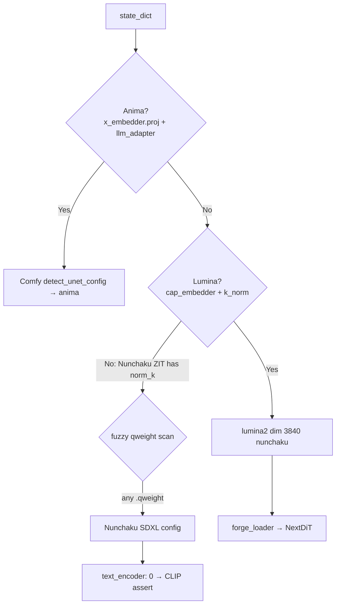
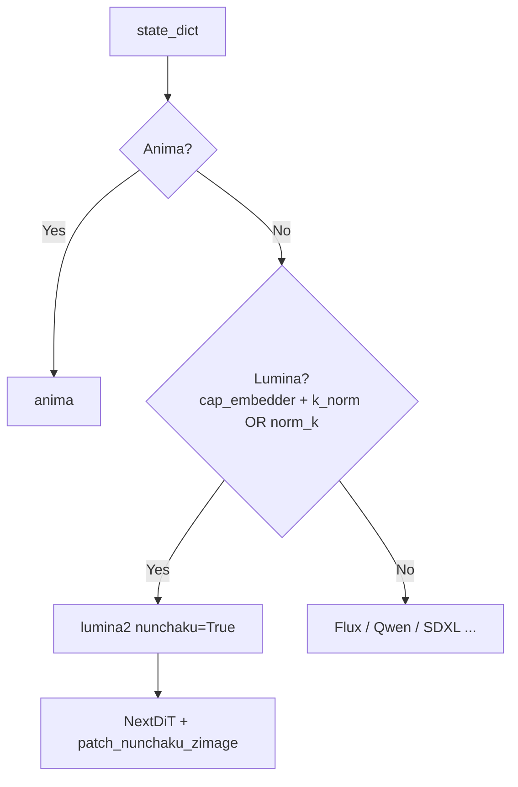

<table align="center">
  <tr>
    <td align="center" bgcolor="#e5e7eb" width="88" height="36"><a href="https://github.com/ussoewwin/Stable-Diffusion-WebUI-Forge-Nunchaku/releases/tag/v1.7.2"><font color="#4b5563"><b>EN</b></font></a></td>
    <td align="center" bgcolor="#d4465e" width="88" height="36"><font color="#ffffff"><b>中文</b></font></td>
  </tr>
</table>

# Z-Image / Nunchaku 检测回退修复

**产品：** Stable Diffusion WebUI Forge — Nunchaku  
**范围：** Anima 合入 v1.7.1 后 **Nunchaku Z-Image Turbo** 的 UNet 检测修复。  
**不在范围内：** Lumina Comfy import Step 1（[`LUMINA_ZIMAGE_COMFY_IMPORT_PLAN.md`](../docs/LUMINA_ZIMAGE_COMFY_IMPORT_PLAN.md)）。

---

## 目录

1. [摘要](#1-摘要)
2. [症状](#2-症状)
3. [根本原因（git 历史）](#3-根本原因git-历史)
4. [为何 k_norm 与 norm_k 重要](#4-为何-k_norm-与-norm_k-重要)
5. [检测流程（修复前）](#5-检测流程修复前)
6. [修复（相对 v1.7.1 tag 的单处 diff）](#6-修复相对-v171-tag-的单处-diff)
7. [检测流程（修复后）](#7-检测流程修复后)
8. [未改动的部分](#8-未改动的部分)
9. [Anima 误检防护仍然有效](#9-anima-误检防护仍然有效)
10. [检测成功后的加载路径](#10-检测成功后的加载路径)
11. [验证](#11-验证)
12. [独立问题：Comfy import 回退](#12-独立问题comfy-import-回退)
13. [参考](#13-参考)

---

## 1. 摘要

Anima 支持加入时（`a8f6373`），Lumina2 / Z-Image **入口检测** 要求 `noise_refiner.k_norm`。  
**Nunchaku Z-Image Turbo** checkpoint 使用 **`norm_k`**，不再匹配 Lumina 检测，因而落入 **Nunchaku SDXL** 模糊检测。

**修复：** 在 `detection.py` 的 Lumina 入口 `if` 中，将 `norm_k` 作为 `k_norm` 的替代条件——**仅改一处**。  
v1.7.1 的 Lumina 块主体、Anima 块、模糊 SDXL 块均未改动。

---

## 2. 症状

以独立 UNet checkpoint 加载 Nunchaku Z-Image Turbo 时：

```
[Detection] Detected Nunchaku SDXL (fuzzy qweight match)
[Detection] Detected Nunchaku SDXL (fuzzy qweight match)
StateDict Keys: {'unet': 1235, 'vae': 244, 'text_encoder': 0, 'text_encoder_2': 0, 'ignore': 0}
AssertionError: You do not have CLIP state dict!
```

| 日志行 | 含义 |
|--------|------|
| `Nunchaku SDXL (fuzzy qweight match)` | 未检测到 Lumina / Z-Image；任意 `.qweight` 键触发 SDXL Nunchaku |
| `text_encoder: 0` | 无 SDXL CLIP 键（Z-Image 使用单独的 Qwen3 TE） |
| `You do not have CLIP state dict!` | 加载器期望 SDXL CLIP state dict |

**示例配置：**

| 组件 | 示例 |
|------|------|
| UNet | `svdq-fp4_r128-z-image-turbo.safetensors` |
| 文本编码器 | Qwen3 4B safetensors（Additional module） |
| VAE | zImageBase VAE |

---

## 3. 根本原因（git 历史）

| 阶段 | Commit | Lumina 入口条件 | Nunchaku ZIT |
|------|--------|-----------------|--------------|
| Anima 之前 | `a8f6373^` | 仅 `cap_embedder.1.weight` | 正常 |
| Anima 加入 | `a8f6373` | `cap_embedder` + **`noise_refiner.k_norm`** | 损坏 |
| v1.7.1 tag | `v1.7.1`（`13ca02afd`） | 同上（仅 `k_norm`） | 损坏 |
| 本次修复后 | working tree | `k_norm` **或 `norm_k`** | 预期正常 |

**为何加入 `k_norm`（Anima）：** 将仅含 cap 的 Anima 系 ckpt（如 wai）排除在 Lumina2 之外。该防护正确；**未考虑** Nunchaku 导出的 **`norm_k`**。

---

## 4. 为何 k_norm 与 norm_k 重要

### 4.1 标准 NextDiT / Comfy

ComfyUI `comfy/model_detection.py` 同样要求 `k_norm`：

```python
if '{}cap_embedder.1.weight'.format(key_prefix) in state_dict_keys \
   and '{}noise_refiner.0.attention.k_norm.weight'.format(key_prefix) in state_dict_keys:
```

非 Nunchaku checkpoint 使用 `k_norm` 键名。

### 4.2 Nunchaku Z-Image Turbo 导出

Nunchaku 量化导出使用 **`norm_k` / `norm_q`**，而非 `k_norm` / `q_norm`。

`backend/nn/svdq.py` 在 **`patch_z_image_state_dict()`** 内于 **加载时** 重映射：

```python
elif "attention.norm_k" in key:
    patched_state_dict[key.replace("norm_k", "k_norm")] = value
```

**重要：** 重映射在 **`NextDiT.load_state_dict`** 中执行，位于检测之后。  
**`detect_unet_config()` 看到的是原始键**——无 `k_norm`，仅有 `norm_k` → v1.7.1 入口失败。

### 4.3 `cap_feat_dim`（相关，独立问题）

Z-Image Turbo HF 配置：

```json
"cap_feat_dim": 2560,
"dim": 3840
```

v1.7.1 Lumina 块始终从 `cap_embedder.1.weight` 设置（本次修复未改）：

```python
w = state_dict["{}cap_embedder.1.weight".format(key_prefix)]
dit_config["dim"] = int(w.shape[0])           # 3840
dit_config["cap_feat_dim"] = int(w.shape[1])  # 2560
```

**`cap_feat_dim` shape 不匹配**（5120 vs 2560）来自 **另一回退**（Comfy import 尝试删除 v1.7.1 块后缺少 post-merge 字段）。**不能**仅靠本次 `norm_k` 修改解决。

---

## 5. 检测流程（修复前）



---

## 6. 修复（相对 v1.7.1 tag 的单处 diff）

**文件：** `modules_forge/packages/huggingface_guess/detection.py`  
**位置：** Lumina2 入口 `if`，紧接 Anima early return 之后。

### 6.1 v1.7.1（Nunchaku ZIT 损坏）

```python
if (
    "{}cap_embedder.1.weight".format(key_prefix) in state_dict_keys
    and "{}noise_refiner.0.attention.k_norm.weight".format(key_prefix) in state_dict_keys
):
```

### 6.2 修复后

```python
if (
    "{}cap_embedder.1.weight".format(key_prefix) in state_dict_keys
    and (
        "{}noise_refiner.0.attention.k_norm.weight".format(key_prefix) in state_dict_keys
        or "{}noise_refiner.0.attention.norm_k.weight".format(key_prefix) in state_dict_keys
    )
):
```

### 6.3 验证 diff

```bash
git diff v1.7.1 -- modules_forge/packages/huggingface_guess/detection.py
```

应仅出现添加 `or ... norm_k ...` 的三行。

### 6.4 Lumina 块主体（约 63–125 行）

相对 v1.7.1 **未改动**，包括：

- `cap_feat_dim`、`dim`、`n_layers`、`qk_norm`
- `dim == 2304`（Lumina2）、`3840`（Z-Image + `nunchaku`）、`1920`（Z-Image Base）
- Distilled FFN（`ffn_input_dim == 1920`）
- 从 `feed_forward.w1` 推断 `ffn_dim_multiplier`

---

## 7. 检测流程（修复后）



Nunchaku ZIT 不再进入模糊 SDXL 检测。

---

## 8. 未改动的部分

| 项目 | 状态 |
|------|------|
| Anima early return（49–54 行） | v1.7.1 未改 |
| Lumina 块主体 | v1.7.1 未改 |
| 模糊 Nunchaku SDXL 块（约 200 行起） | v1.7.1 未改 |
| `lumina_detection_merge.py` | 不存在（Comfy import Step 1 未做） |
| `backend/nn/comfy_ldm/lumina/*` | 自 v1.7.1 恢复 |
| `gemma_engine.py` / `qwen3_engine.py` | v1.7.1 未改 |
| ComfyUI-master | 未编辑 |

**刻意未做：** 在模糊 SDXL 内添加 Z-Image 排除——修复 Lumina 入口已足够，且避免影响 SDXL / Qwen / Flux 检测。

---

## 9. Anima 误检防护仍然有效

| Checkpoint | 键 | 结果 |
|------------|-----|------|
| Anima（主） | `x_embedder.proj.1.weight` + `llm_adapter.*` | Anima early return |
| Anima wai（仅 cap） | 仅 `cap_embedder`，无 `noise_refiner` | Lumina **否** |
| 标准 Lumina2 / Z-Image | `cap_embedder` + `k_norm` | Lumina **是** |
| Nunchaku Z-Image Turbo | `cap_embedder` + `norm_k` | Lumina **是**（本次修复） |

**未** 回退到 Anima 之前仅 `cap_embedder` 的入口（那会再次破坏 wai 区分）。

---

## 10. 检测成功后的加载路径

1. `modules/sd_models.py` → `forge_model_reload()`
2. `backend/loader.py` → `split_state_dict()` → `huggingface_guess.guess()`
3. `detection.detect_unet_config()` → `image_model: lumina2`、`dim: 3840`、`nunchaku: True`
4. `model_list.ZImage` 匹配（`dim == 3840`）
5. `load_huggingface_component()` → `comfy.ldm.lumina.model.NextDiT`
6. Nunchaku：`patch_nunchaku_zimage()` → `patch_z_image_state_dict()`（`norm_k` → `k_norm`）
7. TE：`qwen3_4b` Additional module

---

## 11. 验证

### 11.1 成功标准

- 日志 **不** 出现 `[Detection] Detected Nunchaku SDXL`
- `StateDict Keys` 中 **`text_encoder` > 0**
- txt2img 启动无 UNet shape 不匹配

### 11.2 回退检查

| 模型 | 预期 |
|------|------|
| Anima | 与之前相同，正常加载 |
| 标准 Z-Image（非 Nunchaku，`k_norm`） | 与之前相同，正常加载 |
| Nunchaku SDXL | 模糊检测仍正常 |
| Lumina2（dim 2304） | 与之前相同，正常加载 |

---

## 12. 独立问题：Comfy import 回退

| | 本次修复（Anima 回退） | Comfy import 尝试（已回滚） |
|--|------------------------|----------------------------|
| 原因 | `a8f6373` Lumina 入口仅 `k_norm` | 删除 v1.7.1 块；Comfy 委托无 post-merge |
| 症状 | SDXL 误检 / CLIP assert | `cap_feat_dim` 5120 vs 2560 shape 不匹配 |
| 修复 | 入口添加 `norm_k` OR | Step 1：Comfy 委托 **+** 保留 v1.7.1 post-merge |

**勿混淆** 这一行检测修复与 Lumina Comfy import Step 1。

---

## 13. 参考

| 类型 | 参考 |
|------|------|
| 回退引入 | `a8f6373` — feat: add Anima support with native Forge pipeline |
| 末次正常 ZIT 检测 | `a8f6373^` |
| v1.7.1 tag | `v1.7.1` → `13ca02afd` |
| 改动文件 | `modules_forge/packages/huggingface_guess/detection.py`（仅入口） |
| Nunchaku 重映射 | `backend/nn/svdq.py` — `patch_z_image_state_dict()` |
| DiT 加载器 | `backend/loader.py` — `Lumina2Transformer2DModel` / `ZImageTransformer2DModel` |
| HF 配置 | `backend/huggingface/Tongyi-MAI/Z-Image-Turbo/transformer/config.json` |
| 后续计划 | `docs/LUMINA_ZIMAGE_COMFY_IMPORT_PLAN.md` |

---

**修订：** 2026-06-04  
**状态：** working tree — Lumina 入口已添加 `norm_k` OR（v1.7.1 + 3 行）
