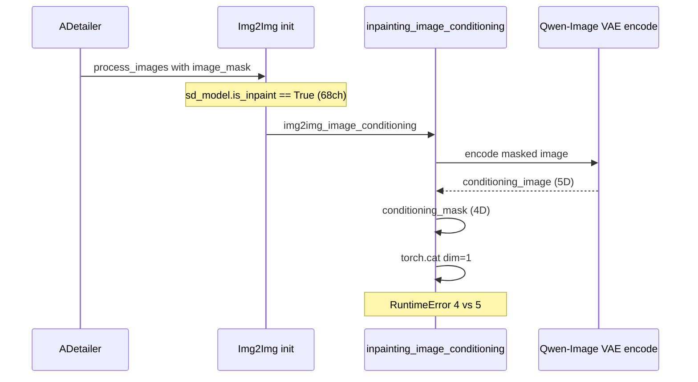
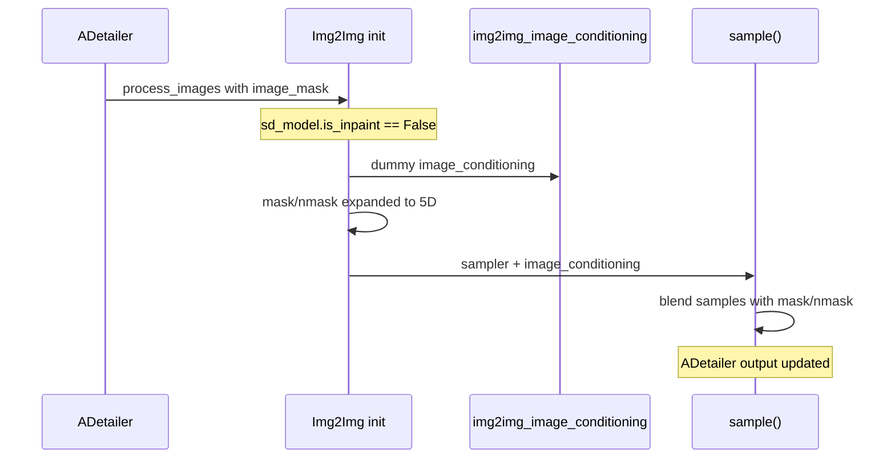

<table align="center">
  <tr>
    <td align="center" bgcolor="#e5e7eb" width="88" height="36"><a href="https://github.com/ussoewwin/Stable-Diffusion-WebUI-Forge-Nunchaku/releases/tag/v1.7.7"><font color="#4b5563"><b>EN</b></font></a></td>
    <td align="center" bgcolor="#3478ca" width="88" height="36"><font color="#ffffff"><b>中文</b></font></td>
  </tr>
</table>

## 1. 现象与错误信息

主图 **txt2img** 可正常完成。在 **ADetailer** 后处理阶段（通过 img2img 进行面部/身体精炼）时，生成中止并报错：

```text
RuntimeError: Tensors must have same number of dimensions: got 4 and 5
```

典型堆栈（缩写）：

```text
File "modules/processing.py", line 363, in inpainting_image_conditioning
    image_conditioning = torch.cat([conditioning_mask, conditioning_image], dim=1)
```

观测条件：

- 模型：`waiANIMA_pw3.safetensors`（识别为 `AnimaWai68`，`in_channels: 68`）
- 扩展：ADetailer（`extensions-builtin/adetailer`）
- 主生成：正常；在每个检测区域上的**第二次** img2img 阶段失败

---

## 2. 错误的表面含义

`torch.cat(..., dim=1)` 要求每个张量具有**相同的秩**（维度数量）。

在失败的调用中：

| 张量 | 典型形状（Anima / Qwen-Image VAE） | 秩 |
|--------|----------------------------------|------|
| `conditioning_mask`（经 `interpolate` + `expand` 后） | `(B, C_mask, H, W)` | **4** |
| `conditioning_image`（编码后的 masked latent） | `(B, C, T, H, W)` | **5** |

Qwen-Image VAE latent 包含**时间/帧**轴 `T`（即使 `T=1`），因此编码后的张量为 5D。旧版 WebUI inpainting 路径构建 **4D** mask，并在通道维 `1` 上拼接，而不对齐秩 → PyTorch 抛出 `got 4 and 5`。

这不是随机的张量 bug；而是以下两者之间的**契约不匹配**：

1. **SD 1.x / SDXL inpainting**（4D latent，额外通道拼接到 UNet 输入），以及
2. **Anima + Qwen-Image VAE**（5D latent，在 Forge 中以不同方式处理 inpainting）。

---

## 3. 根本原因（端到端链条）

### 3.1. `AnimaWai68` 因通道数被归类为「inpaint 模型」

在 `modules_forge/packages/huggingface_guess/model_list.py` 中，`BASE.inpaint_model()` 为：

```python
def inpaint_model(self):
    return self.unet_config.get("in_channels", -1) > 4
```

`AnimaWai68` 定义为：

```python
class AnimaWai68(AnimaBase):
    """Anima with 68 input channels (e.g. waiANIMA_pw3)."""

    unet_config = {
        "image_model": "anima",
        "model_channels": 2048,
        "in_channels": 68,
    }
```

因此对于 `waiANIMA_pw3`，`68 > 4` → **`inpaint_model()` 返回 `True`**。

该标志在 `ForgeDiffusionEngine.__init__` 中被复制到已加载的 diffusion 引擎：

```python
# backend/diffusion_engine/base.py
self.is_inpaint = estimated_config.inpaint_model()
```

修复前，**`Anima` 未覆盖** `self.is_inpaint`，因此 Anima 对 68 通道检查点继承了 `True`。

**重要细节：** 68 个输入通道是 **Anima 原生 UNet 输入宽度**（架构），而非「此检查点是期望在 latent 上进行 mask+image concat 的 AUTOMATIC1111 SD inpainting 模型」。同样的 `in_channels > 4` 启发式对经典 SD inpaint 检查点是正确的，但对 **AnimaWai68** 具有**误导性**。

### 3.2. ADetailer 始终带 mask 驱动 img2img

ADetailer 内部循环（`extensions-builtin/adetailer/scripts/!adetailer.py`）：

1. 通过 `get_i2i_p()` 构建 `StableDiffusionProcessingImg2Img`。
2. 对每个检测，设置 `p2.image_mask = masks[j]` 并调用 `process_images(p2)`。

因此每个精炼步骤都是**带 mask 的 img2img**，即使用户未在主任务中手动启用 inpainting。

### 3.3. `is_inpaint=True` 强制走 legacy concat 路径

在 `modules/processing.py` 中，`StableDiffusionProcessingImg2Img.init()` 以如下代码结束：

```python
self.image_conditioning = self.img2img_image_conditioning(
    image * 2 - 1, self.init_latent, image_mask, self.mask_round
)
```

`img2img_image_conditioning()` 分支：

```python
if self.sd_model.is_inpaint:
    return self.inpainting_image_conditioning(...)
# else: dummy zero conditioning (4D-friendly placeholder)
return latent_image.new_zeros(latent_image.shape[0], 5, 1, 1)
```

当 `is_inpaint` 为 `True` 时，会执行 **`inpainting_image_conditioning()`**。该函数假定 **SD 风格 inpainting**：

- 构建与 **4D** `source_image` / latent 布局对齐的 mask 张量。
- 编码 masked 图像 → `conditioning_image`，在 **SD inpaint 设计**中与 `latent_image` 具有相同秩（4D）。
- `torch.cat([conditioning_mask, conditioning_image], dim=1)` → 用于 `c_concat` 的额外通道。

对 Anima，`encode_first_stage` / Qwen-Image VAE 产生 **5D** `conditioning_image`，而 mask 准备仍产生 **4D** `conditioning_mask` → 在**第 363 行崩溃**。

### 3.4. `init()` 中的 mask 处理已支持 5D — concat 路径不支持

同一 `StableDiffusionProcessingImg2Img.init()` **确实**在 `init_latent` 为 5D 时扩展 `self.mask` / `self.nmask`：

```python
if len(self.mask.shape) != len(self.init_latent.shape):
    x_dims = self.init_latent.dim()
    if x_dims == 4:
        self.nmask = self.nmask[None, :, :, :]
        self.mask = self.mask[None, :, :, :]
    elif x_dims == 5:
        self.nmask = self.nmask[None, :, None, :, :]
        self.mask = self.mask[None, :, None, :, :]
```

随后，`sample()` 使用这些 mask 进行混合（对 Qwen-Image VAE 有效）：

```python
if self.mask is not None:
    blended_samples = samples * self.nmask + self.init_latent * self.mask
```

因此 **Forge 早已知道** Anima/Qwen-Image VAE 对**带 mask 的 img2img 混合**使用 5D latent；只有 **WebUI legacy inpaint concat** 路径不兼容。bug 是「错误标志 → 错误分支」，而非「Anima 完全不能 inpaint」。

### 3.5. 一句话概括根本原因

**`AnimaWai68` 因通道数启发式被标记为 `is_inpaint=True`，因此 ADetailer 的 img2img 在 5D Qwen-Image VAE latent 上调用了 SD 风格的 `inpainting_image_conditioning`，导致 4D 与 5D 的 `torch.cat` 失败。**

---

## 4. 为何其他 Forge 引擎未受影响

多个非 SD 引擎在 `super().__init__()` 之后**已经**设置 `self.is_inpaint = False`，原因同类（非 WebUI SD inpaint concat）：

| 引擎文件 | 行号（约） |
|-------------|----------------|
| `backend/diffusion_engine/qwen.py` | `self.is_inpaint = False` |
| `backend/diffusion_engine/lumina.py` | `self.is_inpaint = False` |
| `backend/diffusion_engine/flux.py` | `self.is_inpaint = False` |
| `backend/diffusion_engine/chroma.py` | `self.is_inpaint = False` |
| `backend/diffusion_engine/zimage.py` | `self.is_inpaint = False` |

**Anima 缺少此覆盖**，因此只有 Anima（尤其是 `AnimaWai68` / 68ch）命中 legacy 路径。

真正使用 SD/SDXL inpaint concat 的模型仍从 `base.py` 保持 `is_inpaint=True`，未受影响。

---

## 5. 修复：完整新增代码

**文件：** `backend/diffusion_engine/anima.py`  
**提交：** `9c85472` — `fix-Anima-ADetailer-disable-WebUI-inpaint-concat`  
**范围：** 仅类 `Anima`（`matched_guesses`：`Anima`、`AnimaBase`、`AnimaWai68`）。未修改共享的 `processing.py`、`base.py` 或 ADetailer。

### 5.1. 精确变更

在 `Anima.__init__` 中、`super().__init__(...)` 之后立即新增一行：

```python
class Anima(ForgeDiffusionEngine):
    """Forge glue only: Comfy ``Anima`` UNet + Comfy ``sd.CLIP`` (Anima TE)."""

    matched_guesses = [model_list.Anima, model_list.AnimaBase, model_list.AnimaWai68]

    def __init__(self, estimated_config, huggingface_components):
        super().__init__(estimated_config, huggingface_components)
        self.is_inpaint = False

        clip = huggingface_components["text_encoder"]
        # ... remainder of __init__ unchanged ...
```

### 5.2. 修复后的完整 `__init__`（供审计）

```python
def __init__(self, estimated_config, huggingface_components):
    super().__init__(estimated_config, huggingface_components)
    self.is_inpaint = False

    clip = huggingface_components["text_encoder"]

    vae = VAE(model=huggingface_components["vae"], is_wan=True)
    vae.first_stage_model.latent_format = self.model_config.latent_format

    k_predictor = PredictionDiscreteFlow(estimated_config)

    unet = UnetPatcher.from_model(
        model=huggingface_components["transformer"],
        diffusers_scheduler=None,
        k_predictor=k_predictor,
        config=estimated_config,
    )

    self.text_processing_engine_anima = AnimaTextProcessingEngine(clip)

    self.forge_objects = ForgeObjects(unet=unet, clip=clip, vae=vae, clipvision=None)
    self.forge_objects_original = self.forge_objects.shallow_copy()
    self.forge_objects_after_applying_lora = self.forge_objects.shallow_copy()

    self.is_wan = True
    self.use_shift = True
```

---

## 6. `self.is_inpaint = False` 的作用（行为含义）

### 6.1. 禁用 WebUI SD inpaint **concat** 条件

当 `is_inpaint=False` 时，`img2img_image_conditioning()` **不会**调用 `inpainting_image_conditioning()`。它返回一个小的 dummy 张量：

```python
return latent_image.new_zeros(latent_image.shape[0], 5, 1, 1)
```

`backend/sampling/sampling_function.py` 中的 `sampling_function` 仅在 **`is_inpaint` 为 True** 且形状通过 4D 风格检查时，才从 `image_cond` 向 `c_concat` 喂入数据：

```python
if isinstance(image_cond_in, torch.Tensor) and self.inner_model.inner_model.is_inpaint:
    if image_cond_in.shape[0] == x.shape[0] and image_cond_in.shape[2] == x.shape[2] and image_cond_in.shape[3] == x.shape[3]:
        # attach c_concat to cond / uncond
```

对 Anima，`is_inpaint=False` → 通过 WebUI legacy 路径**不会**将 mask+image 通道 concat 进 UNet。这与 Qwen/Lumina/Flux 在 Forge 上的运行方式一致。

### 6.2. ADetailer img2img 仍能正确应用 mask

ADetailer 继续：

1. 在 `StableDiffusionProcessingImg2Img` 上设置 `image_mask`。
2. 运行 `init()` → 构建 `init_latent`（Wan 为 5D），必要时将 `mask`/`nmask` 扩展为 5D。
3. 运行 `sample()` → **latent 混合** `samples * nmask + init_latent * mask`。

因此区域精炼是**「在 mask 内去噪，mask 外保持」**，通过混合实现，而非通过 SD inpaint UNet 额外通道。这是 flow/Wan 引擎在 Forge 上的预期路径。

### 6.3. **未**改动的部分

| 区域 | 效果 |
|------|--------|
| 其他模型（SD1、SDXL、真正的 inpaint 检查点） | 未改动；仍使用 `base.py` 默认 `is_inpaint`。 |
| `processing.py` | 未改动；共享代码中无全局 5D 补丁。 |
| `huggingface_guess` / `AnimaWai68` 配置 | 未改动；`in_channels: 68` 仍正确用于架构检测。 |
| Anima UNet、VAE、文本编码器 | 未改动。 |
| Anima 主 txt2img | 未改动（txt2img 已按情况使用非 inpaint 或 dummy conditioning 路径）。 |

这满足**不影响其他模型**的要求：仅 `Anima` 引擎实例在加载后翻转该标志。

---

## 7. 流程图

### 7.1. 修复前（失败）



### 7.2. 修复后（成功）



---

## 8. 相关代码引用（供读者查阅）

| 主题 | 位置 |
|-------|----------|
| `is_inpaint` 默认值 | `backend/diffusion_engine/base.py` — `ForgeDiffusionEngine.__init__` |
| Inpaint 标志启发式 | `modules_forge/packages/huggingface_guess/model_list.py` — `BASE.inpaint_model()` |
| `AnimaWai68` 68 通道 | `model_list.py` — class `AnimaWai68` |
| Legacy concat | `modules/processing.py` — `inpainting_image_conditioning`、`img2img_image_conditioning` |
| 5D mask 扩展 | `modules/processing.py` — `StableDiffusionProcessingImg2Img.init`（约 1880–1887 行） |
| Latent mask 混合 | `modules/processing.py` — `StableDiffusionProcessingImg2Img.sample`（约 1922–1930 行） |
| ADetailer img2i 设置 | `extensions-builtin/adetailer/scripts/!adetailer.py` — `get_i2i_p`、`_postprocess_image_inner` |
| `c_concat` 门控 | `backend/sampling/sampling_function.py` — `sampling_function` |

---

## 9. 验证

部署提交 `9c85472` 后：

1. 加载 `waiANIMA_pw3.safetensors`（或其他 `AnimaWai68` 权重）。
2. 启用 ADetailer 生成（存在检测目标）。
3. **预期：** 主图完成；每个 ADetailer img2img 步骤完成，无 `got 4 and 5`。
4. **预期：** 其他架构（SDXL、Flux、Qwen 等）行为与之前一致。

用户已确认：使用此修复后**运行成功**。

---

## 10. 设计要点

- **`in_channels > 4`** 在 `huggingface_guess` 中表示「UNet 期望超过 4 个输入通道」，对**经典 SD** 意味着 **inpaint concat**。
- 对 **AnimaWai68**，68 通道描述的是**模型架构**，而非 WebUI inpaint 语义。
- Forge 上现代 flow/Wan 引擎的正确模式是：**引擎侧 `is_inpaint = False`** + 存在 mask 时 **在 img2img `sample()` 中进行 mask 混合**。
- Anima 现已与 Qwen、Lumina、Flux、Chroma、ZImage 采用相同模式。

---

## 11. 更新日志条目（建议）

在项目 changelog 中记录时：

- **Fix：** Anima + ADetailer img2img — 设置 `Anima.is_inpaint = False`，避免在 5D Qwen-Image VAE latent 上使用 SD 风格 latent concat（`AnimaWai68` / `waiANIMA_pw3`）。
- **Commit：** `9c85472`
